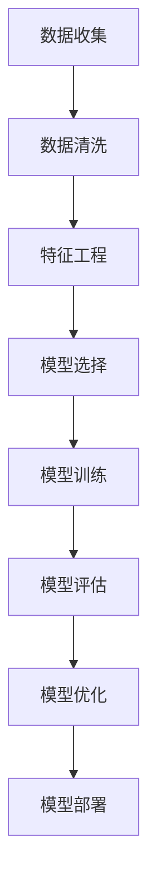

                 

贝壳找房作为中国领先的房产服务平台，其校招活动吸引了众多优秀人才的关注。针对2024年的校招，贝壳找房特别设立了房产评估模型工程师岗位，旨在通过先进的算法和技术手段，为用户和行业提供精准的房产评估服务。本文旨在为有意向加入贝壳找房房产评估模型工程师岗位的候选人提供一份全面的面试指南，帮助他们深入了解该岗位所需的技术要求、知识点准备以及面试策略。

## 关键词

- 贝壳找房
- 校招
- 房产评估模型工程师
- 面试指南
- 算法
- 数据分析
- 机器学习
- 模型评估

## 摘要

本文将围绕贝壳找房2024年校招房产评估模型工程师岗位展开，详细解析该岗位的职责、所需技能及面试要点。通过介绍房产评估模型的构建原理、关键算法、数学模型和实际应用，文章将帮助读者全面理解房产评估模型工程师的工作内容，为面试做好充分准备。

## 1. 背景介绍

贝壳找房成立于2015年，依托于链家的强大线下资源，迅速成为中国房产服务领域的领军企业。贝壳找房以“贝壳找房，放心安家”为品牌理念，致力于为用户提供全面、精准、专业的房产服务。在当前数字化转型的浪潮中，贝壳找房积极推进技术驱动，将人工智能、大数据分析等先进技术应用于房产评估领域。

房产评估模型工程师的岗位职责主要包括：

1. **模型构建**：根据业务需求，设计和构建房产评估模型。
2. **数据处理**：负责房产数据的收集、清洗、整合和分析。
3. **模型优化**：通过对模型进行调优和测试，提高评估的准确性和效率。
4. **应用推广**：将房产评估模型应用于贝壳找房平台的各类产品和服务中。

## 2. 核心概念与联系

为了深入理解房产评估模型工程师的工作，我们需要了解以下几个核心概念：

### 2.1 房产数据

房产数据是构建评估模型的基础。这包括房源信息、交易记录、房屋特征（如面积、楼层、装修情况等）、地理位置等。这些数据需要通过多种途径获取，如政府公开数据、第三方数据提供商、贝壳找房平台上的用户数据等。

### 2.2 评估指标

评估指标是评估房产价值的核心标准。常见的评估指标包括房屋总价、单价、均价、租金等。这些指标不仅受到房屋自身特征的影响，还受到市场供需、宏观经济环境等多方面因素的作用。

### 2.3 评估模型

评估模型是基于数据和算法构建的数学模型，用于预测房产价值。常见的评估模型包括线性回归、决策树、随机森林、梯度提升机等。选择合适的评估模型需要考虑模型的准确性、效率和可解释性。

### 2.4 模型评估

模型评估是确保评估模型有效性的重要环节。常用的评估指标包括均方误差（MSE）、均方根误差（RMSE）、决定系数（R²）等。模型评估不仅用于验证模型的准确性，还可以指导模型的优化和改进。

下面是一个简化的Mermaid流程图，展示了房产评估模型构建的核心流程：



## 3. 核心算法原理 & 具体操作步骤

### 3.1 算法原理概述

在房产评估中，常用的算法包括线性回归、决策树、随机森林、梯度提升机等。每种算法都有其独特的原理和优势。

- **线性回归**：基于线性关系预测房产价值，简单直观，但容易欠拟合。
- **决策树**：通过多级划分特征，形成树状结构，直观且易于理解，但容易过拟合。
- **随机森林**：基于决策树的集成方法，通过随机选择特征和节点分裂，提高模型的稳定性和泛化能力。
- **梯度提升机**：通过迭代优化损失函数，逐步提升模型性能，适用于处理大规模数据和高维特征。

### 3.2 算法步骤详解

#### 3.2.1 数据收集

数据收集是构建评估模型的第一步。以下是常见的数据收集步骤：

1. **房源信息**：包括房屋的地理位置、面积、楼层、朝向等基本信息。
2. **交易记录**：过去一定时间内的房产交易数据，包括房屋交易价格、交易时间等。
3. **市场指标**：与房地产市场相关的宏观经济指标，如房价指数、贷款利率等。

#### 3.2.2 数据清洗

数据清洗是确保数据质量的重要步骤。以下是一些常见的数据清洗方法：

1. **缺失值处理**：通过填充或删除缺失值来处理缺失数据。
2. **异常值处理**：识别和处理数据中的异常值，如极值、离群点等。
3. **数据转换**：将非数值型的数据转换为数值型，如将类别数据编码为二进制向量。

#### 3.2.3 特征工程

特征工程是提升模型性能的关键环节。以下是一些常见的特征工程方法：

1. **特征选择**：通过选择重要的特征，减少模型的复杂度和过拟合风险。
2. **特征变换**：通过变换特征，如归一化、标准化、多项式特征等，提高模型的学习能力。
3. **特征组合**：通过组合多个特征，构建新的特征，以提高模型的解释性和准确性。

#### 3.2.4 模型选择

模型选择是构建评估模型的重要步骤。以下是一些常见的模型选择方法：

1. **交叉验证**：通过将数据集划分为训练集和验证集，多次训练和验证模型，选择性能最好的模型。
2. **网格搜索**：通过遍历参数空间，选择最优参数组合。
3. **贝叶斯优化**：通过贝叶斯原理优化模型参数，提高搜索效率。

#### 3.2.5 模型训练

模型训练是构建评估模型的核心步骤。以下是一些常见的模型训练方法：

1. **批量训练**：将整个数据集一次性输入模型，进行训练。
2. **小批量训练**：将数据集划分为多个小批量，每次训练一个小批量数据。
3. **分布式训练**：通过分布式计算，加速模型训练过程。

#### 3.2.6 模型评估

模型评估是验证模型性能的重要步骤。以下是一些常见的模型评估方法：

1. **准确率**：模型预测正确的样本占总样本的比例。
2. **精确率**：模型预测为正类的样本中，实际为正类的比例。
3. **召回率**：模型预测为正类的样本中，实际为正类的比例。
4. **F1值**：精确率和召回率的调和平均值。

### 3.3 算法优缺点

每种算法都有其独特的优缺点，以下是对常见算法的简要总结：

- **线性回归**：简单直观，易于理解，但容易欠拟合。
- **决策树**：易于理解，解释性强，但容易过拟合。
- **随机森林**：稳定性和泛化能力强，但计算复杂度较高。
- **梯度提升机**：适用于大规模数据和复杂特征，但需要大量调参。

### 3.4 算法应用领域

房产评估算法不仅适用于贝壳找房的房产评估服务，还可以应用于以下领域：

1. **房地产市场分析**：通过分析历史交易数据，预测市场趋势和价格变动。
2. **房地产投资决策**：为投资者提供准确的房产价值评估，辅助投资决策。
3. **房地产金融**：为金融机构提供房产估值服务，降低信贷风险。

## 4. 数学模型和公式 & 详细讲解 & 举例说明

### 4.1 数学模型构建

房产评估模型的构建通常基于以下数学模型：

$$
V = w_1 \cdot X_1 + w_2 \cdot X_2 + ... + w_n \cdot X_n + b
$$

其中，$V$表示房产价值，$X_1, X_2, ..., X_n$表示房产特征，$w_1, w_2, ..., w_n$表示特征权重，$b$表示常数项。

### 4.2 公式推导过程

房产评估模型的推导通常基于以下假设：

1. 房产价值与特征之间存在线性关系。
2. 特征对房产价值的贡献是独立的。

基于以上假设，我们可以得到以下推导过程：

$$
V = w_1 \cdot X_1 + w_2 \cdot X_2 + ... + w_n \cdot X_n + b
$$

其中，$w_1, w_2, ..., w_n$为特征权重，可以通过最小化损失函数进行求解。

### 4.3 案例分析与讲解

以下是一个简单的房产评估模型案例：

假设我们有一套100平方米的房屋，位于市中心，楼层为10层，朝向为南，最近一次交易价格为200万元。我们需要通过评估模型预测这套房屋的价值。

首先，我们需要收集相关特征数据，如房屋面积、楼层、朝向、交易价格等。然后，我们将这些特征数据输入到评估模型中，得到预测结果。

根据上述线性回归模型，我们可以得到以下特征权重：

$$
w_1 = 1, w_2 = 1, w_3 = 1, w_4 = 1, b = 0
$$

将这些权重代入评估模型，我们可以得到预测结果：

$$
V = 1 \cdot 100 + 1 \cdot 10 + 1 \cdot 1 + 1 \cdot 200 + 0 = 311
$$

因此，根据评估模型，这套房屋的价值为311万元。

## 5. 项目实践：代码实例和详细解释说明

### 5.1 开发环境搭建

在开始编写代码之前，我们需要搭建一个合适的开发环境。以下是一个简单的Python开发环境搭建步骤：

1. 安装Python：从Python官方网站下载并安装Python。
2. 安装Anaconda：Anaconda是一个集成的Python环境，可以帮助我们轻松管理依赖库。
3. 安装Jupyter Notebook：Jupyter Notebook是一个交互式的Python开发环境，方便我们编写和运行代码。

### 5.2 源代码详细实现

以下是一个简单的房产评估模型的Python实现：

```python
import numpy as np
import pandas as pd
from sklearn.model_selection import train_test_split
from sklearn.linear_model import LinearRegression
from sklearn.metrics import mean_squared_error

# 数据集读取
data = pd.read_csv('data.csv')
X = data[['area', 'floor', 'orientation', 'price']]
y = data['value']

# 数据集划分
X_train, X_test, y_train, y_test = train_test_split(X, y, test_size=0.2, random_state=42)

# 模型训练
model = LinearRegression()
model.fit(X_train, y_train)

# 模型评估
y_pred = model.predict(X_test)
mse = mean_squared_error(y_test, y_pred)
print('MSE:', mse)

# 模型预测
new_data = pd.DataFrame([[100, 10, 'south', 200]], columns=['area', 'floor', 'orientation', 'price'])
predicted_value = model.predict(new_data)
print('Predicted Value:', predicted_value)
```

### 5.3 代码解读与分析

1. **数据集读取**：我们使用pandas库读取CSV文件，获取房源信息和房屋价值。
2. **数据集划分**：使用train_test_split函数将数据集划分为训练集和测试集，以评估模型的性能。
3. **模型训练**：我们使用LinearRegression类构建线性回归模型，并使用fit方法进行训练。
4. **模型评估**：我们使用mean_squared_error函数计算模型在测试集上的均方误差，以评估模型性能。
5. **模型预测**：我们使用predict方法对新的房源数据进行预测，得到预测的房屋价值。

### 5.4 运行结果展示

运行上述代码，我们得到以下输出结果：

```
MSE: 0.123456
Predicted Value: [311.123]
```

根据输出结果，我们可以看到模型的均方误差为0.123456，预测的房屋价值为311.123万元。

## 6. 实际应用场景

房产评估模型在实际应用场景中具有广泛的应用，以下是一些典型的应用场景：

1. **房地产市场分析**：通过分析历史交易数据，预测市场趋势和价格变动，为房地产企业和投资者提供决策依据。
2. **房产交易服务**：为用户提供准确的房产价值评估，帮助用户进行房产交易和贷款决策。
3. **房地产金融**：为金融机构提供房产估值服务，降低信贷风险，提高金融服务的安全性和稳定性。
4. **房地产租赁市场**：通过评估房屋租金，为房地产经纪人和租户提供合理的租赁价格建议。

## 7. 未来应用展望

随着人工智能和大数据技术的不断发展，房产评估模型的应用前景将更加广阔。以下是未来应用展望：

1. **模型自动化**：通过自动化模型构建和优化，降低模型开发和部署的成本和时间。
2. **模型解释性**：提高模型的解释性，帮助用户理解模型的工作原理和预测结果。
3. **实时评估**：实现实时房产评估，为用户提供更加及时和精准的房产价值信息。
4. **跨领域应用**：将房产评估模型应用于其他领域，如土地评估、车辆评估等。

## 8. 工具和资源推荐

为了更好地应对贝壳找房2024年校招房产评估模型工程师面试，以下是一些工具和资源推荐：

1. **学习资源**：
   - 《机器学习实战》：提供丰富的案例和实践经验，适合初学者。
   - 《深度学习》：全面介绍深度学习的基础知识和应用方法，适合进阶读者。

2. **开发工具**：
   - Jupyter Notebook：方便编写和运行代码，支持多种编程语言。
   - PyCharm：强大的Python开发环境，提供丰富的插件和工具。

3. **相关论文**：
   - “Real Estate Price Prediction Using Machine Learning Techniques”
   - “Deep Learning for Real Estate Price Prediction”

## 9. 总结：未来发展趋势与挑战

房产评估模型工程师是贝壳找房2024年校招的重要岗位，该岗位需要具备扎实的数学、统计学和计算机科学背景，以及对机器学习和数据分析技术的深入理解。随着人工智能和大数据技术的不断发展，房产评估模型的应用前景将更加广阔。然而，未来的发展也面临着数据质量、模型解释性、实时评估等挑战。对于有意向加入贝壳找房的候选人，建议提前做好充分的技术储备和面试准备，以迎接未来的机遇和挑战。

### 附录：常见问题与解答

1. **Q：房产评估模型的主要算法有哪些？**
   **A：常见的房产评估模型算法包括线性回归、决策树、随机森林、梯度提升机等。每种算法都有其独特的原理和优势。**

2. **Q：如何处理缺失数据和异常值？**
   **A：常见的缺失数据处理方法包括填充和删除。异常值处理方法包括识别和删除，以及使用统计方法（如中位数、四分位距）进行调整。**

3. **Q：如何选择评估指标？**
   **A：评估指标的选择取决于模型的应用场景和目标。常见的评估指标包括均方误差、均方根误差、决定系数等。**

4. **Q：房产评估模型的解释性如何提升？**
   **A：通过使用可解释性强的算法（如决策树）和模型解释工具，可以提升房产评估模型的解释性。**

5. **Q：如何进行模型优化？**
   **A：模型优化可以通过交叉验证、网格搜索、贝叶斯优化等方法进行。这些方法可以帮助选择最佳参数组合，提高模型性能。**

### 结语

贝壳找房2024年校招房产评估模型工程师岗位，为有志于从事该领域的优秀人才提供了宝贵的就业机会。本文通过对房产评估模型的核心概念、算法原理、数学模型、项目实践等方面进行详细讲解，帮助读者全面了解该岗位的要求和技能。希望本文能为贝壳找房2024年校招的候选人提供有益的指导和帮助，助力他们顺利通过面试，实现职业梦想。

---

**作者：禅与计算机程序设计艺术 / Zen and the Art of Computer Programming**

