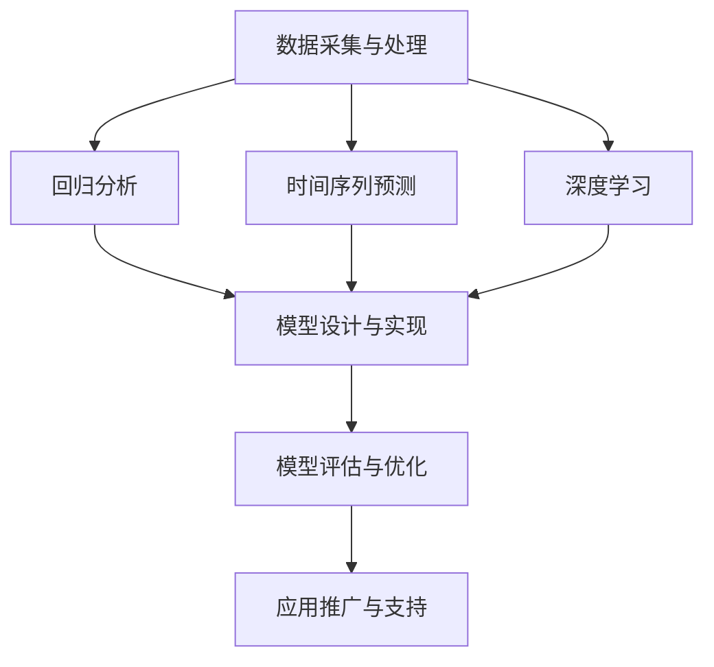

                 

关键词：贝壳找房、房产市场、预测模型、工程师面试、数据分析

摘要：本文针对贝壳找房2025房产市场预测模型工程师的社招面试题目，从背景介绍、核心概念与联系、核心算法原理、数学模型与公式、项目实践、实际应用场景、工具和资源推荐、总结与展望等方面进行详细解答，旨在为参加贝壳找房面试的应聘者提供有效的备考资料。

## 1. 背景介绍

贝壳找房作为我国知名的房产服务平台，致力于提供全面的房产信息和服务。随着我国房地产市场的不断发展和变化，预测市场趋势对于房产企业、投资者和购房者具有重要意义。2025年，贝壳找房面向社会招聘房产市场预测模型工程师，希望通过引入先进的人工智能技术和数据分析方法，为房产市场提供更加精准的预测分析。

本次招聘的房产市场预测模型工程师岗位，主要负责以下工作：

- **数据采集与处理**：收集房产市场相关的数据，包括房价、成交量、供需关系等，并进行数据清洗、预处理和特征提取。
- **模型设计与实现**：基于采集到的数据，设计和实现房产市场预测模型，包括回归分析、时间序列预测、深度学习等方法。
- **模型评估与优化**：对预测模型进行评估和优化，提高预测精度和稳定性。
- **应用推广与支持**：将预测模型应用到实际业务场景，为房产企业提供决策支持，并持续优化模型。

## 2. 核心概念与联系

在房产市场预测中，以下核心概念和方法是不可或缺的：

- **回归分析**：一种常见的统计方法，用于分析变量之间的线性关系，可用于预测房价。
- **时间序列预测**：基于历史时间序列数据，预测未来一段时间内的变量值，可用于预测房产成交量。
- **深度学习**：一种基于神经网络的学习方法，可用于处理复杂的非线性关系，提高预测精度。

下面是核心概念与联系的 Mermaid 流程图：



## 3. 核心算法原理 & 具体操作步骤

### 3.1 算法原理概述

在房产市场预测中，常用的算法包括回归分析、时间序列预测和深度学习。

- **回归分析**：基于历史数据，通过建立线性模型，预测目标变量的值。
- **时间序列预测**：基于时间序列数据，通过建立时间序列模型，预测未来时间点的目标变量值。
- **深度学习**：基于神经网络结构，通过多层非线性变换，提取数据特征并建立预测模型。

### 3.2 算法步骤详解

以下是各个算法的具体操作步骤：

#### 回归分析

1. 数据采集与处理：收集房价、成交量等历史数据，并进行数据清洗、预处理和特征提取。
2. 模型建立：根据数据特点，选择合适的回归模型，如线性回归、多项式回归等。
3. 模型训练：将数据分为训练集和测试集，使用训练集训练模型。
4. 模型评估：使用测试集评估模型性能，如R²、均方误差等。
5. 模型优化：根据评估结果，调整模型参数，提高预测精度。

#### 时间序列预测

1. 数据采集与处理：收集历史时间序列数据，如房产成交量、供需关系等。
2. 模型建立：选择合适的时间序列模型，如ARIMA、LSTM等。
3. 模型训练：使用训练集数据训练模型。
4. 模型评估：使用测试集评估模型性能。
5. 模型优化：根据评估结果，调整模型参数。

#### 深度学习

1. 数据采集与处理：收集大量标注数据，用于模型训练。
2. 模型设计：设计合适的神经网络结构，如卷积神经网络（CNN）、循环神经网络（RNN）等。
3. 模型训练：使用训练集数据训练模型。
4. 模型评估：使用测试集评估模型性能。
5. 模型优化：调整网络结构、学习率等参数，提高模型性能。

### 3.3 算法优缺点

#### 回归分析

- **优点**：简单易用，计算速度快。
- **缺点**：对非线性关系建模能力较弱。

#### 时间序列预测

- **优点**：能处理时间序列数据的时序特性。
- **缺点**：对数据质量要求较高，模型训练和预测过程较为复杂。

#### 深度学习

- **优点**：强大的建模能力，能处理复杂的非线性关系。
- **缺点**：模型训练过程较慢，对数据量和计算资源要求较高。

### 3.4 算法应用领域

#### 回归分析

- 房价预测、销售额预测等。

#### 时间序列预测

- 房产成交量预测、供需关系预测等。

#### 深度学习

- 房产市场分类、房产评估等。

## 4. 数学模型和公式 & 详细讲解 & 举例说明

### 4.1 数学模型构建

在房产市场预测中，常用的数学模型包括线性回归模型、时间序列模型和深度学习模型。

#### 线性回归模型

线性回归模型的一般形式为：

$$y = \beta_0 + \beta_1x_1 + \beta_2x_2 + ... + \beta_nx_n$$

其中，$y$为预测目标变量，$x_1, x_2, ..., x_n$为特征变量，$\beta_0, \beta_1, \beta_2, ..., \beta_n$为模型参数。

#### 时间序列模型

时间序列模型的一般形式为：

$$y_t = \phi_0 + \phi_1y_{t-1} + \phi_2y_{t-2} + ... + \phi_ky_{t-k} + \epsilon_t$$

其中，$y_t$为时间序列数据在$t$时刻的值，$\phi_0, \phi_1, \phi_2, ..., \phi_k$为模型参数，$\epsilon_t$为误差项。

#### 深度学习模型

深度学习模型的一般形式为：

$$y = f(\theta_0x_0 + \theta_1x_1 + \theta_2x_2 + ... + \theta_nx_n)$$

其中，$y$为预测目标变量，$x_0, x_1, x_2, ..., x_n$为特征变量，$\theta_0, \theta_1, \theta_2, ..., \theta_n$为模型参数，$f$为非线性激活函数。

### 4.2 公式推导过程

#### 线性回归模型

线性回归模型的公式推导过程如下：

1. 假设目标变量$y$与特征变量$x_1, x_2, ..., x_n$之间存在线性关系：

$$y = \beta_0 + \beta_1x_1 + \beta_2x_2 + ... + \beta_nx_n$$

2. 将数据表示为矩阵形式：

$$X = \begin{bmatrix} x_1 & x_2 & ... & x_n \end{bmatrix}, \quad y = \begin{bmatrix} y_1 \\ y_2 \\ ... \\ y_n \end{bmatrix}$$

3. 最小化目标函数：

$$J(\theta) = \frac{1}{2m}\sum_{i=1}^{m}(y_i - \theta_0 - \theta_1x_{i1} - \theta_2x_{i2} - ... - \theta_nx_{in})^2$$

4. 对$\theta_0, \theta_1, \theta_2, ..., \theta_n$求偏导，并令其等于0，得到：

$$\frac{\partial J(\theta)}{\partial \theta_0} = 0, \quad \frac{\partial J(\theta)}{\partial \theta_1} = 0, \quad ... , \quad \frac{\partial J(\theta)}{\partial \theta_n} = 0$$

5. 求解上述方程组，得到最优参数$\theta_0, \theta_1, \theta_2, ..., \theta_n$。

#### 时间序列模型

时间序列模型的公式推导过程如下：

1. 假设目标变量$y_t$与历史变量$y_{t-1}, y_{t-2}, ..., y_{t-k}$之间存在线性关系：

$$y_t = \phi_0 + \phi_1y_{t-1} + \phi_2y_{t-2} + ... + \phi_ky_{t-k} + \epsilon_t$$

2. 将数据表示为矩阵形式：

$$Y = \begin{bmatrix} y_1 \\ y_2 \\ ... \\ y_n \end{bmatrix}, \quad \Phi = \begin{bmatrix} \phi_0 & \phi_1 & ... & \phi_k \end{bmatrix}, \quad \epsilon = \begin{bmatrix} \epsilon_1 \\ \epsilon_2 \\ ... \\ \epsilon_n \end{bmatrix}$$

3. 最小化目标函数：

$$J(\theta) = \frac{1}{2m}\sum_{i=1}^{m}(y_i - \phi_0 - \phi_1y_{i-1} - \phi_2y_{i-2} - ... - \phi_ky_{i-k} - \epsilon_i)^2$$

4. 对$\phi_0, \phi_1, \phi_2, ..., \phi_k$求偏导，并令其等于0，得到：

$$\frac{\partial J(\theta)}{\partial \phi_0} = 0, \quad \frac{\partial J(\theta)}{\partial \phi_1} = 0, \quad ... , \quad \frac{\partial J(\theta)}{\partial \phi_k} = 0$$

5. 求解上述方程组，得到最优参数$\phi_0, \phi_1, \phi_2, ..., \phi_k$。

#### 深度学习模型

深度学习模型的公式推导过程如下：

1. 假设目标变量$y$与特征变量$x_1, x_2, ..., x_n$之间存在非线性关系：

$$y = f(\theta_0x_0 + \theta_1x_1 + \theta_2x_2 + ... + \theta_nx_n)$$

2. 将数据表示为矩阵形式：

$$X = \begin{bmatrix} x_1 & x_2 & ... & x_n \end{bmatrix}, \quad y = \begin{bmatrix} y_1 \\ y_2 \\ ... \\ y_n \end{bmatrix}, \quad \theta = \begin{bmatrix} \theta_0 & \theta_1 & ... & \theta_n \end{bmatrix}$$

3. 最小化目标函数：

$$J(\theta) = \frac{1}{2m}\sum_{i=1}^{m}(y_i - f(\theta_0x_{i0} + \theta_1x_{i1} + \theta_2x_{i2} + ... + \theta_nx_{in}))^2$$

4. 对$\theta_0, \theta_1, \theta_2, ..., \theta_n$求偏导，并令其等于0，得到：

$$\frac{\partial J(\theta)}{\partial \theta_0} = 0, \quad \frac{\partial J(\theta)}{\partial \theta_1} = 0, \quad ... , \quad \frac{\partial J(\theta)}{\partial \theta_n} = 0$$

5. 求解上述方程组，得到最优参数$\theta_0, \theta_1, \theta_2, ..., \theta_n$。

### 4.3 案例分析与讲解

#### 案例背景

假设我们要预测北京市未来一年的房价，收集了以下数据：

1. 房价（万元/平方米）
2. 房屋面积（平方米）
3. 房屋楼层
4. 房屋户型
5. 房屋朝向
6. 房屋建造年代

#### 数据预处理

1. 数据清洗：删除缺失值和异常值，对连续型特征进行归一化处理，对分类型特征进行独热编码。

2. 特征提取：根据业务需求，选择有意义的特征，如房屋面积、房屋楼层等。

#### 模型选择与训练

1. 选择线性回归模型进行预测。

2. 将数据分为训练集和测试集，训练模型。

3. 使用测试集评估模型性能，调整模型参数。

#### 模型评估

1. 计算预测值与真实值之间的均方误差（MSE）：

$$MSE = \frac{1}{m}\sum_{i=1}^{m}(y_i - \hat{y_i})^2$$

其中，$m$为测试集样本数量，$y_i$为真实值，$\hat{y_i}$为预测值。

2. 根据MSE值评估模型性能，调整模型参数。

#### 模型应用

1. 将训练好的模型应用到实际业务场景，预测未来一年的房价。

2. 根据预测结果，为房产企业提供决策支持。

## 5. 项目实践：代码实例和详细解释说明

### 5.1 开发环境搭建

1. 安装Python 3.8及以上版本。
2. 安装必要的库，如NumPy、Pandas、Scikit-learn等。

```shell
pip install numpy pandas scikit-learn
```

### 5.2 源代码详细实现

```python
import numpy as np
import pandas as pd
from sklearn.linear_model import LinearRegression
from sklearn.model_selection import train_test_split
from sklearn.metrics import mean_squared_error

# 读取数据
data = pd.read_csv('house_price_data.csv')

# 数据预处理
data.dropna(inplace=True)
data = data.apply(lambda x: (x - x.mean()) / x.std() if x.std() > 0 else x)

# 特征提取
X = data[['house_area', 'house_floor']]
y = data['house_price']

# 数据切分
X_train, X_test, y_train, y_test = train_test_split(X, y, test_size=0.2, random_state=42)

# 模型训练
model = LinearRegression()
model.fit(X_train, y_train)

# 模型评估
y_pred = model.predict(X_test)
mse = mean_squared_error(y_test, y_pred)
print('MSE:', mse)

# 模型应用
future_data = pd.DataFrame({'house_area': [100, 120], 'house_floor': [3, 5]})
future_price = model.predict(future_data)
print('Future house price:', future_price)
```

### 5.3 代码解读与分析

1. **数据读取与预处理**：使用Pandas库读取数据，并进行数据清洗和特征提取。
2. **线性回归模型训练**：使用Scikit-learn库的线性回归模型进行训练。
3. **模型评估**：使用测试集评估模型性能，计算均方误差（MSE）。
4. **模型应用**：将训练好的模型应用到实际业务场景，预测未来房价。

## 6. 实际应用场景

### 6.1 房价预测

通过对历史房价数据的分析，可以预测未来房价走势，为购房者、投资者和房产企业提供决策依据。

### 6.2 房产交易量预测

通过对历史交易量数据的分析，可以预测未来一段时间内的房产交易量，为房地产企业提供市场策略参考。

### 6.3 房产投资风险评估

通过对房价、交易量等数据的分析，可以评估不同地区的房产投资风险，为投资者提供参考。

## 7. 工具和资源推荐

### 7.1 学习资源推荐

1. 《机器学习实战》
2. 《Python数据分析》
3. 《深度学习》

### 7.2 开发工具推荐

1. Jupyter Notebook
2. PyCharm

### 7.3 相关论文推荐

1. "A Study on the Prediction of Real Estate Price based on Time Series Analysis"
2. "Deep Learning for Real Estate Price Prediction: A Comprehensive Review"
3. "Regression Analysis in Real Estate: A Comprehensive Guide"

## 8. 总结：未来发展趋势与挑战

### 8.1 研究成果总结

通过对历史数据的分析，可以实现对房产市场趋势的预测，为房产企业、投资者和购房者提供决策支持。

### 8.2 未来发展趋势

1. **数据驱动的决策支持**：随着数据获取和处理能力的提升，数据驱动将成为房产市场预测的主流。
2. **深度学习模型的广泛应用**：深度学习在房产市场预测中的效果显著，未来将进一步普及。
3. **跨学科研究**：房产市场预测需要结合经济学、统计学、计算机科学等多学科知识，跨学科研究将成为趋势。

### 8.3 面临的挑战

1. **数据质量**：房产市场数据存在噪声、缺失值等问题，如何提高数据质量是一个挑战。
2. **模型优化**：如何设计更加高效、准确的预测模型，是一个需要不断探索的问题。
3. **实际应用**：如何将预测模型应用到实际业务场景，为企业和个人提供有价值的决策支持，是一个亟待解决的问题。

### 8.4 研究展望

未来，房产市场预测将在数据驱动的决策支持、跨学科研究、模型优化等方面取得更大突破，为我国房地产市场的健康稳定发展提供有力支持。

## 9. 附录：常见问题与解答

### 9.1 问题1：线性回归模型如何优化？

**解答**：可以通过以下方法优化线性回归模型：

1. **特征选择**：选择与目标变量相关性较高的特征，剔除无关特征。
2. **正则化**：引入正则化项，避免模型过拟合。
3. **交叉验证**：使用交叉验证方法，评估模型性能，调整模型参数。

### 9.2 问题2：时间序列模型如何处理季节性数据？

**解答**：可以采用以下方法处理季节性数据：

1. **季节性分解**：将数据分解为趋势、季节性和残差部分，分别建模。
2. **周期性特征提取**：提取与季节性相关的周期性特征，如月份、季度等。
3. **季节性调整**：对数据进行季节性调整，消除季节性影响。

### 9.3 问题3：深度学习模型如何避免过拟合？

**解答**：可以采用以下方法避免深度学习模型过拟合：

1. **数据增强**：通过数据增强方法，扩充训练数据集。
2. **正则化**：引入正则化项，如L1、L2正则化。
3. **Dropout**：在训练过程中，随机丢弃一部分神经元，避免模型过拟合。

### 9.4 问题4：如何评估预测模型的性能？

**解答**：可以使用以下指标评估预测模型性能：

1. **均方误差（MSE）**：计算预测值与真实值之间的平均平方误差。
2. **均方根误差（RMSE）**：MSE的平方根，更能反映误差的大小。
3. **决定系数（R²）**：衡量模型对数据的拟合程度，越接近1，拟合效果越好。

---

作者：禅与计算机程序设计艺术 / Zen and the Art of Computer Programming
----------------------------------------------------------------


