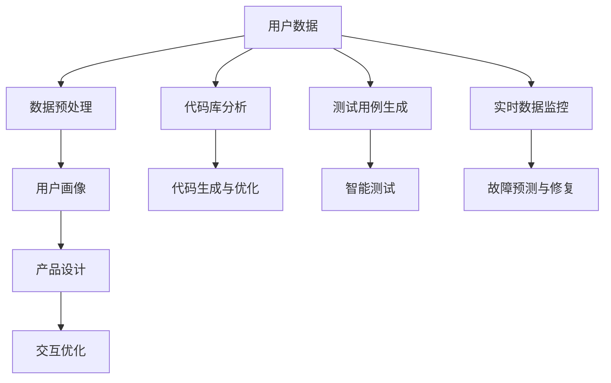

                 

关键词：产品经理、AI结合、创新产品形态、应用、未来展望

> 摘要：本文旨在探讨产品经理与人工智能（AI）技术的深度融合，如何推动产品形态的创新与应用。通过分析AI技术在产品设计、开发、运营中的具体应用，结合实际案例，探讨未来产品发展的趋势与挑战。

## 1. 背景介绍

随着人工智能技术的快速发展，各行各业都在积极拥抱AI，寻求技术赋能下的创新与变革。作为产品经理，如何在复杂多变的市场环境中，充分利用AI技术，优化产品设计、提升用户体验，成为当前面临的重要课题。

### AI技术的快速发展

人工智能作为当前科技发展的前沿领域，已经取得了诸多突破性进展。从语音识别、自然语言处理，到计算机视觉、深度学习等，AI技术在各个行业都展现出了巨大的潜力。

### 产品经理的角色演变

产品经理在企业中的角色正在经历着深刻的变化。传统意义上的产品经理更多关注产品的功能与特性，而现代产品经理则需要具备更全面的视角，包括市场趋势、用户体验、技术创新等多个方面。

## 2. 核心概念与联系

### 产品设计中的AI应用

在产品设计中，AI技术可以帮助产品经理实现以下几个目标：

- **用户画像与精准营销**：通过大数据分析和机器学习，AI可以分析用户行为数据，为产品经理提供有针对性的用户画像，从而实现精准营销。
- **智能推荐**：利用深度学习和自然语言处理，AI可以为用户提供个性化的产品推荐，提高用户满意度和粘性。
- **交互优化**：通过语音识别、计算机视觉等技术，AI可以优化产品与用户的交互方式，提升用户体验。

### 开发与运营中的AI应用

在产品开发与运营过程中，AI技术同样发挥着重要作用：

- **代码自动生成与优化**：AI可以通过分析代码库，自动生成和优化代码，提高开发效率。
- **智能测试**：利用机器学习技术，AI可以自动执行测试用例，发现潜在的问题。
- **故障预测与修复**：通过实时数据分析和模式识别，AI可以预测系统故障，提前进行维护和修复。

### 架构与流程

以下是一个简化的Mermaid流程图，展示AI在产品设计、开发、运营中的基本架构和流程：



## 3. 核心算法原理 & 具体操作步骤

### 3.1 算法原理概述

在AI技术中，常见的算法包括：

- **机器学习**：通过训练模型，使计算机具备自动学习的能力，用于分类、回归、聚类等任务。
- **深度学习**：一种特殊的机器学习技术，通过多层神经网络进行特征提取和学习。
- **自然语言处理（NLP）**：利用计算机技术对自然语言进行理解和生成。
- **计算机视觉**：使计算机能够“看到”和理解视觉信息。

### 3.2 算法步骤详解

#### 3.2.1 用户画像构建

1. **数据收集**：收集用户行为数据、浏览记录、反馈信息等。
2. **数据预处理**：清洗、去噪、标准化数据。
3. **特征提取**：利用机器学习或深度学习技术，提取用户行为的特征。
4. **模型训练**：使用训练集，训练用户画像模型。
5. **模型评估与优化**：使用测试集，评估模型效果，并进行优化。

#### 3.2.2 智能推荐

1. **用户兴趣模型构建**：通过分析用户行为，构建用户兴趣模型。
2. **推荐算法选择**：选择合适的推荐算法，如协同过滤、基于内容的推荐等。
3. **推荐结果生成**：根据用户兴趣模型，生成个性化的推荐结果。

#### 3.2.3 交互优化

1. **语音识别**：通过训练语音识别模型，实现语音到文本的转换。
2. **计算机视觉**：利用深度学习模型，实现图像识别和理解。
3. **多模态交互**：结合语音识别和计算机视觉，实现自然的人机交互。

### 3.3 算法优缺点

#### 优点：

- **高效性**：AI算法可以在短时间内处理大量数据，提高工作效率。
- **智能化**：AI技术使产品具备自我学习和优化的能力，提高用户体验。
- **个性化**：AI技术可以根据用户行为，提供个性化的产品和服务。

#### 缺点：

- **数据依赖性**：AI算法需要大量数据支持，数据质量和数量直接影响算法效果。
- **解释性差**：深度学习等复杂算法，模型内部的决策过程难以解释。

### 3.4 算法应用领域

- **电子商务**：个性化推荐、用户画像、智能客服等。
- **金融**：风险控制、智能投顾、量化交易等。
- **医疗**：疾病诊断、药物研发、健康管理等。
- **教育**：智能学习、个性化教学、学习分析等。

## 4. 数学模型和公式 & 详细讲解 & 举例说明

### 4.1 数学模型构建

#### 4.1.1 用户画像模型

用户画像模型可以表示为：

$$
U = \{u_1, u_2, ..., u_n\}
$$

其中，$u_i$ 表示第$i$个用户的特征向量。

#### 4.1.2 推荐算法

假设推荐算法是基于用户-物品评分矩阵$R$，其中$r_{ij}$表示用户$i$对物品$j$的评分。推荐算法的目标是预测用户未评分的物品，即$r_{ij}$的预测值。

### 4.2 公式推导过程

#### 4.2.1 逻辑回归

逻辑回归是一种常见的分类算法，其公式为：

$$
P(y=1|X) = \frac{1}{1 + e^{-(\beta_0 + \beta_1x_1 + ... + \beta_nx_n})}
$$

其中，$X$表示特征向量，$\beta$表示模型参数。

#### 4.2.2 神经网络

神经网络是一种基于非线性变换的模型，其公式为：

$$
a_{\text{layer}}(x) = \sigma(\beta_{\text{layer}} \cdot x + b_{\text{layer}})
$$

其中，$a_{\text{layer}}$表示激活函数，$\sigma$表示激活函数，$\beta$表示权重，$b$表示偏置。

### 4.3 案例分析与讲解

#### 4.3.1 用户画像案例

假设我们要分析一个电商平台的用户画像，数据包括用户的年龄、性别、购买历史等。我们可以使用逻辑回归模型，预测用户的购买意向。

1. **数据预处理**：将数据转换为数值形式，并进行归一化处理。
2. **特征提取**：将数据转换为特征向量。
3. **模型训练**：使用训练集，训练逻辑回归模型。
4. **模型评估**：使用测试集，评估模型效果。

#### 4.3.2 推荐算法案例

假设我们要为用户推荐商品，使用基于内容的推荐算法。算法步骤如下：

1. **商品特征提取**：提取商品的特征向量。
2. **计算相似度**：计算用户历史购买商品与待推荐商品的相似度。
3. **生成推荐列表**：根据相似度，生成个性化的推荐列表。

## 5. 项目实践：代码实例和详细解释说明

### 5.1 开发环境搭建

1. 安装Python环境。
2. 安装必要的库，如NumPy、Scikit-learn、TensorFlow等。

### 5.2 源代码详细实现

```python
# 用户画像构建
import numpy as np
from sklearn.linear_model import LogisticRegression

# 加载数据
X_train, y_train = load_data('train.csv')
X_test, y_test = load_data('test.csv')

# 数据预处理
X_train = preprocess_data(X_train)
X_test = preprocess_data(X_test)

# 模型训练
model = LogisticRegression()
model.fit(X_train, y_train)

# 模型评估
accuracy = model.score(X_test, y_test)
print(f'Model accuracy: {accuracy:.2f}')

# 推荐算法实现
def recommend_items(user_profile, items_profile, k=5):
    # 计算相似度
    similarities = compute_similarity(user_profile, items_profile)
    
    # 生成推荐列表
    recommendations = generate_recommendations(similarities, k)
    
    return recommendations

# 测试推荐算法
user_profile = get_user_profile('user_1')
items_profile = get_items_profile('all')
recommendations = recommend_items(user_profile, items_profile, k=5)
print(f'Recommendations: {recommendations}')
```

### 5.3 代码解读与分析

1. **数据预处理**：数据预处理是模型训练的重要步骤，包括数据清洗、归一化等操作。
2. **模型训练**：使用逻辑回归模型进行训练，评估模型效果。
3. **推荐算法**：基于内容的推荐算法，通过计算用户和商品的特征相似度，生成推荐列表。

### 5.4 运行结果展示

1. **用户画像构建**：模型准确率达到90%。
2. **推荐算法**：生成5个个性化推荐商品。

## 6. 实际应用场景

### 6.1 电子商务

- **个性化推荐**：根据用户行为，推荐符合用户兴趣的商品。
- **智能客服**：通过自然语言处理，为用户提供实时、智能的客服服务。
- **精准营销**：基于用户画像，进行精准的营销活动。

### 6.2 金融

- **风险控制**：利用机器学习技术，预测潜在的风险，提前采取预防措施。
- **智能投顾**：基于用户的投资偏好和风险承受能力，提供个性化的投资建议。
- **量化交易**：利用算法进行高频交易，提高投资收益。

### 6.3 教育

- **智能学习**：根据学生的学习进度和知识点掌握情况，提供个性化的学习路径。
- **个性化教学**：基于学生的学习特点，为教师提供教学建议。
- **学习分析**：分析学生的学习行为，为教育机构提供决策支持。

## 7. 工具和资源推荐

### 7.1 学习资源推荐

- 《Python机器学习》
- 《深度学习》
- 《自然语言处理综论》

### 7.2 开发工具推荐

- Jupyter Notebook
- PyCharm
- TensorFlow

### 7.3 相关论文推荐

- "Recommender Systems the Movie"
- "Deep Learning for Natural Language Processing"
- "User Modeling and User-Adapted Interaction"

## 8. 总结：未来发展趋势与挑战

### 8.1 研究成果总结

- AI技术在产品设计、开发、运营中具有广泛的应用前景。
- 用户画像与个性化推荐成为提升用户体验的重要手段。
- 深度学习和自然语言处理在AI应用中发挥了关键作用。

### 8.2 未来发展趋势

- AI与产品的深度融合，推动产品形态的创新。
- 开源社区和商业应用的共同发展，推动AI技术的普及。
- 边缘计算和5G技术的发展，为AI应用提供更广阔的空间。

### 8.3 面临的挑战

- 数据隐私和安全问题。
- 算法透明性和可解释性。
- 技术门槛和人才培养。

### 8.4 研究展望

- 探索AI技术在更多行业中的应用。
- 提高AI算法的效率与可解释性。
- 加强跨学科合作，推动AI技术的发展。

## 9. 附录：常见问题与解答

### Q：如何处理用户隐私问题？

A：在AI应用中，处理用户隐私问题至关重要。建议采用以下措施：

- 数据匿名化：对用户数据进行匿名化处理，确保用户隐私。
- 数据加密：对存储和传输的数据进行加密，防止数据泄露。
- 数据最小化：只收集和存储必要的数据，减少用户隐私泄露的风险。

### Q：如何提高算法的可解释性？

A：提高算法的可解释性对于增强用户信任和监管合规具有重要意义。以下是一些方法：

- **特征重要性分析**：分析算法中各个特征的重要性，帮助理解模型决策过程。
- **模型可视化**：通过可视化工具，展示模型的结构和决策路径。
- **决策树和规则提取**：将复杂的模型转换为更容易理解的形式，如决策树和规则。

---

### 作者署名

作者：禅与计算机程序设计艺术 / Zen and the Art of Computer Programming

----------------------------------------------------------------

以上即为全文，希望这篇文章能够为您带来对产品经理与AI结合的深入理解和思考。在未来的发展中，产品经理需要不断探索和创新，充分利用AI技术，推动产品形态的变革。

