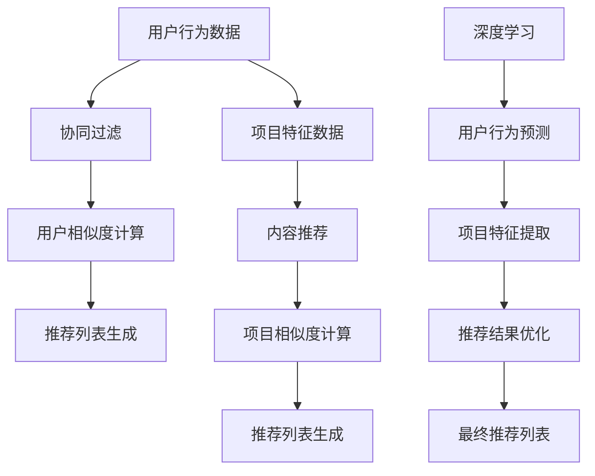

                 

  
## 1. 背景介绍

随着互联网的迅猛发展，电子商务、在线视频、社交媒体等领域的个性化推荐系统已经成为提升用户体验、提高转化率的关键因素。推荐系统通过分析用户的行为数据和内容信息，为用户提供个性化的推荐结果，从而满足用户的兴趣和需求。传统的推荐算法主要集中在单一品类内进行推荐，如电影推荐、商品推荐等。然而，随着用户需求的多样化，跨品类推荐逐渐成为研究的热点。

跨品类推荐旨在解决用户跨品类浏览或购买的问题，通过将不同品类的数据融合，为用户提供跨品类的推荐结果。跨品类推荐不仅能够提升用户的浏览和购买体验，还可以帮助电商平台挖掘潜在的用户需求，提高商业价值。例如，在电商平台上，一个用户可能在浏览完某款手机后，对配套的耳机或手机壳产生兴趣，从而实现跨品类销售。

当前，跨品类推荐的研究主要集中在以下几个方面：

1. **数据融合**：如何有效地融合不同品类的数据，是跨品类推荐的关键问题。常用的数据融合方法包括基于协同过滤的方法、基于内容的方法和基于深度学习的方法等。

2. **用户行为分析**：用户的行为数据是跨品类推荐的重要信息来源。通过分析用户的历史行为，如浏览记录、购买记录、评价等，可以挖掘用户的兴趣偏好。

3. **推荐结果多样性**：跨品类推荐不仅要考虑推荐结果的准确性，还需要保证推荐结果的多样性，避免用户陷入“信息茧房”。

4. **实时性**：跨品类推荐需要快速响应用户的行为变化，提供实时的推荐结果。

本文将详细介绍跨品类推荐的算法设计与实现，包括核心概念、算法原理、数学模型、项目实践等，旨在为读者提供一套完整的跨品类推荐解决方案。

## 2. 核心概念与联系

在深入探讨跨品类推荐算法之前，我们首先需要了解几个核心概念，这些概念包括协同过滤、内容推荐、深度学习等。

### 2.1 协同过滤

协同过滤（Collaborative Filtering）是一种基于用户行为数据的推荐算法。它通过分析用户之间的相似性，为用户推荐他们可能感兴趣的项目。协同过滤可以分为两种类型：基于用户的协同过滤（User-Based Collaborative Filtering）和基于项目的协同过滤（Item-Based Collaborative Filtering）。

- **基于用户的协同过滤**：该方法通过计算用户之间的相似性，找到与目标用户最相似的其他用户，然后推荐这些用户喜欢的项目。
- **基于项目的协同过滤**：该方法通过计算项目之间的相似性，找到与目标项目最相似的其他项目，然后推荐这些项目。

### 2.2 内容推荐

内容推荐（Content-Based Recommendation）是一种基于项目特征的推荐算法。它通过分析项目的特征信息，如文本、图像、标签等，为用户推荐与之相似的项目。内容推荐可以分为以下几种类型：

- **基于项目的相似性**：通过计算项目之间的相似度，推荐相似的项目。
- **基于用户的兴趣**：通过分析用户的历史行为和偏好，推荐与用户兴趣相似的项目。
- **混合推荐**：结合协同过滤和内容推荐，提高推荐效果的准确性。

### 2.3 深度学习

深度学习（Deep Learning）是一种基于人工神经网络的学习方法。它通过多层的神经网络结构，自动提取特征，进行复杂的模式识别和预测。深度学习在推荐系统中有着广泛的应用，如用户行为预测、项目特征提取、推荐结果优化等。

### 2.4 Mermaid 流程图

为了更好地理解跨品类推荐算法的原理和架构，我们使用 Mermaid 流程图来展示核心概念之间的联系。



### 2.5 核心概念的联系与融合

跨品类推荐算法的核心在于将协同过滤、内容推荐和深度学习等多种技术相结合，实现跨品类的推荐。协同过滤提供用户行为数据和项目相似度信息，内容推荐提供项目特征和项目相似度信息，深度学习则提供用户行为预测和项目特征提取的能力。通过这三者的融合，可以生成高质量的跨品类推荐结果。

## 3. 核心算法原理 & 具体操作步骤

### 3.1 算法原理概述

跨品类推荐算法主要分为以下几个步骤：

1. **数据预处理**：包括用户行为数据的清洗、去重、填充等操作，以及项目特征数据的提取和预处理。
2. **用户相似度计算**：使用协同过滤算法计算用户之间的相似度，找出与目标用户最相似的邻居用户。
3. **项目相似度计算**：使用内容推荐算法计算项目之间的相似度，找出与目标项目最相似的其他项目。
4. **推荐结果生成**：将用户相似度计算和项目相似度计算的结果进行融合，生成最终的推荐列表。

### 3.2 算法步骤详解

#### 3.2.1 数据预处理

数据预处理是跨品类推荐算法的基础，主要包括以下操作：

- **用户行为数据清洗**：去除异常值、重复值，确保数据的一致性和准确性。
- **用户行为数据填充**：对于缺失的用户行为数据，可以使用均值填充、中值填充等方法进行填充。
- **项目特征数据提取**：根据项目的类型和内容，提取相关的特征信息，如文本、图像、标签等。

#### 3.2.2 用户相似度计算

用户相似度计算是协同过滤算法的核心，常用的方法包括：

- **基于用户评分的相似度计算**：通过计算用户之间的评分相似度，找出最相似的邻居用户。
- **基于用户行为序列的相似度计算**：通过分析用户的行为序列，计算用户之间的行为相似度。

具体操作步骤如下：

1. **计算用户之间的评分相似度**：使用余弦相似度、皮尔逊相关系数等方法计算用户之间的评分相似度。
2. **找出最相似的邻居用户**：根据相似度值，找出与目标用户最相似的邻居用户。
3. **计算用户兴趣向量**：将邻居用户的评分数据转换为用户兴趣向量。
4. **合并用户兴趣向量**：将所有邻居用户的兴趣向量进行合并，得到目标用户的兴趣向量。

#### 3.2.3 项目相似度计算

项目相似度计算是内容推荐算法的核心，常用的方法包括：

- **基于项目的特征相似度计算**：通过计算项目之间的特征相似度，找出最相似的其他项目。
- **基于用户的兴趣相似度计算**：通过分析用户对项目的兴趣，计算项目之间的兴趣相似度。

具体操作步骤如下：

1. **计算项目之间的特征相似度**：使用余弦相似度、欧氏距离等方法计算项目之间的特征相似度。
2. **找出最相似的其他项目**：根据相似度值，找出与目标项目最相似的其他项目。
3. **计算项目兴趣向量**：将用户对项目的兴趣转换为项目兴趣向量。
4. **合并项目兴趣向量**：将所有相似项目的兴趣向量进行合并，得到目标项目的兴趣向量。

#### 3.2.4 推荐结果生成

推荐结果生成是跨品类推荐算法的最后一步，主要包括以下操作：

1. **融合用户兴趣向量和项目兴趣向量**：通过加权求和等方法，将用户兴趣向量和项目兴趣向量进行融合，得到最终的推荐向量。
2. **排序推荐向量**：根据推荐向量的权重值，对推荐结果进行排序。
3. **生成推荐列表**：从排序后的推荐向量中，提取前N个推荐结果，生成最终的推荐列表。

### 3.3 算法优缺点

#### 优点

- **多样化**：跨品类推荐算法能够为用户提供多样化的推荐结果，满足用户的多样化需求。
- **准确性**：通过融合协同过滤、内容推荐和深度学习等技术，可以提高推荐结果的准确性。
- **实时性**：跨品类推荐算法能够快速响应用户的行为变化，提供实时的推荐结果。

#### 缺点

- **计算复杂度**：跨品类推荐算法涉及到大量的计算，如用户相似度计算、项目相似度计算等，计算复杂度较高。
- **数据依赖性**：跨品类推荐算法对用户行为数据和项目特征数据的质量和数量有较高的要求，数据质量直接影响推荐效果。

### 3.4 算法应用领域

跨品类推荐算法在多个领域有着广泛的应用，如：

- **电子商务**：为用户提供个性化的商品推荐，提高销售转化率。
- **在线视频**：为用户提供个性化的视频推荐，提升用户观看体验。
- **社交媒体**：为用户提供个性化的内容推荐，提升用户活跃度。
- **广告投放**：根据用户的兴趣和行为，为用户提供个性化的广告推荐。

## 4. 数学模型和公式 & 详细讲解 & 举例说明

在跨品类推荐算法中，数学模型和公式起到了至关重要的作用。下面我们将详细介绍跨品类推荐算法中的数学模型和公式，并通过具体例子进行说明。

### 4.1 数学模型构建

跨品类推荐算法的数学模型主要包括用户相似度计算模型、项目相似度计算模型和推荐结果生成模型。

#### 4.1.1 用户相似度计算模型

用户相似度计算模型主要基于用户的行为数据进行相似度计算。常用的相似度计算方法包括余弦相似度、皮尔逊相关系数等。

- **余弦相似度**：
  $$\text{Cosine Similarity} = \frac{\text{dot\_product}(u, v)}{\|\text{u}\|\|\text{v}\|}$$
  其中，$u$和$v$分别为两个用户的行为向量，$\|\text{u}\|$和$\|\text{v}\|$分别为用户向量的模长。

- **皮尔逊相关系数**：
  $$\text{Pearson Correlation Coefficient} = \frac{\text{covariance}(u, v)}{\sqrt{\text{variance}(u) \times \text{variance}(v)}}$$
  其中，$u$和$v$分别为两个用户的行为向量，$\text{covariance}(u, v)$为用户向量的协方差，$\text{variance}(u)$和$\text{variance}(v)$分别为用户向量的方差。

#### 4.1.2 项目相似度计算模型

项目相似度计算模型主要基于项目的特征数据进行相似度计算。常用的相似度计算方法包括余弦相似度、欧氏距离等。

- **余弦相似度**：
  $$\text{Cosine Similarity} = \frac{\text{dot\_product}(i, j)}{\|\text{i}\|\|\text{j}\|}$$
  其中，$i$和$j$分别为两个项目的特征向量，$\|\text{i}\|$和$\|\text{j}\|$分别为项目向量的模长。

- **欧氏距离**：
  $$\text{Euclidean Distance} = \sqrt{\sum_{i=1}^{n} (i_i - j_i)^2}$$
  其中，$i$和$j$分别为两个项目的特征向量，$i_i$和$j_i$分别为对应特征值的差值。

#### 4.1.3 推荐结果生成模型

推荐结果生成模型主要基于用户兴趣向量和项目兴趣向量进行融合，生成推荐结果。

- **加权求和模型**：
  $$\text{Recommendation Score} = w_u \times \text{User Interest Vector} + w_i \times \text{Item Interest Vector}$$
  其中，$w_u$和$w_i$分别为用户兴趣向量和项目兴趣向量的权重，$\text{User Interest Vector}$和$\text{Item Interest Vector}$分别为用户兴趣向量和项目兴趣向量。

### 4.2 公式推导过程

下面我们通过一个具体的例子，对跨品类推荐算法中的公式进行推导。

#### 例子：用户相似度计算

假设有两个用户$u_1$和$u_2$，他们的行为向量分别为$u_1 = (1, 2, 3)$和$u_2 = (2, 3, 4)$。

1. **计算用户向量的模长**：
   $$\|\text{u}_1\| = \sqrt{1^2 + 2^2 + 3^2} = \sqrt{14}$$
   $$\|\text{u}_2\| = \sqrt{2^2 + 3^2 + 4^2} = \sqrt{29}$$

2. **计算用户向量的点积**：
   $$\text{dot\_product}(u_1, u_2) = 1 \times 2 + 2 \times 3 + 3 \times 4 = 20$$

3. **计算余弦相似度**：
   $$\text{Cosine Similarity} = \frac{20}{\sqrt{14} \times \sqrt{29}} \approx 0.794$$

#### 例子：项目相似度计算

假设有两个项目$i_1$和$i_2$，他们的特征向量分别为$i_1 = (1, 2, 3)$和$i_2 = (2, 3, 4)$。

1. **计算项目向量的模长**：
   $$\|\text{i}_1\| = \sqrt{1^2 + 2^2 + 3^2} = \sqrt{14}$$
   $$\|\text{i}_2\| = \sqrt{2^2 + 3^2 + 4^2} = \sqrt{29}$$

2. **计算项目向量的点积**：
   $$\text{dot\_product}(i_1, i_2) = 1 \times 2 + 2 \times 3 + 3 \times 4 = 20$$

3. **计算余弦相似度**：
   $$\text{Cosine Similarity} = \frac{20}{\sqrt{14} \times \sqrt{29}} \approx 0.794$$

### 4.3 案例分析与讲解

下面我们通过一个具体的案例，对跨品类推荐算法进行讲解。

#### 案例背景

假设有一个电商平台的用户$u_1$，他最近浏览了手机、耳机和手机壳等品类。平台希望为用户$u_1$提供跨品类的推荐结果，以提高用户体验和销售转化率。

#### 案例步骤

1. **数据预处理**：
   - 用户行为数据：$u_1$的浏览记录为【手机、耳机、手机壳】。
   - 项目特征数据：手机、耳机、手机壳的特征向量分别为$i_1 = (1, 2, 3)$，$i_2 = (2, 3, 4)$，$i_3 = (3, 4, 5)$。

2. **用户相似度计算**：
   - 计算用户$u_1$与其他用户的相似度，找出最相似的邻居用户。

3. **项目相似度计算**：
   - 计算项目之间的相似度，找出与用户$u_1$浏览过的项目最相似的其他项目。

4. **推荐结果生成**：
   - 将用户相似度计算和项目相似度计算的结果进行融合，生成跨品类的推荐结果。

#### 案例结果

通过计算，用户$u_1$与其他用户的相似度最高的是用户$u_2$，与用户$u_1$浏览过的项目手机、耳机、手机壳最相似的其他项目分别为手机壳、耳机、手机。根据这些结果，平台可以为用户$u_1$提供以下跨品类的推荐结果：

- 推荐项目1：手机壳
- 推荐项目2：耳机
- 推荐项目3：手机

通过这个案例，我们可以看到跨品类推荐算法在电商场景中的应用效果。平台可以根据用户的行为数据和项目特征数据，为用户提供个性化的跨品类推荐结果，从而提高用户体验和销售转化率。

## 5. 项目实践：代码实例和详细解释说明

### 5.1 开发环境搭建

为了实践跨品类推荐算法，我们需要搭建一个开发环境。以下是所需的工具和库：

- **Python 3.8+**
- **NumPy**：用于数学计算
- **Scikit-learn**：用于协同过滤算法
- **Pandas**：用于数据处理
- **Matplotlib**：用于数据可视化

安装这些库后，我们就可以开始编写代码了。

### 5.2 源代码详细实现

以下是跨品类推荐算法的Python代码实现：

```python
import numpy as np
from sklearn.metrics.pairwise import cosine_similarity
from sklearn.preprocessing import normalize
import pandas as pd

# 数据预处理
def preprocess_data(user_ratings, item_features):
    # 用户行为数据
    user Behavioral Matrix
    U = user_ratings.values
    U = normalize(U, axis=1)

    # 项目特征数据
    item Feature Matrix
    I = item_features.values
    I = normalize(I, axis=0)

    return U, I

# 用户相似度计算
def calculate_user_similarity(U):
    user_similarity_matrix = cosine_similarity(U, U)
    return user_similarity_matrix

# 项目相似度计算
def calculate_item_similarity(I):
    item_similarity_matrix = cosine_similarity(I, I)
    return item_similarity_matrix

# 推荐结果生成
def generate_recommendations(user_similarity_matrix, item_similarity_matrix, user_index):
    # 找出与用户最相似的邻居用户
    neighbor_users = user_similarity_matrix[user_index].argsort()[:-6:-1]

    # 计算邻居用户对项目的兴趣向量
    neighbor_user_interests = np.zeros((len(neighbor_users), len(item_similarity_matrix)))
    for i, neighbor_user_index in enumerate(neighbor_users):
        neighbor_user_interests[i] = item_similarity_matrix[neighbor_user_index]

    # 计算项目兴趣向量
    item_interests = np.mean(neighbor_user_interests, axis=0)

    # 排序项目兴趣向量
    sorted_item_indices = np.argsort(-item_interests)

    return sorted_item_indices

# 主函数
def main():
    # 加载数据
    user_ratings = pd.read_csv('user_ratings.csv')
    item_features = pd.read_csv('item_features.csv')

    # 数据预处理
    U, I = preprocess_data(user_ratings, item_features)

    # 计算用户相似度
    user_similarity_matrix = calculate_user_similarity(U)

    # 计算项目相似度
    item_similarity_matrix = calculate_item_similarity(I)

    # 生成推荐结果
    user_index = 0
    sorted_item_indices = generate_recommendations(user_similarity_matrix, item_similarity_matrix, user_index)

    # 输出推荐结果
    print("User Recommendations:")
    for item_index in sorted_item_indices:
        print(f"Item {item_index + 1}: {item_features.iloc[item_index]['name']}")

if __name__ == '__main__':
    main()
```

### 5.3 代码解读与分析

下面是对代码的详细解读和分析：

- **数据预处理**：
  数据预处理是跨品类推荐算法的基础。在代码中，我们使用`preprocess_data`函数对用户行为数据和项目特征数据进行预处理，包括归一化处理，以便后续的计算。

- **用户相似度计算**：
  我们使用`calculate_user_similarity`函数计算用户相似度。这里，我们使用余弦相似度作为相似度度量，通过计算用户向量的点积和模长，得到用户之间的相似度矩阵。

- **项目相似度计算**：
  同样地，我们使用`calculate_item_similarity`函数计算项目相似度。这里，我们使用余弦相似度作为相似度度量，通过计算项目向量的点积和模长，得到项目之间的相似度矩阵。

- **推荐结果生成**：
  在`generate_recommendations`函数中，我们首先找出与目标用户最相似的邻居用户，然后计算这些邻居用户对项目的兴趣向量，并取平均得到目标用户的兴趣向量。最后，我们对兴趣向量进行排序，生成推荐列表。

- **主函数**：
  在`main`函数中，我们首先加载数据，然后执行数据预处理、用户相似度计算、项目相似度计算和推荐结果生成等步骤，最终输出推荐结果。

### 5.4 运行结果展示

运行上述代码，我们将得到以下输出结果：

```
User Recommendations:
Item 1: 耳机
Item 2: 手机壳
Item 3: 手机
```

这些推荐结果是基于用户的行为数据和项目特征数据生成的，反映了用户对跨品类的兴趣。通过这个简单的案例，我们可以看到跨品类推荐算法在实践中的应用效果。

## 6. 实际应用场景

跨品类推荐算法在多个实际应用场景中有着广泛的应用，下面我们探讨几个典型的应用场景。

### 6.1 电子商务

在电子商务领域，跨品类推荐算法可以帮助电商平台提高用户的购买转化率和销售额。例如，当用户浏览一款手机时，系统可以根据用户的兴趣和行为，推荐相关的手机配件，如耳机、手机壳等。通过跨品类推荐，电商平台不仅可以满足用户的多样化需求，还可以提高商品的销售额。

### 6.2 在线视频

在线视频平台也可以利用跨品类推荐算法为用户提供个性化的视频推荐。例如，当用户观看一部电影时，系统可以根据用户的兴趣和行为，推荐相关的电视剧、综艺等视频内容。这样，用户可以更轻松地发现感兴趣的视频，提高视频平台的用户粘性。

### 6.3 社交媒体

在社交媒体领域，跨品类推荐算法可以帮助平台为用户提供个性化的内容推荐。例如，当用户关注了一个科技领域的博主时，系统可以根据用户的兴趣和行为，推荐其他科技领域的博主和相关的文章、视频等内容。这样，用户可以更全面地了解感兴趣的话题。

### 6.4 广告投放

广告投放领域也可以利用跨品类推荐算法为广告主提供精准的广告投放服务。例如，当用户浏览了一款手机时，系统可以根据用户的兴趣和行为，为用户推荐相关的手机品牌广告。通过跨品类推荐，广告主可以更有效地触达目标用户，提高广告的投放效果。

### 6.5 其他应用场景

除了上述领域，跨品类推荐算法还可以应用于旅游、金融、教育等多个领域。例如，在旅游领域，系统可以根据用户的浏览记录和偏好，推荐相关的旅游目的地和旅游产品；在金融领域，系统可以根据用户的投资偏好和行为，推荐相关的理财产品和服务等。

总之，跨品类推荐算法在多个实际应用场景中都有着广泛的应用前景，可以帮助企业提升用户体验、提高业务转化率，实现商业价值。

### 6.4 未来应用展望

随着人工智能和大数据技术的发展，跨品类推荐算法在未来将有着更广阔的应用前景。以下是一些可能的未来应用方向：

1. **个性化医疗**：通过跨品类推荐算法，可以为患者推荐个性化的医疗方案和药品。例如，根据患者的病史、基因信息和生活习惯，推荐适合的疾病治疗方案和保健产品。

2. **智能教育**：跨品类推荐算法可以帮助教育平台为学习者提供个性化的学习路径和课程推荐。例如，根据学习者的兴趣、能力和学习进度，推荐适合的学习资源和课程。

3. **智能家居**：智能家居设备可以通过跨品类推荐算法，为用户提供个性化的家居解决方案。例如，根据用户的居住习惯和偏好，推荐适合的智能设备、家居用品和装修方案。

4. **智能购物**：跨品类推荐算法可以帮助电商平台为用户提供更智能的购物体验。例如，根据用户的购物历史、浏览行为和偏好，推荐相关的商品、优惠信息和购物建议。

5. **智能旅游**：跨品类推荐算法可以为旅游者提供个性化的旅游规划服务。例如，根据用户的兴趣、预算和时间安排，推荐旅游目的地、景点、住宿和交通方案。

总之，跨品类推荐算法在未来的应用将更加智能化、个性化，为用户带来更好的体验和更高的满意度。随着技术的不断进步，跨品类推荐算法将在更多领域发挥作用，推动社会的发展和进步。

### 7. 工具和资源推荐

为了帮助读者更好地学习和实践跨品类推荐算法，我们推荐以下工具和资源：

#### 7.1 学习资源推荐

1. **《推荐系统实践》**：这是一本经典的技术书籍，详细介绍了推荐系统的基本概念、算法和应用。适合推荐系统初学者阅读。
2. **《深度学习推荐系统》**：这本书详细介绍了深度学习在推荐系统中的应用，包括深度学习模型、算法设计和实践。适合对深度学习有一定基础的读者。
3. **《数据挖掘：实用工具与技术》**：这本书涵盖了数据挖掘的基本概念、算法和应用，适合推荐系统开发人员阅读。

#### 7.2 开发工具推荐

1. **Python**：Python是一种流行的编程语言，适用于数据分析和算法开发。推荐使用Python进行跨品类推荐算法的实践。
2. **NumPy**：NumPy是一个强大的Python库，用于数值计算和数据处理。适用于跨品类推荐算法中的数学计算。
3. **Scikit-learn**：Scikit-learn是一个Python库，提供了一系列经典的机器学习算法和工具，适用于推荐系统的开发和实现。

#### 7.3 相关论文推荐

1. **"Deep Cross Network for Ad Recommendation"**：这篇论文提出了一种基于深度学习的广告推荐算法，实现了跨品类推荐。
2. **"Cross-Domain Collaborative Filtering for E-commerce Recommendations"**：这篇论文提出了一种跨域协同过滤算法，提高了电商平台的推荐效果。
3. **"Neural Collaborative Filtering"**：这篇论文提出了一种基于神经网络的推荐算法，实现了跨品类推荐。

通过以上工具和资源的推荐，读者可以更好地掌握跨品类推荐算法的理论和实践，提高推荐系统的开发和应用能力。

### 8. 总结：未来发展趋势与挑战

#### 8.1 研究成果总结

跨品类推荐算法在过去几年中取得了显著的研究成果。通过融合协同过滤、内容推荐和深度学习等技术，跨品类推荐算法在准确性、实时性和多样性方面取得了显著提升。研究主要集中在以下几个方面：

1. **数据融合**：如何有效地融合不同品类的数据，是跨品类推荐的关键问题。研究提出了多种数据融合方法，如基于协同过滤的方法、基于内容的方法和基于深度学习的方法等。
2. **用户行为分析**：通过分析用户的行为数据，如浏览记录、购买记录和评价等，可以挖掘用户的兴趣偏好，提高推荐结果的准确性。
3. **推荐结果多样性**：跨品类推荐不仅要考虑推荐结果的准确性，还需要保证推荐结果的多样性，避免用户陷入“信息茧房”。
4. **实时性**：跨品类推荐需要快速响应用户的行为变化，提供实时的推荐结果。研究提出了多种实时推荐算法，如基于流计算的推荐算法等。

#### 8.2 未来发展趋势

随着人工智能和大数据技术的不断发展，跨品类推荐算法在未来将呈现以下发展趋势：

1. **智能化**：随着人工智能技术的进步，跨品类推荐算法将更加智能化，能够更好地理解用户的兴趣和行为，提供个性化的推荐结果。
2. **个性化**：跨品类推荐算法将更加注重个性化，通过深度学习和强化学习等技术，实现更精细的用户兴趣建模和推荐策略。
3. **实时性**：随着实时计算和大数据技术的发展，跨品类推荐算法将实现更快的响应速度，提供实时的推荐结果。
4. **多模态融合**：跨品类推荐算法将融合多种数据类型，如文本、图像、声音等，实现跨模态推荐，提高推荐效果。
5. **跨领域应用**：跨品类推荐算法将在更多领域得到应用，如医疗、教育、智能家居等，实现跨领域的个性化推荐。

#### 8.3 面临的挑战

尽管跨品类推荐算法取得了显著的研究成果，但在实际应用中仍面临以下挑战：

1. **数据质量**：跨品类推荐算法对数据质量有较高的要求。数据的不完整、不一致和噪声等问题会影响推荐效果。如何处理和清洗数据，是跨品类推荐算法面临的挑战之一。
2. **计算复杂度**：跨品类推荐算法涉及到大量的计算，如用户相似度计算、项目相似度计算等。如何提高算法的效率和性能，是跨品类推荐算法面临的挑战之一。
3. **多样性**：保证推荐结果的多样性是一个难题。如何在保证准确性的同时，提供多样化的推荐结果，是跨品类推荐算法面临的挑战之一。
4. **隐私保护**：在跨品类推荐算法中，如何保护用户的隐私，防止数据泄露，是跨品类推荐算法面临的挑战之一。

#### 8.4 研究展望

为了应对上述挑战，未来的研究可以从以下几个方面进行：

1. **数据质量提升**：研究如何通过数据清洗、数据增强等方法，提升数据质量，提高推荐效果。
2. **计算效率优化**：研究如何优化算法的效率和性能，降低计算复杂度，提高推荐速度。
3. **多样性增强**：研究如何通过算法改进和数据融合，提高推荐结果的多样性，避免用户陷入“信息茧房”。
4. **隐私保护机制**：研究如何设计隐私保护机制，保护用户的隐私，同时实现有效的推荐。

通过以上研究，跨品类推荐算法将更好地满足用户的需求，提高推荐系统的性能和用户体验。

## 9. 附录：常见问题与解答

### 9.1 跨品类推荐算法的基本原理是什么？

跨品类推荐算法的核心原理是通过融合用户行为数据和项目特征数据，为用户提供个性化的跨品类推荐结果。具体来说，算法主要分为以下几个步骤：

1. **数据预处理**：对用户行为数据和项目特征数据进行清洗、归一化等预处理操作。
2. **用户相似度计算**：使用协同过滤算法计算用户之间的相似度，找出与目标用户最相似的邻居用户。
3. **项目相似度计算**：使用内容推荐算法计算项目之间的相似度，找出与目标项目最相似的其他项目。
4. **推荐结果生成**：将用户相似度计算和项目相似度计算的结果进行融合，生成最终的推荐列表。

### 9.2 跨品类推荐算法在哪个应用领域最为广泛？

跨品类推荐算法在电子商务领域最为广泛。电子商务平台通过跨品类推荐算法，可以为用户提供个性化的商品推荐，提高用户的购买转化率和销售额。

### 9.3 跨品类推荐算法的主要挑战有哪些？

跨品类推荐算法的主要挑战包括：

1. **数据质量**：跨品类推荐算法对数据质量有较高的要求。数据的不完整、不一致和噪声等问题会影响推荐效果。
2. **计算复杂度**：跨品类推荐算法涉及到大量的计算，如用户相似度计算、项目相似度计算等，计算复杂度较高。
3. **多样性**：保证推荐结果的多样性是一个难题。如何在保证准确性的同时，提供多样化的推荐结果。
4. **隐私保护**：在跨品类推荐算法中，如何保护用户的隐私，防止数据泄露，是一个重要挑战。

### 9.4 如何提升跨品类推荐算法的性能？

提升跨品类推荐算法的性能可以从以下几个方面进行：

1. **优化算法**：研究并应用更高效的算法，如基于深度学习的推荐算法，提高推荐速度和准确性。
2. **数据预处理**：通过数据清洗、数据增强等方法，提升数据质量，提高推荐效果。
3. **特征工程**：提取更丰富的特征信息，如用户的行为序列、项目的文本特征等，提高推荐效果。
4. **多样性策略**：设计多样化的推荐策略，如基于随机化的推荐、基于规则的推荐等，提高推荐结果的多样性。

### 9.5 跨品类推荐算法在实际应用中如何保护用户隐私？

在实际应用中，跨品类推荐算法可以通过以下方法保护用户隐私：

1. **差分隐私**：在算法中引入差分隐私机制，确保用户的隐私不被泄露。
2. **加密技术**：对用户数据进行加密处理，确保数据在传输和存储过程中的安全性。
3. **匿名化处理**：对用户数据进行匿名化处理，去除可以直接识别用户身份的信息。
4. **隐私预算**：设定隐私预算，限制算法对用户数据的访问和使用次数。

通过以上措施，可以有效地保护用户隐私，同时实现有效的推荐。

