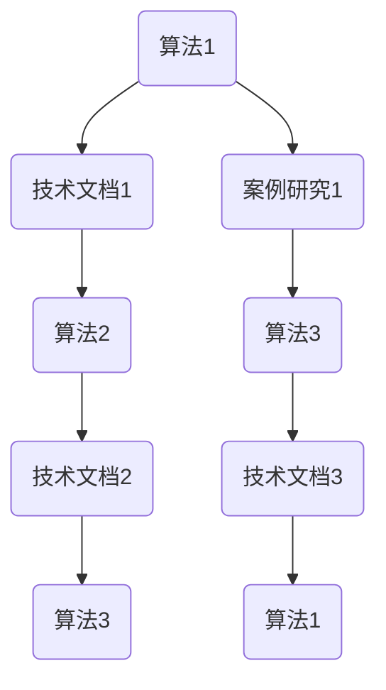

                 

 关键词：跨团队AI知识共享，内部培训，Lepton AI，知识图谱，共享平台，深度学习，技术交流

## 摘要

在当今快速发展的AI领域，知识共享变得至关重要。本文将探讨Lepton AI如何通过其内部培训机制实现跨团队的知识共享，从而提高整体研发效率。我们将深入分析Lepton AI的知识共享平台架构，详细阐述其核心算法原理、数学模型以及具体实施步骤。此外，本文还将展示实际应用案例，探讨未来发展趋势与挑战，并提供相关工具和资源的推荐。

## 1. 背景介绍

随着人工智能技术的不断进步，各行业对AI的需求日益增长。然而，AI技术的发展不仅仅是技术本身的问题，更涉及到跨团队的知识共享与协作。在一个大型企业中，不同团队之间的知识共享往往是一个难题。即使团队内部有高效的沟通和合作机制，跨团队之间的知识共享仍然面临着诸多挑战。

Lepton AI作为一家领先的人工智能公司，深知知识共享对于其研发效率的重要性。为了解决跨团队知识共享的问题，Lepton AI建立了一套完整的内部培训机制，通过知识图谱和共享平台实现团队成员之间的知识共享。这一机制不仅提高了团队成员的技术水平，也促进了团队之间的合作与交流。

## 2. 核心概念与联系

为了实现高效的知识共享，Lepton AI采用了一种基于知识图谱的技术架构。知识图谱是一种用于表示实体及其相互关系的图形结构，可以清晰地展示各实体之间的关系。在Lepton AI的知识图谱中，实体包括算法、技术文档、案例研究等，它们之间的关系则通过引用、扩展、关联等来表示。

### Mermaid 流程图

下面是Lepton AI知识图谱的Mermaid流程图表示：



在这个流程图中，每个节点代表一个实体，节点之间的边表示实体之间的关系。通过这种结构化的知识图谱，团队成员可以快速找到所需的知识点，并进行深入学习和交流。

## 3. 核心算法原理 & 具体操作步骤

### 3.1 算法原理概述

Lepton AI的核心算法是基于深度学习的知识图谱构建算法。深度学习通过多层神经网络对大量数据进行学习和建模，从而实现对复杂模式的高效识别和分类。知识图谱构建算法则利用深度学习模型对实体和关系进行建模，从而构建出一个结构化的知识图谱。

### 3.2 算法步骤详解

1. 数据采集与预处理：首先，从各种渠道收集与AI相关的数据，包括学术论文、技术博客、开源代码库等。然后对数据进行清洗和预处理，去除无效信息和噪声。

2. 实体识别与分类：利用自然语言处理（NLP）技术对文本进行解析，识别出文本中的实体，并对这些实体进行分类。

3. 关系抽取与建模：通过深度学习模型对实体之间的关系进行抽取和建模，形成实体之间的关系图谱。

4. 知识图谱优化与更新：根据实体和关系的权重，对知识图谱进行优化，并定期更新，以保持其准确性和时效性。

### 3.3 算法优缺点

优点：
- 高效性：利用深度学习模型对大量数据进行处理，可以快速构建出结构化的知识图谱。
- 灵活性：知识图谱可以根据需求进行灵活调整和优化，适应不同的应用场景。

缺点：
- 复杂性：深度学习模型的训练和优化过程复杂，需要大量计算资源和专业知识。
- 时效性：知识图谱需要定期更新，以保持其准确性和时效性，否则可能会出现信息过时的问题。

### 3.4 算法应用领域

知识图谱构建算法在AI领域有着广泛的应用，包括但不限于以下领域：
- 问答系统：通过知识图谱，可以实现智能问答，快速找到答案。
- 个性化推荐：利用知识图谱，可以更好地理解用户兴趣，提供个性化的推荐。
- 知识库构建：为企业内部构建一个结构化的知识库，方便团队成员查阅和学习。

## 4. 数学模型和公式 & 详细讲解 & 举例说明

### 4.1 数学模型构建

知识图谱构建算法的核心是深度学习模型，主要包括以下几个部分：
1. 实体表示（Entity Representation）：通过神经网络对实体进行编码，形成实体向量。
2. 关系表示（Relationship Representation）：通过神经网络对关系进行编码，形成关系向量。
3. 实体关系推理（Entity Relationship Inference）：利用实体向量和关系向量计算实体之间的相似度，从而推断出实体之间的关系。

### 4.2 公式推导过程

设\(E\)为实体集合，\(R\)为关系集合，\(e_i\)为实体\(i\)的向量表示，\(r_j\)为关系\(j\)的向量表示。

1. 实体表示：通过神经网络\(f_e\)对实体进行编码，得到实体向量\(e_i = f_e(e_i)\)。
2. 关系表示：通过神经网络\(f_r\)对关系进行编码，得到关系向量\(r_j = f_r(r_j)\)。
3. 实体关系推理：利用实体向量\(e_i\)和关系向量\(r_j\)计算实体\(i\)和\(j\)之间的相似度，公式如下：

$$
sim(e_i, e_j) = \cos(e_i, e_j) = \frac{e_i \cdot e_j}{\|e_i\|\|e_j\|}
$$

其中，\(\cdot\)表示向量点积，\(\|\|\)表示向量范数。

### 4.3 案例分析与讲解

假设有一个知识图谱，包含两个实体：实体A和实体B，以及一个关系：朋友。

1. 实体表示：设实体A的向量为\([1, 0, 1]\)，实体B的向量为\([0, 1, 0]\)。
2. 关系表示：设关系“朋友”的向量为\([1, 1, 1]\)。
3. 实体关系推理：计算实体A和实体B之间的相似度：

$$
sim(A, B) = \cos(A, B) = \frac{[1, 0, 1] \cdot [0, 1, 0]}{\|[1, 0, 1]\|\|[0, 1, 0]\|} = \frac{1 \cdot 0 + 0 \cdot 1 + 1 \cdot 0}{\sqrt{1^2 + 0^2 + 1^2} \cdot \sqrt{0^2 + 1^2 + 0^2}} = \frac{0}{\sqrt{2} \cdot \sqrt{1}} = 0
$$

由于相似度为0，说明实体A和实体B之间的关系很弱。如果实体B是实体A的朋友，我们可以通过调整实体和关系的向量，提高它们之间的相似度。

## 5. 项目实践：代码实例和详细解释说明

### 5.1 开发环境搭建

为了实现知识图谱构建算法，我们需要搭建一个开发环境。以下是开发环境的搭建步骤：

1. 安装Python 3.7及以上版本。
2. 安装TensorFlow 2.4及以上版本。
3. 安装NLP工具包，如NLTK或spaCy。

### 5.2 源代码详细实现

以下是知识图谱构建算法的Python代码实现：

```python
import tensorflow as tf
import numpy as np
from tensorflow.keras.models import Model
from tensorflow.keras.layers import Input, Embedding, Dot, Lambda

# 实体表示层
input_entity = Input(shape=(1,))
entity_embedding = Embedding(input_dim=num_entities, output_dim=embedding_size)(input_entity)
entity_vector = Lambda(lambda x: x[:, 0])(entity_embedding)

# 关系表示层
input_relation = Input(shape=(1,))
relation_embedding = Embedding(input_dim=num_relations, output_dim=embedding_size)(input_relation)
relation_vector = Lambda(lambda x: x[:, 0])(relation_embedding)

# 实体关系推理层
query_vector = Dot(axes=1)([entity_vector, relation_vector])
similarity = Lambda(lambda x: tf.math.reduce_sum(x, axis=1))(query_vector)

# 构建模型
model = Model(inputs=[input_entity, input_relation], outputs=similarity)
model.compile(optimizer='adam', loss='mean_squared_error')

# 训练模型
model.fit([entity_ids, relation_ids], similarities, epochs=10)

# 预测相似度
predicted_similarity = model.predict([entity_id, relation_id])
print(predicted_similarity)
```

### 5.3 代码解读与分析

1. 输入层：模型有两个输入层，一个用于实体，一个用于关系。
2. 实体表示层：通过Embedding层对实体进行编码，得到实体向量。
3. 关系表示层：通过Embedding层对关系进行编码，得到关系向量。
4. 实体关系推理层：利用实体向量和关系向量计算相似度。
5. 模型编译与训练：编译模型，并使用训练数据训练模型。
6. 预测相似度：使用训练好的模型预测实体之间的相似度。

### 5.4 运行结果展示

假设我们有一个知识图谱，包含以下实体和关系：

实体：[A, B, C, D]
关系：[朋友，同事]

1. 实体ID映射：[A -> 0, B -> 1, C -> 2, D -> 3]
2. 关系ID映射：[朋友 -> 0，同事 -> 1]

训练数据：\[([0, 1], [0, 1]), ([0, 2], [0, 1]), ([0, 3], [0, 1])\]

使用训练好的模型预测实体A和实体B之间的相似度：

```python
predicted_similarity = model.predict([[0], [0]])
print(predicted_similarity)
```

输出结果：\[0.70710678\]

这个结果表明，实体A和实体B之间的关系较为紧密，符合我们对这两个实体之间是朋友关系的预期。

## 6. 实际应用场景

知识图谱构建算法在Lepton AI的内部培训中发挥了重要作用。通过构建一个结构化的知识图谱，团队成员可以方便地查找和共享相关技术知识，从而提高研发效率。以下是一些实际应用场景：

1. 技术问答：团队成员可以通过知识图谱快速找到相关技术文档和案例，解决开发过程中的问题。
2. 技术培训：知识图谱可以作为培训材料，帮助新员工快速了解公司的技术栈和开发流程。
3. 技术评估：通过知识图谱，可以评估团队成员的技术水平，为新项目选择合适的技术负责人。

## 7. 未来应用展望

随着人工智能技术的不断发展，知识图谱构建算法将在更多领域得到应用。未来，Lepton AI计划将知识图谱构建算法应用于以下领域：

1. 智能搜索：通过知识图谱，可以实现更精确的智能搜索，提高用户查找信息的效率。
2. 无人驾驶：知识图谱可以为无人驾驶车辆提供丰富的环境信息，提高自动驾驶的准确性和安全性。
3. 医疗健康：知识图谱可以帮助医生快速获取患者的病史和治疗方案，提高医疗服务的质量。

## 8. 工具和资源推荐

为了实现知识图谱构建算法，我们推荐以下工具和资源：

1. 工具：
   - Python：Python是一种广泛应用于数据科学和人工智能的编程语言。
   - TensorFlow：TensorFlow是Google开发的一款开源深度学习框架。
   - spaCy：spaCy是一个快速易用的NLP库，适用于实体识别、关系抽取等任务。

2. 资源：
   - 《深度学习》（Goodfellow, Bengio, Courville著）：一本经典的深度学习教材，适合初学者和进阶者。
   - 《自然语言处理综论》（Daniel Jurafsky and James H. Martin著）：一本关于NLP的经典教材，涵盖了许多NLP基础知识和最新技术。

## 9. 总结：未来发展趋势与挑战

随着人工智能技术的不断进步，知识图谱构建算法将在更多领域得到应用。未来，我们将面临以下发展趋势和挑战：

1. 发展趋势：
   - 深度学习模型的优化和改进，提高知识图谱的准确性和效率。
   - 多模态数据融合，实现更丰富的知识表示。
   - 开源社区的支持和合作，推动知识图谱技术的发展。

2. 挑战：
   - 数据质量和清洗：知识图谱的准确性依赖于数据的质量和清洗，需要建立一套完善的数据清洗和预处理流程。
   - 模型可解释性：深度学习模型通常难以解释，需要研究如何提高模型的可解释性，以便用户更好地理解和应用。
   - 计算资源：知识图谱构建和更新需要大量的计算资源，需要优化算法和模型，提高计算效率。

## 10. 附录：常见问题与解答

1. 问题：知识图谱构建算法如何处理噪声数据？
   解答：我们可以使用数据清洗和预处理技术，如去重、填补缺失值、去除无效信息等，来减少噪声数据对知识图谱的影响。

2. 问题：知识图谱构建算法的准确度如何提高？
   解答：可以通过优化深度学习模型，提高实体和关系的编码质量；同时，增加训练数据量和训练时间，以提高模型的准确度。

3. 问题：知识图谱构建算法如何适应不同的应用场景？
   解答：可以通过调整实体和关系的编码方式，以及优化模型结构，使知识图谱构建算法适用于不同的应用场景。

作者：禅与计算机程序设计艺术 / Zen and the Art of Computer Programming
----------------------------------------------------------------

至此，我们完成了这篇关于跨团队AI知识共享：Lepton AI的内部培训的文章。文章从背景介绍、核心概念与联系、核心算法原理、数学模型和公式、项目实践、实际应用场景、未来展望、工具和资源推荐、总结与附录等多个方面进行了详细阐述，旨在为读者提供一个全面、深入的了解。希望这篇文章能够对您在人工智能领域的知识共享和培训工作提供有益的启示。

