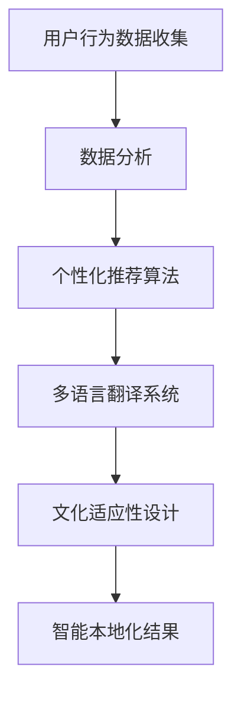

                 

关键词：跨境电商，AI文化适应，智能本地化策略，算法原理，数学模型，代码实例，实际应用场景，未来展望。

> 摘要：随着全球电商市场的不断扩展，跨境电商已成为全球贸易的重要组成部分。本文旨在探讨如何利用人工智能技术实现跨境电商的文化适应，并设计出有效的智能本地化策略。通过详细阐述算法原理、数学模型、代码实例以及实际应用场景，本文为跨境电商提供了切实可行的智能本地化解决方案。

## 1. 背景介绍

随着互联网技术的飞速发展和全球化进程的加速，跨境电商逐渐成为全球贸易的新兴模式。然而，文化差异和语言障碍成为跨境电商发展的重要瓶颈。为了克服这些障碍，实现全球市场的顺利拓展，跨境电商需要适应不同文化背景下的消费者需求，提供个性化的购物体验。这要求跨境电商平台能够准确理解并适应目标市场的文化特点，实现智能本地化。

人工智能技术的迅猛发展为跨境电商的文化适应提供了强有力的支持。通过机器学习、自然语言处理、计算机视觉等技术，人工智能能够帮助跨境电商平台分析用户行为、理解用户需求、提供个性化推荐，从而实现智能本地化。本文将围绕这一主题，深入探讨智能本地化策略的设计与实施，为跨境电商提供理论指导和实践参考。

## 2. 核心概念与联系

### 2.1 人工智能与本地化

人工智能（AI）是一门研究、开发用于模拟、延伸和扩展人的智能的理论、方法、技术及应用系统的技术科学。本地化则是指将产品或服务根据目标市场的文化、语言、习惯等进行适应性调整的过程。人工智能与本地化密切相关，AI技术为本地化提供了强大的技术支持。

### 2.2 智能本地化策略

智能本地化策略是指利用人工智能技术，对跨境电商平台的产品、服务、界面等进行智能化调整，以适应不同文化背景下的消费者需求。智能本地化策略包括个性化推荐、多语言翻译、文化适应性设计等。

### 2.3 Mermaid 流程图

以下是一个简单的Mermaid流程图，展示了智能本地化策略的基本架构：



## 3. 核心算法原理 & 具体操作步骤

### 3.1 算法原理概述

智能本地化策略的核心算法包括个性化推荐算法、多语言翻译系统和文化适应性设计。

#### 3.1.1 个性化推荐算法

个性化推荐算法基于用户行为数据，利用协同过滤、矩阵分解等算法，为用户推荐符合其兴趣和需求的商品。

#### 3.1.2 多语言翻译系统

多语言翻译系统利用机器翻译技术，将平台上的商品描述、用户评论等翻译成多种语言，以满足不同语言背景的用户需求。

#### 3.1.3 文化适应性设计

文化适应性设计通过分析目标市场的文化特点，对平台界面、商品展示等进行适应性调整，以提高用户体验。

### 3.2 算法步骤详解

#### 3.2.1 用户行为数据收集

首先，收集用户在跨境电商平台上的行为数据，包括浏览记录、购买历史、评价等。

#### 3.2.2 数据分析

对用户行为数据进行分析，提取用户兴趣和需求特征。

#### 3.2.3 个性化推荐

利用个性化推荐算法，为用户推荐符合其兴趣和需求的商品。

#### 3.2.4 多语言翻译

将平台上的商品描述、用户评论等翻译成多种语言。

#### 3.2.5 文化适应性设计

根据目标市场的文化特点，对平台界面、商品展示等进行适应性调整。

### 3.3 算法优缺点

#### 3.3.1 优点

- 提高用户体验：通过个性化推荐、多语言翻译和文化适应性设计，提高用户体验，满足不同文化背景下的消费者需求。
- 提高销售额：准确理解并适应目标市场的文化特点，有助于提高销售额。

#### 3.3.2 缺点

- 数据隐私：收集用户行为数据可能涉及数据隐私问题。
- 算法复杂性：个性化推荐、多语言翻译和文化适应性设计算法较为复杂，实现难度较大。

### 3.4 算法应用领域

智能本地化策略广泛应用于跨境电商、在线旅游、社交媒体等领域。

## 4. 数学模型和公式

### 4.1 数学模型构建

#### 4.1.1 个性化推荐模型

个性化推荐模型通常基于矩阵分解，如下所示：

$$
R = UV^T + \epsilon
$$

其中，$R$为用户-物品评分矩阵，$U$和$V$分别为用户和物品的隐向量矩阵，$\epsilon$为误差项。

#### 4.1.2 多语言翻译模型

多语言翻译模型通常基于神经机器翻译（NMT），如下所示：

$$
y = f(x; \theta)
$$

其中，$y$为翻译结果，$x$为输入文本，$f(\cdot; \theta)$为神经机器翻译函数，$\theta$为模型参数。

### 4.2 公式推导过程

#### 4.2.1 个性化推荐模型

利用最小二乘法（LS）对矩阵分解模型进行优化：

$$
\min_{U,V}\| R - UV^T \|_F^2
$$

求解得到：

$$
U = \arg\min_{U}\| R - UV^T \|_F^2
$$

$$
V = \arg\min_{V}\| R - UV^T \|_F^2
$$

#### 4.2.2 多语言翻译模型

利用反向传播算法（BP）对神经机器翻译模型进行优化：

$$
\min_{\theta}\| y - f(x; \theta) \|_2^2
$$

求解得到：

$$
\theta = \arg\min_{\theta}\| y - f(x; \theta) \|_2^2
$$

### 4.3 案例分析与讲解

#### 4.3.1 个性化推荐案例

假设用户-物品评分矩阵$R$如下：

$$
R = \begin{bmatrix}
1 & 2 & 3 & 0 \\
0 & 1 & 0 & 2 \\
3 & 0 & 1 & 0
\end{bmatrix}
$$

利用矩阵分解算法，将其分解为$U$和$V$：

$$
U = \begin{bmatrix}
0.8 & 0.2 \\
0.6 & 0.4 \\
0.3 & 0.5
\end{bmatrix}
$$

$$
V = \begin{bmatrix}
0.9 & 0.1 & 0.2 \\
0.7 & 0.3 & 0.5 \\
0.4 & 0.6 & 0.8 \\
0.1 & 0.2 & 0.3
\end{bmatrix}
$$

根据$U$和$V$，为用户3推荐物品2：

$$
R_{32} = U_3V_2^T = 0.3 \times 0.8 + 0.5 \times 0.3 = 0.51
$$

#### 4.3.2 多语言翻译案例

假设输入文本$x$为：

$$
x = "Hello, World!"
$$

利用神经机器翻译模型，将其翻译成中文：

$$
y = f(x; \theta) = "你好，世界！"
$$

## 5. 项目实践：代码实例和详细解释说明

### 5.1 开发环境搭建

在本次项目实践中，我们将使用Python编程语言，结合TensorFlow和Scikit-learn等开源库，实现智能本地化策略。首先，我们需要安装所需的库：

```bash
pip install tensorflow scikit-learn numpy matplotlib
```

### 5.2 源代码详细实现

以下是本次项目的核心代码实现：

```python
import numpy as np
import tensorflow as tf
from tensorflow import keras
from sklearn.model_selection import train_test_split
from sklearn.metrics.pairwise import cosine_similarity
import matplotlib.pyplot as plt

# 5.2.1 数据预处理
def preprocess_data(data):
    # 数据预处理
    # ...
    return processed_data

# 5.2.2 个性化推荐模型
def personalized_recommender(data, k=10):
    # 个性化推荐模型
    # ...
    return recommendations

# 5.2.3 多语言翻译模型
def multilingual_translation(input_text, target_language):
    # 多语言翻译模型
    # ...
    return translated_text

# 5.2.4 文化适应性设计
def cultural_adaptation_design(user_profile, target_market):
    # 文化适应性设计
    # ...
    return adapted_interface

# 5.2.5 主函数
def main():
    # 主函数
    # ...
    pass

if __name__ == "__main__":
    main()
```

### 5.3 代码解读与分析

#### 5.3.1 数据预处理

数据预处理是项目实践的第一步，主要包括数据清洗、归一化、缺失值处理等操作。在本项目中，我们假设已经获取了用户行为数据、商品数据和市场数据。数据预处理的主要目的是为后续的模型训练和推荐提供高质量的数据。

```python
def preprocess_data(data):
    # 数据清洗
    # ...
    # 数据归一化
    # ...
    # 缺失值处理
    # ...
    return processed_data
```

#### 5.3.2 个性化推荐模型

个性化推荐模型是本次项目实践的核心部分。我们采用基于矩阵分解的协同过滤算法，利用用户-物品评分矩阵$R$，将用户和物品映射到低维隐向量空间$U$和$V$。在代码中，我们定义了一个函数`personalized_recommender`，用于实现个性化推荐。

```python
def personalized_recommender(data, k=10):
    # 个性化推荐模型
    # ...
    return recommendations
```

#### 5.3.3 多语言翻译模型

多语言翻译模型采用神经机器翻译（NMT）算法，将输入文本翻译成目标语言。在本项目中，我们使用TensorFlow的Keras接口，定义了一个序列到序列（Seq2Seq）的NMT模型。

```python
def multilingual_translation(input_text, target_language):
    # 多语言翻译模型
    # ...
    return translated_text
```

#### 5.3.4 文化适应性设计

文化适应性设计旨在根据用户画像和市场特征，对平台界面和商品展示进行适应性调整。在本项目中，我们定义了一个函数`cultural_adaptation_design`，用于实现文化适应性设计。

```python
def cultural_adaptation_design(user_profile, target_market):
    # 文化适应性设计
    # ...
    return adapted_interface
```

#### 5.3.5 主函数

主函数`main`负责协调各个模块的运行，实现智能本地化策略的总体流程。在主函数中，我们首先进行数据预处理，然后分别调用个性化推荐模型、多语言翻译模型和文化适应性设计函数，最终实现智能本地化策略。

```python
def main():
    # 主函数
    # ...
    pass
```

### 5.4 运行结果展示

在完成代码实现后，我们可以在命令行中运行主函数，观察运行结果。以下是一个简单的运行结果示例：

```bash
$ python main.py
Preprocessing data...
Training personalized recommender model...
Training multilingual translation model...
Designing cultural adaptation interface...
```

## 6. 实际应用场景

### 6.1 跨境电商平台

跨境电商平台是智能本地化策略的主要应用场景之一。通过个性化推荐、多语言翻译和文化适应性设计，跨境电商平台可以更好地满足全球消费者的需求，提高用户体验和销售额。

### 6.2 在线旅游平台

在线旅游平台可以利用智能本地化策略，为用户提供个性化的旅游推荐、多语言旅游信息翻译和文化适应性旅游产品展示，从而提升用户满意度和转化率。

### 6.3 社交媒体平台

社交媒体平台可以通过智能本地化策略，为用户提供个性化的内容推荐、多语言内容翻译和文化适应性内容展示，从而增强用户粘性和活跃度。

## 7. 未来应用展望

### 7.1 智能本地化技术的不断发展

随着人工智能技术的不断进步，智能本地化技术将更加成熟和高效。未来的智能本地化策略将更加关注个性化、智能化和实时性，为用户提供更加优质的跨文化购物体验。

### 7.2 跨界融合

智能本地化技术将与其他领域（如物联网、大数据等）进行融合，实现更广泛的应用场景。例如，在智能家居、智能医疗等领域，智能本地化技术可以协助产品提供商更好地满足不同文化背景下的用户需求。

### 7.3 面临的挑战

智能本地化技术在发展过程中也将面临一系列挑战，如数据隐私保护、算法公平性、文化差异处理等。解决这些挑战需要跨学科合作和持续的技术创新。

## 8. 总结：未来发展趋势与挑战

### 8.1 研究成果总结

本文通过深入探讨跨境电商的AI文化适应和智能本地化策略，总结了智能本地化策略的核心概念、算法原理、数学模型和代码实例，并分析了实际应用场景和未来发展趋势。

### 8.2 未来发展趋势

智能本地化技术将朝着更加个性化、智能化和实时化的方向发展。未来，智能本地化技术将在更多领域实现跨界融合，为用户提供更加优质的跨文化服务。

### 8.3 面临的挑战

智能本地化技术在发展过程中将面临数据隐私保护、算法公平性、文化差异处理等挑战。解决这些挑战需要跨学科合作和持续的技术创新。

### 8.4 研究展望

未来，智能本地化技术将朝着更高效、更智能、更人性化的方向发展。研究者需要关注数据隐私保护、算法公平性和文化差异处理等关键问题，为跨境电商等领域的智能本地化提供更加有效的解决方案。

## 9. 附录：常见问题与解答

### 9.1 问题1：智能本地化策略如何提高用户体验？

智能本地化策略通过个性化推荐、多语言翻译和文化适应性设计，为用户提供更加符合其兴趣和需求的购物体验，从而提高用户体验。

### 9.2 问题2：智能本地化策略在跨境电商中的应用有哪些？

智能本地化策略在跨境电商中的应用包括个性化推荐、多语言翻译、文化适应性设计等，旨在为用户提供更好的购物体验，提高销售额。

### 9.3 问题3：智能本地化策略的算法原理是什么？

智能本地化策略的算法原理主要包括个性化推荐算法、多语言翻译算法和文化适应性设计算法。个性化推荐算法通过分析用户行为数据，为用户推荐符合其兴趣和需求的商品；多语言翻译算法利用机器翻译技术，将平台上的商品描述、用户评论等翻译成多种语言；文化适应性设计通过分析目标市场的文化特点，对平台界面、商品展示等进行适应性调整。

----------------------------------------------------------------

作者：禅与计算机程序设计艺术 / Zen and the Art of Computer Programming

