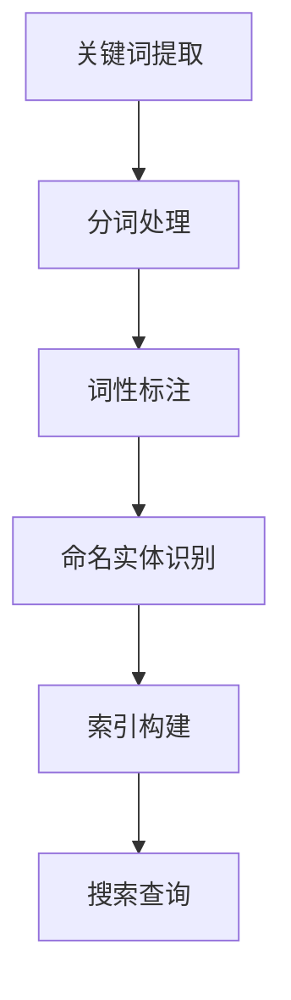
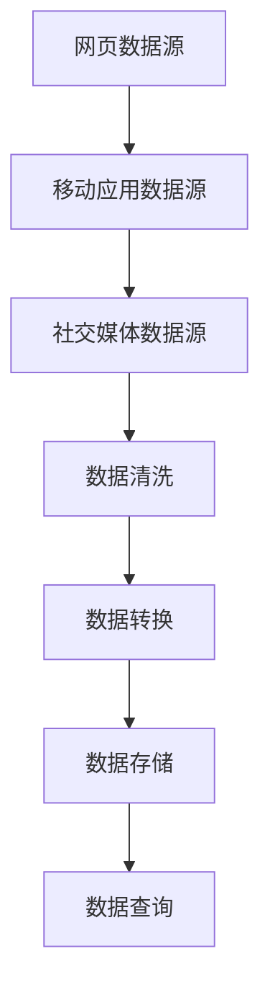
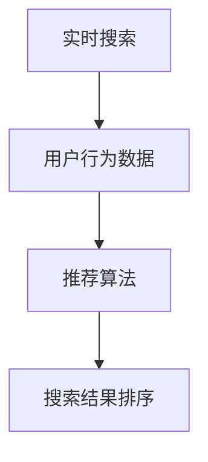

                 

关键词：跨平台搜索，AI，搜索引擎，技术架构，算法优化，大数据处理，用户体验，数据安全，未来展望。

## 摘要

随着互联网的快速发展，信息过载成为现代社会的普遍现象。跨平台搜索技术的兴起，旨在解决用户在多设备、多平台间的信息检索需求。本文将探讨如何将人工智能（AI）技术应用于跨平台搜索，提高搜索的准确性和效率，同时确保数据的安全性和隐私保护。文章将介绍核心概念、算法原理、数学模型，并通过实际项目案例进行详细解析，最后对未来的发展趋势和挑战进行展望。

## 1. 背景介绍

跨平台搜索技术是一种能够在不同操作系统、不同应用环境间实现统一搜索的技术。它允许用户在任何设备上输入查询，然后在多个平台的数据源中寻找相关信息。随着智能手机、平板电脑和物联网设备的普及，跨平台搜索的应用场景越来越广泛，成为现代信息检索技术的重要组成部分。

传统搜索引擎主要依赖于关键词匹配和网页索引技术，但在面对多平台、多样化数据源时，其局限性愈发明显。例如，移动应用、社交媒体、即时通讯等新型数据源的加入，使得传统搜索引擎难以应对。此外，用户对个性化搜索、实时搜索的需求也不断增加，传统搜索技术的效率受到挑战。

## 2. 核心概念与联系

### 2.1. 关键词提取与索引

在跨平台搜索中，关键词提取与索引是基础环节。通过自然语言处理技术（NLP），从用户查询中提取关键信息，并将其转化为索引项。索引项包括关键词、实体名称等，用于快速匹配和检索。



### 2.2. 数据源整合与处理

跨平台搜索需要整合多种数据源，包括网页、移动应用、社交媒体等。数据源整合的挑战在于数据格式的多样性、数据质量的差异以及数据更新频率的不一致性。为此，需要采用分布式数据处理框架，如Hadoop或Spark，对海量数据进行清洗、转换和存储。



### 2.3. 搜索算法优化

跨平台搜索算法需要兼顾准确性、效率和用户体验。常见的搜索算法包括：

- **布尔搜索**：基于逻辑运算符（AND、OR、NOT）进行查询匹配。
- **向量空间模型**：将文本转化为向量，通过余弦相似度进行匹配。
- **深度学习模型**：利用神经网络进行文本理解和匹配。

### 2.4. 实时搜索与个性化推荐

实时搜索技术能够迅速响应用户查询，提供即时的搜索结果。个性化推荐则根据用户的历史行为和偏好，为用户推荐相关内容。这需要利用机器学习和数据挖掘技术，构建用户画像和推荐模型。



## 3. 核心算法原理 & 具体操作步骤

### 3.1 算法原理概述

跨平台搜索算法的核心在于如何高效地处理多源数据，并提供准确、个性化的搜索结果。主要步骤包括：

1. **数据预处理**：对多源数据进行清洗、去重、格式统一等处理。
2. **索引构建**：将预处理后的数据构建索引，便于快速检索。
3. **查询处理**：解析用户查询，将其转换为索引键。
4. **结果排序与展示**：根据查询结果的相关性进行排序，并返回给用户。

### 3.2 算法步骤详解

1. **数据预处理**：

   - **清洗**：去除数据中的噪声和冗余信息。
   - **去重**：识别并删除重复的数据记录。
   - **格式转换**：将不同数据源的数据格式转换为统一的格式。

2. **索引构建**：

   - **倒排索引**：构建文档-词映射关系，实现快速查询。
   - **布隆过滤器**：用于快速判断关键词是否存在，减少不必要的查询。

3. **查询处理**：

   - **分词**：将用户查询分解为关键词。
   - **词性标注**：识别关键词的词性，如名词、动词等。
   - **查询转换**：将用户查询转换为索引键。

4. **结果排序与展示**：

   - **相关性排序**：根据关键词的匹配程度和文档的权重进行排序。
   - **分页显示**：实现搜索结果的分页展示。

### 3.3 算法优缺点

- **优点**：

  - 提高搜索效率：通过索引构建和查询处理优化，实现快速搜索。
  - 灵活性强：支持多种数据源和查询模式。
  - 个性化推荐：结合用户行为数据，提供个性化搜索结果。

- **缺点**：

  - 数据同步问题：多源数据同步困难，可能导致数据不一致。
  - 算法复杂度：涉及多种算法和技术，实现难度较高。

### 3.4 算法应用领域

- **搜索引擎**：为用户提供跨平台的统一搜索服务。
- **内容管理系统**：实现内部文档的统一检索和管理。
- **电子商务**：为用户提供商品搜索和推荐服务。
- **社交媒体**：实现用户发布内容的快速检索和推荐。

## 4. 数学模型和公式 & 详细讲解 & 举例说明

### 4.1 数学模型构建

在跨平台搜索中，常见的数学模型包括：

1. **向量空间模型**：

   文本表示为向量，通过余弦相似度计算文本间的相似度。

   $$ \text{相似度} = \frac{\text{向量}A \cdot \text{向量}B}{\|\text{向量}A\|\|\text{向量}B\|} $$

2. **支持向量机（SVM）**：

   用于文本分类和推荐，通过最大化分类间隔实现分类。

   $$ \text{分类间隔} = \frac{1}{2} \|w\|^2 $$

### 4.2 公式推导过程

以向量空间模型为例，推导过程如下：

1. **文本转化为向量**：

   将文本中的词语表示为向量，每个词语对应一个维度。

   $$ \text{向量}A = (a_1, a_2, ..., a_n) $$
   $$ \text{向量}B = (b_1, b_2, ..., b_n) $$

2. **计算向量点积**：

   $$ \text{向量}A \cdot \text{向量}B = a_1b_1 + a_2b_2 + ... + a_nb_n $$

3. **计算向量模长**：

   $$ \|\text{向量}A\| = \sqrt{a_1^2 + a_2^2 + ... + a_n^2} $$
   $$ \|\text{向量}B\| = \sqrt{b_1^2 + b_2^2 + ... + b_n^2} $$

4. **计算余弦相似度**：

   $$ \text{相似度} = \frac{\text{向量}A \cdot \text{向量}B}{\|\text{向量}A\|\|\text{向量}B\|} $$

### 4.3 案例分析与讲解

假设有两个文档，文档A和文档B，内容如下：

- **文档A**：人工智能、机器学习、神经网络
- **文档B**：深度学习、神经网络、自然语言处理

通过向量空间模型，将文档表示为向量：

$$ \text{向量}A = (1, 1, 1, 0, 0) $$
$$ \text{向量}B = (0, 0, 1, 1, 1) $$

计算向量点积和模长：

$$ \text{向量}A \cdot \text{向量}B = 1*0 + 1*0 + 1*1 + 0*1 + 0*1 = 1 $$
$$ \|\text{向量}A\| = \sqrt{1^2 + 1^2 + 1^2 + 0^2 + 0^2} = \sqrt{3} $$
$$ \|\text{向量}B\| = \sqrt{0^2 + 0^2 + 1^2 + 1^2 + 1^2} = \sqrt{3} $$

计算余弦相似度：

$$ \text{相似度} = \frac{1}{\sqrt{3}\sqrt{3}} = \frac{1}{3} $$

通过计算可知，文档A和文档B的相似度为$\frac{1}{3}$，表明两个文档之间存在一定的相关性。

## 5. 项目实践：代码实例和详细解释说明

### 5.1 开发环境搭建

1. 安装Python环境
2. 安装Elasticsearch搜索引擎
3. 安装相关Python库，如elasticsearch、nltk等

### 5.2 源代码详细实现

以下是一个简单的跨平台搜索项目示例：

```python
from elasticsearch import Elasticsearch
from nltk.tokenize import word_tokenize

# 连接到Elasticsearch集群
es = Elasticsearch("http://localhost:9200")

# 搜索函数
def search(query):
    # 对查询进行分词
    tokens = word_tokenize(query)
    # 构建搜索查询
    search_query = {
        "query": {
            "multi_match": {
                "query": query,
                "fields": ["title", "content"]
            }
        }
    }
    # 发起搜索请求
    response = es.search(index="documents", body=search_query)
    # 返回搜索结果
    return response['hits']['hits']

# 添加文档
def add_document(title, content):
    # 构建文档
    doc = {
        "title": title,
        "content": content
    }
    # 添加文档到Elasticsearch
    es.index(index="documents", id=1, document=doc)

# 搜索示例
results = search("人工智能")
for result in results:
    print(result['_source'])

# 添加文档示例
add_document("深度学习简介", "深度学习是一种机器学习技术，通过模拟人脑神经网络进行学习...")
```

### 5.3 代码解读与分析

1. **Elasticsearch连接**：使用elasticsearch库连接到本地的Elasticsearch集群。
2. **搜索函数**：对用户查询进行分词处理，构建多字段匹配查询，并发起搜索请求。
3. **添加文档**：将文档添加到Elasticsearch索引中，便于后续搜索。

### 5.4 运行结果展示

运行搜索函数后，将输出与查询相关的文档：

```json
{
  "_index": "documents",
  "_type": "_doc",
  "_id": "1",
  "_version": 1,
  "found": true,
  "_source": {
    "title": "深度学习简介",
    "content": "深度学习是一种机器学习技术，通过模拟人脑神经网络进行学习..."
  }
}
```

## 6. 实际应用场景

### 6.1 搜索引擎

跨平台搜索技术广泛应用于搜索引擎，如百度、谷歌等，为用户提供跨平台、跨设备的一站式搜索服务。

### 6.2 内容管理系统

企业内部的内容管理系统（CMS）可以采用跨平台搜索技术，实现文档的统一检索和管理，提高工作效率。

### 6.3 电子商务平台

电子商务平台利用跨平台搜索技术，为用户提供商品搜索和推荐服务，提升用户体验。

### 6.4 社交媒体

社交媒体平台通过跨平台搜索技术，实现用户发布内容的快速检索和推荐，促进社交互动。

## 7. 工具和资源推荐

### 7.1 学习资源推荐

- 《深度学习》（Goodfellow, Bengio, Courville）
- 《Python数据处理技巧》
- 《Elasticsearch权威指南》

### 7.2 开发工具推荐

- Elasticsearch
- Kibana（数据可视化工具）
- Jupyter Notebook（数据分析工具）

### 7.3 相关论文推荐

- "Cross-Platform Search: The Next Frontier in Information Retrieval"
- "Deep Learning for Text Classification"
- "Bert: Pre-training of Deep Bidirectional Transformers for Language Understanding"

## 8. 总结：未来发展趋势与挑战

### 8.1 研究成果总结

跨平台搜索技术在人工智能技术的推动下取得了显著成果，实现了高效、准确、个性化的搜索服务。未来，随着算法和硬件的不断发展，跨平台搜索技术将更加成熟，应用场景将进一步拓展。

### 8.2 未来发展趋势

- **实时搜索与个性化推荐**：结合实时搜索和个性化推荐技术，提供更加精准的搜索服务。
- **多模态搜索**：融合文本、图像、语音等多模态数据，实现跨平台、跨媒体的信息检索。
- **边缘计算与云计算相结合**：通过边缘计算和云计算的结合，实现更高效、更智能的跨平台搜索服务。

### 8.3 面临的挑战

- **数据同步与一致性**：多源数据同步和数据一致性是跨平台搜索技术的关键挑战。
- **算法复杂度与性能优化**：随着搜索算法的复杂度增加，如何优化算法性能成为关键问题。
- **数据安全与隐私保护**：在跨平台搜索中，如何保护用户数据安全和隐私成为重要议题。

### 8.4 研究展望

未来，跨平台搜索技术将在以下几个方面取得突破：

- **智能搜索**：通过深度学习和自然语言处理技术，实现更智能的搜索服务。
- **跨平台协作**：实现跨平台、跨应用的数据共享和协作。
- **隐私保护**：通过加密和隐私保护技术，确保用户数据的安全性和隐私性。

## 9. 附录：常见问题与解答

### Q：什么是跨平台搜索？

A：跨平台搜索是一种能够在不同操作系统、不同应用环境间实现统一搜索的技术，允许用户在任何设备上输入查询，然后在多个平台的数据源中寻找相关信息。

### Q：跨平台搜索有哪些挑战？

A：跨平台搜索面临的挑战包括数据同步与一致性、算法复杂度与性能优化、数据安全与隐私保护等。

### Q：如何实现实时搜索与个性化推荐？

A：实时搜索与个性化推荐可以通过结合深度学习和自然语言处理技术，实时分析用户查询和行为数据，提供个性化搜索结果。

### Q：如何保护用户数据安全与隐私？

A：可以通过加密技术、匿名化和隐私保护算法，确保用户数据在传输和存储过程中的安全性，同时遵守相关法律法规，保护用户隐私。

---

作者：禅与计算机程序设计艺术 / Zen and the Art of Computer Programming

