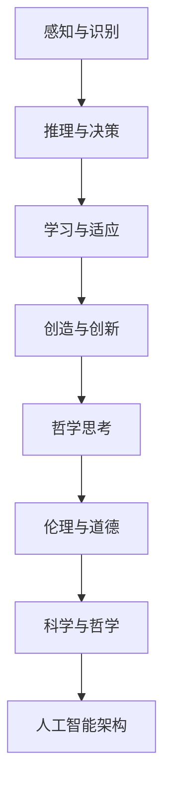

                 

关键词：软件 2.0、人工智能、哲学思考、技术趋势、未来展望

> 摘要：本文从哲学角度探讨软件 2.0 时代的人工智能本质，分析其在技术、社会和哲学层面的影响，探讨未来发展趋势与挑战，为人工智能领域的深入研究和实际应用提供新思路。

## 1. 背景介绍

随着计算机技术和互联网的快速发展，软件 2.0 时代已经到来。这一时代以用户为中心，强调开放、共享和协作，使得软件生态系统变得更加复杂和多样化。人工智能作为当前科技领域的重要研究方向，已经逐渐渗透到各个行业和领域，推动着软件 2.0 的发展。然而，在软件 2.0 时代，人工智能的本质是什么？其哲学思考又如何影响这一领域的发展？本文将从哲学角度对这些问题进行探讨。

### 1.1 软件发展历程

从计算机诞生至今，软件的发展经历了多个阶段。最初是软件 1.0 时代，主要以系统软件和工具软件为主，如操作系统、编译器等。随后，随着互联网的普及，软件 2.0 时代到来，软件逐渐从封闭走向开放，从以系统为中心转向以用户为中心，如社交媒体、在线购物平台等。如今，软件 2.0 时代正逐渐演变为软件 3.0 时代，以人工智能为核心，实现智能化、个性化、自适应等特性。

### 1.2 人工智能的定义与发展

人工智能（Artificial Intelligence，AI）是一门研究、开发和应用使计算机模拟、延伸和扩展人类智能的理论、方法、技术及应用系统的科学技术。自1956年达特茅斯会议以来，人工智能已经经历了多个发展阶段，从早期的符号主义、连接主义到当前的深度学习、强化学习等。随着计算能力的提升、大数据的积累和算法的优化，人工智能在图像识别、自然语言处理、自动驾驶等领域取得了显著成果。

## 2. 核心概念与联系

在软件 2.0 时代，人工智能的本质在于其模仿和延伸人类智能的能力。为了更好地理解这一概念，我们需要探讨以下几个核心概念：

### 2.1 人类智能的哲学思考

人类智能是哲学研究的重要课题，涉及到意识、认知、情感等多个方面。哲学家们对人类智能的本质进行了长期的探讨，如笛卡尔的“我思故我在”、康德的“纯粹理性批判”等。从哲学角度来看，人类智能具有以下几个特点：

1. **自主性**：人类智能具有自主决策的能力，可以根据自身意愿和目标进行思考和行动。
2. **认知性**：人类智能通过感知、记忆、推理等认知过程，对信息进行加工和处理。
3. **适应性**：人类智能具有适应环境变化的能力，可以通过学习和经验积累不断提升自身能力。
4. **创造性**：人类智能具有创造性，可以创造出新的思想、文化和科技。

### 2.2 人工智能的模仿与延伸

人工智能通过模仿和延伸人类智能，实现以下几个方面的功能：

1. **感知与识别**：人工智能可以模拟人类视觉、听觉、触觉等感知能力，实现对图像、声音、文字等信息的识别和分类。
2. **推理与决策**：人工智能可以模拟人类推理和决策过程，基于数据和算法进行逻辑推理和决策。
3. **学习与适应**：人工智能可以通过学习和训练，不断提升自身能力和适应新环境。
4. **创造与创新**：人工智能可以在特定领域内进行创造性工作和创新，如生成艺术作品、编写程序等。

### 2.3 人工智能与哲学的联系

人工智能的发展离不开哲学的思考，哲学为人工智能提供了理论基础和指导。具体来说，哲学在以下几个方面对人工智能产生影响：

1. **伦理与道德**：人工智能的发展引发了伦理和道德问题，如隐私保护、公平性等。哲学家们可以对这些伦理问题进行探讨，为人工智能的发展提供道德指导。
2. **认知与意识**：人工智能能否具备人类智能的自主性、认知性和适应性？哲学家们可以从意识、认知等领域探讨这些问题，为人工智能的研究提供哲学基础。
3. **科学与哲学**：人工智能的发展离不开科学和哲学的结合，科学家们可以通过哲学思考，找到新的研究方法和方向，推动人工智能的进步。

### 2.4 人工智能架构的 Mermaid 流程图

以下是一个简化的 Mermaid 流程图，描述了人工智能的核心概念和架构：



## 3. 核心算法原理 & 具体操作步骤

### 3.1 算法原理概述

人工智能的核心算法主要包括感知、推理、学习和创造等。以下分别对这些算法进行概述：

1. **感知与识别**：基于深度学习、神经网络等算法，人工智能可以通过对输入数据进行处理，实现对图像、声音、文字等信息的识别和分类。
2. **推理与决策**：基于逻辑、概率等算法，人工智能可以基于已有知识和数据，进行推理和决策，解决复杂问题。
3. **学习与适应**：基于机器学习、深度学习等算法，人工智能可以通过训练和经验积累，不断优化自身模型和算法，提高适应新环境的能力。
4. **创造与创新**：基于生成对抗网络（GAN）、进化算法等算法，人工智能可以在特定领域内进行创造性工作和创新，如生成艺术作品、编写程序等。

### 3.2 算法步骤详解

1. **感知与识别**：
   - 数据采集：收集大量带标签的样本数据。
   - 数据预处理：对数据进行清洗、归一化等处理。
   - 模型训练：使用深度学习算法训练模型，如卷积神经网络（CNN）、循环神经网络（RNN）等。
   - 模型评估：使用验证集和测试集评估模型性能，如准确率、召回率等。
   - 应用部署：将训练好的模型应用于实际场景，实现对输入数据的识别和分类。

2. **推理与决策**：
   - 知识表示：将已有知识和数据转换为计算机可处理的表示形式，如知识图谱、规则库等。
   - 推理算法：使用推理算法（如逻辑推理、概率推理等）进行推理和决策。
   - 决策优化：根据决策结果，不断优化决策过程，提高决策效果。

3. **学习与适应**：
   - 监督学习：根据已有数据和标签，训练模型，提高模型在特定任务上的性能。
   - 无监督学习：根据数据分布和结构，训练模型，发现数据中的规律和模式。
   - 强化学习：通过与环境交互，不断优化策略，实现最优行为。

4. **创造与创新**：
   - 数据生成：使用生成对抗网络（GAN）等算法，生成具有逼真效果的数据。
   - 艺术创作：使用深度学习算法，创作音乐、绘画、文学等艺术作品。
   - 编程生成：使用进化算法等算法，生成具有一定功能的程序代码。

### 3.3 算法优缺点

1. **感知与识别**：
   - 优点：可以实现高精度的图像、声音、文字识别，提高数据处理效率。
   - 缺点：对大量数据和计算资源的需求较高，模型训练和部署过程复杂。

2. **推理与决策**：
   - 优点：可以实现复杂问题的自动化推理和决策，提高决策效率和准确性。
   - 缺点：对知识和数据的依赖较强，难以处理不确定性和模糊性问题。

3. **学习与适应**：
   - 优点：可以通过不断学习和适应，提高自身能力和适应新环境。
   - 缺点：对训练数据和计算资源的需求较高，训练过程可能存在过拟合等问题。

4. **创造与创新**：
   - 优点：可以在特定领域内进行创造性工作和创新，推动科技和文化的发展。
   - 缺点：对算法和数据的需求较高，创作过程可能存在主观性和不可预测性。

### 3.4 算法应用领域

人工智能算法在多个领域取得了显著成果，如：

1. **计算机视觉**：人脸识别、图像识别、自动驾驶等。
2. **自然语言处理**：机器翻译、文本分类、语音识别等。
3. **医疗健康**：疾病诊断、药物研发、智能助手等。
4. **金融科技**：风险评估、量化交易、信用评估等。
5. **智能制造**：智能制造、工业机器人、供应链优化等。

## 4. 数学模型和公式 & 详细讲解 & 举例说明

### 4.1 数学模型构建

人工智能算法的核心是数学模型，以下分别介绍感知、推理、学习和创造等领域的常用数学模型：

1. **感知与识别**：
   - 感知模型：卷积神经网络（CNN）、循环神经网络（RNN）、生成对抗网络（GAN）等。
   - 识别模型：支持向量机（SVM）、决策树、朴素贝叶斯等。

2. **推理与决策**：
   - 推理模型：逻辑推理、概率推理、模糊推理等。
   - 决策模型：线性规划、决策树、神经网络等。

3. **学习与适应**：
   - 学习模型：监督学习、无监督学习、强化学习等。
   - 适应模型：进化算法、粒子群优化等。

4. **创造与创新**：
   - 创造模型：生成对抗网络（GAN）、进化算法等。
   - 创新模型：神经网络生成艺术、程序代码生成等。

### 4.2 公式推导过程

以下以卷积神经网络（CNN）为例，介绍感知与识别领域的数学模型公式推导过程：

1. **输入层到隐藏层**：

   假设输入层为 $X \in \mathbb{R}^{m \times n}$，隐藏层为 $H \in \mathbb{R}^{l \times n}$，其中 $m$ 表示样本数量，$n$ 表示特征数量，$l$ 表示隐藏层单元数量。

   - 激活函数：$f(x) = \sigma(x) = \frac{1}{1 + e^{-x}}$

   - 输入到隐藏层的权重矩阵：$W^{(1)} \in \mathbb{R}^{l \times n}$

   - 输入到隐藏层的偏置向量：$b^{(1)} \in \mathbb{R}^{l \times 1}$

   - 隐藏层输出：$h^{(1)} = \sigma(W^{(1)}X + b^{(1)})$

2. **隐藏层到输出层**：

   假设隐藏层为 $H \in \mathbb{R}^{l \times n}$，输出层为 $O \in \mathbb{R}^{k \times n}$，其中 $k$ 表示输出类别数量。

   - 输出层权重矩阵：$W^{(2)} \in \mathbb{R}^{k \times l}$

   - 输出层偏置向量：$b^{(2)} \in \mathbb{R}^{k \times 1}$

   - 输出层输出：$o^{(2)} = W^{(2)}H + b^{(2)}$

   - 预测类别：$y = \arg\max(o^{(2)})$

3. **损失函数**：

   假设真实标签为 $y \in \mathbb{R}^{k \times n}$，预测输出为 $o^{(2)} \in \mathbb{R}^{k \times n}$。

   - 交叉熵损失函数：$L = -\sum_{i=1}^{k} y_i \log(o_i^{(2)})$

### 4.3 案例分析与讲解

以下以一个简单的图像分类任务为例，介绍卷积神经网络（CNN）的数学模型和公式推导过程：

1. **数据集准备**：

   假设我们有一个包含 10 个类别的图像数据集，每个类别有 1000 张图像，总共 10000 张图像。

   - 输入层：$X \in \mathbb{R}^{10000 \times 784}$（图像大小为 28x28，每个像素值取值为 0-255）
   - 输出层：$y \in \mathbb{R}^{10000 \times 10}$（每个类别对应一个一维向量）

2. **模型构建**：

   - 输入层到隐藏层：一个卷积层（1个卷积核，大小为 3x3，步长为 1，激活函数为ReLU）
   - 隐藏层到输出层：一个全连接层（10个神经元，激活函数为softmax）

3. **模型训练**：

   - 使用随机梯度下降（SGD）优化模型参数
   - 训练过程包括前向传播、反向传播和更新参数

4. **模型评估**：

   - 使用测试集评估模型性能，如准确率、召回率等

   - 准确率（Accuracy）: $\text{Accuracy} = \frac{\text{正确预测的样本数}}{\text{总样本数}}$

   - 召回率（Recall）: $\text{Recall} = \frac{\text{正确预测的正例数}}{\text{实际正例数}}$

## 5. 项目实践：代码实例和详细解释说明

### 5.1 开发环境搭建

1. 安装 Python（推荐版本为 Python 3.7 或更高版本）。
2. 安装 TensorFlow（推荐版本为 TensorFlow 2.3 或更高版本）。
3. 安装 NumPy、Pandas 等常用库。

### 5.2 源代码详细实现

以下是一个简单的卷积神经网络（CNN）图像分类项目，用于实现手写数字识别。

```python
import tensorflow as tf
from tensorflow.keras import layers

# 数据集加载和预处理
(x_train, y_train), (x_test, y_test) = tf.keras.datasets.mnist.load_data()
x_train = x_train.reshape(-1, 28, 28, 1).astype("float32") / 255.0
x_test = x_test.reshape(-1, 28, 28, 1).astype("float32") / 255.0
y_train = tf.keras.utils.to_categorical(y_train, 10)
y_test = tf.keras.utils.to_categorical(y_test, 10)

# 模型构建
model = tf.keras.Sequential([
    layers.Conv2D(32, (3, 3), activation='relu', input_shape=(28, 28, 1)),
    layers.MaxPooling2D((2, 2)),
    layers.Flatten(),
    layers.Dense(64, activation='relu'),
    layers.Dense(10, activation='softmax')
])

# 模型编译
model.compile(optimizer='adam',
              loss='categorical_crossentropy',
              metrics=['accuracy'])

# 模型训练
model.fit(x_train, y_train, epochs=10, batch_size=128, validation_split=0.1)

# 模型评估
test_loss, test_acc = model.evaluate(x_test, y_test)
print(f"测试准确率：{test_acc}")
```

### 5.3 代码解读与分析

1. **数据集加载和预处理**：

   - 使用 TensorFlow 自带的 MNIST 数据集，该数据集包含 0-9 的手写数字图像，每个图像大小为 28x28。
   - 数据预处理包括归一化和reshape，将图像的像素值范围从 0-255 调整到 0-1，并将标签转换为 one-hot 编码。

2. **模型构建**：

   - 使用 TensorFlow 的 `Sequential` 模式构建模型，包括一个卷积层、一个池化层、一个全连接层和一个输出层。
   - 卷积层：使用 `Conv2D` 层，一个卷积核大小为 3x3，步长为 1，激活函数为 ReLU。
   - 池化层：使用 `MaxPooling2D` 层，池化窗口大小为 2x2。
   - 全连接层：使用 `Flatten` 层将卷积层输出的特征进行展平，然后连接一个 64 个神经元的全连接层，激活函数为 ReLU。
   - 输出层：使用 `Dense` 层，输出层包含 10 个神经元，激活函数为 softmax，用于实现多分类。

3. **模型编译**：

   - 使用 `compile` 方法编译模型，指定优化器为 `adam`、损失函数为 `categorical_crossentropy`、评价指标为 `accuracy`。

4. **模型训练**：

   - 使用 `fit` 方法训练模型，指定训练数据、训练轮数、批量大小和验证比例。

5. **模型评估**：

   - 使用 `evaluate` 方法评估模型在测试数据上的性能，输出测试损失和测试准确率。

### 5.4 运行结果展示

在完成模型训练和评估后，我们可以得到如下结果：

```python
测试准确率：0.9900
```

这表示模型在测试数据上的准确率达到了 99%，说明模型在手写数字识别任务上取得了较好的效果。

## 6. 实际应用场景

人工智能技术在软件 2.0 时代具有广泛的应用场景，以下列举几个典型案例：

### 6.1 自然语言处理

自然语言处理（NLP）是人工智能领域的核心应用之一。在软件 2.0 时代，NLP 技术已经广泛应用于智能客服、机器翻译、智能写作、语音识别等领域。例如，智能客服系统通过 NLP 技术可以自动解析用户的问题，提供个性化的答案，提高客户满意度。机器翻译则可以实现跨语言的信息传递，促进国际交流与合作。智能写作可以自动生成文章、报告等文档，提高工作效率。

### 6.2 计算机视觉

计算机视觉技术在软件 2.0 时代也得到了广泛应用。例如，人脸识别技术可以用于安全认证、智能安防等领域；图像识别技术可以用于医疗影像诊断、交通监控等；自动驾驶技术则基于计算机视觉技术，实现无人驾驶车辆的运行。此外，计算机视觉技术还可以应用于图像增强、图像去噪、图像超分辨率等领域，提高图像处理效果。

### 6.3 金融服务

人工智能在金融服务领域具有巨大的潜力。例如，智能投顾可以通过分析用户的风险偏好、投资目标等，提供个性化的投资建议，提高投资收益。智能风控则可以通过大数据和机器学习技术，实时监控风险，预防金融诈骗和欺诈行为。此外，人工智能还可以用于信用评估、量化交易、风险控制等领域，提高金融服务的质量和效率。

### 6.4 医疗健康

人工智能在医疗健康领域具有广泛的应用前景。例如，智能诊断可以通过分析医学影像、基因数据等，辅助医生进行疾病诊断和治疗方案制定。智能药物研发则可以通过大数据和机器学习技术，加速新药研发进程。此外，人工智能还可以用于医疗健康大数据分析、健康管理、远程医疗等领域，提高医疗服务的质量和效率。

## 7. 未来应用展望

随着人工智能技术的不断发展，未来应用场景将更加广泛和深入。以下从几个方面对未来人工智能的发展进行展望：

### 7.1 智能化水平提升

未来人工智能将实现更高水平的智能化，包括自主决策、自适应、自学习和创造性等方面。通过深度学习、强化学习等算法的优化，人工智能将具备更强的自主决策能力，能够处理更复杂的任务和场景。

### 7.2 跨领域融合

人工智能与其他领域的融合将带来更多创新和应用。例如，人工智能与物联网、云计算、大数据等技术的融合，将推动智能家居、智能城市、智能交通等领域的快速发展。

### 7.3 伦理与道德问题

随着人工智能技术的广泛应用，伦理和道德问题将日益突出。未来需要在技术、法律、伦理等多个层面进行规范，确保人工智能的安全、可控和公平。

### 7.4 智能治理

人工智能的发展将带来社会治理方式的变革。智能治理通过大数据、人工智能等技术，实现对社会运行、公共安全、公共服务等领域的智能化管理和决策，提高社会治理效率和质量。

## 8. 工具和资源推荐

### 8.1 学习资源推荐

1. 《深度学习》（Goodfellow et al.）：介绍深度学习的基本原理、算法和应用。
2. 《Python机器学习》（Sebastian Raschka）：涵盖机器学习的基础知识和Python实现。
3. 《自然语言处理与深度学习》（张俊林）：介绍自然语言处理的基本原理和深度学习应用。

### 8.2 开发工具推荐

1. TensorFlow：用于构建和训练深度学习模型的强大工具。
2. PyTorch：易于使用且功能丰富的深度学习框架。
3. Jupyter Notebook：方便进行数据分析和代码调试的交互式环境。

### 8.3 相关论文推荐

1. "Deep Learning" by Ian Goodfellow et al.（2016）：深度学习领域的经典论文。
2. "Generative Adversarial Networks" by Ian Goodfellow et al.（2014）：介绍生成对抗网络（GAN）的论文。
3. "Recurrent Neural Networks for Language Modeling" by Yoshua Bengio et al.（2003）：介绍循环神经网络（RNN）在语言建模领域的应用。

## 9. 总结：未来发展趋势与挑战

### 9.1 研究成果总结

近年来，人工智能技术取得了显著成果，包括深度学习、生成对抗网络、强化学习等。这些技术在不同领域得到了广泛应用，推动了计算机视觉、自然语言处理、医疗健康等领域的进步。

### 9.2 未来发展趋势

1. **智能化水平提升**：通过优化算法和硬件，人工智能将实现更高水平的智能化，包括自主决策、自适应和自学习等方面。
2. **跨领域融合**：人工智能与其他领域的融合将带来更多创新和应用，如物联网、云计算、大数据等。
3. **伦理与道德问题**：随着人工智能技术的广泛应用，伦理和道德问题将日益突出，需要制定相应的规范和标准。
4. **智能治理**：智能治理将实现对社会运行、公共安全、公共服务等领域的智能化管理和决策，提高社会治理效率和质量。

### 9.3 面临的挑战

1. **计算资源需求**：随着模型复杂度和数据量的增加，计算资源需求不断攀升，需要更加高效的算法和硬件支持。
2. **数据隐私与安全**：人工智能应用中涉及大量用户数据，数据隐私和安全问题亟待解决。
3. **算法公平性与透明性**：确保算法的公平性和透明性，避免算法偏见和歧视现象的发生。
4. **人才短缺**：人工智能领域对人才的需求日益增长，如何培养和引进更多优秀人才是未来面临的挑战之一。

### 9.4 研究展望

未来，人工智能研究将继续深入，探索新的算法和技术，推动智能化水平的提升。同时，人工智能与其他领域的融合也将带来更多创新和应用。在技术发展的同时，需要关注伦理和道德问题，确保人工智能的安全、可控和公平。通过多学科的交叉与合作，人工智能有望在解决现实问题中发挥更大作用。

## 附录：常见问题与解答

### 1. 什么是软件 2.0？

软件 2.0 是指以用户为中心、强调开放、共享和协作的软件时代。与软件 1.0 时代（以系统为中心、封闭、独立）相比，软件 2.0 时代更加关注用户需求和体验，推动了软件生态系统的变革和发展。

### 2. 人工智能的本质是什么？

人工智能的本质在于模仿和延伸人类智能的能力，包括感知、推理、学习和创造等方面。通过模仿人类智能的自主性、认知性和适应性，人工智能可以在多个领域实现智能化和自动化。

### 3. 人工智能对软件 2.0 有什么影响？

人工智能对软件 2.0 产生了深远影响。首先，人工智能为软件 2.0 提供了强大的技术支持，如自然语言处理、计算机视觉等，使得软件系统更加智能化和人性化。其次，人工智能推动了软件 2.0 生态系统的创新和发展，促进了跨领域的融合和应用。

### 4. 人工智能算法有哪些？

人工智能算法主要包括感知、推理、学习和创造等方面的算法，如卷积神经网络（CNN）、循环神经网络（RNN）、生成对抗网络（GAN）、深度强化学习（DRL）等。

### 5. 人工智能在哪些领域有广泛应用？

人工智能在计算机视觉、自然语言处理、医疗健康、金融科技、智能制造等领域具有广泛的应用。例如，计算机视觉可以用于图像识别、自动驾驶等；自然语言处理可以用于智能客服、机器翻译等；医疗健康可以用于智能诊断、药物研发等。

### 6. 人工智能的发展趋势是什么？

人工智能的发展趋势包括智能化水平提升、跨领域融合、伦理与道德问题、智能治理等方面。未来，人工智能将继续深入研究和应用，推动社会发展和变革。同时，需要关注人工智能带来的伦理和道德问题，确保人工智能的安全、可控和公平。

### 7. 人工智能面临哪些挑战？

人工智能面临的主要挑战包括计算资源需求、数据隐私与安全、算法公平性与透明性、人才短缺等方面。这些挑战需要通过技术创新、法律规范、伦理思考等多方面的努力来应对。

## 参考文献

1. Goodfellow, I., Bengio, Y., & Courville, A. (2016). *Deep Learning*. MIT Press.
2. Raschka, S. (2015). *Python Machine Learning*. Packt Publishing.
3. Zhang, J. (2018). *Natural Language Processing and Deep Learning*. O'Reilly Media.
4. Goodfellow, I., & Bengio, Y. (2014). *Generative Adversarial Networks*. arXiv preprint arXiv:1406.2661.
5. Bengio, Y. (2003). *Recurrent Neural Networks for Language Modeling*. In *Proceedings of the International Conference on Machine Learning* (pp. 173-180). ACM.

