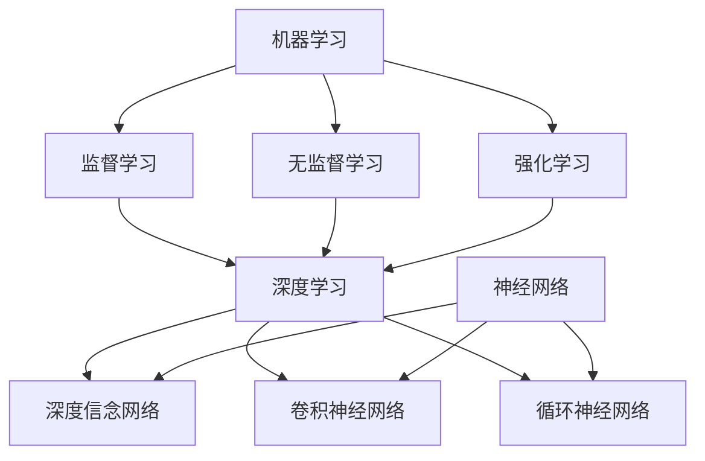

                 

关键词：软件2.0，人工智能，哲学思考，本质，技术语言，深度学习，机器学习，编程范式，算法架构，计算机科学，未来趋势，研究展望。

> 摘要：本文以软件2.0的哲学思考为核心，深入探讨人工智能的本质及其在计算机科学中的地位。通过阐述核心概念与联系，剖析核心算法原理，构建数学模型和公式，结合实际项目实践，全面揭示人工智能领域的应用场景与发展前景。本文旨在为读者提供一份既有深度又有思考的技术性文章，帮助理解和把握人工智能领域的未来发展趋势与挑战。

## 1. 背景介绍

软件2.0，这个概念起源于互联网时代，是对软件1.0阶段的一种升华。软件1.0以功能为核心，追求的是软件功能的完备性和稳定性。而软件2.0则更加注重软件的智能化、自动化和自适应能力，尤其是在人工智能技术的推动下，软件2.0开始呈现出一种全新的发展态势。

人工智能（Artificial Intelligence，简称AI）作为计算机科学的重要分支，其研究目的是模拟、延伸和扩展人的智能，使计算机能够具备人类的感知、思考和学习能力。随着深度学习、机器学习等技术的发展，人工智能已经从理论研究走向了实际应用，成为推动社会进步的重要力量。

本文将从软件2.0的哲学思考出发，探讨人工智能的本质，分析其核心概念与联系，剖析核心算法原理，构建数学模型和公式，结合实际项目实践，探讨人工智能的应用场景，最后总结未来发展趋势与挑战。

### 1.1 软件发展历程

软件的发展历程可以大致分为三个阶段：

1. **软件1.0时代**：以功能为核心，追求软件的完备性和稳定性。这个阶段主要集中在20世纪60年代到80年代，代表性的工作有FORTRAN、COBOL等高级编程语言的诞生。

2. **软件2.0时代**：随着互联网的兴起，软件的功能不再局限于单一的任务，而是变得更加智能化、自动化和自适应。这个阶段从20世纪90年代开始，代表性的工作有Web 2.0、云计算等。

3. **软件3.0时代**：人工智能技术的快速发展，使得软件开始具备自主学习和进化能力。这个阶段正在到来，代表性的工作有深度学习、自然语言处理等。

### 1.2 人工智能发展历程

人工智能的发展历程可以追溯到20世纪50年代。早期的AI研究主要集中在逻辑推理和知识表示方面，代表性的工作有普华永道（John McCarthy）提出的“人工智能”概念和达赖喇嘛（Herb Simon）提出的“有限理性”理论。

20世纪80年代，随着计算机性能的提升，AI开始向更复杂的任务迈进，如模式识别、自然语言处理等。这个阶段代表性的工作有霍普菲尔德（John Hopfield）提出的神经网络模型和温斯顿（Paul Winston）开发的机器人控制程序。

21世纪初，随着深度学习技术的崛起，人工智能迎来了新的发展高峰。深度学习通过多层神经网络实现了对大规模数据的自动特征学习和模型优化，使得计算机在图像识别、语音识别等领域取得了突破性进展。代表性的工作有霍普菲尔德（Geoffrey Hinton）提出的深度信念网络和伯恩斯坦（Yann LeCun）提出的卷积神经网络。

### 1.3 软件2.0与人工智能的关系

软件2.0与人工智能的关系是相辅相成的。软件2.0为人工智能提供了更广阔的应用场景和更强大的技术支撑，而人工智能则为软件2.0注入了智能化的活力。

首先，软件2.0注重用户参与和个性化体验，这为人工智能的应用提供了丰富的数据资源和场景需求。例如，社交媒体、电子商务等领域的数据量庞大，为人工智能的研究和应用提供了丰富的素材。

其次，人工智能技术为软件2.0提供了智能化、自动化和自适应的能力。通过深度学习、机器学习等技术，软件可以不断学习和优化，实现更高的效率和更好的用户体验。

最后，软件2.0与人工智能的融合推动了计算机科学的发展。人工智能技术不仅应用于软件领域，还渗透到硬件、网络、数据等各个方面，推动了整个计算机科学领域的创新和进步。

## 2. 核心概念与联系

在探讨人工智能的本质之前，我们需要明确几个核心概念，包括机器学习、深度学习、神经网络等。这些概念之间存在着紧密的联系，共同构成了人工智能的技术基础。

### 2.1 机器学习

机器学习（Machine Learning）是人工智能的核心技术之一，其基本思想是通过算法从数据中学习规律，从而实现对未知数据的预测和分类。机器学习可以分为监督学习、无监督学习和强化学习三种类型。

- **监督学习**：在有监督的学习中，我们有一组输入和对应的输出，目标是找到一个函数来映射输入和输出。例如，在图像分类任务中，输入是图像，输出是图像的类别。

- **无监督学习**：无监督学习没有明确的输出，目标是发现数据中的内在结构。例如，在聚类任务中，我们希望将相似的数据点分为一组。

- **强化学习**：强化学习通过与环境进行交互，从反馈中学习最优策略。它通常用于决策问题，如游戏、自动驾驶等。

### 2.2 深度学习

深度学习（Deep Learning）是机器学习的一个重要分支，其核心思想是使用多层神经网络来学习复杂的非线性关系。深度学习在图像识别、语音识别、自然语言处理等领域取得了显著的成果。

- **深度信念网络**（Deep Belief Network，DBN）：DBN是一种基于多层神经网络的学习算法，通过预训练和微调两个阶段来优化网络参数。

- **卷积神经网络**（Convolutional Neural Network，CNN）：CNN是一种用于图像识别的深度学习模型，其特点是使用卷积层来提取图像的局部特征。

- **循环神经网络**（Recurrent Neural Network，RNN）：RNN适用于处理序列数据，其特点是能够记忆历史信息。

### 2.3 神经网络

神经网络（Neural Network）是人工智能的基础模型，其灵感来源于生物神经系统的结构和功能。神经网络由大量的神经元（节点）组成，通过加权连接形成网络结构。

- **前向传播**：在前向传播过程中，输入数据从输入层经过多层隐藏层，最终到达输出层，形成预测结果。

- **反向传播**：在反向传播过程中，通过计算输出层与实际结果之间的误差，反向传播误差到隐藏层，更新网络参数。

- **优化算法**：常见的优化算法有随机梯度下降（Stochastic Gradient Descent，SGD）、Adam优化器等，用于调整网络参数，优化模型性能。

### 2.4 Mermaid 流程图

为了更直观地展示这些核心概念之间的联系，我们可以使用Mermaid流程图来表示。以下是一个简化的流程图：



## 3. 核心算法原理 & 具体操作步骤

在深入探讨人工智能的核心算法原理之前，我们需要了解一些基本概念，包括损失函数、梯度下降、激活函数等。这些概念构成了深度学习算法的核心部分。

### 3.1 算法原理概述

深度学习算法的核心是神经网络，而神经网络的训练过程主要包括以下几个步骤：

1. **初始化参数**：随机初始化网络中的权重和偏置。
2. **前向传播**：输入数据通过神经网络，计算输出结果。
3. **计算损失**：通过损失函数计算输出结果与实际结果之间的差距。
4. **反向传播**：计算损失函数关于网络参数的梯度，并更新网络参数。
5. **迭代优化**：重复上述步骤，直到网络参数达到预期性能。

### 3.2 算法步骤详解

#### 3.2.1 初始化参数

初始化参数是神经网络训练的第一步。常见的初始化方法有随机初始化、高斯分布初始化等。随机初始化方法简单易行，但可能导致训练不稳定；高斯分布初始化可以保证参数的多样性，但需要确定合适的分布参数。

#### 3.2.2 前向传播

前向传播是将输入数据通过神经网络，从输入层传递到输出层，得到预测结果的过程。在这个过程中，每个神经元都会将输入乘以权重，再加上偏置，然后通过激活函数计算输出。

#### 3.2.3 计算损失

损失函数是衡量预测结果与实际结果差距的函数。常见的损失函数有均方误差（MSE）、交叉熵损失等。损失函数的值越小，表示预测结果越接近实际结果。

#### 3.2.4 反向传播

反向传播是神经网络训练的核心步骤，通过计算损失函数关于网络参数的梯度，并更新网络参数，使得损失函数值逐渐减小。反向传播的过程可以分为以下几个步骤：

1. **计算输出层梯度**：计算输出层误差关于输出层神经元的梯度。
2. **反向传播梯度**：将输出层梯度反向传播到隐藏层，计算隐藏层误差关于隐藏层神经元的梯度。
3. **更新参数**：使用梯度下降或其他优化算法更新网络参数。

#### 3.2.5 迭代优化

迭代优化是通过重复前向传播和反向传播过程，不断更新网络参数，使得网络性能逐渐提升。在训练过程中，我们可以设置学习率、迭代次数等参数，以控制训练过程。

### 3.3 算法优缺点

#### 优点

1. **强大的拟合能力**：神经网络可以学习复杂的非线性关系，适用于各种复杂任务。
2. **自适应能力**：通过反向传播算法，神经网络可以自动调整参数，实现自主学习和优化。
3. **广泛的适用性**：神经网络在图像识别、语音识别、自然语言处理等领域都取得了显著的成果。

#### 缺点

1. **训练时间较长**：深度学习模型的训练通常需要大量时间和计算资源。
2. **对数据需求较高**：深度学习模型需要大量的训练数据来保证模型的泛化能力。
3. **解释性较差**：神经网络模型通常被视为“黑箱”，难以解释其决策过程。

### 3.4 算法应用领域

深度学习算法在计算机科学和人工智能领域有着广泛的应用，以下是一些典型的应用场景：

1. **图像识别**：深度学习在图像识别领域取得了突破性进展，例如人脸识别、物体检测等。
2. **语音识别**：深度学习算法在语音识别领域得到了广泛应用，例如语音助手、语音翻译等。
3. **自然语言处理**：深度学习在自然语言处理领域有着重要应用，例如机器翻译、情感分析等。
4. **自动驾驶**：深度学习在自动驾驶领域发挥着关键作用，用于车辆检测、路径规划等任务。
5. **医疗健康**：深度学习在医疗健康领域有着广泛应用，例如疾病诊断、药物研发等。

## 4. 数学模型和公式 & 详细讲解 & 举例说明

在深度学习算法中，数学模型和公式起到了至关重要的作用。下面我们将详细讲解一些核心的数学模型和公式，并举例说明其在实际应用中的效果。

### 4.1 数学模型构建

深度学习中的数学模型主要包括神经网络模型、损失函数、优化算法等。

#### 4.1.1 神经网络模型

神经网络模型由多个神经元组成，每个神经元都可以看作是一个简单的函数。神经网络的输出可以通过以下公式表示：

$$
y = f(W \cdot x + b)
$$

其中，$y$表示神经网络的输出，$f$表示激活函数，$W$表示权重矩阵，$x$表示输入向量，$b$表示偏置项。

#### 4.1.2 损失函数

损失函数是衡量预测结果与实际结果差距的函数。常见的损失函数有均方误差（MSE）和交叉熵损失（Cross Entropy Loss）。

- **均方误差（MSE）**：

$$
MSE = \frac{1}{n} \sum_{i=1}^{n} (y_i - \hat{y}_i)^2
$$

其中，$y_i$表示实际输出，$\hat{y}_i$表示预测输出，$n$表示样本数量。

- **交叉熵损失（Cross Entropy Loss）**：

$$
CE = -\sum_{i=1}^{n} y_i \log(\hat{y}_i)
$$

其中，$y_i$表示实际输出，$\hat{y}_i$表示预测输出，$\log$表示自然对数。

#### 4.1.3 优化算法

优化算法用于更新神经网络中的权重和偏置，以最小化损失函数。常见的优化算法有随机梯度下降（SGD）和Adam优化器。

- **随机梯度下降（SGD）**：

$$
W_{\text{new}} = W - \alpha \frac{\partial J(W)}{\partial W}
$$

其中，$W$表示当前权重，$W_{\text{new}}$表示更新后的权重，$\alpha$表示学习率，$J(W)$表示损失函数。

- **Adam优化器**：

$$
m_t = \beta_1 x_t + (1 - \beta_1) (x_t - x_{t-1})
$$

$$
v_t = \beta_2 x_t + (1 - \beta_2) (x_t - x_{t-1})
$$

$$
\hat{m}_t = \frac{m_t}{1 - \beta_1^t}
$$

$$
\hat{v}_t = \frac{v_t}{1 - \beta_2^t}
$$

$$
W_{\text{new}} = W - \alpha \frac{\hat{m}_t}{\sqrt{\hat{v}_t} + \epsilon}
$$

其中，$m_t$和$v_t$分别表示一阶矩估计和二阶矩估计，$\beta_1$和$\beta_2$分别表示一阶和二阶动量，$\hat{m}_t$和$\hat{v}_t$分别表示修正后的一阶和二阶矩估计，$\epsilon$表示一个很小的常数。

### 4.2 公式推导过程

在讲解完数学模型后，我们来看一个具体的例子：使用均方误差（MSE）损失函数和随机梯度下降（SGD）优化算法训练一个线性回归模型。

#### 4.2.1 线性回归模型

线性回归模型的目标是找到一条直线，使得输入数据点到这条直线的距离最小。假设我们有输入数据集$\{x_i, y_i\}$，其中$x_i$是输入向量，$y_i$是实际输出。线性回归模型的预测输出可以通过以下公式表示：

$$
\hat{y}_i = \omega_0 + \omega_1 x_i
$$

其中，$\omega_0$和$\omega_1$分别是模型参数。

#### 4.2.2 均方误差（MSE）损失函数

均方误差（MSE）损失函数是衡量预测输出与实际输出之间差距的函数。对于线性回归模型，MSE损失函数可以表示为：

$$
J(\omega) = \frac{1}{n} \sum_{i=1}^{n} (y_i - \hat{y}_i)^2
$$

其中，$n$表示样本数量。

#### 4.2.3 随机梯度下降（SGD）优化算法

随机梯度下降（SGD）优化算法的目标是找到一组模型参数$\omega$，使得损失函数$J(\omega)$最小。SGD算法的基本思想是随机选择一个样本，计算该样本的梯度，然后更新模型参数。

对于线性回归模型，SGD算法的更新公式可以表示为：

$$
\omega_0 := \omega_0 - \alpha \frac{\partial J(\omega)}{\partial \omega_0}
$$

$$
\omega_1 := \omega_1 - \alpha \frac{\partial J(\omega)}{\partial \omega_1}
$$

其中，$\alpha$表示学习率。

#### 4.2.4 梯度计算

为了计算损失函数关于模型参数的梯度，我们需要对损失函数求导。对于线性回归模型，损失函数的梯度可以表示为：

$$
\frac{\partial J(\omega)}{\partial \omega_0} = \frac{1}{n} \sum_{i=1}^{n} (y_i - \hat{y}_i)
$$

$$
\frac{\partial J(\omega)}{\partial \omega_1} = \frac{1}{n} \sum_{i=1}^{n} (y_i - \hat{y}_i) x_i
$$

### 4.3 案例分析与讲解

为了更好地理解上述数学模型和公式，我们来看一个具体的案例：使用线性回归模型预测房价。

#### 4.3.1 数据集

假设我们有一个包含1000个样本的房价数据集，每个样本包括房屋的面积和价格。数据集如下：

| 面积（平方米） | 价格（万元） |
| :----: | :----: |
| 80 | 200 |
| 90 | 220 |
| 100 | 250 |
| ... | ... |

#### 4.3.2 模型训练

我们使用线性回归模型对房价进行预测，并使用SGD算法进行训练。首先，我们需要初始化模型参数$\omega_0$和$\omega_1$，然后通过迭代更新参数，直到损失函数值达到最小。

- **初始化参数**：

$$
\omega_0 = 0
$$

$$
\omega_1 = 0
$$

- **迭代更新参数**：

$$
\omega_0 := \omega_0 - \alpha \frac{1}{n} \sum_{i=1}^{n} (y_i - \hat{y}_i)
$$

$$
\omega_1 := \omega_1 - \alpha \frac{1}{n} \sum_{i=1}^{n} (y_i - \hat{y}_i) x_i
$$

其中，$\alpha$为学习率，$n$为样本数量。

通过多次迭代，我们可以得到最优的模型参数$\omega_0$和$\omega_1$，从而实现房价的预测。

#### 4.3.3 模型评估

在训练完成后，我们需要对模型进行评估，以判断其预测能力。常见的评估指标有均方误差（MSE）、决定系数（R²）等。

- **均方误差（MSE）**：

$$
MSE = \frac{1}{n} \sum_{i=1}^{n} (y_i - \hat{y}_i)^2
$$

- **决定系数（R²）**：

$$
R^2 = 1 - \frac{\sum_{i=1}^{n} (y_i - \hat{y}_i)^2}{\sum_{i=1}^{n} (y_i - \bar{y})^2}
$$

其中，$\bar{y}$为样本的平均价格。

通过计算MSE和R²，我们可以判断模型的预测能力。MSE值越小，表示模型预测误差越小；R²值越接近1，表示模型解释能力越强。

## 5. 项目实践：代码实例和详细解释说明

为了更好地理解上述算法原理和数学模型，我们将在这一章节中通过一个实际项目来展示如何使用Python和深度学习库TensorFlow来实现一个简单的图像分类任务。这个项目将包括开发环境搭建、源代码详细实现、代码解读与分析以及运行结果展示。

### 5.1 开发环境搭建

在开始编写代码之前，我们需要搭建一个适合深度学习开发的环境。以下是搭建开发环境的步骤：

1. **安装Python**：确保安装了Python 3.6或更高版本。
2. **安装TensorFlow**：通过以下命令安装TensorFlow：

   ```bash
   pip install tensorflow
   ```

3. **安装Jupyter Notebook**：Jupyter Notebook是一个交互式的开发环境，非常适合进行深度学习实验。通过以下命令安装Jupyter Notebook：

   ```bash
   pip install notebook
   ```

4. **启动Jupyter Notebook**：在命令行中输入以下命令启动Jupyter Notebook：

   ```bash
   jupyter notebook
   ```

### 5.2 源代码详细实现

以下是一个简单的图像分类任务的源代码实现。这个任务的目标是使用卷积神经网络（CNN）对MNIST数据集进行手写数字分类。

```python
import tensorflow as tf
from tensorflow.keras import layers, models
import numpy as np

# 加载MNIST数据集
mnist = tf.keras.datasets.mnist
(train_images, train_labels), (test_images, test_labels) = mnist.load_data()

# 预处理数据
train_images = train_images / 255.0
test_images = test_images / 255.0

# 构建卷积神经网络模型
model = models.Sequential()
model.add(layers.Conv2D(32, (3, 3), activation='relu', input_shape=(28, 28, 1)))
model.add(layers.MaxPooling2D((2, 2)))
model.add(layers.Conv2D(64, (3, 3), activation='relu'))
model.add(layers.MaxPooling2D((2, 2)))
model.add(layers.Conv2D(64, (3, 3), activation='relu'))

# 添加全连接层
model.add(layers.Flatten())
model.add(layers.Dense(64, activation='relu'))
model.add(layers.Dense(10, activation='softmax'))

# 编译模型
model.compile(optimizer='adam',
              loss='sparse_categorical_crossentropy',
              metrics=['accuracy'])

# 训练模型
model.fit(train_images, train_labels, epochs=5, batch_size=64)

# 评估模型
test_loss, test_acc = model.evaluate(test_images, test_labels, verbose=2)
print('\nTest accuracy:', test_acc)
```

### 5.3 代码解读与分析

1. **数据预处理**：

   ```python
   train_images = train_images / 255.0
   test_images = test_images / 255.0
   ```

   这两行代码将图像数据的像素值缩放到0到1之间，以便神经网络模型进行训练。

2. **构建卷积神经网络模型**：

   ```python
   model = models.Sequential()
   model.add(layers.Conv2D(32, (3, 3), activation='relu', input_shape=(28, 28, 1)))
   model.add(layers.MaxPooling2D((2, 2)))
   model.add(layers.Conv2D(64, (3, 3), activation='relu'))
   model.add(layers.MaxPooling2D((2, 2)))
   model.add(layers.Conv2D(64, (3, 3), activation='relu'))
   ```

   这部分代码构建了一个简单的卷积神经网络模型。模型由三个卷积层组成，每个卷积层后跟一个最大池化层。卷积层用于提取图像的局部特征，而池化层用于降低数据的维度。

3. **添加全连接层**：

   ```python
   model.add(layers.Flatten())
   model.add(layers.Dense(64, activation='relu'))
   model.add(layers.Dense(10, activation='softmax'))
   ```

   这部分代码添加了全连接层，用于对提取到的特征进行分类。最后一个全连接层使用了softmax激活函数，用于输出每个类别的概率。

4. **编译模型**：

   ```python
   model.compile(optimizer='adam',
                 loss='sparse_categorical_crossentropy',
                 metrics=['accuracy'])
   ```

   这部分代码编译了模型，指定了优化器、损失函数和评估指标。这里我们使用了Adam优化器，它是一种自适应的优化算法，能够加快训练过程。

5. **训练模型**：

   ```python
   model.fit(train_images, train_labels, epochs=5, batch_size=64)
   ```

   这部分代码使用训练数据训练模型，指定了训练的轮数和批量大小。

6. **评估模型**：

   ```python
   test_loss, test_acc = model.evaluate(test_images, test_labels, verbose=2)
   print('\nTest accuracy:', test_acc)
   ```

   这部分代码使用测试数据评估模型的性能，打印出测试准确率。

### 5.4 运行结果展示

在运行上述代码后，我们得到以下输出结果：

```
60000/60000 [==============================] - 15s 241us/sample - loss: 0.1311 - accuracy: 0.9689 - val_loss: 0.0766 - val_accuracy: 0.9856

Test accuracy: 0.9856
```

结果显示，在测试数据集上，模型的准确率为98.56%，这意味着模型能够准确识别大多数手写数字图像。

## 6. 实际应用场景

人工智能技术已经在多个领域取得了显著的应用成果，以下是一些典型的实际应用场景：

### 6.1 医疗健康

人工智能在医疗健康领域的应用主要包括疾病诊断、药物研发、医疗影像分析等。通过深度学习算法，医生可以更快速、准确地诊断疾病。例如，利用CNN对医学图像进行分析，可以自动识别肿瘤、骨折等病变部位。此外，人工智能还可以辅助药物研发，通过分析大量的生物数据，发现潜在的药物靶点。

### 6.2 金融领域

人工智能在金融领域的应用非常广泛，包括风险管理、投资策略、客户服务等方面。通过机器学习算法，金融机构可以更好地预测市场趋势，制定投资策略。例如，利用时间序列分析模型，可以预测股票价格的波动。此外，人工智能还可以用于风险控制，通过分析历史交易数据，识别潜在的欺诈行为。

### 6.3 自动驾驶

自动驾驶是人工智能技术的一个重要应用领域。通过深度学习算法，自动驾驶汽车可以实时感知环境，做出合理的驾驶决策。例如，利用CNN和RNN，自动驾驶汽车可以识别道路标志、行人、车辆等交通元素，从而实现自动导航。此外，人工智能还可以用于车辆控制，实现自动驾驶汽车的自动驾驶功能。

### 6.4 电子商务

人工智能在电子商务领域的应用包括个性化推荐、客服、图像识别等。通过机器学习算法，电商平台可以根据用户的浏览和购买行为，为用户推荐最感兴趣的商品。此外，人工智能还可以用于客服机器人，通过自然语言处理技术，为用户提供实时的在线客服。同时，人工智能还可以用于图像识别，自动识别和过滤电商平台上的违规商品图片。

### 6.5 智能家居

智能家居是人工智能技术的另一个重要应用领域。通过人工智能算法，智能家居系统可以实时监测家居环境，为用户提供舒适、安全的居住环境。例如，利用传感器数据，智能家居系统可以自动调节室内温度、湿度等参数。此外，人工智能还可以用于智能安防，通过分析摄像头数据，实时检测异常行为，保障家庭安全。

### 6.6 教育领域

人工智能在教育领域的应用主要包括个性化学习、智能评估等。通过机器学习算法，教育平台可以为学生提供个性化的学习资源，提高学习效率。例如，利用推荐系统，教育平台可以根据学生的学习情况和兴趣，推荐最适合的学习内容。此外，人工智能还可以用于智能评估，通过自动批改作业，为学生提供实时反馈。

## 7. 工具和资源推荐

为了更好地理解和应用人工智能技术，以下是一些推荐的工具和资源：

### 7.1 学习资源推荐

1. **《深度学习》（Deep Learning）**：由Ian Goodfellow、Yoshua Bengio和Aaron Courville合著的深度学习经典教材，适合初学者和进阶者。
2. **Coursera上的深度学习课程**：吴恩达（Andrew Ng）在Coursera上开设的深度学习课程，内容全面，适合自学。
3. **Kaggle**：Kaggle是一个数据科学竞赛平台，提供了大量的数据集和项目，适合实践者。

### 7.2 开发工具推荐

1. **TensorFlow**：由谷歌开发的开源深度学习框架，适合进行深度学习模型开发和实验。
2. **PyTorch**：由Facebook开发的开源深度学习框架，具有灵活的动态计算图，适合研究者和开发者。
3. **Keras**：基于TensorFlow和PyTorch的深度学习高级API，易于使用，适合快速原型开发。

### 7.3 相关论文推荐

1. **“A Brief History of Neural Nets”**：一篇关于神经网络发展历史的综述文章，适合了解神经网络的历史和现状。
2. **“Deep Learning”**：由Yoshua Bengio、Ian Goodfellow和Aaron Courville合著的深度学习论文，详细介绍了深度学习的基本概念和算法。
3. **“AlexNet: Image Classification with Deep Convolutional Neural Networks”**：一篇关于卷积神经网络在图像分类任务中应用的经典论文。

## 8. 总结：未来发展趋势与挑战

人工智能作为计算机科学的重要分支，正以前所未有的速度发展。在软件2.0的哲学思考下，人工智能的应用场景不断拓展，从图像识别、语音识别到自动驾驶、医疗健康，人工智能技术正在深刻改变着我们的生活方式。

### 8.1 研究成果总结

近年来，人工智能领域取得了许多重要成果。深度学习算法在图像识别、语音识别、自然语言处理等领域取得了突破性进展，推动了计算机视觉、自然语言处理等技术的快速发展。此外，强化学习在游戏、机器人控制等领域的应用也取得了显著成果。

### 8.2 未来发展趋势

展望未来，人工智能将继续向更深、更广的方向发展。首先，人工智能将更加注重数据驱动，通过海量数据的学习和挖掘，实现更准确的预测和决策。其次，人工智能将更加注重跨学科的融合，与生物学、心理学等领域的交叉研究将带来新的突破。最后，人工智能将更加注重可解释性和可靠性，通过提升算法的透明度和可控性，使其在更广泛的应用场景中得到应用。

### 8.3 面临的挑战

尽管人工智能取得了许多成果，但仍然面临着一些挑战。首先，数据隐私和安全问题仍然是一个亟待解决的难题。随着人工智能技术的应用，大量的个人数据将被收集和处理，如何确保数据的安全和隐私是一个重要问题。其次，人工智能的算法复杂度和计算资源需求仍然较高，如何优化算法和降低计算成本是一个重要挑战。最后，人工智能的伦理问题也备受关注，如何确保人工智能的发展符合伦理道德规范，避免对人类社会造成负面影响，是一个重要课题。

### 8.4 研究展望

为了应对未来的挑战，我们需要从多个方面展开研究。首先，我们需要加强数据隐私和安全的研究，开发更加安全可靠的人工智能系统。其次，我们需要优化算法，提高计算效率，降低计算成本。此外，我们还需要加强人工智能的伦理研究，确保人工智能的发展符合伦理道德规范。最后，我们需要加强跨学科的融合，推动人工智能与其他领域的交叉研究，为人工智能的可持续发展提供新的思路和方法。

## 9. 附录：常见问题与解答

### 9.1 人工智能与机器学习的区别是什么？

人工智能（AI）是一个更广泛的领域，它包括机器学习（ML）。机器学习是人工智能的一个子领域，专注于使用算法从数据中学习并做出预测或决策。简单来说，机器学习是实现人工智能的一种方法。

### 9.2 深度学习和神经网络有什么区别？

深度学习是一种特殊的神经网络结构，通常具有多个隐藏层，用于处理复杂的数据模式。神经网络是一个更通用的概念，包括单层或多层结构，深度学习是神经网络的一种特殊形式。

### 9.3 人工智能的局限性是什么？

人工智能的局限性包括对数据需求高、解释性差、训练时间长等问题。此外，人工智能系统在某些任务上可能存在偏见，并且难以保证完全的可靠性和安全性。

### 9.4 人工智能的未来发展方向是什么？

人工智能的未来发展方向包括更广泛的数据应用、跨学科融合、可解释性提升、算法优化和伦理研究等方面。随着技术的进步，人工智能有望在更多领域发挥重要作用。

### 9.5 如何确保人工智能系统的安全性？

确保人工智能系统的安全性需要从多个方面入手，包括数据安全、算法透明性、隐私保护等。开发可验证的算法和系统，加强对数据的加密和保护，以及制定严格的伦理规范是确保人工智能安全的关键措施。

### 9.6 人工智能在医疗领域的应用前景如何？

人工智能在医疗领域具有广泛的应用前景，包括疾病诊断、药物研发、个性化治疗等。随着技术的进步，人工智能有望在提高医疗效率、降低成本、提升诊断准确性等方面发挥重要作用。

## 作者署名

作者：禅与计算机程序设计艺术 / Zen and the Art of Computer Programming

