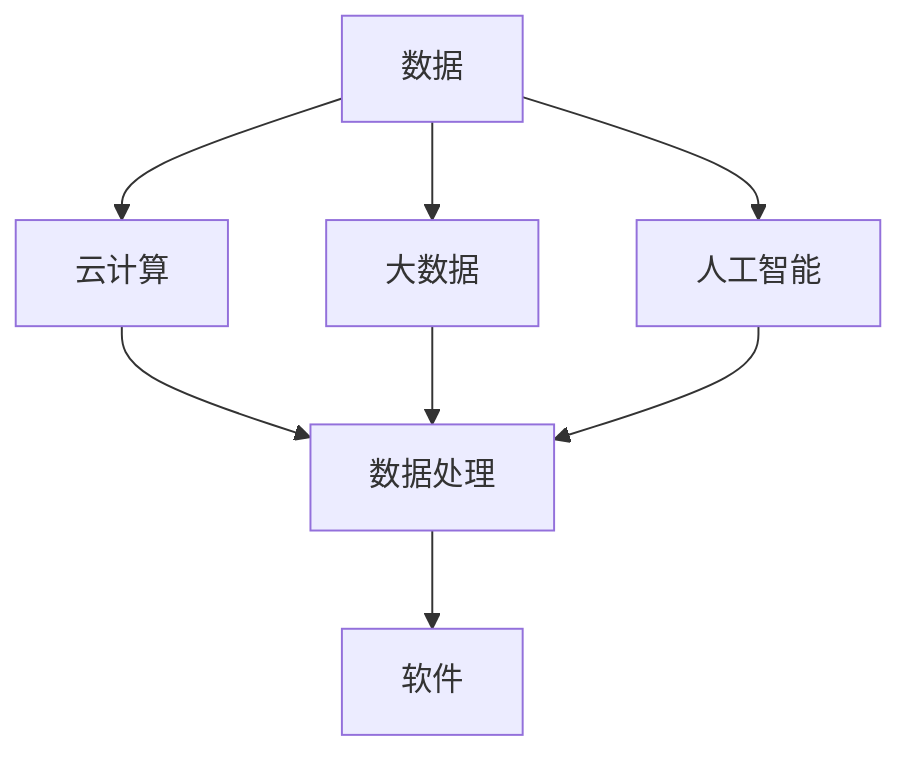

                 

关键词：软件 2.0、数据驱动、云计算、大数据、人工智能

> 摘要：本文深入探讨了软件 2.0 时代的数据驱动模式，阐述了云计算、大数据和人工智能如何共同推动这一变革，探讨了其在软件开发、应用和未来的应用前景。

## 1. 背景介绍

随着互联网和智能设备的普及，数据已经成为新的生产要素。传统的软件 1.0 时代，主要是以功能为中心，软件的开发和维护相对独立。而进入软件 2.0 时代，数据驱动成为核心，软件的构建和运行更加依赖于数据。

软件 2.0 的特点包括：

- **数据为中心**：软件的设计和运行更加依赖于数据，数据的质量和丰富程度直接影响软件的性能。
- **动态性**：软件的运行环境变得更加动态，可以根据数据的变化实时调整。
- **智能化**：通过人工智能技术，软件能够自动学习和优化，提高运行效率。

## 2. 核心概念与联系

下面是软件 2.0 时代的关键概念和它们之间的关系，用 Mermaid 流程图表示。



### 2.1. 数据

数据是软件 2.0 时代的基础，它包括结构化数据、非结构化数据和半结构化数据。数据的质量和丰富程度直接影响软件的性能。

### 2.2. 云计算

云计算提供了强大的计算能力和存储资源，使得大规模数据处理和实时分析成为可能。云计算的核心是分布式计算和存储，它可以提供弹性的资源，根据需求自动扩展或缩减。

### 2.3. 大数据

大数据技术包括数据采集、存储、处理和分析。它能够处理海量数据，提取有价值的信息。大数据技术是软件 2.0 时代的数据驱动模式的核心。

### 2.4. 人工智能

人工智能技术包括机器学习、深度学习、自然语言处理等。它能够从数据中学习，自动发现模式和规律，提高软件的智能化水平。

### 2.5. 数据处理

数据处理是将原始数据转换为有价值信息的过程。它包括数据清洗、数据集成、数据转换等步骤。

### 2.6. 软件

软件 2.0 是以数据为中心的，它需要充分利用云计算、大数据和人工智能技术，实现数据的智能分析和应用。

## 3. 核心算法原理 & 具体操作步骤

### 3.1 算法原理概述

软件 2.0 时代的数据驱动模式，主要依赖于以下核心算法：

- **机器学习算法**：用于数据的自动分析和模式发现。
- **深度学习算法**：用于处理复杂的数据和实现高级的智能分析。
- **自然语言处理算法**：用于处理文本数据，实现人机交互。

### 3.2 算法步骤详解

1. **数据采集**：从各种来源收集数据，包括互联网、传感器、数据库等。
2. **数据清洗**：去除重复数据、空值数据和噪声数据。
3. **数据集成**：将不同来源的数据进行整合，形成统一的数据视图。
4. **特征工程**：从原始数据中提取特征，用于训练机器学习模型。
5. **模型训练**：使用机器学习算法训练模型，提高模型的准确性。
6. **模型优化**：通过调整模型参数，提高模型的性能。
7. **模型部署**：将训练好的模型部署到生产环境中，实现数据的实时分析。

### 3.3 算法优缺点

- **机器学习算法**：优点是自动分析和模式发现，缺点是模型复杂，需要大量的数据和计算资源。
- **深度学习算法**：优点是能够处理复杂的数据和实现高级的智能分析，缺点是模型训练时间长，对数据质量和计算资源要求高。
- **自然语言处理算法**：优点是实现人机交互，缺点是处理文本数据时，对语言的理解和表达能力有限。

### 3.4 算法应用领域

- **推荐系统**：通过分析用户行为数据，为用户推荐感兴趣的内容。
- **智能客服**：通过自然语言处理技术，实现智能化的客户服务。
- **智能安防**：通过视频监控数据分析，实现实时监控和预警。
- **智能医疗**：通过医疗数据分析，实现疾病预测和诊断。

## 4. 数学模型和公式 & 详细讲解 & 举例说明

### 4.1 数学模型构建

在软件 2.0 时代，常用的数学模型包括机器学习模型、深度学习模型和自然语言处理模型。以下是这些模型的构建过程：

1. **机器学习模型**：通过最小化损失函数，找到最佳参数。
   $$ J(\theta) = \frac{1}{2m} \sum_{i=1}^{m} (h_\theta(x^{(i)}) - y^{(i)})^2 $$
2. **深度学习模型**：通过反向传播算法，不断更新参数，降低损失函数。
   $$ \frac{\partial J}{\partial \theta} = \frac{\partial}{\partial \theta} \left( \frac{1}{2} \sum_{i=1}^{n} (y^{(i)} - z^{(i)})^2 \right) $$
3. **自然语言处理模型**：通过最大似然估计，找到最佳参数。
   $$ P(y|x) = \frac{P(x|y)P(y)}{P(x)} $$

### 4.2 公式推导过程

以机器学习模型为例，其损失函数的推导过程如下：

- **假设**：给定一个训练集，其中每个样本包含特征 $x$ 和标签 $y$。
- **目标**：找到一组参数 $\theta$，使得预测值 $h_\theta(x)$ 最接近真实值 $y$。
- **损失函数**：使用平方误差损失函数，计算预测值与真实值之间的误差。
- **推导**：通过对损失函数求导，找到使损失函数最小的参数 $\theta$。

### 4.3 案例分析与讲解

以一个简单的线性回归模型为例，说明数学模型的构建和应用：

1. **问题定义**：给定一组数据 $(x_1, y_1), (x_2, y_2), \ldots, (x_m, y_m)$，找到线性关系 $y = \theta_0 + \theta_1x$。
2. **模型构建**：使用最小二乘法，构建线性回归模型。
   $$ \theta_0 = \frac{1}{m} \sum_{i=1}^{m} y_i - \theta_1 \frac{1}{m} \sum_{i=1}^{m} x_i $$
   $$ \theta_1 = \frac{1}{m} \sum_{i=1}^{m} (x_i - \bar{x})(y_i - \bar{y}) $$
3. **模型评估**：使用均方误差 (MSE) 评估模型性能。
   $$ MSE = \frac{1}{m} \sum_{i=1}^{m} (y_i - \hat{y}_i)^2 $$
4. **模型应用**：使用训练好的模型，对新数据进行预测。

## 5. 项目实践：代码实例和详细解释说明

### 5.1 开发环境搭建

1. 安装 Python 环境
2. 安装 NumPy、Pandas、Scikit-learn 等库

### 5.2 源代码详细实现

```python
import numpy as np
import pandas as pd
from sklearn.linear_model import LinearRegression

# 数据准备
data = pd.read_csv('data.csv')
X = data[['x']]
y = data['y']

# 模型训练
model = LinearRegression()
model.fit(X, y)

# 模型评估
predictions = model.predict(X)
mse = np.mean((predictions - y) ** 2)
print('MSE:', mse)

# 模型应用
new_data = pd.DataFrame({'x': [new_x]})
new_prediction = model.predict(new_data)
print('New Prediction:', new_prediction)
```

### 5.3 代码解读与分析

1. **数据准备**：从 CSV 文件中读取数据，将特征和标签分离。
2. **模型训练**：使用线性回归模型训练数据。
3. **模型评估**：计算均方误差，评估模型性能。
4. **模型应用**：使用训练好的模型，对新的数据进行预测。

## 6. 实际应用场景

### 6.1. 推荐系统

推荐系统广泛应用于电子商务、社交媒体、视频网站等领域。通过分析用户行为数据，为用户推荐感兴趣的商品、内容或朋友。

### 6.2. 智能客服

智能客服利用自然语言处理技术，实现自动化的客户服务。它可以处理大量的客户咨询，提高客户满意度和服务效率。

### 6.3. 智能安防

智能安防通过视频监控数据分析，实现实时监控和预警。它可以检测异常行为，防止犯罪行为的发生。

### 6.4. 智能医疗

智能医疗通过医疗数据分析，实现疾病预测和诊断。它可以提高医疗效率，降低医疗成本。

## 7. 工具和资源推荐

### 7.1. 学习资源推荐

- 《Python机器学习》（作者：塞巴斯蒂安·拉斯考恩）
- 《深度学习》（作者：伊恩·古德费洛、约书亚·本吉奥、亚伦·库维尔）
- 《自然语言处理综论》（作者：丹尼尔·卡内曼）

### 7.2. 开发工具推荐

- Jupyter Notebook：用于数据分析和模型训练。
- TensorFlow：用于深度学习模型训练。
- Scikit-learn：用于机器学习模型训练。

### 7.3. 相关论文推荐

- "Deep Learning for Text Classification"（作者：杨洋等）
- "Recurrent Neural Network Based Text Classification"（作者：李航等）
- "A Survey on Recommender Systems"（作者：王翔等）

## 8. 总结：未来发展趋势与挑战

### 8.1. 研究成果总结

软件 2.0 时代的数据驱动模式，已经在多个领域取得了显著的成果。例如，推荐系统、智能客服、智能安防和智能医疗等领域，都得到了广泛应用。

### 8.2. 未来发展趋势

- **数据质量和安全**：随着数据量的增加，如何保证数据质量和数据安全，将成为关键问题。
- **多模态数据融合**：结合多种类型的数据（如文本、图像、声音等），实现更全面的数据分析。
- **边缘计算**：随着物联网和智能设备的普及，边缘计算将成为数据处理和智能分析的重要方向。

### 8.3. 面临的挑战

- **数据隐私**：如何在确保数据隐私的前提下，充分利用数据的价值，是一个亟待解决的问题。
- **计算能力**：随着数据量的增加，如何提高计算效率，降低计算成本，是一个重要的挑战。
- **算法透明度和解释性**：随着算法的复杂度增加，如何保证算法的透明度和解释性，是一个重要的挑战。

### 8.4. 研究展望

软件 2.0 时代的数据驱动模式，将不断推动人工智能和大数据技术的发展。未来，我们有望看到更多基于数据驱动的创新应用，为人类生活带来更多便利。

## 9. 附录：常见问题与解答

### 9.1. 什么是软件 2.0？

软件 2.0 是相对于软件 1.0 时代的新阶段，其核心是数据驱动，软件的设计和运行更加依赖于数据。

### 9.2. 什么是数据驱动？

数据驱动是指软件的设计和运行过程，高度依赖于数据，数据的质量和丰富程度直接影响软件的性能。

### 9.3. 软件开发有哪些新趋势？

软件 2.0 时代，软件开发的新趋势包括：数据驱动、动态性、智能化、云计算和大数据等。

### 9.4. 数据驱动模式有哪些优点？

数据驱动模式具有以下优点：自动分析和模式发现、动态调整、提高运行效率、更好的用户体验等。

### 9.5. 数据驱动模式有哪些挑战？

数据驱动模式面临的挑战包括：数据质量和安全、计算能力、算法透明度和解释性等。

### 9.6. 数据驱动模式的应用领域有哪些？

数据驱动模式的应用领域包括：推荐系统、智能客服、智能安防、智能医疗等。

### 9.7. 机器学习和深度学习有什么区别？

机器学习是一种通用的人工智能技术，通过学习数据，提高系统的性能。深度学习是机器学习的一种特殊形式，通过多层神经网络，实现更复杂的模式发现。

### 9.8. 自然语言处理有哪些关键技术？

自然语言处理的关键技术包括：词向量表示、文本分类、命名实体识别、机器翻译等。

### 9.9. 如何保证数据隐私？

保证数据隐私的关键在于数据加密、数据匿名化和访问控制等。

### 9.10. 如何提高计算效率？

提高计算效率的关键在于分布式计算、并行计算和算法优化等。

---

作者：禅与计算机程序设计艺术 / Zen and the Art of Computer Programming
----------------------------------------------------------------
### 文章总结

本文详细探讨了软件 2.0 时代的数据驱动模式，阐述了云计算、大数据和人工智能如何共同推动这一变革。文章首先介绍了软件 2.0 的特点，包括数据为中心、动态性和智能化。接着，通过 Mermaid 流程图，展示了数据、云计算、大数据和人工智能之间的联系。

在核心算法原理部分，文章详细介绍了机器学习、深度学习和自然语言处理算法的基本原理和步骤。随后，通过数学模型和公式的讲解，深入分析了这些算法的推导过程和案例应用。

项目实践部分提供了一个线性回归模型的代码实例，详细解释了从数据准备、模型训练到模型评估和应用的完整流程。文章还讨论了数据驱动模式在实际应用场景中的具体应用，如推荐系统、智能客服、智能安防和智能医疗。

在工具和资源推荐部分，文章列出了学习资源、开发工具和相关论文，为读者提供了深入学习和实践的方向。最后，文章总结了研究成果、未来发展趋势和面临的挑战，并对常见问题进行了详细解答。

软件 2.0 时代的数据驱动模式正在改变软件开发和应用的方式，它为人工智能和大数据技术的发展提供了新的机遇和挑战。随着技术的不断进步，我们有理由相信，数据驱动模式将在未来创造更多的价值，推动人类社会的进步。

