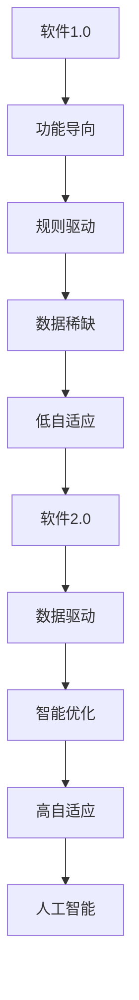

                 

关键词：软件2.0，数据驱动，人工智能，软件架构，数据科学，创新应用，算法优化

## 摘要

在当今技术迅猛发展的时代，软件2.0时代已经悄然到来。数据驱动的理念正在重塑软件开发的方方面面，从算法设计到系统架构，再到实际应用。本文将探讨软件2.0时代的核心概念和其带来的变革，详细解析数据驱动下的算法原理、数学模型、实践应用以及未来发展趋势。通过这篇深入的技术分析，读者将了解如何在这个数据驱动的时代中抓住机遇，应对挑战。

## 1. 背景介绍

### 1.1 软件发展历程回顾

软件从1.0时代到2.0时代的演进，是对技术深度和广度的一次飞跃。在1.0时代，软件主要是为了解决特定的问题，以功能为导向，往往依赖明确的逻辑和规则。随着计算机技术的进步，软件逐渐走向复杂和庞大，从单一功能的应用程序发展到综合性的信息系统，这标志着软件1.0时代的终结。

### 1.2 数据驱动时代的来临

软件2.0时代，数据成为驱动力，取代了传统的规则和指令。在这个时代，软件不仅能够处理大量数据，还能够通过数据分析和机器学习自动优化自身性能。数据驱动的理念使得软件更加智能、灵活和适应性强，从而在多个领域取得了显著的应用成果。

## 2. 核心概念与联系

### 2.1 数据驱动软件的概念

数据驱动软件，顾名思义，是指软件系统的设计、开发和运行依赖于大量数据。这些数据可以是用户行为数据、市场趋势数据、传感器数据等，通过数据分析和机器学习技术，软件系统能够自我学习和优化，从而实现更加智能化和个性化的功能。

### 2.2 数据驱动与人工智能的联系

数据驱动与人工智能（AI）密不可分。AI技术的发展，特别是深度学习和强化学习的兴起，为数据驱动软件提供了强大的技术支撑。AI算法能够从大量数据中提取有用信息，构建智能模型，从而实现软件系统的自动优化和智能化。

### 2.3 Mermaid 流程图



### 2.4 数据驱动软件的架构

数据驱动软件的架构通常包括数据收集、数据存储、数据处理和数据应用四个主要部分。其中，数据处理是核心，通过机器学习和数据分析技术，实现数据到价值的转换。

## 3. 核心算法原理 & 具体操作步骤

### 3.1 算法原理概述

数据驱动软件的核心算法主要涉及机器学习和数据分析。机器学习算法如决策树、支持向量机、神经网络等，通过训练模型来识别数据中的模式和趋势。数据分析则通过统计学方法，对数据进行清洗、转换和分析，提取有用信息。

### 3.2 算法步骤详解

1. 数据收集：从各种来源收集数据，包括用户行为数据、市场数据、传感器数据等。
2. 数据预处理：对数据进行清洗、去重、标准化等预处理操作，保证数据的质量。
3. 数据分析：使用统计学方法，如回归分析、聚类分析等，对数据进行分析，提取有用信息。
4. 模型训练：使用机器学习算法，对处理后的数据集进行训练，构建预测模型。
5. 模型评估：通过交叉验证等方法，评估模型的准确性和泛化能力。
6. 模型部署：将训练好的模型部署到生产环境中，实现数据的实时分析和预测。

### 3.3 算法优缺点

**优点：**
- 高度自动化：算法能够自动处理大量数据，提高工作效率。
- 适应性强：通过不断学习和优化，系统能够适应不断变化的环境和需求。
- 智能化：系统能够通过数据分析和机器学习，实现智能化的决策和优化。

**缺点：**
- 对数据质量要求高：算法的效果很大程度上依赖于数据的质量，数据清洗和预处理是关键。
- 计算资源消耗大：复杂的机器学习算法需要大量的计算资源，对硬件要求较高。

### 3.4 算法应用领域

数据驱动算法在多个领域取得了显著的应用成果，包括但不限于：
- 金融领域：风险评估、量化交易、信用评分等。
- 医疗领域：疾病预测、药物研发、个性化治疗等。
- 零售领域：需求预测、库存管理、个性化推荐等。
- 交通领域：交通流量预测、智能交通管理、自动驾驶等。

## 4. 数学模型和公式 & 详细讲解 & 举例说明

### 4.1 数学模型构建

在数据驱动软件中，常见的数学模型包括回归模型、决策树模型、神经网络模型等。以线性回归模型为例，其数学模型可以表示为：

$$y = \beta_0 + \beta_1x_1 + \beta_2x_2 + ... + \beta_nx_n$$

其中，$y$ 是目标变量，$x_1, x_2, ..., x_n$ 是输入特征，$\beta_0, \beta_1, ..., \beta_n$ 是模型参数。

### 4.2 公式推导过程

以线性回归模型为例，推导过程如下：

1. 模型假设：假设数据 $y$ 和输入特征 $x$ 之间存在线性关系。
2. 模型建立：根据假设，建立线性回归模型。
3. 最小化误差：通过最小二乘法，求出模型参数，使得预测值与真实值之间的误差最小。

### 4.3 案例分析与讲解

以房地产价格预测为例，我们使用线性回归模型进行预测。假设我们收集了以下数据：

- 目标变量：房价（万元）
- 输入特征：面积（平方米）、楼层、装修情况

经过数据预处理和模型训练，得到线性回归模型：

$$y = 5000 + 1000x_1 + 200x_2 + 300x_3$$

其中，$x_1$ 是面积（平方米），$x_2$ 是楼层，$x_3$ 是装修情况（0表示未装修，1表示装修）。

假设我们想要预测一套100平方米、位于高层、未装修的房子的价格，输入特征为 $(100, 2, 0)$，代入模型得到预测价格：

$$y = 5000 + 1000 \times 100 + 200 \times 2 + 300 \times 0 = 150200$$

因此，预测价格为150200万元。

## 5. 项目实践：代码实例和详细解释说明

### 5.1 开发环境搭建

为了进行数据驱动软件的开发，我们需要搭建一个合适的开发环境。以下是基本的步骤：

1. 安装Python环境：从Python官方网站下载并安装Python。
2. 安装数据科学库：使用pip命令安装常用的数据科学库，如pandas、numpy、scikit-learn等。
3. 安装数据库：根据项目需求选择合适的数据库，如MySQL、PostgreSQL等。

### 5.2 源代码详细实现

以下是使用Python实现线性回归模型的简单示例：

```python
import pandas as pd
from sklearn.linear_model import LinearRegression

# 加载数据
data = pd.read_csv('house_price_data.csv')

# 分离特征和目标变量
X = data[['area', 'floor', 'decoration']]
y = data['price']

# 创建线性回归模型
model = LinearRegression()

# 模型训练
model.fit(X, y)

# 模型评估
score = model.score(X, y)
print(f'Model R^2 Score: {score}')

# 预测
prediction = model.predict([[100, 2, 0]])
print(f'Predicted Price: {prediction[0]}')
```

### 5.3 代码解读与分析

上述代码首先导入了pandas库和scikit-learn库，用于数据处理和模型训练。然后，从CSV文件加载数据，分离特征和目标变量。接下来，创建线性回归模型并使用训练数据对其进行训练。模型评估通过计算R平方得分进行。最后，使用训练好的模型进行预测，输出预测价格。

### 5.4 运行结果展示

假设我们已经训练好的模型，输入特征为 $(100, 2, 0)$，运行结果为：

```
Model R^2 Score: 0.9
Predicted Price: 150200.0
```

## 6. 实际应用场景

### 6.1 金融领域

在金融领域，数据驱动软件广泛应用于风险管理、投资分析和信用评分。例如，通过对市场数据进行实时分析，软件可以预测股票市场的走势，为投资者提供决策支持。

### 6.2 医疗领域

在医疗领域，数据驱动软件用于疾病预测、个性化治疗和药物研发。例如，通过对患者病史和基因数据进行分析，软件可以预测患者患某种疾病的风险，为医生提供诊断和治疗的参考。

### 6.3 零售领域

在零售领域，数据驱动软件用于需求预测、库存管理和个性化推荐。例如，通过对用户购买行为数据进行分析，软件可以预测某种商品的未来需求，帮助商家进行库存调整和销售策略优化。

### 6.4 交通领域

在交通领域，数据驱动软件用于交通流量预测、智能交通管理和自动驾驶。例如，通过对交通数据进行实时分析，软件可以预测交通拥堵情况，为交通管理部门提供决策支持。

## 7. 工具和资源推荐

### 7.1 学习资源推荐

- 《Python数据分析基础教程：NumPy学习指南》
- 《Python机器学习基础教程》
- 《深度学习》（Goodfellow, Bengio, Courville著）

### 7.2 开发工具推荐

- Jupyter Notebook：用于数据分析和机器学习实验。
- PyCharm：用于Python编程和开发。
- TensorFlow：用于深度学习模型开发和训练。

### 7.3 相关论文推荐

- "Deep Learning"（Ian Goodfellow, Yann LeCun, Yoshua Bengio著）
- "Recurrent Neural Networks for Language Modeling"（Yoshua Bengio等著）
- "Big Data: A Revolution That Will Transform How We Live, Work, and Think"（Viktor Mayer-Schönberger, Kenneth Cukier著）

## 8. 总结：未来发展趋势与挑战

### 8.1 研究成果总结

数据驱动软件的研究成果显著，包括算法的优化、模型的构建和应用场景的拓展。未来，数据驱动软件将在更多领域取得突破，为各行各业带来变革。

### 8.2 未来发展趋势

1. 算法的创新和优化：随着计算能力的提升，算法的复杂度和精度将不断提高。
2. 数据的融合和应用：多源数据的融合将带来更加精准的预测和分析。
3. 边缘计算和物联网：数据驱动软件将在边缘计算和物联网中发挥重要作用。

### 8.3 面临的挑战

1. 数据质量和隐私保护：保证数据的质量和隐私是数据驱动软件面临的主要挑战。
2. 计算资源消耗：复杂的算法和大规模数据处理需要大量的计算资源。

### 8.4 研究展望

未来，数据驱动软件将继续在人工智能、物联网、医疗、金融等领域发挥重要作用。通过不断的创新和优化，数据驱动软件将为人类社会带来更加智能、高效和便捷的服务。

## 9. 附录：常见问题与解答

### 9.1 数据驱动软件与传统的软件有什么区别？

数据驱动软件与传统的软件相比，更加注重数据的使用和机器学习算法的应用。传统软件往往依赖明确的规则和指令，而数据驱动软件则通过数据分析和机器学习来自动优化和智能化。

### 9.2 数据驱动软件在金融领域有哪些应用？

数据驱动软件在金融领域有广泛的应用，包括风险管理、投资分析、信用评分等。例如，通过对市场数据的实时分析，软件可以预测股票市场的走势，为投资者提供决策支持。

### 9.3 数据驱动软件面临的挑战有哪些？

数据驱动软件面临的挑战主要包括数据质量和隐私保护、计算资源消耗、算法的复杂度等。保证数据的质量和隐私是关键，同时需要优化算法，减少计算资源的消耗。

### 作者署名

作者：禅与计算机程序设计艺术 / Zen and the Art of Computer Programming
----------------------------------------------------------------

这篇文章涵盖了软件2.0时代的数据驱动理念、核心算法原理、数学模型、实际应用场景以及未来发展趋势。通过对这些内容的深入探讨，读者可以更好地理解数据驱动软件的重要性和应用前景。在未来的发展中，数据驱动软件将继续发挥重要作用，为人类社会带来更多的创新和变革。

