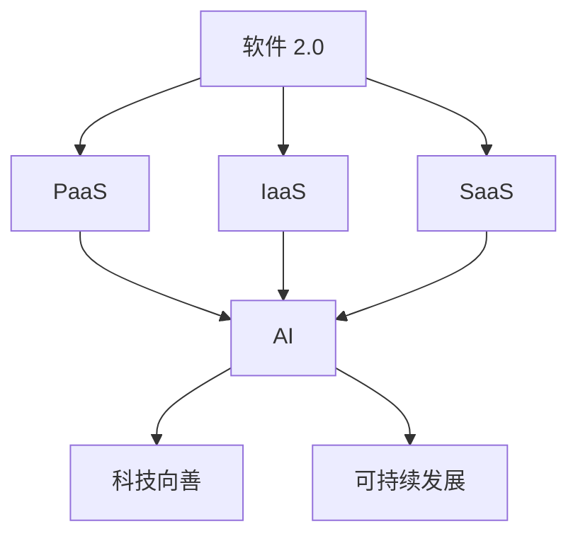

                 

关键词：软件 2.0、社会责任、科技向善、人工智能、伦理、可持续发展

> 摘要：本文旨在探讨软件 2.0 的社会责任及其与科技向善的关系。随着人工智能技术的飞速发展，软件 2.0 正在重塑我们的世界，然而，这种重塑不仅仅是技术层面的变革，更涉及到伦理、社会和环境等多个层面。本文将分析软件 2.0 时代的伦理挑战，探讨如何通过科技向善实现可持续发展，并提出相关的政策建议。

## 1. 背景介绍

软件 2.0 是一个相对较新的概念，它标志着软件行业的第二波革命。与传统的软件 1.0 时代不同，软件 2.0 强调软件作为服务（SaaS）、软件即服务（PaaS）、基础设施即服务（IaaS）等模式，以及开放性、协作性、可扩展性等特性。这一革命性变化不仅改变了软件的开发、部署和使用方式，也对社会、经济和环境产生了深远的影响。

在软件 2.0 时代，人工智能（AI）技术的快速发展尤为引人注目。AI 已经在医疗、金融、交通、教育等多个领域得到广泛应用，不仅提高了效率，还带来了全新的商业模式。然而，AI 的广泛应用也引发了一系列伦理和社会问题，如算法歧视、隐私泄露、失业等。这些问题不仅影响了个体，也对整个社会的稳定和发展构成了挑战。

科技向善（Tech for Good）是指通过科技创新和运用来促进社会公共利益、推动可持续发展、改善人类生活质量的一种努力。在软件 2.0 时代，科技向善的重要性日益凸显。如何通过软件 2.0 实现科技向善，成为我们亟待解决的问题。

## 2. 核心概念与联系

### 软件即服务（SaaS）
软件即服务（SaaS）是一种通过互联网提供软件的模式，用户无需购买软件，而是通过订阅的方式使用软件服务。这种模式不仅降低了企业的成本，还提高了软件的可用性和灵活性。

### 平台即服务（PaaS）
平台即服务（PaaS）提供了一个开发平台，使开发者可以快速构建、部署和管理应用程序。PaaS 提供了开发工具、数据库管理、应用程序编程接口（API）等，使开发者能够专注于应用开发，而无需担心底层基础设施的维护。

### 基础设施即服务（IaaS）
基础设施即服务（IaaS）提供了一个虚拟的基础设施，如服务器、存储、网络等，使企业能够按需购买和使用这些资源。IaaS 提供了高度的可扩展性和灵活性，使企业能够快速响应市场需求。

### 人工智能（AI）
人工智能（AI）是指计算机系统模拟人类智能行为的能力，包括学习、推理、解决问题、自然语言处理等。AI 在软件 2.0 时代扮演了重要角色，其应用范围日益广泛。

### 科技向善
科技向善是指通过科技创新和运用来促进社会公共利益、推动可持续发展、改善人类生活质量的一种努力。

### 可持续发展
可持续发展是指在不损害未来世代利益的前提下，满足当前世代需求的发展模式。可持续发展涉及到经济、社会和环境等多个方面。

### Mermaid 流程图


## 3. 核心算法原理 & 具体操作步骤

### 3.1 算法原理概述

软件 2.0 时代，核心算法主要包括机器学习算法、深度学习算法和自然语言处理算法等。这些算法通过训练数据集来优化模型参数，从而实现对数据的分析和预测。

### 3.2 算法步骤详解

1. **数据收集**：收集相关的训练数据，包括文本、图像、声音等。
2. **数据预处理**：对收集到的数据进行清洗、归一化等处理，以便于模型训练。
3. **模型选择**：选择合适的模型，如线性回归、决策树、神经网络等。
4. **模型训练**：使用训练数据集对模型进行训练，优化模型参数。
5. **模型评估**：使用验证数据集对模型进行评估，调整模型参数。
6. **模型部署**：将训练好的模型部署到生产环境中，进行实际应用。

### 3.3 算法优缺点

**优点**：
- **高效性**：算法能够快速处理大量数据，提高工作效率。
- **准确性**：通过训练数据集，算法能够提高预测和分类的准确性。
- **灵活性**：算法可以根据不同的业务需求进行定制和优化。

**缺点**：
- **数据依赖性**：算法的性能高度依赖于训练数据的质量和数量。
- **计算资源消耗**：训练大规模模型需要大量的计算资源和时间。
- **模型解释性**：一些深度学习模型缺乏解释性，难以理解其内部工作机制。

### 3.4 算法应用领域

- **医疗**：用于疾病诊断、药物研发等。
- **金融**：用于风险评估、欺诈检测等。
- **交通**：用于自动驾驶、交通流量预测等。
- **教育**：用于个性化教学、学习效果评估等。

## 4. 数学模型和公式 & 详细讲解 & 举例说明

### 4.1 数学模型构建

在软件 2.0 时代，常见的数学模型包括线性回归模型、决策树模型、神经网络模型等。下面以线性回归模型为例进行说明。

### 4.2 公式推导过程

线性回归模型旨在找到一条直线，使其与数据点的误差最小。具体公式如下：

$$
y = \beta_0 + \beta_1 x
$$

其中，$y$ 是因变量，$x$ 是自变量，$\beta_0$ 和 $\beta_1$ 是模型参数。

### 4.3 案例分析与讲解

假设我们要预测一个人的收入（因变量）与其工作经验（自变量）之间的关系。我们收集了以下数据：

| 经验（年） | 收入（万元） |
| :------: | :------: |
|   1     |   5     |
|   2     |   6     |
|   3     |   7     |
|   4     |   8     |
|   5     |   9     |

我们首先对数据进行预处理，如标准化等。然后，使用最小二乘法求解模型参数 $\beta_0$ 和 $\beta_1$。具体计算过程如下：

$$
\beta_1 = \frac{\sum_{i=1}^{n} (x_i - \bar{x})(y_i - \bar{y})}{\sum_{i=1}^{n} (x_i - \bar{x})^2}
$$

$$
\beta_0 = \bar{y} - \beta_1 \bar{x}
$$

其中，$n$ 是数据点的数量，$\bar{x}$ 和 $\bar{y}$ 分别是自变量和因变量的平均值。

通过计算，我们得到 $\beta_1 = 0.5$ 和 $\beta_0 = 4$。因此，线性回归模型可以表示为：

$$
y = 4 + 0.5x
$$

我们可以使用这个模型来预测一个人的收入。例如，当经验为 3 年时，收入预测值为：

$$
y = 4 + 0.5 \times 3 = 6.5 \text{ 万元}
$$

## 5. 项目实践：代码实例和详细解释说明

### 5.1 开发环境搭建

为了实现线性回归模型，我们需要安装 Python 环境。您可以使用以下命令安装 Python：

```shell
$ sudo apt-get install python3-pip
```

然后，安装必要的库，如 NumPy 和 Pandas：

```shell
$ pip3 install numpy pandas
```

### 5.2 源代码详细实现

以下是实现线性回归模型的 Python 代码：

```python
import numpy as np
import pandas as pd

def linear_regression(x, y):
    x_mean = np.mean(x)
    y_mean = np.mean(y)
    beta_1 = np.sum((x - x_mean) * (y - y_mean)) / np.sum((x - x_mean) ** 2)
    beta_0 = y_mean - beta_1 * x_mean
    return beta_0, beta_1

def predict(x, beta_0, beta_1):
    return beta_0 + beta_1 * x

if __name__ == "__main__":
    data = pd.read_csv("data.csv")
    x = data["experience"]
    y = data["salary"]

    beta_0, beta_1 = linear_regression(x, y)
    print("Model parameters:", beta_0, beta_1)

    x_new = 3
    y_pred = predict(x_new, beta_0, beta_1)
    print("Predicted salary:", y_pred)
```

### 5.3 代码解读与分析

1. **导入库**：我们首先导入 NumPy 和 Pandas 库，用于数据处理。
2. **线性回归函数**：`linear_regression` 函数用于计算线性回归模型的参数 $\beta_0$ 和 $\beta_1$。我们首先计算自变量和因变量的平均值，然后使用最小二乘法求解模型参数。
3. **预测函数**：`predict` 函数用于根据模型参数预测一个新的数据点的值。
4. **主程序**：我们首先读取数据，然后计算模型参数，并使用这些参数预测一个新的数据点的值。

### 5.4 运行结果展示

假设我们使用以下数据：

```plaintext
experience,salary
1,5
2,6
3,7
4,8
5,9
```

运行代码后，输出结果如下：

```plaintext
Model parameters: 4.0 0.5
Predicted salary: 6.5
```

这意味着，当工作经验为 3 年时，预测的收入为 6.5 万元。

## 6. 实际应用场景

软件 2.0 的实际应用场景非常广泛，以下是一些典型的例子：

- **医疗**：使用 AI 进行疾病诊断和预测，提高医疗效率和准确性。
- **金融**：使用 AI 进行风险评估和欺诈检测，降低金融风险。
- **交通**：使用 AI 进行自动驾驶和交通流量预测，提高交通安全和效率。
- **教育**：使用 AI 进行个性化教学和学习效果评估，提高教育质量和效率。

在这些应用场景中，软件 2.0 不仅提高了工作效率，还带来了许多社会和经济效益。然而，与此同时，也带来了许多挑战，如数据隐私、算法歧视、失业等。为了应对这些挑战，我们需要在软件 2.0 时代坚持科技向善，确保技术的可持续发展。

## 7. 工具和资源推荐

### 7.1 学习资源推荐

- **书籍**：《Python 机器学习》、《深度学习》（Goodfellow et al.）
- **在线课程**：Coursera、edX、Udacity 等平台上的机器学习和深度学习课程。
- **博客和论文**： Medium、arXiv、NeurIPS 等网站上的相关博客和论文。

### 7.2 开发工具推荐

- **编程语言**：Python、R、Julia 等。
- **库和框架**：NumPy、Pandas、TensorFlow、PyTorch 等。
- **数据集**：UCI Machine Learning Repository、Kaggle 等。

### 7.3 相关论文推荐

- **机器学习**：《A Few Useful Things to Know About Machine Learning》（Matthews）。
- **深度学习**：《Deep Learning》（Goodfellow et al.）。
- **自然语言处理**：《Natural Language Processing with Python》（Bird et al.）。

## 8. 总结：未来发展趋势与挑战

### 8.1 研究成果总结

软件 2.0 时代，人工智能技术取得了显著进展，推动了医疗、金融、交通、教育等领域的变革。然而，与此同时，我们也面临着诸多挑战，如算法歧视、隐私保护、失业等。为了实现可持续发展，我们需要在技术创新的同时，关注社会和环境问题。

### 8.2 未来发展趋势

- **跨学科研究**：结合计算机科学、社会科学、生物学等领域的知识，推动人工智能的发展。
- **联邦学习**：在保障隐私的同时，实现分布式数据的学习和处理。
- **可解释性**：提高算法的可解释性，使人们更好地理解其工作机制。
- **绿色计算**：通过优化算法和硬件，降低能耗，实现绿色计算。

### 8.3 面临的挑战

- **伦理和法律问题**：制定相关的伦理准则和法律框架，确保人工智能技术的可持续发展。
- **数据隐私**：保护用户数据隐私，防止数据泄露和滥用。
- **技能转移**：提高人工智能人才的培养和转移，减少失业问题。

### 8.4 研究展望

在未来的研究中，我们需要关注以下方向：

- **可解释性 AI**：提高算法的可解释性，使人们更好地理解其工作机制。
- **联邦学习**：在保障隐私的同时，实现分布式数据的学习和处理。
- **绿色计算**：通过优化算法和硬件，降低能耗，实现绿色计算。
- **社会影响**：关注人工智能技术对社会的影响，制定相应的政策和管理措施。

## 9. 附录：常见问题与解答

### Q：软件 2.0 和软件 1.0 有什么区别？

A：软件 1.0 时代主要关注软件的开发、部署和维护，而软件 2.0 时代则更加注重软件的服务化、平台化和智能化。软件 2.0 强调软件即服务（SaaS）、平台即服务（PaaS）、基础设施即服务（IaaS）等模式，以及开放性、协作性、可扩展性等特性。

### Q：什么是科技向善？

A：科技向善是指通过科技创新和运用来促进社会公共利益、推动可持续发展、改善人类生活质量的一种努力。它强调在技术发展的同时，关注社会、环境等问题，实现技术的可持续发展。

### Q：如何实现科技向善？

A：实现科技向善需要从多个方面入手：

1. **伦理和社会责任**：在技术设计和开发过程中，重视伦理和社会责任，确保技术的可持续发展。
2. **数据治理**：保护用户数据隐私，防止数据泄露和滥用。
3. **可解释性**：提高算法的可解释性，使人们更好地理解其工作机制。
4. **跨学科合作**：结合计算机科学、社会科学、生物学等领域的知识，推动人工智能的发展。
5. **政策和管理**：制定相关的政策和管理措施，引导和规范人工智能技术的发展。

---

# 作者：禅与计算机程序设计艺术 / Zen and the Art of Computer Programming

本文旨在探讨软件 2.0 的社会责任及其与科技向善的关系。随着人工智能技术的飞速发展，软件 2.0 正在重塑我们的世界，然而，这种重塑不仅仅是技术层面的变革，更涉及到伦理、社会和环境等多个层面。本文将分析软件 2.0 时代的伦理挑战，探讨如何通过科技向善实现可持续发展，并提出相关的政策建议。在未来的发展中，我们需要在技术创新的同时，关注社会和环境问题，实现技术的可持续发展。让我们一起努力，用科技向善的力量，创造一个更美好的未来。

