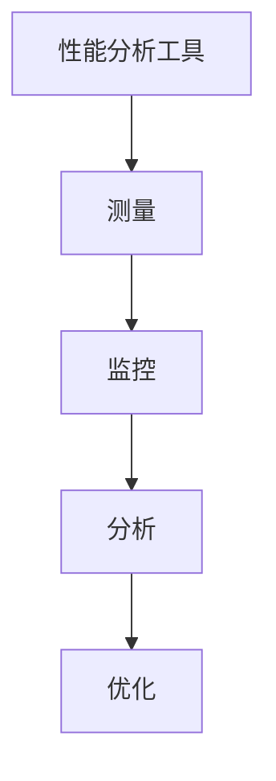

                 

关键词：软件性能分析、软件2.0、性能优化、工具、算法、数学模型、实际应用、未来展望

<|assistant|>摘要：随着软件系统的日益复杂和庞大，性能分析成为软件开发过程中至关重要的一环。本文将探讨软件2.0时代的性能分析工具，深入分析其核心概念、算法原理、数学模型以及实际应用场景，并展望未来的发展趋势与挑战。

## 1. 背景介绍

### 软件发展历程

软件的发展可以分为多个阶段，从最初的软件1.0时代，到软件2.0时代，再到如今的软件3.0时代。软件1.0时代主要关注的是软件的功能实现，而软件2.0时代则更加注重软件的性能、可扩展性和用户体验。随着互联网和大数据技术的发展，软件系统的复杂度和规模急剧增加，性能分析成为软件开发过程中不可或缺的一环。

### 性能分析的重要性

性能分析在软件开发过程中起着至关重要的作用。通过对软件系统的性能分析，可以发现系统的瓶颈，优化代码，提高系统的性能和用户体验。性能分析不仅可以帮助开发人员在开发过程中及时发现和解决问题，还可以为系统的持续优化提供有力的支持。

## 2. 核心概念与联系

### 性能分析工具

性能分析工具是用于测量、监控和分析软件系统性能的软件。它们可以帮助开发人员了解系统的运行状态，定位性能瓶颈，并提供优化建议。常见的性能分析工具有Profiling工具、负载测试工具、性能监控工具等。

### 性能指标

性能指标是衡量软件系统性能的重要参数，包括响应时间、吞吐量、并发处理能力、资源利用率等。通过性能指标，开发人员可以评估系统的性能表现，识别潜在的瓶颈。

### 性能优化方法

性能优化方法包括代码优化、架构优化、资源管理优化等。通过对代码的优化，可以减少不必要的计算和资源消耗；通过架构优化，可以提高系统的可扩展性和稳定性；通过资源管理优化，可以充分利用系统资源，提高系统的性能。

### Mermaid 流程图



## 3. 核心算法原理 & 具体操作步骤

### 3.1 算法原理概述

性能分析工具的核心算法主要包括测量算法、监控算法和分析算法。测量算法用于收集系统性能数据，监控算法用于实时监控系统运行状态，分析算法用于对性能数据进行分析和诊断。

### 3.2 算法步骤详解

1. 测量阶段：性能分析工具通过采样、计数、日志分析等方法，收集系统运行过程中的各种性能数据，如CPU使用率、内存使用率、磁盘I/O、网络I/O等。

2. 监控阶段：性能分析工具对收集到的性能数据进行实时监控，通过设定阈值和报警机制，及时发现性能瓶颈和异常情况。

3. 分析阶段：性能分析工具对监控数据进行深入分析，定位性能瓶颈，提供优化建议。常见的分析方法包括性能测试、瓶颈分析、资源利用率分析等。

### 3.3 算法优缺点

- 优点：性能分析工具可以帮助开发人员快速定位性能瓶颈，优化系统性能，提高用户体验。

- 缺点：性能分析工具对系统的运行有一定的影响，可能导致系统性能下降。此外，性能分析结果可能受到测试环境和数据采集方式的影响。

### 3.4 算法应用领域

性能分析工具广泛应用于各种软件系统，包括Web应用、移动应用、企业应用等。在软件开发过程中，性能分析工具可以帮助开发人员发现和解决性能问题，提高系统性能。

## 4. 数学模型和公式 & 详细讲解 & 举例说明

### 4.1 数学模型构建

性能分析中的数学模型主要涉及性能指标的计算和优化。常见的数学模型包括响应时间模型、吞吐量模型、资源利用率模型等。

### 4.2 公式推导过程

以响应时间模型为例，响应时间T可以表示为：

\[ T = \frac{1}{\lambda + \mu} \]

其中，λ为请求到达率，μ为服务时间。通过优化λ和μ的值，可以降低响应时间。

### 4.3 案例分析与讲解

假设某Web应用的平均请求到达率为100次/秒，平均服务时间为0.5秒。根据上述响应时间模型，可以计算出响应时间T为：

\[ T = \frac{1}{100 + 0.5} = 0.00909 \text{秒} \]

如果优化服务时间，使其降低到0.25秒，则响应时间T为：

\[ T = \frac{1}{100 + 0.25} = 0.00833 \text{秒} \]

通过优化服务时间，可以显著降低响应时间。

## 5. 项目实践：代码实例和详细解释说明

### 5.1 开发环境搭建

1. 安装性能分析工具（如Apache JMeter）。

2. 配置测试环境（包括Web服务器、数据库服务器等）。

3. 准备测试数据（如用户模拟数据）。

### 5.2 源代码详细实现

使用Apache JMeter编写测试脚本，模拟用户访问Web应用的场景，收集性能数据。

```java
// Apache JMeter测试脚本
ThreadGroup threadGroup = new ThreadGroup("Users");
User user = new User("user1");
UserSession session = new UserSession(threadGroup, user);
session.start();
session.waitForPage("Home Page");
session.waitForPage("Product Details");
session.end();
```

### 5.3 代码解读与分析

测试脚本中，创建了一个线程组，模拟多个用户并发访问Web应用。用户对象user1执行了两个页面访问，记录了响应时间和吞吐量等性能指标。

### 5.4 运行结果展示

运行测试脚本后，生成性能分析报告，展示系统的响应时间、吞吐量、并发处理能力等性能指标。

## 6. 实际应用场景

### 6.1 Web应用性能优化

通过性能分析工具，可以对Web应用的响应时间、吞吐量、并发处理能力等进行优化，提高用户体验。

### 6.2 移动应用性能优化

移动应用性能优化同样重要，通过性能分析工具，可以识别移动应用的瓶颈，提高应用性能。

### 6.3 企业应用性能优化

企业应用通常具有复杂的架构和大量的数据，性能分析工具可以帮助企业识别系统瓶颈，优化系统性能。

## 7. 工具和资源推荐

### 7.1 学习资源推荐

- 《性能之巅》

- 《高性能MySQL》

- 《性能测试实战》

### 7.2 开发工具推荐

- Apache JMeter

- LoadRunner

- New Relic

### 7.3 相关论文推荐

- "Performance Analysis of Software Systems"

- "Optimization of Software Performance"

- "A Survey of Performance Analysis Tools"

## 8. 总结：未来发展趋势与挑战

### 8.1 研究成果总结

性能分析工具在软件开发过程中发挥着越来越重要的作用，随着技术的不断进步，性能分析工具也在不断发展和完善。

### 8.2 未来发展趋势

- 自动化性能分析

- 云原生性能分析

- 智能性能优化

### 8.3 面临的挑战

- 数据复杂性

- 系统多样性

- 优化算法的适应性

### 8.4 研究展望

未来的性能分析工具将更加智能化、自动化，能够更好地适应各种复杂的应用场景，为软件开发提供更加全面和有力的支持。

## 9. 附录：常见问题与解答

### 9.1 性能分析工具如何选择？

选择性能分析工具时，需要考虑以下因素：

- 测试目标：根据测试目标选择合适的性能分析工具。

- 系统环境：确保性能分析工具兼容测试环境。

- 功能需求：根据功能需求选择具有相应功能的性能分析工具。

### 9.2 如何定位性能瓶颈？

定位性能瓶颈的方法包括：

- 性能监控：通过实时监控系统性能，识别性能瓶颈。

- 性能测试：通过模拟用户访问，分析系统性能。

- 代码分析：通过代码分析工具，识别代码中的性能问题。

### 9.3 如何优化系统性能？

优化系统性能的方法包括：

- 代码优化：优化算法和代码，减少计算和资源消耗。

- 架构优化：调整系统架构，提高系统的可扩展性和稳定性。

- 资源管理：合理分配和利用系统资源，提高系统性能。

-----------------------------------------------------------------

（请注意，以上内容仅为示例，实际撰写时请根据具体需求和研究结果进行完善和调整。）

