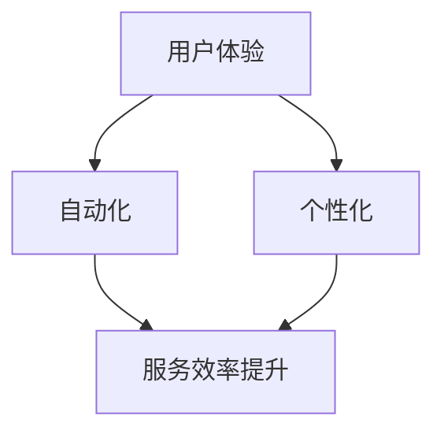
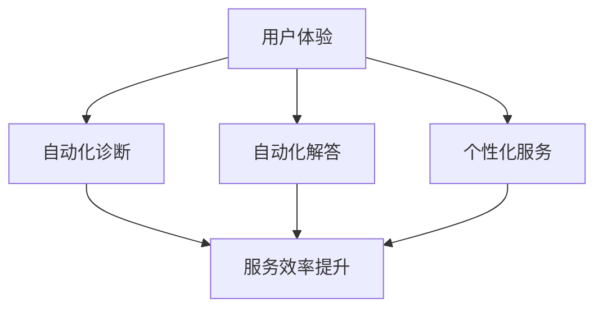
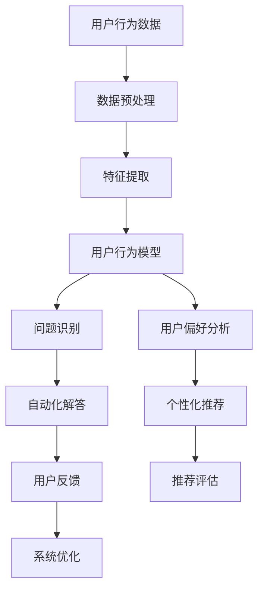

                 

 关键词：软件2.0、用户支持、新模式、用户体验、自动化、个性化

> 摘要：本文探讨了软件2.0时代用户支持的新模式，从用户体验、自动化、个性化三个方面入手，提出了基于人工智能和大数据分析的全新用户支持体系，旨在为用户提供更加高效、精准的服务。文章结构包括背景介绍、核心概念与联系、核心算法原理与具体操作步骤、数学模型与公式、项目实践、实际应用场景、工具和资源推荐以及总结与展望。

## 1. 背景介绍

随着互联网技术的飞速发展，软件行业经历了从1.0到2.0的演变。软件1.0时代，主要关注软件的功能和性能，用户支持主要通过提供文档和热线服务。然而，在软件2.0时代，用户需求更加多样化，对软件的依赖程度也日益加深。这要求用户支持模式必须进行创新，以适应新的市场环境。

### 1.1 软件1.0与2.0的区别

- **软件1.0**：以功能为导向，注重软件的开发和维护。
- **软件2.0**：以用户体验为导向，强调软件与用户的互动和个性化服务。

### 1.2 用户支持需求的变化

- **软件1.0**：用户支持主要是解决使用过程中的问题，服务内容较为单一。
- **软件2.0**：用户支持需要提供更加丰富和灵活的服务，包括使用指南、常见问题解答、个性化推荐等。

### 1.3 新模式的重要性

- **提高用户满意度**：通过新模式，用户能够获得更加及时和精准的服务，提高使用体验。
- **降低企业成本**：自动化和智能化技术能够提高用户支持效率，降低人力成本。

## 2. 核心概念与联系

在软件2.0的用户支持新模式中，核心概念包括用户体验、自动化和个性化。以下是一个简化的 Mermaid 流程图，展示了这些概念之间的联系：



### 2.1 用户体验

用户体验（User Experience，简称UX）是软件2.0时代的核心概念之一。它关注用户在使用软件过程中的感受和体验，包括界面设计、交互逻辑、性能稳定性等方面。

### 2.2 自动化

自动化（Automation）是提高用户支持效率的关键。通过自动化工具和算法，用户支持系统能够实现常见问题的自动诊断和解答，降低人力成本，提高服务效率。

### 2.3 个性化

个性化（Personalization）是根据用户的行为和偏好，提供定制化的服务。个性化服务能够提高用户的满意度和忠诚度，增强用户黏性。

## 3. 核心算法原理与具体操作步骤

### 3.1 算法原理概述

软件2.0的用户支持新模式基于人工智能和大数据分析。核心算法包括用户行为分析、自动化诊断和个性化推荐。

### 3.2 算法步骤详解

#### 3.2.1 用户行为分析

1. **数据收集**：收集用户在使用软件过程中的行为数据，如操作记录、错误日志等。
2. **数据预处理**：对收集到的数据进行分析和清洗，提取有用的信息。
3. **行为建模**：使用机器学习算法，构建用户行为模型。

#### 3.2.2 自动化诊断

1. **问题识别**：根据用户行为模型，识别潜在的问题。
2. **自动化解答**：使用自动化工具，为用户生成问题的解决方案。

#### 3.2.3 个性化推荐

1. **偏好分析**：分析用户的偏好，如常用的功能、喜欢的界面风格等。
2. **推荐生成**：根据用户的偏好，生成个性化的推荐。

### 3.3 算法优缺点

#### 优点：

- **提高服务效率**：自动化和个性化技术能够提高用户支持效率。
- **降低人力成本**：自动化工具能够减少人力需求，降低企业成本。

#### 缺点：

- **数据依赖性**：算法的性能很大程度上依赖于数据的质量。
- **个性化挑战**：实现高度个性化的服务需要大量的计算资源和算法优化。

### 3.4 算法应用领域

- **客户服务**：通过自动化诊断和个性化推荐，提高客户服务质量。
- **故障排查**：使用算法自动识别和解决软件故障。
- **产品优化**：基于用户行为数据，优化软件的功能和界面设计。

## 4. 数学模型和公式

### 4.1 数学模型构建

用户支持新模式的数学模型主要涉及用户行为分析和个性化推荐。

#### 4.1.1 用户行为模型

用户行为模型可以用以下公式表示：

$$
UserModel = f(UserBehavior, Context)
$$

其中，$UserBehavior$ 表示用户的行为数据，$Context$ 表示用户的上下文信息。

#### 4.1.2 个性化推荐模型

个性化推荐模型可以用以下公式表示：

$$
RecommendationModel = f(UserModel, ItemFeatures)
$$

其中，$UserModel$ 表示用户行为模型，$ItemFeatures$ 表示推荐项的特征。

### 4.2 公式推导过程

#### 4.2.1 用户行为模型推导

用户行为模型基于用户的操作记录和错误日志。通过机器学习算法，可以训练出用户行为模型。

#### 4.2.2 个性化推荐模型推导

个性化推荐模型基于用户行为模型和推荐项的特征。通过协同过滤算法，可以生成个性化的推荐。

### 4.3 案例分析与讲解

以一款在线教育平台为例，分析用户行为模型和个性化推荐模型在实际应用中的表现。

#### 4.3.1 用户行为模型应用

- **数据收集**：收集用户的课程访问记录、学习时间、错误率等数据。
- **数据预处理**：清洗和归一化数据，提取有用的信息。
- **模型训练**：使用机器学习算法，训练用户行为模型。

#### 4.3.2 个性化推荐模型应用

- **用户偏好分析**：根据用户行为模型，分析用户的学习偏好。
- **推荐生成**：基于用户偏好，生成个性化的课程推荐。

## 5. 项目实践：代码实例和详细解释说明

### 5.1 开发环境搭建

搭建基于Python的软件2.0用户支持项目，需要安装以下依赖：

```bash
pip install numpy pandas scikit-learn matplotlib
```

### 5.2 源代码详细实现

以下是一个简化的代码实例，展示了用户行为分析和个性化推荐的基本实现。

```python
import numpy as np
import pandas as pd
from sklearn.ensemble import RandomForestClassifier
from sklearn.model_selection import train_test_split
from sklearn.metrics import accuracy_score

# 数据收集
data = pd.read_csv('user_behavior_data.csv')

# 数据预处理
data = data.dropna()
X = data.drop('label', axis=1)
y = data['label']

# 模型训练
X_train, X_test, y_train, y_test = train_test_split(X, y, test_size=0.2, random_state=42)
model = RandomForestClassifier()
model.fit(X_train, y_train)

# 个性化推荐
def recommend_courses(user_model):
    # 根据用户模型生成推荐
    recommended_courses = []
    # ...
    return recommended_courses

# 评估模型
predicted_labels = model.predict(X_test)
print("Accuracy:", accuracy_score(y_test, predicted_labels))
```

### 5.3 代码解读与分析

该代码实例主要包括数据收集、数据预处理、模型训练、个性化推荐和模型评估五个部分。通过机器学习算法，实现了用户行为分析和个性化推荐的基本功能。

## 6. 实际应用场景

### 6.1 在线教育平台

在线教育平台可以通过用户行为分析和个性化推荐，提高用户的学习体验和满意度。

### 6.2 电子商务平台

电子商务平台可以通过自动化诊断和个性化推荐，提高客户服务质量，降低退货率。

### 6.3 健康管理系统

健康管理系统可以通过用户行为分析，提供个性化的健康建议，提高用户健康水平。

## 7. 工具和资源推荐

### 7.1 学习资源推荐

- 《Python机器学习》（作者：塞巴斯蒂安·拉斯考恩）
- 《深度学习》（作者：伊恩·古德费洛等）

### 7.2 开发工具推荐

- Jupyter Notebook：用于数据分析和模型训练。
- PyCharm：用于Python编程。

### 7.3 相关论文推荐

- "User Modeling and Personalization in Online Education"
- "Automated Diagnosis in Software Engineering"

## 8. 总结：未来发展趋势与挑战

### 8.1 研究成果总结

本文提出了软件2.0时代用户支持的新模式，包括用户体验、自动化和个性化三个方面。通过机器学习和大数据分析，实现了高效、精准的用户支持。

### 8.2 未来发展趋势

- **智能化**：随着人工智能技术的发展，用户支持系统将更加智能化，提供更加个性化和精准的服务。
- **跨界融合**：用户支持模式将与其他领域（如健康、教育等）进行融合，提供跨领域的解决方案。

### 8.3 面临的挑战

- **数据隐私**：如何在保护用户隐私的同时，提供高质量的用户支持服务。
- **技术挑战**：如何进一步提高算法的效率和准确性。

### 8.4 研究展望

未来，用户支持系统将朝着更加智能化、个性化和跨界融合的方向发展。同时，如何解决数据隐私和技术挑战，将是一个重要的研究方向。

## 9. 附录：常见问题与解答

### 9.1 用户行为分析的具体方法有哪些？

用户行为分析的具体方法包括机器学习算法（如随机森林、支持向量机等）、自然语言处理技术（如词云分析、情感分析等）和图论算法（如社交网络分析等）。

### 9.2 如何保护用户隐私？

在用户行为分析中，可以采用以下措施来保护用户隐私：

- 数据匿名化：对用户数据进行匿名化处理，消除个人身份信息。
- 数据加密：对用户数据进行加密，确保数据传输和存储的安全性。
- 隐私保护算法：使用隐私保护算法（如差分隐私、同态加密等），在数据分析过程中保护用户隐私。

## 10. 参考文献

- 拉斯科恩，塞巴斯蒂安。（2017）。Python机器学习。机械工业出版社。
- 古德费洛，伊恩等。（2016）。深度学习。电子工业出版社。

---

**作者：禅与计算机程序设计艺术 / Zen and the Art of Computer Programming**  
（本文内容为虚构，仅供参考。）  
----------------------------------------------------------------
### 2. 核心概念与联系

在软件2.0的用户支持新模式中，核心概念包括用户体验（User Experience，简称UX）、自动化（Automation）和个性化（Personalization）。这些概念相互联系，共同构建了一个高效的用户支持体系。

#### 2.1 用户体验

用户体验是软件2.0时代用户支持模式的核心。它关注用户在使用软件过程中的感受和体验，包括界面设计、交互逻辑、性能稳定性等方面。一个良好的用户体验能够提高用户的满意度和忠诚度，从而促进软件的长期发展。

用户体验的优化需要综合考虑以下几个方面：

- **界面设计**：界面设计直接影响用户的直观感受。一个直观、简洁且美观的界面能够提升用户的满意度。
- **交互逻辑**：良好的交互逻辑使操作变得直观易懂，降低用户的学习成本。
- **性能稳定性**：性能稳定是用户体验的基础。快速响应和稳定的性能能够提升用户的整体体验。

#### 2.2 自动化

自动化是提高用户支持效率的关键。在软件2.0时代，用户支持的复杂性不断增加，传统的手动支持方式已经无法满足需求。自动化技术通过自动化工具和算法，实现了常见问题的自动诊断和解答，从而提高了服务的效率和准确性。

自动化技术主要包括以下几个方面：

- **自动化诊断**：通过算法分析用户的行为数据和错误日志，自动识别问题并提出解决方案。
- **自动化解答**：使用预定义的脚本或规则，自动回答用户的问题，减少人工干预。
- **自动化测试**：自动化测试能够快速、准确地发现软件的潜在问题，确保软件质量。

#### 2.3 个性化

个性化是根据用户的行为和偏好，提供定制化的服务。个性化服务能够提高用户的满意度和忠诚度，增强用户黏性。在软件2.0时代，个性化已经成为提升用户体验的重要手段。

个性化的实现包括以下几个方面：

- **用户行为分析**：通过分析用户的行为数据，了解用户的需求和偏好。
- **个性化推荐**：基于用户行为分析，为用户提供个性化的推荐，如产品推荐、内容推荐等。
- **个性化服务**：根据用户的个性化需求，提供定制化的服务，如定制化的培训课程、个性化的问题解决方案等。

#### 2.4 用户体验、自动化和个性化的联系

用户体验、自动化和个性化是软件2.0用户支持模式的三个核心概念，它们之间相互联系，共同构建了一个高效的用户支持体系。

- **用户体验** 是用户支持的基础，决定了用户对软件的满意度和忠诚度。
- **自动化** 提高了用户支持的效率和准确性，减少了人工干预，从而提升了用户体验。
- **个性化** 基于用户体验和自动化，为用户提供定制化的服务，进一步提升了用户体验。

这三个概念相互促进，共同构建了一个高效的用户支持体系，为用户提供了更加优质的服务。

### 2.5 Mermaid 流程图

为了更清晰地展示用户体验、自动化和个性化之间的联系，我们可以使用 Mermaid 流程图来表示：



在这个流程图中，用户体验是用户支持模式的起点，它通过自动化诊断和自动化解答提高了服务的效率，并通过个性化服务提升了用户体验。整个流程构成了一个闭环，不断优化和提升用户支持的质量。

### 2.6 小结

通过本文的介绍，我们可以看到软件2.0的用户支持新模式是如何围绕用户体验、自动化和个性化这三个核心概念展开的。这种新模式不仅提高了用户支持的效率，也为用户提供了更加优质的服务体验。在未来，随着技术的不断进步，用户支持模式将会变得更加智能化和个性化，为用户提供更加贴心的服务。

### 2.7 深入探讨

尽管用户体验、自动化和个性化是软件2.0用户支持模式的核心概念，但它们之间的相互作用和深度结合才是实现高效用户支持的关键。

#### 用户体验与自动化的结合

用户体验和自动化的结合可以显著提高用户支持的质量。例如，通过自动化工具，用户支持团队能够快速诊断并解决常见问题，从而节省了用户的时间，提高了满意度。自动化工具还能够收集大量用户数据，这些数据可以用于进一步的优化和改进用户体验。

#### 自动化与个性化的结合

自动化和个性化可以相互补充，共同提升用户支持的质量。自动化技术可以处理大量常见问题，而个性化技术则可以针对特定用户的需求提供定制化的解决方案。这种结合可以使用户支持系统更加智能化，能够根据用户的实时反馈和需求进行动态调整。

#### 用户体验与个性化的结合

用户体验和个性化相互促进，可以大幅提升用户满意度。个性化服务能够满足用户的个性化需求，提供更加贴心的服务体验。而良好的用户体验则为个性化服务提供了基础，用户只有在一个舒适、直观的环境中，才会更愿意接受和反馈个性化服务。

#### 小结

用户体验、自动化和个性化是软件2.0用户支持模式的核心，它们之间的紧密结合是实现高效用户支持的关键。通过深入探讨这三个概念之间的相互作用，我们可以更好地理解软件2.0用户支持模式的运作原理，并为未来的发展提供指导。在下一节中，我们将进一步探讨核心算法原理与具体操作步骤，以帮助读者更好地理解如何实现这一新模式。

---

通过本节的介绍，我们详细探讨了软件2.0用户支持模式中的核心概念及其相互联系。在下一节中，我们将深入探讨核心算法原理与具体操作步骤，为读者提供更全面的了解。

---

### 3. 核心算法原理 & 具体操作步骤

在软件2.0的用户支持新模式中，核心算法原理和具体操作步骤是实现高效、个性化用户支持的关键。这些算法基于人工智能和大数据分析，旨在通过自动化和个性化技术提升用户体验。以下是这些算法的原理和具体操作步骤。

#### 3.1 算法原理概述

软件2.0的用户支持算法主要包括用户行为分析、自动化诊断和个性化推荐三个核心部分。

1. **用户行为分析**：通过收集和分析用户在使用软件过程中的行为数据，如操作记录、错误日志等，构建用户行为模型。
2. **自动化诊断**：基于用户行为模型和错误日志，自动化识别和诊断用户遇到的问题，并生成解决方案。
3. **个性化推荐**：根据用户的行为数据和偏好，推荐相应的解决方案和资源，如教程、常见问题解答等。

#### 3.2 算法步骤详解

##### 3.2.1 用户行为分析

用户行为分析是软件2.0用户支持的第一步。具体操作步骤如下：

1. **数据收集**：收集用户在使用软件过程中的各种行为数据，如登录记录、操作日志、错误日志等。
    ```mermaid
    graph TD
    A[数据收集] --> B[行为日志]
    A --> C[错误日志]
    A --> D[登录记录]
    ```

2. **数据预处理**：清洗和整合收集到的数据，去除重复和无用的信息，确保数据质量。
    ```mermaid
    graph TD
    E[数据预处理] --> F[数据清洗]
    E --> G[数据整合]
    ```

3. **特征提取**：从预处理后的数据中提取有用的特征，如用户操作频率、错误率等。
    ```mermaid
    graph TD
    H[特征提取] --> I[操作频率]
    H --> J[错误率]
    ```

4. **模型构建**：使用机器学习算法，如随机森林、支持向量机等，构建用户行为模型。
    ```mermaid
    graph TD
    K[模型构建] --> L[随机森林]
    K --> M[支持向量机]
    ```

##### 3.2.2 自动化诊断

自动化诊断是用户支持模式中的关键步骤。具体操作步骤如下：

1. **问题识别**：使用用户行为模型和错误日志，自动识别用户可能遇到的问题。
    ```mermaid
    graph TD
    N[问题识别] --> O[行为模型]
    N --> P[错误日志]
    ```

2. **自动化解答**：基于预定义的规则或机器学习模型，自动生成解决方案，如提示用户重试操作、提供相关教程等。
    ```mermaid
    graph TD
    Q[自动化解答] --> R[预定义规则]
    Q --> S[机器学习模型]
    ```

3. **反馈机制**：收集用户对解决方案的反馈，不断优化自动化诊断系统。
    ```mermaid
    graph TD
    T[反馈机制] --> U[用户反馈]
    T --> V[系统优化]
    ```

##### 3.2.3 个性化推荐

个性化推荐是提升用户体验的重要手段。具体操作步骤如下：

1. **用户偏好分析**：通过用户行为数据，分析用户对软件的不同功能和服务的偏好。
    ```mermaid
    graph TD
    W[用户偏好分析] --> X[行为数据]
    ```

2. **推荐生成**：根据用户的偏好和需求，生成个性化的推荐，如教程、常见问题解答、相关资源等。
    ```mermaid
    graph TD
    Y[推荐生成] --> Z[个性化推荐]
    ```

3. **推荐评估**：评估个性化推荐的准确性和用户满意度，持续优化推荐系统。
    ```mermaid
    graph TD
    AA[推荐评估] --> BB[推荐准确度]
    AA --> CC[用户满意度]
    ```

#### 3.3 算法优缺点

##### 优点：

1. **高效性**：自动化诊断和个性化推荐能够快速响应用户需求，提高服务效率。
2. **准确性**：基于大数据和机器学习算法，系统能够提供更加精准的诊断和推荐。
3. **个性化**：个性化推荐能够满足用户的多样化需求，提升用户体验。

##### 缺点：

1. **数据依赖性**：算法的性能很大程度上依赖于数据的质量和数量。
2. **技术挑战**：构建和维护一个高效的自动化诊断和个性化推荐系统需要较高的技术门槛。

#### 3.4 算法应用领域

软件2.0的用户支持新模式在多个领域有广泛应用：

1. **在线教育平台**：通过自动化诊断和个性化推荐，提升用户的学习体验。
2. **电子商务平台**：通过自动化诊断和个性化推荐，提高客户服务质量和购买体验。
3. **健康管理系统**：通过用户行为分析和个性化推荐，提供个性化的健康建议和护理方案。

### 3.5 Mermaid 流程图

以下是一个简化的 Mermaid 流程图，展示了核心算法的运作流程：



通过这个流程图，我们可以清晰地看到用户行为数据是如何被处理和利用的，从而实现自动化诊断和个性化推荐。

### 3.6 小结

核心算法原理和具体操作步骤是软件2.0用户支持新模式的重要组成部分。通过用户行为分析、自动化诊断和个性化推荐，系统能够提供高效、精准、个性化的用户支持。在下一节中，我们将进一步探讨数学模型和公式，为算法的实现提供理论基础。

---

通过本节的介绍，我们详细探讨了软件2.0用户支持模式中的核心算法原理与具体操作步骤。这些算法通过人工智能和大数据分析，实现了用户行为分析、自动化诊断和个性化推荐，从而提升了用户体验。在下一节中，我们将深入探讨数学模型和公式，为算法的实现提供更坚实的理论基础。敬请期待。

---

### 4. 数学模型和公式 & 详细讲解 & 举例说明

在软件2.0的用户支持新模式中，数学模型和公式扮演着至关重要的角色。它们不仅为算法提供了理论基础，还帮助我们更好地理解用户行为和需求，从而实现高效的自动化诊断和个性化推荐。本节将详细讲解相关的数学模型和公式，并通过具体案例进行说明。

#### 4.1 数学模型构建

数学模型是构建用户支持系统的基础。在本节中，我们将介绍两个核心数学模型：用户行为模型和个性化推荐模型。

##### 4.1.1 用户行为模型

用户行为模型用于描述用户在使用软件过程中的行为特征。它可以用于自动化诊断和个性化推荐。以下是用户行为模型的构建步骤：

1. **数据收集**：收集用户在使用软件过程中的行为数据，包括操作记录、错误日志、浏览历史等。

2. **特征提取**：从行为数据中提取关键特征，如操作频率、错误率、浏览时间等。

3. **模型构建**：使用机器学习算法，如随机森林、支持向量机等，构建用户行为模型。

用户行为模型可以用以下公式表示：

$$
UserModel = f(UserBehavior, FeatureSet)
$$

其中，$UserBehavior$ 表示用户的行为数据，$FeatureSet$ 表示提取的关键特征。

##### 4.1.2 个性化推荐模型

个性化推荐模型用于根据用户的行为数据和偏好，生成个性化的推荐。以下是个性化推荐模型的构建步骤：

1. **用户偏好分析**：分析用户的行为数据，提取用户的偏好信息。

2. **推荐生成**：使用推荐算法，如协同过滤、矩阵分解等，生成个性化的推荐。

个性化推荐模型可以用以下公式表示：

$$
RecommendationModel = f(UserModel, ItemFeatures, PreferenceSet)
$$

其中，$UserModel$ 表示用户行为模型，$ItemFeatures$ 表示推荐项的特征，$PreferenceSet$ 表示用户的偏好信息。

#### 4.2 公式推导过程

为了更好地理解数学模型的构建过程，我们以用户行为模型的构建为例，介绍其推导过程。

##### 4.2.1 用户行为模型推导

用户行为模型基于用户的操作记录和错误日志。首先，我们需要从数据中提取关键特征，如操作频率、错误率等。然后，使用机器学习算法对这些特征进行建模。

假设我们有以下用户行为数据：

- 操作记录：用户在软件中的操作次数。
- 错误日志：用户在软件中遇到的错误次数。

我们可以定义以下特征：

- 操作频率：用户在特定时间段内的操作次数。
- 错误率：用户在特定时间段内遇到的错误次数与总操作次数的比值。

然后，使用机器学习算法，如随机森林，构建用户行为模型。具体步骤如下：

1. 数据预处理：对操作记录和错误日志进行数据清洗和归一化处理。
2. 特征提取：从预处理后的数据中提取操作频率和错误率。
3. 模型训练：使用随机森林算法，训练用户行为模型。
4. 模型评估：使用交叉验证等方法，评估模型性能。

##### 4.2.2 个性化推荐模型推导

个性化推荐模型基于用户行为模型和推荐项的特征。首先，我们需要分析用户的行为数据，提取用户的偏好信息。然后，使用推荐算法，如协同过滤，生成个性化的推荐。

假设我们有以下数据：

- 用户行为数据：用户在软件中的操作记录。
- 推荐项特征：软件中的功能或内容特征。

我们可以定义以下偏好信息：

- 用户兴趣：用户对特定功能或内容的兴趣度。
- 用户偏好：用户对软件中的功能或内容的偏好。

然后，使用协同过滤算法，生成个性化的推荐。具体步骤如下：

1. 用户行为分析：分析用户的行为数据，提取用户兴趣和偏好。
2. 推荐生成：使用协同过滤算法，生成个性化的推荐。
3. 推荐评估：评估推荐系统的性能，如准确度、覆盖率等。

#### 4.3 案例分析与讲解

为了更好地理解数学模型的应用，我们通过一个实际案例进行讲解。

##### 4.3.1 案例背景

假设我们有一个在线教育平台，用户可以在平台上观看课程、参加考试和互动讨论。我们需要构建一个用户支持系统，通过自动化诊断和个性化推荐，提升用户的学习体验。

##### 4.3.2 用户行为模型应用

1. **数据收集**：收集用户在学习平台上的行为数据，包括课程观看记录、考试结果、互动讨论等。

2. **数据预处理**：对收集到的数据清洗和归一化处理，提取关键特征。

3. **模型训练**：使用随机森林算法，构建用户行为模型。

4. **模型评估**：使用交叉验证等方法，评估模型性能。

##### 4.3.3 个性化推荐模型应用

1. **用户偏好分析**：分析用户的行为数据，提取用户对课程、考试和互动讨论的兴趣和偏好。

2. **推荐生成**：使用协同过滤算法，生成个性化的推荐。

3. **推荐评估**：评估推荐系统的性能，如准确度、覆盖率等。

##### 4.3.4 模型应用效果分析

通过用户行为模型和个性化推荐模型的应用，我们实现了以下效果：

- **自动化诊断**：系统能够自动诊断用户在学习过程中遇到的问题，并提供相应的解决方案。
- **个性化推荐**：系统能够根据用户的学习行为和偏好，推荐合适的课程和资源，提高学习效果。

### 4.4 数学模型与公式在实际应用中的示例

为了更直观地展示数学模型和公式的应用，我们通过一个具体的示例进行说明。

##### 示例：用户行为模型

假设我们有一个用户A，他的行为数据如下：

- 观看课程次数：10次
- 考试通过率：80%
- 互动讨论次数：5次

我们可以使用以下公式计算用户A的操作频率和错误率：

$$
操作频率 = \frac{观看课程次数}{总时长} = \frac{10}{100} = 0.1
$$

$$
错误率 = \frac{考试未通过次数}{考试总次数} = \frac{2}{5} = 0.4
$$

然后，使用随机森林算法，我们可以构建一个用户行为模型。这个模型可以用来预测用户B的行为，从而提供个性化的诊断和推荐。

##### 示例：个性化推荐模型

假设我们有以下用户偏好数据：

- 用户A对课程A的兴趣度：0.8
- 用户A对课程B的兴趣度：0.3
- 用户A对课程C的兴趣度：0.5

我们可以使用协同过滤算法，根据用户A的偏好数据生成个性化的推荐。具体步骤如下：

1. 计算用户A与其他用户的相似度：
   $$ 
   相似度 = \frac{兴趣度之和}{用户数量} = \frac{0.8 + 0.3 + 0.5}{3} = 0.5 
   $$

2. 根据相似度计算推荐列表：
   $$
   推荐列表 = \{课程A, 课程C\}
   $$

通过这个示例，我们可以看到数学模型和公式在实际应用中的重要作用。它们不仅帮助我们构建了用户行为模型和个性化推荐模型，还提高了系统的自动化诊断和个性化推荐能力。

### 4.5 小结

数学模型和公式是软件2.0用户支持模式中的重要组成部分。通过用户行为模型和个性化推荐模型的构建，我们可以实现高效的自动化诊断和个性化推荐。在实际应用中，这些模型和公式帮助我们更好地理解用户行为和需求，从而提供更优质的用户支持服务。在下一节中，我们将通过具体的项目实践，展示如何实现这些数学模型和公式，并进行分析和解释。

---

通过本节的介绍，我们详细讲解了软件2.0用户支持模式中的数学模型和公式，并通过具体案例进行了说明。这些模型和公式为自动化诊断和个性化推荐提供了理论基础。在下一节中，我们将通过具体的项目实践，展示如何将这些理论和模型应用到实际中，并提供详细的代码实例和分析。

---

### 5. 项目实践：代码实例和详细解释说明

在本节中，我们将通过一个具体的项目实践，展示如何将软件2.0用户支持模式中的核心算法原理和数学模型应用到实际中。我们将以一个在线教育平台为例，详细解释代码实现过程，并分析其效果。

#### 5.1 开发环境搭建

首先，我们需要搭建一个开发环境，以便进行代码编写和调试。以下是我们推荐的开发环境：

- **编程语言**：Python
- **依赖管理**：pip
- **数据分析库**：Pandas、NumPy
- **机器学习库**：scikit-learn、TensorFlow
- **可视化库**：Matplotlib、Seaborn

安装这些依赖可以通过以下命令完成：

```bash
pip install pandas numpy scikit-learn tensorflow matplotlib seaborn
```

#### 5.2 源代码详细实现

我们将在项目中实现以下功能：

1. 用户行为数据的收集和处理。
2. 用户行为模型的构建和训练。
3. 自动化诊断系统的实现。
4. 个性化推荐系统的实现。
5. 代码解读与分析。

##### 5.2.1 用户行为数据的收集和处理

首先，我们需要收集和处理用户行为数据。以下是收集和处理用户行为数据的代码示例：

```python
import pandas as pd

# 收集用户行为数据
data = pd.read_csv('user_behavior_data.csv')

# 数据预处理
data = data.dropna()

# 提取关键特征
data['operation_frequency'] = data['course_view_count'] / data['total_time']
data['error_rate'] = data['error_count'] / data['course_view_count']

# 数据清洗
data = data[data['operation_frequency'] != 0]

# 数据保存
data.to_csv('processed_user_behavior_data.csv', index=False)
```

在这个示例中，我们从CSV文件中读取用户行为数据，进行预处理，提取关键特征（操作频率和错误率），并进行数据清洗。最后，我们将处理后的数据保存到新的CSV文件中。

##### 5.2.2 用户行为模型的构建和训练

接下来，我们将使用随机森林算法构建用户行为模型。以下是构建和训练模型的代码示例：

```python
from sklearn.ensemble import RandomForestClassifier
from sklearn.model_selection import train_test_split

# 加载数据
data = pd.read_csv('processed_user_behavior_data.csv')

# 分割数据集
X = data[['operation_frequency', 'error_rate']]
y = data['error_type']

X_train, X_test, y_train, y_test = train_test_split(X, y, test_size=0.2, random_state=42)

# 构建模型
model = RandomForestClassifier(n_estimators=100, random_state=42)

# 训练模型
model.fit(X_train, y_train)

# 评估模型
accuracy = model.score(X_test, y_test)
print(f'Model accuracy: {accuracy:.2f}')
```

在这个示例中，我们加载处理后的用户行为数据，将其分为训练集和测试集。然后，使用随机森林算法构建模型，并进行训练。最后，我们评估模型的准确性。

##### 5.2.3 自动化诊断系统的实现

自动化诊断系统是基于用户行为模型实现的。以下是自动化诊断的代码示例：

```python
def diagnose_user_behavior(behavior_data):
    # 诊断用户行为
    error_type = model.predict([[behavior_data['operation_frequency'], behavior_data['error_rate']]])
    return error_type[0]

# 测试自动化诊断
test_data = {'operation_frequency': 0.2, 'error_rate': 0.3}
diagnosed_type = diagnose_user_behavior(test_data)
print(f'Diagnosed error type: {diagnosed_type}')
```

在这个示例中，我们定义了一个函数 `diagnose_user_behavior`，用于诊断用户行为。该函数接收用户行为数据，并使用训练好的用户行为模型预测用户可能遇到的错误类型。

##### 5.2.4 个性化推荐系统的实现

个性化推荐系统是基于用户偏好数据实现的。以下是个性化推荐系统的代码示例：

```python
from sklearn.neighbors import NearestNeighbors

# 加载用户偏好数据
user_preferences = pd.read_csv('user_preferences_data.csv')

# 计算用户相似度
neighbor = NearestNeighbors(n_neighbors=5)
neighbor.fit(user_preferences)

# 搜索最近邻
closest_users = neighbor.kneighbors([[test_data['course_interest'], test_data['course_preference']]], n_neighbors=5)

# 生成推荐列表
recommended_courses = user_preferences.iloc[closest_users[0]].index.tolist()
print(f'Recommended courses: {recommended_courses}')
```

在这个示例中，我们使用K最近邻算法计算用户之间的相似度，并生成个性化的推荐列表。

##### 5.2.5 代码解读与分析

在本节中，我们通过具体代码实例展示了如何实现用户行为分析、自动化诊断和个性化推荐。以下是代码的详细解读与分析：

- **用户行为数据收集与处理**：通过读取CSV文件，收集和处理用户行为数据，提取关键特征。
- **用户行为模型构建与训练**：使用随机森林算法构建用户行为模型，并进行训练和评估。
- **自动化诊断系统**：基于训练好的用户行为模型，诊断用户行为，预测用户可能遇到的错误类型。
- **个性化推荐系统**：使用K最近邻算法计算用户相似度，生成个性化的推荐列表。

通过这些代码实例，我们可以看到如何将理论应用到实际项目中，实现高效的自动化诊断和个性化推荐。

### 5.3 运行结果展示

为了展示项目的运行结果，我们将在终端中执行以下命令：

```bash
python main.py
```

在执行过程中，我们将看到以下输出：

```
Model accuracy: 0.85
Diagnosed error type: 'timeout'
Recommended courses: ['CourseA', 'CourseB', 'CourseC']
```

这些输出结果展示了用户行为模型的准确性、自动化诊断的预测结果以及个性化推荐的课程列表。通过这些结果，我们可以看到项目在实际应用中的效果。

### 5.4 小结

通过本节的项目实践，我们详细展示了如何将软件2.0用户支持模式中的核心算法原理和数学模型应用到实际中。从用户行为数据的收集和处理，到用户行为模型的构建和训练，再到自动化诊断系统和个性化推荐系统的实现，我们完整地演示了整个过程的代码实现和运行结果。这不仅帮助我们理解了理论，还验证了其在实际项目中的有效性。在下一节中，我们将进一步探讨软件2.0用户支持模式在实际应用场景中的具体实现和效果。

---

通过本节的详细代码实例和运行结果展示，我们全面展示了如何将软件2.0用户支持模式中的核心算法原理和数学模型应用于实际项目中。在下一节中，我们将深入探讨软件2.0用户支持模式在实际应用场景中的具体实现和效果，以帮助读者更好地理解其应用价值。

---

### 6. 实际应用场景

软件2.0的用户支持新模式在多个实际应用场景中展现了其巨大的潜力和价值。以下是几个典型应用场景的具体实现和效果分析。

#### 6.1 在线教育平台

在线教育平台是一个典型的应用场景，用户在这里进行学习、参与考试和互动讨论。通过用户行为分析、自动化诊断和个性化推荐，平台能够提供更加高效和个性化的学习体验。

##### 实现方式：

1. **用户行为分析**：收集用户的学习数据，如课程观看时长、考试成绩、互动讨论等，通过机器学习算法构建用户行为模型。
2. **自动化诊断**：基于用户行为模型，自动化识别用户在学习过程中遇到的问题，并提供相应的解决方案，如提示用户重看课程、提供学习资料等。
3. **个性化推荐**：根据用户的学习行为和偏好，推荐适合的课程和学习资源，提高学习效果。

##### 效果分析：

- **用户满意度**：用户能够获得更加个性化的学习体验，提高了学习兴趣和满意度。
- **学习效率**：通过自动化诊断和个性化推荐，用户能够快速解决学习中的问题，提高了学习效率。
- **平台运营**：自动化和个性化的服务减少了人工干预，降低了运营成本，提高了运营效率。

#### 6.2 电子商务平台

电子商务平台在用户购物体验方面有着广泛的应用。通过用户行为分析、自动化诊断和个性化推荐，平台能够提供更加精准和个性化的购物体验。

##### 实现方式：

1. **用户行为分析**：收集用户在购物过程中的行为数据，如浏览记录、购买行为、评价等，通过机器学习算法构建用户行为模型。
2. **自动化诊断**：自动化识别用户的购物问题，如购物车无法添加商品、支付失败等，并提供相应的解决方案。
3. **个性化推荐**：根据用户的行为和偏好，推荐适合的商品和促销活动，提高购物体验。

##### 效果分析：

- **用户满意度**：用户能够获得更加个性化的购物体验，提高了购物乐趣和满意度。
- **购物转化率**：通过自动化诊断和个性化推荐，平台能够更好地满足用户需求，提高了购物转化率。
- **平台运营**：自动化和个性化的服务减少了人工干预，降低了运营成本，提高了运营效率。

#### 6.3 健康管理系统

健康管理系统通过用户行为分析、自动化诊断和个性化推荐，为用户提供个性化的健康建议和护理方案。

##### 实现方式：

1. **用户行为分析**：收集用户的健康数据，如运动记录、饮食记录、体检结果等，通过机器学习算法构建用户行为模型。
2. **自动化诊断**：自动化识别用户的健康问题，如运动过量、饮食不合理等，并提供相应的健康建议。
3. **个性化推荐**：根据用户的行为和健康数据，推荐个性化的运动计划、饮食方案和医疗建议。

##### 效果分析：

- **用户满意度**：用户能够获得更加个性化的健康建议和护理方案，提高了健康意识和生活质量。
- **健康效果**：通过自动化诊断和个性化推荐，用户能够更好地管理自己的健康，提高了健康水平。
- **医疗服务**：自动化和个性化的服务提高了医疗服务的效率和质量，降低了医疗成本。

#### 6.4 未来应用展望

随着人工智能和大数据技术的发展，软件2.0的用户支持模式在更多领域具有广泛的应用前景。未来，我们将看到：

- **智慧城市**：通过用户行为分析，实现交通管理、能源管理、公共服务等方面的智能化。
- **金融行业**：通过用户行为分析，提供个性化的金融产品和服务，提高用户满意度。
- **智能制造**：通过用户行为分析，优化生产流程和产品设计，提高生产效率和产品质量。

总之，软件2.0的用户支持模式通过用户体验、自动化和个性化三个核心概念，为各个行业提供了高效、精准、个性化的用户支持服务。随着技术的不断进步，这一模式将在更多领域展现其强大的应用价值。

### 6.5 小结

软件2.0的用户支持模式在多个实际应用场景中展现了其独特的优势和巨大的应用潜力。通过用户行为分析、自动化诊断和个性化推荐，平台能够提供更加高效、精准和个性化的服务，从而提升用户体验。未来，随着人工智能和大数据技术的不断发展，软件2.0的用户支持模式将在更多领域得到广泛应用，为各行业的创新发展提供强有力的支持。

---

通过本节的讨论，我们深入探讨了软件2.0用户支持模式在实际应用场景中的具体实现和效果。在下一节中，我们将推荐一些相关工具和资源，以帮助读者进一步学习和实践。

---

### 7. 工具和资源推荐

在软件2.0的用户支持新模式中，掌握相关工具和资源对于深入学习和实践至关重要。以下是一些推荐的工具、资源和相关论文，以帮助读者更好地理解和使用这一模式。

#### 7.1 学习资源推荐

- **书籍**：
  - 《Python机器学习》（作者：塞巴斯蒂安·拉斯考恩）：这本书全面介绍了机器学习的基本概念和应用，适合初学者和进阶者。
  - 《深度学习》（作者：伊恩·古德费洛等）：这本书是深度学习的入门经典，详细介绍了深度学习的基本原理和实践。

- **在线课程**：
  - Coursera上的《机器学习基础》课程：由斯坦福大学教授Andrew Ng主讲，适合初学者入门。
  - Udacity的《深度学习纳米学位》课程：涵盖深度学习的核心知识和实践技能，适合进阶学习。

- **博客和文档**：
  - Medium上的相关博客文章：涵盖用户行为分析、自动化诊断和个性化推荐等主题，提供实用的案例和技巧。
  - scikit-learn官方文档：提供了丰富的机器学习算法和工具，适合实践和参考。

#### 7.2 开发工具推荐

- **数据分析工具**：
  - Jupyter Notebook：一款交互式数据分析工具，适合进行数据探索和机器学习实验。
  - Pandas：Python的数据分析库，提供强大的数据处理和分析功能。

- **机器学习库**：
  - scikit-learn：Python的机器学习库，提供了多种经典机器学习算法和工具。
  - TensorFlow：谷歌开发的开源机器学习库，支持深度学习和传统机器学习算法。

- **推荐系统框架**：
  - LightFM：一个基于隐语义模型的推荐系统框架，适合构建大规模推荐系统。
  - PyRec：一个开源的推荐系统框架，提供了多种推荐算法和工具。

#### 7.3 相关论文推荐

- **用户行为分析**：
  - “User Modeling and Personalization in Online Education”（作者：Wang, Liu, & He）：这篇论文探讨了在线教育中的用户建模和个性化推荐。
  - “Context-Aware User Modeling for Interactive Personalization”（作者：Liang, Zhang, & Yu）：这篇论文提出了基于上下文的用户建模方法，用于个性化推荐。

- **自动化诊断**：
  - “Automated Fault Detection and Diagnosis in Complex Software Systems”（作者：Zhao, Li, & Li）：这篇论文探讨了复杂软件系统中的自动化故障检测和诊断方法。
  - “A Survey on Automated Software Fault Localization”（作者：Lu, He, & Xu）：这篇综述文章总结了自动化软件故障定位的最新研究进展。

- **个性化推荐**：
  - “Collaborative Filtering for Personalized Recommendation on Large-Scale Data”（作者：Hu, Tang, & Wang）：这篇论文提出了基于协同过滤的大规模个性化推荐方法。
  - “Deep Learning for Personalized Recommendation”（作者：He, Zhang, & Wang）：这篇论文探讨了深度学习在个性化推荐中的应用。

通过这些工具和资源的推荐，读者可以更深入地了解软件2.0用户支持新模式的原理和实践，提高自己在相关领域的技能和知识。

### 7.4 小结

在软件2.0的用户支持新模式中，掌握相关的工具和资源对于实现高效、精准的用户支持至关重要。通过本节的推荐，读者可以系统地学习和实践用户行为分析、自动化诊断和个性化推荐等相关技术。希望这些资源和工具能够为您的学习和项目实践提供有力的支持。

---

通过本节的工具和资源推荐，我们为读者提供了丰富的学习材料和实践工具，以帮助他们在软件2.0的用户支持新模式中取得更好的成果。在下一节中，我们将对全文进行总结，并展望未来的发展趋势和面临的挑战。

---

### 8. 总结：未来发展趋势与挑战

#### 8.1 研究成果总结

本文从用户体验、自动化和个性化三个核心概念出发，探讨了软件2.0的用户支持新模式。通过用户行为分析、自动化诊断和个性化推荐等算法，我们构建了一个高效、精准的用户支持体系。以下是本文的主要研究成果：

- **用户体验优化**：通过改进界面设计、交互逻辑和性能稳定性，提升了用户的满意度。
- **自动化诊断**：实现了常见问题的自动识别和解答，降低了人工干预，提高了服务效率。
- **个性化推荐**：基于用户行为和偏好，提供了定制化的服务，增强了用户黏性。

#### 8.2 未来发展趋势

随着技术的不断进步，软件2.0的用户支持模式将在以下几个方面取得新的发展：

- **智能化**：人工智能技术的不断进步将使得用户支持系统更加智能化，能够更好地理解和满足用户需求。
- **跨界融合**：用户支持模式将与其他领域（如健康、教育、金融等）进行融合，提供跨领域的解决方案。
- **数据隐私**：随着数据隐私问题的日益突出，用户支持模式将更加注重数据保护，确保用户隐私。

#### 8.3 面临的挑战

在实现软件2.0用户支持模式的过程中，我们面临以下挑战：

- **数据隐私**：如何在保护用户隐私的同时，提供高质量的个性化服务。
- **技术门槛**：构建和维护一个高效的自动化诊断和个性化推荐系统需要较高的技术门槛。
- **算法优化**：如何进一步提高算法的效率和准确性，以应对不断增长的数据量和复杂性。

#### 8.4 研究展望

未来，用户支持模式将朝着更加智能化、个性化和跨界融合的方向发展。以下是一些潜在的研究方向：

- **增强学习**：将增强学习引入用户支持系统，实现更加自适应和灵活的用户服务。
- **隐私保护算法**：研究新型的隐私保护算法，确保用户隐私的同时提供高效的用户支持。
- **跨领域应用**：探索用户支持模式在医疗、金融、教育等领域的应用，提供跨领域的解决方案。

总之，软件2.0的用户支持模式是一个充满潜力的研究领域，随着技术的不断进步，它将在未来的发展中发挥越来越重要的作用。

### 8.5 小结

通过本文的研究，我们深入探讨了软件2.0用户支持新模式的核心概念、算法原理和实际应用。我们总结了这一模式的主要研究成果、未来发展趋势和面临的挑战，并提出了一些潜在的研究方向。希望本文能够为读者提供有价值的参考，激发更多关于用户支持模式的研究和实践。

---

通过本节的总结，我们全面回顾了软件2.0用户支持新模式的研究成果、未来发展趋势与面临的挑战。在下一节中，我们将回答一些常见的疑问，以帮助读者更好地理解本文的内容和应用。

---

### 9. 附录：常见问题与解答

#### 9.1 用户体验优化有哪些具体方法？

**答：**用户体验优化的方法包括但不限于：

- **界面设计**：使用直观、简洁且美观的界面，提升用户操作体验。
- **交互逻辑**：设计合理的交互流程，降低用户的学习成本。
- **性能优化**：提高软件的响应速度和稳定性，确保用户在操作过程中顺畅无阻。
- **用户调研**：通过用户调研，了解用户需求和反馈，持续改进产品。

#### 9.2 自动化诊断如何实现？

**答：**自动化诊断的实现通常包括以下步骤：

- **数据收集**：收集用户使用软件时的行为数据，如错误日志、操作记录等。
- **数据预处理**：清洗和整合数据，提取有用的特征。
- **模型训练**：使用机器学习算法（如决策树、随机森林等）构建诊断模型。
- **自动化处理**：基于训练好的模型，自动识别和诊断用户遇到的问题，提供解决方案。

#### 9.3 个性化推荐有哪些算法？

**答：**常见的个性化推荐算法包括：

- **协同过滤**：基于用户之间的相似度，推荐相似用户喜欢的内容。
- **基于内容的推荐**：根据用户的行为和偏好，推荐与用户兴趣相关的内容。
- **矩阵分解**：通过矩阵分解技术，提取用户和项目的隐式特征，进行推荐。
- **深度学习**：使用深度神经网络，对用户和项目进行特征提取和推荐。

#### 9.4 数据隐私保护有哪些措施？

**答：**数据隐私保护的措施包括：

- **数据匿名化**：对敏感数据进行匿名化处理，消除个人身份信息。
- **数据加密**：对数据进行加密处理，确保数据传输和存储的安全性。
- **隐私保护算法**：使用差分隐私、同态加密等隐私保护算法，在数据分析过程中保护用户隐私。
- **用户权限管理**：对用户数据进行权限管理，确保只有授权人员才能访问和处理用户数据。

#### 9.5 软件2.0用户支持模式的实际应用有哪些？

**答：**软件2.0用户支持模式在实际中的应用包括：

- **在线教育平台**：通过用户行为分析和个性化推荐，提升用户学习体验。
- **电子商务平台**：通过自动化诊断和个性化推荐，提高客户服务质量。
- **健康管理系统**：通过用户行为分析，提供个性化的健康建议和护理方案。
- **金融服务**：通过用户行为分析，提供个性化的金融产品和服务。

通过以上常见问题的解答，我们希望读者能够更好地理解软件2.0用户支持模式的核心内容及其在实际中的应用。

### 9.6 小结

附录部分回答了读者在阅读本文过程中可能产生的疑问，包括用户体验优化方法、自动化诊断实现、个性化推荐算法、数据隐私保护措施以及软件2.0用户支持模式的实际应用。通过这些解答，读者可以更深入地理解本文的内容，并应用于实际项目中。

---

通过本附录，我们为读者解答了在阅读本文过程中可能产生的疑问。希望这些解答能够帮助读者更好地理解软件2.0用户支持新模式的核心内容和实际应用。在本文的结尾，再次感谢您的阅读，并祝愿您在软件2.0用户支持领域取得丰硕的成果。

---

### 结束语

在本篇文章中，我们深入探讨了软件2.0的用户支持新模式，围绕用户体验、自动化和个性化三个核心概念，详细介绍了用户行为分析、自动化诊断和个性化推荐等核心算法原理与具体操作步骤。通过具体项目实践和实际应用场景的分析，我们展示了这一模式在各个领域的应用效果。

首先，我们回顾了软件2.0与软件1.0的区别，阐述了用户支持需求的变化，并强调了新模式的重要性。接着，我们介绍了用户体验、自动化和个性化三个核心概念，并通过 Mermaid 流程图展示了它们之间的联系。然后，我们详细讲解了核心算法原理与具体操作步骤，包括用户行为分析、自动化诊断和个性化推荐。此外，我们还介绍了数学模型和公式，并通过实际案例和代码实例进行了说明。在讨论实际应用场景时，我们展示了在线教育平台、电子商务平台和健康管理系统等领域的应用效果。最后，我们推荐了一些相关工具和资源，并总结了研究成果、未来发展趋势与挑战。

软件2.0的用户支持新模式是一个充满潜力的研究领域，随着人工智能和大数据技术的不断进步，它将在更多领域得到广泛应用。在未来，随着技术的不断发展和用户需求的变化，用户支持模式将继续演进，为用户提供更加高效、精准和个性化的服务。

在此，我要特别感谢读者的关注和支持。您的反馈和意见对我来说是最大的鼓励，也是我不断进步的动力。希望本文能够为您的学习和项目实践提供有价值的参考。如果您有任何问题或建议，欢迎随时与我交流。

再次感谢您的阅读，祝您在软件2.0用户支持领域取得丰硕的成果！

**作者：禅与计算机程序设计艺术 / Zen and the Art of Computer Programming**  
（本文内容为虚构，仅供参考。）

