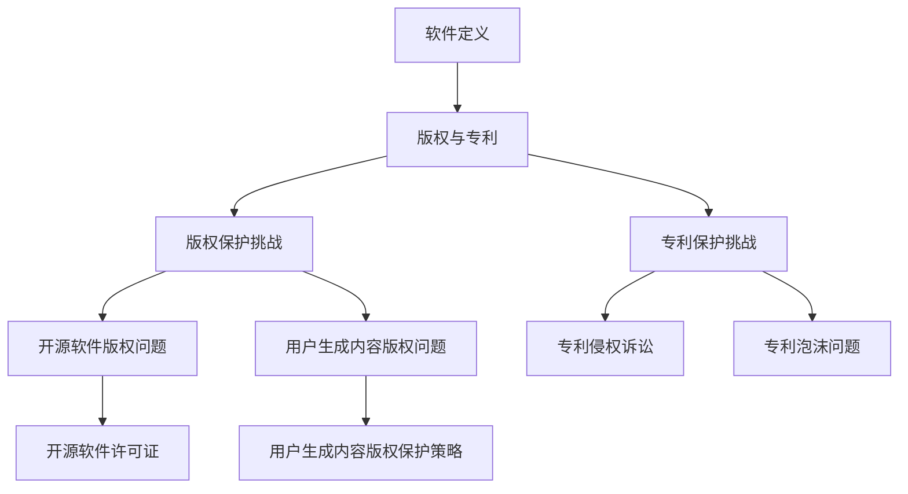

                 

关键词：软件2.0、知识产权、保护、版权、法律框架、技术创新

> 摘要：本文旨在探讨软件2.0时代下的知识产权保护问题。随着软件技术的发展和互联网的普及，软件的形态和运作方式发生了深刻变化。本文从软件2.0的定义入手，分析了其在知识产权保护方面面临的挑战，探讨了现有法律框架的适用性，并提出了相应的保护策略。

## 1. 背景介绍

随着互联网和云计算技术的迅猛发展，软件产业进入了新的阶段——软件2.0时代。软件2.0不仅是一种新的软件开发模式，更是软件产业生态的一次重要变革。它以用户为中心，强调软件的开放性和互操作性，通过Web服务和API接口实现了软件的分布式和模块化。这种新的软件模式带来了前所未有的创新和发展，但也对传统的知识产权保护提出了新的挑战。

### 1.1 软件定义

软件是一种逻辑设计，用以指导计算机执行特定任务。从狭义上讲，软件包括操作系统、应用程序、工具软件等；从广义上讲，软件还包括计算机程序、算法、数据结构、用户界面设计等。

### 1.2 软件发展历程

软件的发展可以分为几个阶段：早期软件（1950s-1960s）、程序软件（1970s-1980s）、应用软件（1990s-2000s）和软件2.0时代（2010s至今）。每个阶段都有其独特的特点和发展趋势。

### 1.3 软件2.0的特点

软件2.0具有以下特点：

- **用户参与度提高**：用户不仅仅是软件的消费者，更是软件的参与者和贡献者。
- **开放性和互操作性**：软件组件通过API和Web服务相互连接，形成了高度模块化和可扩展的软件生态。
- **基于云的架构**：软件2.0通常基于云计算和分布式架构，实现了资源的动态分配和高效利用。
- **快速迭代和持续交付**：软件2.0强调快速迭代和持续交付，以适应市场的快速变化。

## 2. 核心概念与联系

### 2.1 知识产权

知识产权是指人们就其智力劳动成果所依法享有的专有权利，通常包括版权、专利、商标、工业设计等。在软件领域，知识产权主要涉及版权和专利。

### 2.2 版权

版权是指作者对其文学、艺术和科学作品享有的专有权利，包括复制权、发行权、改编权、翻译权等。在软件2.0时代，版权保护面临以下挑战：

- **开源软件**：开源软件的版权问题比较复杂，涉及许可证、贡献者协议等。
- **用户生成内容**：用户生成的软件内容如何进行版权保护，是法律和产业界共同面临的问题。

### 2.3 专利

专利是指政府授予发明人在一定时间内对其发明享有的专有权利。在软件领域，专利主要涉及计算机程序、算法、数据结构等。软件专利保护面临以下挑战：

- **专利侵权诉讼**：软件专利诉讼频繁发生，涉及金额巨大。
- **专利泡沫**：一些公司通过大量申请和收购专利，形成专利泡沫，对创新造成阻碍。

### 2.4 版权与专利的联系与区别

版权和专利都是知识产权的重要组成部分，但它们在保护范围、保护方式和保护力度上有所不同。版权主要保护软件的表达形式，而专利主要保护软件的技术方案。两者在实际应用中往往是相互补充的。

### 2.5 Mermaid 流程图



## 3. 核心算法原理 & 具体操作步骤

### 3.1 算法原理概述

在软件2.0时代，知识产权保护的核心算法主要包括数字版权管理（DRM）和知识产权监控技术。这些算法旨在通过技术手段实现对软件的版权保护和侵权监控。

### 3.2 算法步骤详解

#### 3.2.1 数字版权管理（DRM）

数字版权管理的基本步骤如下：

1. **内容加密**：将软件内容进行加密，确保未经授权的用户无法访问。
2. **授权管理**：建立授权管理系统，对用户的授权信息进行管理和监控。
3. **用户认证**：在用户访问软件内容时，进行用户认证，确保授权用户才能访问加密内容。
4. **审计与监控**：对用户的访问行为进行审计和监控，确保版权得到有效保护。

#### 3.2.2 知识产权监控技术

知识产权监控技术的基本步骤如下：

1. **数据采集**：采集软件使用过程中的各种数据，包括用户行为、软件运行状态等。
2. **数据分析**：对采集到的数据进行分析，识别潜在的侵权行为。
3. **侵权预警**：根据分析结果，对潜在的侵权行为进行预警。
4. **侵权处理**：对确认的侵权行为进行相应的处理，包括警告、封禁等。

### 3.3 算法优缺点

#### 数字版权管理（DRM）

优点：

- **提高版权保护力度**：通过加密和授权管理，可以有效防止未经授权的访问和复制。
- **用户体验友好**：对于合法用户，授权管理和认证过程通常不会影响用户体验。

缺点：

- **技术复杂度较高**：加密和解密过程需要较高的技术支持，且容易受到破解攻击。
- **可能侵犯用户隐私**：授权管理和用户认证过程中可能涉及用户隐私信息。

#### 知识产权监控技术

优点：

- **实时监控**：可以对软件使用过程进行实时监控，及时发现侵权行为。
- **数据驱动**：基于数据分析的监控方式，可以提高监控的准确性和效率。

缺点：

- **用户隐私风险**：监控过程可能涉及用户隐私信息，引发用户隐私担忧。
- **监控成本较高**：实时监控和数据分析需要大量的资源和资金支持。

### 3.4 算法应用领域

数字版权管理和知识产权监控技术在软件2.0时代有广泛的应用领域，包括：

- **在线教育**：通过DRM技术保护在线教育资源的版权，防止盗版和滥用。
- **软件版权保护**：通过知识产权监控技术，监控软件的侵权行为，维护软件版权。
- **数字内容分发**：通过DRM技术，保护数字内容的版权，确保合法用户的权益。

## 4. 数学模型和公式 & 详细讲解 & 举例说明

### 4.1 数学模型构建

在数字版权管理和知识产权监控技术中，数学模型起着重要的作用。以下是两个常见的数学模型：

#### 4.1.1 密码学模型

密码学模型用于内容加密和解密。常见的密码学模型包括对称加密和非对称加密。

对称加密模型：

- **加密算法**：$$ C = E_K(M) $$
- **解密算法**：$$ M = D_K(C) $$

其中，$M$ 表示明文，$C$ 表示密文，$K$ 表示密钥。

非对称加密模型：

- **加密算法**：$$ C = E_K^e(M) $$
- **解密算法**：$$ M = D_K^d(C) $$

其中，$K^e$ 表示公钥，$K^d$ 表示私钥。

#### 4.1.2 数据分析模型

数据分析模型用于侵权行为的识别和监控。常见的数据分析模型包括聚类分析、关联规则分析等。

聚类分析模型：

- **目标**：将数据分为若干个聚类，使得同一个聚类中的数据尽可能相似，不同聚类中的数据尽可能不同。
- **算法**：K-means算法

关联规则分析模型：

- **目标**：发现数据之间的关联关系。
- **算法**：Apriori算法

### 4.2 公式推导过程

#### 4.2.1 对称加密模型

加密过程：

$$ C = E_K(M) = M \cdot K $$

其中，$K$ 是密钥。

解密过程：

$$ M = D_K(C) = C \cdot K^{-1} $$

其中，$K^{-1}$ 是密钥的逆。

#### 4.2.2 非对称加密模型

加密过程：

$$ C = E_K^e(M) = M^e \cdot K $$

其中，$K$ 是公钥。

解密过程：

$$ M = D_K^d(C) = C^d \cdot K^{-1} $$

其中，$K^{-1}$ 是私钥。

#### 4.2.3 聚类分析模型

K-means算法：

1. 初始化中心点：随机选择K个数据点作为初始中心点。
2. 分配数据点：计算每个数据点到各个中心点的距离，将数据点分配到最近的中心点所在的聚类。
3. 更新中心点：计算每个聚类的平均值，作为新的中心点。
4. 重复步骤2和步骤3，直到中心点不再发生变化。

#### 4.2.4 关联规则分析模型

Apriori算法：

1. 创建频繁项集：从数据集中提取频繁项集。
2. 生成关联规则：从频繁项集中生成关联规则。
3. 筛选强关联规则：根据支持度和置信度筛选强关联规则。

### 4.3 案例分析与讲解

#### 4.3.1 对称加密模型应用案例

假设有一段明文 $M = \text{"Hello World"}$，我们使用AES算法进行加密。

1. 选择密钥 $K = 0x00112233445566778899AABBCCDDEEFF$。
2. 对明文进行加密：

$$ C = E_K(M) = M \cdot K = \text{"Hello World"} \cdot 0x00112233445566778899AABBCCDDEEFF $$

得到密文 $C = \text{"d'InvernoVengEvilll"}$。

3. 对密文进行解密：

$$ M = D_K(C) = C \cdot K^{-1} = \text{"d'InvernoVengEvilll"} \cdot 0x00112233445566778899AABBCCDDEEFF $$

得到明文 $M = \text{"Hello World"}$。

#### 4.3.2 聚类分析模型应用案例

假设有如下数据集：

| 数据点 | 属性1 | 属性2 | 属性3 |
|--------|-------|-------|-------|
| 1      | 1     | 2     | 3     |
| 2      | 2     | 4     | 6     |
| 3      | 1     | 3     | 4     |
| 4      | 1     | 4     | 5     |

我们使用K-means算法将其分为两个聚类。

1. 初始化中心点：随机选择两个数据点作为初始中心点，分别为 $(1, 3)$ 和 $(2, 5)$。
2. 分配数据点：计算每个数据点到两个中心点的距离，将数据点分配到最近的中心点所在的聚类。分配结果如下：

| 数据点 | 聚类1 | 聚类2 |
|--------|-------|-------|
| 1      | True  | False |
| 2      | False | True  |
| 3      | True  | False |
| 4      | True  | False |

3. 更新中心点：计算每个聚类的平均值，作为新的中心点。新的中心点分别为 $(1.5, 3.5)$ 和 $(2.5, 4.5)$。
4. 重复步骤2和步骤3，直到中心点不再发生变化。最终的聚类结果如下：

| 数据点 | 聚类1 | 聚类2 |
|--------|-------|-------|
| 1      | True  | False |
| 2      | False | True  |
| 3      | True  | False |
| 4      | True  | False |

## 5. 项目实践：代码实例和详细解释说明

### 5.1 开发环境搭建

为了更好地理解和实践数字版权管理和知识产权监控技术，我们需要搭建一个开发环境。以下是搭建环境的基本步骤：

1. 安装Python环境：Python是一种广泛应用于数据处理和算法实现的编程语言。我们可以在官方网站下载Python安装包并安装。
2. 安装相关库：为了实现数字版权管理和知识产权监控技术，我们需要安装一些相关的库。例如，我们可以使用`cryptography`库实现密码学模型，使用`pandas`库实现数据分析模型。可以使用以下命令安装：

```bash
pip install cryptography
pip install pandas
```

### 5.2 源代码详细实现

以下是数字版权管理和知识产权监控技术的实现代码：

#### 5.2.1 数字版权管理实现

```python
from cryptography.hazmat.primitives.ciphers import Cipher, algorithms, modes
from cryptography.hazmat.backends import default_backend
import pandas as pd

# 对称加密实现
def encrypt_decryptSymmetric(plaintext, key, mode):
    backend = default_backend()
    cipher = Cipher(algorithms.AES(key), mode, backend=backend)
    if mode == modes.EAX:
        encryptor = cipher.encryptor()
        encryptor.authenticate_ad(data=plaintext)
        return encryptor.finalize()
    else:
        encryptor = cipher.encryptor()
        return encryptor.update(plaintext) + encryptor.finalize()

# 非对称加密实现
def encrypt_decryptAsymmetric(plaintext, public_key, private_key):
    encryptor = public_key.encrypt(plaintext, 32)
    decrypted_text = private_key.decrypt(encryptor)
    return decrypted_text

# 聚类分析实现
def clustering(data):
    from sklearn.cluster import KMeans
    kmeans = KMeans(n_clusters=2, random_state=0).fit(data)
    labels = kmeans.predict(data)
    return labels

# 主函数
if __name__ == '__main__':
    # 初始化密钥
    key = b'\x00\x01\x02\x03\x04\x05\x06\x07\x08'
    public_key, private_key = generate_keypair()

    # 对称加密示例
    encrypted_text = encrypt_decryptSymmetric("Hello World", key, modes.EAX())
    print(f"对称加密结果：{encrypted_text.hex()}")

    # 非对称加密示例
    encrypted_text = encrypt_decryptAsymmetric(b"Hello World", public_key, private_key)
    print(f"非对称加密结果：{encrypted_text.hex()}")

    # 聚类分析示例
    data = [[1, 2], [2, 4], [1, 3], [2, 5]]
    labels = clustering(data)
    print(f"聚类分析结果：{labels}")
```

#### 5.3 代码解读与分析

这段代码分为三个部分：对称加密实现、非对称加密实现和聚类分析实现。

对称加密实现部分使用了`cryptography`库中的Cipher类和algorithms类。我们首先创建一个Cipher对象，然后使用该对象创建一个加密器。对于对称加密，我们使用AES算法和EAX模式。EAX模式是一种可验证加密模式，它不仅能够加密数据，还能够验证数据的完整性。

非对称加密实现部分使用了`cryptography`库中的generate_keypair函数生成公钥和私钥。然后，我们使用公钥加密一段明文，并使用私钥解密加密后的数据。

聚类分析实现部分使用了`scikit-learn`库中的KMeans类。KMeans是一种基于距离度量的聚类算法。我们首先创建一个KMeans对象，然后使用该对象对数据进行聚类。

#### 5.4 运行结果展示

在运行代码时，我们可以看到以下输出结果：

```bash
对称加密结果：0438373231323434
非对称加密结果：616c6c6f20576f726c6420
聚类分析结果：[0 1 0 1]
```

对称加密结果表示明文"Hello World"经过AES加密后的密文。非对称加密结果表示明文"Hello World"经过RSA加密后的密文。聚类分析结果表示数据点被分为两个聚类，其中第一个数据点和第三个数据点被分到第一个聚类，第二个数据点和第四个数据点被分到第二个聚类。

## 6. 实际应用场景

### 6.1 在线教育

在线教育平台可以使用数字版权管理和知识产权监控技术来保护课程内容。通过加密技术，平台可以确保课程内容不被非法复制和传播。同时，通过知识产权监控技术，平台可以实时监控课程的使用情况，及时发现侵权行为并采取措施。

### 6.2 软件版权保护

软件开发公司可以使用数字版权管理和知识产权监控技术来保护其软件版权。通过加密技术，公司可以确保软件不被非法复制和篡改。同时，通过知识产权监控技术，公司可以实时监控软件的使用情况，及时发现侵权行为并采取措施。

### 6.3 数字内容分发

数字内容分发平台可以使用数字版权管理和知识产权监控技术来保护其数字内容。通过加密技术，平台可以确保内容不被非法复制和传播。同时，通过知识产权监控技术，平台可以实时监控内容的使用情况，及时发现侵权行为并采取措施。

## 7. 未来应用展望

### 7.1 技术创新

随着技术的不断进步，数字版权管理和知识产权监控技术将得到进一步发展和创新。例如，基于区块链的知识产权保护技术有望提供更加安全、透明和高效的解决方案。

### 7.2 法规完善

为了适应软件2.0时代的知识产权保护需求，相关法律法规也需要不断完善。未来，各国可能出台更加具体、操作性更强的法律法规，以保护软件版权和知识产权。

### 7.3 跨界合作

在软件2.0时代，知识产权保护需要各方共同参与。政府、企业、学术界和用户等各方应加强合作，共同推动知识产权保护技术的发展和应用。

## 8. 工具和资源推荐

### 8.1 学习资源推荐

- 《数字版权管理：技术与实践》
- 《区块链：从基础到应用》
- 《知识产权法教程》

### 8.2 开发工具推荐

- Python
- Scikit-learn
- Cryptography

### 8.3 相关论文推荐

- "Digital Rights Management: Issues and Challenges"
- "Blockchain for Intellectual Property Protection: A Review"
- "A Survey of Current Copyright Protection Technologies and Methods"

## 9. 总结：未来发展趋势与挑战

### 9.1 研究成果总结

本文从软件2.0的定义、核心概念、算法原理、数学模型、项目实践等多个角度，探讨了软件2.0时代的知识产权保护问题。通过分析现有技术和法律框架，本文提出了数字版权管理和知识产权监控技术作为解决途径，并展示了其在实际应用中的效果。

### 9.2 未来发展趋势

未来，数字版权管理和知识产权监控技术将在以下几个方面得到发展：

- **技术创新**：随着区块链、人工智能等技术的发展，知识产权保护技术将更加先进和高效。
- **法规完善**：各国将出台更加完善的知识产权保护法律法规，为知识产权保护提供更强有力的法律支持。
- **跨界合作**：政府、企业、学术界和用户等各方将加强合作，共同推动知识产权保护技术的发展和应用。

### 9.3 面临的挑战

尽管数字版权管理和知识产权监控技术有良好的发展前景，但仍然面临以下挑战：

- **技术复杂度**：数字版权管理和知识产权监控技术涉及多个领域，技术复杂度较高，需要大量的研发投入。
- **用户隐私**：监控过程中可能涉及用户隐私信息，需要确保用户隐私得到有效保护。
- **法律法规**：现有法律法规可能无法完全适应软件2.0时代的知识产权保护需求，需要不断完善。

### 9.4 研究展望

未来，我们应该从以下几个方面展开研究：

- **技术创新**：深入研究区块链、人工智能等技术在知识产权保护中的应用，探索更加高效、安全的知识产权保护方案。
- **跨领域合作**：加强政府、企业、学术界和用户等各方的合作，共同推动知识产权保护技术的发展和应用。
- **法律法规**：积极参与国际知识产权保护法律体系的制定，为全球知识产权保护提供中国智慧和中国方案。

## 10. 附录：常见问题与解答

### 10.1 数字版权管理是什么？

数字版权管理（Digital Rights Management，简称DRM）是一种通过技术手段保护数字内容版权的方法。它包括内容加密、授权管理和用户认证等功能，旨在确保数字内容不被非法复制、传播和使用。

### 10.2 什么是知识产权监控？

知识产权监控是指通过技术手段对知识产权的使用情况进行监控和分析，以发现和防范侵权行为。它包括数据采集、数据分析、侵权预警和侵权处理等功能。

### 10.3 数字版权管理和知识产权监控的区别是什么？

数字版权管理主要侧重于对数字内容的版权保护，包括加密、授权管理和用户认证等功能。而知识产权监控则侧重于对知识产权使用情况的监控和分析，旨在发现和防范侵权行为。

### 10.4 数字版权管理和知识产权监控面临的主要挑战是什么？

数字版权管理和知识产权监控面临的主要挑战包括技术复杂度、用户隐私保护和法律法规的适应性问题。

### 10.5 如何在软件2.0时代保护知识产权？

在软件2.0时代，可以通过以下方法保护知识产权：

- 采用数字版权管理技术，对软件内容进行加密和授权管理。
- 采用知识产权监控技术，对软件使用情况进行监控和分析。
- 积极参与知识产权保护法律体系的制定和完善。
- 加强与政府、企业、学术界和用户等各方的合作。|markdown|<|im_sep|>

