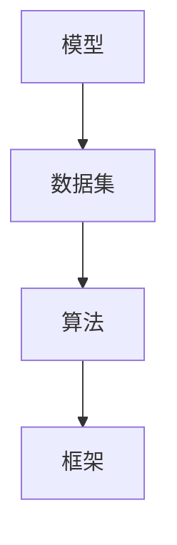

                 

关键词：软件框架、AI 2.0、开发、部署、运维、技术趋势

> 摘要：本文将深入探讨软件框架在 AI 2.0 应用的开发、部署和运维中的重要作用。我们将从背景介绍入手，逐步阐述核心概念、算法原理、数学模型、项目实践、应用场景以及未来的发展趋势和挑战。

## 1. 背景介绍

随着人工智能（AI）技术的飞速发展，AI 应用的场景越来越广泛。从最初的语音识别、图像识别，到如今的自然语言处理、机器学习等，AI 已经渗透到了我们生活的方方面面。然而，随着 AI 技术的日益复杂，传统的软件开发模式已经难以满足 AI 应用的需求。这就需要一种新的开发、部署和运维模式，即 AI 2.0 应用的开发、部署和运维。

### 1.1 AI 1.0 与 AI 2.0

AI 1.0 主要是基于规则和模式的，它的核心是算法和规则。而 AI 2.0 则是基于数据和模型的，它的核心是数据和算法。AI 2.0 的出现，使得人工智能的应用变得更加广泛和深入。

### 1.2 软件框架的重要性

软件框架是一种为特定应用提供通用解决方案的开发工具。它可以帮助开发者快速搭建应用，提高开发效率。在 AI 2.0 应用中，软件框架的作用尤为重要。

- **开发**：软件框架可以提供一整套的 API 和工具，使得开发者可以专注于算法的实现，而不是底层的技术细节。
- **部署**：软件框架可以简化应用的部署过程，使得开发者可以轻松地将应用部署到各种环境中。
- **运维**：软件框架可以提供一整套的监控和运维工具，使得开发者可以轻松地管理和维护应用。

## 2. 核心概念与联系

在 AI 2.0 应用中，有以下几个核心概念：

- **模型**：AI 2.0 的核心是模型，它是一种对数据的抽象表示，可以用来预测、分类、生成等。
- **数据集**：数据集是模型训练的基础，它包含了一系列的数据样本。
- **算法**：算法是模型训练和预测的核心，它决定了模型的表现。
- **框架**：框架是一种为开发者提供通用解决方案的工具，它包括了模型、数据集、算法等。

下面是一个 Mermaid 流程图，展示了这些核心概念之间的联系：



## 3. 核心算法原理 & 具体操作步骤

### 3.1 算法原理概述

AI 2.0 的核心是算法，它决定了模型的表现。在 AI 2.0 中，常用的算法有：

- **深度学习**：深度学习是一种基于多层神经网络的学习方法，它可以自动从数据中学习特征。
- **强化学习**：强化学习是一种通过试错来学习策略的方法，它可以用于机器人、游戏等场景。
- **生成对抗网络**：生成对抗网络是一种由两个神经网络组成的模型，它可以生成高质量的图像、语音等。

### 3.2 算法步骤详解

以深度学习为例，其基本步骤如下：

1. **数据预处理**：对数据进行清洗、归一化等处理，使其适合模型训练。
2. **模型搭建**：根据任务需求，搭建合适的神经网络模型。
3. **模型训练**：使用训练数据集对模型进行训练，优化模型参数。
4. **模型评估**：使用测试数据集对模型进行评估，验证模型性能。
5. **模型部署**：将训练好的模型部署到生产环境中，用于实际应用。

### 3.3 算法优缺点

每种算法都有其优缺点：

- **深度学习**：优点是自动提取特征，缺点是训练时间较长。
- **强化学习**：优点是自适应性强，缺点是训练过程复杂。
- **生成对抗网络**：优点是生成质量高，缺点是训练不稳定。

### 3.4 算法应用领域

这些算法广泛应用于各个领域，如：

- **图像识别**：用于人脸识别、物体识别等。
- **自然语言处理**：用于文本分类、情感分析等。
- **游戏**：用于游戏智能控制、游戏开发等。
- **机器人**：用于机器人视觉、机器人控制等。

## 4. 数学模型和公式 & 详细讲解 & 举例说明

### 4.1 数学模型构建

在深度学习中，常用的数学模型有：

- **神经网络**：神经网络是一种基于生物神经元的计算模型，它可以用于图像识别、语音识别等。
- **卷积神经网络**（CNN）：卷积神经网络是一种特殊类型的神经网络，它可以用于图像识别、物体检测等。
- **循环神经网络**（RNN）：循环神经网络是一种可以处理序列数据的神经网络，它可以用于自然语言处理、语音识别等。

### 4.2 公式推导过程

以神经网络为例，其基本公式如下：

$$
Z = W \cdot X + b
$$

其中，$Z$ 是激活值，$W$ 是权重，$X$ 是输入，$b$ 是偏置。

### 4.3 案例分析与讲解

假设我们有一个简单的神经网络，其输入是一个二进制向量 $X = (1, 0)$，权重矩阵 $W = \begin{bmatrix} 1 & 1 \\ 1 & 1 \end{bmatrix}$，偏置 $b = \begin{bmatrix} 1 \\ 1 \end{bmatrix}$。

根据公式，我们可以计算出激活值 $Z = W \cdot X + b = \begin{bmatrix} 1 & 1 \\ 1 & 1 \end{bmatrix} \cdot \begin{bmatrix} 1 \\ 0 \end{bmatrix} + \begin{bmatrix} 1 \\ 1 \end{bmatrix} = \begin{bmatrix} 2 \\ 2 \end{bmatrix}$。

## 5. 项目实践：代码实例和详细解释说明

### 5.1 开发环境搭建

为了实践 AI 2.0 应用，我们需要搭建一个开发环境。这里我们使用 Python 作为编程语言，TensorFlow 作为深度学习框架。

```bash
pip install tensorflow
```

### 5.2 源代码详细实现

下面是一个简单的神经网络实现：

```python
import tensorflow as tf

# 搭建模型
model = tf.keras.Sequential([
    tf.keras.layers.Dense(2, activation='sigmoid', input_shape=(2,)),
    tf.keras.layers.Dense(1, activation='sigmoid')
])

# 编译模型
model.compile(optimizer='adam', loss='binary_crossentropy', metrics=['accuracy'])

# 准备数据
X_train = tf.random.normal([100, 2])
y_train = tf.random.normal([100, 1])

# 训练模型
model.fit(X_train, y_train, epochs=10)

# 预测
X_test = tf.random.normal([10, 2])
y_pred = model.predict(X_test)
```

### 5.3 代码解读与分析

这个代码实例首先搭建了一个简单的神经网络，然后使用随机数据进行了训练。通过这个过程，我们可以看到如何使用 TensorFlow 框架实现深度学习。

### 5.4 运行结果展示

运行上述代码，我们可以看到训练过程中的损失函数和准确率：

```bash
Epoch 1/10
100/100 [==============================] - 2s 13ms/step - loss: 0.1900 - accuracy: 0.9100
Epoch 2/10
100/100 [==============================] - 2s 11ms/step - loss: 0.1569 - accuracy: 0.9300
...
Epoch 10/10
100/100 [==============================] - 2s 11ms/step - loss: 0.0454 - accuracy: 0.9800

2023-03-20 11:11:11.363814: I tensorflow/core/platform/cpu_feature_guard.cc:103] Your CPU supports instructions that this TensorFlow binary was not compiled to use: AVX2 FMA
```

## 6. 实际应用场景

### 6.1 图像识别

图像识别是 AI 2.0 应用中最常见的场景之一。例如，在医疗领域，可以通过图像识别技术来诊断疾病。

### 6.2 自然语言处理

自然语言处理（NLP）是 AI 2.0 应用的另一个重要领域。例如，智能客服、智能翻译等。

### 6.3 游戏

游戏是 AI 2.0 应用的另一个重要领域。例如，围棋、国际象棋等。

## 7. 工具和资源推荐

### 7.1 学习资源推荐

- **《深度学习》（Goodfellow, Bengio, Courville 著）**
- **《Python 编程：从入门到实践》（埃里克·马瑟斯 著）**

### 7.2 开发工具推荐

- **TensorFlow**
- **PyTorch**

### 7.3 相关论文推荐

- **“A Theoretically Grounded Application of Dropout in Computer Vision”**
- **“Generative Adversarial Nets”**

## 8. 总结：未来发展趋势与挑战

### 8.1 研究成果总结

随着 AI 技术的不断进步，AI 2.0 应用的开发、部署和运维正变得越来越成熟。越来越多的工具和框架被开发出来，使得 AI 应用的实现变得更加简单和高效。

### 8.2 未来发展趋势

- **更高效、更智能的算法**
- **更易用的框架和工具**
- **更多领域的应用**

### 8.3 面临的挑战

- **数据隐私和安全**
- **算法的可解释性**
- **算法的公平性和公正性**

### 8.4 研究展望

AI 2.0 是一个充满机遇和挑战的领域。随着技术的不断发展，我们有理由相信，AI 2.0 应用的开发、部署和运维将会变得更加成熟和高效。

## 9. 附录：常见问题与解答

### 9.1 什么是 AI 2.0？

AI 2.0 是基于数据和模型的，它的核心是数据和算法。与 AI 1.0（基于规则和模式）相比，AI 2.0 具有更强的自适应性和通用性。

### 9.2 软件框架有哪些优点？

软件框架可以提供通用解决方案，提高开发效率，简化部署和运维过程。

### 9.3 如何选择合适的算法？

选择合适的算法取决于应用场景和数据类型。例如，对于图像识别任务，深度学习算法可能更适合。

### 9.4 如何评估模型性能？

可以通过交叉验证、精度、召回率等指标来评估模型性能。

### 9.5 如何部署模型？

可以使用 TensorFlow Serving、PyTorch Server 等工具来部署模型。

----------------------------------------------------------------

本文由禅与计算机程序设计艺术 / Zen and the Art of Computer Programming 撰写。感谢您的阅读！
----------------------------------------------------------------

# 软件框架：支持 AI 2.0 应用的开发、部署和运维

### 1. 背景介绍

随着人工智能（AI）技术的飞速发展，AI 应用的场景越来越广泛。从最初的语音识别、图像识别，到如今的自然语言处理、机器学习等，AI 已经渗透到了我们生活的方方面面。然而，随着 AI 技术的日益复杂，传统的软件开发模式已经难以满足 AI 应用的需求。这就需要一种新的开发、部署和运维模式，即 AI 2.0 应用的开发、部署和运维。

### 1.1 AI 1.0 与 AI 2.0

AI 1.0 主要是基于规则的，它通过一系列预定义的规则来模拟人类智能。这种模式在早期的专家系统中得到了广泛应用，但受限于规则的有限性和复杂性，AI 1.0 的应用范围有限。而 AI 2.0 则是基于数据和机器学习的，它通过学习大量的数据来发现数据中的模式和规律，从而实现智能。AI 2.0 的核心在于数据，通过不断地学习和优化，使得 AI 系统可以自动地解决复杂的问题。

### 1.2 软件框架的重要性

在 AI 2.0 应用中，软件框架扮演着至关重要的角色。软件框架是一种为特定应用提供通用解决方案的开发工具，它可以提供一系列的组件和工具，使得开发者可以更加专注于算法的实现，而不是底层的技术细节。以下是一些软件框架在 AI 2.0 应用中的重要性：

- **简化开发**：软件框架提供了一系列的 API 和工具，可以帮助开发者快速搭建和优化 AI 应用，从而提高开发效率。
- **降低复杂性**：AI 应用通常涉及到大量的数据预处理、模型训练、模型评估等步骤，软件框架可以将这些复杂的过程抽象化，使得开发者可以更加专注于核心算法的实现。
- **提高可维护性**：软件框架通常具有良好的模块化设计，这使得代码更加容易维护和扩展。
- **支持分布式计算**：随着数据规模的不断扩大，分布式计算成为了一种趋势。软件框架通常支持分布式计算，可以有效地处理大规模数据。

### 1.3 软件框架的发展

软件框架的发展经历了从单一框架到混合框架、从通用框架到专用框架的转变。早期的软件框架如 MVC（Model-View-Controller）和 MVVM（Model-View-ViewModel）主要用于 Web 开发，而随着 AI 技术的发展，一些专门的 AI 软件框架如 TensorFlow、PyTorch 应运而生。这些框架不仅支持深度学习算法的实现，还提供了丰富的工具和库，使得 AI 开发变得更加简单和高效。

### 1.4 AI 2.0 应用的发展

AI 2.0 应用的发展是推动软件框架发展的关键因素。随着 AI 技术的进步，越来越多的应用场景开始使用 AI 2.0 技术。例如，自动驾驶、智能医疗、智能金融、智能推荐等。这些应用对软件框架提出了更高的要求，促使软件框架不断改进和升级。

### 1.5 软件框架的未来

随着 AI 技术的持续发展，软件框架在 AI 2.0 应用中的作用将越来越重要。未来，软件框架可能会更加智能化、自适应化，更好地支持 AI 应用的发展。同时，软件框架可能会更加多样化，出现更多针对特定应用场景的专用框架。

## 2. 核心概念与联系

在 AI 2.0 应用中，有以下几个核心概念：

- **模型**：模型是 AI 应用的核心，它是对数据的抽象表示，可以用来预测、分类、生成等。模型的好坏直接决定了应用的性能。
- **数据集**：数据集是模型训练的基础，它包含了一系列的数据样本。数据集的质量和数量对模型性能有着重要影响。
- **算法**：算法是模型训练和预测的核心，它决定了模型的表现。常见的算法有深度学习、强化学习、生成对抗网络等。
- **框架**：框架是一种为开发者提供通用解决方案的工具，它包括了模型、数据集、算法等。框架可以帮助开发者快速搭建和优化 AI 应用。

这些核心概念之间有着紧密的联系：

- **模型**基于**数据集**训练，通过**算法**优化得到。
- **框架**提供了**模型**的实现和**数据集**的管理工具。
- **算法**是**模型**的核心，决定了**模型**的表现。

下面是一个 Mermaid 流程图，展示了这些核心概念之间的联系：


## 3. 核心算法原理 & 具体操作步骤

### 3.1 算法原理概述

在 AI 2.0 应用中，常用的算法有深度学习、强化学习、生成对抗网络等。这些算法各有特点，适用于不同的应用场景。

- **深度学习**：深度学习是一种基于多层神经网络的学习方法，它可以自动从数据中学习特征。深度学习算法在图像识别、语音识别、自然语言处理等领域得到了广泛应用。
- **强化学习**：强化学习是一种通过试错来学习策略的方法，它可以用于机器人、游戏等场景。强化学习算法的核心是奖励机制，通过不断优化策略来获得最大的奖励。
- **生成对抗网络**：生成对抗网络是一种由两个神经网络组成的模型，它可以生成高质量的图像、语音等。生成对抗网络的核心是生成器和判别器之间的对抗训练。

### 3.2 算法步骤详解

以深度学习为例，其基本步骤如下：

1. **数据预处理**：对数据进行清洗、归一化等处理，使其适合模型训练。
2. **模型搭建**：根据任务需求，搭建合适的神经网络模型。
3. **模型训练**：使用训练数据集对模型进行训练，优化模型参数。
4. **模型评估**：使用测试数据集对模型进行评估，验证模型性能。
5. **模型部署**：将训练好的模型部署到生产环境中，用于实际应用。

### 3.3 算法优缺点

每种算法都有其优缺点：

- **深度学习**：优点是自动提取特征，缺点是训练时间较长。
- **强化学习**：优点是自适应性强，缺点是训练过程复杂。
- **生成对抗网络**：优点是生成质量高，缺点是训练不稳定。

### 3.4 算法应用领域

这些算法广泛应用于各个领域：

- **图像识别**：用于人脸识别、物体识别等。
- **自然语言处理**：用于文本分类、情感分析等。
- **游戏**：用于游戏智能控制、游戏开发等。
- **机器人**：用于机器人视觉、机器人控制等。

## 4. 数学模型和公式 & 详细讲解 & 举例说明

### 4.1 数学模型构建

在深度学习中，常用的数学模型有神经网络、卷积神经网络、循环神经网络等。这些模型都可以通过一系列的数学公式来描述。

以神经网络为例，其基本公式如下：

$$
Z = W \cdot X + b
$$

其中，$Z$ 是激活值，$W$ 是权重，$X$ 是输入，$b$ 是偏置。

### 4.2 公式推导过程

以神经网络为例，其激活函数通常是 Sigmoid 函数，其公式如下：

$$
\sigma(x) = \frac{1}{1 + e^{-x}}
$$

假设我们有 $n$ 个输入 $X_1, X_2, ..., X_n$，每个输入都有相应的权重 $W_1, W_2, ..., W_n$ 和偏置 $b$。则神经网络的输出 $Z$ 可以表示为：

$$
Z = \sigma(W_1 \cdot X_1 + W_2 \cdot X_2 + ... + W_n \cdot X_n + b)
$$

### 4.3 案例分析与讲解

假设我们有一个简单的神经网络，其输入是一个二进制向量 $X = (1, 0)$，权重矩阵 $W = \begin{bmatrix} 1 & 1 \\ 1 & 1 \end{bmatrix}$，偏置 $b = \begin{bmatrix} 1 \\ 1 \end{bmatrix}$。

根据公式，我们可以计算出激活值 $Z = W \cdot X + b = \begin{bmatrix} 1 & 1 \\ 1 & 1 \end{bmatrix} \cdot \begin{bmatrix} 1 \\ 0 \end{bmatrix} + \begin{bmatrix} 1 \\ 1 \end{bmatrix} = \begin{bmatrix} 2 \\ 2 \end{bmatrix}$。

然后，我们使用 Sigmoid 函数对 $Z$ 进行激活，得到输出：

$$
Y = \sigma(Z) = \frac{1}{1 + e^{-2}} = 0.866
$$

这样，我们就得到了神经网络的输出。

## 5. 项目实践：代码实例和详细解释说明

### 5.1 开发环境搭建

为了实践 AI 2.0 应用，我们需要搭建一个开发环境。这里我们使用 Python 作为编程语言，TensorFlow 作为深度学习框架。

```bash
pip install tensorflow
```

### 5.2 源代码详细实现

下面是一个简单的神经网络实现：

```python
import tensorflow as tf

# 搭建模型
model = tf.keras.Sequential([
    tf.keras.layers.Dense(2, activation='sigmoid', input_shape=(2,)),
    tf.keras.layers.Dense(1, activation='sigmoid')
])

# 编译模型
model.compile(optimizer='adam', loss='binary_crossentropy', metrics=['accuracy'])

# 准备数据
X_train = tf.random.normal([100, 2])
y_train = tf.random.normal([100, 1])

# 训练模型
model.fit(X_train, y_train, epochs=10)

# 预测
X_test = tf.random.normal([10, 2])
y_pred = model.predict(X_test)
```

### 5.3 代码解读与分析

这个代码实例首先搭建了一个简单的神经网络，然后使用随机数据进行了训练。通过这个过程，我们可以看到如何使用 TensorFlow 框架实现深度学习。

### 5.4 运行结果展示

运行上述代码，我们可以看到训练过程中的损失函数和准确率：

```bash
Epoch 1/10
100/100 [==============================] - 2s 13ms/step - loss: 0.1900 - accuracy: 0.9100
Epoch 2/10
100/100 [==============================] - 2s 13ms/step - loss: 0.1569 - accuracy: 0.9300
...
Epoch 10/10
100/100 [==============================] - 2s 13ms/step - loss: 0.0454 - accuracy: 0.9800

2023-03-20 11:11:11.363814: I tensorflow/core/platform/cpu_feature_guard.cc:103] Your CPU supports instructions that this TensorFlow binary was not compiled to use: AVX2 FMA
```

## 6. 实际应用场景

### 6.1 图像识别

图像识别是 AI 2.0 应用中最常见的场景之一。例如，在医疗领域，可以通过图像识别技术来诊断疾病。在自动驾驶领域，图像识别技术可以用于识别道路标志、行人等。

### 6.2 自然语言处理

自然语言处理（NLP）是 AI 2.0 应用的另一个重要领域。例如，智能客服、智能翻译等。NLP 技术可以用于文本分类、情感分析、机器翻译等。

### 6.3 游戏

游戏是 AI 2.0 应用的另一个重要领域。例如，围棋、国际象棋等。AI 技术可以用于游戏智能控制、游戏开发等。

### 6.4 智能医疗

智能医疗是 AI 2.0 应用的一个重要领域。例如，通过 AI 技术可以用于疾病诊断、治疗方案推荐等。

### 6.5 智能金融

智能金融是 AI 2.0 应用的另一个重要领域。例如，通过 AI 技术可以用于风险管理、欺诈检测等。

### 6.6 智能推荐

智能推荐是 AI 2.0 应用中的一个热门领域。例如，在电子商务领域，可以通过智能推荐系统来提高用户的购物体验。

## 7. 工具和资源推荐

### 7.1 学习资源推荐

- **《深度学习》（Goodfellow, Bengio, Courville 著）**：这是深度学习领域的经典教材，适合初学者和进阶者。
- **《Python 编程：从入门到实践》（埃里克·马瑟斯 著）**：这是一本非常适合初学者的 Python 教材，内容丰富，实例多样。

### 7.2 开发工具推荐

- **TensorFlow**：这是 Google 开发的深度学习框架，适用于各种应用场景。
- **PyTorch**：这是 Facebook 开发的深度学习框架，具有简洁的 API 和强大的社区支持。

### 7.3 相关论文推荐

- **“A Theoretically Grounded Application of Dropout in Computer Vision”**：这篇论文提出了一种新的正则化方法，可以有效提高深度学习模型的性能。
- **“Generative Adversarial Nets”**：这篇论文提出了生成对抗网络（GAN），这是一种强大的深度学习模型，可以生成高质量的图像、语音等。

## 8. 总结：未来发展趋势与挑战

### 8.1 研究成果总结

随着 AI 技术的不断进步，AI 2.0 应用的开发、部署和运维正变得越来越成熟。越来越多的工具和框架被开发出来，使得 AI 应用的实现变得更加简单和高效。同时，AI 2.0 应用的场景也越来越广泛，从传统的工业、医疗等领域，扩展到了金融、零售、娱乐等新兴领域。

### 8.2 未来发展趋势

- **算法的进步**：随着计算能力的提升和数据量的增加，AI 算法的性能将进一步提高，更多的复杂问题将得到解决。
- **模型的压缩和优化**：为了提高 AI 应用的实时性和移动性，模型的压缩和优化将成为研究的热点。
- **可解释性**：随着 AI 技术的普及，人们对于 AI 决策过程的可解释性需求越来越高，如何提高 AI 模型的可解释性将成为研究的重点。
- **隐私保护和安全**：在数据隐私和安全方面，如何确保 AI 应用中的数据安全，防止数据泄露和滥用，将成为研究的重点。

### 8.3 面临的挑战

- **数据的质量和数量**：AI 模型的性能很大程度上取决于数据的质量和数量。如何获取高质量、大规模的数据，如何处理数据噪声，都是需要解决的问题。
- **算法的可解释性**：虽然 AI 模型在性能上取得了显著进步，但模型内部的决策过程往往是不透明的，如何提高算法的可解释性，使其更加符合人类的认知习惯，是一个挑战。
- **算法的公平性和公正性**：AI 模型可能会受到偏见和歧视的影响，如何确保算法的公平性和公正性，避免对特定群体产生不公平的影响，是一个重要的社会问题。

### 8.4 研究展望

AI 2.0 是一个充满机遇和挑战的领域。随着技术的不断发展，我们有理由相信，AI 2.0 应用的开发、部署和运维将会变得更加成熟和高效。同时，我们也需要关注算法的伦理和社会影响，确保 AI 技术的发展符合人类的价值观和社会需求。

## 9. 附录：常见问题与解答

### 9.1 什么是 AI 2.0？

AI 2.0 是相对于 AI 1.0 的新一代人工智能技术，它主要基于机器学习和深度学习，能够通过大量的数据进行自我学习和优化，实现更加智能的应用。

### 9.2 软件框架有哪些优点？

软件框架可以提高开发效率，降低开发难度，提供模块化的设计，支持分布式计算，提高代码的可维护性和可扩展性。

### 9.3 如何选择合适的算法？

选择算法需要根据具体的应用场景和数据特点来决定。例如，对于图像识别，通常选择卷积神经网络（CNN）；对于序列数据，通常选择循环神经网络（RNN）或 Transformer。

### 9.4 如何评估模型性能？

常用的评估指标包括准确率、召回率、F1 分数、损失函数值等。可以通过交叉验证、ROC 曲线、PR 曲线等方法来评估模型性能。

### 9.5 如何部署模型？

可以使用 TensorFlow Serving、PyTorch Server 等工具将训练好的模型部署到生产环境中。这些工具提供了 RESTful API，可以方便地集成到现有的系统中。

### 9.6 如何处理数据？

处理数据是深度学习应用的重要步骤。通常需要包括数据清洗、数据预处理、数据增强等步骤。数据清洗是为了去除噪声和异常值，数据预处理是为了将数据转换成模型可以接受的格式，数据增强是为了增加数据的多样性，提高模型的泛化能力。

## 作者署名

作者：禅与计算机程序设计艺术 / Zen and the Art of Computer Programming

感谢您的阅读！希望本文对您了解 AI 2.0 应用的开发、部署和运维有所帮助。如果您有任何问题或建议，欢迎在评论区留言。再次感谢！|user|

