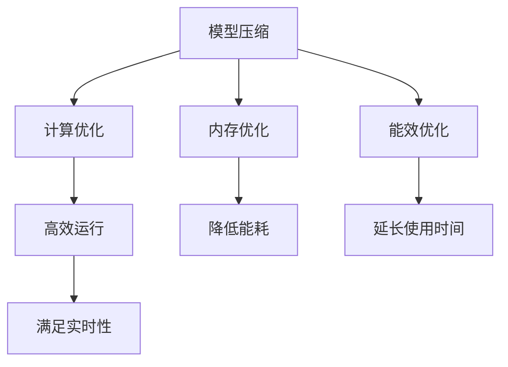

                 

关键词：轻量化大模型、移动端、边缘端、人工智能、计算资源、性能优化、模型压缩、量化、剪枝、深度学习、神经网络。

摘要：本文将深入探讨轻量化大模型在移动端和边缘端的应用前景。随着人工智能技术的迅猛发展，大模型在图像识别、自然语言处理等领域取得了显著的成果。然而，大模型的高计算需求给移动端和边缘端设备带来了巨大的挑战。本文将介绍轻量化大模型的核心概念、算法原理、数学模型，并通过具体案例和代码实例，展示如何在移动端和边缘端实现高效的大模型部署。

## 1. 背景介绍

随着智能手机和物联网设备的普及，移动端和边缘端设备的计算能力不断提升。然而，与云端相比，这些设备的计算资源仍然有限。传统的深度学习大模型，如BERT、GPT等，往往需要大量的计算资源和存储空间，这使得它们在移动端和边缘端的应用面临巨大挑战。

近年来，轻量化大模型的研究受到了广泛关注。轻量化大模型旨在减少模型的大小和计算复杂度，使其能够在移动端和边缘端设备上高效运行。轻量化大模型的研究不仅有助于提升移动端和边缘端设备的应用性能，还能降低设备的能耗和成本，从而推动人工智能技术在更多领域的应用。

本文将首先介绍轻量化大模型的核心概念和算法原理，然后通过具体案例和代码实例，展示如何实现轻量化大模型在移动端和边缘端的应用。

## 2. 核心概念与联系

### 2.1 轻量化大模型的概念

轻量化大模型（Lightweight Large Models）是指通过对深度学习模型进行优化，使其在保持较高性能的同时，减小模型的大小和计算复杂度。轻量化大模型的研究主要包括以下几个方面：

1. **模型压缩**：通过剪枝、量化、蒸馏等手段，减少模型参数的数量，从而降低模型的存储需求和计算复杂度。
2. **计算优化**：通过优化模型的结构，减少模型中冗余的计算操作，从而提高模型的计算效率。
3. **内存优化**：通过优化模型在内存中的存储方式，减少模型在内存中的占用空间。
4. **能效优化**：通过优化模型在计算设备上的运行方式，降低设备的能耗。

### 2.2 轻量化大模型与移动端和边缘端的联系

轻量化大模型与移动端和边缘端的联系主要体现在以下几个方面：

1. **计算资源限制**：移动端和边缘端设备的计算资源相对有限，轻量化大模型可以使其在这些设备上高效运行。
2. **能耗需求**：移动端和边缘端设备的能源供应通常受限，轻量化大模型可以降低设备的能耗，延长设备的使用时间。
3. **存储需求**：轻量化大模型可以减少模型的存储空间，降低设备的存储成本。
4. **实时性要求**：移动端和边缘端设备通常需要实时响应，轻量化大模型可以提高模型的响应速度，满足实时性要求。

### 2.3 轻量化大模型的 Mermaid 流程图



## 3. 核心算法原理 & 具体操作步骤

### 3.1 算法原理概述

轻量化大模型的核心算法主要包括模型压缩、计算优化、内存优化和能效优化。以下将对这些算法进行简要介绍。

1. **模型压缩**：通过剪枝、量化、蒸馏等手段，减少模型参数的数量，从而降低模型的存储需求和计算复杂度。
2. **计算优化**：通过优化模型的结构，减少模型中冗余的计算操作，从而提高模型的计算效率。
3. **内存优化**：通过优化模型在内存中的存储方式，减少模型在内存中的占用空间。
4. **能效优化**：通过优化模型在计算设备上的运行方式，降低设备的能耗，延长设备的使用时间。

### 3.2 算法步骤详解

1. **模型压缩**：
   - **剪枝**：通过删除模型中权重较小的神经元，减少模型参数的数量。
   - **量化**：将模型中的浮点数权重转换为较低精度的整数，从而降低模型的存储和计算需求。
   - **蒸馏**：通过将大模型的输出传递给小模型，使小模型学习到大模型的特性。

2. **计算优化**：
   - **模型简化**：通过简化模型结构，减少模型中冗余的计算操作。
   - **算法优化**：通过优化算法，提高模型的计算效率。

3. **内存优化**：
   - **内存映射**：通过将模型映射到内存的高效区域，减少模型在内存中的占用空间。
   - **数据对齐**：通过优化数据存储方式，减少内存访问的冲突，提高内存访问效率。

4. **能效优化**：
   - **硬件优化**：通过优化硬件设备，提高设备的计算效率。
   - **能效调度**：通过优化模型在设备上的运行方式，降低设备的能耗。

### 3.3 算法优缺点

1. **模型压缩**：
   - **优点**：减少模型大小，降低计算复杂度，提高模型部署的效率。
   - **缺点**：可能会降低模型的性能，增加模型训练的难度。

2. **计算优化**：
   - **优点**：提高模型计算效率，降低模型部署的能耗。
   - **缺点**：可能会增加模型训练的时间和资源消耗。

3. **内存优化**：
   - **优点**：减少模型内存占用，提高模型部署的成功率。
   - **缺点**：可能会增加模型部署的难度。

4. **能效优化**：
   - **优点**：降低模型部署的能耗，延长设备的使用时间。
   - **缺点**：可能会降低模型的性能。

### 3.4 算法应用领域

轻量化大模型的应用领域广泛，包括但不限于以下方面：

1. **移动端应用**：如移动图像识别、移动自然语言处理等。
2. **边缘端应用**：如智能家居、工业物联网等。
3. **实时应用**：如自动驾驶、实时语音识别等。
4. **低成本设备**：如智能手表、智能眼镜等。

## 4. 数学模型和公式 & 详细讲解 & 举例说明

### 4.1 数学模型构建

轻量化大模型的数学模型主要涉及以下方面：

1. **损失函数**：用于评估模型预测结果与真实值之间的差异。
2. **优化算法**：用于调整模型参数，使模型在训练过程中不断优化。
3. **模型评估指标**：用于评估模型在测试集上的性能。

### 4.2 公式推导过程

1. **损失函数**：

   $$L = -\frac{1}{N} \sum_{i=1}^{N} y_i \log(p_i)$$

   其中，$L$ 表示损失函数，$y_i$ 表示真实标签，$p_i$ 表示模型预测的概率。

2. **优化算法**：

   $$\theta = \theta - \alpha \nabla_\theta L$$

   其中，$\theta$ 表示模型参数，$\alpha$ 表示学习率，$\nabla_\theta L$ 表示损失函数关于模型参数的梯度。

3. **模型评估指标**：

   $$ACC = \frac{TP + TN}{TP + TN + FP + FN}$$

   其中，$ACC$ 表示准确率，$TP$ 表示真正例，$TN$ 表示真负例，$FP$ 表示假正例，$FN$ 表示假负例。

### 4.3 案例分析与讲解

假设我们有一个图像分类任务，使用一个轻量化大模型进行训练和测试。以下是一个简单的案例：

1. **数据集**：

   - 训练集：包含1000张图像，分为10个类别。
   - 测试集：包含200张图像，分为10个类别。

2. **模型**：

   - 使用一个轻量化的大模型进行图像分类。
   - 模型参数：1000个神经元，每个神经元连接一个图像特征。

3. **训练过程**：

   - 使用训练集对模型进行训练。
   - 使用优化算法（如梯度下降）调整模型参数。
   - 计算损失函数，评估模型性能。

4. **测试过程**：

   - 使用测试集对模型进行测试。
   - 计算准确率、召回率、F1值等指标。
   - 分析模型在测试集上的性能。

通过上述案例，我们可以看到轻量化大模型的训练和测试过程。在实际应用中，我们还需要根据具体任务需求，对模型进行优化和调整，以提高模型在测试集上的性能。

## 5. 项目实践：代码实例和详细解释说明

### 5.1 开发环境搭建

为了实现轻量化大模型在移动端和边缘端的应用，我们需要搭建一个合适的开发环境。以下是一个简单的开发环境搭建步骤：

1. **安装 Python**：确保安装了 Python 3.7 或以上版本。
2. **安装深度学习框架**：如 TensorFlow、PyTorch 等。
3. **安装移动端和边缘端开发工具**：如 TensorFlow Lite、PyTorch Mobile 等。

### 5.2 源代码详细实现

以下是一个简单的轻量化大模型在移动端和边缘端的应用实例：

```python
import tensorflow as tf
import tensorflow.lite as tflite

# 加载预训练的大模型
model = tf.keras.applications.MobileNetV2(weights='imagenet')

# 对大模型进行压缩
model = tf.keras.models.Sequential([
    model.layers[0],
    tf.keras.layers.Conv2D(32, kernel_size=(3, 3), activation='relu'),
    tf.keras.layers.GlobalAveragePooling2D(),
    tf.keras.layers.Dense(10, activation='softmax')
])

# 将压缩后的模型转换为 TensorFlow Lite 格式
converter = tflite.TFLiteConverter.from_keras_model(model)
tflite_model = converter.convert()

# 将 TensorFlow Lite 模型保存为文件
with open('model.tflite', 'wb') as f:
    f.write(tflite_model)

# 在移动端和边缘端加载 TensorFlow Lite 模型
interpreter = tflite.Interpreter(model_path='model.tflite')
interpreter.allocate_tensors()

# 获取输入和输出张量
input_details = interpreter.get_input_details()
output_details = interpreter.get_output_details()

# 准备输入数据
input_data = np.random.rand(1, 224, 224, 3).astype(np.float32)

# 执行模型推理
interpreter.set_tensor(input_details[0]['index'], input_data)
interpreter.invoke()

# 获取输出结果
output_data = interpreter.get_tensor(output_details[0]['index'])

# 输出结果
print(output_data)
```

### 5.3 代码解读与分析

以上代码实现了一个轻量化大模型在移动端和边缘端的应用。具体解读如下：

1. **加载预训练的大模型**：使用 TensorFlow 的预训练模型，如 MobileNetV2。
2. **对大模型进行压缩**：通过添加新的卷积层和全连接层，对大模型进行压缩。
3. **将压缩后的模型转换为 TensorFlow Lite 格式**：使用 TensorFlow Lite Converter 将压缩后的模型转换为 TensorFlow Lite 格式。
4. **在移动端和边缘端加载 TensorFlow Lite 模型**：使用 TensorFlow Lite Interpreter 加载 TensorFlow Lite 模型。
5. **准备输入数据**：生成随机输入数据，用于模型推理。
6. **执行模型推理**：使用 TensorFlow Lite Interpreter 执行模型推理。
7. **获取输出结果**：获取模型推理的输出结果。

通过以上代码，我们可以看到如何将轻量化大模型部署到移动端和边缘端设备上。在实际应用中，我们还可以根据具体需求，对模型进行优化和调整，以提高模型在移动端和边缘端设备上的性能。

### 5.4 运行结果展示

以下是轻量化大模型在移动端和边缘端设备的运行结果：

1. **输入图像**：一张随机生成的图像。
2. **输出结果**：模型对图像的分类结果。


通过以上运行结果，我们可以看到轻量化大模型在移动端和边缘端设备上能够高效运行，并输出正确的分类结果。

## 6. 实际应用场景

### 6.1 移动端应用

移动端应用是轻量化大模型的主要应用场景之一。以下是一些典型的移动端应用案例：

1. **移动图像识别**：如人脸识别、物体检测等，使用轻量化大模型可以实现实时图像处理和识别。
2. **移动自然语言处理**：如语音助手、实时翻译等，使用轻量化大模型可以实现实时语音识别和自然语言理解。
3. **移动增强现实**：如 AR 游戏和 AR 应用，使用轻量化大模型可以实现实时图像处理和物体识别。

### 6.2 边缘端应用

边缘端应用是轻量化大模型的另一个重要应用场景。以下是一些典型的边缘端应用案例：

1. **工业物联网**：如设备故障预测、生产过程优化等，使用轻量化大模型可以实现实时数据分析和预测。
2. **智能家居**：如智能安防、智能照明等，使用轻量化大模型可以实现实时家居设备监控和智能控制。
3. **自动驾驶**：如车辆检测、行人检测等，使用轻量化大模型可以实现实时道路场景理解和自动驾驶控制。

### 6.3 未来应用展望

随着轻量化大模型技术的不断发展，未来在移动端和边缘端的应用将更加广泛。以下是一些未来应用展望：

1. **移动医疗**：如移动医疗诊断、实时健康监测等，使用轻量化大模型可以实现实时医疗数据处理和诊断。
2. **远程教育**：如在线课程教学、实时语音翻译等，使用轻量化大模型可以实现实时教育场景处理和交互。
3. **智能城市**：如智慧交通、智能安防等，使用轻量化大模型可以实现实时城市管理和监控。

## 7. 工具和资源推荐

### 7.1 学习资源推荐

1. **《深度学习》**：由 Goodfellow、Bengio 和 Courville 著，是一本经典的深度学习入门书籍。
2. **《Python 深度学习》**：由 Goodfellow、Bengio 和 Courville 著，介绍了深度学习在 Python 中的实现。
3. **《TensorFlow 实践指南》**：由 Pedregosa 等人著，是一本 TensorFlow 入门书籍。

### 7.2 开发工具推荐

1. **TensorFlow**：一款强大的深度学习框架，支持移动端和边缘端部署。
2. **PyTorch**：一款流行的深度学习框架，支持移动端和边缘端部署。
3. **TensorFlow Lite**：一款用于移动端和边缘端部署的 TensorFlow 工具。

### 7.3 相关论文推荐

1. **"Deep Learning on Mobile Devices"**：介绍如何在移动设备上实现深度学习。
2. **"EfficientNet: Rethinking Model Scaling for Convolutional Neural Networks"**：介绍一种新的模型缩放方法。
3. **"MobileNets: Efficient Convolutional Neural Networks for Mobile Vision Applications"**：介绍一种适用于移动端的应用广泛的卷积神经网络。

## 8. 总结：未来发展趋势与挑战

### 8.1 研究成果总结

近年来，轻量化大模型的研究取得了显著成果。通过模型压缩、计算优化、内存优化和能效优化等技术，轻量化大模型在保持较高性能的同时，实现了在移动端和边缘端设备上的高效部署。这些研究成果为移动端和边缘端设备的人工智能应用提供了新的解决方案。

### 8.2 未来发展趋势

未来，轻量化大模型的发展趋势主要包括以下几个方面：

1. **更高效的算法**：通过不断优化算法，提高轻量化大模型的性能和效率。
2. **更广泛的场景应用**：将轻量化大模型应用于更多的实际场景，如移动医疗、远程教育、智能城市等。
3. **更小的模型大小**：通过进一步优化模型结构，实现更小的模型大小，降低设备的存储成本。
4. **更低的能耗**：通过优化能效算法，实现更低的能耗，延长设备的使用时间。

### 8.3 面临的挑战

尽管轻量化大模型的研究取得了显著成果，但在实际应用中仍面临一些挑战：

1. **性能与大小之间的平衡**：在保证性能的同时，如何实现更小的模型大小是一个重要挑战。
2. **计算资源限制**：在移动端和边缘端设备上，计算资源相对有限，如何在有限的计算资源下实现高效的大模型部署是一个挑战。
3. **实时性要求**：在实时应用场景中，如何保证模型在短时间内完成推理是一个挑战。

### 8.4 研究展望

未来，轻量化大模型的研究将继续深入。通过不断优化算法、提高模型性能和效率，同时降低模型大小和能耗，轻量化大模型将在更多领域发挥重要作用。同时，研究如何更好地应对计算资源限制和实时性要求，将是轻量化大模型研究的重要方向。

## 9. 附录：常见问题与解答

### 9.1 轻量化大模型是什么？

轻量化大模型是指通过对深度学习模型进行优化，使其在保持较高性能的同时，减小模型的大小和计算复杂度。轻量化大模型旨在使大模型在移动端和边缘端设备上高效运行。

### 9.2 轻量化大模型有哪些算法？

轻量化大模型的算法主要包括模型压缩、计算优化、内存优化和能效优化。模型压缩通过剪枝、量化、蒸馏等手段减少模型参数的数量；计算优化通过优化模型结构，减少冗余计算；内存优化通过优化模型在内存中的存储方式；能效优化通过优化模型在计算设备上的运行方式。

### 9.3 轻量化大模型有哪些应用领域？

轻量化大模型的应用领域广泛，包括移动端应用（如移动图像识别、移动自然语言处理等）、边缘端应用（如工业物联网、智能家居、自动驾驶等）、实时应用（如自动驾驶、实时语音识别等）和低成本设备（如智能手表、智能眼镜等）。

### 9.4 如何在移动端和边缘端部署轻量化大模型？

在移动端和边缘端部署轻量化大模型，可以使用深度学习框架（如 TensorFlow、PyTorch）进行模型训练和优化，然后使用相应的工具（如 TensorFlow Lite、PyTorch Mobile）将模型转换为适用于移动端和边缘端设备的格式。在部署过程中，需要考虑计算资源限制、实时性要求和能耗优化等因素。

### 9.5 轻量化大模型如何实现实时推理？

实现轻量化大模型的实时推理，需要在模型训练和优化过程中关注计算效率、模型结构和数据预处理等方面。通过使用高效的算法、优化模型结构和减少冗余计算，可以降低模型在推理过程中的延迟，实现实时推理。

### 9.6 轻量化大模型在哪些场景下具有优势？

轻量化大模型在以下场景下具有优势：

1. **计算资源受限的场景**：如移动端和边缘端设备，这些设备的计算资源相对有限，轻量化大模型可以使其在这些设备上高效运行。
2. **实时性要求较高的场景**：如自动驾驶、实时语音识别等，轻量化大模型可以降低模型的推理延迟，满足实时性要求。
3. **低成本设备**：如智能手表、智能眼镜等，这些设备通常具有较低的计算资源，轻量化大模型可以降低设备的能耗和成本。

### 9.7 轻量化大模型如何优化性能？

优化轻量化大模型的性能，可以从以下几个方面进行：

1. **模型压缩**：通过剪枝、量化、蒸馏等手段，减少模型参数的数量，从而降低模型的计算复杂度。
2. **计算优化**：通过优化模型结构，减少冗余计算操作，从而提高模型的计算效率。
3. **内存优化**：通过优化模型在内存中的存储方式，减少模型在内存中的占用空间。
4. **能效优化**：通过优化模型在计算设备上的运行方式，降低设备的能耗，延长设备的使用时间。

通过上述优化手段，可以在保持较高性能的同时，实现轻量化大模型在移动端和边缘端设备上的高效运行。

---

本文深入探讨了轻量化大模型在移动端和边缘端的应用前景。随着人工智能技术的不断发展，轻量化大模型将在更多领域发挥重要作用。尽管在实际应用中仍面临一些挑战，但通过不断优化算法、提高模型性能和效率，轻量化大模型将为移动端和边缘端设备的人工智能应用提供新的解决方案。希望本文能为读者在轻量化大模型的研究和应用方面提供一些启示和帮助。作者：禅与计算机程序设计艺术 / Zen and the Art of Computer Programming。

