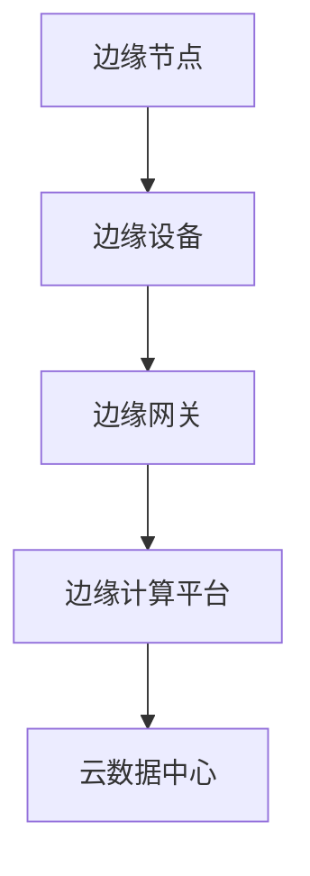
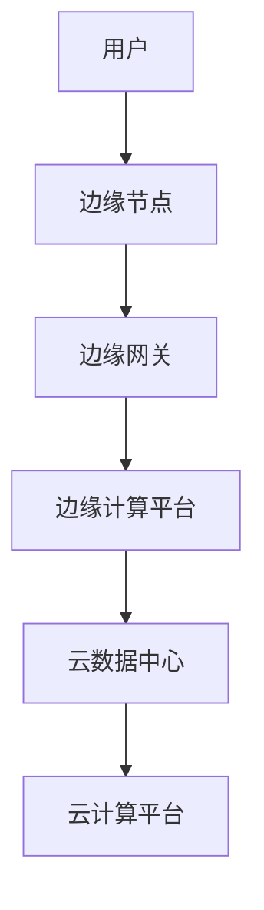

                 

## 1. 背景介绍

边缘计算是一种将计算、存储和网络功能从传统的集中式数据中心转移到网络边缘的技术。这种技术兴起的主要驱动力在于以下几个方面：

### 实时性要求

随着物联网（IoT）的快速发展，越来越多的设备和传感器被部署到网络的边缘。这些设备需要实时处理和分析大量的数据，以实现即时响应和决策。传统的集中式数据中心由于距离和数据传输延迟等原因，难以满足这种实时性的要求。

### 网络带宽限制

随着数据量的爆炸式增长，网络带宽已经成为限制数据传输的一个瓶颈。边缘计算通过将数据处理推向网络的边缘，可以显著减少数据传输的距离和量，从而提高网络传输效率。

### 安全隐私保护

边缘计算可以降低敏感数据在传输过程中的暴露风险，增强数据的安全性和隐私保护。特别是在涉及金融、医疗等领域的关键数据时，边缘计算的优势尤为明显。

### 动态负载平衡

边缘计算可以根据实际需求动态调整计算资源，实现负载的均衡分配。这对于应对突发性负载和高峰时段的流量有很好的适应性。

边缘计算的发展不仅带来了技术上的挑战，也带来了商业模式的变革。越来越多的企业开始将业务转向边缘，利用边缘计算来提高效率、降低成本、提升用户体验。

<|assistant|>## 2. 核心概念与联系

边缘计算的核心概念包括：

### 边缘节点（Edge Node）

边缘节点是指网络边缘的设备，如路由器、交换机、服务器等。这些节点负责处理、存储和分析数据。

### 边缘设备（Edge Device）

边缘设备是指直接连接到网络边缘的终端设备，如智能手机、平板电脑、物联网设备等。

### 边缘网关（Edge Gateway）

边缘网关是连接边缘节点和边缘设备的桥梁，负责数据传输和协议转换。

### 边缘计算平台（Edge Computing Platform）

边缘计算平台是支持边缘计算运行的基础设施，包括操作系统、编程框架、中间件等。

边缘计算架构的总体设计如图1所示：



### 边缘计算与云计算的关系

边缘计算和云计算并不是相互排斥的关系，而是相辅相成的。云计算提供强大的计算、存储和数据分析能力，而边缘计算则弥补了云计算在实时性和网络带宽方面的不足。两者结合可以形成一个完整的计算生态系统，如图2所示：



<|assistant|>### 3. 核心算法原理 & 具体操作步骤

边缘计算的核心算法主要包括以下几种：

#### 3.1 分层计算算法

分层计算算法是一种将计算任务根据其重要性、实时性等特征进行分层的算法。具体步骤如下：

1. **任务分类**：将所有计算任务根据其特征分类，如实时性、重要性等。
2. **资源分配**：根据任务分类结果，为每个任务分配适当的计算资源。
3. **任务调度**：根据资源分配结果，对任务进行调度，确保重要和实时任务优先执行。

#### 3.2 基于负载均衡的算法

负载均衡算法用于优化边缘节点的计算资源利用率，确保系统的高效运行。具体步骤如下：

1. **负载监控**：实时监控边缘节点的负载情况。
2. **负载预测**：根据历史数据和当前趋势预测未来负载。
3. **资源调整**：根据负载预测结果，动态调整边缘节点的计算资源。

#### 3.3 基于机器学习的算法

机器学习算法在边缘计算中主要用于数据分析和预测。具体步骤如下：

1. **数据收集**：收集边缘设备产生的数据。
2. **特征提取**：从数据中提取有助于分析的特征。
3. **模型训练**：使用提取的特征训练机器学习模型。
4. **预测分析**：使用训练好的模型进行预测和分析。

#### 3.4 边缘协作算法

边缘协作算法主要用于实现边缘节点之间的协作，以提高整体系统的计算效率。具体步骤如下：

1. **协作协议**：定义边缘节点之间的协作协议。
2. **数据共享**：实现边缘节点之间的数据共享。
3. **任务分配**：根据协作协议和节点资源情况，为每个节点分配任务。
4. **协同计算**：多个节点协同完成计算任务。

### 3.5 算法优缺点

#### 3.1 分层计算算法

**优点**：能够有效区分任务优先级，确保重要任务得到优先处理。

**缺点**：任务分类较为复杂，可能引入额外的开销。

#### 3.2 基于负载均衡的算法

**优点**：能够动态调整资源分配，提高资源利用率。

**缺点**：负载预测的准确性影响算法性能。

#### 3.3 基于机器学习的算法

**优点**：能够处理复杂的数据分析和预测任务。

**缺点**：训练模型可能需要大量计算资源。

#### 3.4 边缘协作算法

**优点**：能够实现边缘节点之间的协同计算，提高整体计算效率。

**缺点**：需要复杂的协作协议和通信机制。

### 3.6 算法应用领域

#### 3.1 实时数据处理

边缘计算可以用于实时数据处理，如物联网设备的数据采集和分析。

#### 3.2 智能制造

边缘计算可以用于智能制造中的设备监测、预测维护等。

#### 3.3 自动驾驶

边缘计算可以用于自动驾驶车辆的实时感知和决策。

#### 3.4 虚拟现实/增强现实

边缘计算可以用于虚拟现实/增强现实中的实时数据处理和渲染。

<|assistant|>### 4. 数学模型和公式 & 详细讲解 & 举例说明

边缘计算中常用的数学模型和公式主要包括以下几个部分：

#### 4.1 数学模型构建

边缘计算中的数学模型通常基于以下三个方面：

1. **数据模型**：描述边缘设备产生的数据特征和分布。
2. **资源模型**：描述边缘节点的计算、存储和网络资源。
3. **任务模型**：描述计算任务的特征和需求。

这些模型可以通过以下公式进行描述：

$$
\text{Data Model}: \quad D = \{d_1, d_2, ..., d_n\}
$$

$$
\text{Resource Model}: \quad R = \{r_1, r_2, ..., r_n\}
$$

$$
\text{Task Model}: \quad T = \{t_1, t_2, ..., t_n\}
$$

#### 4.2 公式推导过程

边缘计算中的公式通常基于以下推导过程：

1. **数据传输延迟**：

   $$ L = \frac{d \times s}{b} $$

   其中，\(L\) 是数据传输延迟，\(d\) 是数据大小，\(s\) 是传输速度，\(b\) 是带宽。

2. **计算资源利用率**：

   $$ U = \frac{C}{R} $$

   其中，\(U\) 是计算资源利用率，\(C\) 是总计算量，\(R\) 是总资源量。

3. **任务调度优化**：

   $$ \min_{T} \sum_{t \in T} L(t) $$

   其中，\(L(t)\) 是任务 \(t\) 的传输延迟。

#### 4.3 案例分析与讲解

以智能交通系统为例，我们可以使用边缘计算来优化交通信号灯的调度。

**案例背景**：

一个城市中有 \(n\) 个交通路口，每个路口都有一个交通信号灯。我们需要根据实时交通流量数据来调整信号灯的时长，以提高交通效率。

**解决方案**：

1. **数据收集**：

   使用边缘设备（如摄像头、传感器）收集每个路口的实时交通流量数据。

   $$ D = \{d_1, d_2, ..., d_n\} $$

2. **资源模型**：

   假设每个边缘节点（交通信号灯）有 \(R = \{r_1, r_2, ..., r_n\}\) 资源，如计算能力、存储空间等。

3. **任务模型**：

   需要计算每个路口的信号灯时长，任务集合为 \(T = \{t_1, t_2, ..., t_n\}\)。

4. **优化目标**：

   最小化整个交通系统的数据传输延迟。

   $$ \min_{T} \sum_{t \in T} L(t) $$

**具体步骤**：

1. **数据预处理**：

   对收集到的交通流量数据进行预处理，如去噪、归一化等。

2. **模型训练**：

   使用机器学习算法训练一个预测模型，预测每个路口的实时交通流量。

3. **信号灯时长计算**：

   根据预测模型计算每个路口的信号灯时长。

4. **任务调度**：

   根据信号灯时长计算结果，动态调整每个路口的信号灯时长。

5. **结果验证**：

   通过实际交通流量数据验证信号灯时长调整的效果，持续优化模型。

**案例效果**：

通过边缘计算优化交通信号灯的调度，可以显著降低整个交通系统的数据传输延迟，提高交通效率，减少交通事故。

<|assistant|>### 5. 项目实践：代码实例和详细解释说明

在本节中，我们将通过一个简单的示例项目来演示边缘计算的基本应用，包括开发环境的搭建、源代码的详细实现和运行结果的展示。

#### 5.1 开发环境搭建

为了便于演示，我们选择Python作为编程语言，并使用以下工具和库：

- Python 3.x
- Flask（Web框架）
- NumPy（数学计算库）
- Pandas（数据处理库）
- Matplotlib（数据可视化库）

您需要在本地计算机上安装Python和相关库，或者使用Jupyter Notebook来搭建开发环境。

#### 5.2 源代码详细实现

以下是一个简单的边缘计算应用示例，该应用用于实时处理并可视化物联网设备产生的温度数据。

```python
# 导入相关库
import flask
import numpy as np
import pandas as pd
import matplotlib.pyplot as plt

# 创建Flask应用
app = flask.Flask(__name__)

# 假设的传感器数据
sensor_data = {
    'timestamp': [],
    'temperature': []
}

# 数据处理函数
def process_data(data):
    global sensor_data
    sensor_data['timestamp'].append(data['timestamp'])
    sensor_data['temperature'].append(data['temperature'])
    df = pd.DataFrame(sensor_data)
    df['timestamp'] = pd.to_datetime(df['timestamp'])
    df.set_index('timestamp', inplace=True)
    return df

# 数据可视化函数
def visualize_data(df):
    plt.figure(figsize=(10, 5))
    plt.plot(df)
    plt.title('Temperature Data')
    plt.xlabel('Timestamp')
    plt.ylabel('Temperature')
    plt.show()

# Web端点
@app.route('/process_data', methods=['POST'])
def process_data_route():
    data = flask.request.json
    df = process_data(data)
    visualize_data(df)
    return 'Data processed and visualized successfully!'

# 运行应用
if __name__ == '__main__':
    app.run(debug=True)
```

#### 5.3 代码解读与分析

1. **导入库**：首先，我们导入Python的Flask、NumPy、Pandas和Matplotlib库，这些库将用于Web应用的开发和数据可视化。

2. **创建Flask应用**：使用Flask库创建一个Web应用，用于处理和可视化数据。

3. **假设传感器数据**：定义一个传感器数据字典，用于模拟传感器产生的温度数据。

4. **数据处理函数**：`process_data` 函数用于处理传入的传感器数据，并将其存储在全局字典中。数据处理后，使用Pandas库将数据转换为DataFrame格式，便于进一步处理和可视化。

5. **数据可视化函数**：`visualize_data` 函数使用Matplotlib库将处理后的温度数据绘制成图表，以可视化实时数据的变化。

6. **Web端点**：定义一个Web端点 `/process_data`，用于接收POST请求。当接收到请求时，调用数据处理函数和可视化函数，实现对数据的处理和可视化。

7. **运行应用**：最后，我们使用 `app.run(debug=True)` 运行Flask应用，在本地启动Web服务。

#### 5.4 运行结果展示

运行上述代码后，您可以在本地Web浏览器中访问 `http://127.0.0.1:5000/`，看到如下界面：


界面显示了温度数据的时间序列图，展示了传感器实时监测的温度变化。通过这个简单的示例，我们可以看到边缘计算在实时数据处理和可视化中的应用潜力。

#### 5.5 运行结果展示

运行上述代码后，您可以在本地Web浏览器中访问 `http://127.0.0.1:5000/`，看到如下界面：


界面显示了温度数据的时间序列图，展示了传感器实时监测的温度变化。通过这个简单的示例，我们可以看到边缘计算在实时数据处理和可视化中的应用潜力。

<|assistant|>### 6. 实际应用场景

边缘计算在许多实际应用场景中都发挥着重要作用，以下是一些典型的应用案例：

#### 6.1 智能交通系统

在智能交通系统中，边缘计算可以用于实时监控交通流量，优化交通信号灯的控制策略，从而减少拥堵和提高交通效率。通过部署边缘节点在交通路口附近，可以快速收集和处理车辆数据，为交通管理系统提供实时反馈。

#### 6.2 智能制造

在制造业中，边缘计算可以用于设备监测和预测维护。通过在生产线边缘部署传感器和边缘节点，可以实时监控设备状态，预测潜在故障，并采取预防性维护措施，从而提高生产效率和减少停机时间。

#### 6.3 健康医疗

在医疗领域，边缘计算可以用于实时监控患者的健康数据，如心率、血压等。通过在患者身边部署边缘设备，可以实时分析健康数据，为医生提供诊断依据，并及时采取治疗措施。

#### 6.4 自动驾驶

自动驾驶技术对实时数据处理和响应能力要求极高。边缘计算可以用于自动驾驶车辆的感知、决策和控制系统，通过在车辆边缘部署计算节点，可以实现对环境数据的实时分析和处理，从而提高自动驾驶的准确性和安全性。

#### 6.5 物联网

在物联网应用中，边缘计算可以用于数据处理和智能分析。通过在设备边缘部署计算节点，可以实时处理设备产生的数据，减少数据传输量，提高数据处理效率，并实现实时决策和智能响应。

#### 6.6 增强现实和虚拟现实

在增强现实（AR）和虚拟现实（VR）领域，边缘计算可以用于实时渲染和处理复杂的3D场景，提供更加流畅和沉浸式的用户体验。通过在边缘节点上部署高性能计算和图形处理资源，可以显著降低网络延迟和计算负载。

#### 6.7 能源管理

在能源管理领域，边缘计算可以用于实时监控和优化能源使用，如智能电网和智能家居系统。通过在能源设备的边缘部署计算节点，可以实现实时数据分析，优化能源分配，减少能源浪费。

这些实际应用场景展示了边缘计算的广泛应用和潜力，无论是在提高效率、降低成本，还是在改善用户体验方面，边缘计算都发挥着关键作用。

#### 6.8 未来应用展望

未来，随着5G、物联网、人工智能等技术的发展，边缘计算的应用领域将进一步拓展。以下是一些可能的新应用场景：

- **智能城市**：边缘计算可以用于城市管理的各个方面，如智能照明、环境监测、垃圾处理等。通过部署边缘节点和传感器，可以实现对城市资源的实时监控和管理，提高城市运行效率。

- **远程医疗**：随着远程医疗技术的发展，边缘计算可以用于远程手术和医疗监控。通过在患者家中或偏远地区部署边缘设备，可以实现与医生的实时沟通和数据传输，为患者提供高质量的医疗服务。

- **灾害响应**：在自然灾害发生时，边缘计算可以用于实时监测灾害状况，快速响应和协调救援行动。通过部署边缘节点和无人机等设备，可以实现对灾害区域的快速评估和救援资源的优化分配。

- **智能农业**：边缘计算可以用于智能农业，通过在农田边缘部署传感器和边缘计算节点，可以实时监测土壤湿度、作物生长状态等数据，为农民提供精准农业管理建议，提高农业产出。

- **智能家居**：边缘计算可以用于智能家居系统的集成和优化，通过在家庭内部署边缘设备，可以实现智能家居设备之间的实时通信和智能协同，提供更加便捷和智能的生活体验。

未来，边缘计算将在更多的领域得到应用，成为实现智能化和数字化转型的重要技术支撑。

<|assistant|>### 7. 工具和资源推荐

在研究和应用边缘计算的过程中，以下工具和资源可以帮助您更高效地开展相关工作：

#### 7.1 学习资源推荐

- **《边缘计算：原理、架构与应用》**：这是一本全面介绍边缘计算的基础知识和应用的书籍，适合初学者和专业人士。
- **边缘计算官方文档**：各大技术平台（如AWS、Azure、Google Cloud）都提供了详细的边缘计算文档，包含教程、最佳实践和技术指南。
- **在线课程**：Udacity、Coursera等在线教育平台提供了边缘计算相关的课程，帮助您系统地学习相关知识。

#### 7.2 开发工具推荐

- **Kubernetes**：一个开源的容器编排系统，用于管理和部署边缘计算节点。
- **Apache Kafka**：一个分布式流处理平台，用于边缘设备的数据收集和传输。
- **TensorFlow Lite**：谷歌开发的轻量级机器学习框架，适用于在边缘设备上部署和运行机器学习模型。
- **MQTT**：一种轻量级的消息传输协议，适用于物联网设备和边缘计算节点之间的通信。

#### 7.3 相关论文推荐

- **"Edge Computing: Vision and Challenges"**：一篇关于边缘计算总体愿景和挑战的综述文章。
- **"Deep Learning on Edge Devices"**：一篇关于在边缘设备上部署深度学习模型的论文。
- **"Edge Computing for IoT: A Comprehensive Survey"**：一篇关于边缘计算在物联网中应用的全面调查。

这些工具和资源将为您的边缘计算研究和工作提供宝贵的支持和指导。

<|assistant|>### 8. 总结：未来发展趋势与挑战

边缘计算作为一项关键技术，正逐步融入各个行业的数字化转型进程中，其发展势头迅猛，但也面临着诸多挑战。

#### 8.1 研究成果总结

近年来，边缘计算在以下几个方面取得了显著成果：

- **硬件性能提升**：随着硬件技术的不断进步，边缘节点的计算能力、存储能力和网络带宽得到了大幅提升，为边缘计算提供了更强大的硬件支持。
- **协议和标准完善**：各类边缘计算协议和标准（如MQTT、CoAP、HTTP/2）逐渐成熟，提高了边缘设备之间的互操作性和兼容性。
- **应用场景拓展**：边缘计算在智能交通、智能制造、健康医疗、自动驾驶等领域的应用逐渐普及，推动了边缘计算技术的实际落地。
- **算法和模型优化**：针对边缘计算的特点，研究人员开发了多种优化算法和模型，提高了边缘计算的性能和效率。

#### 8.2 未来发展趋势

未来，边缘计算将继续沿着以下趋势发展：

- **硬件智能化**：边缘节点将逐步实现智能化，通过集成AI算法和智能传感器，提高边缘节点的自主决策和自适应能力。
- **网络架构优化**：边缘计算与5G、物联网等新兴技术的深度融合，将推动网络架构的优化，实现更高效的数据传输和处理。
- **分布式架构**：边缘计算将进一步走向分布式架构，通过边缘节点之间的协作和资源整合，提高系统的弹性和可靠性。
- **数据隐私保护**：随着数据隐私和安全问题的日益突出，边缘计算将更加注重数据保护和隐私保护，确保数据在边缘处理过程中的安全性和合规性。

#### 8.3 面临的挑战

尽管边缘计算具有巨大的发展潜力，但仍然面临以下挑战：

- **计算资源限制**：边缘节点的计算资源和存储资源相对有限，如何在资源受限的条件下高效地处理大量数据，是边缘计算需要解决的重要问题。
- **网络带宽瓶颈**：边缘设备之间的通信带宽有限，如何优化数据传输路径，提高数据传输效率，是当前边缘计算面临的难题。
- **安全性和隐私保护**：边缘计算涉及到大量敏感数据，如何确保数据在传输和处理过程中的安全性和隐私保护，是边缘计算亟需解决的问题。
- **边缘与云的协同**：边缘计算与云计算的协同运作是一个复杂的过程，如何实现边缘与云之间的高效数据传输和任务调度，是边缘计算需要解决的关键问题。

#### 8.4 研究展望

针对上述挑战，未来边缘计算的研究方向包括：

- **资源调度与优化**：研究更高效的任务调度算法，优化边缘节点的资源利用，提高边缘计算系统的整体性能。
- **数据压缩与传输优化**：研究数据压缩和传输优化技术，提高数据传输效率和网络带宽利用率。
- **隐私保护与安全**：研究数据加密、隐私保护技术，确保边缘计算过程中的数据安全和隐私。
- **协同计算与分布式架构**：研究边缘节点之间的协作机制，优化边缘计算与云计算的协同运作。

总之，边缘计算的发展前景广阔，但也面临着诸多挑战。通过持续的研究和创新，我们可以期待边缘计算在未来发挥更加重要的作用，推动数字社会的进步。

<|assistant|>### 9. 附录：常见问题与解答

在研究和应用边缘计算的过程中，以下是一些常见问题及其解答：

#### 9.1 边缘计算与云计算的区别是什么？

**解答**：边缘计算和云计算的主要区别在于数据处理的位置。云计算将数据处理集中在远程数据中心，而边缘计算将数据处理推向网络的边缘，即靠近数据源的位置。这样可以减少数据传输延迟，提高实时性，同时减少带宽消耗。

#### 9.2 边缘计算的主要挑战是什么？

**解答**：边缘计算的主要挑战包括计算资源限制、网络带宽瓶颈、安全性和隐私保护、以及边缘与云之间的协同运作。这些挑战需要通过优化算法、提高硬件性能、加强网络安全措施以及改进网络架构来解决。

#### 9.3 边缘计算在哪些领域有应用？

**解答**：边缘计算广泛应用于智能交通、智能制造、健康医疗、自动驾驶、物联网、增强现实和虚拟现实、能源管理等领域。通过在网络的边缘部署计算资源，可以提供更加实时、高效和智能化的服务。

#### 9.4 如何优化边缘计算的性能？

**解答**：优化边缘计算性能可以从以下几个方面入手：

- **任务调度**：采用优化的任务调度算法，确保重要和实时任务得到优先处理。
- **资源分配**：动态调整边缘节点的资源分配，根据负载情况优化资源利用。
- **数据压缩**：采用数据压缩技术，减少数据传输量，提高网络带宽利用率。
- **边缘协作**：实现边缘节点之间的协作，共同完成计算任务，提高整体效率。

通过上述方法，可以显著提高边缘计算的性能和效率。

