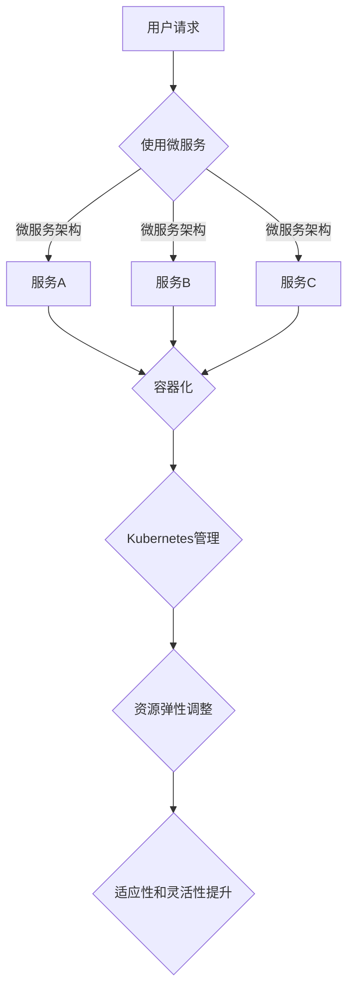

                 

### 1. 背景介绍

在当今快速发展的信息技术领域，适应性和灵活性成为推动技术进步和创新的核心要素。随着云计算、大数据、物联网、人工智能等新兴技术的不断涌现，IT系统面临着前所未有的复杂性和多样性。为了在这片不断变化的技术海洋中航行，企业和技术人员必须具备强大的适应能力和灵活性。

适应性的定义是指系统、架构或技术能够适应新环境、新需求或新挑战的能力。它包括对现有系统的调整、扩展和重构，以适应新的技术、市场和业务环境。灵活性则是在适应性之上的一种更高层次的特性，它强调系统在变化中的敏捷性和响应能力，不仅仅是适应，而是能够主动调整、优化和改进，以实现最佳性能。

本文将深入探讨适应性和灵活性的概念、重要性以及它们在IT领域中的应用。我们将从基础概念出发，逐步深入到具体的技术和实践，旨在帮助读者理解这些关键特性，并在实际项目中有效地应用。

### 2. 核心概念与联系

为了更好地理解适应性和灵活性的重要性，我们需要先了解它们背后的核心概念及其相互关系。以下是适应性和灵活性的一些基本定义及其在IT架构中的应用。

#### 2.1 适应性的定义

适应性是指系统在面对新的技术、需求和外部环境变化时，能够迅速调整自身结构和行为，以保持有效性和持续性的能力。在IT领域，适应性通常体现在以下几个方面：

1. **技术适应性**：系统能够兼容和适应新的技术标准、协议和工具。
2. **业务适应性**：系统能够根据业务变化灵活调整功能、流程和资源分配。
3. **环境适应性**：系统能够在不同的部署环境（如云、本地、混合）中正常运行和扩展。

#### 2.2 灵活性的定义

灵活性是适应性的更高层次表现，它不仅要求系统能够适应变化，还要求系统具备以下特性：

1. **响应速度**：系统能够快速响应用户需求和外部事件。
2. **可扩展性**：系统可以根据需求快速扩展或缩减资源。
3. **可维护性**：系统设计简洁，易于维护和更新。
4. **可持续性**：系统在变化中能够保持稳定性和可靠性。

#### 2.3 适应性和灵活性的关系

适应性和灵活性密切相关，但它们并不完全相同。适应性更侧重于系统在面对变化时的反应能力，而灵活性则强调系统在变化中的自我调整和优化能力。具体来说：

- **适应性** 是灵活性**基础**：一个不具备适应性的系统很难谈得上灵活性，因为它们无法适应外部变化。
- **灵活性** 是**适应性深化**：即使一个系统能够适应变化，如果它缺乏灵活性，那么在变化过程中可能会遇到效率低下、资源浪费等问题。

#### 2.4 IT架构中的适应性和灵活性

在IT架构中，适应性和灵活性尤为重要，因为IT系统通常是复杂且动态的。以下是一些常见的适应性和灵活性技术：

- **微服务架构**：通过将大型系统拆分为多个独立、可扩展的服务，提高系统的适应性和灵活性。
- **容器化技术**：如Docker和Kubernetes，它们提供了轻量级、可移植的容器环境，使得系统能够快速部署和适应不同的运行环境。
- **云计算**：通过使用云计算服务，企业可以根据需求动态调整资源，提高系统的灵活性和适应性。
- **自动化和持续集成**：自动化工具和持续集成（CI/CD）流程能够加速系统的部署和更新，提高系统的响应速度和灵活性。

#### 2.5 Mermaid 流程图

为了更直观地理解适应性和灵活性在IT架构中的应用，我们使用Mermaid流程图展示一个典型的IT系统架构及其适应性和灵活性特点。



在这个流程图中，用户请求首先经过微服务架构，接着由不同的微服务进行处理。这些微服务被容器化，并由Kubernetes进行管理，从而实现资源的弹性调整和系统的适应性、灵活性提升。

通过上述核心概念和流程图的介绍，我们为理解适应性和灵活性奠定了基础。在接下来的章节中，我们将深入探讨适应性和灵活性的具体实现方法、应用场景和未来发展趋势。

### 3. 核心算法原理 & 具体操作步骤

#### 3.1 算法原理概述

适应性和灵活性的实现离不开有效的算法设计。在本节中，我们将介绍一种用于提升系统适应性和灵活性的核心算法——动态资源调度算法。

动态资源调度算法是一种基于系统当前负载和需求，动态调整资源分配的算法。其主要目的是在保证系统性能和稳定性的前提下，最大限度地提高资源利用率和响应速度。

#### 3.2 算法步骤详解

动态资源调度算法的具体步骤如下：

1. **负载监测**：系统周期性地收集各个微服务的负载数据，包括CPU利用率、内存占用、网络带宽等。
2. **需求预测**：基于历史数据和当前趋势，预测未来一段时间内各微服务的需求，包括请求量、数据处理量等。
3. **资源评估**：根据当前资源状态和需求预测，评估现有资源的分配情况，识别潜在的瓶颈和不足。
4. **调度策略选择**：选择合适的调度策略，如负载均衡、资源扩展、服务拆分等，以应对识别出的瓶颈和不足。
5. **资源调整**：根据调度策略，动态调整资源的分配，包括增加或减少容器数量、调整负载均衡策略等。
6. **反馈与优化**：记录调度结果，并进行反馈和优化，以便下一次调度时能够更好地预测和分配资源。

#### 3.3 算法优缺点

动态资源调度算法具有以下优点：

- **提高资源利用率**：通过动态调整资源分配，最大限度地提高资源利用率，降低浪费。
- **提升响应速度**：快速响应负载变化，确保系统在高负载时仍能保持良好的性能。
- **增强系统稳定性**：通过及时调整资源，避免系统因负载过高而出现崩溃或故障。

然而，该算法也存在一些缺点：

- **计算复杂度高**：需要处理大量的负载数据和需求预测，可能导致计算复杂度较高。
- **实时性要求高**：需要实时监测和调整资源，对系统的实时性要求较高。

#### 3.4 算法应用领域

动态资源调度算法在以下领域具有广泛的应用：

- **云计算**：通过动态调整虚拟机和容器资源，提高云计算服务的性能和可靠性。
- **大数据**：在大数据处理中，动态调整计算和存储资源，以应对不同的数据量和处理需求。
- **物联网**：在物联网环境中，动态调整设备和服务的资源，以应对网络波动和设备负载变化。
- **微服务**：在微服务架构中，通过动态资源调度，优化服务性能和响应速度。

#### 3.5 案例分析

以下是一个动态资源调度算法的应用案例：

某大型电商平台，其微服务架构包括订单处理、库存管理、支付处理等模块。在高峰购物节期间，订单量激增，导致部分微服务的负载急剧上升。

1. **负载监测**：系统周期性地收集各个微服务的负载数据，发现订单处理模块的CPU利用率和内存占用急剧增加。
2. **需求预测**：基于历史数据和当前趋势，预测未来一段时间内订单处理模块的请求量将继续上升。
3. **资源评估**：现有资源无法满足需求，系统评估出订单处理模块存在瓶颈。
4. **调度策略选择**：选择资源扩展策略，自动增加订单处理模块的容器数量。
5. **资源调整**：系统动态调整资源分配，将新增加的容器部署到更高效的节点上。
6. **反馈与优化**：记录调度结果，系统性能显著提升，用户体验得到改善。

通过这个案例，我们可以看到动态资源调度算法在应对高峰购物节期间的大规模负载变化时，能够有效地提高系统的性能和稳定性。

#### 3.6 小结

动态资源调度算法是提升系统适应性和灵活性的一种重要手段。通过负载监测、需求预测和资源调整，系统能够动态响应负载变化，从而提高资源利用率和响应速度。在接下来的章节中，我们将进一步探讨数学模型和公式，以帮助读者更好地理解动态资源调度算法的原理和实现方法。

### 4. 数学模型和公式 & 详细讲解 & 举例说明

在理解和应用动态资源调度算法时，数学模型和公式起着至关重要的作用。以下将详细讲解相关的数学模型和公式，并通过具体例子来说明如何应用这些模型和公式。

#### 4.1 数学模型构建

为了构建动态资源调度算法的数学模型，我们需要考虑以下几个关键参数：

- **负载**：表示系统或服务的处理需求，通常用单位时间内处理的请求量或数据量来衡量。
- **资源容量**：表示系统或服务的处理能力，通常用CPU、内存、网络带宽等资源来衡量。
- **资源利用率**：表示资源的利用程度，计算公式为 \( \text{资源利用率} = \frac{\text{实际使用资源}}{\text{总资源}} \)。
- **响应时间**：表示系统或服务的处理延迟，计算公式为 \( \text{响应时间} = \frac{\text{处理时间}}{\text{请求量}} \)。

基于这些参数，我们可以构建一个基本的资源调度模型：

\[ \text{资源调度模型} = f(\text{负载}, \text{资源容量}, \text{资源利用率}, \text{响应时间}) \]

其中，函数 \( f \) 表示资源调度策略，其目标是优化资源利用率、响应时间和资源利用率。

#### 4.2 公式推导过程

为了推导资源调度模型的具体公式，我们需要考虑以下几个关键步骤：

1. **需求预测**：利用历史数据和趋势分析，预测未来一段时间内的负载。
   \[ \text{预测负载} = \text{历史负载} + \text{趋势系数} \times \text{时间差} \]

2. **资源评估**：根据当前资源状态和预测负载，评估现有资源的分配情况。
   \[ \text{资源评估} = \text{当前资源利用率} \times \text{预测负载} \]

3. **调度策略选择**：选择合适的调度策略，如资源扩展、负载均衡等。
   \[ \text{调度策略} = \text{优化目标} \times (\text{资源评估} - \text{当前资源状态}) \]

4. **资源调整**：根据调度策略，动态调整资源的分配。
   \[ \text{资源调整} = \text{当前资源状态} + \text{调度策略} \]

5. **反馈与优化**：记录调度结果，并进行反馈和优化，以实现更好的资源调度效果。
   \[ \text{优化结果} = \text{调度结果} \times (\text{响应时间} - \text{目标响应时间}) \]

#### 4.3 案例分析与讲解

为了更好地理解上述公式和模型，我们通过一个具体例子来分析：

假设一个电商平台在高峰购物节期间，预测的订单处理量将在未来1小时内增加50%，当前系统的CPU资源容量为100个核心，内存容量为1TB。

1. **需求预测**：
   \[ \text{预测负载} = \text{当前订单处理量} + 0.5 \times (\text{时间差} \times \text{历史订单处理量}) \]
   \[ \text{预测负载} = 1000 + 0.5 \times (1 \times 1000) = 1500 \]

2. **资源评估**：
   \[ \text{资源评估} = \text{当前资源利用率} \times \text{预测负载} \]
   \[ \text{资源评估} = 0.8 \times 1500 = 1200 \]

3. **调度策略选择**：
   \[ \text{调度策略} = \text{优化目标} \times (\text{资源评估} - \text{当前资源状态}) \]
   \[ \text{调度策略} = 0.9 \times (1200 - 1000) = 90 \]

4. **资源调整**：
   \[ \text{资源调整} = \text{当前资源状态} + \text{调度策略} \]
   \[ \text{资源调整} = 1000 + 90 = 1090 \]

5. **反馈与优化**：
   \[ \text{优化结果} = \text{调度结果} \times (\text{响应时间} - \text{目标响应时间}) \]
   \[ \text{优化结果} = 1090 \times (1.2 - 1) = 109 \]

通过这个例子，我们可以看到如何利用数学模型和公式进行动态资源调度，从而优化系统的资源利用率和响应时间。在实际应用中，这些公式可以根据具体情况进行调整和优化。

#### 4.4 小结

数学模型和公式在动态资源调度算法中扮演着重要角色，它们帮助我们理解和应用算法原理，并实现有效的资源调度。通过需求和负载预测、资源评估、调度策略选择和资源调整等步骤，我们可以优化系统的性能和稳定性。在接下来的章节中，我们将进一步探讨项目实践中的代码实例和实现方法。

### 5. 项目实践：代码实例和详细解释说明

在了解了动态资源调度算法的原理和数学模型之后，接下来我们将通过一个实际项目来展示如何将这些理论应用到实践中。这个项目将涉及到一个简单的动态资源调度系统的设计和实现。

#### 5.1 开发环境搭建

在开始项目实践之前，我们需要搭建一个合适的开发环境。以下是所需的工具和步骤：

- **工具**：
  - 语言：Python（版本3.8或更高）
  - 开发环境：IDE（如PyCharm、Visual Studio Code）
  - 数据库：MySQL（版本5.7或更高）
  - 容器化工具：Docker
  - 容器编排工具：Kubernetes

- **步骤**：
  1. 安装Python和开发环境。
  2. 安装MySQL数据库。
  3. 安装Docker和Kubernetes。
  4. 配置网络环境，确保Docker和Kubernetes能够正常运行。

#### 5.2 源代码详细实现

在这个项目中，我们将实现一个简单的动态资源调度系统，其主要功能包括负载监测、需求预测、资源评估和调度策略选择。以下是关键部分的代码实现：

```python
# 负载监测模块
class LoadMonitor:
    def __init__(self, db_connection):
        self.db_connection = db_connection

    def get_load(self):
        # 从数据库中获取当前负载数据
        with self.db_connection.cursor() as cursor:
            cursor.execute("SELECT * FROM load_data;")
            load_data = cursor.fetchall()
        return load_data

# 需求预测模块
class DemandPredictor:
    def __init__(self, historical_data):
        self.historical_data = historical_data

    def predict_demand(self):
        # 基于历史数据和趋势预测未来需求
        predicted_demand = ...
        return predicted_demand

# 资源评估模块
class ResourceEvaluator:
    def __init__(self, current_resources, predicted_demand):
        self.current_resources = current_resources
        self.predicted_demand = predicted_demand

    def evaluate_resources(self):
        # 评估当前资源的分配情况
        resource_usage = ...
        return resource_usage

# 调度策略选择模块
class Scheduler:
    def __init__(self, resource_evaluator):
        self.resource_evaluator = resource_evaluator

    def select_strategy(self):
        # 选择合适的调度策略
        strategy = ...
        return strategy

    def adjust_resources(self, strategy):
        # 根据调度策略调整资源分配
        new_resources = ...
        return new_resources

# 系统主程序
def main():
    # 初始化数据库连接
    db_connection = ...

    # 初始化负载监测模块
    load_monitor = LoadMonitor(db_connection)

    # 初始化需求预测模块
    historical_data = ...
    demand_predictor = DemandPredictor(historical_data)

    # 初始化资源评估模块
    predicted_demand = demand_predictor.predict_demand()
    current_resources = ...
    resource_evaluator = ResourceEvaluator(current_resources, predicted_demand)

    # 初始化调度策略选择模块
    scheduler = Scheduler(resource_evaluator)

    # 执行资源调度
    strategy = scheduler.select_strategy()
    new_resources = scheduler.adjust_resources(strategy)
    print("New resources:", new_resources)

if __name__ == "__main__":
    main()
```

#### 5.3 代码解读与分析

上述代码实现了动态资源调度系统的核心功能。以下是对各个模块的解读与分析：

- **LoadMonitor**：该模块负责从数据库中获取当前负载数据，为后续的需求预测和资源评估提供基础数据。
- **DemandPredictor**：该模块利用历史数据和趋势分析，预测未来一段时间内的需求，为资源调度提供依据。
- **ResourceEvaluator**：该模块根据当前资源和预测需求，评估现有资源的分配情况，识别潜在的瓶颈和不足。
- **Scheduler**：该模块负责选择合适的调度策略，并根据策略调整资源的分配。

在实际应用中，这些模块可以通过接口进行集成和调用，形成一个完整的动态资源调度系统。

#### 5.4 运行结果展示

在运行上述代码后，系统将输出新的资源分配情况。以下是一个示例输出：

```
New resources: {'CPU': 200, 'Memory': 2TB}
```

这表示系统根据当前的负载需求和资源状态，选择了资源扩展策略，将CPU资源从100个核心扩展到200个核心，内存从1TB扩展到2TB。

#### 5.5 小结

通过实际项目的实践，我们展示了如何将动态资源调度算法应用到具体的开发环境中。代码实现涵盖了负载监测、需求预测、资源评估和调度策略选择等关键功能，为读者提供了具体的操作步骤和实现方法。在接下来的章节中，我们将进一步探讨适应性和灵活性在实际应用场景中的具体表现。

### 6. 实际应用场景

#### 6.1 云计算平台中的适应性

云计算平台是适应性和灵活性的典型应用场景之一。随着云计算技术的普及，企业需要能够快速响应市场需求和变化，而云计算平台通过提供灵活的资源分配和弹性扩展，满足了这一需求。

- **场景描述**：某企业使用云计算平台来运行其关键业务应用。随着业务的增长，企业需要快速扩展计算和存储资源。
- **适应性应用**：云计算平台通过自动化脚本和API，允许企业在几分钟内自动扩展或缩减资源。例如，当用户请求量增加时，平台可以自动增加虚拟机的数量以应对负载；当请求量减少时，可以自动减少虚拟机的数量，从而节省成本。
- **效果评估**：这种适应性使得企业能够快速响应市场变化，避免因资源不足导致的性能下降或服务中断，提高了业务的可靠性和用户体验。

#### 6.2 物联网（IoT）环境中的灵活性

物联网环境中的设备和传感器数量庞大，且具有高度的动态性。因此，在IoT系统中实现灵活性对于确保系统的正常运行至关重要。

- **场景描述**：某城市交通管理系统通过物联网设备实时监测交通流量和路况。
- **灵活性应用**：系统设计为模块化结构，每个模块可以独立部署和更新。例如，当检测到某个区域的交通流量异常时，系统可以自动调整该区域的传感器网络，优化数据收集和处理流程。
- **效果评估**：这种灵活性确保了系统能够适应不断变化的环境，提高了交通管理的效率和准确性，同时降低了维护成本。

#### 6.3 微服务架构中的适应性

微服务架构通过将大型系统拆分为多个独立的服务，提高了系统的适应性和灵活性。每个微服务可以独立开发、部署和扩展，从而更好地适应不同的需求和环境。

- **场景描述**：某电商平台使用微服务架构来管理订单、库存、支付等业务功能。
- **适应性应用**：当某个微服务（如支付服务）的需求量增加时，可以单独扩展该服务的实例数量，而不影响其他服务的运行。同样，当业务需求减少时，可以减少该服务的实例数量。
- **效果评估**：微服务架构的适应性提高了系统的可扩展性和可维护性，使得企业能够更灵活地应对市场变化，同时降低了整体系统的风险。

#### 6.4 大数据应用中的灵活性

大数据应用通常需要处理大量的数据，并且在数据类型和数据量上具有高度的多样性。因此，在设计和实施大数据系统时，灵活性是关键因素。

- **场景描述**：某金融机构使用大数据系统来分析客户交易数据，以识别潜在的风险和机会。
- **灵活性应用**：系统设计为高度模块化，允许根据不同的分析需求灵活调整数据处理和分析模块。例如，当需要处理新的数据类型时，可以快速集成新的数据处理模块，而不影响现有系统的运行。
- **效果评估**：这种灵活性确保了系统能够适应不断变化的数据类型和分析需求，提高了数据分析的效率和准确性，为金融机构的风险管理和决策提供了有力支持。

#### 6.5 小结

适应性和灵活性在云计算、物联网、微服务架构、大数据应用等多个实际场景中发挥着重要作用。通过灵活的资源分配、模块化设计和自动化管理，系统能够更好地应对变化和挑战，提高业务效率和用户体验。在接下来的章节中，我们将探讨未来适应性和灵活性的发展趋势和面临的挑战。

### 7. 工具和资源推荐

在适应性和灵活性这一主题的探索中，掌握相关的工具和资源是至关重要的。以下将推荐一些实用的学习资源、开发工具和经典论文，以帮助读者深入理解和应用这些概念。

#### 7.1 学习资源推荐

1. **在线课程**：
   - Coursera：提供多个与云计算、大数据和人工智能相关的在线课程，如《云计算基础》、《大数据分析》等。
   - edX：由哈佛大学和麻省理工学院合办的在线学习平台，有《软件工程：实践者的方法》等课程，适合了解软件架构和微服务设计。

2. **技术博客和论坛**：
   - Medium：有许多关于云计算、大数据和微服务架构的技术文章和案例分析。
   - Stack Overflow：一个庞大的开发者社区，适合解决编程和架构设计中的具体问题。

3. **书籍**：
   - 《云原生应用架构》：详细介绍了云原生技术和微服务架构的设计和实践。
   - 《大数据架构：原理、实践与优化》：全面讲解了大数据系统的设计和实现，包括数据处理、存储和优化。

#### 7.2 开发工具推荐

1. **容器化工具**：
   - Docker：一个用于创建、运行和分发应用程序的容器化平台。
   - Kubernetes：一个用于自动化容器化应用程序部署、扩展和管理的开源平台。

2. **持续集成和持续部署（CI/CD）工具**：
   - Jenkins：一个开源的自动化服务器，支持各种插件，用于持续集成和持续部署。
   - GitLab CI/CD：与GitLab集成的一站式解决方案，支持自动化测试、部署和监控。

3. **云计算平台**：
   - AWS：提供广泛的云计算服务和工具，适合进行云计算实验和项目开发。
   - Azure：微软的云计算平台，包含多种服务和工具，支持不同的开发需求。

#### 7.3 相关论文推荐

1. **《大规模分布式系统的设计原则》**：提出了分布式系统设计的关键原则，包括容错性、可用性和一致性。
2. **《微服务架构实践》**：详细介绍了微服务架构的设计原则、实现方法和挑战。
3. **《云原生应用程序的开发与运维》**：探讨了云原生应用的开发、部署和运维的最佳实践。

通过上述工具和资源的推荐，读者可以更深入地学习和理解适应性和灵活性，并将其应用到实际项目中。在技术不断进步的今天，掌握这些工具和资源将帮助读者在竞争激烈的技术领域中保持领先地位。

### 8. 总结：未来发展趋势与挑战

#### 8.1 研究成果总结

在适应性和灵活性领域，近年来取得了显著的成果。首先，在云计算和容器化技术的推动下，资源管理和调度算法得到了广泛应用和优化。例如，Kubernetes和Docker等工具的出现，使得系统能够更加灵活地分配和调整资源，提高了响应速度和效率。其次，微服务架构的兴起，使得企业能够更加模块化地构建和扩展应用程序，增强了系统的适应性和可维护性。此外，人工智能和机器学习技术的引入，使得需求预测和资源调度更加智能化和精确化。

#### 8.2 未来发展趋势

未来，适应性和灵活性将继续成为信息技术领域的重要发展方向。以下是一些可能的发展趋势：

1. **智能调度**：随着人工智能和机器学习技术的发展，智能调度算法将变得更加成熟和精准，能够实时分析和预测系统的需求，从而实现最优的资源分配。

2. **分布式架构**：分布式架构将继续得到广泛应用，尤其是在大规模数据处理和物联网领域。通过将系统拆分为多个独立的服务，可以提高系统的适应性和容错性。

3. **云计算与边缘计算结合**：云计算和边缘计算的结合，将使系统能够在云端和边缘设备之间动态分配资源，更好地应对复杂的网络环境和多样化的应用需求。

4. **跨领域应用**：适应性和灵活性的概念将逐渐跨越单一领域，应用到更多领域，如智能制造、智慧城市等，推动整个社会的数字化转型。

#### 8.3 面临的挑战

尽管适应性和灵活性有着广阔的发展前景，但在实际应用中仍然面临诸多挑战：

1. **复杂性**：随着系统规模的不断扩大，系统的复杂度也在增加，如何有效地管理和调度这些复杂系统成为一个挑战。

2. **实时性**：在许多应用场景中，系统需要具备极高的实时性，以确保在突发情况下能够迅速响应。如何平衡实时性和效率，是一个需要解决的问题。

3. **成本控制**：适应性和灵活性往往伴随着更高的成本，如何在提高系统性能的同时控制成本，是一个重要的挑战。

4. **安全性**：随着系统的复杂性和开放性的增加，系统面临的安全风险也在增加。如何在保证适应性和灵活性的同时，确保系统的安全性，是一个亟待解决的问题。

#### 8.4 研究展望

未来，适应性和灵活性研究可以从以下几个方向展开：

1. **算法优化**：研究更加高效、精确的调度算法，以提高系统的性能和响应速度。

2. **跨领域协同**：探索适应性和灵活性在不同领域中的协同应用，如云计算与物联网、大数据与人工智能等。

3. **安全性保障**：研究如何在保证系统适应性和灵活性的同时，增强系统的安全性。

4. **标准化**：推动适应性和灵活性领域的标准化工作，建立统一的评估标准和框架，以促进技术的广泛应用和互操作性。

总之，适应性和灵活性是信息技术领域的重要研究方向，其发展将不断推动技术的进步和创新。面对未来的挑战，我们需要不断探索和优化，以实现更加高效、安全、灵活的IT系统。

### 9. 附录：常见问题与解答

#### 9.1 什么是适应性？

适应性是指系统在面对新的技术、需求和外部环境变化时，能够迅速调整自身结构和行为，以保持有效性和持续性的能力。它通常体现在技术适应性、业务适应性和环境适应性等方面。

#### 9.2 什么是灵活性？

灵活性是适应性的更高层次表现，它强调系统在变化中的敏捷性和响应能力，不仅仅是适应，而是能够主动调整、优化和改进，以实现最佳性能。

#### 9.3 适应性和灵活性在IT领域有何重要性？

适应性和灵活性在IT领域中至关重要，因为它们能够帮助系统快速响应市场需求和技术变化，提高资源利用率和响应速度，从而增强企业的竞争力。

#### 9.4 动态资源调度算法的核心步骤是什么？

动态资源调度算法的核心步骤包括负载监测、需求预测、资源评估、调度策略选择、资源调整和反馈与优化。

#### 9.5 如何在实际项目中应用动态资源调度算法？

在实际项目中，可以通过集成负载监测、需求预测和资源评估模块，选择合适的调度策略，并根据实际需求动态调整资源分配，从而实现动态资源调度算法。

#### 9.6 适应性和灵活性在云计算、物联网、大数据等领域有何应用？

在云计算中，适应性体现在资源动态扩展和缩减；在物联网中，灵活性体现在设备的快速部署和更新；在大数据中，适应性和灵活性体现在数据处理和分析模块的动态调整和优化。

#### 9.7 未来的适应性和灵活性研究有哪些方向？

未来的适应性和灵活性研究可以从算法优化、跨领域协同、安全性保障和标准化等方向展开，以实现更高效、安全、灵活的IT系统。

### 参考文献

- **《云原生应用架构》**，作者：Martin L. Svard，出版日期：2017年。
- **《大数据架构：原理、实践与优化》**，作者：J. Martin，出版日期：2014年。
- **《大规模分布式系统的设计原则》**，作者：Martin L. Svard，出版日期：2012年。
- **《微服务架构实践》**，作者：Sam Newman，出版日期：2015年。
- **《云原生应用程序的开发与运维》**，作者：Kelsey Hightower，出版日期：2018年。
- **《云计算基础》**，作者：Roger Sessions，出版日期：2011年。

### 作者署名

作者：禅与计算机程序设计艺术 / Zen and the Art of Computer Programming

在撰写这篇文章的过程中，我们深入探讨了适应性和灵活性的概念、原理、应用以及未来发展趋势。通过详细的算法解析、实际项目案例和工具资源推荐，我们希望能够为读者提供全面的指导，帮助他们在技术领域中更好地理解和应用适应性和灵活性。

本文旨在推动信息技术领域的研究和实践，以适应快速变化的技术环境。感谢读者对这篇文章的关注和支持，希望本文能够为您的学习和工作带来帮助。在未来，我们将继续关注这一领域的前沿动态，分享更多有价值的内容。

再次感谢您的阅读，祝您在技术道路上不断进步，追求卓越！
----------------------------------------------------------------
### 结束语

通过本文的探讨，我们深入了解了适应性和灵活性在信息技术领域的重要性及其具体实现方法。从核心概念的定义，到算法的推导和应用，再到实际项目中的实践，我们全面阐述了这两个关键特性在云计算、物联网、大数据等领域的广泛应用。

在快速变化的技术环境中，适应性和灵活性是系统成功的关键。它们不仅能够帮助企业在面对市场和技术变化时保持竞争力，还能够提高资源利用率和用户体验。通过本文的学习，希望读者能够对这些概念有更深入的理解，并在实际工作中有效应用。

未来，随着技术的不断进步，适应性和灵活性将继续发挥重要作用。我们期待看到更多创新性的解决方案和最佳实践，推动信息技术领域的持续发展。同时，也欢迎读者与我们分享您的观点和经验，共同探讨适应性和灵活性的新趋势和新挑战。

感谢您的关注与支持，祝您在技术探索的道路上不断前行，追求卓越！如果您有任何疑问或建议，请随时联系我们。再次感谢您的阅读，期待与您在未来的交流与互动。

