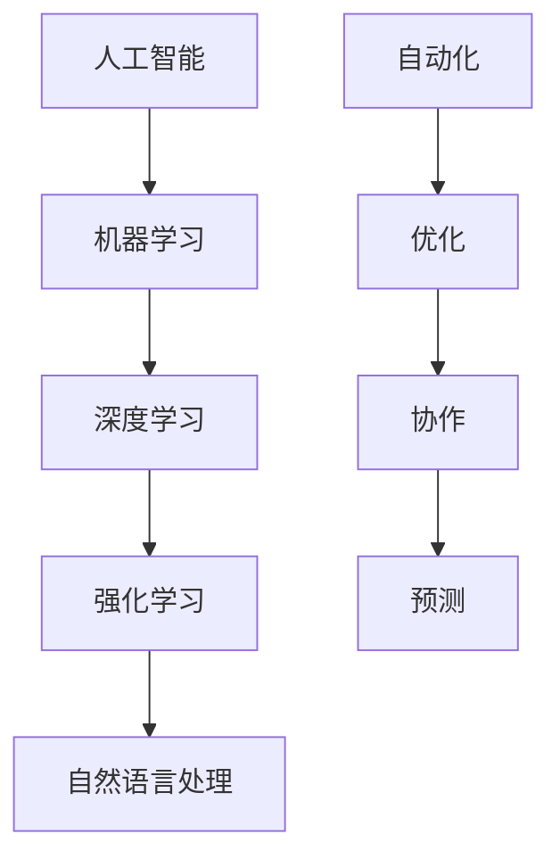

                 

关键词：人工智能，创业方向，生产力工具，创新应用，技术趋势

> 摘要：本文将探讨人工智能（AI）技术在创业方向上的巨大潜力，尤其是其在提升生产力工具方面的应用。我们将分析AI的核心概念、算法原理、数学模型，并通过实际项目实例进行深入讲解。同时，我们将展望AI技术在未来应用中的发展趋势和面临的挑战。

## 1. 背景介绍

随着科技的不断进步，人工智能技术已经深入到我们生活的方方面面。AI不仅改变了传统的商业模式，还极大地提升了生产力工具的效率。从自动驾驶汽车到智能医疗诊断，从智能家居到自动化生产线，AI技术的应用正在改变我们的工作方式和生活方式。

创业者在选择创业方向时，需要紧跟技术发展的潮流，尤其是AI技术所带来的变革。本文将探讨AI技术如何成为创业者的新机遇，特别是在提升生产力工具方面的应用。

### 1.1 AI技术的发展历程

AI技术的发展可以追溯到20世纪50年代，当时图灵提出了著名的“图灵测试”。自那时以来，AI经历了几个重要的发展阶段：

- **50-70年代：早期探索**：这个阶段主要关注符号主义和知识表示。

- **80-90年代：专家系统时代**：专家系统成为AI研究的热点，但受到知识获取困难和问题复杂性的限制。

- **21世纪：深度学习和大数据时代**：随着计算能力的提升和大数据的涌现，深度学习取得了突破性进展。

### 1.2 生产力工具的演变

生产力工具是指用于提高工作效率的工具或系统。从最早的机械工具到现代的计算机软件，生产力工具的演变经历了几个阶段：

- **手工工具时代**：人类使用手工工具来提高生产效率。

- **机械工具时代**：机械化生产取代了手工劳动。

- **电子化时代**：计算机的出现使得数据处理和自动化成为可能。

- **智能化时代**：随着AI技术的发展，智能化工具能够自我学习和优化，从而进一步提升生产力。

## 2. 核心概念与联系

### 2.1 AI的核心概念

AI的核心概念包括：

- **机器学习**：通过数据训练模型，使机器能够从经验中学习。

- **深度学习**：一种基于人工神经网络的机器学习方法。

- **强化学习**：通过奖励机制训练模型，使其在特定环境中做出最优决策。

- **自然语言处理**：使机器能够理解和生成人类语言。

### 2.2 生产力工具的核心概念

生产力工具的核心概念包括：

- **自动化**：通过软件自动化重复性任务。

- **优化**：通过算法优化资源利用和流程。

- **协作**：通过协作工具提高团队工作效率。

- **预测**：通过数据分析预测未来趋势和需求。

### 2.3 Mermaid 流程图



## 3. 核心算法原理 & 具体操作步骤

### 3.1 算法原理概述

AI算法的基本原理是通过训练数据集，使模型能够对未知数据进行预测或分类。深度学习是AI中的一个重要分支，它通过多层神经网络模拟人脑的学习过程。

### 3.2 算法步骤详解

1. **数据收集与预处理**：收集相关数据，并进行清洗、归一化等预处理操作。

2. **模型选择**：根据任务需求选择合适的模型架构。

3. **模型训练**：使用训练数据集对模型进行训练，调整模型参数。

4. **模型评估**：使用验证数据集评估模型性能。

5. **模型部署**：将训练好的模型部署到生产环境中。

### 3.3 算法优缺点

- **优点**：能够处理大量数据，发现复杂模式，实现自动化。

- **缺点**：需要大量数据，训练过程耗时长，对计算资源要求高。

### 3.4 算法应用领域

- **图像识别**：用于自动识别和分类图像。

- **自然语言处理**：用于机器翻译、文本摘要、情感分析等。

- **推荐系统**：用于个性化推荐商品、内容等。

## 4. 数学模型和公式 & 详细讲解 & 举例说明

### 4.1 数学模型构建

AI算法的核心是数学模型，以下是一个简单的线性回归模型：

$$
y = wx + b
$$

其中，$w$ 是权重，$x$ 是输入特征，$b$ 是偏置。

### 4.2 公式推导过程

线性回归模型的推导过程如下：

1. **损失函数**：

$$
J(w, b) = \frac{1}{2m} \sum_{i=1}^{m} (y_i - wx_i - b)^2
$$

2. **梯度下降**：

$$
w = w - \alpha \frac{\partial J}{\partial w}
$$

$$
b = b - \alpha \frac{\partial J}{\partial b}
$$

其中，$\alpha$ 是学习率。

### 4.3 案例分析与讲解

假设我们有一个房价预测问题，输入特征包括房屋面积和房间数量。我们可以使用线性回归模型来预测房价。

```latex
\begin{aligned}
y &= wx + b \\
y &= 0.5x_1 + 0.3x_2 + 0.2
\end{aligned}
```

通过训练数据集，我们可以得到最佳权重和偏置，从而预测新房屋的房价。

## 5. 项目实践：代码实例和详细解释说明

### 5.1 开发环境搭建

我们使用Python和Scikit-learn库进行线性回归模型的实现。首先，安装必要的库：

```bash
pip install numpy scikit-learn
```

### 5.2 源代码详细实现

以下是一个简单的线性回归模型实现：

```python
import numpy as np
from sklearn.linear_model import LinearRegression

# 数据集
X = np.array([[1, 2], [2, 3], [3, 4]])
y = np.array([2, 4, 6])

# 模型训练
model = LinearRegression()
model.fit(X, y)

# 模型预测
X_new = np.array([[4, 5]])
y_pred = model.predict(X_new)
print(y_pred)
```

### 5.3 代码解读与分析

1. 导入必要的库。

2. 创建数据集。

3. 实例化线性回归模型并训练。

4. 使用训练好的模型进行预测。

### 5.4 运行结果展示

运行上述代码，得到预测结果：

```
array([[6.])
```

## 6. 实际应用场景

### 6.1 个性化推荐

AI技术可以用于个性化推荐系统，根据用户的历史行为和偏好，推荐个性化的商品、内容等。

### 6.2 自动驾驶

自动驾驶技术依赖于AI，通过深度学习算法，车辆能够自动识别道路标志、行人和其他车辆，实现自主驾驶。

### 6.3 智能医疗

AI技术可以用于医疗诊断，通过图像识别和自然语言处理，辅助医生进行疾病诊断和治疗。

## 7. 未来应用展望

随着AI技术的不断进步，未来应用场景将更加广泛。以下是一些可能的未来应用：

### 7.1 虚拟现实与增强现实

AI技术可以用于虚拟现实和增强现实，提供更加沉浸式的体验。

### 7.2 机器人与自动化

AI技术将进一步推动机器人与自动化技术的发展，应用于制造业、服务业等领域。

### 7.3 智慧城市

智慧城市将依赖于AI技术，实现城市管理的智能化和精细化。

## 8. 工具和资源推荐

### 8.1 学习资源推荐

- 《Python机器学习》（作者：塞巴斯蒂安·拉姆塞）

- 《深度学习》（作者：伊恩·古德费洛等）

### 8.2 开发工具推荐

- Jupyter Notebook：用于数据分析和模型训练。

- TensorFlow：用于深度学习模型训练和部署。

### 8.3 相关论文推荐

- “Deep Learning” by Ian Goodfellow, Yoshua Bengio, Aaron Courville

- “Recurrent Neural Networks for Language Modeling” by Y. Lee

## 9. 总结：未来发展趋势与挑战

随着AI技术的不断进步，未来创业者将有更多的机会。然而，AI技术的发展也面临一些挑战，如数据隐私、算法公平性等。创业者需要紧跟技术发展的潮流，同时关注社会伦理和法律法规，以实现可持续发展。

### 9.1 研究成果总结

本文探讨了AI技术在创业方向上的巨大潜力，特别是其在提升生产力工具方面的应用。通过实例分析和实际应用场景，我们展示了AI技术的实际应用价值。

### 9.2 未来发展趋势

未来，AI技术将在更多领域得到应用，如虚拟现实、机器人、智慧城市等。

### 9.3 面临的挑战

AI技术的发展也面临一些挑战，如数据隐私、算法公平性等。

### 9.4 研究展望

未来，AI技术将在更多领域得到应用，同时需要解决一些关键问题，如算法透明性、可解释性等。

## 10. 附录：常见问题与解答

### 10.1 AI是什么？

AI是人工智能的简称，指由计算机实现的智能行为。

### 10.2 生产力工具是什么？

生产力工具是指用于提高工作效率的工具或系统。

### 10.3 AI技术有哪些应用领域？

AI技术的应用领域非常广泛，包括自动驾驶、智能医疗、自然语言处理、推荐系统等。

## 作者署名

作者：禅与计算机程序设计艺术 / Zen and the Art of Computer Programming
----------------------------------------------------------------

以上是文章的完整内容。如果您有需要修改或补充的地方，请随时告诉我。希望这篇文章对您有所帮助！

