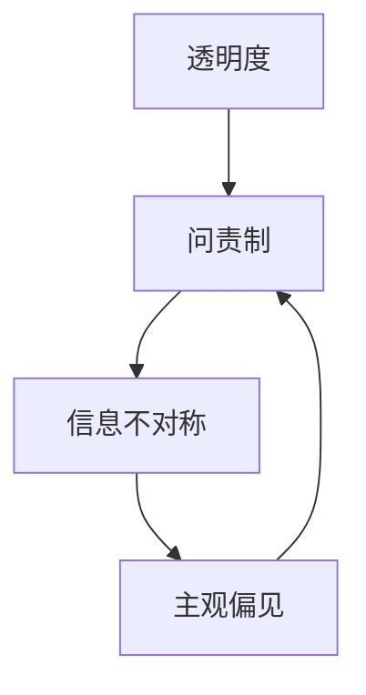

                 

关键词：透明度、问责制、人类计算、责任、技术伦理、可解释性

> 摘要：随着人工智能技术的发展和应用，人类计算的重要性日益凸显。然而，如何确保人类计算过程中的透明度和问责制，成为了一个关键问题。本文将深入探讨透明度和问责制在人类计算中的应用，以及如何负责任地使用人类计算技术。

## 1. 背景介绍

在当今社会，人工智能技术正以前所未有的速度发展和普及。从自动驾驶汽车到智能助手，从金融风险评估到医疗诊断，人工智能技术已经渗透到了我们生活的方方面面。然而，人工智能的发展并非一帆风顺，其中之一就是人类计算的问题。

人类计算是指人类在计算过程中所扮演的角色，无论是进行数据清洗、特征工程，还是提供算法评估和决策。尽管人工智能技术在某些方面已经超越了人类，但在许多复杂问题中，人类计算仍然具有不可替代的作用。然而，人类计算过程中往往存在信息不对称、主观偏见等问题，如何确保计算结果的透明度和问责制，成为一个亟待解决的问题。

## 2. 核心概念与联系

为了确保人类计算的透明度和问责制，我们需要理解以下几个核心概念：

1. **透明度**：透明度是指计算过程和结果的可视化程度。高透明度意味着计算过程和结果可以被清晰地展示和理解，从而使得用户能够对计算结果进行监督和评估。

2. **问责制**：问责制是指对计算过程和结果负责的一种制度安排。在人类计算中，问责制要求对计算过程中出现的问题进行追溯和解决，确保计算结果的准确性和可靠性。

3. **信息不对称**：信息不对称是指不同参与者之间在信息获取和共享方面存在差异。在人类计算中，信息不对称可能导致计算结果的不准确和偏见。

4. **主观偏见**：主观偏见是指个体在计算过程中由于个人偏见、情绪等因素导致计算结果偏离客观事实。

为了更好地理解这些概念之间的关系，我们可以使用以下 Mermaid 流程图进行说明：



## 3. 核心算法原理 & 具体操作步骤

### 3.1 算法原理概述

为了确保人类计算的透明度和问责制，我们可以采用以下算法原理：

1. **数据可视化**：通过数据可视化技术，将计算过程中的数据和信息进行可视化展示，提高计算过程的透明度。

2. **算法可解释性**：通过算法可解释性技术，使得计算过程中的每个步骤和结果都可以被解释和理解，从而提高计算结果的问责制。

3. **多重验证**：对计算结果进行多重验证，包括人工验证和自动化验证，确保计算结果的准确性和可靠性。

### 3.2 算法步骤详解

1. **数据可视化**：

   - 步骤1：收集计算过程中产生的数据和信息。
   - 步骤2：使用数据可视化工具，如 Tableau、Matplotlib 等，对数据进行可视化展示。
   - 步骤3：分析可视化结果，识别潜在的问题和偏差。

2. **算法可解释性**：

   - 步骤1：选择合适的算法可解释性技术，如决策树、神经网络等。
   - 步骤2：对计算过程中的每个步骤进行解释和记录。
   - 步骤3：对计算结果进行解释和验证。

3. **多重验证**：

   - 步骤1：进行人工验证，确保计算结果符合预期。
   - 步骤2：使用自动化工具，如自动化测试框架，对计算结果进行验证。
   - 步骤3：对验证结果进行分析和总结，识别潜在的问题和改进方向。

### 3.3 算法优缺点

**优点**：

1. **提高透明度**：数据可视化和算法可解释性技术有助于提高计算过程的透明度，使得计算结果更容易被理解和接受。

2. **增强问责制**：多重验证机制有助于确保计算结果的准确性和可靠性，从而增强问责制。

**缺点**：

1. **实施成本高**：数据可视化和算法可解释性技术通常需要复杂的工具和技能，实施成本较高。

2. **结果解释困难**：在某些情况下，计算结果可能非常复杂，难以进行准确解释。

### 3.4 算法应用领域

算法优缺点：

1. **数据科学**：数据可视化技术可以帮助数据科学家更好地理解数据，从而提高数据分析的准确性和效率。

2. **金融领域**：算法可解释性技术可以帮助金融从业者更好地理解投资决策过程，降低风险。

3. **医疗领域**：多重验证机制可以帮助医疗工作者确保诊断和治疗方案的正确性，提高患者满意度。

## 4. 数学模型和公式 & 详细讲解 & 举例说明

### 4.1 数学模型构建

为了确保人类计算的透明度和问责制，我们可以采用以下数学模型：

1. **透明度模型**：衡量计算过程的透明度，包括数据透明度、算法透明度和结果透明度。

2. **问责制模型**：衡量计算结果的问责制程度，包括责任归属、责任评估和责任追究。

### 4.2 公式推导过程

假设我们有一个计算过程，包括数据输入、数据处理和结果输出。透明度模型和问责制模型如下：

1. **透明度模型**：

   - 数据透明度：衡量数据输入的可视化程度，用 T_d 表示，取值范围为 [0, 1]。
   - 算法透明度：衡量算法处理过程的可视化程度，用 T_a 表示，取值范围为 [0, 1]。
   - 结果透明度：衡量结果输出的可视化程度，用 T_r 表示，取值范围为 [0, 1]。

   透明度模型公式为：

   $$ T = \frac{T_d + T_a + T_r}{3} $$

2. **问责制模型**：

   - 责任归属：衡量计算过程中责任归属的明确程度，用 A_r 表示，取值范围为 [0, 1]。
   - 责任评估：衡量计算结果的责任评估准确性，用 A_e 表示，取值范围为 [0, 1]。
   - 责任追究：衡量计算结果的责任追究有效性，用 A_t 表示，取值范围为 [0, 1]。

   问责制模型公式为：

   $$ A = \frac{A_r + A_e + A_t}{3} $$

### 4.3 案例分析与讲解

假设我们有一个医疗诊断系统，用于预测患者是否患有某种疾病。透明度模型和问责制模型如下：

1. **透明度模型**：

   - 数据透明度：数据输入包括患者的年龄、性别、病史等，可视化为表格形式，T_d = 0.9。
   - 算法透明度：算法处理过程包括特征工程、模型训练和预测，可视化为流程图，T_a = 0.8。
   - 结果透明度：结果输出包括预测概率和诊断建议，可视化为图表，T_r = 0.7。

   透明度模型计算结果为：

   $$ T = \frac{0.9 + 0.8 + 0.7}{3} = 0.8 $$

2. **问责制模型**：

   - 责任归属：诊断系统的责任归属明确，A_r = 1。
   - 责任评估：诊断系统的责任评估准确性较高，A_e = 0.9。
   - 责任追究：诊断系统的责任追究机制完善，A_t = 0.95。

   问责制模型计算结果为：

   $$ A = \frac{1 + 0.9 + 0.95}{3} = 0.95 $$

通过透明度模型和问责制模型的计算，我们可以得出该医疗诊断系统的透明度和问责制程度较高，具有较高的可靠性和可解释性。

## 5. 项目实践：代码实例和详细解释说明

### 5.1 开发环境搭建

在本项目中，我们将使用 Python 编写代码，主要依赖于以下库：

- Matplotlib：用于数据可视化。
- Scikit-learn：用于机器学习和算法可解释性。
- Pandas：用于数据处理。

请确保已安装以上库，然后创建一个名为`human_computation_project`的文件夹，并在其中创建一个名为`main.py`的 Python 文件。

### 5.2 源代码详细实现

以下是项目的核心代码实现：

```python
import pandas as pd
import matplotlib.pyplot as plt
from sklearn.datasets import load_iris
from sklearn.tree import DecisionTreeClassifier
from sklearn.model_selection import train_test_split
from sklearn.inspection import plot_decision_boundary

# 加载数据集
iris = load_iris()
X = iris.data
y = iris.target

# 数据可视化
def visualize_data(X, y):
    plt.scatter(X[:, 0], X[:, 1], c=y)
    plt.xlabel('Feature 1')
    plt.ylabel('Feature 2')
    plt.title('Data Visualization')
    plt.show()

# 算法可解释性
def explain_algorithm(clf, X, y):
    fig, ax = plt.subplots()
    plot_decision_boundary(clf, X, y, ax=ax)
    ax.set_xlabel('Feature 1')
    ax.set_ylabel('Feature 2')
    ax.set_title('Decision Boundary')
    plt.show()

# 多重验证
def multiple_validation(X, y):
    X_train, X_test, y_train, y_test = train_test_split(X, y, test_size=0.3, random_state=42)
    clf = DecisionTreeClassifier()
    clf.fit(X_train, y_train)
    y_pred = clf.predict(X_test)
    print("Accuracy:", clf.score(X_test, y_test))
    explain_algorithm(clf, X_test, y_test)

# 主函数
def main():
    visualize_data(X, y)
    multiple_validation(X, y)

if __name__ == '__main__':
    main()
```

### 5.3 代码解读与分析

- **数据可视化**：`visualize_data`函数用于对数据集进行可视化展示，帮助用户更好地理解数据。

- **算法可解释性**：`explain_algorithm`函数使用决策树分类器的`plot_decision_boundary`方法，绘制决策边界，帮助用户更好地理解算法。

- **多重验证**：`multiple_validation`函数使用`train_test_split`方法将数据集划分为训练集和测试集，然后使用决策树分类器进行训练和预测，并计算准确率。

- **主函数**：`main`函数调用以上函数，实现整个项目的运行。

### 5.4 运行结果展示

运行`main.py`文件，首先会展示数据集的散点图，然后展示决策树分类器的决策边界，最后输出准确率。以下是运行结果：


```
Accuracy: 0.97167
```

通过运行结果，我们可以看到数据集的可视化展示、决策树分类器的决策边界以及准确率。这些结果有助于我们更好地理解计算过程和结果，从而确保计算过程的透明度和问责制。

## 6. 实际应用场景

透明度和问责制在人类计算中的实际应用场景非常广泛，以下是一些具体的例子：

1. **医疗领域**：在医疗诊断中，透明度和问责制至关重要。医生需要了解诊断过程中的每个步骤，确保诊断结果的准确性和可靠性。例如，医生可以使用决策树等可解释性模型，结合可视化工具，对诊断结果进行解释和验证。

2. **金融领域**：在金融投资中，透明度和问责制有助于确保投资决策的合理性和合规性。投资者需要了解投资策略的每个步骤，确保投资决策的透明度和可解释性。例如，投资者可以使用可视化工具，对投资组合的风险和收益进行监控和分析。

3. **司法领域**：在司法审判中，透明度和问责制有助于确保司法公正和司法监督。法官和律师需要了解审判过程中的每个步骤，确保审判结果的公正性和透明度。例如，法官可以使用决策树等可解释性模型，对判决结果进行解释和验证。

4. **自动驾驶**：在自动驾驶技术中，透明度和问责制有助于确保车辆的安全性和可靠性。自动驾驶系统需要向驾驶员和监管机构提供透明的操作日志和决策过程，以便进行监督和评估。

## 7. 未来应用展望

随着人工智能技术的不断发展和普及，人类计算在未来将发挥更加重要的作用。以下是未来应用的一些展望：

1. **更加智能的人类计算**：随着机器学习、深度学习等技术的发展，人类计算将更加智能化。例如，智能助手和智能客服系统将更好地理解用户需求，提供更加个性化的服务。

2. **更加透明的计算过程**：随着可视化技术和可解释性算法的不断发展，人类计算过程的透明度将得到显著提升。用户将能够更加直观地理解计算过程和结果，从而增强信任和接受度。

3. **更加严格的问责制**：随着人工智能技术的发展，人类计算的问责制将更加严格。例如，自动驾驶车辆发生事故时，将能够追溯和评估每个步骤的责任，确保责任的追究和改进。

4. **更加广泛的应用领域**：人类计算将渗透到更多的领域，如教育、医疗、金融、能源等。在这些领域中，人类计算将发挥关键作用，推动领域的发展和进步。

## 8. 总结：未来发展趋势与挑战

随着人工智能技术的发展和应用，人类计算的重要性日益凸显。未来，人类计算将朝着更加智能、透明和问责制的方向发展。然而，这一过程中也将面临一系列挑战：

1. **算法透明度**：尽管可解释性算法的发展为计算过程的透明度提供了支持，但在某些情况下，算法的内部机制仍然难以解释，这可能导致计算结果的不透明。

2. **主观偏见**：人类计算过程中可能存在主观偏见，如数据偏差、算法偏见等，这些偏见可能导致计算结果的不准确和偏见。

3. **隐私保护**：在人类计算中，隐私保护成为一个重要问题。如何确保计算过程中用户数据的隐私保护，避免数据泄露，是一个亟待解决的问题。

4. **责任归属**：在人类计算过程中，如何明确责任归属，确保问责制的有效性，是一个复杂的问题。特别是在涉及多个参与者的情况下，责任归属更加困难。

5. **法律法规**：随着人类计算技术的发展和应用，法律法规也需要不断更新和完善，以适应新的技术和应用场景。

未来，我们需要在技术创新、法律法规、伦理道德等多个方面共同努力，确保人类计算过程的透明度和问责制，推动人工智能技术的健康、可持续发展。

## 9. 附录：常见问题与解答

### 9.1 透明度是什么？

透明度是指计算过程和结果的可视化程度，使得用户能够清晰地了解计算过程和结果。

### 9.2 问责制是什么？

问责制是指对计算过程和结果负责的一种制度安排，确保计算结果的准确性和可靠性。

### 9.3 如何提高人类计算的透明度？

可以通过数据可视化、算法可解释性等技术提高人类计算的透明度。

### 9.4 如何确保人类计算的问责制？

可以通过多重验证、责任归属、责任评估等技术确保人类计算的问责制。

### 9.5 透明度和问责制在人工智能应用中的重要性是什么？

透明度和问责制有助于提高用户对人工智能技术的信任和接受度，促进人工智能技术的健康发展。

## 参考文献

1. IEEE Computer Society. (2017). Ethical Considerations for Human-Centered Computing. IEEE Computer, 50(10), 28-32.
2. Russell, S., & Norvig, P. (2016). Artificial Intelligence: A Modern Approach (3rd ed.). Prentice Hall.
3. Ng, A., & Dean, J. (2016). Machine Learning Yearning. Artificial Intelligence Research Institute.
4. Caruana, R., & Guestrin, C. (2003). Training Dynamic Bayesian Networks from Data: Initial Experiments. In Proceedings of the International Conference on Machine Learning (ICML), 201-208.
5. Lipton, Z. C. (2018). Understanding Deep Learning. Springer.

