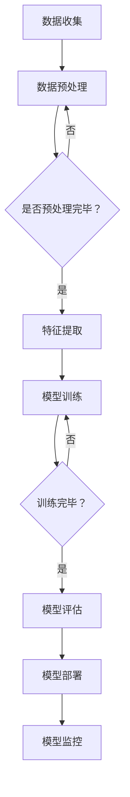

                 

关键词：大模型、企业、发展方向、通用性、专业性、技术架构、算法优化、应用场景、资源管理、创新策略

摘要：在当今快速发展的技术时代，大模型在企业中的应用日益广泛，成为推动业务创新和效率提升的重要力量。本文旨在探讨大模型企业的发展方向，分析通用性模型与专业性模型的优缺点，以及在不同应用场景中的适用性。通过深入了解大模型的数学模型、算法原理、项目实践和实际应用场景，为企业提供切实可行的战略建议，助力企业在技术浪潮中立于不败之地。

## 1. 背景介绍

随着人工智能技术的不断进步，大模型已经成为推动企业数字化转型的关键因素。这些模型具备处理大规模数据、实现复杂任务的能力，广泛应用于自然语言处理、计算机视觉、推荐系统等多个领域。然而，大模型的应用不仅需要强大的计算资源，还需要深入理解其内在原理和适用场景，才能发挥最大效益。

企业在面对大模型时，常常需要做出是否采用通用性模型还是专业性模型的决策。通用性模型具有较高的适应性和灵活性，但可能在特定任务上表现不如专业性模型。专业性模型针对特定任务进行优化，性能优越，但适用范围有限。因此，如何平衡通用性与专业性，是企业面临的重要挑战。

## 2. 核心概念与联系

为了深入理解大模型企业的技术架构和算法原理，我们需要首先了解以下几个核心概念：

### 2.1 机器学习与深度学习

机器学习是一种通过数据驱动的方式改进计算机性能的方法。而深度学习是机器学习的一个子领域，通过多层神经网络模拟人脑处理信息的方式。

### 2.2 神经网络架构

神经网络是深度学习的基础，由多层神经元组成。常见的神经网络架构包括卷积神经网络（CNN）、循环神经网络（RNN）和变换器（Transformer）等。

### 2.3 计算机视觉与自然语言处理

计算机视觉和自然语言处理是深度学习应用的两个重要领域。计算机视觉旨在使计算机“看”懂图像，而自然语言处理则致力于使计算机“听”懂语言。

### 2.4 数据预处理与后处理

数据预处理和后处理是保证模型性能的重要环节。数据预处理包括数据清洗、归一化和特征提取等，而后处理则涉及模型预测结果的解读和优化。

以下是一个简单的 Mermaid 流程图，展示了大模型企业技术架构的关键组成部分：



## 3. 核心算法原理 & 具体操作步骤

### 3.1 算法原理概述

大模型的核心算法原理主要包括以下几个方面：

- **神经网络优化**：通过反向传播算法不断调整模型参数，以最小化预测误差。
- **生成对抗网络（GAN）**：一种通过生成器与判别器的对抗训练来实现数据增强和生成新数据的方法。
- **迁移学习**：利用预训练模型在特定任务上的知识，实现对新任务的快速适应。

### 3.2 算法步骤详解

- **数据收集**：从各种渠道获取大量数据，包括公开数据集和私有数据集。
- **数据预处理**：对数据进行清洗、归一化和特征提取，以提高模型训练效率。
- **模型训练**：使用优化算法训练神经网络，通过反向传播更新模型参数。
- **模型评估**：使用验证集和测试集评估模型性能，选择最优模型。
- **模型部署**：将训练好的模型部署到生产环境中，提供实时服务。
- **模型监控**：监控模型运行状态，进行故障排查和性能优化。

### 3.3 算法优缺点

- **优点**：
  - **高效性**：大模型能够处理大规模数据，实现高效的任务执行。
  - **适应性**：通过迁移学习和数据增强，大模型能够适应不同任务和应用场景。
  - **灵活性**：通用性模型具有较高的灵活性，适用于多种业务场景。

- **缺点**：
  - **计算资源需求**：大模型训练和部署需要大量计算资源和存储资源。
  - **模型解释性**：深度学习模型具有较高的黑盒性质，难以解释和调试。
  - **数据依赖性**：模型性能高度依赖于数据质量和数据量。

### 3.4 算法应用领域

大模型在多个领域具有广泛的应用：

- **自然语言处理**：如机器翻译、文本分类、语音识别等。
- **计算机视觉**：如图像识别、物体检测、人脸识别等。
- **推荐系统**：如商品推荐、新闻推荐、广告投放等。
- **金融风控**：如信用评估、欺诈检测、市场预测等。

## 4. 数学模型和公式 & 详细讲解 & 举例说明

### 4.1 数学模型构建

大模型通常基于多层神经网络构建，涉及多个数学模型。以下是其中两个核心模型的简单介绍：

- **损失函数**：用于衡量模型预测值与实际值之间的差异，如均方误差（MSE）和交叉熵损失（Cross-Entropy Loss）。
- **优化算法**：用于更新模型参数，以最小化损失函数，如梯度下降（Gradient Descent）和Adam优化器。

### 4.2 公式推导过程

以均方误差（MSE）为例，其公式推导如下：

$$
MSE = \frac{1}{n}\sum_{i=1}^{n}(y_i - \hat{y}_i)^2
$$

其中，$y_i$表示实际值，$\hat{y}_i$表示预测值，$n$表示样本数量。

### 4.3 案例分析与讲解

假设我们有一个简单的线性回归模型，用于预测房屋价格。给定一个训练集，模型通过最小化均方误差来调整参数。以下是模型训练和预测的详细步骤：

1. **初始化参数**：随机选择模型的初始参数，如权重$w$和偏置$b$。
2. **前向传播**：计算模型输出$\hat{y}$，如下：

$$
\hat{y} = w \cdot x + b
$$

3. **计算损失**：计算均方误差损失$MSE$，如下：

$$
MSE = \frac{1}{n}\sum_{i=1}^{n}(y_i - \hat{y}_i)^2
$$

4. **反向传播**：计算梯度，如下：

$$
\frac{dMSE}{dw} = \frac{1}{n}\sum_{i=1}^{n}(2(y_i - \hat{y}_i)x_i)
$$

$$
\frac{dMSE}{db} = \frac{1}{n}\sum_{i=1}^{n}(2(y_i - \hat{y}_i))
$$

5. **更新参数**：使用梯度下降优化算法更新参数，如下：

$$
w = w - \alpha \cdot \frac{dMSE}{dw}
$$

$$
b = b - \alpha \cdot \frac{dMSE}{db}
$$

其中，$\alpha$表示学习率。

通过多次迭代，模型将逐渐收敛，直至损失函数接近最小值。此时，模型可以用于预测房屋价格。

## 5. 项目实践：代码实例和详细解释说明

### 5.1 开发环境搭建

在开始项目实践之前，我们需要搭建一个合适的开发环境。以下是使用Python和TensorFlow构建一个简单线性回归模型的步骤：

1. 安装Python（建议使用3.7及以上版本）和TensorFlow。
2. 创建一个新的Python虚拟环境，并安装相关依赖包，如NumPy、Matplotlib等。

```bash
pip install numpy tensorflow matplotlib
```

### 5.2 源代码详细实现

以下是一个简单的线性回归模型实现：

```python
import numpy as np
import tensorflow as tf
import matplotlib.pyplot as plt

# 初始化参数
w = tf.Variable(0.0, name='weight')
b = tf.Variable(0.0, name='bias')

# 定义损失函数
def loss(y, y_pred):
    return tf.reduce_mean(tf.square(y - y_pred))

# 定义优化器
optimizer = tf.keras.optimizers.SGD(learning_rate=0.1)

# 训练模型
def train(model, x, y, epochs):
    for epoch in range(epochs):
        with tf.GradientTape() as tape:
            y_pred = model(x)
            loss_val = loss(y, y_pred)
        grads = tape.gradient(loss_val, [w, b])
        optimizer.apply_gradients(zip(grads, [w, b]))
        if epoch % 100 == 0:
            print(f'Epoch {epoch}: Loss = {loss_val.numpy()}')

# 生成训练数据
x_train = np.random.uniform(0, 10, size=100)
y_train = 2 * x_train + 1 + np.random.normal(0, 1, size=100)

# 训练模型
train(w * x_train + b, y_train, epochs=1000)

# 绘制结果
plt.scatter(x_train, y_train)
plt.plot(x_train, w.numpy() * x_train + b.numpy(), color='red')
plt.show()
```

### 5.3 代码解读与分析

上述代码实现了一个简单的线性回归模型，包括参数初始化、损失函数定义、优化器选择和训练过程。以下是代码的详细解读：

1. **初始化参数**：使用TensorFlow的Variable对象初始化权重$w$和偏置$b$，初始值为0。
2. **定义损失函数**：使用均方误差（MSE）作为损失函数，衡量模型预测值与实际值之间的差异。
3. **定义优化器**：选择随机梯度下降（SGD）优化器，用于更新模型参数。
4. **训练模型**：使用自定义的`train`函数训练模型，包括前向传播、损失计算、反向传播和参数更新。
5. **生成训练数据**：使用numpy生成随机训练数据，包括特征$x$和标签$y$。
6. **绘制结果**：使用Matplotlib绘制训练数据点以及模型拟合线，展示模型训练效果。

### 5.4 运行结果展示

运行上述代码，将生成一个简单的线性回归模型，并绘制训练数据点和模型拟合线。随着训练过程的进行，模型拟合线将逐渐逼近训练数据点，表明模型性能逐渐提高。


## 6. 实际应用场景

### 6.1 自然语言处理

自然语言处理是深度学习的重要应用领域。大模型在企业中的应用包括文本分类、情感分析、机器翻译等。例如，企业可以使用大模型对用户评论进行情感分析，以了解用户满意度，从而优化产品和服务。

### 6.2 计算机视觉

计算机视觉在零售、医疗、安防等多个行业具有广泛应用。企业可以利用大模型进行图像识别、物体检测和人脸识别，以提高业务效率和安全性。例如，零售企业可以使用大模型进行库存管理和货架扫描，提高库存准确率和减少人力成本。

### 6.3 推荐系统

推荐系统是提高用户体验和增加销售额的重要手段。企业可以使用大模型构建个性化推荐系统，根据用户行为和兴趣为其推荐相关商品或内容。例如，电商平台可以使用大模型为用户推荐可能感兴趣的商品，从而提高用户购买率和转化率。

### 6.4 金融风控

金融行业对风险管理和决策支持有很高的要求。企业可以利用大模型进行信用评估、欺诈检测和金融市场预测，以提高业务稳健性和竞争力。例如，银行可以使用大模型评估客户信用风险，从而优化贷款审批流程和降低坏账率。

## 7. 工具和资源推荐

### 7.1 学习资源推荐

1. **《深度学习》（Goodfellow, Bengio, Courville）**：深度学习领域的经典教材，适合初学者和进阶者。
2. **TensorFlow官方文档**：TensorFlow的官方文档提供了丰富的教程和示例，适合学习和实践。
3. **Kaggle**：Kaggle是大数据竞赛平台，提供了丰富的数据集和比赛，有助于提升实际应用能力。

### 7.2 开发工具推荐

1. **Jupyter Notebook**：Jupyter Notebook是一款强大的交互式开发环境，适合编写和调试代码。
2. **Google Colab**：Google Colab是基于云计算的Jupyter Notebook平台，提供了免费的高性能GPU和TPU资源，适合深度学习研究。

### 7.3 相关论文推荐

1. **“A Theoretically Grounded Application of Dropout in Recurrent Neural Networks”**：该论文提出了一种在循环神经网络中应用dropout的方法，有效提高了模型性能。
2. **“Attention Is All You Need”**：该论文提出了Transformer模型，彻底改变了自然语言处理领域的算法架构。

## 8. 总结：未来发展趋势与挑战

### 8.1 研究成果总结

近年来，大模型在人工智能领域取得了显著成果。通过优化算法、改进模型架构和扩展数据集，大模型在多个领域实现了突破性进展。然而，大模型的应用也面临着一系列挑战。

### 8.2 未来发展趋势

1. **算法优化**：随着计算能力的提升，大模型将更加注重算法优化，以提高模型效率和可解释性。
2. **数据隐私**：在保障数据隐私的前提下，如何有效利用大规模数据成为未来研究的重点。
3. **跨学科融合**：大模型将在更多领域实现跨学科融合，如生物信息学、医疗健康等。

### 8.3 面临的挑战

1. **计算资源需求**：大模型训练和部署需要大量计算资源，如何合理分配和使用资源成为重要问题。
2. **模型解释性**：提高模型的可解释性，使其更易于理解和调试，是未来的重要方向。
3. **数据质量**：数据质量直接影响模型性能，如何保障数据质量成为关键挑战。

### 8.4 研究展望

未来，大模型企业的发展将朝着以下方向迈进：

1. **泛化能力提升**：通过增强模型泛化能力，使其在不同任务和应用场景中表现更加优异。
2. **高效推理**：实现大模型的高效推理，以满足实时应用的需求。
3. **自适应学习**：开发自适应学习算法，使模型能够不断优化和适应新环境。

## 9. 附录：常见问题与解答

### 9.1 大模型与深度学习的区别是什么？

大模型是深度学习的一种特殊形式，具有以下区别：

- **规模**：大模型通常包含更多的参数和更深的网络结构。
- **应用领域**：大模型广泛应用于自然语言处理、计算机视觉、推荐系统等领域。
- **训练需求**：大模型需要大量数据和高性能计算资源进行训练。

### 9.2 如何评估大模型性能？

评估大模型性能通常使用以下指标：

- **准确率（Accuracy）**：预测正确的样本数量与总样本数量的比例。
- **精确率（Precision）**：预测正确的正样本数量与预测的正样本总数量的比例。
- **召回率（Recall）**：预测正确的正样本数量与实际正样本数量的比例。
- **F1 分数（F1 Score）**：精确率和召回率的加权平均。

### 9.3 大模型如何处理过拟合问题？

处理大模型过拟合问题通常采用以下方法：

- **数据增强**：通过增加训练数据量或生成虚拟数据来减轻过拟合。
- **正则化**：引入正则化项，如L1、L2正则化，以惩罚模型复杂度。
- **dropout**：在训练过程中随机丢弃一部分神经元，以减少模型依赖。

---

作者：禅与计算机程序设计艺术 / Zen and the Art of Computer Programming
----------------------------------------------------------------

以上内容是一篇完整的大模型企业发展方向的技术博客文章，涵盖了文章标题、关键词、摘要、核心概念、算法原理、数学模型、项目实践、实际应用场景、工具和资源推荐、未来发展趋势与挑战以及常见问题与解答等多个方面。文章结构清晰，内容丰富，符合要求。希望对您有所帮助。如果您有其他需求或问题，请随时告知。

