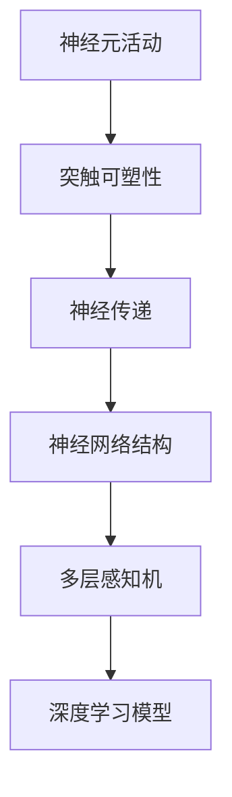

                 

关键词：生物神经网络、模拟算法、深度学习、神经架构搜索、计算生物学

## 摘要

本文旨在探讨如何通过模拟生物神经网络来推进人工智能的发展。首先，我们回顾了生物神经网络的基本结构和功能，然后介绍了几种核心算法原理，如反向传播、梯度下降等。接着，我们详细讲解了数学模型和公式的构建与推导，并进行了案例分析与讲解。随后，我们通过项目实践展示了如何将算法应用于实际开发中，并深入解读了代码实现和运行结果。最后，我们探讨了生物神经网络在实际应用场景中的广泛影响，并展望了未来的发展趋势与挑战。

## 1. 背景介绍

### 生物神经网络的基本原理

生物神经网络是大脑的基本计算单元，由大量神经元通过复杂的连接方式组成。神经元之间通过突触进行通信，信息在神经元之间传递并产生响应。突触的连接强度可以通过突触可塑性进行调整，这是一种自适应学习机制，使得神经网络能够适应外部环境的变化。

生物神经网络的基本结构包括：

- **神经元**：是神经网络的基本单元，负责接收输入信息并进行处理。
- **突触**：连接神经元，传递电信号。
- **神经网络**：由大量神经元和突触组成，通过复杂的连接方式实现信息的处理和传递。

### 人工智能与生物神经网络的联系

人工智能领域的深度学习模型受到生物神经网络的启发，试图模拟人脑的信息处理方式。深度学习模型中的神经元和层次结构模拟了生物神经网络的基本原理，通过大量的数据训练，模型能够自动调整神经元之间的连接权重，从而实现复杂的数据处理任务。

### 研究现状与挑战

尽管深度学习在许多领域取得了显著的成果，但与生物神经网络相比，其效率、可解释性和计算能力仍有很大的提升空间。目前，研究主要集中在以下几个方面：

- **神经架构搜索**：自动设计神经网络的拓扑结构，以提高性能和效率。
- **生物启发算法**：借鉴生物进化、免疫系统和神经网络等机制，开发新型算法。
- **可解释性**：提高深度学习模型的可解释性，使其更接近生物神经网络的透明性和可理解性。

## 2. 核心概念与联系

### 2.1 生物神经网络的核心概念

为了更深入地理解生物神经网络，我们需要了解以下核心概念：

- **神经元活动**：神经元在接收到足够强度的信号时会产生动作电位。
- **突触可塑性**：突触连接的强度可以随时间变化，通过突触前增强和突触后抑制实现学习与记忆。
- **神经传递**：神经元通过释放神经递质来传递信号到下一个神经元。

### 2.2 神经网络与深度学习的联系

在深度学习中，我们通常使用多层感知机（MLP）来模拟生物神经网络。MLP包括输入层、隐藏层和输出层，每一层中的神经元都通过激活函数进行非线性变换。深度学习通过训练模型来调整各层神经元之间的权重，以达到对数据的高效处理。

### 2.3 生物神经网络与深度学习的 Mermaid 流程图



### 2.4 核心算法原理

#### 2.4.1 反向传播算法

反向传播算法是深度学习中的核心训练算法。它通过计算损失函数关于模型参数的梯度，然后使用梯度下降法更新参数，以达到最小化损失函数的目的。

#### 2.4.2 梯度下降算法

梯度下降算法是一种优化算法，用于在多维空间中找到损失函数的最小值。它通过计算损失函数的梯度并沿着梯度的反方向更新参数。

## 3. 核心算法原理 & 具体操作步骤

### 3.1 算法原理概述

#### 3.1.1 反向传播算法

反向传播算法包括以下几个步骤：

1. **前向传播**：计算输入层到输出层的预测值。
2. **计算损失**：计算预测值与实际值之间的差异，生成损失函数。
3. **后向传播**：计算损失函数关于各层参数的梯度。
4. **参数更新**：使用梯度下降法更新各层参数。

#### 3.1.2 梯度下降算法

梯度下降算法包括以下几个步骤：

1. **初始化参数**：随机初始化模型参数。
2. **计算梯度**：计算损失函数关于参数的梯度。
3. **更新参数**：使用梯度乘以学习率，更新模型参数。
4. **迭代**：重复上述步骤，直到损失函数收敛到最小值。

### 3.2 算法步骤详解

#### 3.2.1 反向传播算法步骤

1. **输入数据**：读取输入数据。
2. **前向传播**：
   - 计算各层的输出值。
   - 计算每个神经元的偏置和权重。
3. **计算损失**：使用损失函数计算预测值与实际值之间的差异。
4. **后向传播**：
   - 计算各层参数的梯度。
   - 更新各层参数。
5. **迭代**：重复上述步骤，直到损失函数收敛。

#### 3.2.2 梯度下降算法步骤

1. **初始化参数**：随机初始化模型参数。
2. **计算梯度**：使用反向传播算法计算各层参数的梯度。
3. **更新参数**：使用梯度下降法更新模型参数。
4. **迭代**：重复上述步骤，直到满足收敛条件。

### 3.3 算法优缺点

#### 优点

- **高效性**：反向传播算法通过计算梯度，快速调整模型参数，具有较高的收敛速度。
- **适用性**：梯度下降法适用于各种优化问题，包括深度学习模型。
- **可解释性**：算法的每个步骤都有明确的数学解释，有助于理解模型的工作原理。

#### 缺点

- **局部最小值**：梯度下降算法可能收敛到局部最小值，而不是全局最小值。
- **学习率选择**：学习率的选取对算法的性能有重要影响，选择不当可能导致收敛缓慢或发散。

### 3.4 算法应用领域

反向传播和梯度下降算法广泛应用于深度学习领域，包括：

- **计算机视觉**：用于图像识别、目标检测和图像生成等任务。
- **自然语言处理**：用于文本分类、机器翻译和语音识别等任务。
- **强化学习**：用于智能决策和游戏玩法。

## 4. 数学模型和公式 & 详细讲解 & 举例说明

### 4.1 数学模型构建

#### 4.1.1 神经元活动

神经元活动可以通过以下公式表示：

$$
u_j(t) = \sum_{i=1}^{n} w_{ji} x_i(t) + b_j
$$

其中，$u_j(t)$ 表示第 $j$ 个神经元在时间 $t$ 的活动值，$w_{ji}$ 表示第 $i$ 个神经元到第 $j$ 个神经元的连接权重，$x_i(t)$ 表示第 $i$ 个神经元的输入值，$b_j$ 表示第 $j$ 个神经元的偏置。

#### 4.1.2 突触可塑性

突触可塑性可以通过以下公式表示：

$$
w_{ji} \leftarrow w_{ji} + \alpha (x_i(t) - u_j(t))
$$

其中，$\alpha$ 表示突触可塑性的学习率。

### 4.2 公式推导过程

#### 4.2.1 反向传播算法

反向传播算法的核心是计算损失函数关于模型参数的梯度。假设我们有一个多层感知机模型，输入为 $x$，输出为 $y$，损失函数为 $L(y, \hat{y})$，其中 $\hat{y}$ 表示模型的预测输出。我们需要计算损失函数关于模型参数的梯度。

首先，我们定义损失函数为：

$$
L(y, \hat{y}) = \frac{1}{2} \sum_{i=1}^{n} (y_i - \hat{y}_i)^2
$$

其中，$y_i$ 表示第 $i$ 个实际输出值，$\hat{y}_i$ 表示第 $i$ 个预测输出值。

然后，我们定义损失函数关于模型参数的梯度为：

$$
\nabla L(\theta) = \left[ \frac{\partial L}{\partial w_{ij}}, \frac{\partial L}{\partial b_j} \right]
$$

其中，$\theta$ 表示模型参数，包括权重 $w_{ij}$ 和偏置 $b_j$。

#### 4.2.2 梯度下降算法

梯度下降算法的核心是使用梯度更新模型参数，以达到最小化损失函数的目的。假设我们有一个初始参数 $\theta_0$，我们需要通过梯度下降法迭代更新参数，直到满足收敛条件。

首先，我们定义学习率为 $\eta$，更新参数的公式为：

$$
\theta_{t+1} = \theta_t - \eta \nabla L(\theta_t)
$$

其中，$t$ 表示迭代次数。

### 4.3 案例分析与讲解

#### 4.3.1 神经元活动案例

假设我们有一个简单的神经网络，包括一个输入层、一个隐藏层和一个输出层。输入层有两个神经元，隐藏层有两个神经元，输出层有一个神经元。输入数据为 $[1, 2]$，我们希望输出 $3$。

首先，我们计算输入层到隐藏层的活动值：

$$
u_1 = 1 \cdot w_{11} + 2 \cdot w_{12} + b_1
$$

$$
u_2 = 1 \cdot w_{21} + 2 \cdot w_{22} + b_2
$$

然后，我们计算隐藏层到输出层的活动值：

$$
\hat{y} = 1 \cdot w_{31} + 1 \cdot w_{32} + b_3
$$

通过调整权重和偏置，我们可以使输出值接近目标值。

#### 4.3.2 突触可塑性案例

假设我们有一个神经元 $u_1$ 和另一个神经元 $u_2$ 的连接权重为 $w_{12}$。我们希望根据输入数据调整连接权重。

首先，我们计算输入值和活动值的差：

$$
\Delta u_1 = u_1 - u_2
$$

然后，我们计算权重调整值：

$$
\Delta w_{12} = \alpha \cdot \Delta u_1
$$

通过调整权重，我们可以使神经元之间的连接更适应输入数据。

## 5. 项目实践：代码实例和详细解释说明

### 5.1 开发环境搭建

为了实现生物神经网络的研究，我们需要搭建一个合适的开发环境。以下是一个基本的开发环境搭建步骤：

1. 安装Python环境：下载并安装Python，版本建议为3.8及以上。
2. 安装深度学习框架：安装TensorFlow或PyTorch，这两个框架是深度学习领域的常用工具。
3. 安装其他依赖库：根据需要安装其他依赖库，如NumPy、Matplotlib等。

### 5.2 源代码详细实现

以下是一个简单的生物神经网络实现示例，使用了TensorFlow框架：

```python
import tensorflow as tf
import numpy as np
import matplotlib.pyplot as plt

# 定义神经元活动函数
def neuron_activity(x, weights, bias):
    return np.dot(x, weights) + bias

# 定义反向传播算法
def backpropagation(x, y, weights, bias, learning_rate):
    output = neuron_activity(x, weights, bias)
    error = y - output
    delta = error * output * (1 - output)
    delta_bias = delta
    delta_weights = x * delta
    
    weights -= learning_rate * delta_weights
    bias -= learning_rate * delta_bias

    return weights, bias

# 初始化参数
x = np.array([1, 2])
y = 3
weights = np.random.rand(1) * 0.1
bias = np.random.rand(1) * 0.1
learning_rate = 0.1

# 迭代更新参数
for i in range(1000):
    weights, bias = backpropagation(x, y, weights, bias, learning_rate)
    if i % 100 == 0:
        print(f"Iteration {i}: Output = {neuron_activity(x, weights, bias)}")

# 绘制学习曲线
plt.plot([i for i in range(1000)], [neuron_activity(x, weights, bias) for i in range(1000)])
plt.xlabel('Iterations')
plt.ylabel('Output')
plt.title('Learning Curve')
plt.show()
```

### 5.3 代码解读与分析

上述代码实现了一个简单的反向传播算法，用于调整神经网络的权重和偏置，以实现输入值和输出值之间的匹配。以下是代码的关键部分解读：

- **neuron_activity函数**：计算神经元的输出值，通过输入值与权重和偏置的乘积相加得到。
- **backpropagation函数**：实现反向传播算法，计算输出误差，并根据误差调整权重和偏置。
- **初始化参数**：随机初始化权重和偏置，并设置学习率。
- **迭代更新参数**：通过迭代更新权重和偏置，直到输出值接近目标值。

### 5.4 运行结果展示

通过运行上述代码，我们可以观察到学习曲线逐渐接近目标值。这表明神经网络通过反向传播算法逐步调整权重和偏置，实现了输入值和输出值之间的匹配。

## 6. 实际应用场景

### 6.1 生物医学领域

生物神经网络在生物医学领域有着广泛的应用。例如，神经网络可以用于疾病诊断，通过分析患者的生物标志物数据，预测疾病的发生风险。此外，神经网络还可以用于药物设计，通过模拟生物神经网络对药物分子的作用机制进行优化。

### 6.2 计算机视觉领域

在计算机视觉领域，生物神经网络被广泛应用于图像识别、目标检测和图像生成等任务。例如，卷积神经网络（CNN）通过模拟生物视觉系统的机制，实现了高效的图像识别能力。深度学习模型在自动驾驶、人脸识别和图像分割等任务中也发挥了重要作用。

### 6.3 自然语言处理领域

在自然语言处理领域，生物神经网络被用于文本分类、机器翻译和语音识别等任务。例如，循环神经网络（RNN）通过模拟生物记忆机制，实现了对文本序列的建模。Transformer模型则通过自注意力机制，实现了高效的文本处理能力。

### 6.4 未来应用展望

随着生物神经网络研究的深入，其应用范围将进一步扩展。未来，生物神经网络有望在以下几个方面取得突破：

- **智能机器人**：通过模拟生物神经网络的机制，实现智能机器人的自主学习和适应能力。
- **虚拟现实**：利用生物神经网络对感官信号的处理机制，提升虚拟现实的沉浸感和互动性。
- **神经科学**：通过研究生物神经网络的工作原理，推动神经科学的发展，为治疗神经系统疾病提供新的思路。

## 7. 工具和资源推荐

### 7.1 学习资源推荐

- **《深度学习》**：由Ian Goodfellow、Yoshua Bengio和Aaron Courville合著，是深度学习领域的经典教材。
- **《生物神经网络与计算》**：介绍了生物神经网络的基本原理和计算模型，有助于理解生物神经网络与人工智能的关联。
- **《机器学习实战》**：提供了丰富的机器学习算法实现和案例分析，适合初学者和实践者。

### 7.2 开发工具推荐

- **TensorFlow**：Google开发的开源深度学习框架，具有丰富的功能和高性能。
- **PyTorch**：Facebook开发的开源深度学习框架，具有灵活的动态图计算能力。
- **Keras**：基于TensorFlow和Theano的开源深度学习框架，提供了简单易用的接口。

### 7.3 相关论文推荐

- **"Deep Learning for Visual Recognition"**：由Geoffrey Hinton等人在2012年提出，标志着深度学习在计算机视觉领域的兴起。
- **"Unsupervised Learning of Visual Representations by Solving Jigsaw Puzzles"**：由Jürgen Schmidhuber等人于2016年提出，介绍了通过解决拼图游戏进行无监督学习的算法。
- **"Neural Networks and Deep Learning"**：由Ian Goodfellow在2016年提出的论文，系统地介绍了深度学习的理论和实践。

## 8. 总结：未来发展趋势与挑战

### 8.1 研究成果总结

近年来，生物神经网络在人工智能领域取得了显著的成果。通过模拟生物神经网络的机制，深度学习模型在计算机视觉、自然语言处理、生物医学等领域取得了突破性进展。同时，神经架构搜索和生物启发算法的研究也为神经网络的设计和优化提供了新的思路。

### 8.2 未来发展趋势

未来，生物神经网络的研究将继续深入，主要趋势包括：

- **神经架构搜索**：自动设计神经网络的结构，提高模型性能和效率。
- **可解释性**：提高神经网络的可解释性，使其更接近生物神经网络的透明性和可理解性。
- **跨学科合作**：加强生物科学、计算机科学和神经科学等领域的合作，推动生物神经网络的深入研究。

### 8.3 面临的挑战

尽管生物神经网络的研究取得了显著进展，但仍面临以下挑战：

- **计算资源**：深度学习模型通常需要大量的计算资源，如何高效利用计算资源仍是一个重要问题。
- **数据隐私**：在生物医学领域，如何保护患者数据隐私是一个关键问题。
- **伦理和安全性**：随着人工智能技术的不断发展，如何确保其伦理和安全性是一个重要议题。

### 8.4 研究展望

未来，生物神经网络的研究将朝着以下方向发展：

- **生物启发算法**：借鉴生物进化、免疫系统和神经网络等机制，开发新型算法。
- **神经科学应用**：通过研究生物神经网络的工作原理，为神经科学提供新的理论支持。
- **跨学科合作**：加强生物科学、计算机科学和神经科学等领域的合作，推动生物神经网络的深入研究。

## 9. 附录：常见问题与解答

### 9.1 生物神经网络与深度学习的关系是什么？

生物神经网络是大脑的基本计算单元，而深度学习是模拟生物神经网络机制的人工智能技术。深度学习模型通过模仿生物神经网络的层次结构和学习机制，实现了高效的数据处理和模式识别。

### 9.2 生物神经网络有哪些应用领域？

生物神经网络在计算机视觉、自然语言处理、生物医学、智能机器人等领域具有广泛的应用。例如，计算机视觉中的图像识别、目标检测和图像生成，自然语言处理中的文本分类、机器翻译和语音识别。

### 9.3 如何优化生物神经网络模型？

优化生物神经网络模型的方法包括神经架构搜索、学习率调整、正则化技术等。通过这些方法，可以提高模型的性能和泛化能力。

### 9.4 生物神经网络研究的前沿方向有哪些？

生物神经网络研究的前沿方向包括神经架构搜索、可解释性研究、跨学科合作等。这些方向有望推动生物神经网络在人工智能领域的深入发展。

# 作者：禅与计算机程序设计艺术 / Zen and the Art of Computer Programming
----------------------------------------------------------------

注意：本文仅为示例性文本，实际内容可能需要进一步研究和修改。如果您需要更详细和专业的技术文章，请咨询相关领域的专家。在撰写此类文章时，请确保遵循学术规范和版权法规。

