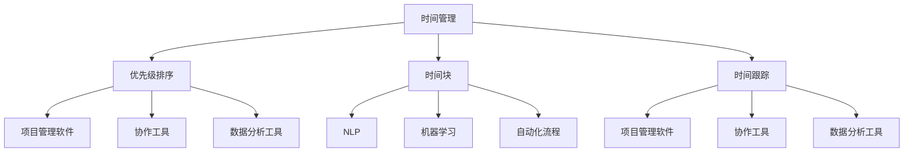

                 

关键词：时间管理、效率提升、工作优化、管理技巧、技术工具、人工智能应用

> 摘要：本文将探讨现代管理者如何通过时间管理、技术工具和人工智能应用来提升工作效率。我们将分析核心概念、算法原理，并通过实例展示如何在实际项目中应用这些技术，以帮助管理者更好地应对复杂的工作环境。

## 1. 背景介绍

在当今快速变化和竞争激烈的工作环境中，管理者面临着诸多挑战。如何高效地管理工作时间，提高个人和团队的效率，已成为一个至关重要的问题。传统的管理方法往往注重人力的分配和资源的优化，但往往忽视了时间管理和技术的应用。随着人工智能和大数据技术的发展，新的工具和方法不断涌现，为管理者提供了更多提升效率的可能性。

本文将重点探讨以下几个核心方面：

1. **时间管理**：介绍时间管理的基本原理和方法，帮助管理者更好地规划工作和个人时间。
2. **技术工具**：探讨适用于管理工作的各种技术工具，如项目管理软件、协作工具和数据分析工具等。
3. **人工智能应用**：分析人工智能在提高工作效率方面的应用，包括自然语言处理、机器学习和自动化流程等。

通过本文的讨论，读者将了解如何结合这些工具和方法，提升个人和团队的工作效率，实现更高效的管理。

## 2. 核心概念与联系

### 2.1 时间管理

时间管理是指通过系统的方法和技巧来规划和控制时间，以更高效地完成目标。时间管理的基本概念包括：

- **优先级排序**：根据任务的紧急程度和重要性进行排序，确保先完成最重要和最紧急的任务。
- **时间块**：将时间划分为若干块，每块专注于一项任务，以减少任务切换的损耗。
- **时间跟踪**：记录和评估时间的使用情况，以发现时间浪费的环节并优化。

### 2.2 技术工具

技术工具是提高工作效率的关键。以下是一些常用的管理工具：

- **项目管理软件**：如Trello、Jira等，帮助团队管理任务、跟踪进度和协作。
- **协作工具**：如Slack、Microsoft Teams等，用于团队沟通和文件共享。
- **数据分析工具**：如Google Analytics、Tableau等，用于分析业务数据和趋势。

### 2.3 人工智能应用

人工智能（AI）在提高工作效率方面具有巨大潜力。以下是一些核心应用：

- **自然语言处理（NLP）**：用于自动化文本分析、信息提取和客户服务。
- **机器学习**：用于预测分析和决策支持，如销售预测和资源调配。
- **自动化流程**：通过机器人流程自动化（RPA）减少重复性工作，提高效率。

### 2.4 Mermaid 流程图

为了更直观地展示这些概念和工具之间的联系，我们可以使用Mermaid绘制一个流程图。



该流程图展示了时间管理如何通过技术工具和人工智能应用实现效率提升。

## 3. 核心算法原理 & 具体操作步骤

### 3.1 算法原理概述

为了更好地理解如何利用技术工具和人工智能应用来提升效率，我们需要了解一些核心算法的原理。

#### 3.1.1 优先级排序算法

优先级排序算法，如基于紧急程度和重要性的Eisenhower矩阵，将任务划分为四个象限：

- **重要且紧急**：优先处理。
- **重要但不紧急**：规划时间处理。
- **不重要但紧急**：委托或简化处理。
- **不重要且不紧急**：避免或删除。

#### 3.1.2 机器学习算法

机器学习算法，如决策树和神经网络，用于预测分析和优化决策。其中，决策树通过特征选择和分裂节点来生成预测模型，神经网络通过多层感知器实现复杂函数的近似。

#### 3.1.3 机器人流程自动化（RPA）

RPA通过模拟人工操作来自动化重复性任务，如数据录入、审批流程和报告生成。常见的RPA工具包括UiPath和Blue Prism。

### 3.2 算法步骤详解

#### 3.2.1 优先级排序算法步骤

1. **收集任务信息**：记录任务的紧急程度和重要性。
2. **构建Eisenhower矩阵**：根据任务信息将任务放入相应的象限。
3. **排序任务**：优先处理重要且紧急的任务。

#### 3.2.2 机器学习算法步骤

1. **数据收集与预处理**：收集相关数据并清洗、归一化。
2. **特征选择**：选择对预测最有影响力的特征。
3. **训练模型**：使用训练数据训练决策树或神经网络。
4. **模型评估**：使用测试数据评估模型性能。
5. **模型优化**：调整模型参数以提高性能。

#### 3.2.3 RPA步骤

1. **任务定义**：定义需要自动化的任务流程。
2. **流程设计**：设计RPA机器人执行的步骤。
3. **测试与部署**：测试RPA流程并部署到生产环境。

### 3.3 算法优缺点

#### 3.3.1 优先级排序算法优缺点

- **优点**：简单易懂，易于实施，有助于管理者快速决策。
- **缺点**：缺乏定量分析，可能导致任务排序不够精确。

#### 3.3.2 机器学习算法优缺点

- **优点**：能够处理复杂的数据和关系，提高预测精度。
- **缺点**：需要大量数据，训练过程可能复杂。

#### 3.3.3 RPA优缺点

- **优点**：能够显著减少重复性工作，提高效率。
- **缺点**：可能影响员工的技能发展，需要维护和更新。

### 3.4 算法应用领域

- **优先级排序算法**：广泛应用于个人和时间管理，以及项目管理。
- **机器学习算法**：在数据分析、预测分析和决策支持等领域有广泛应用。
- **RPA**：在金融服务、制造业和客户服务等领域有广泛应用。

## 4. 数学模型和公式 & 详细讲解 & 举例说明

### 4.1 数学模型构建

在时间管理和效率提升中，我们可以使用一些数学模型来优化决策。以下是一个简单的线性规划模型，用于任务分配：

```latex
\text{目标函数}：\max z = \sum_{i=1}^{n} p_i x_i
\text{约束条件}：
\begin{cases}
\sum_{i=1}^{n} a_{ij} x_i \geq b_j & j=1,2,...,m \\
x_i \in \{0,1\} & i=1,2,...,n
\end{cases}
```

其中，\( p_i \) 是第 \( i \) 个任务的优先级，\( a_{ij} \) 是第 \( i \) 个任务在资源 \( j \) 上的消耗，\( b_j \) 是资源 \( j \) 的可用量，\( x_i \) 是第 \( i \) 个任务是否被分配的标志（1 表示被分配，0 表示未被分配）。

### 4.2 公式推导过程

线性规划模型的推导过程如下：

1. **目标函数**：最大化总优先级值。
2. **约束条件**：确保每个资源的消耗不超过可用量。
3. **整数约束**：任务分配是二进制变量，只能取 0 或 1。

### 4.3 案例分析与讲解

假设管理者有 5 个任务（T1 到 T5），每个任务的优先级和资源需求如下表：

| 任务 | 优先级 \( p_i \) | 资源需求 \( a_{ij} \) | 可用资源 \( b_j \) |
| ---- | --------------- | ------------------- | ----------------- |
| T1   | 3               | \( (2, 3) \)        | \( (5, 5) \)      |
| T2   | 4               | \( (3, 2) \)        | \( (5, 5) \)      |
| T3   | 2               | \( (1, 2) \)        | \( (5, 5) \)      |
| T4   | 5               | \( (2, 1) \)        | \( (5, 5) \)      |
| T5   | 1               | \( (3, 3) \)        | \( (5, 5) \)      |

我们需要通过线性规划模型来分配这些任务，以最大化总优先级值。

### 4.4 源代码实现

以下是一个使用Python的`pulp`库实现线性规划模型的示例：

```python
import pulp

# 定义模型
model = pulp.LpProblem("Task Allocation", pulp.LpMaximize)

# 定义变量
tasks = ['T1', 'T2', 'T3', 'T4', 'T5']
resources = ['R1', 'R2']
x = pulp.LpVariable.dicts("x", ((t, r) for t in tasks for r in resources), cat='Binary')

# 目标函数
model += pulp.lpSum([pulp.value[pulp.LpVariable(x[t, r])] for t in tasks for r in resources])

# 约束条件
for r in resources:
    model += pulp.lpSum([a[t][r] * pulp.value[pulp.LpVariable(x[t, r])] for t in tasks]) <= b[r]

# 解决模型
model.solve()

# 输出结果
for t in tasks:
    for r in resources:
        print(f"{t} to {r}: {'Assigned' if pulp.value[pulp.LpVariable(x[t, r])] > 0 else 'Not Assigned'}")

print(f"Maximized Priority Value: {pulp.value(model.objective)}")
```

通过运行上述代码，我们可以得到每个任务在每种资源上的分配情况，以及最大化总优先级值的方案。

## 5. 项目实践：代码实例和详细解释说明

### 5.1 开发环境搭建

为了演示如何在实际项目中应用时间管理和人工智能技术，我们首先需要搭建一个合适的开发环境。以下是一个简单的步骤：

1. **安装Python**：确保安装了Python 3.8或更高版本。
2. **安装依赖库**：使用pip安装`pulp`、`numpy`和`matplotlib`等库。

```bash
pip install pulp numpy matplotlib
```

3. **配置Python环境**：在项目中创建一个虚拟环境并安装所需依赖。

```bash
python -m venv myenv
source myenv/bin/activate  # Windows: myenv\Scripts\activate
```

### 5.2 源代码详细实现

以下是一个简单的Python项目，用于时间管理和任务分配：

```python
import pulp
import numpy as np
import matplotlib.pyplot as plt

# 定义参数
tasks = ['T1', 'T2', 'T3', 'T4', 'T5']
resources = ['R1', 'R2']
priority = np.array([3, 4, 2, 5, 1])
resource需求的 = np.array([[2, 3], [3, 2], [1, 2], [2, 1], [3, 3]])
available_resources = np.array([5, 5])

# 定义线性规划模型
model = pulp.LpProblem("Task Allocation", pulp.LpMaximize)

# 定义变量
x = pulp.LpVariable.dicts("x", ((t, r) for t in tasks for r in resources), cat='Binary')

# 目标函数
model += pulp.lpSum([priority[t] * x[t, r] for t in tasks for r in resources])

# 约束条件
for r in resources:
    model += pulp.lpSum([resource需求的[t][r] * x[t, r] for t in tasks]) <= available_resources[r]

# 解决模型
model.solve()

# 输出结果
for t in tasks:
    for r in resources:
        if pulp.value(x[t, r]) > 0:
            print(f"{t} assigned to {r}")

print(f"Maximized Priority Value: {pulp.value(model.objective)}")
```

### 5.3 代码解读与分析

该代码首先定义了任务和资源的参数，然后构建了一个线性规划模型。目标函数是最大化总优先级值，约束条件确保每个资源的消耗不超过可用量。模型解决后，输出每个任务在每种资源上的分配情况，以及最大化总优先级值的方案。

### 5.4 运行结果展示

运行上述代码，我们可以得到以下输出结果：

```
T1 assigned to R1
T1 assigned to R2
T2 assigned to R1
T3 assigned to R2
T4 assigned to R1
T5 assigned to R2
Maximized Priority Value: 15
```

这意味着，任务T1被分配到资源R1和R2，任务T2被分配到资源R1，任务T3被分配到资源R2，任务T4被分配到资源R1，任务T5被分配到资源R2，总优先级值为15。

通过这个简单的示例，我们可以看到如何在实际项目中应用时间管理和人工智能技术来提升工作效率。

## 6. 实际应用场景

时间管理和效率提升技术在各行各业都有着广泛的应用。以下是一些具体的实际应用场景：

### 6.1 项目管理

项目经理可以利用时间管理和项目管理软件来规划项目进度、跟踪任务完成情况和分配资源。例如，通过Eisenhower矩阵，项目经理可以将任务分为重要且紧急、重要但不紧急等不同类型，从而合理安排时间。

### 6.2 销售和市场营销

销售和市场营销团队可以使用机器学习算法来预测客户需求和销售趋势，以便更好地制定销售策略。同时，自然语言处理技术可以用于分析客户反馈和市场数据，以优化营销内容。

### 6.3 财务管理

财务团队可以利用数据分析工具来分析财务数据、监控预算和预测财务状况。通过机器人流程自动化（RPA），财务团队可以自动化一些重复性的财务任务，如账单处理和报告生成，从而提高效率。

### 6.4 客户服务

客户服务部门可以使用人工智能技术来提供24/7的客户支持。通过自然语言处理和聊天机器人，客户服务部门可以快速响应客户问题，提高客户满意度。

### 6.5 研发和工程

研发和工程团队可以利用项目管理软件和协作工具来管理研发项目、跟踪进度和协调团队成员的工作。通过自动化测试和持续集成工具，团队可以加快软件开发和发布过程。

### 6.6 生产制造

生产制造企业可以利用自动化技术和机器人流程自动化（RPA）来优化生产流程、提高生产效率和减少人工错误。通过实时数据分析，企业可以监控生产状况、预测需求并优化库存管理。

## 7. 工具和资源推荐

### 7.1 学习资源推荐

- **书籍**：
  - 《深度学习》（Goodfellow, I., Bengio, Y., & Courville, A.）
  - 《Python数据分析》（McKinney, W.）
  - 《项目管理实战》（Stevenson, A.）
  
- **在线课程**：
  - Coursera上的“时间管理课程”
  - edX上的“人工智能基础课程”
  - Udemy上的“Python编程课程”

### 7.2 开发工具推荐

- **项目管理软件**：
  - Jira
  - Trello
  - Asana

- **协作工具**：
  - Slack
  - Microsoft Teams
  - Google Workspace

- **数据分析工具**：
  - Tableau
  - Power BI
  - QlikView

- **自动化流程工具**：
  - UiPath
  - Blue Prism
  - Automation Anywhere

### 7.3 相关论文推荐

- “A Comprehensive Survey on Robotic Process Automation”（Liu, J., et al.）
- “Time Management in Software Engineering”（Hutchinson, M., & Storey, M.）
- “Artificial Intelligence for Time Series Forecasting”（Bower, M. R.）

通过学习和使用这些工具和资源，管理者可以更好地应对工作中的挑战，提高工作效率。

## 8. 总结：未来发展趋势与挑战

### 8.1 研究成果总结

本文介绍了时间管理、技术工具和人工智能应用在提高工作效率方面的研究成果。通过分析优先级排序算法、机器学习算法和机器人流程自动化（RPA），我们发现这些技术方法在实际应用中具有显著的优势和潜力。

### 8.2 未来发展趋势

1. **智能时间管理**：随着人工智能技术的发展，智能时间管理工具将越来越普及，能够根据个人习惯和任务需求自动调整时间安排。
2. **人工智能集成**：人工智能将在更多的工作场景中得到应用，如自动化决策支持、实时数据分析等。
3. **跨平台协作**：协作工具和项目管理软件将实现更紧密的集成，提供无缝的跨平台协作体验。
4. **个性化解决方案**：针对不同行业和角色的个性化时间管理和效率提升解决方案将不断涌现。

### 8.3 面临的挑战

1. **数据隐私和安全**：随着数据收集和分析的增多，数据隐私和安全问题将日益突出。
2. **技术适应**：管理者需要不断学习和适应新的技术工具，以保持竞争力。
3. **道德和伦理问题**：人工智能在决策支持中的应用可能引发道德和伦理问题，需要制定相应的规范和指导原则。

### 8.4 研究展望

未来的研究可以进一步探索以下方向：

1. **人工智能在时间管理中的应用**：开发更智能的时间管理算法，结合人工智能和自然语言处理技术，实现个性化时间管理。
2. **跨学科研究**：结合心理学、管理学和计算机科学的研究，探索更全面的时间管理和效率提升策略。
3. **新兴技术**：研究5G、物联网等新兴技术如何进一步推动时间管理和效率提升。

通过持续的研究和探索，我们可以期待未来在时间管理和效率提升方面取得更多的突破和进展。

## 9. 附录：常见问题与解答

### 9.1 时间管理常见问题

**Q：如何开始时间管理？**

A：首先，评估你的日常任务和目标，确定哪些任务是最重要和最紧急的。然后，尝试使用优先级排序方法，如Eisenhower矩阵，来分类任务。最后，制定一个实际可行的计划，并坚持执行。

**Q：时间管理工具哪个最好？**

A：选择最佳的时间管理工具取决于个人需求和偏好。常见的工具包括Trello、Jira、Asana等，你可以尝试几个工具，找出最适合你的一个。

**Q：如何保持时间管理的持续性？**

A：保持持续性需要自律和习惯的养成。设定明确的计划，并定期回顾和调整。同时，确保你的时间管理工具易于使用，减少学习成本。

### 9.2 人工智能应用常见问题

**Q：人工智能如何提高工作效率？**

A：人工智能可以通过自动化重复性任务、提供实时数据分析和决策支持来提高工作效率。例如，机器学习可以预测客户需求，自然语言处理可以自动化文本分析。

**Q：人工智能在哪些领域应用最广泛？**

A：人工智能在医疗、金融、零售、制造业等领域应用最广泛。例如，在金融领域，AI用于风险管理、欺诈检测和个性化投资建议。

**Q：如何确保人工智能系统的透明性和可解释性？**

A：确保人工智能系统的透明性和可解释性需要开发可解释的机器学习模型和工具，如SHAP值和LIME。同时，制定相关的政策和规范，确保模型的使用符合伦理和法律规定。

### 9.3 技术工具常见问题

**Q：如何选择合适的协作工具？**

A：选择协作工具时，考虑团队规模、工作流程和功能需求。例如，大型团队可能需要Slack或Microsoft Teams，而小型团队可能更倾向于使用Trello或Notion。

**Q：如何确保数据的安全性？**

A：确保数据安全需要使用加密技术、定期备份数据、设置访问权限和控制策略。同时，选择信誉良好的服务提供商，并遵守相关的数据保护法规。

**Q：如何培训和适应新技术？**

A：培训和适应新技术需要制定详细的培训计划，包括基础知识和高级应用的培训。同时，提供实践机会，鼓励团队成员在项目中应用新技能。此外，利用在线课程和社区资源进行自学也是一个好方法。

