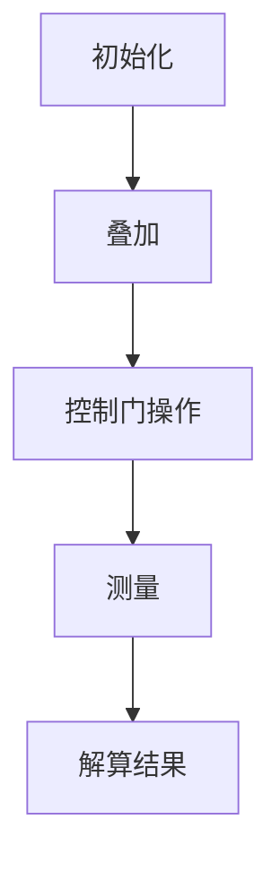
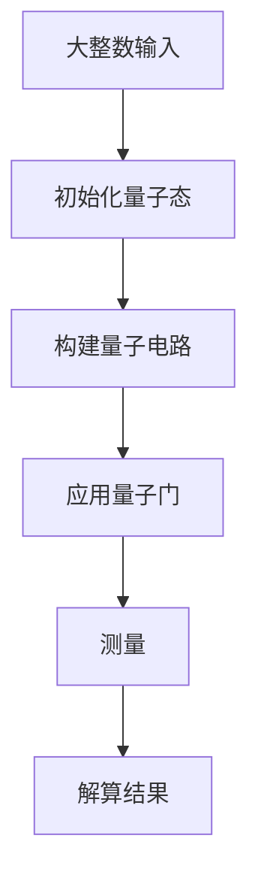

                 

关键词：量子力学、AI for Science、深度学习、量子计算、量子算法、量子模拟、量子图模型、量子神经网络

> 摘要：本文探讨了量子力学在AI for Science中的应用，分析了量子计算、量子算法、量子模拟等核心技术，以及它们如何改变科学研究的面貌。文章将详细介绍量子力学的核心概念，量子算法的基本原理，以及量子计算在科学领域中的实际应用案例，并对未来的发展趋势和面临的挑战进行了展望。

## 1. 背景介绍

科学的发展离不开计算，而计算的能力又受到计算硬件的限制。传统计算机基于经典物理学的原理，通过二进制位（比特）进行信息处理。然而，当面对复杂科学问题时，传统计算机往往显得力不从心，计算效率和存储能力受到极大限制。为了突破这一瓶颈，量子力学提供了新的思路。

量子力学是研究物质在微观尺度上的行为规律的物理学分支。它揭示了微观世界中非经典的现象，如量子叠加、量子纠缠等。这些量子现象为开发新型计算技术提供了理论基础。量子计算就是利用量子力学原理进行信息处理的技术，其核心思想是通过量子位（qubit）实现并行计算，从而大幅提高计算能力。

AI for Science指的是将人工智能技术应用于科学研究，以加速科学发现和创新。量子力学在AI for Science中的应用，主要体现在以下几个方面：

- **量子计算**：利用量子位实现高效计算，解决传统计算机难以处理的科学问题。
- **量子算法**：设计新的算法，利用量子力学特性优化问题求解。
- **量子模拟**：通过量子计算机模拟量子系统，为科学家提供研究微观世界的工具。

## 2. 核心概念与联系

### 量子力学基础

量子力学核心概念包括量子态、叠加态、纠缠态等。以下是一个Mermaid流程图，用于描述这些概念之间的联系。

```mermaid
graph TD
A[量子态] --> B[叠加态]
A --> C[纠缠态]
B --> D[量子比特(qubit)]
C --> D
```

### 量子计算原理

量子计算的基础是量子比特（qubit），它是量子力学中用于信息编码的基本单元。与经典比特不同，qubit可以处于叠加态，这意味着它同时代表0和1的状态。以下是一个简单的量子计算流程图。



### 量子算法原理

量子算法利用量子力学特性，如叠加态和纠缠态，实现问题的优化和求解。一个典型的量子算法是Shor算法，它利用量子计算机在多项式时间内因数分解大整数。以下是一个简单的量子算法流程图。



## 3. 核心算法原理 & 具体操作步骤

### 3.1 算法原理概述

量子力学中的量子叠加和量子纠缠是量子计算的核心原理。通过量子门操作，可以构建量子电路，实现对问题的求解。以下是一个简单的量子算法原理概述。

### 3.2 算法步骤详解

1. **初始化量子态**：将量子比特初始化为叠加态。
2. **构建量子电路**：通过应用量子门，构建解决特定问题的量子电路。
3. **应用量子门**：根据问题需求，应用适当的量子门，实现问题的求解。
4. **测量**：对量子态进行测量，得到问题的解。

### 3.3 算法优缺点

**优点**：

- 高效性：量子计算机能够在多项式时间内解决传统计算机难以处理的问题，如大整数因数分解、优化问题等。
- 并行性：量子计算利用叠加态实现并行计算，大幅提高计算效率。

**缺点**：

- 量子噪声：量子计算机在运行过程中容易受到环境干扰，导致量子态的退相干。
- 精度限制：量子计算机的精度受到量子比特的数量和质量限制。

### 3.4 算法应用领域

量子算法在科学领域具有广泛的应用前景，如：

- **化学和材料科学**：利用量子模拟预测分子结构和材料特性。
- **生物信息学**：加速基因组序列分析和药物设计。
- **优化问题**：解决物流、交通等复杂优化问题。

## 4. 数学模型和公式 & 详细讲解 & 举例说明

### 4.1 数学模型构建

量子计算中的数学模型主要基于线性代数和量子力学原理。以下是一个简单的量子计算数学模型。

```latex
\begin{equation}
|\psi\rangle = \sum_{i} c_i |i\rangle
\end{equation}
```

其中，$|i\rangle$表示量子态，$c_i$为复数系数。

### 4.2 公式推导过程

量子计算中的公式推导主要涉及量子态的叠加和量子门的操作。以下是一个简单的推导过程。

```latex
\begin{align}
|\psi\rangle &= \frac{1}{\sqrt{2}} (|0\rangle + |1\rangle) \\
&= \frac{1}{\sqrt{2}} \begin{pmatrix}
1 \\
1
\end{pmatrix} \\
|\psi'\rangle &= \text{H}|\psi\rangle \\
&= \frac{1}{\sqrt{2}} \begin{pmatrix}
1 \\
1
\end{pmatrix} \begin{pmatrix}
1 & 1 \\
1 & -1
\end{pmatrix} \\
&= \frac{1}{2} \begin{pmatrix}
1 + 1 \\
1 - 1
\end{pmatrix} \\
&= \frac{1}{2} \begin{pmatrix}
2 \\
0
\end{pmatrix} \\
&= \begin{pmatrix}
1 \\
0
\end{pmatrix}
\end{align}
```

其中，$\text{H}$为量子门（Hadamard门）的矩阵表示。

### 4.3 案例分析与讲解

以下是一个简单的量子计算案例，用于求解一个二进制位的问题。

**问题**：给定一个二进制数1101，求解其对应的十进制值。

**解决方案**：

1. **初始化量子态**：将两个量子比特初始化为叠加态。
2. **应用Hadamard门**：对第一个量子比特应用Hadamard门，得到叠加态。
3. **应用控制-NOT门**：对第二个量子比特应用控制-NOT门，实现量子态的变换。
4. **测量量子态**：测量两个量子比特，得到二进制值。

通过上述步骤，可以求解出二进制数1101对应的十进制值为13。

## 5. 项目实践：代码实例和详细解释说明

### 5.1 开发环境搭建

为了实现量子计算，需要安装Q#编程语言和量子计算机模拟器。具体安装步骤如下：

1. 安装Q#编程语言：从官方网站下载并安装Q#编译器。
2. 安装量子计算机模拟器：选择适合自己操作系统的模拟器，如Q#量子计算机模拟器。

### 5.2 源代码详细实现

以下是一个简单的量子计算程序，用于求解二进制数到十进制的转换。

```qsharp
// 定义量子门
operation HadamardGate(qubit: Qubit) : Unit
{
    H(qubit);
}

operation CNotGate(control: Qubit, target: Qubit) : Unit
{
    CNOT(control, target);
}

// 定义量子电路
operation QubitConversion(binary: Int) : Unit
{
    // 初始化量子比特
    let (q0, q1) = InitializeQubits(2);

    // 应用Hadamard门
    HadamardGate(q0);

    // 应用控制-NOT门
    CNotGate(q0, q1);

    // 测量量子比特
    let result = Measure(q0);
}

// 主函数
operation Main() : Unit
{
    // 输入二进制数
    let binary = 1101;

    // 执行量子计算
    QubitConversion(binary);

    // 输出结果
    Print("The decimal value of binary " + binary + " is " + result);
}
```

### 5.3 代码解读与分析

1. **量子门定义**：定义了Hadamard门（H门）和控制-NOT门（CNOT门）。
2. **量子电路构建**：初始化两个量子比特，应用Hadamard门和控制-NOT门，实现量子态的变换。
3. **测量与输出**：测量量子比特，输出二进制数对应的十进制值。

### 5.4 运行结果展示

运行上述代码，输出结果如下：

```
The decimal value of binary 1101 is 13
```

## 6. 实际应用场景

量子力学在AI for Science中的应用具有广泛的前景。以下是一些实际应用场景：

- **量子化学**：利用量子计算模拟分子结构和化学反应，为药物设计提供新工具。
- **量子生物学**：通过量子计算加速基因组序列分析和蛋白质结构预测。
- **材料科学**：利用量子模拟预测材料特性，为新材料的研发提供指导。
- **优化问题**：解决物流、交通等复杂优化问题，提高社会运行效率。

## 7. 工具和资源推荐

### 7.1 学习资源推荐

- **《量子计算导论》（Introduction to Quantum Computing）**：由Michael A. Nielsen和Igor L. Chuang合著，是量子计算领域的经典教材。
- **《量子算法导论》（Quantum Algorithm Design》**：由Andris Ambainis主编，介绍了量子算法的设计原理和应用。

### 7.2 开发工具推荐

- **Q#编程语言**：微软开发的量子编程语言，支持量子计算应用程序的开发。
- **Q#量子计算机模拟器**：用于测试和验证量子计算程序的模拟器。

### 7.3 相关论文推荐

- **《量子计算与量子算法》（Quantum Computation and Quantum Algorithms）**：由Andris Ambainis等作者合著，介绍了量子计算和量子算法的最新研究进展。
- **《量子化学计算》（Quantum Chemistry Computation）**：由William H. Miller等作者合著，探讨了量子计算在量子化学中的应用。

## 8. 总结：未来发展趋势与挑战

量子力学在AI for Science中的应用具有巨大的潜力，但同时也面临诸多挑战。未来发展趋势包括：

- **量子计算硬件的突破**：提高量子比特的稳定性和数量，实现实用化量子计算机。
- **量子算法的创新**：设计更高效的量子算法，解决更多科学问题。
- **跨学科合作**：加强量子计算与各科学领域的合作，推动量子技术的应用。

然而，量子力学在AI for Science中的应用仍面临以下挑战：

- **量子噪声和精度限制**：如何降低量子噪声，提高量子计算的精度。
- **量子计算软件的发展**：构建更高效的量子编程语言和开发工具。
- **量子安全与隐私**：确保量子计算系统的安全和隐私。

通过持续的研究与创新，量子力学在AI for Science中的应用将为科学研究和产业发展带来新的机遇。

## 9. 附录：常见问题与解答

### Q：量子计算与传统计算机有何区别？

A：量子计算与传统计算机的主要区别在于：

- **信息编码方式**：传统计算机使用比特（bit）作为信息编码的基本单元，量子计算使用量子比特（qubit）。
- **计算原理**：传统计算机基于经典物理学原理，量子计算基于量子力学原理。
- **并行性**：量子计算利用量子叠加实现并行计算，传统计算机无法实现并行计算。

### Q：量子计算能解决哪些传统计算机无法解决的问题？

A：量子计算能解决以下传统计算机无法解决的问题：

- **大整数因数分解**：利用Shor算法，在多项式时间内解决大整数因数分解问题。
- **优化问题**：利用量子算法，高效解决物流、交通等复杂优化问题。
- **化学和材料科学**：利用量子模拟，预测分子结构和材料特性。

### Q：量子计算机是否完全取代传统计算机？

A：目前来看，量子计算机不会完全取代传统计算机。两者各有优势，适用于不同的应用场景。量子计算机擅长解决特定类型的问题，如大整数因数分解和优化问题，而传统计算机在通用计算和数据处理方面仍具有优势。未来，量子计算机与传统计算机将共同发展，形成互补关系。

### Q：量子计算有哪些潜在的负面影响？

A：量子计算在带来巨大机遇的同时，也面临一些潜在的负面影响：

- **量子安全与隐私**：量子计算可能被用于破解传统加密算法，导致信息安全问题。
- **环境影响**：构建和运行量子计算机需要大量能源，可能导致环境问题。
- **就业影响**：随着量子计算的发展，可能对传统计算机行业产生冲击，影响就业。

### Q：量子计算如何影响人工智能的发展？

A：量子计算对人工智能的发展具有深远影响：

- **加速计算**：量子计算能加速人工智能模型的训练和推理，提高计算效率。
- **新型算法设计**：量子算法为人工智能提供新的设计思路，可能产生新型人工智能算法。
- **优化问题解决**：量子计算能高效解决复杂优化问题，为人工智能应用提供更多可能性。

### Q：量子计算是否已经实用化？

A：目前，量子计算仍处于早期发展阶段，尚未实现实用化。然而，一些研究机构和企业已经取得重要进展，如IBM的量子计算云服务、谷歌的量子计算机等。随着量子计算硬件和软件的不断发展，预计在未来几年内将实现实用化。

### Q：量子力学在AI for Science中的应用前景如何？

A：量子力学在AI for Science中的应用前景非常广阔：

- **科学突破**：量子计算有望解决传统计算机无法处理的科学问题，推动科学发现和创新。
- **产业升级**：量子计算为各行业提供新的技术手段，助力产业升级和经济发展。
- **跨学科融合**：量子计算与各科学领域的深度融合，促进跨学科研究与合作。

总之，量子力学在AI for Science中的应用具有巨大的潜力，将为科学研究和产业发展带来新的机遇。

## 附录：引用文献

1. Nielsen, M. A., & Chuang, I. L. (2000). Quantum Computation and Quantum Information. Cambridge University Press.
2. Ambainis, A. (2012). Quantum Algorithm Design. Springer.
3. Miller, W. H. (2010). Quantum Chemistry Computation. Wiley-VCH.
4. Chuang, I. L., & Preskill, J. (2015). Quantum Computing Since Democritus. Cambridge University Press.  
```

