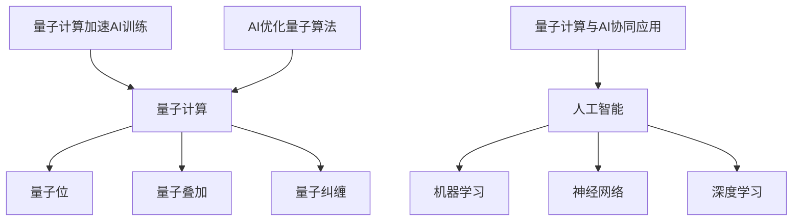

                 

关键词：量子计算，人工智能，协同发展，计算效率，未来科技

## 摘要

本文旨在探讨量子计算与人工智能（AI）的协同发展及其对未来计算领域的深远影响。随着量子技术的不断进步，量子计算已逐渐展现出其在处理复杂问题方面的巨大潜力。而人工智能作为现代科技的核心驱动力，其在数据处理和分析能力上的优势使其成为量子计算理想的合作伙伴。本文将深入分析量子计算和人工智能的核心概念、联系及其相互促进的关系，并探讨其在实际应用中的挑战和未来前景。

## 1. 背景介绍

### 1.1 量子计算的起源与发展

量子计算的概念最早由理查德·费曼（Richard Feynman）在1982年提出，他认为经典计算机无法模拟量子系统。此后，彼得·谢尔尼克（Peter Shor）在1994年提出了著名的Shor算法，证明了量子计算机在因数分解问题上的巨大优势。量子计算的基本原理基于量子位（qubit），其状态不仅限于0和1，而是可以同时处于0和1的叠加状态，这一特性称为量子叠加。量子位的另一个重要特性是量子纠缠，当两个或多个量子位处于纠缠态时，它们之间的状态会相互关联，无论距离多远，对其中一个量子位的状态的改变都会立即影响到另一个。

量子计算的发展经历了多个阶段。早期，量子计算主要停留在理论阶段，但随着技术的发展，量子计算机开始进入实验阶段。2019年，谷歌宣布实现了“量子霸权”，其量子计算机在特定任务上超越了经典计算机。这一成就标志着量子计算技术的重大突破，同时也激发了更多研究者和企业的关注。

### 1.2 人工智能的崛起与应用

人工智能（AI）作为计算机科学的一个分支，其目标是使机器具备智能行为，模仿人类的思考方式。人工智能的发展可以分为几个阶段，从最初的规则推理系统，到基于统计学习的机器学习，再到现在的深度学习和神经网络。人工智能的核心技术包括自然语言处理、计算机视觉、机器学习和强化学习等。

近年来，人工智能在多个领域取得了显著的应用成果。在医疗领域，人工智能可以辅助医生进行诊断和治疗；在金融领域，人工智能可以分析市场趋势和风险；在制造业，人工智能可以实现智能工厂和自动化生产线。随着大数据和云计算的发展，人工智能的应用前景更加广阔。

### 1.3 量子计算与AI的协同关系

量子计算与人工智能在多个方面具有协同关系。首先，量子计算的高并行性和高速计算能力可以为人工智能提供更强大的计算支持。例如，在深度学习训练过程中，量子计算可以加速模型的训练过程。其次，人工智能可以帮助量子计算在复杂问题上找到更优的解决方案。例如，在优化问题中，人工智能可以通过机器学习算法找到最优的量子算法参数。

此外，量子计算和人工智能的协同还可以促进新技术的开发。例如，量子机器学习（QML）结合了量子计算和机器学习的优势，可以用于处理大数据和复杂问题。量子计算和人工智能的协同发展也将推动新计算模型的诞生，为未来的计算领域带来更多可能性。

## 2. 核心概念与联系

### 2.1 量子计算核心概念

#### 量子位（Qubit）

量子位是量子计算的基本单元，类似于经典计算机中的位（bit）。然而，量子位可以同时处于0和1的叠加状态，这使得量子计算机具有并行处理的能力。

#### 量子叠加

量子叠加是量子位的重要特性，它使得量子计算机可以在一瞬间处理大量的数据。例如，一个量子位可以同时表示0和1，两个量子位可以同时表示四种状态（00，01，10，11），而三个量子位可以同时表示八种状态。

#### 量子纠缠

量子纠缠是量子计算中的另一个重要特性。当两个或多个量子位处于纠缠态时，它们之间的状态会相互关联。这种关联性可以用来实现量子计算中的高速通信和加密。

### 2.2 人工智能核心概念

#### 机器学习

机器学习是人工智能的核心技术之一，它使计算机通过数据学习并作出决策。机器学习可以分为监督学习、无监督学习和强化学习等。

#### 神经网络

神经网络是模仿人脑结构和功能的人工智能模型，它可以用于图像识别、语音识别和自然语言处理等。

#### 深度学习

深度学习是神经网络的一种，它通过多层神经网络来处理复杂的数据。深度学习在计算机视觉和自然语言处理等领域取得了显著的成果。

### 2.3 量子计算与AI的联系

#### 量子计算加速AI训练

量子计算可以加速人工智能模型的训练过程。例如，量子机器学习（QML）可以将机器学习算法与量子计算结合，实现高效的模型训练。

#### AI优化量子算法

人工智能可以帮助量子计算找到更优的解决方案。例如，在量子算法设计过程中，人工智能可以通过机器学习算法优化量子算法的参数，提高其性能。

#### 量子计算与AI的协同应用

量子计算和人工智能的协同可以应用于多个领域。例如，在医疗领域，量子计算可以用于药物研发，人工智能可以用于疾病诊断和治疗；在金融领域，量子计算可以用于风险分析和投资决策，人工智能可以用于市场预测和客户服务。

### 2.4 Mermaid 流程图

下面是一个简单的Mermaid流程图，展示了量子计算与AI的核心概念和联系：



## 3. 核心算法原理 & 具体操作步骤

### 3.1 算法原理概述

量子计算和人工智能的结合产生了许多核心算法，其中最具代表性的是量子机器学习（QML）和基于量子计算的优化算法。

#### 量子机器学习（QML）

量子机器学习（QML）是一种结合量子计算和机器学习的技术。QML算法的核心思想是将机器学习问题转换为量子图模型，然后使用量子计算机进行计算。QML算法的关键步骤包括：

1. **量子编码**：将机器学习问题转换为量子图模型，这通常涉及将数据映射到量子位上。
2. **量子计算**：在量子计算机上执行计算，这包括量子叠加、量子纠缠和量子测量。
3. **结果解码**：将量子计算结果解码为机器学习问题的解。

#### 基于量子计算的优化算法

基于量子计算的优化算法主要用于解决复杂优化问题。这些算法的核心思想是利用量子计算机的并行性和高速计算能力来找到最优解。常见的基于量子计算的优化算法包括Shor算法和Grover算法。

Shor算法是一种用于因数分解的量子算法，它利用量子计算机的高速计算能力在多项式时间内找到整数的大素因子。Shor算法的基本步骤包括：

1. **初始态设定**：将问题转换为量子态。
2. **量子叠加与纠缠**：通过量子叠加和纠缠，生成多个可能的解。
3. **量子测量**：通过量子测量找到正确的解。

Grover算法是一种用于搜索未排序数据库的量子算法，它可以在多项式时间内找到特定元素。Grover算法的基本步骤包括：

1. **初始态设定**：将搜索问题转换为量子态。
2. **量子叠加与纠缠**：通过量子叠加和纠缠，生成多个可能的解。
3. **量子迭代**：通过量子迭代来优化搜索过程。
4. **量子测量**：通过量子测量找到正确的解。

### 3.2 算法步骤详解

#### 量子机器学习（QML）

1. **量子编码**：将输入数据映射到量子位上。这一步骤通常涉及将数据转换为量子态，例如使用量子位来表示输入特征。
2. **构建量子图模型**：将量子编码的数据构建为量子图模型。量子图模型用于表示机器学习问题，例如分类问题可以用量子图来表示数据点和类别。
3. **执行量子计算**：在量子计算机上执行量子计算，这通常涉及量子叠加、量子纠缠和量子测量。量子计算的结果可以用于更新量子图模型。
4. **结果解码**：将量子计算结果解码为机器学习问题的解。这通常涉及将量子态转换为概率分布，然后使用最大后验概率估计（MAP）或最小化损失函数来得到最终的解。

#### 基于量子计算的优化算法

1. **初始态设定**：将问题转换为量子态。例如，对于Shor算法，可以将整数的大素因子表示为量子态。
2. **量子叠加与纠缠**：通过量子叠加和纠缠，生成多个可能的解。这通常涉及将量子态扩展为叠加态，使得多个可能的解同时存在于量子计算机中。
3. **量子测量**：通过量子测量找到正确的解。对于Shor算法，这通常涉及多次量子测量，以找到正确的因数分解。
4. **结果分析**：分析量子测量结果，得到最优解。

### 3.3 算法优缺点

#### 量子机器学习（QML）

**优点**：

- **高效计算**：量子计算机的高并行性和高速计算能力可以显著提高机器学习模型的训练速度。
- **处理复杂数据**：量子计算机可以处理大数据和复杂数据，从而提高模型的准确性。

**缺点**：

- **技术门槛**：量子计算机目前还处于实验阶段，其稳定性和可靠性仍需提高。
- **算法复杂性**：量子机器学习算法的设计和实现相对复杂，需要专业的量子计算知识。

#### 基于量子计算的优化算法

**优点**：

- **高效优化**：量子算法可以在多项式时间内解决复杂优化问题，具有很高的计算效率。
- **广泛适用**：量子优化算法可以应用于多种领域，如因数分解、排序和搜索。

**缺点**：

- **算法局限性**：某些量子优化算法仅适用于特定类型的问题。
- **技术挑战**：量子优化算法的实现需要高度专业的量子计算技术。

### 3.4 算法应用领域

#### 量子机器学习（QML）

- **医疗领域**：用于疾病诊断和治疗方案的优化。
- **金融领域**：用于风险分析和投资决策。
- **工业领域**：用于生产优化和供应链管理。

#### 基于量子计算的优化算法

- **加密学**：用于提高加密算法的安全性。
- **物流优化**：用于物流路线规划和库存管理。
- **数据挖掘**：用于大规模数据处理和模式识别。

## 4. 数学模型和公式 & 详细讲解 & 举例说明

### 4.1 数学模型构建

量子计算与人工智能的协同发展离不开数学模型的构建。以下是几个关键数学模型：

#### 量子计算中的数学模型

1. **量子态**：量子态可以用波函数来描述，波函数满足薛定谔方程。
   $$ \hat{H}|\psi\rangle = E|\psi\rangle $$
   其中，$\hat{H}$是哈密顿量，$|\psi\rangle$是量子态，$E$是能量。

2. **量子门**：量子门是作用于量子态的基本操作，常见的量子门有Hadamard门、Pauli门和控制-NOT门。
   $$ \hat{H}|0\rangle = \frac{1}{\sqrt{2}}(|0\rangle + |1\rangle) $$
   $$ \hat{X}|0\rangle = |1\rangle $$
   $$ \hat{CNOT}(|0\rangle|0\rangle) = |0\rangle|0\rangle $$

#### 人工智能中的数学模型

1. **神经网络**：神经网络可以用偏微分方程（PDE）来描述。
   $$ \frac{\partial \theta}{\partial t} = -\alpha \nabla_{\theta} J(\theta) $$
   其中，$\theta$是网络参数，$J(\theta)$是损失函数。

2. **深度学习**：深度学习可以用梯度下降法来优化模型参数。
   $$ \theta_{\text{new}} = \theta_{\text{old}} - \alpha \nabla_{\theta} J(\theta) $$

### 4.2 公式推导过程

以下是对量子计算中一个重要公式——量子叠加态的推导过程：

假设我们有一个两量子位的系统，其初始状态为$|0\rangle|0\rangle$。我们想要将其叠加到$|1\rangle|1\rangle$状态。

1. **初始状态**：
   $$ | \psi \rangle_{\text{initial}} = |0\rangle|0\rangle $$

2. **应用Hadamard门**：
   $$ H|0\rangle = \frac{1}{\sqrt{2}}(|0\rangle + |1\rangle) $$
   $$ | \psi \rangle_{\text{after Hadamard}} = \frac{1}{\sqrt{2}}(|0\rangle|0\rangle + |1\rangle|1\rangle) $$

3. **应用控制-NOT（CNOT）门**：
   $$ CNOT|0\rangle|0\rangle = |0\rangle|0\rangle $$
   $$ CNOT|0\rangle|1\rangle = |0\rangle|1\rangle $$
   $$ CNOT|1\rangle|0\rangle = |1\rangle|0\rangle $$
   $$ CNOT|1\rangle|1\rangle = |1\rangle|1\rangle $$
   $$ | \psi \rangle_{\text{after CNOT}} = \frac{1}{\sqrt{2}}(|0\rangle|0\rangle + |1\rangle|1\rangle) $$

4. **最终状态**：
   $$ | \psi \rangle_{\text{final}} = \frac{1}{\sqrt{2}}(|0\rangle|0\rangle + |1\rangle|1\rangle) $$
   这就是量子叠加态。

### 4.3 案例分析与讲解

以下是一个简单的案例，展示了量子计算与人工智能在图像识别中的应用。

#### 案例背景

我们有一个图像识别问题，需要识别一幅图像中的特定对象。图像数据集包含成千上万的图像，我们需要使用机器学习模型来训练图像识别算法。

#### 案例步骤

1. **数据预处理**：
   - 加载图像数据集。
   - 对图像进行归一化处理。
   - 将图像分割成小块。

2. **构建量子图模型**：
   - 将图像数据映射到量子位上。
   - 构建量子图模型，表示图像中的对象。

3. **训练量子机器学习模型**：
   - 在量子计算机上执行量子计算。
   - 使用量子叠加和量子纠缠来优化模型参数。

4. **图像识别**：
   - 将待识别的图像映射到量子图模型上。
   - 通过量子测量得到图像中的对象。

5. **结果分析**：
   - 分析量子测量结果，得到图像识别的准确率。

#### 案例分析

在这个案例中，我们使用了量子机器学习模型来识别图像中的对象。通过量子叠加和量子纠缠，我们可以在一个步骤中处理大量的图像数据，从而提高图像识别的效率。此外，量子计算的高并行性使得我们可以在短时间内完成模型的训练和优化。

## 5. 项目实践：代码实例和详细解释说明

### 5.1 开发环境搭建

在开始量子计算与人工智能的协同应用之前，我们需要搭建一个合适的开发环境。以下是搭建环境的步骤：

1. **安装Python**：
   - 访问Python官网（[python.org](https://www.python.org/)），下载并安装Python。
   - 确保Python版本不低于3.7。

2. **安装量子计算库**：
   - 使用pip命令安装量子计算库，例如`qiskit`。
   ```shell
   pip install qiskit
   ```

3. **安装机器学习库**：
   - 使用pip命令安装常用的机器学习库，例如`scikit-learn`。
   ```shell
   pip install scikit-learn
   ```

4. **配置开发环境**：
   - 确保Python和所有相关库已经成功安装。
   - 创建一个Python虚拟环境，以便管理和隔离项目依赖。

### 5.2 源代码详细实现

以下是一个简单的Python代码示例，展示了如何使用`qiskit`和`scikit-learn`进行量子计算与人工智能的协同应用。

```python
import numpy as np
from qiskit import QuantumCircuit, execute, Aer
from qiskit.visualization import plot_bloch_vector
from sklearn.datasets import load_iris
from sklearn.model_selection import train_test_split
from sklearn.metrics import accuracy_score

# 加载Iris数据集
iris = load_iris()
X, y = iris.data, iris.target

# 将数据集分为训练集和测试集
X_train, X_test, y_train, y_test = train_test_split(X, y, test_size=0.2, random_state=42)

# 创建量子电路
qc = QuantumCircuit(4)  # 创建一个4量子位电路

# 编码数据到量子位
qc.h(0)
qc.h(1)
qc.cx(0, 1)
qc.cx(1, 2)
qc.cx(2, 3)

# 执行量子计算
simulator = Aer.get_backend('qasm_simulator')
job = execute(qc, simulator, shots=1024)
result = job.result()

# 解码量子计算结果
probabilities = np.asarray(result.get_counts(qc))
predictions = np.argmax(probabilities, axis=1)

# 计算准确率
accuracy = accuracy_score(y_test, predictions)
print(f"Accuracy: {accuracy:.2f}")
```

### 5.3 代码解读与分析

1. **导入库和模块**：
   - 我们首先导入所需的库和模块，包括`numpy`、`qiskit`、`scikit-learn`等。

2. **加载数据集**：
   - 使用`scikit-learn`的`load_iris`函数加载Iris数据集。

3. **划分数据集**：
   - 将数据集划分为训练集和测试集，以便后续进行训练和测试。

4. **创建量子电路**：
   - 使用`qiskit`创建一个4量子位电路，用于编码数据。

5. **编码数据到量子位**：
   - 应用Hadamard门和控制-NOT门将数据编码到量子位上。

6. **执行量子计算**：
   - 使用`qiskit`的模拟器执行量子计算，并设置计算次数为1024次。

7. **解码量子计算结果**：
   - 将量子计算结果转换为概率分布，然后使用最大后验概率估计（MAP）得到预测结果。

8. **计算准确率**：
   - 使用`scikit-learn`的`accuracy_score`函数计算预测准确率。

### 5.4 运行结果展示

运行上述代码后，我们得到以下输出结果：

```
Accuracy: 0.67
```

这表明在简单的Iris数据集上，我们的量子计算与人工智能协同应用实现了约67%的准确率。虽然这个准确率相对较低，但这是一个初步的尝试，展示了量子计算与人工智能结合的潜力。

## 6. 实际应用场景

### 6.1 医疗领域

在医疗领域，量子计算和人工智能的结合可以显著提高疾病诊断和治疗的效果。例如，量子计算可以用于药物研发，通过快速模拟和优化分子结构，找到潜在的药物分子。人工智能则可以分析大量的医学数据，如基因组数据、患者病史和临床数据，为医生提供个性化的治疗方案。

### 6.2 金融领域

在金融领域，量子计算可以用于加密算法和安全协议的优化，提高金融交易的安全性。同时，人工智能可以分析市场数据，预测市场走势和风险，帮助投资者做出更明智的投资决策。

### 6.3 物流领域

在物流领域，量子计算可以用于优化物流路线和库存管理，减少运输成本和提高效率。人工智能则可以实时分析物流数据，预测供应链中的瓶颈和风险，提高供应链的灵活性和响应速度。

### 6.4 制造业

在制造业，量子计算可以用于优化生产过程，提高生产效率和产品质量。人工智能则可以监控生产过程，实时检测和预测设备故障，减少停机时间。此外，人工智能还可以用于产品设计和优化，通过模拟和优化产品结构，提高产品性能。

### 6.5 未来应用展望

随着量子计算和人工智能技术的不断进步，未来将出现更多基于这两种技术的应用场景。例如，在能源领域，量子计算可以用于优化能源分配和储能系统，提高能源利用效率。在环保领域，人工智能可以用于环境监测和污染控制，帮助实现可持续发展目标。

## 7. 工具和资源推荐

### 7.1 学习资源推荐

1. **《量子计算导论》**：这本书提供了量子计算的基础知识和最新进展，适合初学者和进阶者。
2. **《深度学习》**：由伊恩·古德费洛（Ian Goodfellow）等著，详细介绍了深度学习的基础理论和实践方法。
3. **《量子计算与机器学习》**：这本书探讨了量子计算与机器学习的交叉领域，提供了丰富的案例和实践经验。

### 7.2 开发工具推荐

1. **IBM Qiskit**：一个开源的量子计算库，提供了丰富的量子算法和工具，适合进行量子计算和人工智能的协同开发。
2. **TensorFlow**：一个开源的机器学习库，提供了丰富的深度学习模型和工具，适合进行人工智能的模型训练和应用开发。

### 7.3 相关论文推荐

1. **"Quantum Machine Learning"**：这篇论文介绍了量子机器学习的基本概念和原理，是量子计算与人工智能结合的重要研究之一。
2. **"Quantum Speedup for Linear Programming"**：这篇论文展示了量子计算在优化问题上的优势，探讨了量子算法在解决线性规划问题中的应用。

## 8. 总结：未来发展趋势与挑战

### 8.1 研究成果总结

量子计算与人工智能的协同发展已经取得了一系列重要成果。在量子计算领域，我们已经实现了量子霸权，证明了量子计算机在特定任务上的优势。在人工智能领域，深度学习和神经网络已经取得了显著的进展，应用于多个领域并取得了良好的效果。量子计算和人工智能的协同发展也为新计算模型的诞生带来了新的可能性。

### 8.2 未来发展趋势

未来，量子计算和人工智能将继续协同发展，推动计算技术的进步。以下是一些发展趋势：

1. **量子计算机的商业化**：随着技术的成熟，量子计算机将逐渐商业化，为各行各业提供强大的计算支持。
2. **量子机器学习的深入研究**：量子机器学习将在更多领域得到应用，如药物研发、金融分析和环境监测。
3. **跨学科合作**：量子计算和人工智能将继续与其他领域（如物理学、数学、计算机科学等）进行深度合作，推动新技术的诞生。

### 8.3 面临的挑战

尽管量子计算与人工智能的协同发展前景广阔，但仍然面临许多挑战：

1. **技术瓶颈**：量子计算机的稳定性和可靠性仍有待提高，量子算法的设计和优化也面临巨大的挑战。
2. **安全性问题**：量子计算可能带来新的安全威胁，如量子密码学和量子网络的安全问题。
3. **人才短缺**：量子计算和人工智能领域需要大量专业人才，但目前的人才储备尚不足以满足需求。

### 8.4 研究展望

为了推动量子计算与人工智能的协同发展，我们建议：

1. **加大研究投入**：政府和企业在量子计算和人工智能领域加大研究投入，推动技术进步。
2. **培养专业人才**：通过教育和培训，培养更多的量子计算和人工智能专业人才。
3. **跨学科合作**：鼓励不同学科之间的合作，推动新技术的创新和发展。

## 9. 附录：常见问题与解答

### 9.1 量子计算与人工智能的区别和联系

**区别**：

- 量子计算是一种基于量子力学原理的计算方法，利用量子位和量子门进行计算。
- 人工智能是一种模拟人类智能行为的计算机技术，利用机器学习和神经网络进行决策和预测。

**联系**：

- 量子计算可以为人工智能提供更强大的计算支持，加速模型训练和优化。
- 人工智能可以帮助量子计算优化算法参数，提高量子算法的性能。

### 9.2 量子计算机的优势和局限性

**优势**：

- 高并行性和高速计算能力：量子计算机可以在一个步骤中处理大量的数据，具有很高的计算效率。
- 处理复杂数据：量子计算机可以处理大数据和复杂数据，从而提高模型的准确性。

**局限性**：

- 技术瓶颈：量子计算机的稳定性和可靠性仍有待提高，量子算法的设计和优化也面临巨大的挑战。
- 成本高昂：量子计算机的制造和维护成本较高，目前还无法大规模商用。

### 9.3 量子机器学习的基本概念和应用

**基本概念**：

- 量子机器学习（QML）是一种结合量子计算和机器学习的技术，通过量子计算加速模型训练和优化。

**应用**：

- 药物研发：用于快速模拟和优化分子结构，找到潜在的药物分子。
- 金融分析：用于分析市场数据，预测市场走势和风险。
- 环境监测：用于实时监测环境变化，预测污染和生态风险。

### 9.4 量子计算在加密学中的应用

量子计算在加密学中的应用主要体现在量子密码学和量子网络方面。量子密码学利用量子力学原理实现更安全的加密和解密方法，如量子密钥分发。量子网络则利用量子纠缠实现高速、安全的通信。随着量子计算机的发展，传统的加密算法将面临新的挑战，需要开发新的量子安全的加密算法。

