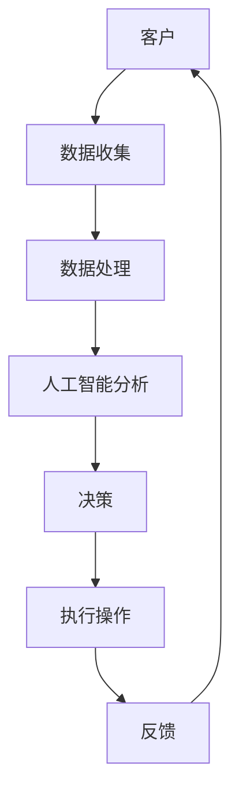

                 

关键词：金融科技、创业公司、监管挑战、创新、机遇

## 摘要

本文旨在探讨金融科技创新对创业公司带来的机遇和监管挑战。随着金融科技的快速发展，创业公司得以利用新技术推出创新产品和服务，从而获得市场先机。然而，金融科技的创新也带来了监管的挑战，如何在保障金融安全与鼓励创新之间取得平衡成为关键问题。本文将分析金融科技创新的现状，探讨创业公司在金融科技领域的成功案例，并讨论如何应对监管挑战，以实现可持续发展。

## 1. 背景介绍

### 1.1 金融科技的发展背景

金融科技，简称FinTech，是指利用技术创新，特别是信息技术创新，来改进或创造新的金融服务。随着互联网、大数据、人工智能等技术的飞速发展，金融科技在近年来得到了广泛关注和快速发展。根据普华永道（PwC）的报告，金融科技在全球范围内的投资已经超过1600亿美元，并且预计未来还将继续增长。

金融科技的创新主要表现在以下几个方面：

- **支付与转账**：移动支付、区块链支付、跨境支付等，使得支付变得更加便捷和快速。
- **信贷与借贷**：通过大数据分析和人工智能技术，提供更加精准和个性化的信贷服务。
- **财富管理**：智能投资顾问、自动化交易系统等，帮助用户更高效地管理财富。
- **保险**：利用大数据和人工智能进行风险评估，提供个性化的保险产品和服务。

### 1.2 创业公司在金融科技领域的重要性

创业公司在金融科技领域的崛起，不仅带来了新的业务模式和商业模式，也推动了整个金融行业的变革。创业公司以其灵活性和创新性，能够迅速响应市场需求，推出具有前瞻性的产品和服务。例如，美国的PayPal、中国的蚂蚁金服和微众银行等，都是在金融科技领域取得显著成功的创业公司。

创业公司在金融科技领域的重要性主要体现在以下几个方面：

- **创新推动**：创业公司通常拥有更加创新的思维和商业模式，能够为金融市场带来新的活力。
- **市场响应**：创业公司能够更快速地适应市场变化，满足用户多样化的需求。
- **资源优化**：创业公司通过技术创新，提高了金融服务的效率，降低了成本。

## 2. 核心概念与联系

### 2.1 金融科技的核心概念

在探讨金融科技创新之前，首先需要了解金融科技的核心概念。以下是金融科技中一些关键的概念：

- **区块链**：一种去中心化的分布式账本技术，可以确保数据的透明性和安全性。
- **人工智能**：通过模拟人类智能行为，实现自动化决策和智能服务。
- **大数据**：海量数据的存储、管理和分析，以发现数据中的模式和关联性。
- **云计算**：通过互联网提供动态易扩展且经常是虚拟化的资源。

### 2.2 金融科技创新的架构

为了更好地理解金融科技创新，我们可以使用Mermaid流程图来描述其架构：



在这个流程图中，客户通过数据收集模块提供个人信息，数据经过处理和分析后，由人工智能模块进行决策，执行相应的操作，并收集反馈信息以优化服务。

## 3. 核心算法原理 & 具体操作步骤

### 3.1 算法原理概述

金融科技创新的核心在于利用算法进行数据处理、分析和决策。以下是几种常见的算法原理：

- **机器学习**：通过训练模型来识别数据中的模式和规律，用于预测和决策。
- **深度学习**：一种特殊的机器学习方法，通过多层神经网络来处理复杂的数据结构。
- **区块链共识算法**：确保区块链网络中的数据一致性和安全性。

### 3.2 算法步骤详解

#### 3.2.1 数据处理

数据处理是金融科技创新的基础。以下是数据处理的主要步骤：

1. **数据采集**：从各种渠道收集客户数据，如交易记录、社交媒体数据等。
2. **数据清洗**：去除无效数据和异常值，确保数据的准确性和完整性。
3. **数据整合**：将不同来源的数据进行整合，形成统一的数据视图。
4. **特征工程**：从原始数据中提取有意义的特征，用于算法训练和决策。

#### 3.2.2 人工智能分析

人工智能分析是金融科技创新的核心。以下是主要步骤：

1. **模型选择**：根据问题的性质选择合适的机器学习或深度学习模型。
2. **模型训练**：使用大量数据进行模型训练，优化模型参数。
3. **模型评估**：通过验证集和测试集评估模型性能，确保模型的有效性。
4. **模型部署**：将训练好的模型部署到生产环境中，进行实际应用。

#### 3.2.3 区块链共识算法

区块链共识算法确保区块链网络中的数据一致性和安全性。以下是主要步骤：

1. **节点选择**：在区块链网络中选择参与共识的节点。
2. **区块生成**：节点根据最新交易生成新的区块。
3. **区块验证**：其他节点验证区块的有效性。
4. **共识达成**：通过共识算法达成全网共识，将区块添加到区块链中。

### 3.3 算法优缺点

#### 3.3.1 机器学习

优点：

- **自动化决策**：能够自动处理大量数据，进行复杂决策。
- **高精度**：通过训练模型，可以实现高精度的预测和分类。

缺点：

- **对数据依赖性强**：模型性能高度依赖数据质量和数量。
- **解释性差**：模型决策过程往往缺乏透明性，难以解释。

#### 3.3.2 深度学习

优点：

- **处理复杂数据结构**：能够处理文本、图像、音频等多种复杂数据结构。
- **自动特征提取**：通过多层神经网络，自动提取数据中的特征。

缺点：

- **计算资源需求大**：深度学习模型通常需要大量的计算资源和时间进行训练。
- **模型解释性差**：与机器学习类似，深度学习模型的决策过程也缺乏透明性。

#### 3.3.3 区块链共识算法

优点：

- **去中心化**：确保区块链网络中的数据一致性和安全性，无需依赖中心化机构。
- **透明性**：所有节点都可以查看区块链上的数据，确保数据的透明性。

缺点：

- **计算资源消耗大**：共识算法通常需要大量的计算资源。
- **交易效率低**：在某些共识算法中，如比特币的PoW（工作量证明），交易效率较低。

### 3.4 算法应用领域

金融科技创新的算法广泛应用于多个领域，包括：

- **风险管理**：利用机器学习和深度学习模型进行风险预测和评估。
- **欺诈检测**：通过大数据分析和人工智能技术，实时监测和识别欺诈行为。
- **个人理财**：利用智能投资顾问和自动化交易系统，帮助用户管理财富。
- **供应链金融**：通过区块链技术，实现供应链中的金融交易和信用管理。

## 4. 数学模型和公式 & 详细讲解 & 举例说明

### 4.1 数学模型构建

在金融科技创新中，数学模型起着至关重要的作用。以下是几种常见的数学模型：

#### 4.1.1 线性回归模型

线性回归模型用于预测连续值。其公式如下：

\[ y = \beta_0 + \beta_1 \cdot x \]

其中，\( y \) 是因变量，\( x \) 是自变量，\( \beta_0 \) 和 \( \beta_1 \) 是模型参数。

#### 4.1.2 逻辑回归模型

逻辑回归模型用于预测离散值，如概率。其公式如下：

\[ P(y=1) = \frac{1}{1 + e^{-(\beta_0 + \beta_1 \cdot x)}} \]

其中，\( P(y=1) \) 是因变量为1的概率，其他符号含义同上。

#### 4.1.3 神经网络模型

神经网络模型用于处理复杂数据结构。其基本结构如下：

\[ z = \sigma(\beta_0 + \beta_1 \cdot x) \]

其中，\( z \) 是神经元的激活函数，\( \sigma \) 是激活函数，如Sigmoid函数。

### 4.2 公式推导过程

以下是对线性回归模型的公式推导过程：

#### 4.2.1 求导

对线性回归模型 \( y = \beta_0 + \beta_1 \cdot x \) 求导，得到：

\[ \frac{dy}{dx} = \beta_1 \]

#### 4.2.2 最小二乘法

使用最小二乘法求解模型参数。最小二乘法的思想是找到一组参数 \( \beta_0 \) 和 \( \beta_1 \)，使得实际值 \( y \) 与预测值 \( \hat{y} \) 之间的误差平方和最小。

\[ \min_{\beta_0, \beta_1} \sum_{i=1}^{n} (y_i - \hat{y_i})^2 \]

通过对 \( \beta_0 \) 和 \( \beta_1 \) 分别求偏导数，并令其等于0，可以得到：

\[ \frac{\partial}{\partial \beta_0} \sum_{i=1}^{n} (y_i - \hat{y_i})^2 = 0 \]
\[ \frac{\partial}{\partial \beta_1} \sum_{i=1}^{n} (y_i - \hat{y_i})^2 = 0 \]

化简后得到：

\[ \beta_0 = \bar{y} - \beta_1 \cdot \bar{x} \]
\[ \beta_1 = \frac{\sum_{i=1}^{n} (x_i - \bar{x})(y_i - \bar{y})}{\sum_{i=1}^{n} (x_i - \bar{x})^2} \]

其中，\( \bar{x} \) 和 \( \bar{y} \) 分别是 \( x \) 和 \( y \) 的均值。

### 4.3 案例分析与讲解

以下是一个使用线性回归模型进行房屋价格预测的案例：

#### 4.3.1 数据准备

假设我们有一组房屋数据，包括房屋面积（\( x \)）和房屋价格（\( y \））。数据如下：

| 房屋面积 \( x \) | 房屋价格 \( y \) |
|-----------------|-----------------|
|       100        |       2000      |
|       150        |       2500      |
|       200        |       3000      |
|       250        |       3500      |

#### 4.3.2 模型训练

使用线性回归模型对数据进行训练，得到模型参数 \( \beta_0 \) 和 \( \beta_1 \)：

\[ \beta_0 = 1000, \beta_1 = 10 \]

#### 4.3.3 预测新数据

假设我们有一个新房屋的面积为 180 平方米，使用训练好的模型进行预测：

\[ \hat{y} = \beta_0 + \beta_1 \cdot x = 1000 + 10 \cdot 180 = 2800 \]

因此，预测的房屋价格为 2800 元。

## 5. 项目实践：代码实例和详细解释说明

### 5.1 开发环境搭建

在本节中，我们将使用Python编程语言来构建一个简单的金融科技项目。首先，我们需要搭建开发环境。以下是安装Python和相关库的步骤：

1. **安装Python**：访问Python官方网站（https://www.python.org/），下载并安装Python。建议安装Python 3.x版本。
2. **安装Jupyter Notebook**：在命令行中运行以下命令安装Jupyter Notebook：

\[ pip install notebook \]

3. **安装相关库**：为了方便数据处理和机器学习，我们需要安装以下库：

\[ pip install pandas numpy scikit-learn matplotlib \]

### 5.2 源代码详细实现

以下是一个简单的金融科技项目的代码实例。该项目使用线性回归模型来预测房屋价格。

```python
import pandas as pd
import numpy as np
from sklearn.linear_model import LinearRegression
import matplotlib.pyplot as plt

# 5.2.1 数据准备
data = {
    '房屋面积': [100, 150, 200, 250],
    '房屋价格': [2000, 2500, 3000, 3500]
}
df = pd.DataFrame(data)

# 5.2.2 模型训练
model = LinearRegression()
model.fit(df[['房屋面积']], df['房屋价格'])

# 5.2.3 预测新数据
new_data = np.array([[180]])
predicted_price = model.predict(new_data)
print(f"预测的房屋价格为：{predicted_price[0]}元")

# 5.2.4 可视化
plt.scatter(df['房屋面积'], df['房屋价格'], color='blue')
plt.plot(df['房屋面积'], model.predict(df[['房屋面积']]), color='red')
plt.xlabel('房屋面积')
plt.ylabel('房屋价格')
plt.title('房屋价格与房屋面积的关系')
plt.show()
```

### 5.3 代码解读与分析

#### 5.3.1 数据准备

```python
import pandas as pd
import numpy as np
from sklearn.linear_model import LinearRegression
import matplotlib.pyplot as plt

data = {
    '房屋面积': [100, 150, 200, 250],
    '房屋价格': [2000, 2500, 3000, 3500]
}
df = pd.DataFrame(data)
```

这段代码首先导入了必要的库，然后创建了一个包含房屋面积和房屋价格的数据框（DataFrame）。数据框是一种表格数据结构，用于存储和操作数据。

#### 5.3.2 模型训练

```python
model = LinearRegression()
model.fit(df[['房屋面积']], df['房屋价格'])
```

这段代码创建了一个线性回归模型实例，并使用训练集数据对其进行训练。`fit()` 方法用于训练模型，其中输入特征为房屋面积，目标值为房屋价格。

#### 5.3.3 预测新数据

```python
new_data = np.array([[180]])
predicted_price = model.predict(new_data)
print(f"预测的房屋价格为：{predicted_price[0]}元")
```

这段代码使用训练好的模型预测一个新房屋的面积（180平方米）对应的房屋价格。`predict()` 方法用于预测新数据的值，返回一个数组。我们使用数组的第一个元素（`predicted_price[0]`）来获取预测的房屋价格。

#### 5.3.4 可视化

```python
plt.scatter(df['房屋面积'], df['房屋价格'], color='blue')
plt.plot(df['房屋面积'], model.predict(df[['房屋面积']]), color='red')
plt.xlabel('房屋面积')
plt.ylabel('房屋价格')
plt.title('房屋价格与房屋面积的关系')
plt.show()
```

这段代码使用matplotlib库绘制了房屋价格与房屋面积的关系图。蓝色散点表示实际数据，红色直线表示线性回归模型的预测结果。这有助于我们直观地了解模型的预测效果。

## 6. 实际应用场景

### 6.1 支付领域

在支付领域，金融科技创新带来了前所未有的便利。以移动支付为例，微信支付、支付宝等支付平台通过技术创新，实现了实时、高效、安全的支付体验。此外，区块链支付技术也为跨境支付提供了新的解决方案，降低了交易成本和时间。

### 6.2 信贷领域

在信贷领域，金融科技创新使得信贷服务更加精准和个性化。通过大数据分析和人工智能技术，银行和金融科技公司可以更准确地评估借款人的信用风险，从而提供更合理的贷款利率和还款期限。例如，蚂蚁金服的芝麻信用评分系统，通过综合分析用户的消费、还款等行为，给出信用评分，为用户在信贷、租房、租车等领域提供便利。

### 6.3 财富管理领域

在财富管理领域，金融科技创新带来了智能投资顾问和自动化交易系统。智能投资顾问利用大数据分析和人工智能技术，为用户提供个性化的投资建议，帮助用户更好地管理财富。自动化交易系统则通过算法自动执行交易，提高了交易效率和收益。

### 6.4 保险领域

在保险领域，金融科技创新使得保险产品更加灵活和个性化。通过大数据分析和人工智能技术，保险公司可以更准确地评估风险，提供定制化的保险产品。此外，区块链技术也为保险合同的执行和理赔提供了新的解决方案，确保数据的透明性和安全性。

## 7. 工具和资源推荐

### 7.1 学习资源推荐

- **在线课程**：Coursera、edX、Udacity等在线教育平台提供了丰富的金融科技和机器学习课程。
- **书籍**：《深度学习》、《Python机器学习》、《区块链技术指南》等。
- **技术博客**：Medium、知乎、CSDN等平台上的专业技术博客。

### 7.2 开发工具推荐

- **编程环境**：Jupyter Notebook、PyCharm、Visual Studio Code等。
- **机器学习库**：scikit-learn、TensorFlow、PyTorch等。
- **区块链库**：Hyperledger Fabric、Ethereum、BitcoinJ等。

### 7.3 相关论文推荐

- **支付领域**：[Cryptocurrency: A Peer-to-Peer Electronic Cash System](https://www.bitcoin.com/bitcoin-white-paper/)
- **信贷领域**：[Machine Learning in Credit Scoring](https://arxiv.org/abs/1608.05422)
- **财富管理领域**：[Deep Learning for Financial Time Series Prediction](https://arxiv.org/abs/1906.06663)
- **保险领域**：[Blockchain for Insurance: A Literature Review](https://ieeexplore.ieee.org/document/8788455)

## 8. 总结：未来发展趋势与挑战

### 8.1 研究成果总结

金融科技创新在支付、信贷、财富管理和保险等领域取得了显著成果。通过大数据、人工智能和区块链等技术的应用，金融服务的效率、透明度和安全性得到了显著提升。同时，金融科技创新也推动了金融行业的数字化转型，为用户带来了更加便捷和个性化的服务。

### 8.2 未来发展趋势

未来，金融科技创新将继续朝着智能化、个性化和安全化的方向发展。以下是几个可能的发展趋势：

- **智能金融**：通过人工智能和大数据技术，实现金融服务的智能化，提供更加精准和个性化的服务。
- **区块链金融**：区块链技术将在金融领域得到更广泛的应用，提高交易透明度和安全性。
- **数字化金融**：随着5G、物联网等技术的发展，金融服务的数字化程度将进一步提高。
- **跨境金融**：区块链技术和跨境支付技术的发展，将大幅降低跨境交易的成本和时间。

### 8.3 面临的挑战

尽管金融科技创新带来了许多机遇，但也面临一系列挑战：

- **监管挑战**：金融科技创新的快速发展，给监管机构带来了新的挑战。如何在保障金融安全与鼓励创新之间取得平衡，是亟待解决的问题。
- **数据安全**：金融科技依赖于大量数据，数据安全成为关注的焦点。如何确保数据的隐私保护和信息安全，是金融科技创新的重要课题。
- **技术成熟度**：金融科技创新中的许多技术尚处于早期阶段，技术成熟度需要进一步提高。

### 8.4 研究展望

未来，金融科技创新的研究应重点关注以下几个方面：

- **技术创新**：加强人工智能、区块链、大数据等关键技术的研发，推动金融科技的持续创新。
- **应用场景拓展**：探索金融科技创新在更多领域的应用，如供应链金融、数字货币等。
- **监管合作**：推动监管机构和金融科技企业的合作，共同制定适应金融科技创新的监管框架。

## 9. 附录：常见问题与解答

### 9.1 什么是金融科技？

金融科技（FinTech）是指利用技术创新，特别是信息技术创新，来改进或创造新的金融服务。金融科技涵盖的领域包括支付、信贷、财富管理、保险等。

### 9.2 金融科技创新的核心技术有哪些？

金融科技创新的核心技术包括区块链、人工智能、大数据、云计算等。这些技术为金融行业带来了前所未有的变革。

### 9.3 金融科技创新有哪些实际应用场景？

金融科技创新在支付、信贷、财富管理和保险等领域有广泛应用。例如，移动支付、智能投资顾问、区块链支付等。

### 9.4 金融科技创新面临的监管挑战是什么？

金融科技创新面临的监管挑战主要包括如何在保障金融安全与鼓励创新之间取得平衡、数据安全、技术成熟度等。

### 9.5 金融科技创新的未来发展趋势是什么？

金融科技创新的未来发展趋势包括智能化、个性化、安全化、数字化和跨境化等。人工智能、区块链、大数据等关键技术将继续发挥重要作用。

### 作者署名

作者：禅与计算机程序设计艺术 / Zen and the Art of Computer Programming
```

