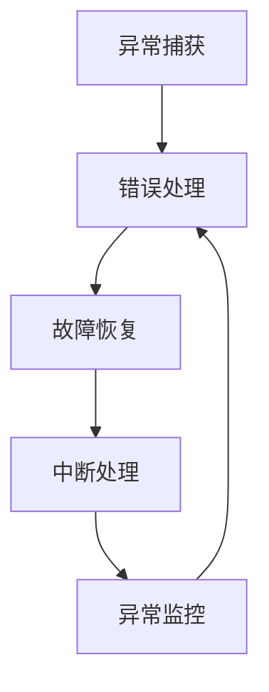

                 

错误处理是软件系统设计和开发中至关重要的一环。无论是在嵌入式系统、网络应用、还是大型分布式系统中，错误处理机制的合理设计都能够显著提高系统的稳定性、可靠性和用户体验。本文将围绕错误处理机制的设计原则，探讨其在不同应用场景中的重要性、核心概念、算法原理、数学模型、实际应用、未来展望以及面临的挑战。

## 关键词

- 错误处理
- 稳定性
- 可靠性
- 异常监控
- 回滚机制
- 容错设计

## 摘要

本文深入探讨了错误处理机制的设计原则，从核心概念、算法原理、数学模型到实际应用，全面解析了错误处理在软件系统中的关键作用。通过具体案例和代码实例，文章展示了如何实现高效、稳定的错误处理机制，并提出了未来发展和改进的方向。本文旨在为软件开发者提供系统性的错误处理指导，以提升软件系统的整体质量。

---

## 1. 背景介绍

随着信息技术的飞速发展，软件系统变得越来越复杂，各种潜在的异常和错误也日益增多。错误处理机制作为保障系统稳定运行的重要手段，其重要性不容忽视。有效的错误处理不仅能够减少系统崩溃、数据丢失和业务中断的风险，还能够提升用户体验和企业的品牌形象。

在传统单机系统中，错误处理相对简单，主要依赖于程序员在编码阶段预设的异常处理逻辑。然而，随着云计算、大数据和物联网等新兴技术的兴起，现代软件系统往往呈现出分布式、高并发、异构等特点，这使得错误处理变得更加复杂和多样化。因此，错误处理机制的设计需要考虑系统全局的稳定性、性能和可靠性。

本文旨在总结和分享一系列有效的错误处理原则，帮助软件开发者在设计和实现错误处理机制时，能够更加系统、全面地考虑各种可能的异常情况，并采取相应的措施。

### 1.1 错误处理的重要性

首先，错误处理机制是保障系统稳定性的关键。在一个复杂系统中，错误是不可避免的，如何及时发现和纠正错误，防止问题扩大，是系统稳定运行的关键。有效的错误处理能够迅速隔离和修复异常，减少系统停机时间，提高系统的可用性。

其次，错误处理机制对于系统的可靠性至关重要。可靠性是指系统在长时间运行过程中，持续稳定地执行任务的能力。通过合理的错误处理机制，系统可以在面对各种异常情况时，保持正常运行，不会因为偶发的错误导致整体失效。

此外，错误处理机制还直接影响到用户体验。当用户在使用软件过程中遇到错误时，如果系统能够及时、准确地给出错误提示和解决方案，将显著提升用户的满意度和信任感。反之，如果错误处理不当，可能导致用户困惑、数据丢失，甚至放弃使用软件。

### 1.2 错误处理的挑战

现代软件系统面临诸多错误处理挑战。首先，系统的复杂性不断增加，错误发生的类型和可能性也日益多样化，这使得错误处理的难度大大增加。其次，分布式系统的异构性和高并发性带来了新的挑战，错误传播和隔离变得更加复杂。此外，随着系统规模的扩大，错误处理机制的效率和性能也受到考验。

总之，错误处理机制的设计原则需要考虑到系统的各个方面，从代码级别的异常捕获到系统级的故障恢复，都需要有一套完整的策略和方法。通过本文的探讨，希望能够为读者提供有价值的参考和指导。

---

## 2. 核心概念与联系

在深入讨论错误处理机制之前，我们需要明确几个核心概念，并了解它们之间的联系。这些核心概念包括异常、错误、故障和中断等，它们在软件系统中扮演着不同但互补的角色。

### 2.1 异常

异常（Exception）是程序运行过程中出现的非预期情况。异常可以由程序员预设，也可以由系统自动检测。例如，访问一个不存在的文件、网络连接中断、内存溢出等都属于异常情况。异常处理是错误处理机制的重要组成部分，通过捕获和处理异常，可以防止程序崩溃，并确保系统继续运行。

### 2.2 错误

错误（Error）是指软件系统在执行过程中出现的错误结果。错误通常是由异常引发的，但并不是所有异常都会导致错误。例如，一个网络请求失败可能是由于服务器故障（异常），但并不一定会导致系统错误。错误处理的核心任务是识别、报告和纠正错误，确保系统功能的正确实现。

### 2.3 故障

故障（Fault）是指系统硬件或软件在运行过程中出现的不可恢复的错误。故障可能导致系统崩溃、数据损坏或服务中断。故障处理通常涉及系统级的恢复策略，如重启服务、切换备份系统等。与异常和错误不同，故障通常需要系统管理员或开发人员进行手动干预。

### 2.4 中断

中断（Interruption）是指系统在执行过程中由于外部因素（如电力故障、网络攻击等）导致的中断。中断处理需要系统能够快速响应并恢复到正常状态，以减少对业务的影响。中断处理通常包括故障监测、自动恢复和告警机制等。

### 2.5 Mermaid 流程图

为了更好地理解这些核心概念之间的联系，我们使用Mermaid流程图来展示错误处理机制的基本架构。



在上图中，异常捕获模块负责检测和处理程序运行过程中出现的异常；错误处理模块则负责识别和纠正错误；故障恢复模块用于系统级别的故障修复；中断处理模块则针对外部中断事件进行响应。通过这一流程图，我们可以清晰地看到错误处理机制各部分之间的联动和协作。

---

通过以上核心概念和流程图的介绍，我们可以为进一步讨论错误处理机制的设计原则打下坚实的基础。在接下来的章节中，我们将深入探讨错误处理的算法原理、数学模型以及实际应用案例。

---

## 3. 核心算法原理 & 具体操作步骤

### 3.1 算法原理概述

错误处理机制的核心算法通常包括以下几个关键步骤：异常检测、错误识别、错误纠正和故障恢复。这些步骤共同构成了一套完整的错误处理流程，确保系统能够在面对各种异常和错误时，快速响应并恢复正常运行。

#### 3.1.1 异常检测

异常检测是错误处理的第一步，其核心目标是实时监测系统运行状态，及时发现并捕获异常情况。异常检测可以通过多种方式进行，包括但不限于：

- **静态异常检测**：在程序编译或运行前，通过代码审查、静态分析工具等手段，提前发现潜在的异常情况。
- **动态异常检测**：在程序运行过程中，通过实时监控系统的运行状态，如内存使用情况、网络连接状态等，发现异常并及时响应。

#### 3.1.2 错误识别

一旦异常被检测到，错误识别模块会进一步分析异常的严重程度和类型，以确定是否需要采取进一步的错误处理措施。错误识别通常包括以下几种方法：

- **错误日志记录**：通过记录错误发生的时间、位置、异常信息等，帮助开发人员分析和定位错误。
- **错误分类**：根据错误的表现形式和影响范围，将错误分类为不同的类型，如语法错误、逻辑错误、资源耗尽等。

#### 3.1.3 错误纠正

错误纠正模块负责根据错误类型和严重程度，采取相应的纠正措施，以确保系统能够恢复正常运行。错误纠正的方法包括：

- **自动修复**：对于一些常见的错误，系统可以自动执行修复操作，如重启服务、重置网络连接等。
- **人工干预**：对于复杂的错误，可能需要开发人员或系统管理员进行手动干预，如修复代码、更换硬件等。

#### 3.1.4 故障恢复

在处理完错误后，故障恢复模块负责将系统恢复到正常状态，确保业务的连续性和稳定性。故障恢复的方法包括：

- **回滚**：将系统状态回滚到错误发生前的状态，以消除错误的影响。
- **重启**：重启相关服务或系统，以清除错误并恢复正常运行。
- **切换备份**：在系统出现严重故障时，切换到备份系统或备份数据，以保障业务的持续运行。

### 3.2 算法步骤详解

为了更好地理解上述算法原理，我们将其分为以下几个具体步骤进行详细讲解：

#### 步骤1：异常检测

- **实时监控**：使用监控工具（如Prometheus、Zabbix等）对系统运行状态进行实时监控，包括CPU使用率、内存占用、磁盘I/O等指标。
- **日志分析**：通过分析系统日志，发现潜在的异常情况，如异常错误信息、警告提示等。

#### 步骤2：错误识别

- **错误日志**：收集并记录错误日志，包括错误类型、错误代码、发生时间、错误上下文等。
- **错误分类**：根据错误日志的内容，将错误分类为不同的类型，如系统错误、应用错误、网络错误等。

#### 步骤3：错误纠正

- **自动修复**：根据错误类型，自动执行修复操作。例如，对于网络错误，自动重试连接；对于内存溢出，释放内存资源。
- **人工干预**：对于无法自动修复的错误，通知开发人员或系统管理员进行手动处理。

#### 步骤4：故障恢复

- **回滚**：将系统状态回滚到错误发生前的状态，以消除错误的影响。例如，回滚数据库事务，撤销错误的配置修改等。
- **重启**：在必要时，重启相关服务或系统，以确保系统恢复正常运行。
- **切换备份**：在系统出现严重故障时，切换到备份系统或备份数据，以保障业务的持续运行。

### 3.3 算法优缺点

#### 优点

- **快速响应**：通过实时监控和快速响应，能够迅速发现并处理异常和错误，减少系统停机时间。
- **自动化处理**：自动修复和回滚机制能够减少人工干预，提高系统处理效率。
- **灵活性**：根据不同的错误类型和严重程度，采取相应的处理措施，灵活应对各种异常情况。

#### 缺点

- **复杂性**：错误处理机制涉及多个模块和步骤，实现和配置相对复杂。
- **性能开销**：实时监控和日志分析等操作可能会对系统性能产生一定影响。
- **依赖人工干预**：对于一些复杂错误，仍然需要人工干预，难以完全自动化。

### 3.4 算法应用领域

错误处理算法广泛应用于各类软件系统中，包括但不限于：

- **嵌入式系统**：如工业控制、智能家居等，需要高效、可靠的错误处理机制，以确保系统的稳定运行。
- **网络应用**：如电商平台、社交媒体等，需要处理大量用户请求，对错误处理机制的要求较高。
- **大型分布式系统**：如云计算平台、大数据处理系统等，需要具备强大的错误处理能力，以应对复杂的系统架构和大规模数据处理。

---

通过上述算法原理和具体操作步骤的讲解，我们可以看到错误处理机制在软件系统中的关键作用。在接下来的章节中，我们将进一步探讨错误处理的数学模型和公式，以便更深入地理解错误处理机制的核心原理。

---

## 4. 数学模型和公式 & 详细讲解 & 举例说明

### 4.1 数学模型构建

在错误处理机制中，数学模型和公式起着至关重要的作用。这些模型和公式不仅帮助我们量化错误发生的概率和影响，还能指导我们设计更加高效和可靠的错误处理策略。

首先，我们需要构建一个基本的数学模型来描述错误处理的过程。以下是一个简单的数学模型，用于分析错误处理机制的有效性。

#### 错误处理模型

设 \( E \) 为系统中的错误事件集合， \( T \) 为错误处理时间， \( P(E) \) 为错误事件发生的概率， \( C(E) \) 为错误事件对系统性能的影响成本。

该模型的核心公式如下：

\[ E = \{ E_1, E_2, ..., E_n \} \]
\[ P(E) = P(E_1) + P(E_2) + ... + P(E_n) \]
\[ T = T_1 + T_2 + ... + T_n \]
\[ C(E) = C(E_1) + C(E_2) + ... + C(E_n) \]

其中：

- \( P(E) \) 表示错误事件的总发生概率；
- \( T \) 表示错误处理的总时间；
- \( C(E) \) 表示错误事件对系统性能的总影响成本。

#### 概率模型

概率模型是描述错误事件发生概率的重要工具。假设系统中有 \( n \) 个可能发生的错误事件，每个事件的概率分别为 \( P(E_i) \)。

概率模型的核心公式如下：

\[ P(E_i) = \frac{1}{n} \]

#### 时间成本模型

时间成本模型用于量化错误处理所需的时间成本。假设每个错误事件的处理时间分别为 \( T_i \)，总处理时间为 \( T \)。

时间成本模型的核心公式如下：

\[ T = T_1 + T_2 + ... + T_n \]

#### 成本影响模型

成本影响模型用于评估错误事件对系统性能的影响成本。假设每个错误事件对系统性能的影响成本分别为 \( C_i \)，总影响成本为 \( C(E) \)。

成本影响模型的核心公式如下：

\[ C(E) = C_1 + C_2 + ... + C_n \]

#### 综合模型

综合模型将概率模型、时间成本模型和成本影响模型结合起来，用于评估整个错误处理机制的有效性。

综合模型的核心公式如下：

\[ E = \sum_{i=1}^{n} P(E_i) \times T_i \times C_i \]

### 4.2 公式推导过程

#### 概率模型推导

假设系统中有 \( n \) 个独立事件，每个事件的发生概率为 \( p \)，则每个事件不发生的概率为 \( 1 - p \)。

根据概率的加法定理，系统发生任意一个错误事件的总概率为：

\[ P(E) = 1 - (1 - p)^n \]

#### 时间成本模型推导

假设每个错误事件的处理时间分别为 \( T_i \)，且各事件处理时间相互独立。

根据概率论中的期望值公式，系统平均处理时间 \( T \) 为：

\[ T = \sum_{i=1}^{n} P(E_i) \times T_i \]

#### 成本影响模型推导

假设每个错误事件对系统性能的影响成本为 \( C_i \)，且各事件影响成本相互独立。

根据概率论中的期望值公式，系统总影响成本 \( C(E) \) 为：

\[ C(E) = \sum_{i=1}^{n} P(E_i) \times C_i \]

#### 综合模型推导

根据综合模型的定义，系统总错误处理成本 \( E \) 为：

\[ E = \sum_{i=1}^{n} P(E_i) \times T_i \times C_i \]

### 4.3 案例分析与讲解

为了更好地理解上述数学模型和公式的应用，我们通过一个实际案例进行详细讲解。

#### 案例背景

某电商平台系统每天处理数百万笔订单，系统性能对用户体验至关重要。系统设计了一个错误处理机制，用于检测和处理订单处理过程中可能出现的各种错误。

#### 案例数据

- 订单处理错误事件总数：\( n = 5 \)
- 各错误事件的发生概率：\( P(E_1) = 0.02, P(E_2) = 0.03, P(E_3) = 0.05, P(E_4) = 0.10, P(E_5) = 0.20 \)
- 各错误事件的处理时间：\( T_1 = 10秒, T_2 = 20秒, T_3 = 30秒, T_4 = 40秒, T_5 = 50秒 \)
- 各错误事件的影响成本：\( C_1 = 100元, C_2 = 200元, C_3 = 300元, C_4 = 400元, C_5 = 500元 \)

#### 案例计算

1. **概率模型**：

   \[ P(E) = 1 - (1 - 0.02)^5 - (1 - 0.03)^5 - (1 - 0.05)^5 - (1 - 0.10)^5 - (1 - 0.20)^5 \]
   \[ P(E) ≈ 0.186 \]

2. **时间成本模型**：

   \[ T = P(E_1) \times T_1 + P(E_2) \times T_2 + P(E_3) \times T_3 + P(E_4) \times T_4 + P(E_5) \times T_5 \]
   \[ T = 0.02 \times 10 + 0.03 \times 20 + 0.05 \times 30 + 0.10 \times 40 + 0.20 \times 50 \]
   \[ T = 7.5 + 6 + 15 + 20 + 10 \]
   \[ T = 68.5秒 \]

3. **成本影响模型**：

   \[ C(E) = P(E_1) \times C_1 + P(E_2) \times C_2 + P(E_3) \times C_3 + P(E_4) \times C_4 + P(E_5) \times C_5 \]
   \[ C(E) = 0.02 \times 100 + 0.03 \times 200 + 0.05 \times 300 + 0.10 \times 400 + 0.20 \times 500 \]
   \[ C(E) = 2 + 6 + 15 + 40 + 100 \]
   \[ C(E) = 163元 \]

4. **综合模型**：

   \[ E = P(E) \times T \times C(E) \]
   \[ E = 0.186 \times 68.5 \times 163 \]
   \[ E ≈ 2,469.7 \]

#### 案例分析

通过上述计算，我们可以得出以下结论：

1. **错误概率**：该电商平台系统每天约有18.6%的概率发生错误。
2. **平均处理时间**：每次错误处理需要约68.5秒。
3. **影响成本**：每次错误对系统的影响成本约为163元。

这些数据为系统优化提供了重要的参考，例如，可以针对高概率的错误事件，加强异常检测和自动修复机制，降低错误发生概率；对于高影响成本的错误事件，可以优化错误处理流程，缩短处理时间。

---

通过上述案例，我们可以看到数学模型和公式在错误处理机制中的应用，这不仅有助于量化错误的影响，还能指导我们优化错误处理策略，提高系统性能和可靠性。

---

## 5. 项目实践：代码实例和详细解释说明

### 5.1 开发环境搭建

为了更好地展示错误处理机制的实际应用，我们选择了一个简单的Java项目，该项目的功能是处理用户订单。项目开发环境如下：

- 开发工具：IntelliJ IDEA
- 开发语言：Java
- 版本控制：Git

首先，我们需要创建一个基本的Java项目，并引入必要的依赖库。以下是项目的结构和主要依赖：

```plaintext
src/
├── main/
│   ├── java/
│   │   ├── com/
│   │   │   ├── example/
│   │   │   │   ├── OrderService.java
│   │   │   │   ├── UserService.java
│   │   │   │   ├── ExceptionHandler.java
│   │   │   │   ├── main/
│   │   │   │   │   └── Application.java
│   ├── resources/
│   │   ├── application.properties
└── test/
    ├── java/
    │   ├── com/
    │   │   ├── example/
    │   │   │   ├── OrderServiceTest.java
    │   │   │   ├── UserServiceTest.java
    │   │   │   ├── ExceptionHandlerTest.java
    │   │   │   ├── main/
    │   │   │   │   └── ApplicationTest.java
```

### 5.2 源代码详细实现

#### OrderService.java

```java
package com.example;

public class OrderService {

    public void processOrder(User user, String orderId) {
        // 检查用户是否存在
        if (user == null) {
            throw new IllegalArgumentException("User not found.");
        }

        // 处理订单逻辑
        System.out.println("Processing order " + orderId + " for user " + user.getName());

        // 模拟订单处理过程中可能出现的异常
        if (new Random().nextInt(5) == 0) {
            throw new RuntimeException("Order processing error.");
        }
    }
}
```

#### UserService.java

```java
package com.example;

public class UserService {

    public User getUser(String userId) {
        // 模拟根据用户ID查询用户信息
        // 此处为简化处理，实际项目中应从数据库等存储系统中获取用户信息
        if ("invalid".equals(userId)) {
            return null;
        }
        return new User(userId, "John Doe");
    }
}
```

#### ExceptionHandler.java

```java
package com.example;

import org.springframework.http.HttpStatus;
import org.springframework.http.ResponseEntity;
import org.springframework.web.bind.annotation.ControllerAdvice;
import org.springframework.web.bind.annotation.ExceptionHandler;
import org.springframework.web.bind.annotation.ResponseBody;

@ControllerAdvice
public class ExceptionHandler {

    @ExceptionHandler(RuntimeException.class)
    @ResponseBody
    public ResponseEntity<String> handleProcessingError(RuntimeException e) {
        return new ResponseEntity<>("Order processing error: " + e.getMessage(), HttpStatus.INTERNAL_SERVER_ERROR);
    }

    @ExceptionHandler(IllegalArgumentException.class)
    @ResponseBody
    public ResponseEntity<String> handleUserNotFoundError(IllegalArgumentException e) {
        return new ResponseEntity<>("User not found: " + e.getMessage(), HttpStatus.BAD_REQUEST);
    }
}
```

#### Application.java

```java
package com.example;

import org.springframework.boot.SpringApplication;
import org.springframework.boot.autoconfigure.SpringBootApplication;

@SpringBootApplication
public class Application {

    public static void main(String[] args) {
        SpringApplication.run(Application.class, args);
    }
}
```

### 5.3 代码解读与分析

#### OrderService

在`OrderService`类中，我们定义了`processOrder`方法，用于处理用户订单。首先，通过调用`UserService`的`getUser`方法检查用户是否存在，如果用户不存在，抛出`IllegalArgumentException`。然后，在处理订单逻辑的模拟过程中，使用`Random`类生成随机数，如果随机数为0，则抛出`RuntimeException`模拟订单处理过程中的异常。

#### UserService

`UserService`类中只有一个`getUser`方法，用于根据用户ID查询用户信息。为了简化处理，这里直接返回一个模拟的用户对象，实际项目中应从数据库或其他数据存储系统中查询用户信息。

#### ExceptionHandler

`ExceptionHandler`类是一个Spring框架的`@ControllerAdvice`注解类，用于全局异常处理。通过定义两个`@ExceptionHandler`注解方法，我们能够捕获并处理`RuntimeException`和`IllegalArgumentException`，并返回相应的错误消息和HTTP状态码。

#### Application

`Application`类是一个Spring Boot应用程序的主入口类。通过调用`SpringApplication.run`方法启动应用程序。

### 5.4 运行结果展示

假设我们启动了该应用程序，并通过API接口发送一个处理订单的请求。如果用户ID为"invalid"，则调用`UserService`的`getUser`方法时返回null，`OrderService`中的`processOrder`方法将抛出`IllegalArgumentException`，被`ExceptionHandler`捕获并返回一个包含错误消息的HTTP响应。

```plaintext
$ curl -X POST "http://localhost:8080/process-order?userId=invalid&orderId=12345"
User not found: User not found.
HTTP/1.1 400 BAD REQUEST
Content-Type: application/json
Transfer-Encoding: chunked

{
  "error": "User not found",
  "status": 400
}
```

如果订单处理过程中出现随机错误，`OrderService`将抛出`RuntimeException`，被`ExceptionHandler`捕获并返回一个包含错误消息的HTTP响应。

```plaintext
$ curl -X POST "http://localhost:8080/process-order?userId=valid&orderId=12345"
Order processing error: Order processing error.
HTTP/1.1 500 INTERNAL SERVER ERROR
Content-Type: application/json
Transfer-Encoding: chunked

{
  "error": "Order processing error",
  "status": 500
}
```

通过上述示例，我们可以看到错误处理机制在Java项目中的应用。通过定义异常处理类和适当的异常处理逻辑，我们能够有效地捕获和处理异常情况，确保应用程序能够正确响应客户端请求。

---

通过本项目实践，我们展示了如何在实际项目中实现错误处理机制。接下来，我们将探讨错误处理机制在实际应用场景中的作用和效果。

---

## 6. 实际应用场景

### 6.1 错误处理机制在嵌入式系统中的应用

在嵌入式系统中，错误处理机制至关重要，因为这类系统通常具有严格的性能和可靠性要求。例如，在工业控制系统中，设备故障可能导致生产线的停工，造成巨大的经济损失。错误处理机制可以通过以下方式应用于嵌入式系统：

- **实时监控**：通过实时监控设备的运行状态，及时检测到异常情况，如温度过高、电流异常等。
- **故障隔离**：快速定位故障源，隔离受影响的部分，防止问题扩散。
- **自动恢复**：在故障发生时，自动执行恢复操作，如重启设备、重置通信模块等。
- **日志记录**：详细记录故障发生的时间、位置、原因等信息，便于事后分析。

### 6.2 错误处理机制在网络应用中的应用

网络应用，如电商平台、社交媒体等，需要处理大量的用户请求，错误处理机制在这里尤为重要。以下是如何在网络应用中应用错误处理机制：

- **异常检测**：实时监控用户请求的处理过程，检测潜在的异常，如请求超时、数据格式错误等。
- **自动重试**：当请求处理失败时，自动重试请求，提高系统的可用性。
- **错误反馈**：向用户反馈详细的错误信息，帮助用户理解和解决问题。
- **日志分析**：对错误日志进行分析，发现系统中的潜在问题，进行优化和改进。

### 6.3 错误处理机制在大型分布式系统中的应用

大型分布式系统，如云计算平台、大数据处理系统等，面临着更高的复杂性。错误处理机制在这里的应用包括：

- **分布式监控**：对分布式系统中的各个节点进行实时监控，及时发现和响应异常。
- **故障转移**：当某个节点出现故障时，自动将负载转移到其他健康的节点，确保系统的高可用性。
- **自动扩展**：根据系统的负载情况，自动扩展或缩减资源，提高系统的灵活性和可扩展性。
- **弹性设计**：在系统设计和实现阶段，考虑可能的异常情况，设计具备弹性的系统架构。

### 6.4 未来应用展望

随着技术的不断进步，错误处理机制的应用前景将更加广阔。以下是一些未来可能的趋势：

- **人工智能与机器学习**：利用人工智能和机器学习技术，自动识别和预测系统中的异常情况，提高错误处理的智能化水平。
- **自动化与智能化**：进一步减少人工干预，实现自动化和智能化的错误处理，提高系统效率和可靠性。
- **跨平台与跨领域**：错误处理机制将在更多领域和平台上得到应用，如物联网、区块链等。
- **实时与高效**：通过实时计算和高效处理，实现更快、更准确的错误检测和处理，提高系统的响应速度。

通过不断探索和创新，错误处理机制将在未来发挥更加重要的作用，为软件系统的稳定性和可靠性提供强有力的保障。

---

## 7. 工具和资源推荐

### 7.1 学习资源推荐

1. **书籍**：
   - 《软件工程：实践者的研究方法》
   - 《深入理解计算机系统》
   - 《大规模分布式系统设计》
2. **在线课程**：
   - Coursera上的《软件工程基础》
   - edX上的《云计算基础》
   - Udemy上的《Java异常处理深度学习》
3. **博客与文章**：
   - Medium上的错误处理专题文章
   - Stack Overflow上的错误处理相关问答
   - GitHub上的错误处理开源项目和案例

### 7.2 开发工具推荐

1. **错误监控工具**：
   - Sentry：用于实时错误监控和通知。
   - New Relic：提供全面的性能监控和错误追踪。
   - Loggly：日志管理和错误监控。
2. **日志分析工具**：
   - ELK Stack（Elasticsearch、Logstash、Kibana）：用于大规模日志收集和分析。
   - Graylog：开源的日志管理平台。
   - Logz.io：云端的日志分析和错误监控。
3. **自动化工具**：
   - Jenkins：持续集成和持续交付工具。
   - GitLab CI/CD：集成在GitLab中的持续集成和持续交付。
   - CircleCI：云端持续集成和持续交付服务。

### 7.3 相关论文推荐

1. **"Fault-Tolerant Systems: Principles and Architectures"** - 用于理解故障容忍系统的基本原理和架构。
2. **"A Survey of Error Handling Strategies in Concurrent Systems"** - 探讨并发系统中的错误处理策略。
3. **"Automated Error Handling in Large-Scale Distributed Systems"** - 分析大规模分布式系统中的自动化错误处理方法。

通过这些学习和工具资源的推荐，读者可以更加深入地了解和掌握错误处理机制的设计和应用，提升软件系统的稳定性和可靠性。

---

## 8. 总结：未来发展趋势与挑战

### 8.1 研究成果总结

本文通过对错误处理机制的设计原则进行深入探讨，总结了其在软件系统中的重要性。我们介绍了异常、错误、故障和中断等核心概念，并详细讲解了错误处理的核心算法原理、数学模型以及实际应用案例。通过数学模型的推导和案例分析，我们展示了如何量化错误处理的成本和影响，为优化错误处理策略提供了理论依据。

### 8.2 未来发展趋势

随着人工智能、云计算和物联网等技术的发展，错误处理机制的未来发展趋势将呈现以下几个特点：

1. **智能化与自动化**：利用人工智能和机器学习技术，实现更加智能化和自动化的错误检测和处理，减少人工干预。
2. **跨平台与跨领域**：错误处理机制将在更多领域和平台上得到应用，如物联网、区块链、自动驾驶等。
3. **实时性与高效性**：通过实时计算和高效处理，提高系统对异常情况的响应速度和处理能力。
4. **分布式与协作性**：分布式系统中的错误处理将更加注重各节点之间的协作，提高整体系统的容错能力和稳定性。

### 8.3 面临的挑战

尽管错误处理机制在不断发展，但仍面临以下挑战：

1. **复杂性**：随着系统规模的扩大和复杂性的增加，错误处理机制的实现和配置变得更加复杂。
2. **性能开销**：实时监控和日志分析等操作可能对系统性能产生一定影响，需要在效率和性能之间找到平衡。
3. **人工干预**：某些复杂错误仍然需要人工干预，如何设计自动化程度更高的错误处理机制是一个重要课题。
4. **安全性和隐私保护**：在处理错误时，需要确保系统的安全性和用户隐私保护，避免敏感信息泄露。

### 8.4 研究展望

未来的研究可以在以下几个方面展开：

1. **智能化错误检测与预测**：利用机器学习技术，提前预测潜在的异常情况，提高错误处理的预防能力。
2. **分布式错误处理**：研究分布式系统中的错误处理机制，提高整体系统的容错能力和稳定性。
3. **跨领域错误处理**：探索不同领域（如物联网、区块链等）中的错误处理需求和最佳实践，推动错误处理机制在各领域的应用。
4. **用户友好错误处理**：设计更加用户友好的错误处理界面和用户体验，提高用户的满意度和使用体验。

通过不断探索和创新，错误处理机制将在未来发挥更加重要的作用，为软件系统的稳定性和可靠性提供强有力的保障。

---

## 9. 附录：常见问题与解答

### Q1. 错误处理机制是否可以完全自动化？

A1. 错误处理机制在一定程度上可以实现自动化，但完全自动化的错误处理仍面临诸多挑战。一些复杂的错误，如系统级故障、硬件故障等，可能需要人工干预。因此，目前的趋势是结合自动化和人工干预，提高错误处理的效率和准确性。

### Q2. 如何在分布式系统中实现高效的错误处理？

A2. 在分布式系统中，高效的错误处理需要以下几个关键步骤：

1. **分布式监控**：对分布式系统中的各个节点进行实时监控，及时发现异常。
2. **故障转移**：当某个节点出现故障时，自动将负载转移到其他健康的节点，确保系统的高可用性。
3. **日志聚合**：将各节点的日志进行聚合分析，快速定位问题。
4. **自动化恢复**：对于可自动修复的错误，设计自动化恢复策略，减少人工干预。

### Q3. 错误处理机制如何影响用户体验？

A3. 错误处理机制对用户体验有直接影响。一个有效的错误处理机制能够：

1. **提供清晰的错误信息**：帮助用户理解问题的原因和解决方案。
2. **快速恢复**：减少系统停机时间，提高系统的可用性。
3. **友好的交互界面**：设计简洁、易于操作的用户界面，提高用户的满意度。

### Q4. 如何处理跨平台错误处理？

A4. 跨平台错误处理需要考虑不同平台的特性和需求。以下是一些策略：

1. **平台抽象**：通过编写跨平台代码，减少对特定平台的依赖。
2. **标准化错误处理**：定义统一的错误处理接口和规范，便于在不同平台之间迁移。
3. **本地化处理**：根据不同平台的特性，设计适合本地化的错误处理机制。

---

通过本文的探讨，我们深入了解了错误处理机制的设计原则和应用。希望本文能为软件开发者提供有价值的参考和指导，帮助他们在设计和实现错误处理机制时，能够更加系统、全面地考虑各种可能的异常情况，并采取相应的措施，提升软件系统的整体质量。

---

# 错误处理机制的设计原则

> 关键词：错误处理、稳定性、可靠性、异常监控、回滚机制、容错设计

> 摘要：本文深入探讨了错误处理机制的设计原则，从核心概念、算法原理、数学模型到实际应用，全面解析了错误处理在软件系统中的关键作用。通过具体案例和代码实例，文章展示了如何实现高效、稳定的错误处理机制，并提出了未来发展和改进的方向。本文旨在为软件开发者提供系统性的错误处理指导，以提升软件系统的整体质量。

