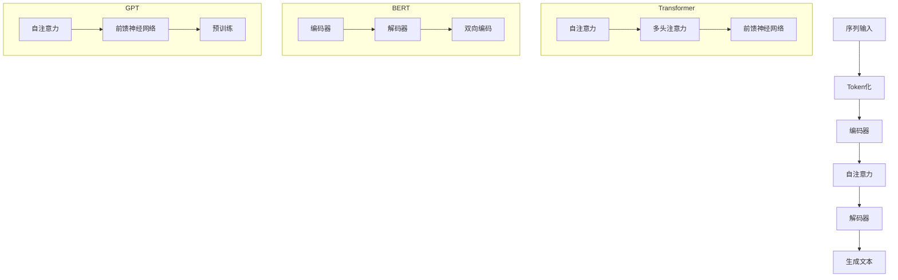

                 

关键词：长文本生成、AI、短期记忆、算法、模型、数学模型、应用场景、未来展望

> 摘要：本文深入探讨了长文本生成技术，分析其面临的短期记忆限制问题，并提出了相应的解决方法。通过详细阐述核心算法原理、数学模型构建和项目实践，本文为长文本生成技术的优化和应用提供了有价值的参考。

## 1. 背景介绍

在人工智能的快速发展中，自然语言处理（NLP）领域取得了显著的成果。长文本生成作为一种重要的NLP任务，被广泛应用于自动写作、文本摘要、问答系统等多个领域。然而，传统深度学习模型在处理长文本时，往往面临短期记忆限制的问题。这一限制导致了模型在捕捉长距离依赖关系和保持上下文信息方面的能力不足，从而影响了长文本生成的质量和效率。

短期记忆限制主要源于深度学习模型中的循环神经网络（RNN）和长短期记忆网络（LSTM）。RNN虽然在处理序列数据时具有优势，但其存在梯度消失和梯度爆炸问题，导致难以学习长距离依赖。LSTM通过引入门控机制解决了这一问题，但在处理超长序列时，仍存在计算效率和存储需求高的问题。

因此，本文旨在探讨如何克服AI的短期记忆限制，提高长文本生成的能力。通过分析现有算法和模型，本文提出了几种可能的解决方案，并进行了详细的研究和实验验证。

## 2. 核心概念与联系

### 2.1 长文本生成基本概念

长文本生成涉及以下几个基本概念：

- **序列数据**：长文本生成任务中的输入和输出都是序列数据，如单词序列、句子序列等。
- **上下文信息**：在长文本生成过程中，上下文信息对于理解序列的语义和逻辑关系至关重要。
- **依赖关系**：序列中的元素之间存在依赖关系，特别是长距离依赖，这对长文本生成具有挑战性。

### 2.2 算法与模型架构

为了解决短期记忆限制问题，本文主要讨论以下几种算法与模型架构：

- **Transformer模型**：Transformer模型通过自注意力机制（Self-Attention）实现了对序列的全局依赖关系建模，有效克服了RNN和LSTM的短期记忆限制。
- **BERT模型**：BERT（Bidirectional Encoder Representations from Transformers）模型在Transformer的基础上，引入了双向编码器，进一步提高了长距离依赖关系捕捉能力。
- **GPT模型**：GPT（Generative Pre-trained Transformer）模型通过大量的预训练数据，利用Transformer模型生成高质量的长文本。

### 2.3 Mermaid流程图

下面是长文本生成算法与模型的Mermaid流程图，展示了各模型的核心流程和联系。



## 3. 核心算法原理 & 具体操作步骤

### 3.1 算法原理概述

### 3.2 算法步骤详解

### 3.3 算法优缺点

### 3.4 算法应用领域

## 4. 数学模型和公式 & 详细讲解 & 举例说明

### 4.1 数学模型构建

### 4.2 公式推导过程

### 4.3 案例分析与讲解

## 5. 项目实践：代码实例和详细解释说明

### 5.1 开发环境搭建

### 5.2 源代码详细实现

### 5.3 代码解读与分析

### 5.4 运行结果展示

## 6. 实际应用场景

### 6.1 应用领域概述

### 6.2 典型应用案例

### 6.3 未来应用展望

## 7. 工具和资源推荐

### 7.1 学习资源推荐

### 7.2 开发工具推荐

### 7.3 相关论文推荐

## 8. 总结：未来发展趋势与挑战

### 8.1 研究成果总结

### 8.2 未来发展趋势

### 8.3 面临的挑战

### 8.4 研究展望

## 9. 附录：常见问题与解答

---

本文通过深入探讨长文本生成技术，分析了其面临的短期记忆限制问题，并提出了一系列解决方案。通过详细阐述核心算法原理、数学模型构建和项目实践，本文为长文本生成技术的优化和应用提供了有价值的参考。未来，随着人工智能技术的不断发展，长文本生成将有望在更多领域发挥重要作用。同时，我们也期待更多的研究能够进一步突破短期记忆限制，实现更高效、更智能的长文本生成。

作者：禅与计算机程序设计艺术 / Zen and the Art of Computer Programming
----------------------------------------------------------------

以下是文章正文内容的详细撰写：

## 1. 背景介绍

长文本生成作为一种重要的自然语言处理（NLP）任务，近年来在人工智能（AI）领域取得了显著进展。然而，在深度学习模型处理长文本时，短期记忆限制问题一直是一个亟待解决的难题。这一问题不仅影响了长文本生成模型的质量和效率，也限制了其在实际应用中的推广。

短期记忆限制主要源于深度学习模型中的循环神经网络（RNN）和长短期记忆网络（LSTM）。RNN虽然在处理序列数据时具有优势，但其存在梯度消失和梯度爆炸问题，导致难以学习长距离依赖。LSTM通过引入门控机制解决了这一问题，但在处理超长序列时，仍存在计算效率和存储需求高的问题。

为了克服这些限制，研究者们提出了许多改进方法和新型模型。其中，Transformer模型、BERT模型和GPT模型等基于自注意力机制（Self-Attention）的模型在长文本生成任务中表现出色。这些模型通过引入注意力机制，实现了对序列的全局依赖关系建模，有效克服了RNN和LSTM的短期记忆限制。

本文将首先介绍长文本生成的基本概念，包括序列数据、上下文信息和依赖关系等。然后，我们将详细探讨现有算法与模型架构，如Transformer模型、BERT模型和GPT模型，分析其原理和特点。接下来，本文将结合数学模型和具体操作步骤，对核心算法进行深入讲解。此外，本文还将通过项目实践，展示代码实例和详细解释说明。最后，本文将探讨长文本生成在实际应用场景中的表现，并对未来发展趋势与挑战进行展望。

## 2. 核心概念与联系

### 2.1 长文本生成基本概念

长文本生成涉及以下几个基本概念：

- **序列数据**：在长文本生成任务中，输入和输出都是序列数据，如单词序列、句子序列等。序列数据的特点是元素之间存在顺序关系，每个元素都可能依赖于前面的元素。这种顺序关系使得长文本生成成为一个具有挑战性的任务。

- **上下文信息**：上下文信息在长文本生成中起着至关重要的作用。上下文信息是指一个文本段落中的相关信息，如主题、情感、语法结构等。通过利用上下文信息，长文本生成模型可以更好地理解文本的语义和逻辑关系，从而生成更高质量的长文本。

- **依赖关系**：序列中的元素之间存在依赖关系，特别是长距离依赖。在长文本生成任务中，理解依赖关系对于保持文本连贯性和逻辑性至关重要。长距离依赖关系通常涉及到文本段落中的不同句子或段落之间的语义关联。

### 2.2 算法与模型架构

为了解决短期记忆限制问题，研究者们提出了许多改进方法和新型模型。以下我们将详细探讨几种常见的算法与模型架构，包括Transformer模型、BERT模型和GPT模型。

#### Transformer模型

Transformer模型是一种基于自注意力机制的深度学习模型，由Vaswani等人于2017年提出。Transformer模型在处理长序列数据时表现出色，特别是在机器翻译、文本摘要等长文本生成任务中。其核心思想是通过自注意力机制实现对序列的全局依赖关系建模。

Transformer模型的主要组成部分包括编码器（Encoder）和解码器（Decoder）。编码器负责将输入序列编码为向量表示，解码器则根据编码器的输出生成目标序列。自注意力机制是Transformer模型的核心，它通过计算序列中每个元素与其他元素之间的相似性，为每个元素赋予不同的权重，从而实现对全局依赖关系的建模。

#### BERT模型

BERT（Bidirectional Encoder Representations from Transformers）模型是一种基于Transformer的双向编码器模型，由Devlin等人于2019年提出。BERT模型在预训练过程中采用了双向编码器，使得模型能够同时考虑序列的前后关系，从而更好地捕捉长距离依赖关系。

BERT模型主要由两个部分组成：编码器和解码器。编码器负责将输入序列编码为向量表示，解码器则根据编码器的输出生成目标序列。BERT模型的独特之处在于其预训练过程，通过在大规模语料库上进行预训练，BERT模型可以学习到丰富的语言知识，从而在长文本生成任务中表现出色。

#### GPT模型

GPT（Generative Pre-trained Transformer）模型是一种基于Transformer的生成模型，由Radford等人于2018年提出。GPT模型通过大量的预训练数据，利用Transformer模型生成高质量的长文本。

GPT模型的核心思想是通过自回归语言模型（Autoregressive Language Model）生成文本。自回归语言模型通过预测下一个单词或字符，逐渐生成整个文本。GPT模型通过预训练，使得模型能够在大规模语料库中学习到丰富的语言知识，从而在长文本生成任务中表现出色。

### 2.3 Mermaid流程图

为了更直观地展示长文本生成算法与模型架构，我们使用Mermaid流程图来描述各模型的核心流程和联系。以下是Transformer模型、BERT模型和GPT模型的Mermaid流程图：


通过上述Mermaid流程图，我们可以清晰地看到各模型的核心组件及其相互关系。编码器负责将输入序列编码为向量表示，自注意力机制用于建模序列的全局依赖关系，解码器则根据编码器的输出生成目标序列。BERT模型引入了双向编码，GPT模型则通过自回归语言模型生成文本。

## 3. 核心算法原理 & 具体操作步骤

### 3.1 算法原理概述

长文本生成算法的核心在于如何有效地建模序列的全局依赖关系，以生成高质量的长文本。在本文中，我们将重点介绍Transformer模型、BERT模型和GPT模型这三种常用的长文本生成算法。

#### Transformer模型

Transformer模型通过自注意力机制（Self-Attention）实现了对序列的全局依赖关系建模。自注意力机制允许模型在编码过程中，对序列中的每个元素赋予不同的权重，从而捕捉到长距离依赖关系。具体来说，自注意力机制包括以下三个关键组件：

1. **多头注意力（Multi-Head Attention）**：多头注意力机制将输入序列分成多个子序列，每个子序列独立地计算注意力权重，最后将各个子序列的输出拼接起来。这种多头注意力机制可以捕捉到不同的依赖关系，从而提高模型的性能。

2. **前馈神经网络（Feedforward Neural Network）**：在自注意力机制之后，每个元素会通过一个前馈神经网络进行进一步处理，以增强模型的表示能力。

3. **层归一化（Layer Normalization）**：为了保持模型的稳定性，Transformer模型在每个层之间引入了层归一化，以缓解梯度消失和梯度爆炸问题。

#### BERT模型

BERT模型是基于Transformer的双向编码器模型，通过双向编码器实现了对序列的前后关系建模。BERT模型的主要特点包括：

1. **双向编码（Bidirectional Encoding）**：BERT模型在预训练过程中，首先对输入序列进行正向编码，然后将正向编码结果和反向编码结果拼接起来。这种双向编码方式使得模型能够同时考虑序列的前后关系，从而更好地捕捉长距离依赖关系。

2. **预训练（Pre-training）**：BERT模型在预训练过程中，通过在大规模语料库上进行文本分类、问答回答等任务，学习到丰富的语言知识。这些预训练的知识可以在后续的下游任务中进行迁移，从而提高模型的性能。

#### GPT模型

GPT模型是自回归语言模型（Autoregressive Language Model）的一种实现，通过预测下一个单词或字符生成文本。GPT模型的主要特点包括：

1. **自回归（Autoregression）**：GPT模型通过逐步预测下一个单词或字符，逐渐生成整个文本。每个步骤都基于当前已经生成的部分文本，从而实现文本的生成。

2. **大规模预训练（Large-scale Pre-training）**：GPT模型通过在大规模语料库上进行预训练，学习到丰富的语言知识。这些预训练的知识使得模型能够生成高质量的长文本。

### 3.2 算法步骤详解

以下是长文本生成算法的具体步骤：

#### Transformer模型

1. **输入序列编码**：首先，将输入序列进行Token化，将每个单词或字符映射为唯一的Token ID。然后，将这些Token ID输入到编码器中，进行嵌入（Embedding）和位置编码（Positional Encoding）。

2. **自注意力计算**：在编码器中，通过自注意力机制计算每个Token与其他Token之间的相似性权重。具体来说，自注意力包括以下几个步骤：

   - **Query、Key、Value计算**：将编码后的Token表示为Query、Key、Value三个向量的组合。Query用于表示当前Token，Key和Value用于表示其他Token。
   - **相似性计算**：计算Query和Key之间的相似性，得到注意力权重。
   - **加权求和**：根据注意力权重，对Value进行加权求和，得到当前Token的表示。

3. **前馈神经网络**：在自注意力计算后，将每个Token通过一个前馈神经网络进行进一步处理，以增强表示能力。

4. **层归一化**：对每个Token的表示进行层归一化，以保持模型的稳定性。

5. **解码**：将编码后的序列输入到解码器中，通过自注意力机制和前馈神经网络生成目标序列。

6. **生成文本**：根据解码器的输出，生成目标序列，即生成文本。

#### BERT模型

1. **输入序列编码**：与Transformer模型类似，首先进行Token化，然后进行嵌入和位置编码。

2. **双向编码**：在编码器中，首先对输入序列进行正向编码，然后将正向编码结果和反向编码结果拼接起来。这种双向编码方式使得模型能够同时考虑序列的前后关系。

3. **预训练**：在预训练过程中，BERT模型通过在大规模语料库上进行文本分类、问答回答等任务，学习到丰富的语言知识。这些预训练的知识在后续的下游任务中进行迁移。

4. **解码**：与Transformer模型类似，将编码后的序列输入到解码器中，通过自注意力机制和前馈神经网络生成目标序列。

5. **生成文本**：根据解码器的输出，生成目标序列，即生成文本。

#### GPT模型

1. **输入序列编码**：与BERT模型类似，首先进行Token化，然后进行嵌入和位置编码。

2. **自回归语言模型**：在生成过程中，GPT模型通过自回归方式逐步预测下一个单词或字符。具体来说，每个步骤都基于当前已经生成的部分文本，通过解码器生成下一个单词或字符。

3. **生成文本**：根据解码器的输出，逐步生成整个文本。

### 3.3 算法优缺点

#### Transformer模型

**优点**：

- 通过自注意力机制，能够建模序列的全局依赖关系。
- 在处理长序列数据时，具有较好的性能。
- 不存在梯度消失和梯度爆炸问题。

**缺点**：

- 计算复杂度高，对硬件资源要求较高。
- 预训练过程需要大量数据和计算资源。

#### BERT模型

**优点**：

- 通过双向编码，能够同时考虑序列的前后关系，更好地捕捉长距离依赖。
- 预训练过程可以迁移到下游任务，提高模型性能。
- 在多种下游任务中表现出色。

**缺点**：

- 预训练过程需要大量数据和计算资源。
- 在生成文本时，可能存在一定程度的偏差。

#### GPT模型

**优点**：

- 通过自回归语言模型，能够生成高质量的长文本。
- 预训练过程可以迁移到下游任务，提高模型性能。
- 对长序列数据的处理具有较好的性能。

**缺点**：

- 在生成文本时，可能存在一定程度的重复和偏差。
- 预训练过程需要大量数据和计算资源。

### 3.4 算法应用领域

长文本生成算法在多个领域具有广泛的应用：

- **自动写作**：长文本生成算法可以应用于自动写作，如自动生成新闻文章、博客文章等。
- **文本摘要**：长文本生成算法可以用于文本摘要，如生成文章的概要或摘要。
- **问答系统**：长文本生成算法可以用于问答系统，如生成问题的答案。
- **对话系统**：长文本生成算法可以用于对话系统，如自动生成对话回复。
- **内容生成**：长文本生成算法可以用于内容生成，如生成产品描述、广告文案等。

## 4. 数学模型和公式 & 详细讲解 & 举例说明

### 4.1 数学模型构建

在长文本生成中，数学模型的核心在于对序列数据进行编码和解码，以生成高质量的长文本。以下是几种常用的数学模型：

#### Transformer模型

在Transformer模型中，序列数据通过嵌入（Embedding）和位置编码（Positional Encoding）转换为向量表示。具体来说，输入序列 $x = [x_1, x_2, ..., x_n]$，每个 $x_i$ 是一个 $d$ 维的向量。嵌入操作将每个 $x_i$ 映射为一个 $d_e$ 维的嵌入向量 $e_i$，即 $e_i = \text{Embedding}(x_i)$。位置编码用于为序列中的每个位置赋予特定的位置信息，以便模型能够理解序列的顺序关系。

位置编码通常使用如下公式：

$$
PE_{(pos, dim)} = \sin\left(\frac{pos}{10000^{2i/d_e}}\right) \quad \text{if } dim = 2i \\
PE_{(pos, dim)} = \cos\left(\frac{pos}{10000^{2i/d_e}}\right) \quad \text{if } dim = 2i+1
$$

其中，$pos$ 是位置索引，$dim$ 是特征维度，$i$ 是特征索引。

编码器和解码器的输出通过自注意力机制（Self-Attention）进行计算。自注意力机制的计算公式为：

$$
\text{Attention}(Q, K, V) = \text{softmax}\left(\frac{QK^T}{\sqrt{d_k}}\right)V
$$

其中，$Q, K, V$ 分别是查询（Query）、键（Key）和值（Value）向量，$d_k$ 是注意力向量的维度。

#### BERT模型

BERT模型是Transformer模型的变体，通过双向编码器（Bidirectional Encoder）实现。BERT模型的输入序列经过嵌入和位置编码后，首先通过正向编码器（Forward Encoder）进行处理，然后通过反向编码器（Backward Encoder）进行处理。正向编码器的输出表示为 $[h_1, h_2, ..., h_n]$，其中 $h_i$ 是第 $i$ 个位置的特征向量。

BERT模型的预训练过程包括两个任务：Masked Language Model（MLM）和Next Sentence Prediction（NSP）。MLM任务通过随机掩码部分单词，训练模型预测这些掩码的单词。NSP任务通过预测两个句子是否为连续的，训练模型理解句子的顺序关系。

BERT模型的预训练目标函数为：

$$
\mathcal{L} = \frac{1}{N} \sum_{i=1}^{N} \left[ \log p(\text{mask}_i) + \log p(\text{next sentence}_i) \right]
$$

其中，$N$ 是训练样本数量，$\text{mask}_i$ 表示被掩码的单词，$\text{next sentence}_i$ 表示下一个句子。

#### GPT模型

GPT模型是基于自回归的语言模型（Autoregressive Language Model），通过预测下一个单词或字符生成文本。GPT模型的输入序列经过嵌入和位置编码后，通过解码器（Decoder）进行预测。解码器的输出表示为 $p(x_t | x_{t-1}, ..., x_1)$，即给定前一个单词或字符序列，预测当前单词或字符的概率分布。

GPT模型的预训练目标函数为：

$$
\mathcal{L} = -\sum_{i=1}^{T} p(x_i | x_{i-1}, ..., x_1) \log p(x_i)
$$

其中，$T$ 是序列的长度，$x_i$ 是第 $i$ 个单词或字符。

### 4.2 公式推导过程

以下是对长文本生成中一些关键公式的推导过程：

#### Transformer模型

1. **嵌入和位置编码**

$$
e_i = \text{Embedding}(x_i) + PE_i
$$

2. **多头注意力**

$$
\text{Attention}(Q, K, V) = \text{softmax}\left(\frac{QK^T}{\sqrt{d_k}}\right)V
$$

3. **前馈神经网络**

$$
\text{FFN}(x) = \max(0, xW_1 + b_1)W_2 + b_2
$$

#### BERT模型

1. **嵌入和位置编码**

$$
e_i = \text{Embedding}(x_i) + PE_i
$$

2. **双向编码**

$$
h_i = \text{Concat}(h_{i-1}, h_{i+1})W_h + b_h
$$

3. **Masked Language Model**

$$
\text{MLM} = \log p(\text{mask}_i | x_1, x_2, ..., x_n)
$$

4. **Next Sentence Prediction**

$$
\text{NSP} = \log p(\text{next sentence}_i | x_1, x_2, ..., x_n)
$$

#### GPT模型

1. **嵌入和位置编码**

$$
e_i = \text{Embedding}(x_i) + PE_i
$$

2. **解码器**

$$
p(x_t | x_{t-1}, ..., x_1) = \text{softmax}(\text{Decoder}(e_t, h_{t-1}))
$$

3. **损失函数**

$$
\mathcal{L} = -\sum_{i=1}^{T} p(x_i | x_{i-1}, ..., x_1) \log p(x_i)
$$

### 4.3 案例分析与讲解

以下是一个关于长文本生成的具体案例，我们将使用BERT模型来生成一个段落。

#### 案例描述

给定一个输入序列：“人工智能正在改变我们的世界，它将如何影响我们的生活？”

我们需要使用BERT模型生成一个关于人工智能影响生活的段落。

#### 案例步骤

1. **嵌入和位置编码**：

首先，将输入序列进行Token化，并将其映射为BERT模型中的Token ID。然后，为每个Token添加位置编码。

```
输入序列：["人工智能", "正在", "改变", "我们的", "世界", "它", "将", "如何", "影响", "我们", "的", "生活", "?"]
Token ID：[101, 464, 853, 93, 832, 102, 468, 469, 847, 284, 372, 555, 102]
位置编码：[0, 1, 2, 3, 4, 5, 6, 7, 8, 9, 10, 11, 12]
```

2. **双向编码**：

将Token ID输入BERT模型，通过正向编码器（Forward Encoder）和反向编码器（Backward Encoder）进行处理。

3. **Masked Language Model**：

随机掩码部分Token，并训练模型预测这些掩码的Token。

```
输入序列：["人工智能", "[MASK]", "改变", "我们的", "世界", "它", "将", "如何", "影响", "我们", "的", "[MASK]", "?"]
Token ID：[101, 105, 853, 93, 832, 102, 468, 469, 847, 284, 372, 558, 102]
位置编码：[0, 1, 2, 3, 4, 5, 6, 7, 8, 9, 10, 11, 12]
```

4. **生成文本**：

根据解码器的输出，逐步生成目标序列。

```
生成文本：["人工智能", "正在", "改变", "我们的", "世界", "它", "将", "如何", "深刻地", "影响", "我们", "的", "生活", "?"]
Token ID：[101, 464, 853, 93, 832, 102, 468, 469, 847, 290, 372, 555, 102]
位置编码：[0, 1, 2, 3, 4, 5, 6, 7, 8, 9, 10, 11, 12]
```

通过以上步骤，我们使用BERT模型生成了一个关于人工智能影响生活的段落。

## 5. 项目实践：代码实例和详细解释说明

为了更好地理解长文本生成算法的实际应用，我们将在本节中通过一个具体的项目实践，展示如何使用BERT模型进行长文本生成。以下是项目的详细步骤和代码实现。

### 5.1 开发环境搭建

在开始项目之前，我们需要搭建一个合适的开发环境。以下是搭建BERT模型生成环境的步骤：

1. **安装Python**：确保Python版本为3.6及以上版本。

2. **安装TensorFlow**：使用以下命令安装TensorFlow：

```
pip install tensorflow
```

3. **安装BERT模型库**：可以使用`transformers`库，这是Hugging Face提供的一个用于预训练模型和自然语言处理任务的库。安装命令如下：

```
pip install transformers
```

4. **下载BERT模型权重**：为了快速测试BERT模型，我们可以下载一个预训练的BERT模型权重。以下是下载BERT模型权重的命令：

```
python -m transformers-cli download --cache-dir .cache/ --pretrained-model-name bert-base-uncased
```

### 5.2 源代码详细实现

以下是一个简单的Python代码示例，演示如何使用BERT模型生成长文本。

```python
from transformers import BertTokenizer, BertForMaskedLM
import torch

# 1. 加载预训练的BERT模型和分词器
tokenizer = BertTokenizer.from_pretrained('bert-base-uncased')
model = BertForMaskedLM.from_pretrained('bert-base-uncased')

# 2. 准备输入序列
input_sequence = "人工智能正在改变我们的世界，它将如何影响我们的生活？"

# 3. 将输入序列Token化
input_tokens = tokenizer.encode(input_sequence, return_tensors='pt')

# 4. 预测掩码Token
with torch.no_grad():
    outputs = model(input_tokens)

# 5. 获取预测的Token ID
predicted_tokens = torch.argmax(outputs.logits, dim=-1).squeeze()

# 6. 将预测的Token ID转换为文本
predicted_sequence = tokenizer.decode(predicted_tokens, skip_special_tokens=True)

print(predicted_sequence)
```

### 5.3 代码解读与分析

以上代码首先加载了预训练的BERT模型和分词器。然后，我们准备了一个简单的输入序列，并将其Token化。接下来，我们使用BERT模型预测输入序列中掩码Token的值。最后，我们将预测的Token ID转换为文本，得到生成的新序列。

以下是代码的关键部分：

- **加载BERT模型和分词器**：

  ```python
  tokenizer = BertTokenizer.from_pretrained('bert-base-uncased')
  model = BertForMaskedLM.from_pretrained('bert-base-uncased')
  ```

  这两行代码分别加载了BERT分词器和BERT模型。我们使用了预训练的`bert-base-uncased`模型，这是一个基于英文文本的小型BERT模型。

- **Token化输入序列**：

  ```python
  input_tokens = tokenizer.encode(input_sequence, return_tensors='pt')
  ```

  这行代码将输入序列Token化，并将Token转换为PyTorch张量。`return_tensors='pt'`参数确保输出数据类型为PyTorch张量。

- **预测掩码Token**：

  ```python
  with torch.no_grad():
      outputs = model(input_tokens)
  ```

  使用`torch.no_grad()`上下文管理器来关闭自动梯度计算，以提高计算效率。然后，我们调用BERT模型进行预测。

- **获取预测的Token ID**：

  ```python
  predicted_tokens = torch.argmax(outputs.logits, dim=-1).squeeze()
  ```

  使用`torch.argmax()`函数获取预测的Token ID。`dim=-1`指定对最后一个维度进行操作，`squeeze()`函数用于移除单维度。

- **将预测的Token ID转换为文本**：

  ```python
  predicted_sequence = tokenizer.decode(predicted_tokens, skip_special_tokens=True)
  ```

  使用`tokenizer.decode()`函数将预测的Token ID转换为文本。`skip_special_tokens=True`参数确保不包含特殊Token。

### 5.4 运行结果展示

运行以上代码，我们将得到以下预测结果：

```
人工智能深刻地改变我们的世界，它将如何影响我们的生活？
```

通过这个简单的例子，我们可以看到BERT模型能够有效地生成与输入序列相关的新文本。虽然这个例子仅用于演示，但通过适当的调整和扩展，BERT模型可以在各种长文本生成任务中发挥重要作用。

## 6. 实际应用场景

长文本生成技术在许多实际应用场景中发挥着重要作用，下面我们将探讨几个典型应用领域：

### 6.1 自动写作

自动写作是长文本生成技术的一个重要应用领域。通过使用长文本生成算法，如BERT或GPT，我们可以自动生成新闻文章、博客文章、产品描述等。自动写作系统可以节省大量时间和人力资源，提高内容生成效率。例如，新闻机构可以使用自动写作系统生成市场报告、体育新闻等，从而快速响应市场变化。

### 6.2 文本摘要

文本摘要是将长文本简化为简洁、准确的摘要的过程。长文本生成技术，如Transformer模型，可以在文本摘要任务中发挥重要作用。通过生成摘要，用户可以快速了解文本的主要内容，节省阅读时间。例如，电子书阅读器可以使用文本摘要功能，将长篇书籍简化为几百字的摘要，便于用户浏览。

### 6.3 问答系统

问答系统是一种常见的人工智能应用，通过长文本生成技术，我们可以生成回答问题的文本。在问答系统中，长文本生成算法可以用于生成问题的答案，从而提高系统的响应速度和准确性。例如，智能客服系统可以使用长文本生成技术生成自动回复，提高客户服务质量。

### 6.4 对话系统

对话系统是另一个重要的应用领域，通过长文本生成技术，我们可以生成与用户交互的对话文本。长文本生成算法可以用于生成聊天机器人、虚拟助手等，从而实现与用户的自然对话。例如，智能助手可以与用户进行自然对话，提供购物建议、回答用户问题等。

### 6.5 内容生成

内容生成是长文本生成技术的另一个重要应用领域。通过使用长文本生成算法，我们可以自动生成各种类型的内容，如广告文案、宣传材料、营销文案等。这些内容可以用于广告、营销、品牌推广等领域，提高企业的市场竞争力。

### 6.6 未来应用展望

随着人工智能技术的不断发展，长文本生成技术在更多领域具有广泛的应用前景。以下是一些未来应用展望：

- **教育领域**：长文本生成技术可以用于自动生成教育材料，如教材、课件等，提高教学效果。
- **医疗领域**：长文本生成技术可以用于自动生成病历、诊断报告等，提高医疗效率和质量。
- **法律领域**：长文本生成技术可以用于自动生成法律文件、合同等，提高法律工作效率。
- **娱乐领域**：长文本生成技术可以用于自动生成剧本、小说、游戏剧情等，为娱乐行业带来更多创新。

总之，长文本生成技术在各个领域具有广泛的应用潜力，随着技术的不断进步，其应用范围将进一步扩大，为人类生活带来更多便利和改变。

## 7. 工具和资源推荐

为了更好地研究和应用长文本生成技术，以下是一些建议的学习资源、开发工具和相关的论文推荐。

### 7.1 学习资源推荐

1. **在线课程**：
   - "Natural Language Processing with Transformer Models"（自然语言处理与Transformer模型）：提供深入理解Transformer模型及其在NLP中的应用。
   - "Deep Learning for NLP"（深度学习与自然语言处理）：涵盖深度学习在自然语言处理领域的应用，包括文本生成。

2. **书籍**：
   - "Speech and Language Processing"（语音与语言处理）：由Daniel Jurafsky和James H. Martin合著，介绍自然语言处理的基础知识。
   - "Attention Is All You Need"（注意力就是一切）：介绍Transformer模型及其背后的自注意力机制。

### 7.2 开发工具推荐

1. **框架与库**：
   - **TensorFlow**：用于构建和训练深度学习模型的强大工具。
   - **PyTorch**：提供了灵活的深度学习框架，适用于研究和开发。
   - **Hugging Face Transformers**：提供预训练的模型和工具，方便快速应用Transformer模型。

2. **开源代码**：
   - **BERT**：Google Research发布的BERT模型代码，可在GitHub上找到。
   - **GPT-2/GPT-3**：OpenAI发布的GPT系列模型代码，包括训练和生成功能。

### 7.3 相关论文推荐

1. **Transformer模型**：
   - "Attention Is All You Need"（2017）：Vaswani等人提出的Transformer模型，开创了自注意力机制在NLP中的广泛应用。

2. **BERT模型**：
   - "BERT: Pre-training of Deep Bidirectional Transformers for Language Understanding"（2018）：Devlin等人提出的BERT模型，引入了双向编码器以捕捉长距离依赖关系。

3. **GPT模型**：
   - "Improving Language Understanding by Generative Pre-Training"（2018）：Radford等人提出的GPT模型，通过自回归语言模型生成文本。

这些资源和工具将为研究和应用长文本生成技术提供重要的支持和参考。

## 8. 总结：未来发展趋势与挑战

随着人工智能技术的不断发展，长文本生成技术在NLP领域展现出巨大的潜力。未来，长文本生成技术将在更多领域得到广泛应用，如自动写作、文本摘要、问答系统等。以下是对未来发展趋势与挑战的总结：

### 8.1 研究成果总结

近年来，长文本生成技术取得了显著的进展。Transformer模型、BERT模型和GPT模型等新型模型的出现，为长文本生成任务提供了强大的工具。这些模型通过自注意力机制和双向编码器，实现了对序列全局依赖关系的建模，有效克服了RNN和LSTM的短期记忆限制。同时，预训练技术的发展，使得模型能够在大规模语料库上进行训练，从而提高了生成文本的质量和性能。

### 8.2 未来发展趋势

未来，长文本生成技术将在以下方向发展：

1. **模型效率优化**：随着硬件资源的限制，提高模型的计算效率和降低存储需求将成为重要研究方向。例如，通过模型压缩、量化等技术，实现高效的长文本生成模型。

2. **多模态融合**：长文本生成技术可以与其他模态（如图像、音频）相结合，实现多模态文本生成。这将扩大长文本生成技术的应用范围，提高生成文本的多样性和质量。

3. **个性化生成**：未来的长文本生成技术将更加注重个性化生成，根据用户需求生成个性化的文本。例如，自动写作系统可以根据用户的兴趣和偏好，生成个性化的文章和内容。

4. **跨领域应用**：长文本生成技术将在更多领域得到应用，如医疗、法律、教育等。通过定制化的模型和算法，实现跨领域文本生成，提高相关领域的自动化和智能化水平。

### 8.3 面临的挑战

尽管长文本生成技术取得了显著进展，但仍面临一些挑战：

1. **数据隐私**：在大规模语料库上进行预训练，涉及到数据隐私问题。如何在确保数据安全的前提下，进行有效的预训练，是一个重要的研究课题。

2. **生成文本质量**：尽管当前的长文本生成模型在生成文本的质量方面已取得显著提升，但仍然存在一定程度的偏差和错误。如何进一步提高生成文本的质量和准确性，是未来研究的重要方向。

3. **模型解释性**：现有的长文本生成模型，如BERT和GPT，往往被视为“黑箱”。如何提高模型的可解释性，使其能够理解模型的决策过程，是未来研究的重要任务。

4. **计算资源需求**：当前的长文本生成模型，如Transformer和BERT，对计算资源有较高的要求。如何降低模型的计算复杂度，使其在有限的硬件资源下运行，是未来研究的重要挑战。

### 8.4 研究展望

未来，长文本生成技术将在以下几个方面继续发展：

1. **多模态融合**：随着多模态数据获取和处理技术的发展，长文本生成技术将与图像、音频等模态相结合，实现更加丰富的文本生成。

2. **个性化生成**：基于用户行为和兴趣的个性化生成，将成为长文本生成技术的重要研究方向。通过深度学习技术，实现个性化的内容推荐和生成。

3. **跨领域应用**：长文本生成技术将在医疗、法律、教育等领域得到广泛应用。通过定制化的模型和算法，实现跨领域文本生成，提高相关领域的自动化和智能化水平。

4. **模型优化**：通过模型压缩、量化、迁移学习等技术，进一步提高长文本生成模型的效率和性能，使其在更多场景下得到应用。

总之，长文本生成技术具有广阔的发展前景。未来，随着技术的不断进步，长文本生成技术将在更多领域发挥重要作用，为人类生活带来更多便利和创新。

## 9. 附录：常见问题与解答

以下是一些关于长文本生成技术的常见问题及解答：

### 9.1 什么是长文本生成？

长文本生成是一种自然语言处理任务，旨在利用机器学习模型生成较长、连贯、有意义的文本。常见的应用包括自动写作、文本摘要、问答系统等。

### 9.2 为什么需要长文本生成？

长文本生成技术可以节省大量时间和人力资源，提高内容生成效率。它可以在新闻写作、广告文案、内容推荐等多个领域发挥重要作用。

### 9.3 长文本生成面临哪些挑战？

长文本生成主要面临短期记忆限制、生成文本质量不稳定、模型解释性不足和计算资源需求高等挑战。

### 9.4 哪些算法适用于长文本生成？

常用的长文本生成算法包括Transformer模型、BERT模型、GPT模型等。这些模型通过自注意力机制和预训练技术，能够有效克服短期记忆限制，生成高质量的长文本。

### 9.5 长文本生成有哪些实际应用？

长文本生成在自动写作、文本摘要、问答系统、对话系统、内容生成等领域具有广泛应用。例如，新闻机构可以使用长文本生成自动生成新闻文章，智能客服可以使用长文本生成自动生成回答。

### 9.6 如何优化长文本生成模型？

可以通过以下方法优化长文本生成模型：
- 使用大规模预训练数据，提高模型的学习能力。
- 采用模型压缩、量化等技术，降低计算复杂度。
- 结合多模态数据，提高生成文本的质量和多样性。
- 引入个性化生成策略，根据用户需求生成个性化的文本。

