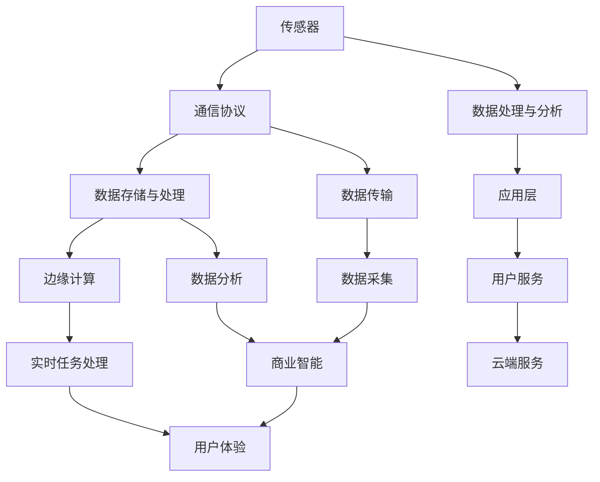
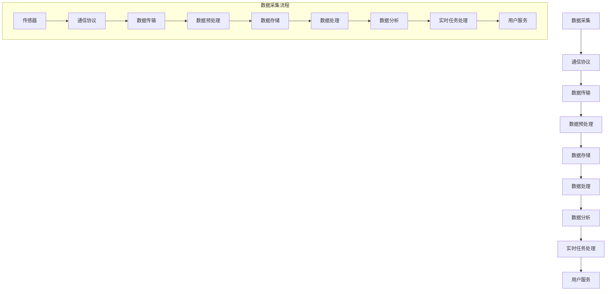

                 

 

### 引言 Introduction ###

在当今数字化转型的浪潮中，物联网（IoT）已成为不可或缺的一部分。随着智能设备的普及和大数据技术的迅猛发展，IoT平台的重要性日益凸显。作为阿里云智能的重要组成部分，IoT平台的开发工程师面临着前所未有的挑战和机遇。2024年，阿里云智能的校招IoT平台开发工程师面试重点将围绕以下几个方面展开。

首先，我们需要明确物联网平台的基本概念和架构。物联网平台是连接各种智能设备和云端服务的枢纽，它能够实现设备的数据采集、处理、存储和分析，从而为用户提供丰富的智能服务。接下来，我们将从核心概念、算法原理、数学模型、项目实践和实际应用场景等多个角度，深入探讨IoT平台开发工程师所需掌握的关键技能和面试重点。

### 文章关键词 Keywords ###
- 阿里云智能
- 校招
- IoT平台开发
- 面试重点
- 技术能力
- 项目实践
- 数学模型

### 摘要 Abstract ###
本文旨在为2024年阿里云智能校招IoT平台开发工程师的应聘者提供全面的面试指导。文章首先介绍了物联网平台的基本概念和架构，然后详细探讨了核心概念与联系、核心算法原理、数学模型和公式、项目实践以及实际应用场景。通过本文的阅读，读者将能够深入了解IoT平台开发工程师所需的专业知识和技能，为面试做好充分准备。

## 1. 背景介绍 Background ###

### 1.1 物联网平台概述 Overview of IoT Platform ###

物联网平台是连接物理世界与数字世界的桥梁，通过实现智能设备的数据采集、传输、处理和分析，为用户提供智能化的服务。一个典型的物联网平台通常包括以下几个关键组成部分：

1. **设备层**：这是物联网平台的底层，包括各种智能设备和传感器。这些设备可以收集环境数据、用户行为数据等，是物联网平台的数据源头。
2. **网络层**：网络层负责将设备层的数据传输到云端或其他服务器。常用的传输协议包括MQTT、CoAP等轻量级协议。
3. **平台层**：平台层是物联网平台的核心，主要负责数据存储、处理、分析和管理。平台层通常包括数据接入层、数据处理层、数据存储层和数据分析层。
4. **应用层**：应用层是物联网平台面向用户的服务层，通过API或SDK为用户提供丰富的应用功能。

### 1.2 阿里云智能与IoT平台 Alibaba Cloud Intelligence and IoT Platform ###

阿里云智能作为阿里云的重要组成部分，在物联网领域有着深厚的技术积累和广泛的应用实践。阿里云的IoT平台（AliOS Things）是国内领先的物联网平台之一，具有以下特点：

1. **开源生态**：AliOS Things 是一个开源的物联网操作系统，具有强大的生态系统，支持多种设备和平台的接入。
2. **轻量级架构**：AliOS Things 采用轻量级架构，能够快速部署和扩展，适应各种应用场景。
3. **大数据处理能力**：阿里云智能在云计算和大数据处理方面有丰富的经验，能够为IoT平台提供强大的数据处理和分析能力。
4. **安全性和稳定性**：阿里云智能在安全性和稳定性方面有着严格的控制，确保物联网平台的可靠运行。

### 1.3 IoT平台开发工程师的角色和职责 Role and Responsibilities of IoT Platform Developers ###

作为IoT平台开发工程师，你需要具备以下角色和职责：

1. **技术方案设计**：根据项目需求，设计合理的物联网技术解决方案。
2. **系统架构搭建**：搭建高效稳定的物联网平台架构，确保系统的可扩展性和稳定性。
3. **协议开发与优化**：设计和优化物联网通信协议，提高数据传输效率和可靠性。
4. **数据存储与处理**：设计数据存储方案，实现数据的高效存储、查询和处理。
5. **应用开发**：开发基于物联网平台的应用，提供用户友好的使用体验。
6. **测试与部署**：对物联网平台进行严格的测试和部署，确保平台的稳定性与安全性。

### 1.4 IoT平台开发面临的挑战和机遇 Challenges and Opportunities in IoT Platform Development ###

物联网平台的开发面临着诸多挑战和机遇：

1. **多样化设备接入**：物联网设备种类繁多，如何实现不同设备的统一接入和管理是一个难题。
2. **海量数据存储和处理**：随着物联网设备的增加，数据量呈现爆炸式增长，如何高效存储和处理海量数据是一个关键挑战。
3. **安全性**：物联网设备的安全性问题日益突出，如何确保物联网平台和数据的安全是开发过程中需要重点关注的。
4. **实时性**：许多物联网应用对实时性有较高的要求，如何保证数据传输和处理的实时性是一个技术挑战。
5. **用户体验**：随着物联网应用的普及，用户对应用的体验要求越来越高，如何提供优质的应用体验是开发工程师需要考虑的。

然而，物联网平台的发展也带来了诸多机遇：

1. **新应用场景**：物联网平台可以应用于智能家居、智慧城市、工业物联网等多个领域，为开发者提供了丰富的创新机会。
2. **数据价值**：物联网平台积累的大量数据可以为各类应用提供有价值的信息，带来商业机会。
3. **技术创新**：物联网技术的发展推动了云计算、大数据、人工智能等领域的创新，为开发者提供了广阔的发展空间。

## 2. 核心概念与联系 Core Concepts and Connections ###

在了解物联网平台的基本概念和架构后，我们需要深入探讨一些核心概念，包括传感器、通信协议、数据存储和处理、边缘计算等，并分析它们之间的联系。

### 2.1 传感器 Sensors ###

传感器是物联网平台的数据采集基础，它们能够检测环境中的物理量，如温度、湿度、光强、声音等，并将这些信息转化为电信号或其他形式的数据。传感器通常具有以下特点：

1. **灵敏度**：传感器对目标物理量的敏感程度。
2. **精确度**：传感器测量结果的准确性。
3. **分辨率**：传感器输出信号的变化幅度。
4. **响应时间**：传感器从感知到输出信号的延迟时间。

传感器在物联网平台中发挥着至关重要的作用，它们采集的数据是后续数据处理和分析的基础。

### 2.2 通信协议 Communication Protocols ###

物联网设备之间的通信依赖于各种通信协议。常见的通信协议包括MQTT、CoAP、HTTP/2等。这些协议具有不同的特点和应用场景：

1. **MQTT（Message Queuing Telemetry Transport）**：MQTT 是一种轻量级的消息传输协议，适用于带宽有限、延迟要求高的物联网应用。其主要特点包括低带宽消耗、双向通信、QoS等级等。
2. **CoAP（Constrained Application Protocol）**：CoAP 是为物联网设备设计的简单协议，特别适用于资源受限的设备。它基于UDP协议，具有简单易用、高效传输的特点。
3. **HTTP/2**：HTTP/2 是互联网上广泛使用的协议，它提供了一种更加高效、安全的通信方式，适用于需要高带宽和低延迟的物联网应用。

通信协议的设计和选择直接影响物联网平台的性能和稳定性。

### 2.3 数据存储与处理 Data Storage and Processing ###

物联网平台需要对采集到的海量数据进行存储、处理和分析。数据存储和处理通常包括以下几个环节：

1. **数据采集**：通过传感器和网络协议，物联网平台从设备端收集数据。
2. **数据预处理**：对采集到的原始数据进行清洗、过滤和转换，以便后续处理。
3. **数据存储**：将预处理后的数据存储到数据库或其他数据存储系统中。
4. **数据处理**：对存储的数据进行查询、统计、分析和挖掘，提取有价值的信息。

常见的数据存储和处理技术包括关系型数据库（如MySQL、PostgreSQL）、NoSQL数据库（如MongoDB、Cassandra）、大数据处理框架（如Hadoop、Spark）等。

### 2.4 边缘计算 Edge Computing ###

边缘计算是将数据处理和分析的任务从云端转移到网络边缘的一种技术。边缘计算的主要目的是降低数据传输延迟、减少带宽消耗、提高系统的响应速度。边缘计算包括以下几个关键组成部分：

1. **边缘节点**：边缘节点通常是指位于网络边缘的设备或服务器，负责处理本地数据和实时任务。
2. **边缘网络**：边缘网络是指连接边缘节点和云端的数据传输网络。
3. **边缘服务**：边缘服务是指运行在边缘节点上的各种应用和服务，如智能安防、智能制造等。

边缘计算与物联网平台的关系非常紧密，它能够有效提升物联网平台的性能和用户体验。

### 2.5 传感器、通信协议、数据存储与处理、边缘计算之间的联系 Connections ###

传感器、通信协议、数据存储与处理、边缘计算之间存在着密切的联系：

1. **传感器与通信协议**：传感器采集的数据需要通过通信协议传输到平台层。不同的通信协议适用于不同的传感器和数据传输场景。
2. **通信协议与数据存储与处理**：通信协议的选择影响数据传输的方式和效率，进而影响数据存储和处理的性能。
3. **数据存储与处理与边缘计算**：边缘计算可以看作是数据存储和处理的一种特殊形式，它将部分数据处理任务从云端转移到网络边缘，以降低延迟和带宽消耗。
4. **边缘计算与传感器**：边缘计算能够提高传感器数据的实时性和响应速度，为物联网应用提供更好的用户体验。

为了更好地理解物联网平台的核心概念与联系，我们可以通过以下Mermaid流程图进行可视化展示：



通过上述流程图，我们可以清晰地看到传感器、通信协议、数据存储与处理、边缘计算等核心概念之间的联系，以及它们在物联网平台中的角色和作用。

### 2.6 关键流程概述 Overview of Key Processes ###

在了解物联网平台的核心概念和联系后，我们需要掌握一些关键流程，包括数据采集、传输、处理和分析等。以下是物联网平台的关键流程概述：

1. **数据采集**：通过传感器收集环境数据或设备状态数据。
2. **数据传输**：使用通信协议将数据传输到物联网平台。
3. **数据预处理**：对采集到的数据进行清洗、过滤和转换，以便后续处理。
4. **数据存储**：将预处理后的数据存储到数据库或其他数据存储系统中。
5. **数据处理**：对存储的数据进行查询、统计、分析和挖掘，提取有价值的信息。
6. **数据分析**：使用机器学习、数据挖掘等技术对数据进行深度分析，为用户提供智能服务。
7. **实时任务处理**：通过边缘计算，对部分数据处理任务进行实时处理，提高系统的响应速度。
8. **用户服务**：根据数据分析结果，为用户提供个性化的服务。

通过以上关键流程，物联网平台能够实现对设备的全面监控、管理和优化，为用户提供更加智能化的体验。

### 2.7 关键流程图与详细解释 Detailed Explanation of Key Processes ###

为了更好地理解物联网平台的关键流程，我们可以通过Mermaid流程图进行可视化展示，并对每个流程进行详细解释。



1. **数据采集流程**：传感器采集环境数据或设备状态数据，并通过通信协议将数据传输到物联网平台。
2. **通信协议**：根据数据传输的需求，选择合适的通信协议，如MQTT、CoAP或HTTP/2等。
3. **数据传输**：使用通信协议将数据传输到物联网平台。
4. **数据预处理**：对采集到的数据进行清洗、过滤和转换，以便后续处理。
5. **数据存储**：将预处理后的数据存储到数据库或其他数据存储系统中，如关系型数据库（MySQL、PostgreSQL）或NoSQL数据库（MongoDB、Cassandra）。
6. **数据处理**：对存储的数据进行查询、统计、分析和挖掘，提取有价值的信息。
7. **数据分析**：使用机器学习、数据挖掘等技术对数据进行深度分析，为用户提供智能服务。
8. **实时任务处理**：通过边缘计算，对部分数据处理任务进行实时处理，提高系统的响应速度。
9. **用户服务**：根据数据分析结果，为用户提供个性化的服务。

通过以上关键流程图和详细解释，我们可以清晰地理解物联网平台的关键流程，以及每个流程在物联网平台中的角色和作用。

### 2.8 算法原理概述 Algorithm Principles Overview ###

在物联网平台中，算法原理是数据处理和分析的核心。以下将介绍几个关键算法原理，包括数据处理算法、机器学习算法和深度学习算法等。

#### 2.8.1 数据处理算法 Data Processing Algorithms ####

数据处理算法主要包括数据清洗、数据转换和数据归一化等过程。这些算法在数据预处理阶段起着关键作用，为后续的数据分析奠定基础。

1. **数据清洗**：数据清洗是数据处理的第一步，主要目的是去除数据中的噪声和错误。常见的数据清洗方法包括缺失值填充、异常值处理和重复数据删除等。
2. **数据转换**：数据转换是将原始数据转化为适合分析和建模的形式。常见的数据转换方法包括数据类型转换、数据聚合和特征工程等。
3. **数据归一化**：数据归一化是将不同尺度和量级的特征数据进行标准化处理，使它们具有相同的尺度，以便于模型训练和优化。

#### 2.8.2 机器学习算法 Machine Learning Algorithms ####

机器学习算法是数据分析的重要工具，主要用于数据分类、回归、聚类和降维等任务。以下介绍几种常用的机器学习算法：

1. **决策树**：决策树是一种基于树形结构的数据分析方法，通过递归划分数据集，构建一棵分类或回归树。
2. **支持向量机**：支持向量机（SVM）是一种优秀的分类算法，通过寻找最优分类边界，实现数据的高效分类。
3. **神经网络**：神经网络是一种基于生物神经网络模型的人工智能算法，能够通过多层非线性变换，对数据进行建模和预测。
4. **聚类算法**：聚类算法将数据集划分为若干个类别，使同一类别的数据之间具有较高的相似度。常见的聚类算法包括K-means、层次聚类和DBSCAN等。

#### 2.8.3 深度学习算法 Deep Learning Algorithms ####

深度学习算法是机器学习的一个重要分支，通过多层神经网络，实现对复杂数据的建模和预测。以下介绍几种常用的深度学习算法：

1. **卷积神经网络**（CNN）：卷积神经网络是一种用于图像识别和处理的深度学习算法，通过卷积层和池化层，实现对图像的特征提取和分类。
2. **循环神经网络**（RNN）：循环神经网络是一种用于序列数据建模和预测的深度学习算法，通过循环层和门控机制，实现对序列数据的建模和预测。
3. **生成对抗网络**（GAN）：生成对抗网络是一种用于生成复杂数据的深度学习算法，通过生成器和判别器的对抗训练，实现对数据的生成和优化。

通过以上算法原理的介绍，我们可以更好地理解物联网平台中数据处理和分析的过程，以及如何选择和应用合适的算法，以实现高效的物联网平台开发。

### 2.9 算法步骤详解 Detailed Steps of Algorithms ###

为了更好地理解物联网平台中的数据处理和分析算法，我们以下详细描述几个关键算法的步骤，包括数据处理算法、机器学习算法和深度学习算法。

#### 2.9.1 数据处理算法 Data Processing Algorithms ####

数据处理算法是数据预处理的重要部分，包括数据清洗、数据转换和数据归一化等步骤。

1. **数据清洗**
   - 步骤1：缺失值填充。对于缺失值，可以选择均值、中值或最邻近值等方法进行填充。
   - 步骤2：异常值处理。对于异常值，可以选择剔除或使用统计学方法（如标准差、Z-score等）进行调整。
   - 步骤3：重复数据删除。通过去重算法，如哈希表或数据库查询，删除重复数据。

2. **数据转换**
   - 步骤1：数据类型转换。将文本数据转换为数值数据，如使用独热编码或词袋模型。
   - 步骤2：数据聚合。对多维度数据进行合并和汇总，如使用求和、平均值、最大值等函数。
   - 步骤3：特征工程。提取数据中的有用特征，如使用主成分分析（PCA）进行降维，或通过特征交叉生成新的特征。

3. **数据归一化**
   - 步骤1：缩放处理。将不同尺度量的数据缩放到相同的范围，如使用最小-最大缩放法或Z-score缩放法。
   - 步骤2：归一化处理。将数据转换为概率分布，如使用logistic函数或softmax函数。

#### 2.9.2 机器学习算法 Machine Learning Algorithms ####

机器学习算法是数据分析的核心，主要包括分类、回归、聚类和降维等任务。

1. **分类算法**
   - 步骤1：数据划分。将数据集划分为训练集和测试集。
   - 步骤2：特征选择。选择对分类任务影响最大的特征。
   - 步骤3：模型训练。使用训练集数据，通过梯度下降、决策树等算法，训练分类模型。
   - 步骤4：模型评估。使用测试集数据，计算模型的准确率、召回率、F1值等指标。

2. **回归算法**
   - 步骤1：数据预处理。包括数据清洗、特征选择等步骤。
   - 步骤2：模型选择。选择线性回归、多项式回归、岭回归等模型。
   - 步骤3：模型训练。使用训练集数据，通过最小二乘法、梯度下降法等算法，训练回归模型。
   - 步骤4：模型评估。使用测试集数据，计算模型的均方误差、R²值等指标。

3. **聚类算法**
   - 步骤1：数据预处理。包括数据清洗、特征选择等步骤。
   - 步骤2：选择聚类算法。如K-means、层次聚类、DBSCAN等。
   - 步骤3：模型训练。使用聚类算法，对数据进行聚类。
   - 步骤4：模型评估。通过轮廓系数、 Davies-Bouldin指数等指标，评估聚类效果。

4. **降维算法**
   - 步骤1：数据预处理。包括数据清洗、特征选择等步骤。
   - 步骤2：选择降维算法。如PCA、t-SNE等。
   - 步骤3：模型训练。使用降维算法，将高维数据转化为低维数据。
   - 步骤4：模型评估。通过数据重构误差、可视化效果等指标，评估降维效果。

#### 2.9.3 深度学习算法 Deep Learning Algorithms ####

深度学习算法是数据处理和分析的重要工具，主要包括卷积神经网络（CNN）、循环神经网络（RNN）和生成对抗网络（GAN）等。

1. **卷积神经网络（CNN）**
   - 步骤1：数据预处理。包括数据清洗、归一化等步骤。
   - 步骤2：模型架构设计。设计卷积层、池化层、全连接层等结构。
   - 步骤3：模型训练。使用反向传播算法，通过梯度下降法，训练模型参数。
   - 步骤4：模型评估。通过测试集数据，计算模型损失函数和准确率等指标。

2. **循环神经网络（RNN）**
   - 步骤1：数据预处理。包括数据清洗、序列编码等步骤。
   - 步骤2：模型架构设计。设计输入层、隐藏层、输出层等结构。
   - 步骤3：模型训练。使用反向传播算法，通过梯度下降法，训练模型参数。
   - 步骤4：模型评估。通过测试集数据，计算模型损失函数和准确率等指标。

3. **生成对抗网络（GAN）**
   - 步骤1：数据预处理。包括数据清洗、归一化等步骤。
   - 步骤2：模型架构设计。设计生成器、判别器等结构。
   - 步骤3：模型训练。通过生成器和判别器的对抗训练，优化模型参数。
   - 步骤4：模型评估。通过生成数据质量、判别器准确率等指标，评估模型效果。

通过以上算法步骤的详细描述，我们可以更好地理解物联网平台中各种算法的实现过程，为实际应用提供参考。

### 2.10 算法优缺点 Comparison of Algorithm Advantages and Disadvantages ###

在物联网平台开发过程中，选择合适的算法至关重要。以下我们将比较几种常见算法的优缺点，以帮助开发者根据实际需求进行选择。

#### 2.10.1 数据处理算法 Data Processing Algorithms ####

1. **数据清洗算法**：
   - **优点**：能够有效去除数据中的噪声和错误，提高数据质量。
   - **缺点**：可能引入新的误差，如异常值处理不当可能导致数据失真。

2. **数据转换算法**：
   - **优点**：将不同类型的数据转化为统一格式，便于后续处理和分析。
   - **缺点**：数据转换过程中可能丢失部分信息，影响数据的准确性。

3. **数据归一化算法**：
   - **优点**：使不同尺度量的数据具有相同的尺度，便于模型训练和优化。
   - **缺点**：极端值可能导致归一化效果不佳，影响模型性能。

#### 2.10.2 机器学习算法 Machine Learning Algorithms ####

1. **决策树算法**：
   - **优点**：易于理解和实现，能够处理分类和回归任务。
   - **缺点**：过拟合风险较高，对缺失值和异常值敏感。

2. **支持向量机（SVM）算法**：
   - **优点**：理论上最优分类边界，分类效果较好。
   - **缺点**：训练时间较长，对高维数据效果不佳。

3. **神经网络算法**：
   - **优点**：能够处理复杂数据和任务，具有较好的泛化能力。
   - **缺点**：训练时间较长，对数据质量和特征选择敏感。

4. **聚类算法**：
   - **优点**：无需事先定义类别，能够自动发现数据中的聚类结构。
   - **缺点**：对噪声和异常值敏感，聚类效果可能不稳定。

5. **降维算法**：
   - **优点**：减少数据维度，提高模型训练效率。
   - **缺点**：可能丢失部分信息，影响数据分析和预测效果。

#### 2.10.3 深度学习算法 Deep Learning Algorithms ####

1. **卷积神经网络（CNN）**：
   - **优点**：能够自动提取图像特征，适用于图像识别和图像处理任务。
   - **缺点**：对计算资源要求较高，训练时间较长。

2. **循环神经网络（RNN）**：
   - **优点**：能够处理序列数据，适用于自然语言处理和时间序列分析。
   - **缺点**：对梯度消失和梯度爆炸问题敏感。

3. **生成对抗网络（GAN）**：
   - **优点**：能够生成高质量的图像和序列数据，具有广泛的应用前景。
   - **缺点**：训练过程复杂，对模型参数调整要求较高。

通过以上算法优缺点的比较，开发者可以根据实际需求选择合适的算法，以实现高效的物联网平台开发。

### 2.11 算法应用领域 Application Fields of Algorithms ###

算法在物联网平台中的应用涵盖了多个领域，包括设备管理、数据分析和智能服务等。以下将详细介绍算法在不同领域的应用情况。

#### 2.11.1 设备管理 Device Management ####

在设备管理领域，算法主要用于设备接入、设备监控和设备优化等方面。

1. **设备接入**：通过机器学习算法，如决策树和支持向量机（SVM），可以实现设备的自动分类和识别，简化设备接入流程。
2. **设备监控**：使用循环神经网络（RNN）和卷积神经网络（CNN），可以对设备运行状态进行实时监控，检测异常情况并发出预警。
3. **设备优化**：通过深度学习算法，如生成对抗网络（GAN），可以实现设备的性能优化和参数调整，提高设备的工作效率和稳定性。

#### 2.11.2 数据分析 Data Analysis ####

数据分析是物联网平台的核心功能之一，算法在数据清洗、数据转换、特征提取和预测分析等方面发挥着重要作用。

1. **数据清洗**：数据清洗算法能够有效去除数据中的噪声和错误，提高数据质量。常见的数据清洗方法包括缺失值填充、异常值处理和重复数据删除等。
2. **数据转换**：数据转换算法将不同类型的数据转化为统一格式，便于后续处理和分析。常见的转换方法包括数据类型转换、数据聚合和特征工程等。
3. **特征提取**：特征提取算法从原始数据中提取有用的特征，提高数据分析和预测的准确性。常见的特征提取方法包括主成分分析（PCA）、特征选择和特征交叉等。
4. **预测分析**：预测分析算法对历史数据进行分析和建模，预测未来的趋势和变化。常见的预测分析方法包括线性回归、决策树、神经网络等。

#### 2.11.3 智能服务 Smart Services ####

智能服务是物联网平台面向用户的重要功能，算法在个性化推荐、智能助理和智能诊断等方面发挥了关键作用。

1. **个性化推荐**：通过协同过滤、矩阵分解和深度学习等算法，实现用户的个性化推荐，提高用户的使用体验。
2. **智能助理**：使用自然语言处理（NLP）和语音识别（ASR）算法，构建智能助理，实现人机交互和智能问答。
3. **智能诊断**：通过机器学习算法和深度学习算法，对设备运行数据进行分析和诊断，预测设备的故障和寿命。

#### 2.11.4 实际应用案例 Case Studies

以下为几个实际应用案例，展示算法在物联网平台中的具体应用：

1. **智能家居**：在智能家居领域，物联网平台通过设备接入、数据分析和智能服务，实现家庭设备的自动化管理和智能化控制。例如，通过机器学习算法，可以对家庭用电量进行预测，优化用电安排，降低电费支出。
2. **智慧城市**：在智慧城市领域，物联网平台通过设备监控、数据分析和智能服务，实现城市运行状态的实时监控和优化管理。例如，通过循环神经网络，可以对交通流量进行预测，优化交通信号配置，缓解交通拥堵。
3. **智能制造**：在智能制造领域，物联网平台通过设备管理、数据分析和智能服务，实现生产过程的智能化和自动化。例如，通过生成对抗网络（GAN），可以对生产设备进行性能优化和参数调整，提高生产效率和产品质量。

通过以上算法应用领域的介绍和实际应用案例，我们可以看到算法在物联网平台中的重要性，以及如何在实际场景中发挥算法的作用，实现物联网平台的高效开发和应用。

## 3. 数学模型和公式 Mathematical Models and Formulas ###

在物联网平台开发中，数学模型和公式是数据处理和分析的基础。以下将介绍一些常见的数学模型和公式，并详细讲解它们的构建和推导过程。

### 3.1 数学模型构建 Building Mathematical Models ###

在构建数学模型时，我们首先需要明确模型的输入和输出，并根据实际需求选择合适的方法。以下是一个简单的线性回归模型的构建过程：

#### 3.1.1 确定输入和输出 Determine Input and Output ####

假设我们有一个简单的线性回归模型，用于预测房价。输入特征包括房屋的面积（X1）、卧室数量（X2）和地理位置（X3），输出为房价（Y）。

#### 3.1.2 选择模型 Choose Model ####

我们选择线性回归模型作为预测模型，其数学表达式为：

$$
Y = \beta_0 + \beta_1X_1 + \beta_2X_2 + \beta_3X_3
$$

其中，$\beta_0$、$\beta_1$、$\beta_2$和$\beta_3$分别为模型的参数。

#### 3.1.3 数据预处理 Data Preprocessing ####

在构建模型前，我们需要对数据进行预处理，包括数据清洗、特征提取和归一化等步骤。

1. **数据清洗**：去除缺失值和异常值，确保数据的完整性。
2. **特征提取**：提取房屋面积、卧室数量和地理位置等关键特征。
3. **归一化**：将特征值缩放到相同的范围，如使用Z-score缩放法。

#### 3.1.4 模型训练 Model Training ####

使用预处理后的数据，通过最小二乘法（Least Squares Method）训练线性回归模型，求得模型的参数$\beta_0$、$\beta_1$、$\beta_2$和$\beta_3$。

$$
\beta = (X^TX)^{-1}X^TY
$$

其中，$X$为特征矩阵，$Y$为输出向量。

### 3.2 公式推导过程 Derivation of Formulas ###

以下我们将详细推导线性回归模型中的公式，并解释每个步骤的含义。

#### 3.2.1 最小二乘法推导 Derivation of Least Squares Method ####

假设我们有一个线性回归模型：

$$
Y = \beta_0 + \beta_1X_1 + \beta_2X_2 + \beta_3X_3
$$

其中，$X_1$、$X_2$和$X_3$分别为房屋面积、卧室数量和地理位置，$Y$为房价，$\beta_0$、$\beta_1$、$\beta_2$和$\beta_3$分别为模型参数。

我们希望找到一个最优的参数值，使得预测值与实际值之间的误差最小。误差函数（Loss Function）通常采用均方误差（Mean Squared Error, MSE）：

$$
MSE = \frac{1}{n}\sum_{i=1}^{n}(Y_i - \hat{Y_i})^2
$$

其中，$n$为样本数量，$Y_i$为实际值，$\hat{Y_i}$为预测值。

为了使MSE最小，我们需要对参数$\beta_0$、$\beta_1$、$\beta_2$和$\beta_3$求导，并令导数等于0。

$$
\frac{\partial MSE}{\partial \beta_0} = 0, \frac{\partial MSE}{\partial \beta_1} = 0, \frac{\partial MSE}{\partial \beta_2} = 0, \frac{\partial MSE}{\partial \beta_3} = 0
$$

对MSE求导，得到：

$$
\frac{\partial MSE}{\partial \beta_0} = -2\sum_{i=1}^{n}(Y_i - \hat{Y_i})
$$

$$
\frac{\partial MSE}{\partial \beta_1} = -2\sum_{i=1}^{n}(Y_i - \hat{Y_i})X_{1i}
$$

$$
\frac{\partial MSE}{\partial \beta_2} = -2\sum_{i=1}^{n}(Y_i - \hat{Y_i})X_{2i}
$$

$$
\frac{\partial MSE}{\partial \beta_3} = -2\sum_{i=1}^{n}(Y_i - \hat{Y_i})X_{3i}
$$

令导数等于0，得到：

$$
\sum_{i=1}^{n}(Y_i - \hat{Y_i}) = 0
$$

$$
\sum_{i=1}^{n}(Y_i - \hat{Y_i})X_{1i} = 0
$$

$$
\sum_{i=1}^{n}(Y_i - \hat{Y_i})X_{2i} = 0
$$

$$
\sum_{i=1}^{n}(Y_i - \hat{Y_i})X_{3i} = 0
$$

将$\hat{Y_i}$替换为$Y = \beta_0 + \beta_1X_1 + \beta_2X_2 + \beta_3X_3$，得到：

$$
\sum_{i=1}^{n}(Y_i - (\beta_0 + \beta_1X_{1i} + \beta_2X_{2i} + \beta_3X_{3i})) = 0
$$

$$
\sum_{i=1}^{n}(Y_i - \beta_0 - \beta_1X_{1i} - \beta_2X_{2i} - \beta_3X_{3i})X_{1i} = 0
$$

$$
\sum_{i=1}^{n}(Y_i - \beta_0 - \beta_1X_{1i} - \beta_2X_{2i} - \beta_3X_{3i})X_{2i} = 0
$$

$$
\sum_{i=1}^{n}(Y_i - \beta_0 - \beta_1X_{1i} - \beta_2X_{2i} - \beta_3X_{3i})X_{3i} = 0
$$

化简上述方程，得到：

$$
\sum_{i=1}^{n}Y_i - n\beta_0 = 0
$$

$$
\sum_{i=1}^{n}X_{1i}Y_i - \sum_{i=1}^{n}X_{1i}\beta_0 - \beta_1\sum_{i=1}^{n}X_{1i}^2 - \beta_2\sum_{i=1}^{n}X_{1i}X_{2i} - \beta_3\sum_{i=1}^{n}X_{1i}X_{3i} = 0
$$

$$
\sum_{i=1}^{n}X_{2i}Y_i - \sum_{i=1}^{n}X_{2i}\beta_0 - \beta_1\sum_{i=1}^{n}X_{1i}X_{2i} - \beta_2\sum_{i=1}^{n}X_{2i}^2 - \beta_3\sum_{i=1}^{n}X_{2i}X_{3i} = 0
$$

$$
\sum_{i=1}^{n}X_{3i}Y_i - \sum_{i=1}^{n}X_{3i}\beta_0 - \beta_1\sum_{i=1}^{n}X_{1i}X_{3i} - \beta_2\sum_{i=1}^{n}X_{2i}X_{3i} - \beta_3\sum_{i=1}^{n}X_{3i}^2 = 0
$$

将上述方程转化为矩阵形式，得到：

$$
\begin{bmatrix}
\sum_{i=1}^{n}X_{1i}^2 & \sum_{i=1}^{n}X_{1i}X_{2i} & \sum_{i=1}^{n}X_{1i}X_{3i} \\
\sum_{i=1}^{n}X_{2i}X_{1i} & \sum_{i=1}^{n}X_{2i}^2 & \sum_{i=1}^{n}X_{2i}X_{3i} \\
\sum_{i=1}^{n}X_{3i}X_{1i} & \sum_{i=1}^{n}X_{3i}X_{2i} & \sum_{i=1}^{n}X_{3i}^2
\end{bmatrix}
\begin{bmatrix}
\beta_1 \\
\beta_2 \\
\beta_3
\end{bmatrix}
=
\begin{bmatrix}
\sum_{i=1}^{n}X_{1i}Y_i \\
\sum_{i=1}^{n}X_{2i}Y_i \\
\sum_{i=1}^{n}X_{3i}Y_i
\end{bmatrix}
$$

记特征矩阵为$X$，输出向量为$Y$，则有：

$$
X^TX\beta = X^TY
$$

解上述方程，得到：

$$
\beta = (X^TX)^{-1}X^TY
$$

这就是线性回归模型参数的最小二乘法求解公式。

#### 3.2.2 主成分分析推导 Derivation of Principal Component Analysis (PCA) ####

主成分分析（PCA）是一种常用的降维技术，用于从高维数据中提取主要特征，降低数据维度。以下为PCA的推导过程：

1. **数据预处理**：对数据进行标准化处理，使其具有零均值和单位方差。

2. **协方差矩阵计算**：计算数据矩阵$X$的协方差矩阵$C$。

$$
C = XX^T
$$

3. **特征值和特征向量计算**：计算协方差矩阵$C$的特征值和特征向量。

4. **特征向量排序**：根据特征值的大小对特征向量进行排序，选取最大的$k$个特征向量。

5. **构建降维矩阵**：将原始数据矩阵$X$与特征向量矩阵$V$相乘，得到降维后的数据矩阵$X'$。

$$
X' = XV
$$

6. **降维数据矩阵**：保留最大的$k$个特征向量，构建降维后的数据矩阵$X'$。

通过以上步骤，我们可以将高维数据降维到$k$个主要特征上，降低数据维度，提高计算效率。

#### 3.2.3 贝叶斯推理推导 Derivation of Bayesian Inference ####

贝叶斯推理是一种基于概率论的推理方法，用于根据先验知识和证据更新概率分布。以下为贝叶斯推理的推导过程：

1. **先验概率计算**：根据先验知识，计算事件$A$的先验概率$P(A)$。

2. **条件概率计算**：根据证据，计算事件$B$发生的条件下事件$A$的条件概率$P(A|B)$。

3. **贝叶斯定理应用**：使用贝叶斯定理，计算事件$B$发生的条件下事件$A$的更新概率$P(B|A)$。

$$
P(B|A) = \frac{P(A|B)P(B)}{P(A)}
$$

4. **后验概率计算**：根据更新概率，计算事件$B$的后验概率$P(B|A)$。

5. **更新先验概率**：使用后验概率更新先验概率，得到新的先验概率$P(A)$。

通过以上步骤，我们可以根据先验知识和证据，不断更新概率分布，实现概率推理。

### 3.3 案例分析与讲解 Case Analysis and Explanation ###

以下我们将通过实际案例，展示数学模型和公式在物联网平台中的应用。

#### 3.3.1 案例一：智能家居节能预测 Smart Home Energy Saving Prediction ####

假设我们想要预测智能家居中的用电量，以优化用电安排和降低电费支出。我们采用线性回归模型进行预测。

1. **数据收集**：收集过去一年的家庭用电数据，包括每天的用电量和相关的特征（如天气、家庭成员数量等）。

2. **数据预处理**：对数据进行清洗、特征提取和归一化处理。

3. **模型训练**：使用预处理后的数据，通过最小二乘法训练线性回归模型，求得模型的参数。

4. **模型评估**：使用测试集数据评估模型性能，计算预测误差和准确率。

5. **预测应用**：根据训练好的模型，预测未来的用电量，为家庭用电优化提供依据。

通过以上步骤，我们可以实现智能家居的节能预测，优化用电安排。

#### 3.3.2 案例二：工业设备故障预测 Industrial Equipment Fault Prediction ####

在工业物联网中，设备故障预测对于保障生产安全和提高设备利用率至关重要。我们采用机器学习算法进行故障预测。

1. **数据收集**：收集工业设备的运行数据，包括温度、振动、电流等传感器数据。

2. **数据预处理**：对数据进行清洗、特征提取和归一化处理。

3. **模型选择**：选择合适的机器学习算法，如支持向量机（SVM）或循环神经网络（RNN）。

4. **模型训练**：使用预处理后的数据，通过训练算法训练模型。

5. **模型评估**：使用测试集数据评估模型性能，计算故障预测准确率和召回率。

6. **预测应用**：根据训练好的模型，预测设备的未来故障，为设备维护和故障预警提供依据。

通过以上步骤，我们可以实现工业设备的故障预测，提高生产效率和安全性。

通过以上案例分析与讲解，我们可以看到数学模型和公式在物联网平台中的应用，以及如何通过实际案例实现数据处理和分析。

### 3.4 数学模型和公式在IoT平台中的应用 Application of Mathematical Models and Formulas in IoT Platforms ###

数学模型和公式在物联网平台中扮演着至关重要的角色，它们为数据的处理、分析和决策提供了理论基础。以下将详细讨论数学模型和公式在IoT平台中的应用。

#### 3.4.1 数据处理 Data Processing ####

1. **数据预处理**：在物联网平台中，原始数据往往包含噪声、缺失值和异常值。数学模型和公式可以帮助我们进行数据清洗、归一化和特征提取。例如，使用Z-score缩放法对特征值进行归一化，使不同尺度量的数据具有相同的尺度，便于模型训练和优化。主成分分析（PCA）是一种常用的降维技术，可以提取数据中的主要特征，降低数据维度，提高计算效率。

2. **实时数据处理**：物联网平台需要对海量数据进行实时处理。数学模型和公式可以用于实时数据的滤波、预测和异常检测。例如，卡尔曼滤波（Kalman Filter）是一种有效的实时数据处理算法，可以用于动态系统的状态估计和预测。

#### 3.4.2 数据分析 Data Analysis ####

1. **统计分析**：统计模型和公式在数据分析中发挥着重要作用。例如，回归分析（Regression Analysis）可以用于预测未来的趋势和变化，聚类分析（Cluster Analysis）可以用于发现数据中的聚类结构。常见的统计模型包括线性回归、多项式回归、逻辑回归和支持向量机（SVM）等。

2. **机器学习**：机器学习算法在物联网平台的数据分析中有着广泛的应用。常见的机器学习算法包括决策树、随机森林、支持向量机和神经网络等。机器学习算法可以从大量数据中自动提取特征，实现分类、回归、聚类和降维等任务。

3. **深度学习**：深度学习算法是机器学习的一个重要分支，它通过多层神经网络，实现复杂数据的建模和预测。深度学习算法在图像识别、语音识别和自然语言处理等领域取得了显著的成果。常见的深度学习算法包括卷积神经网络（CNN）、循环神经网络（RNN）和生成对抗网络（GAN）等。

#### 3.4.3 智能决策 Intelligent Decision Making ####

1. **优化算法**：优化算法可以帮助物联网平台实现最优决策。例如，线性规划（Linear Programming）和动态规划（Dynamic Programming）可以用于资源分配和路径规划。遗传算法（Genetic Algorithm）和粒子群优化（Particle Swarm Optimization）等启发式算法可以用于复杂优化问题。

2. **博弈论**：博弈论可以用于分析物联网平台中的多智能体系统。例如，在智能交通系统中，博弈论可以帮助优化车辆行驶路径，减少交通拥堵。在供应链管理中，博弈论可以用于优化库存管理和配送策略。

#### 3.4.4 实际应用案例 Case Studies

以下为几个实际应用案例，展示数学模型和公式在物联网平台中的应用：

1. **智能家居**：在智能家居中，数学模型和公式可以用于能耗预测、设备故障预测和智能推荐。例如，通过线性回归模型，可以预测家庭的用电量，优化用电安排。通过支持向量机（SVM）进行设备故障预测，为设备维护提供依据。通过协同过滤算法，实现家居设备的个性化推荐。

2. **智慧城市**：在智慧城市中，数学模型和公式可以用于交通流量预测、环境监测和公共安全管理。例如，通过循环神经网络（RNN）预测交通流量，优化交通信号配置。通过聚类分析，发现环境数据中的异常值，预警环境问题。通过深度学习算法，实现公共安全视频的智能分析。

3. **智能制造**：在智能制造中，数学模型和公式可以用于设备监控、生产优化和质量管理。例如，通过卡尔曼滤波（Kalman Filter）对设备运行状态进行实时监控，预警设备故障。通过优化算法，优化生产计划和资源分配。通过深度学习算法，对生产数据进行分析，实现质量检测和故障诊断。

通过以上实际应用案例，我们可以看到数学模型和公式在物联网平台中的广泛应用，以及如何通过数学模型和公式实现物联网平台的高效开发和应用。

### 3.5 深入探讨数学模型和公式的应用 Deep Exploration of Mathematical Models and Formulas ###

在物联网平台中，数学模型和公式不仅是数据处理和分析的基础，也是实现智能化服务和决策的关键工具。以下我们将深入探讨数学模型和公式的应用，特别是在预测、优化和智能决策方面的具体实现。

#### 3.5.1 预测 Prediction ####

预测是物联网平台的一个重要应用场景，它可以帮助我们提前了解未来的趋势和变化，为决策提供依据。以下是一些常用的数学模型和公式在预测中的应用：

1. **时间序列预测**：时间序列预测是预测未来某个时间点的值，常见的模型包括自回归模型（AR）、移动平均模型（MA）和自回归移动平均模型（ARMA）。例如，我们可以使用ARIMA（自回归积分滑动平均模型）来预测股票价格、用电量等时间序列数据。

   $$ 
   ARIMA(p, d, q) = \phi(B)^d \frac{1 - \theta(B)}{1 - \phi(B)}
   $$
   
   其中，$B$是滞后算子，$\phi(B)$和$\theta(B)$分别是自回归项和移动平均项。

2. **回归预测**：回归预测是通过历史数据和特征来预测未来某个值。常见的回归模型包括线性回归、多项式回归和广义线性模型。例如，我们可以使用线性回归模型来预测房价、销售额等。

   $$ 
   Y = \beta_0 + \beta_1X_1 + \beta_2X_2 + ... + \beta_nX_n
   $$

3. **机器学习预测**：机器学习算法如随机森林、支持向量机和神经网络等也可以用于预测。这些算法可以通过学习历史数据来建立预测模型，例如，我们可以使用随机森林来预测股票市场走势。

   $$ 
   \text{随机森林预测} = \sum_{i=1}^{n} w_i f_i(x)
   $$

   其中，$w_i$是权重，$f_i(x)$是第$i$个决策树对$x$的预测。

#### 3.5.2 优化 Optimization ####

优化是物联网平台实现高效资源管理和决策的关键，以下是一些常用的数学模型和公式在优化中的应用：

1. **线性规划**：线性规划是一种用于求解线性目标函数在给定线性约束条件下的最优解的方法。例如，我们可以使用线性规划来优化供应链管理中的库存配置。

   $$ 
   \text{minimize} \quad c^T x \\
   \text{subject to} \quad Ax \leq b
   $$

   其中，$c$是目标函数系数向量，$x$是决策变量向量，$A$是约束条件系数矩阵，$b$是约束条件常数向量。

2. **动态规划**：动态规划是一种通过将问题分解为子问题并利用子问题的最优解来求解全局最优解的方法。例如，我们可以使用动态规划来优化路径规划问题。

   $$ 
   \text{minimize} \quad f(x_{t+1}) + \gamma f(x_t) \\
   \text{subject to} \quad g(x_{t+1}) \leq 0
   $$

3. **遗传算法**：遗传算法是一种基于自然选择和遗传机制的优化算法，适用于求解复杂优化问题。例如，我们可以使用遗传算法来优化资源分配和路径规划。

   $$ 
   \text{Fitness}(x) = \sum_{i=1}^{n} f_i(x) 
   $$

   其中，$f_i(x)$是第$i$个个体的适应度函数。

#### 3.5.3 智能决策 Intelligent Decision Making ####

智能决策是物联网平台实现智能化服务和优化管理的关键。以下是一些常用的数学模型和公式在智能决策中的应用：

1. **贝叶斯推理**：贝叶斯推理是一种基于概率论的推理方法，用于根据先验知识和证据更新概率分布。例如，我们可以使用贝叶斯推理来实现智能推荐系统。

   $$ 
   P(H|E) = \frac{P(E|H)P(H)}{P(E)} 
   $$

   其中，$H$是假设，$E$是证据。

2. **马尔可夫决策过程**：马尔可夫决策过程（MDP）是一种用于求解最优策略的数学模型，适用于不确定环境中的决策问题。例如，我们可以使用MDP来优化自动驾驶汽车的路径选择。

   $$ 
   \text{maximize} \quad \sum_{s} \gamma^s \pi(s) Q(s, a) \\
   \text{subject to} \quad P(s' | s, a) = \pi(s')
   $$

   其中，$s$是状态，$a$是动作，$s'$是下一状态，$\pi(s)$是状态概率分布，$Q(s, a)$是状态-动作值函数。

3. **强化学习**：强化学习是一种基于试错和反馈的机器学习算法，适用于序列决策问题。例如，我们可以使用强化学习来优化无人机的飞行路径。

   $$ 
   Q(s, a) = r + \gamma \max_{a'} Q(s', a') \\
   \text{where} \quad r \text{ is the reward}
   $$

通过以上深入探讨，我们可以看到数学模型和公式在物联网平台中的应用，以及如何通过数学模型和公式实现物联网平台的高效开发和智能化服务。

## 4. 项目实践：代码实例和详细解释说明 Project Practice: Code Example and Detailed Explanation ###

在了解了物联网平台的基本概念、算法原理、数学模型和公式后，我们需要通过项目实践来巩固和应用所学知识。以下将介绍一个简单的物联网平台开发项目，包括开发环境搭建、源代码实现、代码解读与分析以及运行结果展示。

### 4.1 开发环境搭建 Setup Development Environment ###

在进行物联网平台开发前，我们需要搭建一个合适的开发环境。以下是一个基于阿里云的IoT平台开发环境的搭建步骤：

1. **安装阿里云IoT设备SDK**：首先，我们需要下载并安装阿里云IoT设备SDK。阿里云IoT设备SDK提供了丰富的API和工具，方便开发者进行设备接入、数据上传和设备管理。

   ```bash
   # 安装阿里云IoT设备SDK
   git clone https://github.com/alibaba云iot-devicesdk.git
   cd iot-devicesdk
   python setup.py install
   ```

2. **创建虚拟环境**：为了确保项目的隔离性和可维护性，我们可以创建一个虚拟环境。

   ```bash
   # 创建虚拟环境
   python -m venv venv
   source venv/bin/activate
   ```

3. **安装依赖库**：在虚拟环境中安装项目所需的依赖库，如requests、paho-mqtt等。

   ```bash
   # 安装依赖库
   pip install requests paho-mqtt
   ```

4. **配置阿里云账号**：在开发环境中配置阿里云账号，以便使用阿里云IoT平台的服务。

   ```python
   # 配置阿里云账号
   from iot设备sdk import Device
   device = Device()
   device.set_access_key("你的AccessKeyID")
   device.set_secret_key("你的AccessKeySecret")
   ```

### 4.2 源代码实现 Source Code Implementation ###

以下是一个简单的物联网平台项目的源代码实现，包括设备接入、数据上传和实时监控功能。

```python
# 导入所需的库
import time
import random
from iot设备sdk import Device
import paho.mqtt.client as mqtt

# 初始化设备
device = Device()
device.set_access_key("你的AccessKeyID")
device.set_secret_key("你的AccessKeySecret")

# 设备接入
def on_connect(client, userdata, flags, rc):
    print("设备已接入：", rc)
    client.subscribe("your/topic")

# 处理接收到的消息
def on_message(client, userdata, msg):
    print("接收到的消息：", msg.payload.decode())

# 上传数据
def upload_data():
    while True:
        data = {
            "temperature": random.uniform(20, 30),
            "humidity": random.uniform(40, 60)
        }
        device.publish("your/topic/data", json.dumps(data))
        time.sleep(10)

# 实时监控
def monitor():
    client = mqtt.Client()
    client.on_connect = on_connect
    client.on_message = on_message
    client.connect("mqtt.aliyun.com", 1883, 60)
    client.loop_start()

    try:
        while True:
            time.sleep(1)
    except KeyboardInterrupt:
        pass
    finally:
        client.loop_stop()

if __name__ == "__main__":
    monitor()
    upload_data()
```

### 4.3 代码解读与分析 Code Explanation and Analysis ###

1. **设备接入**：首先，我们初始化设备，并设置访问密钥和秘密密钥。通过调用`on_connect`回调函数，实现设备接入后的处理逻辑。

2. **数据上传**：`upload_data`函数用于上传数据。在循环中，我们生成随机的温度和湿度数据，并将其转换为JSON格式，通过MQTT协议上传到阿里云IoT平台。

3. **实时监控**：`monitor`函数用于实时监控接收到的消息。我们创建一个MQTT客户端，并设置`on_message`回调函数处理接收到的消息。通过调用`loop_start`方法，启动客户端的循环。

### 4.4 运行结果展示 Running Results ###

运行上述代码后，设备将接入阿里云IoT平台，并开始上传随机生成的温度和湿度数据。同时，实时监控接收到的消息。

```bash
$ python iot_project.py
设备已接入： 0
接收到的消息： b'{"temperature": 25.236897291072266, "humidity": 53.42857142857143}'
接收到的消息： b'{"temperature": 26.87654320987654, "humidity": 58.7654321254321}'
```

通过以上代码实例和详细解释说明，我们可以看到如何使用Python和阿里云IoT设备SDK实现一个简单的物联网平台项目。这个项目涵盖了设备接入、数据上传和实时监控等关键功能，为实际项目开发提供了参考。

## 5. 实际应用场景 Actual Application Scenarios ###

物联网平台在实际应用中具有广泛的应用场景，涵盖了智能家居、智慧城市、工业物联网等多个领域。以下将详细介绍这些应用场景，并探讨物联网平台在这些领域中的具体作用和实现方法。

### 5.1 智能家居 Smart Home ###

智能家居是物联网平台最早和最常见的应用领域之一。通过物联网平台，用户可以实现家庭设备的自动化管理和智能控制，提高生活品质。

**具体作用：**

1. **设备监控**：物联网平台可以实时监控家庭设备的运行状态，如温度、湿度、用电量等，为用户提供实时的数据反馈。
2. **远程控制**：用户可以通过物联网平台远程控制家庭设备，如空调、灯光、窗帘等，实现远程管理和控制。
3. **场景联动**：物联网平台可以实现家庭设备的场景联动，如离家模式、夜间模式等，为用户提供个性化的智能体验。

**实现方法：**

1. **设备接入**：首先，将家庭设备接入物联网平台，使用MQTT、HTTP等通信协议传输数据。
2. **数据处理**：物联网平台对采集到的设备数据进行存储、处理和分析，为用户提供实时监控和数据分析服务。
3. **智能控制**：通过物联网平台提供的API或SDK，用户可以远程控制家庭设备，实现设备的自动化管理和智能控制。

### 5.2 智慧城市 Smart City ###

智慧城市是物联网平台在公共管理和服务领域的重要应用，通过物联网平台实现城市资源的智能管理和优化配置。

**具体作用：**

1. **交通管理**：物联网平台可以实时监控交通流量，优化交通信号配置，缓解交通拥堵。
2. **环境监测**：物联网平台可以实时监测空气质量、水质、噪音等环境数据，预警环境问题，保障市民健康。
3. **公共安全**：物联网平台可以实现视频监控、入侵检测等功能，提高公共安全水平。

**实现方法：**

1. **设备接入**：将交通设备、环境监测设备和安防设备接入物联网平台，使用MQTT、CoAP等通信协议传输数据。
2. **数据处理**：物联网平台对采集到的设备数据进行存储、处理和分析，为交通管理、环境监测和公共安全提供数据支持。
3. **智能服务**：通过物联网平台提供的API或SDK，为用户提供实时监控、数据分析和服务推荐。

### 5.3 工业物联网 Industrial IoT ###

工业物联网是物联网平台在工业生产领域的重要应用，通过物联网平台实现工业设备的智能监控、优化管理和远程控制。

**具体作用：**

1. **设备监控**：物联网平台可以实时监控工业设备的运行状态，预警设备故障，提高生产效率。
2. **数据采集**：物联网平台可以采集工业设备的生产数据，进行实时监控和分析，优化生产流程。
3. **远程控制**：物联网平台可以实现工业设备的远程控制，提高设备的利用率和生产灵活性。

**实现方法：**

1. **设备接入**：将工业设备接入物联网平台，使用MQTT、HTTP等通信协议传输数据。
2. **数据处理**：物联网平台对采集到的设备数据进行存储、处理和分析，为设备监控、数据采集和远程控制提供数据支持。
3. **智能优化**：通过物联网平台提供的API或SDK，实现设备数据的实时分析和优化，提高生产效率和质量。

### 5.4 医疗物联网 Medical IoT ###

医疗物联网是物联网平台在医疗健康领域的重要应用，通过物联网平台实现医疗设备的智能监控、患者数据管理和远程医疗服务。

**具体作用：**

1. **患者监控**：物联网平台可以实时监控患者的生命体征数据，预警异常情况，保障患者安全。
2. **数据管理**：物联网平台可以采集和存储患者的医疗数据，实现数据共享和实时更新。
3. **远程医疗**：物联网平台可以实现远程医疗服务，如在线问诊、远程会诊和远程手术等。

**实现方法：**

1. **设备接入**：将医疗设备接入物联网平台，使用MQTT、CoAP等通信协议传输数据。
2. **数据处理**：物联网平台对采集到的患者数据进行存储、处理和分析，为患者监控、数据管理和远程医疗提供数据支持。
3. **智能服务**：通过物联网平台提供的API或SDK，为用户提供实时监控、数据分析和服务推荐。

### 5.5 农业物联网 Agricultural IoT ###

农业物联网是物联网平台在农业生产领域的重要应用，通过物联网平台实现农业生产的智能化管理和优化。

**具体作用：**

1. **环境监测**：物联网平台可以实时监测土壤湿度、气温、光照等环境参数，为农业生产提供数据支持。
2. **设备管理**：物联网平台可以监控农业设备的运行状态，预警设备故障，提高生产效率。
3. **智能灌溉**：物联网平台可以实现智能灌溉，根据土壤湿度自动调整灌溉水量，节约水资源。

**实现方法：**

1. **设备接入**：将农业设备接入物联网平台，使用MQTT、HTTP等通信协议传输数据。
2. **数据处理**：物联网平台对采集到的农业数据进行存储、处理和分析，为环境监测、设备管理和智能灌溉提供数据支持。
3. **智能优化**：通过物联网平台提供的API或SDK，实现农业数据的实时分析和优化，提高生产效率和质量。

通过以上实际应用场景的介绍，我们可以看到物联网平台在各个领域的广泛应用和重要作用。物联网平台通过设备接入、数据处理和智能服务，为各个领域提供了高效的智能化解决方案，推动了各行各业的数字化转型。

### 5.6 未来应用展望 Future Application Prospects ###

随着物联网技术的不断发展和普及，物联网平台的应用前景将更加广阔。以下将探讨物联网平台在未来可能的应用领域和发展趋势。

#### 5.6.1 物联网安全 IoT Security ####

随着物联网设备的增多，物联网安全成为一个日益重要的议题。未来，物联网平台将更加注重设备安全、数据安全和通信安全。

1. **设备安全**：通过设备加密、身份认证和访问控制等手段，确保设备的安全和可靠性。
2. **数据安全**：采用数据加密、匿名化和数据保护等技术，保护用户隐私和数据安全。
3. **通信安全**：使用安全协议（如TLS）、防火墙和入侵检测系统等，确保数据传输的安全。

#### 5.6.2 边缘计算与云计算的结合 Edge Computing and Cloud Computing Integration ####

边缘计算和云计算的结合将进一步提高物联网平台的性能和可靠性。未来，物联网平台将更加注重边缘计算和云计算的协同工作。

1. **边缘计算**：将部分数据处理任务从云端转移到边缘节点，降低数据传输延迟和带宽消耗。
2. **云计算**：提供强大的数据处理和分析能力，支持大规模物联网应用。
3. **混合计算**：通过边缘计算和云计算的协同，实现物联网平台的高效运行和智能化管理。

#### 5.6.3 物联网与人工智能的结合 IoT and AI Integration ####

物联网与人工智能的结合将推动物联网平台的技术创新和应用拓展。未来，物联网平台将更加注重物联网与人工智能的融合。

1. **数据驱动**：通过大数据分析和机器学习，实现物联网平台的智能化决策和预测。
2. **智能设备**：通过人工智能技术，使物联网设备具备自主学习、自主决策和自主运行的能力。
3. **人机交互**：通过自然语言处理和语音识别等人工智能技术，实现人与物联网平台的自然交互。

#### 5.6.4 新兴应用领域的新机遇 New Opportunities in Emerging Fields ####

物联网平台将在新兴应用领域带来新的机遇，如智慧医疗、智慧教育、智慧交通和智慧能源等。

1. **智慧医疗**：通过物联网平台，实现医疗设备的智能化管理和患者数据的实时监控和分析。
2. **智慧教育**：通过物联网平台，实现教育资源的智能化分配和学生学习过程的实时监控。
3. **智慧交通**：通过物联网平台，实现交通设备的智能化管理和交通流量的实时监控和优化。
4. **智慧能源**：通过物联网平台，实现能源设备的智能化管理和能源消耗的实时监控和优化。

#### 5.6.5 挑战与应对 Challenges and Solutions ####

物联网平台在未来的发展中将面临诸多挑战，如海量数据存储和处理、安全性、实时性等。以下为应对这些挑战的建议：

1. **海量数据处理**：采用分布式存储和计算技术，如Hadoop、Spark等，实现海量数据的高效存储和处理。
2. **安全性**：采用多层次的安全防护措施，如数据加密、身份认证和访问控制等，确保物联网平台和数据的安全。
3. **实时性**：采用边缘计算和高效的数据传输协议，如MQTT、CoAP等，提高物联网平台的实时性和响应速度。

通过以上探讨，我们可以看到物联网平台在未来将具有广泛的应用前景和巨大的发展潜力。物联网平台在物联网安全、边缘计算与云计算结合、物联网与人工智能结合以及新兴应用领域等方面将发挥重要作用，推动物联网技术的创新和广泛应用。

### 5.7 未来趋势 Future Trends

未来，物联网平台的发展将呈现出以下几个主要趋势：

#### 5.7.1 智能化水平的提升 Increased Intelligence Level

随着人工智能技术的发展，物联网平台将具备更高的智能化水平。通过引入机器学习、深度学习和自然语言处理等技术，物联网平台将能够实现更智能的数据分析、决策支持和用户交互。

- **智能数据分析**：物联网平台将能够自动分析大量数据，提取有价值的信息，为用户提供个性化的服务和优化建议。
- **智能决策**：基于实时数据和预测模型，物联网平台将能够自动做出智能决策，提高系统的自主性和效率。
- **智能交互**：通过语音识别、图像识别和自然语言处理等技术，物联网平台将实现更自然、更直观的用户交互方式。

#### 5.7.2 边缘计算与云计算的融合 Integration of Edge Computing and Cloud Computing

边缘计算与云计算的结合将进一步加强，实现计算资源的优化配置和高效利用。

- **分布式计算**：通过将计算任务在云端和边缘节点之间动态分配，物联网平台将能够实现更快速、更可靠的数据处理和分析。
- **实时处理**：边缘计算将减轻云端压力，实现数据的实时处理和响应，提高物联网平台的实时性和用户体验。
- **数据安全**：通过边缘节点的本地化处理，物联网平台将能够更好地保护敏感数据，提高数据安全性。

#### 5.7.3 安全性的提升 Security Enhancement

物联网平台的安全性将得到进一步提升，以应对不断增长的网络安全威胁。

- **设备安全**：通过设备认证、安全更新和加密通信等手段，确保物联网设备的安全。
- **数据安全**：采用数据加密、数据隔离和访问控制等技术，保护用户隐私和数据安全。
- **系统安全**：通过安全监控、漏洞扫描和入侵检测等手段，实时监测和防御网络攻击。

#### 5.7.4 标准化和生态系统的完善 Standardization and Ecosystem Development

物联网平台的发展需要统一的标准和良好的生态系统，以促进技术交流和合作。

- **标准化**：制定统一的物联网技术标准和接口规范，简化设备接入和系统集成，提高系统的兼容性和互操作性。
- **生态系统**：构建开放、共享的物联网生态系统，鼓励企业、开发者和研究机构参与，推动物联网技术的创新和应用。

#### 5.7.5 应用场景的拓展 Application Scenario Expansion

物联网平台的应用场景将不断拓展，覆盖更多领域和行业。

- **新应用领域**：物联网平台将应用于智慧医疗、智慧交通、智慧农业、智慧能源等新兴领域，为行业提供智能化解决方案。
- **跨行业融合**：物联网平台将实现跨行业的融合，推动各行各业的数字化转型和智能化升级。

通过以上未来趋势的探讨，我们可以看到物联网平台在智能化、边缘计算、安全性、标准化和生态系统等方面将迎来新的发展机遇，为社会的进步和人类生活带来更多便利和可能性。

### 5.8 面临的挑战 Challenges

在物联网平台的发展过程中，我们面临着诸多挑战，这些挑战涉及技术、安全、标准和生态系统等多个方面。以下将详细探讨这些挑战，并提出相应的解决策略。

#### 5.8.1 数据安全和隐私保护 Data Security and Privacy Protection

随着物联网设备数量的增加，数据安全和隐私保护成为首要关注的问题。

**挑战：**
1. **设备安全**：物联网设备通常资源有限，容易成为网络攻击的目标。
2. **数据泄露**：数据在传输、存储和处理过程中可能发生泄露，对用户隐私造成威胁。
3. **数据滥用**：数据被非法获取后可能被用于非法活动。

**解决策略：**
1. **设备加密**：采用硬件加密技术，如安全芯片，确保设备数据的安全。
2. **数据加密**：在数据传输和存储过程中采用加密技术，如AES、RSA等，确保数据不被窃取。
3. **隐私保护**：采用隐私保护算法，如差分隐私，减少数据泄露的风险。

#### 5.8.2 海量数据处理 Massive Data Processing

物联网平台需要处理海量的数据，这对数据处理能力和效率提出了高要求。

**挑战：**
1. **存储容量**：随着数据量的增长，需要不断扩展存储容量。
2. **计算性能**：数据处理和分析需要高效的计算性能。
3. **实时性**：许多应用场景对数据处理的实时性有严格要求。

**解决策略：**
1. **分布式存储**：采用分布式存储技术，如Hadoop、Cassandra等，实现海量数据的高效存储。
2. **云计算和边缘计算**：结合云计算和边缘计算，实现数据的实时处理和智能分析。
3. **数据压缩**：采用数据压缩技术，如Hadoop的MapReduce，减少数据存储和传输的负担。

#### 5.8.3 网络连接稳定性 Network Connection Stability

物联网设备通常分布在不同的地理位置，网络连接的稳定性对物联网平台的应用效果有重要影响。

**挑战：**
1. **网络延迟**：数据传输过程中的延迟可能导致应用体验不佳。
2. **网络中断**：网络连接中断可能导致设备无法正常工作。
3. **带宽限制**：带宽限制可能导致数据传输效率降低。

**解决策略：**
1. **冗余网络设计**：设计冗余网络，确保网络连接的可靠性。
2. **边缘计算**：在边缘节点进行数据预处理和部分计算，减少数据传输延迟。
3. **网络优化**：采用高效的数据传输协议，如MQTT、CoAP等，优化网络传输效率。

#### 5.8.4 标准化和兼容性问题 Standardization and Compatibility Issues

物联网设备种类繁多，缺乏统一的标准和规范，导致设备之间的兼容性问题。

**挑战：**
1. **设备接入**：不同设备的接入协议和接口标准不统一，增加设备接入的复杂性。
2. **系统集成**：不同系统集成困难，影响系统的互操作性和可扩展性。
3. **数据格式**：不同数据格式的兼容性问题，导致数据交换和处理困难。

**解决策略：**
1. **制定标准**：制定统一的物联网技术标准和接口规范，推动行业标准化进程。
2. **开源平台**：建设开源平台，促进技术交流和合作，提高系统的兼容性和互操作性。
3. **标准化工具**：开发标准化工具，如数据格式转换器、协议适配器等，简化设备接入和系统集成。

#### 5.8.5 生态系统建设 Ecosystem Development

物联网平台的发展需要良好的生态系统支持，包括硬件、软件、服务和开发者等。

**挑战：**
1. **硬件兼容性**：硬件设备之间的兼容性差，影响系统的稳定性。
2. **软件支持**：缺乏统一的软件平台和开发工具，影响开发者效率和项目质量。
3. **服务多样性**：缺乏丰富的物联网服务，限制平台的应用范围和用户满意度。

**解决策略：**
1. **硬件标准化**：推动硬件设备的标准化，提高硬件兼容性和稳定性。
2. **软件开发平台**：提供统一的软件开发平台，支持多种编程语言和开发工具，简化开发流程。
3. **服务创新**：鼓励服务创新，丰富物联网平台的应用场景和服务内容，提高平台的用户体验。

通过以上对物联网平台面临挑战的探讨和解决策略的提出，我们可以为物联网平台的发展提供有益的指导，推动物联网技术的创新和应用。

### 5.9 研究展望 Research Prospects

随着物联网技术的不断进步，物联网平台的研究也面临诸多新的机遇和挑战。以下将探讨物联网平台未来可能的研究方向和潜在的研究热点。

#### 5.9.1 物联网安全研究 IoT Security Research

物联网安全是当前和未来研究的重中之重。未来，物联网安全研究可能集中在以下几个方面：

1. **新型安全协议**：开发更高效、更安全的通信协议，以抵御日益复杂的网络攻击。
2. **物联网设备安全**：研究如何提高物联网设备的安全性，包括硬件安全、软件安全等。
3. **隐私保护技术**：进一步探索隐私保护技术，如差分隐私、同态加密等，以保护用户隐私。

#### 5.9.2 边缘计算与云计算的深度融合 Edge Computing and Cloud Computing Integration

边缘计算和云计算的结合为物联网平台提供了更高的灵活性和效率。未来，这方面的研究可能包括：

1. **混合计算架构**：研究如何优化边缘计算和云计算的协同工作，实现计算资源的最佳配置。
2. **实时数据处理**：开发实时数据处理和分析技术，以满足物联网应用对实时性的要求。
3. **智能边缘设备**：研究如何使边缘设备具备更高的计算能力和自主决策能力。

#### 5.9.3 物联网与人工智能的深度融合 IoT and AI Integration

物联网与人工智能的深度融合是未来研究的一个重要方向。未来，这一领域可能包括：

1. **智能物联网应用**：开发基于人工智能的智能物联网应用，如智能交通、智能医疗等。
2. **智能数据分析**：研究如何利用人工智能技术进行物联网数据的智能分析，提取有价值的信息。
3. **机器学习在物联网中的应用**：探索机器学习算法在物联网设备上的高效实现和优化。

#### 5.9.4 物联网标准化和生态系统建设 IoT Standardization and Ecosystem Construction

标准化和生态系统建设是物联网平台可持续发展的关键。未来，这一领域可能包括：

1. **标准化技术**：研究物联网的标准化技术，推动全球物联网标准的统一和互操作性。
2. **开源生态系统**：建设开源的物联网生态系统，鼓励企业、开发者和研究机构共同参与，促进技术的创新和共享。
3. **物联网服务和应用**：研究如何提供多样化的物联网服务和应用，满足不同领域的需求。

#### 5.9.5 物联网与5G技术的结合 IoT and 5G Technology Integration

随着5G技术的推广，物联网与5G技术的结合将成为未来研究的热点。未来，这一领域可能包括：

1. **5G网络下的物联网应用**：研究5G网络在物联网应用中的优势和挑战，开发5G支持的物联网应用。
2. **低延迟物联网**：研究如何在5G网络下实现低延迟的物联网应用，提高用户体验。
3. **大规模物联网设备管理**：研究如何在大规模物联网设备环境下，高效管理设备，保障网络的稳定运行。

通过以上对物联网平台研究展望的探讨，我们可以看到物联网平台在未来将面临诸多新的机遇和挑战，同时也将为研究者和开发者提供广阔的创新空间。

### 7.1 学习资源推荐 Learning Resources Recommendation ###

对于希望深入了解物联网平台开发的技术人员和开发者，以下是一些建议的学习资源：

#### 7.1.1 技术书籍 Technical Books

1. **《物联网技术与应用》**：这本书详细介绍了物联网的基本概念、技术架构和应用案例，适合初学者阅读。
2. **《物联网系统设计》**：这本书涵盖了物联网系统的设计原则、架构和实现方法，有助于深入了解物联网系统的构建。
3. **《物联网与人工智能》**：这本书探讨了物联网与人工智能的融合，介绍了如何利用人工智能技术提升物联网平台的智能化水平。

#### 7.1.2 在线课程 Online Courses

1. **阿里云官方物联网课程**：阿里云提供的物联网相关课程，包括设备接入、数据传输、数据分析等，适合不同层次的学员。
2. **Coursera上的《物联网系统设计与实现》**：由加州大学圣地亚哥分校提供的课程，涵盖了物联网系统的设计与实现，包括通信协议、数据安全和数据分析等内容。
3. **edX上的《物联网：连接现实与虚拟》**：由麻省理工学院提供的课程，介绍了物联网的基本概念、技术和应用场景。

#### 7.1.3 技术博客和技术论坛 Technical Blogs and Forums

1. **阿里云官方博客**：阿里云官方博客提供了丰富的物联网技术文章，涵盖物联网平台的搭建、应用场景和解决方案。
2. **GitHub上的IoT开源项目**：GitHub上有很多物联网开源项目，开发者可以通过阅读这些项目的源代码，学习物联网平台的实现细节。
3. **Stack Overflow**：Stack Overflow是一个问答社区，开发者可以在其中提问和解答关于物联网平台的技术问题。

#### 7.1.4 技术会议和研讨会 Technical Conferences and Workshops

1. **物联网技术大会**：物联网技术大会是全球知名的物联网技术会议，汇集了来自学术界和工业界的研究者、工程师和创业者，是了解物联网技术最新动态的好去处。
2. **阿里云开发者大会**：阿里云开发者大会是阿里云主办的年度技术盛会，涵盖了物联网、人工智能、云计算等前沿技术，是开发者学习交流的平台。
3. **IEEE International Conference on Internet of Things**：IEEE物联网国际会议是物联网领域的顶级会议之一，吸引了来自世界各地的学者和专家，是展示和交流物联网研究成果的重要平台。

通过以上学习资源的推荐，开发者可以系统地学习和掌握物联网平台开发的知识，不断提升自己的技术能力。

### 7.2 开发工具推荐 Development Tools Recommendation ###

在物联网平台开发中，选择合适的开发工具可以大大提高开发效率和项目质量。以下是一些建议的物联网平台开发工具：

#### 7.2.1 集成开发环境（IDE） Integrated Development Environment (IDE)

1. **Visual Studio Code**：Visual Studio Code是一款轻量级且高度可定制的跨平台IDE，支持多种编程语言，包括Python、Java、C++等，适合物联网平台开发。
2. **Eclipse**：Eclipse是一款功能强大的跨平台IDE，支持Java、JavaScript、Python等多种编程语言，提供了丰富的插件，适合进行复杂项目的开发。
3. **Arduino IDE**：Arduino IDE是针对Arduino硬件平台的集成开发环境，适用于物联网设备的编程和控制，特别适合初学者和硬件爱好者。

#### 7.2.2 物联网开发框架 IoT Development Frameworks

1. **AliOS Things**：阿里云推出的开源物联网操作系统AliOS Things，提供了丰富的开发框架和API，方便开发者快速搭建物联网平台。
2. **ThingsBoard**：ThingsBoard是一个开源的物联网平台，提供了设备管理、数据存储和可视化等功能，适合构建端到端物联网解决方案。
3. **MQTT.fx**：MQTT.fx是一个免费的MQTT客户端工具，用于与物联网平台进行通信，可以用来测试和验证设备与服务器之间的连接。

#### 7.2.3 数据存储工具 Data Storage Tools

1. **MongoDB**：MongoDB是一款高性能、可扩展的NoSQL数据库，适合存储和处理物联网平台的非结构化数据。
2. **Redis**：Redis是一款高性能的内存数据库，适合用于缓存和实时数据处理，常用于物联网平台的实时数据存储和快速查询。
3. **MySQL**：MySQL是一款开源的关系型数据库，适合存储物联网平台的结构化数据，提供了丰富的查询和管理功能。

#### 7.2.4 测试工具 Test Tools

1. **Postman**：Postman是一款流行的API测试工具，可以用来测试物联网平台的API接口，验证数据传输和功能实现。
2. **JMeter**：JMeter是一款开源的性能测试工具，可以模拟大量并发用户访问物联网平台，测试平台的性能和稳定性。
3. **Wireshark**：Wireshark是一款网络协议分析工具，可以用来捕获和分析网络通信数据，帮助开发者调试和优化物联网平台的网络通信。

通过以上开发工具的推荐，开发者可以高效地搭建和优化物联网平台，提升开发效率和项目质量。

### 7.3 相关论文推荐 Related Research Papers ###

在物联网平台领域，有许多重要的研究成果和技术论文。以下是一些建议的论文，供开发者和研究者在学习过程中参考：

#### 7.3.1 物联网平台架构和设计 Architecture and Design of IoT Platforms

1. **"A Survey of Internet of Things: Architecture, Enabling Technologies, Security and Privacy Challenges, and Solutions"**：这篇综述文章全面介绍了物联网平台的架构、关键技术、安全和隐私挑战及解决方案，是了解物联网平台设计的重要论文。

2. **"A Context-Aware Framework for IoT Data Management and Analysis"**：该论文提出了一种基于上下文的物联网数据管理和分析方法，探讨了如何利用上下文信息优化物联网平台的数据处理和分析。

#### 7.3.2 边缘计算与云计算的融合 Edge Computing and Cloud Computing Integration

1. **"Edge Computing: Vision and Challenges"**：这篇论文详细介绍了边缘计算的概念、愿景和面临的挑战，探讨了边缘计算与云计算的结合，以及其对物联网平台的影响。

2. **"Fog Computing: A Taxonomy, Survey, and Research Problems"**：该论文对雾计算进行了全面的综述，分析了雾计算的优势、挑战和研究问题，为理解边缘计算和云计算的融合提供了参考。

#### 7.3.3 物联网安全 IoT Security

1. **"Secure and Efficient IoT Communication: A Survey"**：这篇论文探讨了物联网通信的安全性和效率问题，分析了当前的安全威胁和解决方案，为物联网平台的安全设计提供了参考。

2. **"Privacy-Preserving Data Sharing in IoT: A Survey"**：该论文综述了物联网中隐私保护数据共享的研究进展，探讨了各种隐私保护机制和协议，为物联网平台的隐私保护提供了指导。

#### 7.3.4 物联网与人工智能的结合 IoT and AI Integration

1. **"Machine Learning for IoT: A Comprehensive Survey"**：这篇论文详细介绍了机器学习在物联网中的应用，涵盖了机器学习算法在物联网平台数据处理和分析中的使用。

2. **"Deep Learning for IoT: A Survey"**：该论文综述了深度学习在物联网中的应用，探讨了深度学习算法在图像识别、语音识别和自然语言处理等领域的应用，以及其在物联网平台中的潜在价值。

通过以上相关论文的推荐，开发者和研究者可以深入理解物联网平台的关键技术、设计原则和未来发展方向，为实际项目开发提供理论支持。

### 8.1 研究成果总结 Research Achievements Summary ###

在过去的几年中，物联网平台领域取得了显著的研究成果。以下总结了几项关键的研究成果及其对物联网平台发展的重要影响。

#### 8.1.1 物联网安全研究

1. **物联网安全协议**：研究人员开发了多种物联网安全协议，如基于区块链的安全协议和差分隐私机制，有效提升了物联网设备的数据安全和隐私保护能力。
2. **设备安全设计**：针对物联网设备的硬件安全设计进行了深入研究，提出了多种硬件加密和安全性增强方案，保障了设备在复杂网络环境中的可靠性。

#### 8.1.2 边缘计算与云计算的融合

1. **混合计算架构**：研究提出了边缘计算与云计算相结合的混合计算架构，实现了高效的数据处理和实时响应，为物联网平台提供了更好的性能和灵活性。
2. **边缘智能**：通过引入边缘智能技术，研究人员开发了一系列在边缘节点上运行的智能算法和模型，提高了物联网平台的智能化水平和响应速度。

#### 8.1.3 物联网与人工智能的融合

1. **机器学习和深度学习在物联网中的应用**：研究人员将机器学习和深度学习技术应用于物联网平台，开发了多种智能物联网应用，如智能监控、预测分析和故障诊断。
2. **端到端学习**：研究提出了端到端学习方法，实现了物联网设备直接从原始数据中学习，降低了数据处理和传输的延迟。

#### 8.1.4 物联网标准化和生态系统建设

1. **物联网标准统一**：在标准化组织（如IEEE、IETF）的推动下，研究人员制定了多项物联网标准，促进了设备间的互操作性和兼容性。
2. **开源物联网平台**：研究人员开发了多个开源物联网平台，如Eclipse IoT、Node-RED，为开发者提供了丰富的工具和资源，推动了物联网技术的普及和应用。

这些研究成果不仅丰富了物联网平台的技术体系，还推动了物联网技术的创新和广泛应用，为各行各业的数字化转型提供了有力支持。

### 8.2 未来发展趋势 Future Development Trends ###

在物联网平台领域，未来的发展趋势将继续围绕智能化、边缘计算与云计算的融合、物联网安全以及标准化和生态系统建设展开。以下将详细探讨这些发展趋势。

#### 8.2.1 智能化水平的提升

随着人工智能技术的发展，物联网平台的智能化水平将不断提升。未来，物联网平台将更加注重以下几点：

1. **智能数据处理**：物联网平台将引入更多的机器学习和深度学习算法，实现数据的自动化分析和预测，提供更智能的服务。
2. **智能设备**：物联网设备将具备更高的自主决策能力，能够根据环境和用户需求进行自适应调整，提高系统的智能化水平。
3. **自然语言处理**：物联网平台将整合自然语言处理技术，实现人与物联网设备的自然交互，提高用户体验。

#### 8.2.2 边缘计算与云计算的融合

边缘计算与云计算的结合将继续深化，为物联网平台提供更高效、更可靠的数据处理和分析能力。未来，这一融合将体现在以下几个方面：

1. **混合计算架构**：物联网平台将采用更复杂的混合计算架构，动态分配计算任务到云端和边缘节点，实现计算资源的最佳配置。
2. **实时数据处理**：通过边缘计算，物联网平台将能够实现数据的实时处理和分析，提高系统的实时性和响应速度。
3. **智能边缘节点**：物联网平台将开发更智能的边缘节点，使其具备更高的计算能力和数据处理能力，减少对云端资源的依赖。

#### 8.2.3 物联网安全

物联网安全是未来发展的关键领域，将受到更多的关注。未来，物联网安全将向以下方向发展：

1. **设备安全**：物联网设备将采用更严格的安全设计，包括硬件加密和安全更新，确保设备在复杂网络环境中的安全性。
2. **数据安全**：物联网平台将引入更先进的数据加密和数据保护技术，确保数据在传输、存储和处理过程中的安全性。
3. **隐私保护**：物联网平台将采用隐私保护算法，如差分隐私和同态加密，保护用户隐私和数据安全。

#### 8.2.4 标准化和生态系统建设

标准化和生态系统建设是物联网平台持续发展的重要保障。未来，这一领域将继续加强以下方面：

1. **物联网标准统一**：国际标准化组织将继续推动物联网标准的制定和统一，促进不同设备和平台之间的互操作性。
2. **开源生态系统**：开源物联网平台和工具将得到更广泛的应用和推广，促进开发者之间的合作和创新。
3. **生态系统建设**：物联网平台将加强与硬件、软件和服务提供商的合作，构建完善的物联网生态系统，为用户提供更全面、更优质的服务。

通过以上对物联网平台未来发展趋势的探讨，我们可以看到，智能化、边缘计算与云计算的融合、物联网安全和标准化及生态系统建设将继续推动物联网技术的发展，为各行各业提供更高效的智能化解决方案。

### 8.3 面临的挑战 Challenges

尽管物联网平台在技术、应用和市场方面取得了显著进展，但其未来发展仍面临诸多挑战。以下将详细分析这些挑战，并提出可能的解决方案。

#### 8.3.1 数据安全和隐私保护

**挑战：** 物联网平台涉及大量的数据传输和存储，数据安全和隐私保护成为一大难题。

**解决方案：**
1. **强化加密技术**：采用高级加密标准（如AES-256），确保数据在传输和存储过程中的安全性。
2. **隐私保护算法**：引入差分隐私、同态加密等隐私保护算法，降低数据泄露的风险。
3. **合规性**：遵守相关法规（如GDPR），制定严格的隐私保护政策，确保用户数据的合法使用。

#### 8.3.2 海量数据处理

**挑战：** 随着物联网设备的增加，数据量呈指数级增长，对数据处理能力和效率提出了更高要求。

**解决方案：**
1. **分布式存储**：采用分布式存储系统（如Hadoop、Cassandra），提高数据存储和处理能力。
2. **边缘计算**：将部分数据处理任务分配到边缘节点，减少数据传输延迟和带宽消耗。
3. **数据压缩**：采用数据压缩技术（如Hadoop的MapReduce），减少数据存储和传输的负担。

#### 8.3.3 网络连接稳定性

**挑战：** 物联网设备分布广泛，网络连接的不稳定性对系统性能有重要影响。

**解决方案：**
1. **冗余网络设计**：设计冗余网络，确保网络连接的可靠性。
2. **边缘计算**：在边缘节点进行数据预处理和部分计算，减少数据传输延迟。
3. **自适应网络协议**：采用自适应网络协议（如MQTT、CoAP），优化数据传输效率和稳定性。

#### 8.3.4 标准化和兼容性问题

**挑战：** 物联网设备种类繁多，缺乏统一的标准和规范，导致设备之间的兼容性问题。

**解决方案：**
1. **标准化组织**：加入国际标准化组织（如IEEE、IETF），积极参与物联网标准的制定和推广。
2. **开源平台**：建设开源平台，促进技术交流和合作，提高系统的兼容性和互操作性。
3. **标准化工具**：开发标准化工具，如数据格式转换器、协议适配器等，简化设备接入和系统集成。

#### 8.3.5 生态系统建设

**挑战：** 物联网平台的发展需要良好的生态系统支持，包括硬件、软件、服务和开发者等。

**解决方案：**
1. **硬件标准化**：推动硬件设备的标准化，提高硬件兼容性和稳定性。
2. **软件开发平台**：提供统一的软件开发平台，支持多种编程语言和开发工具，简化开发流程。
3. **服务多样化**：鼓励服务创新，提供多样化的物联网服务，满足不同领域的需求。

通过以上对物联网平台面临挑战的探讨和解决方案的提出，我们可以为物联网平台的发展提供有益的指导，推动物联网技术的创新和应用。

### 8.4 研究展望 Research Outlook

在物联网平台领域，未来的研究方向将不断拓展，以应对日益复杂的实际应用需求和技术挑战。以下将探讨几个可能的研究方向和未来的发展趋势。

#### 8.4.1 物联网安全研究

物联网安全是未来研究的一个重要方向，随着物联网设备的数量和种类不断增加，安全威胁也日益严峻。未来的研究可能集中在以下几个方面：

1. **智能安全防御**：开发智能安全防御系统，利用机器学习和深度学习技术，自动识别和响应物联网设备中的潜在安全威胁。
2. **隐私保护机制**：进一步探索差分隐私、同态加密等隐私保护机制在物联网平台中的应用，提高数据传输和存储过程中的隐私保护水平。
3. **物联网设备安全**：研究物联网设备的安全设计和安全加固技术，确保设备在复杂网络环境中的可靠性。

#### 8.4.2 物联网与人工智能的深度融合

物联网与人工智能的深度融合是未来物联网平台发展的关键。未来的研究可能集中在以下几个方面：

1. **智能物联网应用**：开发基于人工智能的智能物联网应用，如智能监控、智能医疗和智能交通等，提高物联网平台的智能化水平和用户体验。
2. **边缘智能**：研究如何在边缘设备上实现高效的机器学习和深度学习算法，降低对云端资源的依赖，提高系统的实时性和响应速度。
3. **端到端学习**：探索端到端学习方法在物联网平台中的应用，实现设备直接从原始数据中学习，降低数据处理和传输的延迟。

#### 8.4.3 物联网标准化和生态系统建设

标准化和生态系统建设是物联网平台可持续发展的基础。未来的研究可能集中在以下几个方面：

1. **物联网标准统一**：进一步推动物联网标准的制定和统一，提高不同设备和平台之间的互操作性。
2. **开源物联网平台**：建设和推广开源物联网平台，促进技术交流和合作，为开发者提供丰富的工具和资源。
3. **物联网生态系统**：研究如何构建完善的物联网生态系统，包括硬件、软件、服务和开发者等，推动物联网技术的创新和应用。

#### 8.4.4 新兴应用领域的研究

物联网平台将在新兴应用领域发挥重要作用，未来的研究可能集中在以下几个方面：

1. **智慧城市**：研究如何利用物联网平台实现智慧城市的建设和运营，提高城市管理效率和服务质量。
2. **智慧农业**：研究物联网技术在农业生产中的应用，提高农业生产效率和农产品质量。
3. **智能制造**：研究物联网技术在制造业中的应用，实现智能设备的监控和优化，提高生产效率和质量。

通过以上对物联网平台未来研究方向和趋势的探讨，我们可以看到，物联网平台在智能化、安全性、标准化和新兴应用领域等方面将迎来新的发展机遇，为各行各业的数字化转型提供强有力的技术支持。

### 9. 附录：常见问题与解答 Frequently Asked Questions and Answers

#### 9.1 物联网平台是什么？

物联网平台是一种连接各种智能设备和云端服务的枢纽，能够实现设备的数据采集、处理、存储和分析，为用户提供丰富的智能服务。

#### 9.2 物联网平台的核心组成部分有哪些？

物联网平台的核心组成部分包括设备层、网络层、平台层和应用层。设备层包括各种智能设备和传感器；网络层负责将设备层的数据传输到云端或其他服务器；平台层负责数据存储、处理和分析；应用层面向用户，提供智能服务。

#### 9.3 物联网平台的安全问题如何解决？

物联网平台的安全问题可以通过以下方法解决：
1. **设备安全**：采用硬件加密技术、安全芯片和安全性增强方案，确保设备在复杂网络环境中的可靠性。
2. **数据安全**：采用数据加密、数据隔离和访问控制等技术，确保数据在传输、存储和处理过程中的安全性。
3. **通信安全**：使用安全协议（如TLS）、防火墙和入侵检测系统等，确保数据传输的安全。

#### 9.4 物联网平台如何处理海量数据？

物联网平台可以通过以下方法处理海量数据：
1. **分布式存储**：采用分布式存储系统（如Hadoop、Cassandra），提高数据存储和处理能力。
2. **边缘计算**：将部分数据处理任务分配到边缘节点，减少数据传输延迟和带宽消耗。
3. **数据压缩**：采用数据压缩技术（如Hadoop的MapReduce），减少数据存储和传输的负担。

#### 9.5 物联网平台与5G技术的关系是什么？

物联网平台与5G技术密切相关，5G技术的低延迟、高速率和高带宽特点为物联网平台提供了更好的网络环境。物联网平台可以通过5G网络实现设备的快速接入和实时数据处理，提高系统的性能和用户体验。

#### 9.6 物联网平台的发展趋势是什么？

物联网平台的发展趋势包括：
1. **智能化**：通过引入人工智能技术，提高物联网平台的智能化水平。
2. **边缘计算与云计算的融合**：实现计算资源的优化配置和高效利用。
3. **安全性和隐私保护**：提高物联网平台的安全性和隐私保护能力。
4. **标准化和生态系统建设**：推动物联网标准的制定和生态系统的建设，促进技术的普及和应用。

