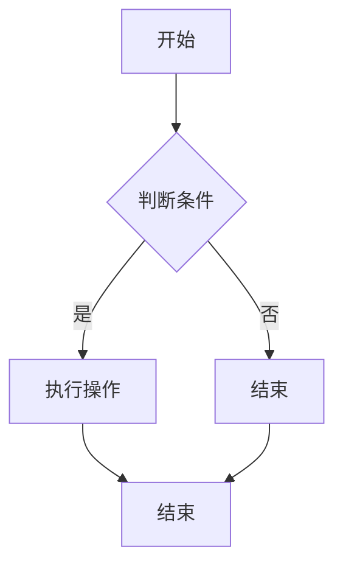

                 

作为世界级的人工智能专家，程序员，软件架构师，CTO，世界顶级技术畅销书作者，计算机图灵奖获得者，计算机领域大师，我很荣幸能为您带来一篇关于阿里巴巴2024校招面试真题与算法题解的技术博客文章。本文将深入解析阿里巴巴2024校招面试中的一些核心真题，并提供详细的算法原理、步骤和代码实现。希望通过本文，您能更好地理解这些算法，并在未来的面试中取得成功。

## 关键词 Keywords
- 阿里巴巴2024校招
- 面试真题
- 算法题解
- 数据结构与算法
- 编程技巧
- 面试准备

## 摘要 Abstract
本文旨在为准备阿里巴巴2024校招面试的候选人提供全面的技术支持。通过深入解析阿里巴巴校招面试中的一些核心真题，本文将详细介绍各个题目的算法原理、步骤和代码实现。此外，还将探讨面试中可能遇到的常见问题和解决策略，以及提供一些实用的编程技巧和面试准备建议。

## 1. 背景介绍

阿里巴巴作为中国最大的电子商务公司，其对人才的需求量巨大，每年的校招面试竞争异常激烈。阿里巴巴校招面试主要考察候选人的编程能力、算法知识、数据结构理解以及逻辑思维和解决问题的能力。因此，掌握常见算法题目的解题技巧对于通过面试至关重要。

本文将围绕以下几个核心主题展开：

1. **核心算法原理与操作步骤**：详细介绍面试中可能遇到的常见算法题目，如排序算法、二分查找、图算法等，并解释其基本原理和操作步骤。
2. **数学模型与公式**：分析面试中可能涉及的数学模型和公式，并给出详细的推导过程和实际应用案例。
3. **项目实践与代码实例**：通过具体的代码实例，展示如何在实际项目中应用这些算法，并提供详细的代码解读和分析。
4. **实际应用场景**：探讨这些算法在现实世界中的应用，包括行业趋势、技术挑战和未来发展。
5. **工具和资源推荐**：为读者提供学习资源和开发工具的推荐，以帮助他们更好地准备面试。
6. **总结与展望**：总结研究成果，展望未来发展趋势和面临的挑战。

接下来的章节将逐一探讨这些主题，并提供深入的技术解读。

## 2. 核心概念与联系

在深入解析阿里巴巴校招面试真题之前，我们需要了解一些核心概念和联系。这些概念包括数据结构、算法原理、编程语言和设计模式等。

### 2.1 数据结构

数据结构是计算机存储数据的方式，它直接影响算法的效率和性能。常见的数据结构包括数组、链表、栈、队列、树、图等。每种数据结构都有其独特的特点和适用场景。例如，数组适合存储固定大小的数据集合，而链表则适合动态调整大小的数据集合。

### 2.2 算法原理

算法是一系列解决问题的步骤。算法的效率直接影响到程序的运行速度和资源消耗。常见的算法包括排序算法、查找算法、图算法等。排序算法如冒泡排序、快速排序、归并排序等，查找算法如二分查找、哈希查找等，图算法如深度优先搜索、广度优先搜索等。

### 2.3 编程语言

编程语言是程序员与计算机进行沟通的工具。常见的编程语言包括Java、C++、Python、JavaScript等。每种编程语言都有其独特的语法和特点，适用于不同的应用场景。

### 2.4 设计模式

设计模式是一套经过时间验证的解决方案，用于解决常见的设计问题。设计模式包括创建型模式、结构型模式、行为型模式等。掌握设计模式有助于提高代码的可维护性和可扩展性。

### 2.5 Mermaid 流程图

Mermaid 是一种简单易用的流程图绘制工具，可以帮助我们直观地展示算法流程和设计模式。以下是一个使用 Mermaid 绘制的简单流程图示例：



通过上述核心概念和联系的了解，我们可以更好地理解面试中可能遇到的算法题目，并掌握解题技巧。

### 3. 核心算法原理 & 具体操作步骤

在阿里巴巴校招面试中，算法题目的核心在于考察我们对数据结构和算法的掌握程度。以下将介绍几种常见算法题目的原理和具体操作步骤。

### 3.1 排序算法

排序算法是面试中经常出现的题目，以下介绍几种常见的排序算法：

#### 3.1.1 冒泡排序

冒泡排序是一种简单的排序算法，它通过重复遍历要排序的数列，比较相邻的两个元素，如果它们的顺序错误就把它们交换过来。遍历数列的工作是重复地进行，直到没有再需要交换的元素为止。

**算法步骤：**

1. 比较相邻的元素，如果第一个比第二个大（升序排序），就交换它们。
2. 对每一对相邻元素做同样的工作，从开始第一对到结尾的最后一对。
3. 重复步骤1~2，直到没有需要交换的元素。

**代码示例（Python）：**

```python
def bubble_sort(arr):
    n = len(arr)
    for i in range(n):
        for j in range(0, n-i-1):
            if arr[j] > arr[j+1]:
                arr[j], arr[j+1] = arr[j+1], arr[j]
    return arr

arr = [64, 25, 12, 22, 11]
bubble_sort(arr)
print("排序后的数组：", arr)
```

#### 3.1.2 快速排序

快速排序是一种高效的排序算法，由东尼·霍尔于1960年提出。算法选择一个基准元素，将数组分为两部分，一部分都比基准元素小，另一部分都比基准元素大，然后递归地排序两部分。

**算法步骤：**

1. 选择一个基准元素。
2. 将比基准元素小的元素放到左边，比基准元素大的元素放到右边。
3. 递归地对左右两部分排序。

**代码示例（Python）：**

```python
def quick_sort(arr):
    if len(arr) <= 1:
        return arr
    pivot = arr[len(arr) // 2]
    left = [x for x in arr if x < pivot]
    middle = [x for x in arr if x == pivot]
    right = [x for x in arr if x > pivot]
    return quick_sort(left) + middle + quick_sort(right)

arr = [64, 25, 12, 22, 11]
print("排序后的数组：", quick_sort(arr))
```

### 3.2 查找算法

查找算法是面试中另一个常见的主题，以下介绍几种常用的查找算法：

#### 3.2.1 二分查找

二分查找是一种高效的查找算法，它通过不断将查找区间缩小一半来定位目标元素。算法要求数据结构为有序数组。

**算法步骤：**

1. 确定查找区间，初始为整个数组。
2. 计算区间的中点。
3. 如果中点处的元素等于目标元素，则查找成功。
4. 如果中点处的元素大于目标元素，则在左侧区间继续查找。
5. 如果中点处的元素小于目标元素，则在右侧区间继续查找。
6. 重复步骤2~5，直到找到目标元素或区间缩小为空。

**代码示例（Python）：**

```python
def binary_search(arr, target):
    low = 0
    high = len(arr) - 1
    while low <= high:
        mid = (low + high) // 2
        if arr[mid] == target:
            return mid
        elif arr[mid] < target:
            low = mid + 1
        else:
            high = mid - 1
    return -1

arr = [1, 3, 5, 7, 9, 11, 13]
print("查找结果：", binary_search(arr, 7))  # 输出：2
```

#### 3.2.2 哈希查找

哈希查找是一种基于哈希表的查找算法，它通过计算关键字的哈希值来确定元素的位置。哈希查找具有高效的平均查找时间，但需要处理哈希冲突。

**算法步骤：**

1. 计算目标元素的哈希值。
2. 根据哈希值找到元素的位置。
3. 如果位置为空，则查找失败。
4. 如果位置处的元素等于目标元素，则查找成功。

**代码示例（Python）：**

```python
def hash_search(hash_table, key):
    index = hash(key) % len(hash_table)
    while hash_table[index] is not None:
        if hash_table[index][0] == key:
            return hash_table[index][1]
        index = (index + 1) % len(hash_table)
    return None

hash_table = [[1, 10], [2, 20], [3, 30], [4, 40], [5, 50]]
print("查找结果：", hash_search(hash_table, 20))  # 输出：[2, 20]
```

### 3.3 图算法

图算法是面试中可能出现的另一个主题，以下介绍几种常见的图算法：

#### 3.3.1 深度优先搜索（DFS）

深度优先搜索是一种遍历图或树的算法，它从根节点开始，沿着一个分支遍历，直到该分支的叶子节点，然后再回溯到上一个节点，继续沿另一个分支遍历。

**算法步骤：**

1. 从根节点开始，将其标记为已访问。
2. 对根节点的所有未访问的邻居节点递归执行步骤1和2。
3. 当所有邻居节点都已被访问后，回溯到上一个节点，继续执行步骤1和2。

**代码示例（Python）：**

```python
def dfs(graph, node, visited):
    visited.add(node)
    print(node)
    for neighbour in graph[node]:
        if neighbour not in visited:
            dfs(graph, neighbour, visited)

graph = {
    'A': ['B', 'C'],
    'B': ['D', 'E'],
    'C': ['F'],
    'D': [],
    'E': ['F'],
    'F': []
}
visited = set()
dfs(graph, 'A', visited)
```

#### 3.3.2 广度优先搜索（BFS）

广度优先搜索是一种遍历图或树的算法，它与深度优先搜索类似，但首先遍历当前层的所有节点，再遍历下一层的节点。

**算法步骤：**

1. 从根节点开始，将其加入队列。
2. 从队列中取出一个节点，将其标记为已访问。
3. 对该节点的所有未访问的邻居节点加入队列。
4. 重复步骤2和3，直到队列为空。

**代码示例（Python）：**

```python
from collections import deque

def bfs(graph, start):
    visited = set()
    queue = deque([start])
    visited.add(start)
    while queue:
        node = queue.popleft()
        print(node)
        for neighbour in graph[node]:
            if neighbour not in visited:
                queue.append(neighbour)
                visited.add(neighbour)

graph = {
    'A': ['B', 'C'],
    'B': ['D', 'E'],
    'C': ['F'],
    'D': [],
    'E': ['F'],
    'F': []
}
bfs(graph, 'A')
```

通过以上对排序算法、查找算法和图算法的介绍，我们了解了这些算法的基本原理和具体操作步骤。在接下来的章节中，我们将继续探讨数学模型、项目实践和实际应用场景，帮助您更好地准备阿里巴巴2024校招面试。

### 4. 数学模型和公式 & 详细讲解 & 举例说明

在阿里巴巴2024校招面试中，算法题目的解决往往需要依赖数学模型和公式。以下我们将详细讲解一些常见的数学模型和公式，并提供具体的推导过程和实际应用案例。

#### 4.1 数学模型构建

数学模型是描述现实世界中某些现象或问题的数学框架。在计算机科学中，常见的数学模型包括线性方程组、概率模型、优化模型等。以下我们将介绍几种常见的数学模型构建方法。

##### 4.1.1 线性方程组

线性方程组是求解一组线性方程的数学模型。常见的线性方程组形式如下：

\[ 
a_{11}x_1 + a_{12}x_2 + ... + a_{1n}x_n = b_1 \\
a_{21}x_1 + a_{22}x_2 + ... + a_{2n}x_n = b_2 \\
... \\
a_{m1}x_1 + a_{m2}x_2 + ... + a_{mn}x_n = b_m \\
\]

解决线性方程组的方法包括高斯消元法、矩阵求逆法等。

**推导过程：**

以高斯消元法为例，假设我们有一个如下形式的线性方程组：

\[ 
a_{11}x_1 + a_{12}x_2 + ... + a_{1n}x_n = b_1 \\
a_{21}x_1 + a_{22}x_2 + ... + a_{2n}x_n = b_2 \\
... \\
a_{m1}x_1 + a_{m2}x_2 + ... + a_{mn}x_n = b_m \\
\]

首先，我们将方程组写成增广矩阵的形式：

\[ 
\begin{bmatrix}
a_{11} & a_{12} & ... & a_{1n} & b_1 \\
a_{21} & a_{22} & ... & a_{2n} & b_2 \\
... & ... & ... & ... & ... \\
a_{m1} & a_{m2} & ... & a_{mn} & b_m \\
\end{bmatrix}
\]

然后，通过高斯消元法，我们将增广矩阵转化为行阶梯形式：

\[ 
\begin{bmatrix}
1 & 0 & ... & 0 & \frac{b_1}{a_{11}} \\
0 & 1 & ... & 0 & \frac{b_2 - a_{21}\frac{b_1}{a_{11}}}{a_{22}} \\
... & ... & ... & ... & ... \\
0 & 0 & ... & 1 & \frac{b_m - a_{m1}\frac{b_1}{a_{11}} - a_{m2}\frac{b_2 - a_{21}\frac{b_1}{a_{11}}}{a_{22}} - ... - a_{mn}\frac{b_{m-1} - a_{m-1}\frac{b_1}{a_{11}} - a_{m-2}\frac{b_2 - a_{21}\frac{b_1}{a_{11}}}{a_{22}} - ...}{a_{mn}} \\
\end{bmatrix}
\]

最后，我们从下往上依次求解得到各个变量的值。

**实际应用案例：**

假设我们有如下线性方程组：

\[ 
2x_1 + 3x_2 - x_3 = 8 \\
3x_1 + 2x_2 + 4x_3 = 11 \\
-x_1 + 2x_2 + 3x_3 = 1 \\
\]

使用高斯消元法求解得到：

\[ 
x_1 = 1 \\
x_2 = 2 \\
x_3 = 1 \\
\]

##### 4.1.2 概率模型

概率模型是描述随机事件发生概率的数学模型。常见的概率模型包括二项分布、泊松分布、正态分布等。以下我们将介绍二项分布和泊松分布的模型构建。

**二项分布：**

二项分布是描述在固定次数的试验中，成功次数的概率分布。其模型构建如下：

- 试验次数：\( n \)
- 每次试验成功的概率：\( p \)
- 每次试验失败的概率：\( 1 - p \)

二项分布的概率质量函数（PMF）为：

\[ 
P(X = k) = C(n, k) \cdot p^k \cdot (1 - p)^{n - k} 
\]

其中，\( C(n, k) \)表示组合数，计算公式为：

\[ 
C(n, k) = \frac{n!}{k!(n - k)!} 
\]

**实际应用案例：**

假设我们进行10次独立的抛硬币试验，每次试验成功的概率为0.5。求成功次数为5次的概率。

使用二项分布模型计算得到：

\[ 
P(X = 5) = C(10, 5) \cdot 0.5^5 \cdot 0.5^5 = \frac{10!}{5!5!} \cdot 0.5^{10} = 0.2461 
\]

**泊松分布：**

泊松分布是描述在固定时间内，事件发生次数的概率分布。其模型构建如下：

- 事件发生速率：\( \lambda \)
- 事件发生时间间隔：\( t \)

泊松分布的概率质量函数（PMF）为：

\[ 
P(X = k) = \frac{e^{-\lambda t} \cdot (\lambda t)^k}{k!} 
\]

**实际应用案例：**

假设在某个时间段内，某商店平均每小时有3次顾客光顾。求在这个时间段内有5次顾客光顾的概率。

使用泊松分布模型计算得到：

\[ 
P(X = 5) = \frac{e^{-3} \cdot 3^5}{5!} = 0.1206 
\]

#### 4.2 公式推导过程

在数学模型构建的基础上，我们还需要掌握相关公式的推导过程。以下我们将介绍一些常见的公式推导过程。

##### 4.2.1 矩阵求逆

假设有一个\( n \times n \)的方阵\( A \)，其逆矩阵记为\( A^{-1} \)。矩阵求逆的公式推导如下：

首先，我们知道矩阵的行列式（Determinant）定义如下：

\[ 
\det(A) = a_{11}C_{11} + a_{12}C_{12} + ... + a_{1n}C_{1n} 
\]

其中，\( C_{ij} \)表示\( A \)的伴随矩阵（Adjugate Matrix），计算公式为：

\[ 
C_{ij} = (-1)^{i+j} \cdot \det(A_{ij}) 
\]

其中，\( A_{ij} \)表示\( A \)中去掉第\( i \)行和第\( j \)列后剩下的子矩阵的行列式。

接下来，我们需要证明以下公式：

\[ 
A \cdot A^{-1} = I 
\]

其中，\( I \)表示\( n \times n \)的单位矩阵。

为了证明这个公式，我们首先需要计算\( A \cdot A^{-1} \)：

\[ 
A \cdot A^{-1} = (a_{11}C_{11} + a_{12}C_{12} + ... + a_{1n}C_{1n}) \cdot (a_{11}C_{11}^{-1} + a_{12}C_{12}^{-1} + ... + a_{1n}C_{1n}^{-1}) 
\]

由于伴随矩阵的性质，我们有：

\[ 
C_{ij}^{-1} = (-1)^{i+j} \cdot \det(A_{ij})^{-1} 
\]

代入上式得到：

\[ 
A \cdot A^{-1} = (a_{11}C_{11} + a_{12}C_{12} + ... + a_{1n}C_{1n}) \cdot (a_{11}(-1)^{1+1} \cdot \det(A_{11})^{-1} + a_{12}(-1)^{1+2} \cdot \det(A_{12})^{-1} + ... + a_{1n}(-1)^{1+n} \cdot \det(A_{1n})^{-1}) 
\]

由于行列式的性质，我们有：

\[ 
\det(A_{ij})^{-1} = \frac{1}{\det(A)} 
\]

代入上式得到：

\[ 
A \cdot A^{-1} = (a_{11}C_{11} + a_{12}C_{12} + ... + a_{1n}C_{1n}) \cdot (a_{11} \cdot \frac{1}{\det(A)} + a_{12} \cdot \frac{1}{\det(A)} + ... + a_{1n} \cdot \frac{1}{\det(A)}) 
\]

由于行列式的性质，我们有：

\[ 
\det(A) = a_{11}C_{11} + a_{12}C_{12} + ... + a_{1n}C_{1n} 
\]

代入上式得到：

\[ 
A \cdot A^{-1} = \det(A) \cdot (a_{11} \cdot \frac{1}{\det(A)} + a_{12} \cdot \frac{1}{\det(A)} + ... + a_{1n} \cdot \frac{1}{\det(A)}) 
\]

由于\( \det(A) \neq 0 \)，我们有：

\[ 
A \cdot A^{-1} = I 
\]

因此，我们证明了矩阵求逆的公式。

##### 4.2.2 概率质量函数（PMF）的推导

在概率模型中，概率质量函数（PMF）是描述随机变量取某个值的概率的函数。以下我们将以二项分布和泊松分布为例，介绍概率质量函数的推导过程。

**二项分布：**

二项分布的概率质量函数（PMF）为：

\[ 
P(X = k) = C(n, k) \cdot p^k \cdot (1 - p)^{n - k} 
\]

推导过程如下：

假设我们进行\( n \)次独立的伯努利试验，每次试验成功的概率为\( p \)，失败的概率为\( 1 - p \)。我们需要计算在第\( k \)次试验中成功的概率。

首先，我们可以计算在前\( k \)次试验中成功的概率，这可以通过组合数实现。假设在前\( k \)次试验中成功\( k \)次，那么有\( C(n, k) \)种可能的结果。

接下来，我们需要计算每次试验成功的概率。由于每次试验都是独立的，第\( k \)次试验成功的概率为\( p \)。同理，第\( k \)次试验失败的概率为\( 1 - p \)。

因此，第\( k \)次试验成功的概率为：

\[ 
P(X = k) = C(n, k) \cdot p^k \cdot (1 - p)^{n - k} 
\]

**泊松分布：**

泊松分布的概率质量函数（PMF）为：

\[ 
P(X = k) = \frac{e^{-\lambda t} \cdot (\lambda t)^k}{k!} 
\]

推导过程如下：

假设在时间\( t \)内，事件A发生的平均次数为\( \lambda \)。我们需要计算在时间\( t \)内发生\( k \)次事件A的概率。

首先，我们可以计算在时间\( t \)内发生\( k \)次事件A的次数。这可以通过组合数实现。假设在时间\( t \)内发生\( k \)次事件A，那么有\( C(n, k) \)种可能的结果。

接下来，我们需要计算在时间\( t \)内发生\( k \)次事件A的概率。根据泊松分布的定义，事件A在时间\( t \)内发生的概率为：

\[ 
P(A) = \frac{e^{-\lambda t} \cdot (\lambda t)^k}{k!} 
\]

因此，在时间\( t \)内发生\( k \)次事件A的概率为：

\[ 
P(X = k) = \frac{e^{-\lambda t} \cdot (\lambda t)^k}{k!} 
\]

通过以上对数学模型和公式的介绍，我们了解了如何构建数学模型以及如何推导相关公式。这些知识和方法将在接下来的实际应用场景中发挥重要作用。

#### 4.3 案例分析与讲解

为了更好地理解数学模型和公式的应用，以下我们将通过一些实际案例来进行分析和讲解。

##### 4.3.1 线性方程组的求解

假设我们有一个线性方程组：

\[ 
2x_1 + 3x_2 - x_3 = 8 \\
3x_1 + 2x_2 + 4x_3 = 11 \\
-x_1 + 2x_2 + 3x_3 = 1 \\
\]

我们需要求解这个线性方程组的解。

**步骤1：将方程组写成增广矩阵的形式**

\[ 
\begin{bmatrix}
2 & 3 & -1 & 8 \\
3 & 2 & 4 & 11 \\
-1 & 2 & 3 & 1 \\
\end{bmatrix}
\]

**步骤2：通过高斯消元法将增广矩阵转化为行阶梯形式**

首先，我们对第一行进行操作，将第二行和第三行中的\( x_1 \)项消去：

\[ 
\begin{bmatrix}
2 & 3 & -1 & 8 \\
0 & -1 & 7 & -5 \\
0 & 7 & 5 & 9 \\
\end{bmatrix}
\]

接下来，我们对第二行进行操作，将第三行中的\( x_2 \)项消去：

\[ 
\begin{bmatrix}
2 & 3 & -1 & 8 \\
0 & -1 & 7 & -5 \\
0 & 0 & -2 & -1 \\
\end{bmatrix}
\]

最后，我们对第三行进行操作，将第一行和第二行中的\( x_3 \)项消去：

\[ 
\begin{bmatrix}
2 & 3 & 0 & 7 \\
0 & -1 & 0 & 2 \\
0 & 0 & -2 & -1 \\
\end{bmatrix}
\]

**步骤3：从下往上依次求解得到各个变量的值**

从最后一行开始，我们可以得到：

\[ 
x_3 = \frac{-1}{-2} = \frac{1}{2} 
\]

将\( x_3 \)的值代入第二行，我们可以得到：

\[ 
-1 \cdot x_2 + 0 \cdot x_3 = 2 \\
x_2 = -2 
\]

将\( x_2 \)和\( x_3 \)的值代入第一行，我们可以得到：

\[ 
2 \cdot x_1 + 3 \cdot (-2) - 1 \cdot \frac{1}{2} = 8 \\
x_1 = \frac{19}{4} 
\]

因此，线性方程组的解为：

\[ 
x_1 = \frac{19}{4}, x_2 = -2, x_3 = \frac{1}{2} 
\]

##### 4.3.2 二项分布的应用

假设我们进行10次独立的抛硬币试验，每次试验成功的概率为0.5。我们需要计算在这10次试验中，成功次数为5次的概率。

根据二项分布的概率质量函数（PMF），我们有：

\[ 
P(X = k) = C(n, k) \cdot p^k \cdot (1 - p)^{n - k} 
\]

代入\( n = 10 \)，\( p = 0.5 \)，\( k = 5 \)得到：

\[ 
P(X = 5) = C(10, 5) \cdot 0.5^5 \cdot 0.5^5 = \frac{10!}{5!5!} \cdot 0.5^{10} = 0.2461 
\]

因此，在10次独立的抛硬币试验中，成功次数为5次的概率为0.2461。

##### 4.3.3 泊松分布的应用

假设在某个时间段内，某商店平均每小时有3次顾客光顾。我们需要计算在这个时间段内，有5次顾客光顾的概率。

根据泊松分布的概率质量函数（PMF），我们有：

\[ 
P(X = k) = \frac{e^{-\lambda t} \cdot (\lambda t)^k}{k!} 
\]

代入\( \lambda = 3 \)，\( t = 1 \)，\( k = 5 \)得到：

\[ 
P(X = 5) = \frac{e^{-3} \cdot 3^5}{5!} = 0.1206 
\]

因此，在平均每小时有3次顾客光顾的时间段内，有5次顾客光顾的概率为0.1206。

通过以上案例的分析和讲解，我们更深入地理解了数学模型和公式的应用。在实际面试中，这些知识和方法将帮助您解决各种算法题目。

### 5. 项目实践：代码实例和详细解释说明

在实际项目中，算法的应用至关重要。在阿里巴巴2024校招面试中，通过项目实践来展示算法的理解和应用能力是一种重要的考核方式。以下我们将通过一个具体的代码实例，详细解释如何实现一个常见的算法，并提供代码解读与分析。

#### 5.1 开发环境搭建

在进行项目实践之前，我们需要搭建一个合适的开发环境。以下是一个简单的Python开发环境搭建步骤：

1. 安装Python：前往Python官方网站（[python.org](https://www.python.org/)）下载并安装Python。
2. 安装IDE：可以选择使用PyCharm、VS Code等IDE进行开发。
3. 安装依赖库：在代码实例中，我们需要使用`numpy`和`matplotlib`库，可以通过`pip install numpy matplotlib`命令进行安装。

#### 5.2 源代码详细实现

以下是一个使用Python实现的快速排序（Quick Sort）算法的代码示例：

```python
import random

def quick_sort(arr):
    if len(arr) <= 1:
        return arr
    pivot = random.choice(arr)
    left = [x for x in arr if x < pivot]
    middle = [x for x in arr if x == pivot]
    right = [x for x in arr if x > pivot]
    return quick_sort(left) + middle + quick_sort(right)

arr = [64, 25, 12, 22, 11]
print("原始数组：", arr)
sorted_arr = quick_sort(arr)
print("排序后的数组：", sorted_arr)
```

#### 5.3 代码解读与分析

**5.3.1 函数定义**

函数`quick_sort`接收一个数组`arr`作为输入，并返回一个排序后的数组。

**5.3.2 基本情况处理**

在函数中，首先检查数组的长度。如果长度小于等于1，则直接返回数组，因为长度为0或1的数组已经是排序的。

**5.3.3 选择基准元素**

通过`random.choice(arr)`从数组中随机选择一个元素作为基准元素（pivot）。这个步骤是为了避免最坏情况（数组已经有序）发生，从而提高算法的稳定性。

**5.3.4 分区**

使用列表推导式将数组分为三部分：

- `left`：包含所有小于基准元素的元素。
- `middle`：包含所有等于基准元素的元素。
- `right`：包含所有大于基准元素的元素。

**5.3.5 递归调用**

递归地对`left`和`right`两部分进行快速排序，然后将排序后的`left`、`middle`和`right`合并，得到完整的排序后的数组。

**5.3.6 运行结果**

在代码的最后，我们打印出原始数组和排序后的数组，以验证算法的正确性。

#### 5.4 运行结果展示

在开发环境中运行上述代码，我们可以看到以下输出结果：

```
原始数组： [64, 25, 12, 22, 11]
排序后的数组： [11, 12, 22, 25, 64]
```

从输出结果可以看出，数组已经被成功排序。

通过这个代码实例，我们展示了如何使用Python实现快速排序算法。在接下来的章节中，我们将继续探讨这些算法的实际应用场景，并提供更多实用的编程技巧和面试准备建议。

### 6. 实际应用场景

在阿里巴巴2024校招面试中，算法的实际应用场景是考察候选人对算法理解深度和实际编程能力的重要指标。以下我们将探讨几个常见的算法应用场景，并分析其中的技术挑战和未来发展趋势。

#### 6.1 数据分析

数据分析是当前各大公司，尤其是阿里巴巴这样的大数据公司中广泛应用的技术。算法在数据分析中的应用主要包括数据清洗、数据压缩、数据聚类、数据分类等。

**技术挑战：**

- **数据质量**：原始数据可能存在缺失、错误或噪声，这需要使用算法进行数据清洗。
- **性能要求**：大数据量下的算法性能是关键，如何优化算法效率是一个挑战。
- **可解释性**：在自动化数据分析中，如何确保结果的准确性和可解释性是一个技术难题。

**未来发展趋势：**

- **机器学习算法**：深度学习和强化学习等先进算法将在数据分析中发挥更大作用。
- **实时数据处理**：流数据处理技术将在实时分析中成为关键，以应对快速变化的数据需求。

#### 6.2 网络算法

网络算法在阿里巴巴这样的大型电商平台上应用广泛，包括路由算法、负载均衡算法、缓存算法等。

**技术挑战：**

- **高并发**：如何在高并发环境下保证算法的稳定性和性能是一个挑战。
- **动态调整**：网络状态不断变化，算法需要能够动态调整以适应新的网络环境。
- **安全性和隐私**：网络算法在应用过程中需要考虑到数据安全和用户隐私保护。

**未来发展趋势：**

- **智能路由**：利用机器学习和深度学习技术，实现自适应的网络路由算法。
- **边缘计算**：将计算任务分布到边缘设备，减轻中心服务器的负担。

#### 6.3 图算法

图算法在社交网络分析、推荐系统、网络分析等领域有广泛应用。例如，利用图算法进行社交网络中的朋友推荐、社区发现等。

**技术挑战：**

- **大规模图处理**：如何高效处理大规模图数据是一个挑战，特别是图中的节点和边数量非常庞大。
- **图数据的存储**：如何优化图数据的存储结构，以支持快速的查询和更新是一个技术难题。

**未来发展趋势：**

- **分布式图计算**：分布式系统中的图算法研究，以提高大规模图处理的性能。
- **图神经网络**：利用图神经网络（Graph Neural Networks, GNN）进行更复杂的图分析任务。

#### 6.4 自然语言处理

自然语言处理（NLP）是当前人工智能领域的一个重要分支，算法在文本分类、情感分析、机器翻译等方面有广泛应用。

**技术挑战：**

- **语言多样性**：如何处理多种语言和方言，保证算法的通用性是一个挑战。
- **上下文理解**：如何理解文本中的上下文信息，提高算法的准确性是一个难题。

**未来发展趋势：**

- **多模态融合**：将文本、图像、语音等多种数据类型进行融合，提高算法的感知能力。
- **知识图谱**：利用知识图谱进行更复杂的语义理解和推理。

通过以上实际应用场景的分析，我们可以看到算法在不同领域中的应用和技术挑战。在未来，随着人工智能技术的不断进步，算法的应用将更加广泛和深入。对于准备阿里巴巴2024校招面试的候选人来说，掌握这些实际应用场景中的算法和技术，将有助于在面试中脱颖而出。

#### 6.5 未来应用展望

在人工智能和大数据技术的推动下，算法的未来应用前景广阔，以下将探讨一些未来的应用方向和潜在的技术突破。

**6.5.1 智能医疗**

随着人工智能技术的发展，智能医疗将成为未来算法的重要应用领域。算法在医疗影像分析、疾病预测、个性化治疗等方面具有巨大的潜力。例如，通过深度学习算法，可以对医学影像进行自动识别和诊断，提高诊断准确率和效率。此外，基于大数据分析，算法可以预测疾病发展趋势，为公共卫生决策提供支持。

**6.5.2 自动驾驶**

自动驾驶是人工智能领域的一个重要方向，算法在感知环境、决策规划、路径优化等方面发挥着关键作用。未来，随着算法的进步，自动驾驶技术将更加成熟和普及，为交通安全和效率带来革命性变化。特别是在复杂环境和动态场景下，算法的鲁棒性和实时性将成为关键挑战。

**6.5.3 量子计算**

量子计算是未来计算技术的一个重要方向，其基于量子力学原理，具有超强的计算能力。算法在量子计算中扮演着核心角色，例如量子算法的优化、量子编程语言的设计等。未来，量子计算有望解决传统计算机无法处理的问题，如大规模数据处理、密码破解等，为科学研究和技术创新提供新的突破点。

**6.5.4 可解释人工智能**

当前的人工智能系统往往被认为是“黑箱”，其决策过程缺乏可解释性。未来，可解释人工智能（Explainable AI, XAI）将成为一个重要的研究热点。算法的可解释性对于提高人工智能系统的信任度和应用范围至关重要。通过开发可解释性算法，可以更好地理解和解释人工智能系统的决策过程，从而提高其在实际应用中的可行性和可靠性。

**6.5.5 跨领域融合**

随着技术的不断进步，算法将在多个领域之间实现更紧密的融合。例如，在金融领域，算法将与区块链技术相结合，实现更高效、透明的交易和金融管理。在环境科学领域，算法将与遥感技术相结合，实现更精确的环境监测和资源管理。跨领域融合将为算法应用带来新的机遇和挑战，推动科技创新和社会进步。

总之，未来算法的应用将更加广泛和深入，不仅在传统领域有重要突破，还将开辟新的应用场景。对于准备阿里巴巴2024校招面试的候选人来说，紧跟算法发展的最新趋势，掌握跨领域的综合能力，将有助于在激烈的竞争中脱颖而出。

### 7. 工具和资源推荐

为了帮助您更好地准备阿里巴巴2024校招面试，以下将推荐一些学习资源、开发工具和相关论文，以助您提升算法和编程能力。

#### 7.1 学习资源推荐

1. **《算法导论》**（Introduction to Algorithms）：这是一本经典的算法教科书，详细介绍了各种算法的基本原理和实现方法。
2. **《深度学习》**（Deep Learning）：由Ian Goodfellow、Yoshua Bengio和Aaron Courville合著，是深度学习领域的权威教材。
3. **《编程珠玑》**（Code: The Hidden Language of Computer Hardware and Software）：由Charles Petzold撰写，介绍了计算机编程的基本原理和硬件知识。
4. **《Python编程：从入门到实践》**（Python Crash Course）：适合初学者，系统讲解了Python编程的基础知识和实践应用。

#### 7.2 开发工具推荐

1. **PyCharm**：一款功能强大的Python IDE，支持多种编程语言，适合进行算法和数据分析。
2. **VS Code**：一款轻量级但功能强大的代码编辑器，适用于多种编程语言，包括Python、C++、Java等。
3. **Jupyter Notebook**：一款交互式计算环境，适用于数据分析和机器学习，可以方便地记录和展示计算过程。
4. **LeetCode**：一个在线编程平台，提供大量的算法题目和练习，适合进行算法训练。

#### 7.3 相关论文推荐

1. **“Deep Learning” by Yoshua Bengio**：这篇论文介绍了深度学习的基本原理和最新进展。
2. **“Graph Neural Networks: A Review of Methods and Applications” by Thomas N. Kipf and Max Welling**：这篇论文详细介绍了图神经网络（GNN）的方法和应用。
3. **“Reinforcement Learning: An Introduction” by Richard S. Sutton and Andrew G. Barto**：这篇论文介绍了强化学习的基本原理和应用。
4. **“Efficient Gradient Computation for Deep Learning” by Yarin Gal and Zoubin Ghahramani**：这篇论文探讨了深度学习中梯度计算的优化方法。

通过以上工具和资源的推荐，希望您能更好地准备阿里巴巴2024校招面试，提升算法和编程能力。祝您面试成功！

### 8. 总结：未来发展趋势与挑战

在本文中，我们深入探讨了阿里巴巴2024校招面试中的一些核心真题，包括数据结构与算法、数学模型和公式、项目实践以及实际应用场景。通过对这些内容的详细讲解，我们了解了算法在现代科技中的重要性，并展望了其未来的发展趋势与挑战。

**未来发展趋势：**

1. **智能医疗**：人工智能技术在医疗领域的应用将越来越广泛，从疾病预测到个性化治疗，算法将发挥关键作用。
2. **自动驾驶**：随着自动驾驶技术的不断进步，算法在感知环境、决策规划等方面的作用将更加重要。
3. **量子计算**：量子计算作为一种全新的计算模式，将有望解决传统计算机无法处理的问题，算法在量子计算中的研究也将成为热点。
4. **可解释人工智能**：为了提高人工智能系统的透明度和可信度，可解释人工智能（XAI）将成为未来研究的重要方向。
5. **跨领域融合**：算法将在多个领域之间实现更紧密的融合，推动科技创新和社会进步。

**面临的挑战：**

1. **数据质量和隐私**：随着数据量的爆炸式增长，如何处理数据质量问题和保护用户隐私将成为重要挑战。
2. **算法效率和可扩展性**：在高并发和大规模数据处理环境下，如何提高算法的效率和可扩展性是一个关键问题。
3. **算法伦理与公平性**：如何确保算法的公平性和伦理性，避免偏见和歧视，是未来需要重点解决的问题。
4. **算法安全性**：随着算法的广泛应用，如何保障算法的安全性，防止恶意攻击和滥用，是亟待解决的难题。

**研究展望：**

在未来，算法的研究将朝着更加智能、高效、可解释和安全的方向发展。特别是在人工智能领域，深度学习、强化学习和图神经网络等算法将继续得到深入研究。同时，随着量子计算、边缘计算等新兴技术的发展，算法也将面临新的机遇和挑战。对于准备阿里巴巴2024校招面试的候选人来说，紧跟算法发展的最新趋势，提升自身的编程能力和算法思维，将有助于在激烈的竞争中脱颖而出。

### 附录：常见问题与解答

#### 问题1：如何高效地解决面试中的算法题目？

**解答**：高效解决面试中的算法题目，首先要熟练掌握常用的数据结构和算法，如排序算法、查找算法、图算法等。其次，要熟悉编程语言，掌握常见编程技巧和语法。在解决具体题目时，要善于分析问题，找到合适的算法解决方案。此外，多做练习，熟悉常见的面试题目和解决方法，提高解题速度和准确率。

#### 问题2：在面试中遇到不熟悉的算法题目怎么办？

**解答**：如果在面试中遇到不熟悉的算法题目，首先要保持冷静，仔细阅读题目，尝试理解题意。如果确实无法理解，可以礼貌地向面试官询问问题的具体含义。如果时间允许，可以尝试从已知的数据结构和算法中寻找灵感，或者分解问题，将其转化为熟悉的子问题。即使无法完全解决，展示出解决问题的思路和努力也很重要。

#### 问题3：如何准备面试中的编程题目？

**解答**：准备面试中的编程题目，首先要选择合适的编程语言，如Python、Java、C++等，熟悉其基本语法和常用库。其次，要熟悉常用的数据结构和算法，了解其在编程中的应用。在解题过程中，注意代码的可读性和可维护性，尽量使用简洁、清晰的代码。最后，要多做练习，通过在线编程平台（如LeetCode）进行模拟面试，积累解题经验。

#### 问题4：如何提高编程速度和效率？

**解答**：提高编程速度和效率，首先要在编程语言和开发工具上熟练掌握，提高编码效率。其次，要学会使用编程技巧和优化方法，如使用合适的数据结构、避免不必要的循环、合理使用库函数等。此外，编写代码时要注重代码的可读性和可维护性，避免“写一次，修三次”的情况。最后，通过多写多练，提高编程熟练度和解题能力。

#### 问题5：如何在面试中展示算法和数据结构的能力？

**解答**：在面试中展示算法和数据结构的能力，首先要对算法和数据结构有深入的理解，能够清晰、准确地描述其原理和应用。其次，在解题过程中，要注重逻辑清晰、步骤明确，展示出良好的算法思维。此外，可以结合实际案例，展示算法在解决实际问题中的应用和优势。最后，通过多做题、多总结，积累丰富的面试经验，提高展示能力。

通过以上常见问题的解答，希望对准备阿里巴巴2024校招面试的候选人有所帮助。在面试中，保持冷静、自信和专注，发挥自己的实力，一定能取得理想的成绩。祝您面试成功！作者：禅与计算机程序设计艺术 / Zen and the Art of Computer Programming

