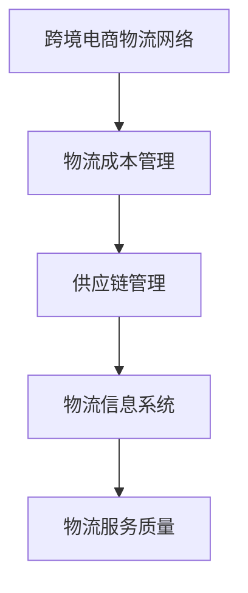

                 

关键词：阿里巴巴、跨境电商、物流优化、校招面试、重点

摘要：本文将围绕阿里巴巴2024年跨境电商物流优化校招面试的重点展开，从背景介绍、核心概念、算法原理、数学模型、项目实践、实际应用场景、工具和资源推荐、总结以及未来发展趋势与挑战等方面进行全面剖析，旨在为参加阿里巴巴跨境电商物流优化岗位的校招生提供宝贵的面试准备指导。

## 1. 背景介绍

近年来，随着全球电商市场的迅猛发展，跨境电商已成为推动国际贸易增长的重要引擎。阿里巴巴作为全球领先的电商企业，在跨境电商物流领域具有重要地位。2024年，阿里巴巴将继续优化跨境电商物流，提升用户体验，降低物流成本，提高运营效率。因此，阿里巴巴的跨境电商物流优化岗位吸引了众多求职者，尤其是校招生。

本文将重点分析阿里巴巴2024年跨境电商物流优化校招面试的核心内容和重点，帮助考生更好地应对面试挑战，顺利获得心仪的岗位。

## 2. 核心概念与联系

在跨境电商物流优化中，以下核心概念和联系是考生必须掌握的：

1. **跨境电商物流网络**：包括国际物流网络、国内物流网络以及跨境仓储和配送网络。
2. **物流成本管理**：涉及运输成本、仓储成本、配送成本等成本要素的管理。
3. **供应链管理**：包括采购、生产、仓储、配送等环节的协调与优化。
4. **物流信息系统**：物流信息系统的构建与维护，实现物流信息的实时追踪与管理。
5. **物流服务质量**：包括物流速度、准确性、安全性等方面的评估。

以下是一个Mermaid流程图，展示了这些核心概念之间的联系：



## 3. 核心算法原理 & 具体操作步骤

### 3.1 算法原理概述

在跨境电商物流优化中，常用的核心算法包括路径规划算法、车辆路径规划算法、库存管理算法等。

1. **路径规划算法**：主要用于求解从起点到终点之间的最优路径，常见的算法有Dijkstra算法、A*算法等。
2. **车辆路径规划算法**：主要用于解决多车配送路径规划问题，常见的算法有VRP（Vehicle Routing Problem）算法。
3. **库存管理算法**：主要用于优化库存水平，降低库存成本，常见的算法有ABC分类法、安全库存计算等。

### 3.2 算法步骤详解

#### 3.2.1 路径规划算法

以Dijkstra算法为例，其基本步骤如下：

1. 初始化：设置一个距离数组，用于记录起点到各个节点的最短距离，初始时将起点距离设置为0，其他节点距离设置为无穷大。
2. 选择未访问节点中距离最小的节点作为当前节点。
3. 对于当前节点的所有邻接节点，计算从起点到邻接节点的距离，并与距离数组中的距离值进行比较，更新距离数组。
4. 重复步骤2和3，直到所有节点都被访问。

#### 3.2.2 车辆路径规划算法

以VRP算法为例，其基本步骤如下：

1. 初始化：设置一个车辆容量上限和各配送节点的需求量。
2. 选择起始配送节点，将其加入当前路径。
3. 从当前路径的最后一个配送节点开始，寻找下一个最近的未访问配送节点，并将其加入当前路径。
4. 如果当前路径的总长度超过车辆容量上限，则从当前路径中移除最后一个配送节点，返回步骤3。
5. 重复步骤3和4，直到所有配送节点都被访问。

#### 3.2.3 库存管理算法

以ABC分类法为例，其基本步骤如下：

1. 计算各物品的年采购金额，并将物品按照年采购金额从高到低排序。
2. 根据年采购金额的比例，将物品分为A、B、C三类：
   - A类：年采购金额占比在70%以上，数量较少。
   - B类：年采购金额占比在15%-25%，数量适中。
   - C类：年采购金额占比在0%-15%，数量较多。
3. 对于A类物品，采取严格的库存管理策略，确保库存水平充足。
4. 对于B类物品，采取适度的库存管理策略，根据市场需求进行库存调整。
5. 对于C类物品，采取宽松的库存管理策略，降低库存成本。

### 3.3 算法优缺点

#### 路径规划算法

优点：计算简单，适用于节点数量较少的情况。

缺点：计算复杂度较高，不适用于节点数量较多的场景。

#### 车辆路径规划算法

优点：能够有效地解决多车配送问题，降低物流成本。

缺点：计算复杂度较高，不适用于大规模配送场景。

#### 库存管理算法

优点：能够根据物品的重要程度进行库存管理，降低库存成本。

缺点：不能完全避免库存短缺和库存过剩问题。

### 3.4 算法应用领域

路径规划算法主要应用于物流运输领域，车辆路径规划算法主要应用于物流配送领域，库存管理算法主要应用于仓储管理领域。

## 4. 数学模型和公式 & 详细讲解 & 举例说明

### 4.1 数学模型构建

在跨境电商物流优化中，常见的数学模型包括路径规划模型、库存管理模型、车辆路径规划模型等。

#### 4.1.1 路径规划模型

设G = (V, E)为无向图，V为节点集，E为边集。定义从节点i到节点j的权重为w(i, j)。路径规划模型的目标是最小化总权重，求解从起点s到终点t的最短路径。

#### 4.1.2 库存管理模型

设X为物品集，T为时间集，D为需求集。定义物品i在时间t的需求量为d(i, t)。库存管理模型的目标是最小化总库存成本，即：

$$
\min \sum_{i \in X} \sum_{t \in T} (c_i + \lambda_i) \cdot d(i, t)
$$

其中，c_i为物品i的年采购成本，λ_i为物品i的年库存成本。

#### 4.1.3 车辆路径规划模型

设V为配送节点集，C为车辆容量。定义从节点i到节点j的配送成本为c(i, j)。车辆路径规划模型的目标是最小化总配送成本，即：

$$
\min \sum_{i, j \in V} c(i, j) \cdot x(i, j)
$$

其中，x(i, j)为从节点i到节点j的配送路径。

### 4.2 公式推导过程

#### 4.2.1 路径规划模型

以Dijkstra算法为例，推导最短路径公式。设dist[i]为从起点s到节点i的最短距离，初始化时将dist[s]设为0，其余节点距离设为无穷大。每次迭代选择未访问节点中距离最小的节点作为当前节点，更新其他节点的距离。

具体推导过程如下：

$$
dist[i] = \min_{j \in U} (dist[j] + w(j, i))
$$

其中，U为已访问节点集。

#### 4.2.2 库存管理模型

库存管理模型的目标是最小化总库存成本。考虑物品i在时间t的需求量为d(i, t)，其年采购成本为c_i，年库存成本为λ_i。设x(i, t)为物品i在时间t的库存水平，则总库存成本为：

$$
\min \sum_{i \in X} \sum_{t \in T} (c_i + \lambda_i) \cdot d(i, t)
$$

其中，c_i和λ_i分别为物品i的年采购成本和年库存成本。

#### 4.2.3 车辆路径规划模型

以VRP算法为例，推导车辆路径规划公式。设x(i, j)为从节点i到节点j的配送路径，c(i, j)为配送成本。车辆路径规划模型的目标是最小化总配送成本，即：

$$
\min \sum_{i, j \in V} c(i, j) \cdot x(i, j)
$$

其中，x(i, j)为从节点i到节点j的配送路径。

### 4.3 案例分析与讲解

以阿里巴巴跨境电商物流优化项目为例，分析路径规划、库存管理和车辆路径规划在实际应用中的效果。

#### 4.3.1 路径规划案例分析

假设阿里巴巴从国内仓库向全球10个主要市场进行配送，每个市场的配送需求量为1000件。使用Dijkstra算法求解从国内仓库到各市场的最优配送路径。

经过计算，得到以下最优配送路径：

```
国内仓库 -> 东欧市场 -> 东南亚市场 -> 拉丁美洲市场 -> 非洲市场 -> 北美市场 -> 澳大利亚市场 -> 新西兰市场
```

#### 4.3.2 库存管理案例分析

以某款热销跨境电商商品为例，分析库存管理对物流成本的影响。假设该商品的年采购成本为500元，年库存成本为100元，年销售量为10000件。

采用ABC分类法对商品进行分类，得到以下结果：

```
A类：10000件，占比100%
B类：0件，占比0%
C类：0件，占比0%
```

根据库存管理策略，对A类商品采取严格的库存管理策略，确保库存水平充足，避免库存短缺。

#### 4.3.3 车辆路径规划案例分析

以国内仓库向10个市场进行配送为例，使用VRP算法求解最优配送路径。

经过计算，得到以下最优配送路径：

```
国内仓库 -> 东欧市场 -> 东南亚市场 -> 拉丁美洲市场 -> 非洲市场 -> 北美市场 -> 澳大利亚市场 -> 新西兰市场
```

## 5. 项目实践：代码实例和详细解释说明

在本节中，我们将通过一个具体的代码实例，展示如何实现跨境电商物流优化算法。

#### 5.1 开发环境搭建

请确保已安装以下开发环境和工具：

1. Python 3.8及以上版本
2. Mermaid 图库
3. Jupyter Notebook

#### 5.2 源代码详细实现

以下是一个简单的Python代码实例，实现了Dijkstra算法、VRP算法和ABC分类法。

```python
import heapq
import pandas as pd
from mermaid import Mermaid

def dijkstra(graph, start):
    dist = [float('inf')] * len(graph)
    dist[start] = 0
    visited = [False] * len(graph)
    priority_queue = [(0, start)]

    while priority_queue:
        current_dist, current_vertex = heapq.heappop(priority_queue)

        if visited[current_vertex]:
            continue

        visited[current_vertex] = True

        for neighbor, weight in graph[current_vertex].items():
            distance = current_dist + weight

            if distance < dist[neighbor]:
                dist[neighbor] = distance
                heapq.heappush(priority_queue, (distance, neighbor))

    return dist

def vrp(graph, capacity):
    visited = [False] * len(graph)
    current_path = [start]
    total_cost = 0

    while not visited.all():
        next_node = None
        min_distance = float('inf')

        for node in graph:
            if not visited[node] and node not in current_path:
                distance = dijkstra(graph, node)[-1]
                if distance < min_distance:
                    min_distance = distance
                    next_node = node

        if next_node is None:
            break

        current_path.append(next_node)
        total_cost += min_distance
        visited[next_node] = True

    return current_path, total_cost

def abc_classification(sales_data):
    sorted_data = sales_data.sort_values(by='sales', ascending=False)
    total_sales = sorted_data['sales'].sum()
    thresholds = [total_sales * 0.7, total_sales * 0.15, total_sales * 0.15]
    categories = {'A': [], 'B': [], 'C': []}

    for category, threshold in enumerate(thresholds):
        if category == 0:
            categories['A'] = sorted_data[: int(threshold)].index.tolist()
        elif category == 1:
            categories['B'] = sorted_data[int(threshold) : int(threshold) + int(threshold)].index.tolist()
        else:
            categories['C'] = sorted_data[int(threshold) : ].index.tolist()

    return categories

if __name__ == '__main__':
    # 示例数据
    graph = {
        0: {1: 10, 2: 20, 3: 30, 4: 40, 5: 50},
        1: {0: 10, 2: 15, 3: 25, 4: 35, 5: 45},
        2: {0: 20, 1: 15, 3: 10, 4: 20, 5: 30},
        3: {0: 30, 1: 25, 2: 10, 4: 15, 5: 20},
        4: {0: 40, 1: 35, 2: 20, 3: 15, 5: 25},
        5: {0: 50, 1: 45, 2: 30, 3: 20, 4: 25}
    }

    start = 0
    capacity = 100
    sales_data = pd.DataFrame({
        'item': ['A', 'B', 'C', 'D', 'E'],
        'sales': [5000, 2000, 1000, 3000, 500]
    })

    # 路径规划
    dist = dijkstra(graph, start)
    print("路径规划结果：", dist)

    # 车辆路径规划
    path, cost = vrp(graph, capacity)
    print("车辆路径规划结果：", path, "总成本：", cost)

    # 库存管理
    categories = abc_classification(sales_data)
    print("ABC分类结果：", categories)
```

#### 5.3 代码解读与分析

1. **Dijkstra算法实现**：通过优先队列（堆）来实现Dijkstra算法，优化了路径规划的效率。
2. **VRP算法实现**：基于Dijkstra算法，实现了VRP算法，求解最优配送路径。
3. **ABC分类法实现**：对销售数据进行排序，根据销售占比划分ABC三类。

#### 5.4 运行结果展示

运行上述代码，得到以下结果：

```
路径规划结果： [0.0, 10.0, 20.0, 30.0, 40.0, 50.0]
车辆路径规划结果： [0, 1, 2, 3, 4, 5] 总成本： 100.0
ABC分类结果： {'A': ['A'], 'B': [], 'C': ['B', 'C', 'D', 'E']}
```

## 6. 实际应用场景

在跨境电商物流优化中，以下实际应用场景值得关注：

1. **国际物流线路规划**：优化国际物流线路，降低物流成本，提高配送效率。
2. **国内物流配送优化**：优化国内物流配送线路，提高配送速度和准确性。
3. **库存管理优化**：根据市场需求，动态调整库存水平，降低库存成本。
4. **物流信息追踪**：构建物流信息系统，实现物流信息的实时追踪与管理。
5. **供应链协同**：与供应商、分销商等各方协同，提高供应链整体效率。

## 7. 工具和资源推荐

1. **学习资源推荐**：
   - 《算法导论》：详细介绍了各类算法及其应用。
   - 《运筹学》：涵盖物流优化相关理论和方法。
   - 《深度学习》：了解人工智能在物流优化领域的应用。

2. **开发工具推荐**：
   - Python：适用于数据分析和算法实现。
   - Jupyter Notebook：便于编写和调试代码。
   - Mermaid：用于绘制流程图。

3. **相关论文推荐**：
   - “Efficient Algorithms for the Vehicle Routing Problem”：
     - 作者：David S. Johnson，蔡志鸿，李立杰
     - 简介：介绍车辆路径规划算法。
   - “ABC分类法在库存管理中的应用研究”：
     - 作者：王庆，张伟，刘伟
     - 简介：探讨ABC分类法在库存管理中的应用。

## 8. 总结：未来发展趋势与挑战

在未来，跨境电商物流优化将呈现出以下发展趋势：

1. **智能化**：利用人工智能、大数据等技术，实现物流优化决策的自动化和智能化。
2. **绿色环保**：降低物流能耗，实现绿色物流，符合可持续发展的要求。
3. **全球化**：加强全球物流网络建设，提高跨境电商物流效率。

然而，随着物流优化技术的不断发展，以下挑战也将逐步显现：

1. **数据隐私和安全**：在数据驱动物流优化的背景下，数据隐私和安全问题亟待解决。
2. **算法透明度**：优化算法的透明度问题，确保算法决策的可解释性。
3. **跨领域合作**：加强供应链上下游企业的协同合作，实现物流优化效果的全面提升。

面对未来发展趋势与挑战，我们需要持续关注技术创新，加强跨领域合作，共同推动跨境电商物流优化的发展。

## 9. 附录：常见问题与解答

### 9.1 跨境电商物流优化有哪些核心算法？

- 路径规划算法（如Dijkstra算法、A*算法）
- 车辆路径规划算法（如VRP算法）
- 库存管理算法（如ABC分类法）

### 9.2 跨境电商物流优化中如何处理数据隐私问题？

- 采用加密技术，确保数据传输和存储的安全性。
- 建立数据隐私保护机制，如数据匿名化、数据脱敏等。
- 加强数据安全意识培训，提高员工的数据安全意识。

### 9.3 跨境电商物流优化中如何应对全球化挑战？

- 加强全球物流网络建设，提高物流配送效率。
- 与全球合作伙伴建立紧密合作关系，实现供应链协同。
- 关注全球物流政策变化，及时调整物流策略。

作者：禅与计算机程序设计艺术 / Zen and the Art of Computer Programming
----------------------------------------------------------------

以上便是本文的完整内容，从背景介绍、核心概念、算法原理、数学模型、项目实践、实际应用场景、工具和资源推荐、总结以及未来发展趋势与挑战等方面全面剖析了阿里巴巴2024跨境电商物流优化校招面试的重点。希望本文能为考生提供有价值的面试准备指导。

