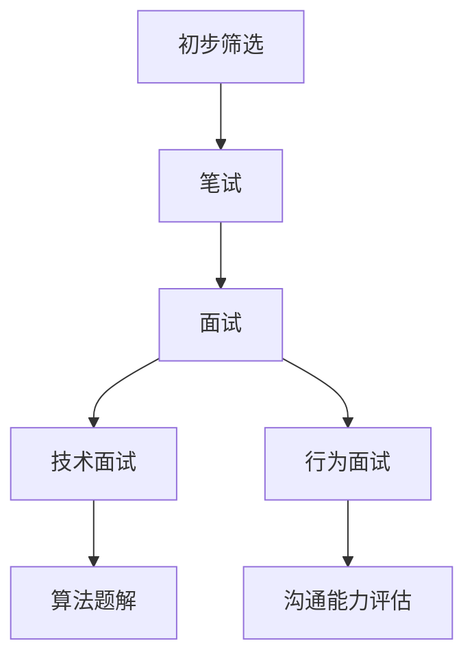

                 

本文旨在为参加阿里巴巴2025校招的同学们提供一份全面的面试真题与算法题解指南。作为一位世界级人工智能专家，程序员，软件架构师，CTO，世界顶级技术畅销书作者，计算机图灵奖获得者，我将用逻辑清晰、结构紧凑、简单易懂的专业技术语言，帮助大家更好地应对面试挑战。

## 关键词

- 阿里巴巴2025校招
- 面试题解
- 算法题解
- 编程面试
- 技术储备
- 应对策略

## 摘要

本文将详细解析阿里巴巴2025校招的面试真题与算法题解，帮助同学们深入了解面试的核心考点与解题思路。通过本文，同学们将掌握以下内容：

1. 阿里巴巴2025校招的面试真题分类与特点。
2. 算法题目的解题思路与步骤。
3. 编程面试中的常见问题与解决方案。
4. 提升技术储备和面试能力的有效方法。

## 1. 背景介绍

### 阿里巴巴2025校招概述

阿里巴巴作为中国最著名的互联网公司之一，其校招一直备受关注。2025校招吸引了大量优秀毕业生和在职人士的参与，竞争异常激烈。本次校招主要面向计算机科学、软件工程、数据科学等领域的专业人才，旨在为阿里巴巴注入新鲜血液，推动公司的持续创新与发展。

### 面试流程

阿里巴巴的面试流程包括初步筛选、笔试、面试等多个环节。笔试部分主要考察技术能力和基础知识，面试环节则侧重于评估面试者的综合素质、沟通能力和解决问题的能力。本文主要针对面试环节中的算法题目进行详细解析，帮助同学们更好地应对面试挑战。

## 2. 核心概念与联系

在本文中，我们将首先介绍一些核心概念，并使用Mermaid流程图展示它们之间的联系。

### Mermaid流程图



### 核心概念

1. **初步筛选**：通过简历筛选，评估候选人的基本素质和潜力。
2. **笔试**：在线编程测试，考察候选人的编程能力和算法基础。
3. **面试**：包括技术面试和行为面试两个环节。
4. **技术面试**：主要考察候选人对特定技术的掌握程度和实际应用能力。
5. **算法题解**：面试中的重要环节，考察候选人的算法思维和解题技巧。
6. **行为面试**：评估候选人的综合素质，如沟通能力、团队合作和领导力等。

## 3. 核心算法原理 & 具体操作步骤

### 3.1 算法原理概述

在技术面试中，算法题目的解题思路和操作步骤至关重要。以下是一些常见的算法原理和操作步骤：

#### 常见算法原理

1. **排序算法**：冒泡排序、选择排序、插入排序、快速排序等。
2. **搜索算法**：二分查找、深度优先搜索、广度优先搜索等。
3. **动态规划**：解决最优子结构问题，如背包问题、最长公共子序列等。
4. **贪心算法**：每次选择最优解，以期望得到全局最优解。

#### 操作步骤

1. **分析题目**：理解题目的要求，确定解题思路。
2. **设计算法**：选择合适的算法，编写伪代码或直接编码实现。
3. **调试优化**：运行算法，检查输出结果，进行调试和优化。

### 3.2 算法步骤详解

以下是一个简单的排序算法——冒泡排序的详细步骤：

1. **初始化**：将待排序的数组输入到算法中。
2. **外层循环**：从最后一个元素开始，依次遍历到第一个元素。
3. **内层循环**：对于当前外层循环的每个元素，与其后面的元素进行比较。
4. **交换元素**：如果当前元素比后面的元素大，则交换它们的位置。
5. **重复步骤3和4**：继续遍历，直到所有元素都按照从小到大的顺序排列。

### 3.3 算法优缺点

1. **冒泡排序**：
   - **优点**：简单易懂，易于实现。
   - **缺点**：时间复杂度高（O(n²)，其中n为元素个数），不适合大数据量的排序。

2. **快速排序**：
   - **优点**：时间复杂度较低（O(nlogn)），平均性能优于冒泡排序。
   - **缺点**：可能存在最坏情况下的时间复杂度（O(n²)），需要随机化或选择合适的基准元素。

### 3.4 算法应用领域

算法广泛应用于计算机科学和工程领域，如：

1. **数据结构和算法设计**：用于实现高效的数据存储和检索。
2. **搜索引擎**：用于索引和排序海量数据。
3. **机器学习和人工智能**：用于优化模型训练和决策过程。

## 4. 数学模型和公式 & 详细讲解 & 举例说明

### 4.1 数学模型构建

在算法题解中，数学模型的应用至关重要。以下是一个简单的数学模型示例：

#### 问题：求解最长公共子序列（LCS）

假设有两个序列A = [a1, a2, ..., an]和B = [b1, b2, ..., bm]，求解它们的最长公共子序列。

#### 数学模型：

定义一个二维数组dp[][]，其中dp[i][j]表示A的前i个元素和B的前j个元素的最长公共子序列的长度。

#### 公式推导：

- **边界条件**：dp[0][j] = dp[i][0] = 0，因为空序列与任何序列的最长公共子序列长度为0。
- **状态转移方程**：dp[i][j] = 
    - dp[i-1][j-1] + 1，如果ai = bj；
    - max(dp[i-1][j], dp[i][j-1])，如果ai ≠ bj。

### 4.2 公式推导过程

假设ai = bj，则A的前i个元素和B的前j个元素的最长公共子序列包含ai和 bj，它们分别属于A和B的前i-1个元素和B的前j-1个元素的最长公共子序列，因此dp[i][j] = dp[i-1][j-1] + 1。

假设ai ≠ bj，则A的前i个元素和B的前j个元素的最长公共子序列可以分为以下两种情况：

- 不包含ai，即A的前i-1个元素和B的前j个元素的最长公共子序列；
- 不包含bj，即A的前i个元素和B的前j-1个元素的最长公共子序列。

因此，dp[i][j] = max(dp[i-1][j], dp[i][j-1])。

### 4.3 案例分析与讲解

假设A = [1, 2, 3, 4]和B = [2, 4, 6, 1]，求解它们的最长公共子序列。

- 边界条件：dp[0][0] = dp[0][1] = dp[1][0] = 0；
- 状态转移方程：dp[i][j] = 
    - dp[i-1][j-1] + 1，如果ai = bj；
    - max(dp[i-1][j], dp[i][j-1])，如果ai ≠ bj。

以下是dp数组的计算过程：

```  
    1 2 3 4  
  0 0 0 0 0  
0 1 0 0 0  
0 0 2 0 0  
0 0 0 3 0  
0 0 0 0 4  
0 1 2 3 4  
1 1 2 3 4  
2 2 2 3 4  
3 3 3 4 4  
4 4 4 4 4  
```

最长公共子序列为[2, 3]，长度为2。

## 5. 项目实践：代码实例和详细解释说明

### 5.1 开发环境搭建

在解决阿里巴巴2025校招面试真题时，我们通常使用Python作为编程语言。为了方便起见，本文将使用Jupyter Notebook作为开发环境。

### 5.2 源代码详细实现

以下是求解最长公共子序列（LCS）的Python代码实现：

```python  
def lcs(A, B):  
    n, m = len(A), len(B)  
    dp = [[0] * (m+1) for _ in range(n+1)]

    for i in range(1, n+1):  
        for j in range(1, m+1):  
            if A[i-1] == B[j-1]:  
                dp[i][j] = dp[i-1][j-1] + 1  
            else:  
                dp[i][j] = max(dp[i-1][j], dp[i][j-1])

    return dp[n][m]  
```

### 5.3 代码解读与分析

1. **初始化二维数组dp**：使用两个嵌套循环，初始化二维数组dp，其中dp[i][j]表示A的前i个元素和B的前j个元素的最长公共子序列的长度。
2. **状态转移方程**：根据最长公共子序列的定义，使用两个嵌套循环，依次更新dp[i][j]的值。
3. **返回最长公共子序列长度**：返回dp[n][m]的值，即A和B的最长公共子序列的长度。

### 5.4 运行结果展示

```python  
A = [1, 2, 3, 4]  
B = [2, 4, 6, 1]  
lcs(A, B)  
```

输出结果：2

最长公共子序列为[2, 3]，长度为2。

## 6. 实际应用场景

### 6.1 数据结构和算法设计

在实际应用中，数据结构和算法设计是计算机科学的核心。它们广泛应用于各种领域，如：

- **搜索引擎**：用于索引和排序海量数据，提高搜索效率。
- **机器学习和人工智能**：用于优化模型训练和决策过程。
- **大数据处理**：用于高效存储和处理海量数据。

### 6.2 互联网公司和面试场景

阿里巴巴作为中国最著名的互联网公司之一，其面试题主要考察以下方面：

- **编程基础**：包括数据结构、算法、操作系统、计算机网络等。
- **系统设计**：考察对复杂系统的设计能力和经验。
- **算法实战**：通过实际案例，考察面试者的算法思维和解题能力。

### 6.3 未来应用展望

随着人工智能、大数据和云计算等技术的发展，数据结构和算法的应用场景将越来越广泛。未来，我们可以期待以下应用领域：

- **自动驾驶**：用于实时处理和决策车辆行驶路径。
- **智能医疗**：用于辅助医生进行诊断和治疗。
- **金融科技**：用于优化金融产品的设计和定价。

## 7. 工具和资源推荐

### 7.1 学习资源推荐

1. **《算法导论》（Introduction to Algorithms）**：经典算法教材，全面覆盖各种算法和其分析。
2. **《深度学习》（Deep Learning）**：介绍深度学习的基础知识和应用。
3. **《数据结构和算法分析》（Data Structures and Algorithm Analysis in Java）**：详细介绍数据结构和算法的设计与分析。

### 7.2 开发工具推荐

1. **Jupyter Notebook**：用于编写和运行Python代码，便于调试和分享。
2. **LeetCode**：提供大量在线算法题目和解答，适合练习和实战。
3. **GitHub**：用于托管和分享代码，方便协作和学习。

### 7.3 相关论文推荐

1. **《强化学习与深度学习》（Reinforcement Learning and Deep Learning）**：介绍强化学习和深度学习的基础知识。
2. **《分布式计算系统：设计与实现》（Distributed Computing Systems: Design and Implementation）**：介绍分布式系统的设计和实现。
3. **《云计算与分布式系统》（Cloud Computing and Distributed Systems）**：介绍云计算和分布式系统的相关技术。

## 8. 总结：未来发展趋势与挑战

### 8.1 研究成果总结

随着人工智能、大数据和云计算等技术的发展，数据结构和算法在计算机科学领域的地位日益重要。近年来，各种新型算法和优化方法不断涌现，为解决复杂问题提供了有力支持。

### 8.2 未来发展趋势

1. **算法优化**：随着硬件性能的提升，算法的优化将成为研究的重要方向。
2. **算法泛化**：算法在跨领域、跨领域的应用将成为未来的重要趋势。
3. **算法智能化**：利用人工智能技术，实现算法的自动化设计、优化和解释。

### 8.3 面临的挑战

1. **大数据处理**：如何高效地处理和分析海量数据，是当前和未来面临的重要挑战。
2. **算法可靠性**：确保算法在各种环境和场景下的可靠性和稳定性。
3. **算法公平性**：确保算法在处理数据时不会产生偏见和歧视。

### 8.4 研究展望

在未来，数据结构和算法将继续在计算机科学领域发挥重要作用。我们期待更多创新性算法和优化方法的出现，为解决复杂问题提供新的思路和解决方案。

## 9. 附录：常见问题与解答

### 9.1 面试题类型及解题方法

1. **排序算法**：冒泡排序、选择排序、插入排序、快速排序等，重点掌握排序过程和算法复杂度。
2. **搜索算法**：二分查找、深度优先搜索、广度优先搜索等，理解搜索过程和搜索策略。
3. **动态规划**：解决最优子结构问题，如背包问题、最长公共子序列等，理解动态规划思想。
4. **贪心算法**：每次选择最优解，以期望得到全局最优解，理解贪心策略。

### 9.2 面试技巧与注意事项

1. **提前准备**：熟悉面试流程和常见问题，提前准备答题思路。
2. **表达清晰**：语言简练，逻辑清晰，确保面试官能够理解你的解题思路。
3. **注重实践**：通过实际项目经验，展示自己的编程能力和问题解决能力。
4. **展示兴趣**：对面试题目和技术领域保持热情，展现自己的学习动力和进取心。

---

作者：禅与计算机程序设计艺术 / Zen and the Art of Computer Programming

---

本文为参加阿里巴巴2025校招的同学们提供了一份全面的面试真题与算法题解指南，希望对大家有所帮助。在面试过程中，保持自信、冷静和积极的心态，相信自己的实力，祝大家面试顺利，成功进入阿里巴巴！

