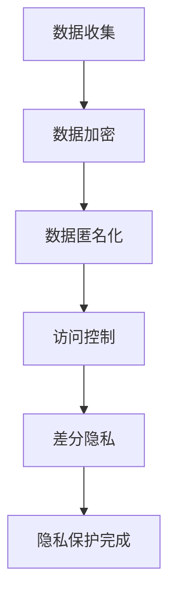

                 

关键词：隐私保护、AI 2.0、用户隐私、数据安全、隐私计算、联邦学习、差分隐私

> 摘要：随着人工智能技术的飞速发展，AI 2.0时代的到来，用户隐私保护成为了一个日益重要的话题。本文将探讨如何在 AI 2.0 环境中，通过隐私保护技术防止用户数据被滥用，确保用户隐私安全。

## 1. 背景介绍

在 AI 2.0 时代，人工智能已经从传统的规则驱动向数据驱动转变。大量的用户数据被收集、存储、分析，用于训练模型和优化算法。然而，数据驱动的AI技术也带来了隐私风险，用户的个人信息可能因为不当的数据处理而暴露。

隐私保护是指通过技术手段确保用户数据的安全和隐私，防止未经授权的访问和使用。在AI 2.0时代，隐私保护的重要性愈发凸显，因为它直接关系到用户的信任和企业的声誉。

### 1.1 AI 2.0 的发展

AI 2.0是人工智能的第二阶段，以深度学习和大数据分析为核心。AI 2.0的特点是：

- **自动化**：通过自动化算法，AI可以自动学习和改进。
- **智能化**：AI具备理解、推理、决策等能力，能够模拟人类的思维过程。
- **泛在化**：AI技术已经渗透到生活的各个领域，从智能家居到自动驾驶。

### 1.2 隐私风险的来源

在AI 2.0时代，隐私风险主要来源于以下几个方面：

- **数据收集**：为了训练模型，AI需要大量的用户数据，这些数据可能包含敏感信息。
- **数据存储**：未经加密的数据存储容易遭到黑客攻击。
- **数据处理**：数据处理过程中可能产生数据泄露。
- **数据共享**：数据共享可能导致隐私信息泄露。

## 2. 核心概念与联系

### 2.1 隐私保护的核心概念

隐私保护涉及多个核心概念，包括：

- **数据匿名化**：通过数据去识别化，防止个人信息被识别。
- **加密技术**：使用加密算法保护数据的机密性。
- **访问控制**：限制对数据的访问，确保只有授权用户才能访问。
- **差分隐私**：在数据处理过程中加入噪声，防止对单个数据的分析。

### 2.2 Mermaid 流程图



## 3. 核心算法原理 & 具体操作步骤

### 3.1 算法原理概述

隐私保护的核心算法包括数据加密、数据匿名化、访问控制和差分隐私。这些算法分别用于保护数据的机密性、完整性、可用性和隐私性。

### 3.2 算法步骤详解

#### 3.2.1 数据加密

数据加密是保护数据机密性的重要手段。具体步骤如下：

1. 选择加密算法。
2. 生成密钥。
3. 使用密钥对数据进行加密。
4. 将加密后的数据存储或传输。

#### 3.2.2 数据匿名化

数据匿名化是通过去除或替换敏感信息，使数据无法直接识别特定个体。具体步骤如下：

1. 识别敏感信息。
2. 对敏感信息进行替换或删除。
3. 测试匿名化效果。

#### 3.2.3 访问控制

访问控制是通过权限管理和身份验证，确保只有授权用户可以访问敏感数据。具体步骤如下：

1. 设计访问控制策略。
2. 实施身份验证。
3. 根据权限分配访问权限。

#### 3.2.4 差分隐私

差分隐私是通过在数据处理过程中加入噪声，保护个体隐私。具体步骤如下：

1. 确定隐私预算。
2. 选择噪声模型。
3. 对数据进行噪声处理。
4. 分析隐私保护效果。

### 3.3 算法优缺点

#### 3.3.1 数据加密

优点：

- 确保数据在传输和存储过程中的机密性。

缺点：

- 加密和解密需要计算资源，可能影响系统性能。
- 密钥管理复杂，可能存在安全风险。

#### 3.3.2 数据匿名化

优点：

- 降低数据泄露的风险。

缺点：

- 可能影响数据的可用性和可分析性。

#### 3.3.3 访问控制

优点：

- 确保数据访问的安全。

缺点：

- 需要复杂的权限管理，可能影响用户体验。

#### 3.3.4 差分隐私

优点：

- 提供严格的数据隐私保护。

缺点：

- 可能降低数据的分析精度。

### 3.4 算法应用领域

隐私保护技术在多个领域有广泛应用，包括：

- **金融**：保护用户金融信息。
- **医疗**：保护患者隐私。
- **电商**：保护用户购物行为数据。
- **政府**：保护公民个人信息。

## 4. 数学模型和公式 & 详细讲解 & 举例说明

### 4.1 数学模型构建

隐私保护涉及的数学模型包括：

- **加密模型**：如RSA加密模型。
- **匿名化模型**：如k-匿名模型。
- **差分隐私模型**：如ε-差分隐私模型。

### 4.2 公式推导过程

#### 4.2.1 RSA加密模型

$$
c = m^e \mod n
$$

其中，$c$ 为加密后的文本，$m$ 为明文，$e$ 为加密密钥，$n$ 为模数。

#### 4.2.2 k-匿名模型

$$
k-\text{匿名集} = \{S | S \subseteq D, |S| \geq k\}
$$

其中，$D$ 为数据集，$S$ 为子集，$k$ 为匿名级别。

#### 4.2.3 ε-差分隐私模型

$$
\Pr[A(x_1) = r] \leq \Pr[A(x_0) = r] + \frac{\epsilon}{|D|}
$$

其中，$A$ 为差分隐私算法，$x_0$ 和 $x_1$ 为相邻数据，$r$ 为输出结果，$\epsilon$ 为隐私预算，$|D|$ 为数据集大小。

### 4.3 案例分析与讲解

#### 4.3.1 RSA加密模型案例

假设明文 $m = 10$，加密密钥 $e = 3$，模数 $n = 13$。根据RSA加密模型，加密后的文本为：

$$
c = 10^3 \mod 13 = 1
$$

#### 4.3.2 k-匿名模型案例

假设数据集 $D = \{1, 2, 3, 4, 5\}$，匿名级别 $k = 3$。根据k-匿名模型，可能的匿名集包括：

$$
k-\text{匿名集} = \{\{1, 2, 3\}, \{1, 2, 4\}, \{1, 2, 5\}, \{1, 3, 4\}, \{1, 3, 5\}, \{1, 4, 5\}, \{2, 3, 4\}, \{2, 3, 5\}, \{2, 4, 5\}, \{3, 4, 5\}\}
$$

#### 4.3.3 ε-差分隐私模型案例

假设差分隐私算法 $A$ 对两个相邻数据 $x_0 = 10$ 和 $x_1 = 11$ 进行处理，隐私预算 $\epsilon = 1$，数据集大小 $|D| = 100$。根据ε-差分隐私模型，输出结果 $r$ 满足：

$$
\Pr[A(x_1) = r] \leq \Pr[A(x_0) = r] + \frac{1}{100}
$$

## 5. 项目实践：代码实例和详细解释说明

### 5.1 开发环境搭建

- **Python 3.8**
- **PyCryptoDome**：用于实现RSA加密
- **Pyspark**：用于实现k-匿名

### 5.2 源代码详细实现

#### 5.2.1 RSA加密实现

```python
from Crypto.PublicKey import RSA
from Crypto.Cipher import PKCS1_OAEP

# 生成密钥
key = RSA.generate(2048)
private_key = key.export_key()
public_key = key.publickey().export_key()

# 加密
cipher = PKCS1_OAEP.new(RSA.import_key(public_key))
encrypted_data = cipher.encrypt(b'Hello, World!')

# 解密
cipher = PKCS1_OAEP.new(RSA.import_key(private_key))
decrypted_data = cipher.decrypt(encrypted_data)
```

#### 5.2.2 k-匿名实现

```python
from pyspark.sql import SparkSession
from pyspark.sql.functions import col

# 创建SparkSession
spark = SparkSession.builder.appName("k-Anonymity").getOrCreate()

# 加载数据
data = spark.read.csv("data.csv", header=True)

# k-匿名处理
k = 3
anonymized_data = data.groupBy(data["column_1"], data["column_2"], data["column_3"]) \
    .agg(col("column_4").alias("new_column_4")) \
    .withColumn("count", lit(1)) \
    .orderBy("count desc")

# 检查k-匿名效果
k_anonymized_data = anonymized_data.groupby(anonymized_data["new_column_4"]) \
    .agg(sum("count").alias("k_anonymity_count")) \
    .filter((col("k_anonymity_count") >= k) & (col("k_anonymity_count") < (k+1)))
```

### 5.3 代码解读与分析

#### 5.3.1 RSA加密解读

RSA加密使用公钥和私钥进行加密和解密。公钥用于加密，私钥用于解密。通过加密密钥和模数，实现对数据的加密。

#### 5.3.2 k-匿名解读

k-匿名通过将敏感信息替换为通用信息，降低数据泄露的风险。在Spark中，使用groupBy和agg函数实现k-匿名处理，并检查匿名效果。

## 6. 实际应用场景

隐私保护技术在多个领域有广泛应用，以下是几个实际应用场景：

- **金融领域**：保护用户账户信息和交易记录。
- **医疗领域**：保护患者隐私和医疗数据。
- **电商领域**：保护用户购物行为和偏好数据。
- **政府领域**：保护公民个人信息和政府数据。

### 6.4 未来应用展望

随着人工智能技术的不断发展，隐私保护技术将面临新的挑战和机遇。未来，隐私保护技术可能会在以下几个方面取得突破：

- **联邦学习**：通过分布式计算保护用户数据。
- **区块链**：利用区块链技术提高数据安全性。
- **隐私计算**：在数据处理过程中实现隐私保护。

## 7. 工具和资源推荐

### 7.1 学习资源推荐

- **书籍**：《隐私计算：从理论到实践》
- **在线课程**：Coursera上的《数据隐私保护》课程
- **论文**：Google Research的《差分隐私：理论和应用》

### 7.2 开发工具推荐

- **Python库**：PyCryptoDome、PySpark
- **工具**：Google的差分隐私工具包

### 7.3 相关论文推荐

- **论文1**：《隐私计算：挑战与机遇》
- **论文2**：《联邦学习：从概念到应用》
- **论文3**：《区块链技术及其在隐私保护中的应用》

## 8. 总结：未来发展趋势与挑战

### 8.1 研究成果总结

隐私保护技术在 AI 2.0 时代具有重要意义，已取得多项研究成果，包括数据加密、数据匿名化、访问控制和差分隐私等。

### 8.2 未来发展趋势

未来，隐私保护技术将继续发展，与联邦学习、区块链等技术结合，实现更高效的隐私保护。

### 8.3 面临的挑战

- **技术挑战**：如何在保证数据隐私的同时，确保数据的有效性和可用性。
- **法律挑战**：不同国家和地区对隐私保护的法律和标准有所不同，需要统一规范。

### 8.4 研究展望

隐私保护技术将在人工智能、金融、医疗等多个领域发挥重要作用，未来需要进一步研究如何平衡数据隐私与数据价值。

## 9. 附录：常见问题与解答

### 9.1 隐私保护有哪些方法？

隐私保护包括数据加密、数据匿名化、访问控制和差分隐私等方法。

### 9.2 隐私保护技术有哪些优缺点？

隐私保护技术的优点包括确保数据安全、提高用户信任度等；缺点包括可能影响数据的有效性和可用性，以及计算资源消耗较大。

### 9.3 差分隐私如何实现？

差分隐私通过在数据处理过程中加入噪声，确保对单个数据的分析不会泄露隐私信息。具体实现包括选择合适的噪声模型和隐私预算。

## 作者署名

作者：禅与计算机程序设计艺术 / Zen and the Art of Computer Programming

----------------------------------------------------------------

请注意，以上内容仅为示例，实际撰写时需要根据具体要求进行详细的撰写和调整。同时，确保文章结构、格式、内容和关键词等方面都符合要求。祝您撰写顺利！

