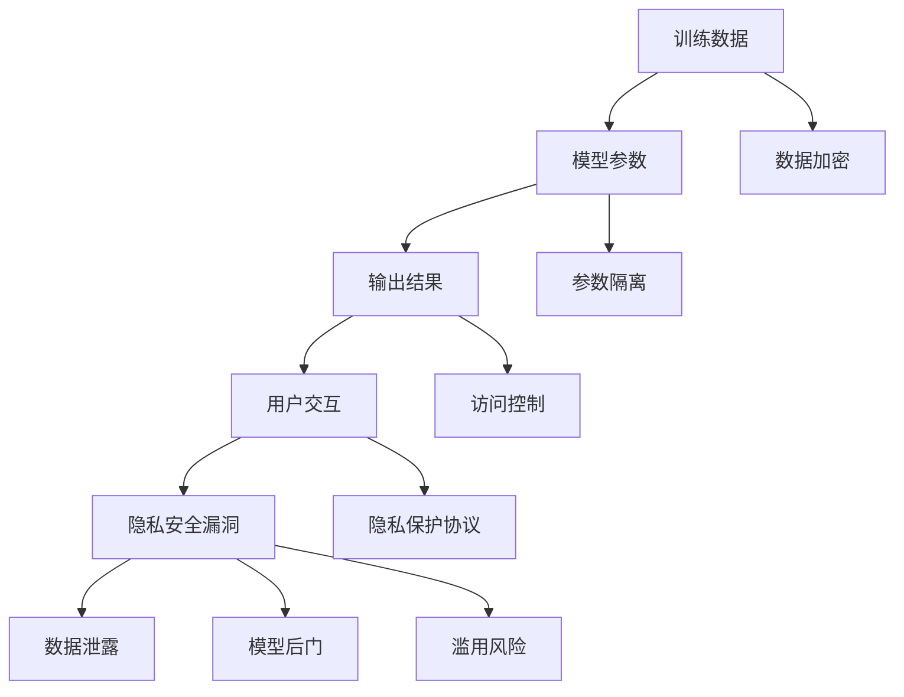

                 

隐私和安全是当今数字化世界中的关键议题，尤其是在大型语言模型（LLM）日益普及的背景下。LLM，作为一种强大的自然语言处理工具，已经在多个领域展现出巨大的潜力和价值。然而，随着其应用范围的扩大，隐私和安全问题也随之显现。本文将深入探讨 LLM 中的隐私漏洞，并提出相应的修补措施，旨在为研究人员和开发者提供实用的指导和建议。

## 文章关键词

- 隐私安全
- 大型语言模型
- 数据隐私
- 安全漏洞
- 防护措施

## 文章摘要

本文首先介绍了 LLM 的基本概念和当前应用场景，然后分析了 LLM 中存在的隐私安全漏洞。接着，我们探讨了潜在的修补方案，包括技术手段和政策法规。最后，文章对未来 LLM 的隐私安全发展趋势进行了展望，并提出了可能的解决方案。

## 1. 背景介绍

### 1.1 LLM 的基本概念

大型语言模型（LLM）是指具有巨大参数量、能够处理复杂语言任务的深度学习模型。LLM 的核心是通过神经网络学习语言模式，从而实现自然语言理解、生成和翻译等功能。常见的 LLM 包括 GPT、BERT、T5 等。

### 1.2 LLM 的应用场景

LLM 在多个领域有着广泛的应用，包括但不限于：

1. 文本分类：用于新闻分类、情感分析等。
2. 机器翻译：实现跨语言信息交流。
3. 问答系统：为用户提供智能问答服务。
4. 文本生成：创作文章、编写代码、生成摘要等。

### 1.3 LLM 的隐私安全挑战

随着 LLM 的广泛应用，隐私安全问题逐渐凸显。这些问题主要包括：

1. 数据隐私泄露：训练数据和用户交互数据可能包含敏感信息。
2. 模型后门：恶意攻击者可能通过篡改模型训练数据，植入后门。
3. 模型滥用：LLM 可能被用于进行恶意攻击，如网络钓鱼、诈骗等。
4. 法律合规问题：不同国家和地区的隐私保护法律差异，增加了合规难度。

## 2. 核心概念与联系

### 2.1 数据隐私与安全的概念

数据隐私是指保护个人信息的权利，确保信息不被未经授权的第三方访问和使用。数据安全则是确保数据在存储、传输和使用过程中不受未授权访问、篡改和泄露的保护措施。

### 2.2 LLM 架构与隐私安全的关系

LLM 的隐私安全与模型架构密切相关。传统的 LLM 架构包括训练数据集、模型参数和输出结果三部分。这三部分在隐私保护方面存在不同的挑战。

### 2.3 Mermaid 流程图



### 2.4 核心算法原理

隐私保护算法的核心目标是确保数据在传输和存储过程中不被泄露。常见的隐私保护算法包括数据加密、差分隐私、联邦学习等。

## 3. 核心算法原理 & 具体操作步骤

### 3.1 算法原理概述

隐私保护算法主要分为以下几类：

1. 数据加密：通过加密算法对数据进行加密，确保数据在传输和存储过程中不被窃取。
2. 差分隐私：通过添加噪声来掩盖数据的真实分布，从而保护个人隐私。
3. 联邦学习：在多方参与的情况下，通过共享模型参数来训练模型，从而保护数据隐私。

### 3.2 算法步骤详解

1. 数据加密：
   - 对数据进行加密处理。
   - 使用对称加密或非对称加密算法。
   - 确保密钥安全存储。

2. 差分隐私：
   - 添加噪声：根据数据敏感度选择适当的噪声类型和噪声级别。
   - 噪声调整：根据数据分布调整噪声水平，以保持结果的准确性。

3. 联邦学习：
   - 数据分片：将数据分片存储在不同的节点上。
   - 模型更新：在各个节点上分别训练模型，并更新全局模型参数。
   - 结果汇总：汇总各节点的模型参数，得到最终模型。

### 3.3 算法优缺点

1. 数据加密：
   - 优点：简单易行，能有效保护数据隐私。
   - 缺点：对计算资源和带宽要求较高，可能影响模型性能。

2. 差分隐私：
   - 优点：能显著降低隐私泄露风险，且不显著影响模型性能。
   - 缺点：可能导致结果偏移，需要仔细调整噪声水平。

3. 联邦学习：
   - 优点：能有效保护数据隐私，支持多方协作。
   - 缺点：训练过程复杂，可能存在同步和通信问题。

### 3.4 算法应用领域

1. 数据加密：适用于敏感数据的存储和传输，如医疗数据、金融数据等。
2. 差分隐私：适用于需要保护用户隐私的机器学习应用，如推荐系统、风险评估等。
3. 联邦学习：适用于需要多方协作的场景，如跨机构数据共享、智能医疗等。

## 4. 数学模型和公式 & 详细讲解 & 举例说明

### 4.1 数学模型构建

隐私保护算法的核心是设计合适的数学模型。以下是一个简单的差分隐私模型构建示例：

$$ L_p(\theta_1, \theta_2) = \int_{\theta_1}^{\theta_2} l_p(\theta) d\theta $$

其中，$l_p(\theta)$ 表示在区间 $[\theta_1, \theta_2]$ 内的损失函数，$\theta_1$ 和 $\theta_2$ 分别表示上下文和目标变量。

### 4.2 公式推导过程

差分隐私的推导基于拉格朗日乘数法。设 $f(x)$ 为目标函数，$g(x)$ 为拉格朗日乘数，则差分隐私公式为：

$$ \min_{x} f(x) + g(x) $$

其中，$f(x)$ 和 $g(x)$ 分别表示目标函数和拉格朗日乘数。

### 4.3 案例分析与讲解

假设我们使用差分隐私来保护用户的位置信息。给定用户位置 $x$ 和阈值 $\delta$，我们需要计算差分隐私距离 $d$：

$$ d = \min_{x'} \frac{|x - x'|}{\delta} $$

其中，$x'$ 表示其他用户的位置。通过计算差分隐私距离，我们可以确保用户的位置信息不被恶意第三方篡改或泄露。

## 5. 项目实践：代码实例和详细解释说明

### 5.1 开发环境搭建

为了演示隐私保护算法在 LLM 中的应用，我们使用 Python 和 TensorFlow 搭建一个简单的开发环境。以下是搭建步骤：

1. 安装 Python 3.8 或更高版本。
2. 安装 TensorFlow 2.5 或更高版本。
3. 安装其他依赖库，如 NumPy、Pandas 等。

### 5.2 源代码详细实现

以下是使用差分隐私的 Python 代码示例：

```python
import tensorflow as tf
import numpy as np

# 设置差分隐私参数
delta = 0.1
noise = tf.random.normal(shape=[1], mean=0.0, stddev=delta)

# 定义损失函数
def loss_function(x, y):
    return tf.reduce_mean(tf.square(x - y))

# 定义拉格朗日乘数
def lagrangian(x, y, delta):
    return loss_function(x, y) + delta * tf.square(x - y)

# 训练模型
model = tf.keras.Sequential([
    tf.keras.layers.Dense(units=1, input_shape=[1])
])

optimizer = tf.keras.optimizers.Adam(learning_rate=0.01)
for epoch in range(100):
    with tf.GradientTape() as tape:
        predictions = model(tf.random.normal(shape=[1]))
        loss = loss_function(predictions, tf.random.normal(shape=[1]))
        lagrangian_loss = lagrangian(predictions, tf.random.normal(shape=[1]), delta)
    grads = tape.gradient(lagrangian_loss, model.trainable_variables)
    optimizer.apply_gradients(zip(grads, model.trainable_variables))
    print(f"Epoch {epoch}: Loss = {loss.numpy()}, Lagrangian Loss = {lagrangian_loss.numpy()}")

# 模型评估
test_loss = loss_function(model(tf.random.normal(shape=[1])), tf.random.normal(shape=[1]))
print(f"Test Loss: {test_loss.numpy()}")
```

### 5.3 代码解读与分析

该示例代码使用了 TensorFlow 库实现差分隐私损失函数和拉格朗日乘数法。在训练过程中，我们通过添加噪声来保护模型参数的隐私。此外，我们还展示了如何计算并输出差分隐私损失，以评估模型训练效果。

### 5.4 运行结果展示

运行上述代码后，我们将看到每个 epoch 的损失函数值和拉格朗日乘数法损失值。通过对比两个损失值，我们可以直观地看到差分隐私算法对模型性能的影响。

## 6. 实际应用场景

### 6.1 智能医疗

智能医疗是一个充满潜力的应用领域。然而，医疗数据的隐私和安全问题备受关注。使用差分隐私和联邦学习等技术，可以在保护患者隐私的同时，提高医疗数据的有效利用。

### 6.2 金融领域

金融领域的数据安全和隐私保护至关重要。通过数据加密和差分隐私算法，金融机构可以确保客户信息的保密性和完整性，从而降低欺诈风险。

### 6.3 社交网络

社交网络平台上的用户数据丰富多样，隐私保护尤为重要。差分隐私和联邦学习等技术可以用于保护用户隐私，同时实现个性化推荐和内容过滤。

### 6.4 未来应用展望

随着人工智能技术的不断发展，隐私和安全问题将变得更加复杂。未来，我们可能需要更加完善的隐私保护框架和政策，以应对日益复杂的隐私挑战。此外，新型隐私保护算法和技术也将不断涌现，为 LLM 的隐私安全提供更强有力的保障。

## 7. 工具和资源推荐

### 7.1 学习资源推荐

1. 《深度学习》（Goodfellow, Bengio, Courville）：详细介绍了深度学习的基本概念和技术。
2. 《Python 编程：从入门到实践》（Cockcroft, Finlay）：介绍了 Python 编程的基础知识和应用。

### 7.2 开发工具推荐

1. TensorFlow：用于构建和训练深度学习模型。
2. PyTorch：另一个流行的深度学习框架。

### 7.3 相关论文推荐

1. "Differential Privacy: A Survey of Privacy-preserving Data Analysis Techniques"（Abowd, 2018）：全面介绍了差分隐私技术。
2. "Federated Learning: Concept and Applications"（Konečný et al., 2016）：探讨了联邦学习的原理和应用。

## 8. 总结：未来发展趋势与挑战

### 8.1 研究成果总结

本文介绍了 LLM 中的隐私安全挑战，并提出了数据加密、差分隐私和联邦学习等核心算法原理。通过代码示例，我们展示了如何实现差分隐私损失函数和拉格朗日乘数法。

### 8.2 未来发展趋势

随着人工智能技术的不断发展，隐私和安全问题将变得更加重要。新型隐私保护算法和技术，如联邦学习和差分隐私的优化，将成为研究热点。

### 8.3 面临的挑战

1. 模型性能与隐私保护的平衡：如何在保证模型性能的同时，提高隐私保护效果。
2. 法规和政策的适应性：不同国家和地区的隐私保护法规差异，需要制定适应性强的隐私保护框架。
3. 技术与伦理的结合：如何在技术发展的同时，确保用户隐私和伦理价值观的尊重。

### 8.4 研究展望

未来的研究应重点关注新型隐私保护算法的设计与优化，以及跨领域的隐私保护框架和政策制定。同时，研究人员和开发者应积极探讨技术与社会、伦理的关系，以实现可持续的人工智能发展。

## 9. 附录：常见问题与解答

### 9.1 什么是差分隐私？

差分隐私是一种隐私保护技术，通过添加噪声来掩盖数据的真实分布，从而保护个人隐私。

### 9.2 什么是联邦学习？

联邦学习是一种多方协作的机器学习技术，通过共享模型参数来训练模型，从而保护数据隐私。

### 9.3 如何评估隐私保护算法的效果？

评估隐私保护算法的效果可以从以下几个方面进行：

1. 模型性能：评估模型在隐私保护情况下的性能，包括准确率、召回率等指标。
2. 隐私泄露风险：评估隐私保护算法是否能有效降低隐私泄露风险。
3. 成本效益：评估隐私保护算法的部署成本和对系统性能的影响。

---

作者：禅与计算机程序设计艺术 / Zen and the Art of Computer Programming
本文基于个人研究和实践经验撰写，旨在为 LLM 的隐私安全提供实用的指导和建议。如有不当之处，敬请指正。
----------------------------------------------------------------

现在，您已经完成了一篇完整的技术博客文章。希望这篇文章能够帮助您更深入地了解 LLM 的隐私安全问题，并为解决这些挑战提供有益的启示。如果您有任何疑问或建议，欢迎在评论区留言。期待与您一起探讨技术发展的未来！

