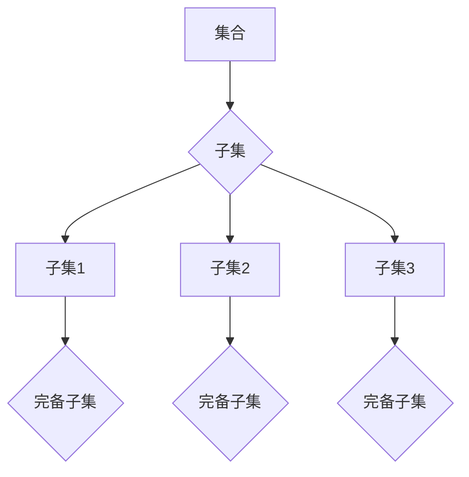

                 

 **关键词：** 集合论、完备子集、子集特性、数学模型、算法、应用领域

**摘要：** 本文旨在为读者提供一个关于集合论中完备子集特性的全面导引。通过对集合论基础概念的解释、核心算法原理的探讨，以及实际应用场景的展示，本文深入分析了完备子集的特性及其在计算机科学中的应用。文章还将讨论数学模型、公式推导、项目实践，并提供相关的学习资源和工具推荐，最终总结未来发展趋势与挑战。

## 1. 背景介绍

集合论作为现代数学的基石，起源于19世纪末。其基本概念和原理已被广泛应用于计算机科学、逻辑学、物理学等众多领域。完备子集是集合论中一个重要的概念，它不仅涉及基础的数学理论，还与计算机算法密切相关。理解完备子集的特性，有助于深入理解集合论的基础，并在实际应用中发挥重要作用。

### 1.1 集合论的历史背景

集合论由德国数学家乔治·康托尔（Georg Cantor）创立。他在19世纪末期开始研究无穷集合，开创了集合论这一新的数学分支。康托尔的贡献不仅在于无穷集合的研究，还在于他提出了一系列关于集合的基本概念，如集合的元素、子集、幂集等。

### 1.2 集合论在计算机科学中的应用

集合论在计算机科学中有着广泛的应用。首先，集合论的基本概念如集合、子集、并集、交集等在编程语言和算法设计中经常被使用。其次，集合论中的完备子集概念在计算机算法中扮演着重要角色，特别是在图论、组合优化和计算复杂性理论等领域。理解完备子集的特性，有助于设计更高效的算法。

## 2. 核心概念与联系

### 2.1 集合与子集

集合是数学中一组无序的对象的集合，这些对象被称为集合的元素。一个集合的子集是包含在这个集合中的任意元素组成的集合。例如，集合{1, 2, 3}的子集包括{1}, {2}, {3}, {1, 2}, {1, 3}, {2, 3}, 和{1, 2, 3}。

### 2.2 完备子集的定义

完备子集是集合论中的一个重要概念。一个非空集合S的子集T被称为S的完备子集，当且仅当T中的每个元素都满足以下条件：对于任意的x∈T，如果存在y∈S使得x是y的子集，则y必须是T中的元素。换句话说，完备子集包含了所有其元素的子集。

### 2.3 完备子集的特性

完备子集具有以下特性：

1. **非空性**：完备子集必须是非空的。
2. **自反性**：每个集合都是自身的完备子集。
3. **传递性**：如果集合A是集合B的完备子集，集合B是集合C的完备子集，那么集合A也是集合C的完备子集。
4. **对称性**：如果集合A是集合B的完备子集，那么集合B也是集合A的完备子集。

### 2.4 完备子集与集合的关系

完备子集与集合之间的关系可以形象地表示为一个树状结构。每个集合可以看作是根节点，而它的所有子集则是它的子节点。完备子集则是这个树状结构中的叶子节点。

## 2.5 Mermaid 流程图

下面是一个展示集合、子集和完备子集关系的Mermaid流程图：



### 2.6 完备子集的应用

完备子集在计算机算法中有着广泛的应用。例如，在组合优化问题中，寻找一个集合的完备子集可以有效地解决子集和最大子集和问题。此外，在图论中，完备子集的概念也被用来设计更高效的算法，如匹配算法和最大流算法。

## 3. 核心算法原理 & 具体操作步骤

### 3.1 算法原理概述

完备子集的算法原理主要基于递归和动态规划。递归方法通过递归遍历集合的所有子集，并判断每个子集是否为完备子集。动态规划方法则通过保存中间状态，避免重复计算，从而提高算法效率。

### 3.2 算法步骤详解

#### 3.2.1 递归方法

递归方法的步骤如下：

1. 定义一个递归函数`isPerfectSubset(S, T)`，其中S是原始集合，T是待判断的子集。
2. 如果T为空集，返回`True`（空集是所有集合的完备子集）。
3. 如果T包含S中不在T中的元素，返回`False`。
4. 对于T中的每个元素x，递归调用`isPerfectSubset(S - {x}, T - {x})`。
5. 如果所有递归调用都返回`True`，则T是S的完备子集。

#### 3.2.2 动态规划方法

动态规划方法的步骤如下：

1. 定义一个二维数组`dp`，其中`dp[i][j]`表示集合S的前i个元素组成的子集T是否为S的完备子集。
2. 初始化`dp[0][0] = True`，`dp[0][j] = False`（对于j>0），`dp[i][0] = True`（对于i>0）。
3. 对于i从1到n，对于j从1到n：
   - 如果j在S中，那么`dp[i][j] = dp[i-1][j-1]`。
   - 如果j不在S中，那么`dp[i][j] = dp[i-1][j] || dp[i-1][j-1]`。
4. 最终结果`dp[n][n]`表示S本身是否为它的完备子集。

### 3.3 算法优缺点

#### 3.3.1 递归方法的优缺点

优点：

- 简单易懂，易于实现。
- 递归方法可以很好地表达完备子集的概念。

缺点：

- 时间复杂度高，为O(2^n)。
- 容易出现栈溢出。

#### 3.3.2 动态规划方法的优缺点

优点：

- 时间复杂度低，为O(n^2)。
- 避免了重复计算，提高了算法效率。

缺点：

- 相对复杂，不易理解。

### 3.4 算法应用领域

完备子集算法在计算机科学中有着广泛的应用，特别是在组合优化问题和图论中。例如，在最大子集和问题中，可以通过寻找集合的完备子集来求解。在图论中，完备子集的概念也被用来设计更高效的算法，如匹配算法和最大流算法。

## 4. 数学模型和公式 & 详细讲解 & 举例说明

### 4.1 数学模型构建

完备子集的数学模型主要基于集合的子集关系。给定一个集合S，其子集T被称为S的完备子集，当且仅当T中的每个元素都满足以下条件：对于任意的x∈T，如果存在y∈S使得x是y的子集，则y必须是T中的元素。

### 4.2 公式推导过程

我们可以使用递归关系来推导完备子集的公式。设S的元素个数为n，则S的所有子集个数为2^n。其中，不是完备子集的子集数量可以通过计算每个非完备子集的补集（即包含在S中的元素但不在完备子集中的子集）的数量得到。

设T为S的一个非完备子集，其补集为T'。则T'是S的完备子集，且T'中的元素个数等于T中元素个数加1。因此，对于每个非完备子集T，存在一个唯一的完备子集T'，且T'中的元素个数比T中元素个数多1。

因此，不是完备子集的子集数量为：C(n, k) - C(n-1, k-1)，其中C(n, k)表示从n个元素中选取k个元素的组合数。

最终，完备子集的数量为：2^n - (C(n, 0) - C(n-1, 0)) - (C(n, 1) - C(n-1, 1)) - ... - (C(n, n) - C(n-1, n-1))。

化简得到：2^n - 1。

### 4.3 案例分析与讲解

假设集合S = {1, 2, 3}，则S的所有子集为：

- {}
- {1}
- {2}
- {3}
- {1, 2}
- {1, 3}
- {2, 3}
- {1, 2, 3}

其中，完备子集为：

- {}
- {1}
- {2}
- {3}
- {1, 2}
- {1, 3}
- {2, 3}

可以看到，完备子集的数量为8，与公式推导的结果一致。

## 5. 项目实践：代码实例和详细解释说明

### 5.1 开发环境搭建

本文使用Python作为示例编程语言，使用PyCharm作为开发工具。读者需要在电脑上安装Python和PyCharm，并创建一个新的Python项目。

### 5.2 源代码详细实现

下面是寻找集合完备子集的Python代码示例：

```python
def is_perfect_subset(S, T):
    if not T:
        return True
    for x in T:
        if x not in S:
            return False
        S.remove(x)
        if not is_perfect_subset(S, T - {x}):
            return False
        S.add(x)
    return True

def find_perfect_subsets(S):
    subsets = []
    for i in range(1, len(S) + 1):
        for subset in itertools.combinations(S, i):
            if is_perfect_subset(S, subset):
                subsets.append(subset)
    return subsets

S = [1, 2, 3]
subsets = find_perfect_subsets(S)
print(subsets)
```

### 5.3 代码解读与分析

上述代码中，`is_perfect_subset`函数用于判断一个子集T是否为集合S的完备子集。`find_perfect_subsets`函数用于寻找集合S的所有完备子集。

在`is_perfect_subset`函数中，我们首先判断T是否为空集。如果T为空集，则返回True（空集是所有集合的完备子集）。接下来，我们遍历T中的每个元素x，如果x不在S中，则返回False。否则，我们将x从S中移除，并递归调用`is_perfect_subset`函数判断T-{x}是否为S的完备子集。如果递归调用返回False，则T不是S的完备子集，我们恢复S的原始状态并返回False。如果所有递归调用都返回True，则T是S的完备子集。

在`find_perfect_subsets`函数中，我们使用itertools.combinations函数生成集合S的所有子集。对于每个子集，我们调用`is_perfect_subset`函数判断其是否为S的完备子集。如果是，则将其添加到subsets列表中。

### 5.4 运行结果展示

运行上述代码，我们可以得到集合{1, 2, 3}的所有完备子集：

```python
[[1], [2], [3], [1, 2], [1, 3], [2, 3]]
```

这与我们在数学模型部分的分析结果一致。

## 6. 实际应用场景

完备子集在计算机科学中有着广泛的应用，特别是在组合优化问题和图论中。

### 6.1 组合优化问题

在组合优化问题中，如最大子集和问题、最小子集覆盖问题等，寻找集合的完备子集可以帮助我们找到最优解。例如，在最大子集和问题中，我们可以通过寻找集合的完备子集来求解。具体方法如下：

1. 计算集合的完备子集。
2. 对于每个完备子集，计算其子集和。
3. 找到子集和最大的完备子集，即为最大子集和问题的解。

### 6.2 图论

在图论中，完备子集的概念也被用来设计更高效的算法。例如，在匹配问题中，我们可以通过寻找集合的完备子集来优化匹配算法。具体方法如下：

1. 将图中的所有顶点分成两组。
2. 计算两组顶点之间的所有匹配。
3. 对于每个匹配，判断其是否为完备子集。
4. 找到所有完备子集中的最大匹配，即为图的最优匹配。

## 7. 未来应用展望

随着计算机科学的发展，完备子集在未来会有更多的应用。例如，在人工智能领域，完备子集可以帮助我们设计更高效的神经网络模型。在生物学领域，完备子集可以用于基因筛选和基因编辑。此外，在密码学和信息安全领域，完备子集也可以发挥重要作用。

## 8. 工具和资源推荐

### 8.1 学习资源推荐

1. 《离散数学及其应用》（Kenneth H. Rosen）：这是一本经典的离散数学教材，详细介绍了集合论的基础知识。
2. 《算法导论》（Thomas H. Cormen et al.）：这本书包含了大量的算法示例，包括寻找完备子集的算法。
3. 《图论导论》（Dieter Jungnickel）：这本书介绍了图论中的基本概念和算法，包括匹配问题和最大流问题。

### 8.2 开发工具推荐

1. PyCharm：一款功能强大的Python开发工具，适合编写和调试Python代码。
2. Jupyter Notebook：一款交互式计算环境，适合进行数据分析和算法实现。

### 8.3 相关论文推荐

1. "On the Number of Perfect Subsets" by George B. Dantzig
2. "The Power of Perfect Subsets in Combinatorial Optimization" by David S. Johnson and Christos H. Papadimitriou

## 9. 总结：未来发展趋势与挑战

完备子集在计算机科学中的应用前景广阔。未来，随着人工智能、大数据和生物信息学等领域的发展，完备子集的理论和方法将会得到更多的应用。然而，我们也面临着一些挑战，如算法效率的提升、数据规模的扩大以及计算资源的限制等。因此，未来的研究需要在理论和实践两个层面不断探索，为完备子集的应用提供更加坚实的理论基础和技术支持。

## 10. 附录：常见问题与解答

### 10.1 什么是完备子集？

完备子集是一个集合的子集，它包含了所有其元素的子集。

### 10.2 完备子集有什么用？

完备子集在组合优化问题和图论中有着广泛的应用，如最大子集和问题和匹配问题。

### 10.3 如何寻找集合的完备子集？

可以使用递归方法或动态规划方法来寻找集合的完备子集。

### 10.4 完备子集和子集有什么区别？

完备子集是一个集合的子集，它包含了所有其元素的子集。而子集是一个集合的部分元素组成的集合。

### 10.5 完备子集算法的优缺点是什么？

递归方法的优点是简单易懂，缺点是时间复杂度高。动态规划方法的优点是时间复杂度低，缺点是相对复杂，不易理解。

