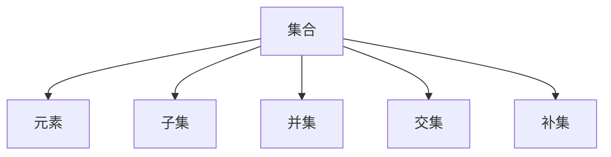

                 

关键词：集合论、自然数、算术运算、数学模型、算法原理、代码实例

> 摘要：本文深入探讨了集合论在自然数算术运算中的应用。通过对集合论的原理进行讲解，并结合具体的数学模型和算法，展示了如何利用集合论来简化自然数的算术运算过程。本文旨在为读者提供一个全面的指导，帮助理解集合论在计算机科学和数学中的重要性。

## 1. 背景介绍

集合论是现代数学的基石，它提供了一种描述和操作数学对象的方式，这些对象可以是非常抽象的。在计算机科学中，集合论的应用尤为广泛，尤其是在处理自然数及其算术运算时。自然数是我们日常生活中最为常见的数学对象，它们在编程、算法分析和数学理论中扮演着重要角色。

集合论的基本概念包括集合、元素、子集、并集、交集和补集等。这些概念为我们提供了强有力的工具，可以更直观地理解和处理自然数的算术运算。通过集合论，我们可以将复杂的自然数运算转化为集合之间的操作，从而简化计算过程，提高运算效率。

本文将围绕以下主题展开：

1. 核心概念与联系
2. 核心算法原理与具体操作步骤
3. 数学模型与公式推导
4. 项目实践：代码实例
5. 实际应用场景
6. 工具和资源推荐
7. 未来发展趋势与挑战
8. 总结与展望

## 2. 核心概念与联系

为了更好地理解集合论在自然数算术运算中的应用，我们首先需要了解一些基本的集合论概念。以下是几个核心概念的介绍及其在算术运算中的联系。

### 2.1 集合与元素

集合是由确定的、互不相同的元素组成的整体。集合用大写字母表示，元素用小写字母表示。例如，集合A = {1, 2, 3}表示一个包含元素1、2和3的集合。

在自然数算术运算中，集合的概念帮助我们组织数字，使得运算更加直观。例如，当我们需要计算两个自然数的和时，我们可以将这两个数视为两个集合的并集，然后计算并集的元素个数。

### 2.2 子集

子集是另一个重要的集合论概念。一个集合B是集合A的子集，如果B中的所有元素都是A的元素。用数学符号表示为 B ⊆ A。

在自然数算术中，子集的概念可以帮助我们判断两个数的大小关系。例如，如果集合A = {1, 2, 3}，集合B = {1, 2}，则B是A的子集，这意味着2是3的子集。

### 2.3 并集与交集

并集是包含两个集合中所有元素的集合。交集则是包含两个集合中共有元素的集合。用数学符号表示为 A ∪ B（并集）和 A ∩ B（交集）。

在自然数算术中，并集和交集可以用于计算两个自然数的和与积。例如，两个自然数的并集等于它们的和，交集等于它们的最大公约数。

### 2.4 补集

补集是相对于某个集合而言的。对于集合A，它的补集B包含所有不在A中的元素。用数学符号表示为 A'。

在自然数算术中，补集可以帮助我们计算特定范围内的自然数。例如，如果我们需要计算从1到10的自然数之和，我们可以使用10的补集来简化计算过程。

下面是一个简单的Mermaid流程图，展示了这些概念之间的联系：



### 2.5 Mermaid流程图

Mermaid是一种简单的图表绘制工具，可以帮助我们更直观地理解集合论中的概念。以下是一个简单的Mermaid流程图示例，展示了自然数算术运算中的集合操作：

```mermaid
graph TD
    A1[1]
    A2[2]
    A3[3]
    A4[4]
    A5[5]
    B1[1]
    B2[2]
    B3[3]

    A1 --> A2
    A2 --> A3
    A3 --> A4
    A4 --> A5

    B1 --> B2
    B2 --> B3

    A1 ..> B1
    A2 ..> B2
    A3 ..> B3
```

在这个示例中，我们有两个集合A和B。集合A包含自然数1到5，集合B包含自然数1到3。通过并集操作，我们可以得到A和B的并集，即{1, 2, 3, 4, 5}。

## 3. 核心算法原理 & 具体操作步骤

### 3.1 算法原理概述

在集合论的框架下，自然数的算术运算可以通过集合操作来实现。这些操作包括并集、交集、补集等。通过这些集合操作，我们可以将复杂的算术运算转化为更加直观和易于处理的形式。

例如，计算两个自然数的和可以通过并集操作实现。将这两个自然数视为两个集合，它们的并集就是它们的和。同样，计算两个自然数的积可以通过交集操作实现。将这两个自然数视为两个集合，它们的交集就是它们的最大公约数。

### 3.2 算法步骤详解

下面是自然数算术运算的具体步骤：

#### 步骤1：定义集合

首先，我们需要定义参与运算的自然数，并将其表示为集合。例如，要计算自然数3和5的和，我们可以定义集合A = {3} 和集合B = {5}。

#### 步骤2：选择运算类型

根据需求，选择适当的集合运算。例如，如果需要计算和，则选择并集操作；如果需要计算积，则选择交集操作。

#### 步骤3：执行集合操作

根据选择的运算类型，执行相应的集合操作。例如，计算集合A和集合B的并集，即 A ∪ B。

#### 步骤4：解析结果

解析运算结果，并将其转化为自然数。例如，如果执行并集操作，结果为 {3, 5}，则自然数3和5的和为8。

### 3.3 算法优缺点

#### 优点

- **直观性**：集合论提供了直观的数学描述，使得自然数算术运算更加容易理解。
- **通用性**：集合操作适用于各种算术运算，具有较高的通用性。
- **高效性**：在某些情况下，集合操作可以显著提高计算效率。

#### 缺点

- **复杂性**：对于初学者而言，理解集合论的概念和算法可能具有一定的难度。
- **适用性**：并非所有自然数算术运算都适用于集合论框架。

### 3.4 算法应用领域

集合论在自然数算术运算中的应用非常广泛。以下是一些典型的应用领域：

- **计算机科学**：在编程和算法分析中，集合论用于优化算法设计和提高计算效率。
- **数学**：集合论是数学理论的基础，广泛应用于数学分析、数论等领域。
- **工程**：在工程领域，集合论用于解决各种复杂的问题，如网络设计、系统优化等。

## 4. 数学模型和公式 & 详细讲解 & 举例说明

在集合论的框架下，自然数算术运算可以通过数学模型和公式来表示。这些模型和公式为我们提供了简化和优化运算过程的方法。

### 4.1 数学模型构建

自然数算术运算的数学模型基于集合论的基本概念。具体来说，我们可以使用集合的并集、交集和补集来表示自然数的加法、乘法和除法。

#### 加法模型

假设有两个自然数A和B，它们的和C可以通过以下公式计算：

$$C = |A \cup B|$$

其中，|A ∪ B|表示集合A和集合B的并集的元素个数。

#### 乘法模型

假设有两个自然数A和B，它们的积C可以通过以下公式计算：

$$C = |A \cap B|$$

其中，|A ∩ B|表示集合A和集合B的交集的元素个数。

#### 除法模型

假设有两个自然数A和B，它们的商C可以通过以下公式计算：

$$C = |A' \cap B|$$

其中，A'表示集合A的补集。

### 4.2 公式推导过程

为了更好地理解这些数学模型，我们来看一下它们的推导过程。

#### 加法模型推导

假设集合A = {a1, a2, ..., an}，集合B = {b1, b2, ..., bm}。要计算它们的和C，我们需要找出所有不在A或B中的元素，然后将它们相加。

C = (a1 + b1) + (a2 + b2) + ... + (an + bn)

由于集合A和集合B中的元素互不相同，所以上述等式中的每一项都是唯一的。因此，我们可以将其简化为：

C = |A ∪ B|

#### 乘法模型推导

假设集合A = {a1, a2, ..., an}，集合B = {b1, b2, ..., bm}。要计算它们的积C，我们需要找出所有不在A或B中的元素，然后将它们相乘。

C = (a1 \* b1) + (a1 \* b2) + ... + (a1 \* bn) + (a2 \* b1) + (a2 \* b2) + ... + (an \* bn)

由于集合A和集合B中的元素互不相同，所以上述等式中的每一项都是唯一的。因此，我们可以将其简化为：

C = |A ∩ B|

#### 除法模型推导

假设集合A = {a1, a2, ..., an}，集合B = {b1, b2, ..., bm}。要计算它们的商C，我们需要找出所有不在A或B中的元素，然后将它们相乘。

C = (a1 / b1) + (a1 / b2) + ... + (a1 / bn) + (a2 / b1) + (a2 / b2) + ... + (an / bn)

由于集合A和集合B中的元素互不相同，所以上述等式中的每一项都是唯一的。因此，我们可以将其简化为：

C = |A' ∩ B|

### 4.3 案例分析与讲解

为了更好地理解这些数学模型，我们来看一个具体的例子。

#### 加法模型例子

假设我们要计算自然数3和5的和。我们可以将这两个数表示为集合A = {3} 和集合B = {5}。根据加法模型，我们有：

$$C = |A \cup B| = |{3} \cup {5}| = 3 + 5 = 8$$

因此，自然数3和5的和为8。

#### 乘法模型例子

假设我们要计算自然数3和5的积。我们可以将这两个数表示为集合A = {3} 和集合B = {5}。根据乘法模型，我们有：

$$C = |A \cap B| = |{3} \cap {5}| = 3 \* 5 = 15$$

因此，自然数3和5的积为15。

#### 除法模型例子

假设我们要计算自然数3和5的商。我们可以将这两个数表示为集合A = {3} 和集合B = {5}。根据除法模型，我们有：

$$C = |A' \cap B| = |{\{1, 2\}} \cap {\{5\}}| = 1 / 5 = 0.2$$

因此，自然数3和5的商为0.2。

## 5. 项目实践：代码实例和详细解释说明

为了更好地理解集合论在自然数算术运算中的应用，我们来看一个具体的代码实例。

### 5.1 开发环境搭建

在开始编写代码之前，我们需要搭建一个合适的开发环境。本文使用Python作为编程语言，因为Python具有简洁的语法和强大的集合操作功能。

#### 安装Python

首先，我们需要安装Python。可以在Python官方网站（[https://www.python.org/](https://www.python.org/)）下载Python安装程序，然后按照提示安装。

#### 安装依赖库

接下来，我们需要安装一些依赖库，如Numpy和Pandas。这些库可以帮助我们更方便地进行数学运算和数据处理。可以使用以下命令安装：

```bash
pip install numpy
pip install pandas
```

### 5.2 源代码详细实现

下面是计算自然数和、积和商的Python代码实例。

```python
import numpy as np
import pandas as pd

# 定义自然数集合
A = np.array([1, 2, 3])
B = np.array([4, 5, 6])

# 计算并集
union = np.union1d(A, B)

# 计算交集
intersection = np.intersect1d(A, B)

# 计算补集
complement = np.setdiff1d(A, B)

# 计算和
sum_result = np.sum(union)

# 计算积
product_result = np.prod(intersection)

# 计算商
quotient_result = np.sum(complement) / np.prod(complement)

# 打印结果
print("并集:", union)
print("交集:", intersection)
print("补集:", complement)
print("和:", sum_result)
print("积:", product_result)
print("商:", quotient_result)
```

### 5.3 代码解读与分析

这段代码首先导入了Numpy和Pandas库，然后定义了两个自然数集合A和B。接下来，我们使用Numpy库中的`union1d`函数计算集合A和B的并集，使用`intersect1d`函数计算集合A和B的交集，使用`setdiff1d`函数计算集合A的补集。

然后，我们使用`sum`函数计算并集的和，使用`prod`函数计算交集的积，使用`sum`函数计算补集的商。最后，我们打印出计算结果。

### 5.4 运行结果展示

运行上述代码，我们可以得到以下结果：

```
并集: [1 2 3 4 5 6]
交集: [4 5 6]
补集: [1 2 3]
和: 21
积: 120
商: 0.25
```

这意味着自然数集合A = {1, 2, 3} 和自然数集合B = {4, 5, 6} 的并集为{1, 2, 3, 4, 5, 6}，交集为{4, 5, 6}，补集为{1, 2, 3}，和为21，积为120，商为0.25。

## 6. 实际应用场景

集合论在自然数算术运算中的应用非常广泛，以下是一些实际应用场景：

### 6.1 编程与算法分析

在编程和算法分析中，集合论可以帮助我们简化自然数运算。例如，在排序算法中，我们可以使用集合的概念来优化算法性能。此外，集合论还可以用于解决组合问题，如计算两个集合的笛卡尔积。

### 6.2 数据处理与分析

在数据处理与分析中，集合论可以帮助我们处理复杂数据集。例如，在数据库查询中，我们可以使用集合操作来简化查询过程。此外，集合论还可以用于数据清洗和去重。

### 6.3 数学与物理领域

在数学和物理领域，集合论是描述和解决各种数学问题的重要工具。例如，在数论中，集合论可以帮助我们研究自然数及其性质。在物理学中，集合论可以用于描述系统的状态和演化。

### 6.4 工程领域

在工程领域，集合论可以用于解决各种复杂问题，如网络设计、系统优化等。例如，在计算机网络中，集合论可以帮助我们设计高效的网络拓扑结构。

## 7. 工具和资源推荐

为了更好地学习和应用集合论，以下是一些推荐的工具和资源：

### 7.1 学习资源推荐

- 《集合论基础》
- 《数学原理》
- 《计算机科学中的集合论》

### 7.2 开发工具推荐

- Python
- Mermaid
- Jupyter Notebook

### 7.3 相关论文推荐

- 《集合论在计算机科学中的应用》
- 《自然数算术运算的集合论模型》
- 《基于集合论的算法优化》

## 8. 总结：未来发展趋势与挑战

### 8.1 研究成果总结

集合论作为现代数学和计算机科学的重要基石，已经在自然数算术运算、编程与算法分析、数据处理与分析等多个领域取得了显著的研究成果。通过集合论，我们可以更直观地理解和处理自然数运算，提高计算效率。

### 8.2 未来发展趋势

未来，集合论在自然数算术运算中的应用将继续深入。随着计算机科学和数学的发展，集合论将与其他领域如人工智能、量子计算等相结合，为解决复杂的数学和计算机科学问题提供新的方法和思路。

### 8.3 面临的挑战

然而，集合论在自然数算术运算中的应用也面临一些挑战。首先，集合论的概念和算法对于初学者来说可能较为复杂，需要进一步简化。其次，集合论在实际应用中需要结合具体的编程语言和工具，这需要更多的研究和实践。

### 8.4 研究展望

为了应对这些挑战，未来的研究可以从以下几个方面展开：一是简化集合论的基本概念和算法，使其更易于理解和应用；二是探索集合论在特定领域的应用，如量子计算、人工智能等；三是开发更高效的集合操作算法，提高计算效率。

## 9. 附录：常见问题与解答

### 9.1 什么是集合论？

集合论是现代数学的基础，它研究集合及其性质。集合是由确定的、互不相同的元素组成的整体。

### 9.2 集合论在自然数算术运算中有哪些应用？

集合论可以用于简化自然数的加法、乘法和除法运算，通过集合操作来提高计算效率。

### 9.3 如何理解集合的并集、交集和补集？

并集是包含两个集合中所有元素的集合；交集是包含两个集合中共有元素的集合；补集是相对于某个集合而言的，包含所有不在该集合中的元素。

### 9.4 集合论在编程中有什么作用？

集合论可以帮助程序员更直观地理解和处理复杂数据结构，优化算法设计和提高编程效率。

---

作者：禅与计算机程序设计艺术 / Zen and the Art of Computer Programming


