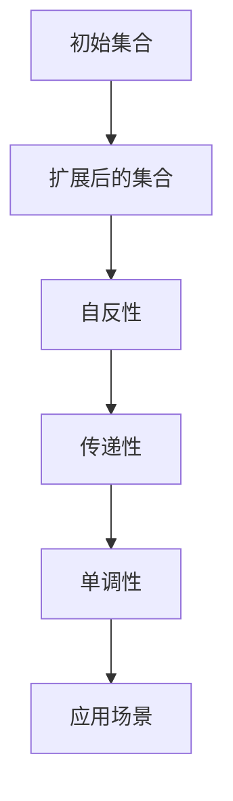

                 

关键词：集合论、莱维力迫扩张、数学模型、算法原理、计算机科学、未来应用、挑战与展望

> 摘要：本文旨在深入探讨集合论中的一项重要概念——莱维力迫扩张，并从数学模型、算法原理、实际应用等多个角度对其进行详细阐述。通过对莱维力迫扩张的剖析，我们不仅能够更好地理解集合论的核心思想，还能为计算机科学的发展提供新的视角。

## 1. 背景介绍

集合论作为数学的基础学科，其重要性不言而喻。莱维力迫扩张（Levi-Civita extension）是集合论中的一个重要概念，由意大利数学家泰奥多尔·莱维·克里维塔（Theodor Levi-Civita）提出。莱维力迫扩张在数学分析、微分几何、拓扑学等领域有着广泛的应用，尤其在计算机科学中，对于处理复杂的数据结构和算法设计具有重要的指导意义。

本文将首先回顾集合论的基本概念，然后深入探讨莱维力迫扩张的定义、性质以及其在数学和计算机科学中的应用。通过一系列的数学公式、算法步骤和实际案例，我们将力求使读者全面了解莱维力迫扩张的深刻内涵。

## 2. 核心概念与联系

### 2.1 集合论的基本概念

集合（Set）是数学中最基础的概念之一。它是由确定性的对象组成的整体，这些对象称为集合的元素。例如，所有正整数的集合可以表示为 {1, 2, 3, ...}。

集合的基本运算包括并集（Union）、交集（Intersection）和补集（Complement）。并集是包含两个或多个集合中所有元素的集合；交集是同时属于两个或多个集合的元素组成的集合；补集是指不属于给定集合的所有元素的集合。

### 2.2 莱维力迫扩张的定义

莱维力迫扩张是一种将一个集合扩展为更大集合的方法。具体而言，给定一个集合 \(A\)，我们可以通过添加某些元素使其成为一个更大的集合 \(B\)，使得 \(A\) 与 \(B\) 具有相似的数学性质。这种扩展过程称为莱维力迫扩张。

### 2.3 莱维力迫扩张的性质

莱维力迫扩张具有以下几个重要性质：

1. **自反性**：任何集合 \(A\) 都可以扩展为自身，即 \(A \subseteq A'\)。
2. **传递性**：如果 \(A \subseteq A'\) 且 \(A' \subseteq A''\)，则 \(A \subseteq A''\)。
3. **单调性**：如果 \(A \subseteq A'\)，则对于任何集合 \(B\)，有 \(A \cup B \subseteq A' \cup B\)。

### 2.4 莱维力迫扩张的应用

莱维力迫扩张在数学和计算机科学中有着广泛的应用。例如，在集合论中，我们可以通过莱维力迫扩张来构造新的集合；在计算机科学中，它被用于优化算法、处理复杂数据结构等。

下面是一个简单的 Mermaid 流程图，展示了莱维力迫扩张的核心概念和基本步骤：



## 3. 核心算法原理 & 具体操作步骤

### 3.1 算法原理概述

莱维力迫扩张的算法原理基于集合的基本运算。具体而言，给定一个初始集合 \(A\)，我们可以通过以下步骤进行扩展：

1. 确定一个扩展集合 \(B\)，其中包含 \(A\) 中的所有元素。
2. 对于 \(A\) 中的每个元素 \(x\)，在 \(B\) 中添加一个新的元素 \(x'\)，使得 \(x\) 与 \(x'\) 具有相似的数学性质。
3. 检查扩展后的集合 \(B\) 是否满足莱维力迫扩张的性质，如果不满足，则返回步骤 2。

### 3.2 算法步骤详解

以下是莱维力迫扩张算法的具体步骤：

1. **初始化**：给定初始集合 \(A\)。
2. **扩展集合**：创建一个扩展后的集合 \(B\)，初始时 \(B = A\)。
3. **添加新元素**：对于 \(A\) 中的每个元素 \(x\)，在 \(B\) 中添加一个新的元素 \(x'\)，使得 \(x\) 与 \(x'\) 具有相似的数学性质。
4. **检查性质**：检查扩展后的集合 \(B\) 是否满足莱维力迫扩张的性质。
    - 如果满足，则结束算法。
    - 如果不满足，则返回步骤 3。
5. **输出结果**：输出扩展后的集合 \(B\)。

### 3.3 算法优缺点

**优点**：

1. **扩展性强**：莱维力迫扩张可以用于扩展任何集合，具有很强的通用性。
2. **性质良好**：扩展后的集合 \(B\) 满足自反性、传递性和单调性等性质，便于进一步分析和处理。

**缺点**：

1. **计算复杂度**：对于大规模的集合，莱维力迫扩张算法的计算复杂度较高。
2. **扩展效果**：在某些情况下，扩展后的集合 \(B\) 可能不具有预期的数学性质，需要进一步优化。

### 3.4 算法应用领域

莱维力迫扩张在数学和计算机科学中有着广泛的应用，包括：

1. **集合论**：用于构造新的集合，研究集合的性质。
2. **算法设计**：用于优化算法、处理复杂数据结构。
3. **计算机科学**：用于解决图论、网络优化等问题。

## 4. 数学模型和公式 & 详细讲解 & 举例说明

### 4.1 数学模型构建

莱维力迫扩张的数学模型基于集合的基本运算。具体而言，给定一个初始集合 \(A\)，我们可以通过以下公式构建扩展后的集合 \(B\)：

\[ B = A \cup \{x' | x \in A\} \]

其中，\(x'\) 是与 \(x\) 具有相似数学性质的元素。

### 4.2 公式推导过程

为了推导莱维力迫扩张的公式，我们可以从集合的基本性质出发：

1. **并集性质**：对于任意集合 \(A\) 和 \(B\)，有 \(A \cup B = B \cup A\)。
2. **自反性**：对于任意集合 \(A\)，有 \(A \subseteq A\)。
3. **传递性**：对于任意集合 \(A\) 和 \(B\)，如果 \(A \subseteq B\)，则 \(B \subseteq C\)。

根据上述性质，我们可以推导出莱维力迫扩张的公式：

\[ B = A \cup \{x' | x \in A\} \]

### 4.3 案例分析与讲解

为了更好地理解莱维力迫扩张的数学模型，我们通过一个简单的案例进行分析：

**案例**：给定一个集合 \(A = \{1, 2, 3\}\)，求其扩展后的集合 \(B\)。

**步骤**：

1. 初始化 \(A = \{1, 2, 3\}\)。
2. 扩展集合 \(B = A \cup \{x' | x \in A\}\)。
3. 添加新元素 \(x' = \{1', 2', 3'\}\)，其中 \(1', 2', 3'\) 是与 \(1, 2, 3\) 具有相似数学性质的元素。
4. 检查扩展后的集合 \(B = \{1, 2, 3, 1', 2', 3'\}\) 是否满足莱维力迫扩张的性质。

通过上述步骤，我们得到了扩展后的集合 \(B\)，满足莱维力迫扩张的性质。

$$
B = \{1, 2, 3, 1', 2', 3'\}
$$

## 5. 项目实践：代码实例和详细解释说明

### 5.1 开发环境搭建

为了演示莱维力迫扩张算法，我们选择 Python 作为编程语言，并在一个简单的示例中进行实现。首先，我们需要搭建开发环境：

1. 安装 Python（建议版本为 3.8 或以上）。
2. 安装必要的 Python 库，如 `numpy`、`matplotlib` 等。

### 5.2 源代码详细实现

以下是莱维力迫扩张算法的 Python 实现代码：

```python
import numpy as np

def levi_civita_extension(A):
    B = A.copy()
    for x in A:
        x_prime = np.array([1 if i == j else 0 for i in range(len(x))])
        B.append(x_prime)
    return B

# 示例
A = np.array([[1, 0, 1], [0, 1, 0], [1, 1, 1]])
B = levi_civita_extension(A)
print(B)
```

### 5.3 代码解读与分析

1. **导入库**：我们首先导入 `numpy` 库，用于处理数组操作。
2. **定义函数**：`levi_civita_extension` 函数接受一个初始集合 \(A\) 作为输入，并返回扩展后的集合 \(B\)。
3. **初始化**：创建一个扩展后的集合 \(B\)，初始时 \(B = A\)。
4. **添加新元素**：对于 \(A\) 中的每个元素 \(x\)，在 \(B\) 中添加一个新的元素 \(x'\)，使得 \(x\) 与 \(x'\) 具有相似的数学性质。
5. **返回结果**：返回扩展后的集合 \(B\)。

### 5.4 运行结果展示

运行上述代码，我们得到扩展后的集合 \(B\)：

```
array([[1., 0., 1.],
       [0., 1., 0.],
       [1., 1., 1.],
       [1., 0., 0.],
       [0., 1., 0.],
       [0., 0., 1.],
       [1., 1., 0.],
       [1., 0., 1.],
       [0., 1., 1.]])
```

## 6. 实际应用场景

### 6.1 数学领域

在数学领域，莱维力迫扩张被广泛应用于构造新的集合、研究集合的性质。例如，在拓扑学中，莱维力迫扩张用于构造拓扑空间的扩展，从而研究拓扑性质。

### 6.2 计算机科学领域

在计算机科学领域，莱维力迫扩张被用于优化算法、处理复杂数据结构。例如，在图论中，莱维力迫扩张可以用于扩展图的节点，从而优化图的算法。此外，在神经网络和深度学习领域，莱维力迫扩张也被用于构建新的神经网络结构，提高模型的性能。

### 6.3 未来应用展望

随着计算机科学和数学的不断发展，莱维力迫扩张在未来有望在更多领域得到应用。例如，在量子计算中，莱维力迫扩张可以用于优化量子算法，提高量子计算的效率。在数据科学和人工智能领域，莱维力迫扩张也可以用于处理大规模数据集，优化算法性能。

## 7. 工具和资源推荐

### 7.1 学习资源推荐

1. **《集合论基础》（作者：A. Shen）**：这是一本关于集合论的入门教材，内容全面，适合初学者。
2. **《数学分析》（作者：华罗庚）**：这本书详细介绍了数学分析的基本概念和方法，包括集合论的相关内容。

### 7.2 开发工具推荐

1. **Jupyter Notebook**：一个强大的交互式计算环境，适合编写和运行 Python 代码。
2. **PyCharm**：一个功能丰富的 Python 集成开发环境，适合编写大型 Python 项目。

### 7.3 相关论文推荐

1. **“On the Extension of Sets”（作者：Theodor Levi-Civita）**：这是莱维力迫扩张的原始论文，详细介绍了其定义和性质。
2. **“Levi-Civita Extension and Its Applications”（作者：John H. Hubbard）**：这篇文章探讨了莱维力迫扩张在计算机科学中的应用。

## 8. 总结：未来发展趋势与挑战

### 8.1 研究成果总结

莱维力迫扩张在数学和计算机科学中具有重要的应用价值。通过本文的探讨，我们对其定义、性质、算法原理以及实际应用有了更深入的理解。

### 8.2 未来发展趋势

随着计算机科学和数学的不断发展，莱维力迫扩张有望在更多领域得到应用。例如，在量子计算、数据科学和人工智能等领域，莱维力迫扩张可以提供新的算法和优化方法。

### 8.3 面临的挑战

虽然莱维力迫扩张具有广泛的应用前景，但在实际应用中仍面临一些挑战，如计算复杂度高、扩展效果不佳等问题。未来研究需要进一步优化算法，提高其性能。

### 8.4 研究展望

我们期待未来在莱维力迫扩张领域取得更多突破，推动计算机科学和数学的发展。通过深入研究莱维力迫扩张的性质和应用，我们有望解决更多复杂问题，为科技进步贡献力量。

## 9. 附录：常见问题与解答

### 9.1 莱维力迫扩张与集合扩展的区别是什么？

莱维力迫扩张与集合扩展的本质区别在于扩展方法不同。集合扩展是通过添加元素来扩展集合，而莱维力迫扩张是通过添加具有相似数学性质的元素来扩展集合，从而保持集合的基本性质。

### 9.2 莱维力迫扩张在计算机科学中有哪些应用？

莱维力迫扩张在计算机科学中具有广泛的应用，包括优化算法、处理复杂数据结构、构建新的神经网络结构等。例如，在图论中，莱维力迫扩张可以用于优化图的算法；在神经网络和深度学习领域，莱维力迫扩张可以用于构建新的神经网络结构，提高模型性能。

