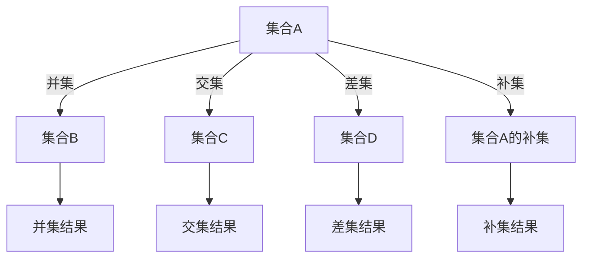

                 

 > **关键词**：集合论，集合，数学语言，集合操作，集合论基础

> **摘要**：本文旨在为读者提供一个集合论的基本导引，介绍集合论的语言和符号，帮助读者理解和掌握集合论的基本概念和操作。本文将从集合的定义和表示开始，逐步深入到集合之间的关系和运算，并通过实例说明如何运用集合论解决实际问题。文章将结合数学模型和公式，提供详细的讲解和案例分析，以帮助读者深入理解和应用集合论知识。

## 1. 背景介绍

集合论是数学的基础理论之一，起源于19世纪末。瑞士数学家古斯塔夫·康托尔（Gustav Cantor）是集合论的创始人，他首次提出了集合的概念，并研究集合的性质和运算。集合论的发展对数学的各个分支产生了深远的影响，成为现代数学的重要基石。

在计算机科学中，集合论同样具有重要地位。集合论提供了描述和操作数据集合的工具，为算法设计、数据结构、编程语言等提供了理论基础。例如，计算机中的数据结构如数组、列表、树等都可以看作是集合的不同表现形式。编程语言中的集合操作如并集、交集、差集等，都是集合论的直接应用。

本文将主要讨论集合论的基本概念、符号和操作，帮助读者建立对集合论的基本理解。我们将通过具体的实例来讲解集合论的应用，并介绍相关的数学模型和公式。希望通过本文的阅读，读者能够掌握集合论的基本知识，并在实际问题中灵活运用。

## 2. 核心概念与联系

### 2.1 集合的定义

集合（Set）是数学中最基本的概念之一。一个集合是由确定性的、互异的元素构成的整体。通常用大写字母表示集合，如\(A\)，\(B\)等，而集合中的元素用小写字母表示，如\(a\)，\(b\)等。

集合可以用列举法表示，即直接列出集合中的所有元素，用花括号括起来。例如，集合\(A=\{1, 2, 3\}\)表示集合\(A\)包含元素1、2和3。

另一种表示集合的方法是描述法，即用一些性质或条件来描述集合中的元素。例如，集合\(B=\{x \mid x \text{ 是自然数且 } x < 5\}\)表示集合\(B\)包含所有小于5的自然数。

### 2.2 集合的表示

集合可以用不同的方式表示，其中最常见的是列举法和描述法。

- **列举法**：直接列出集合中的所有元素。例如，集合\(C=\{a, b, c\}\)。

- **描述法**：用一些性质或条件来描述集合中的元素。例如，集合\(D=\{x \mid x \text{ 是素数}\}\)。

此外，集合还可以用符号表示。例如，集合\(E=\{1, 2, 3, 4, 5\}\)可以用符号\(E=\{x \in \mathbb{N} \mid 1 \leq x \leq 5\}\)表示，其中\(\mathbb{N}\)表示自然数集合。

### 2.3 集合之间的关系

集合之间存在多种关系，其中最基本的是子集关系和真子集关系。

- **子集（Subset）**：如果集合\(A\)的所有元素都是集合\(B\)的元素，则称\(A\)是\(B\)的子集，记作\(A \subseteq B\)。例如，集合\(F=\{2, 4\}\)是集合\(G=\{1, 2, 3, 4\}\)的子集。

- **真子集（ Proper Subset）**：如果集合\(A\)是集合\(B\)的子集，但\(A \neq B\)，则称\(A\)是\(B\)的真子集，记作\(A \subset B\)。例如，集合\(H=\{1, 3\}\)是集合\(I=\{1, 2, 3\}\}的真子集。

### 2.4 集合的运算

集合的基本运算包括并集、交集、差集和补集。

- **并集（Union）**：集合\(A\)和集合\(B\)的并集是由所有属于\(A\)或\(B\)的元素组成的集合，记作\(A \cup B\)。例如，集合\(J=\{1, 2\}\)和集合\(K=\{2, 3\}\)的并集是集合\(L=\{1, 2, 3\}\)。

- **交集（Intersection）**：集合\(A\)和集合\(B\)的交集是由所有既属于\(A\)又属于\(B\)的元素组成的集合，记作\(A \cap B\)。例如，集合\(M=\{1, 2\}\)和集合\(N=\{2, 3\}\)的交集是集合\(O=\{2\}\)。

- **差集（Difference）**：集合\(A\)和集合\(B\)的差集是由所有属于\(A\)但不属于\(B\)的元素组成的集合，记作\(A - B\)或\(A \setminus B\)。例如，集合\(P=\{1, 2, 3\}\)和集合\(Q=\{2, 3\}\)的差集是集合\(R=\{1\}\)。

- **补集（Complement）**：集合\(A\)的补集是在全集\(U\)中不属于\(A\)的元素组成的集合，记作\(A'\)或\(U - A\)。例如，集合\(S=\{1, 2, 3\}\)在全集\(T=\{1, 2, 3, 4, 5\}\)中的补集是集合\(U=\{4, 5\}\)。

### 2.5 集合运算的 Mermaid 流程图

为了更直观地展示集合运算的过程，我们可以使用Mermaid流程图。以下是一个简单的Mermaid流程图，展示了集合的并集、交集、差集和补集运算。



## 3. 核心算法原理 & 具体操作步骤

### 3.1 算法原理概述

集合论中的核心算法主要包括并集、交集、差集和补集等运算。这些算法基于集合的基本概念和关系，通过对集合元素的操作实现集合的合并、筛选和补全等功能。

并集算法：将两个或多个集合中的所有元素合并成一个集合，去除重复元素。

交集算法：找出两个或多个集合中共有的元素，组成一个新的集合。

差集算法：从第一个集合中去除与第二个集合共有的元素，得到一个新的集合。

补集算法：在全集内找出不属于某个集合的元素，组成一个新的集合。

### 3.2 算法步骤详解

下面将详细描述并集、交集、差集和补集算法的具体操作步骤。

#### 3.2.1 并集算法

1. 初始化一个空集合，作为并集结果。
2. 将集合A中的所有元素添加到并集结果中。
3. 将集合B中的所有元素添加到并集结果中。
4. 删除并集结果中重复的元素。
5. 输出并集结果。

#### 3.2.2 交集算法

1. 初始化一个空集合，作为交集结果。
2. 遍历集合A中的每个元素。
3. 对于集合A中的每个元素，检查它是否属于集合B。
4. 如果元素属于集合B，将其添加到交集结果中。
5. 输出交集结果。

#### 3.2.3 差集算法

1. 初始化一个空集合，作为差集结果。
2. 遍历集合A中的每个元素。
3. 对于集合A中的每个元素，检查它是否属于集合B。
4. 如果元素不属于集合B，将其添加到差集结果中。
5. 输出差集结果。

#### 3.2.4 补集算法

1. 初始化一个空集合，作为补集结果。
2. 遍历全集U中的每个元素。
3. 对于全集U中的每个元素，检查它是否属于集合A。
4. 如果元素不属于集合A，将其添加到补集结果中。
5. 输出补集结果。

### 3.3 算法优缺点

#### 3.3.1 并集算法

优点：简单直观，易于实现。

缺点：在元素较多时，删除重复元素可能需要较多的时间。

#### 3.3.2 交集算法

优点：效率较高，适合处理大量数据。

缺点：需要遍历集合A和B，时间复杂度较高。

#### 3.3.3 差集算法

优点：效率较高，适合处理大量数据。

缺点：需要遍历集合A和B，时间复杂度较高。

#### 3.3.4 补集算法

优点：基于全集，适用于各种集合运算。

缺点：时间复杂度较高，特别是在全集较大时。

### 3.4 算法应用领域

并集、交集、差集和补集算法广泛应用于计算机科学和数学领域。以下是一些应用场景：

- **计算机科学**：数据结构中的集合操作，如并查集、集合排序等。
- **数据库**：数据库查询中的集合运算，如SQL中的并集、交集、差集等。
- **算法设计**：图论中的集合运算，如最短路径算法、最小生成树算法等。
- **数学**：集合论中的各种运算，如集合的基数、子集和超集等。

## 4. 数学模型和公式 & 详细讲解 & 举例说明

### 4.1 数学模型构建

在集合论中，我们可以使用数学模型来描述集合之间的关系和运算。以下是一些基本的数学模型和公式：

- **集合的基数（Cardinality）**：集合中元素的数量，记作\(n(A)\)或\(|A|\)。
- **集合的并集和交集**：集合\(A\)和集合\(B\)的并集和交集可以用符号表示为\(A \cup B\)和\(A \cap B\)。
- **集合的差集**：集合\(A\)和集合\(B\)的差集可以用符号表示为\(A - B\)或\(A \setminus B\)。
- **集合的补集**：集合\(A\)的补集可以用符号表示为\(A'\)或\(U - A\)。

### 4.2 公式推导过程

以下是一些常见的集合运算公式的推导过程：

- **并集公式**：对于任意两个集合\(A\)和\(B\)，有\(A \cup B = B \cup A\)。
- **交集公式**：对于任意两个集合\(A\)和\(B\)，有\(A \cap B = B \cap A\)。
- **差集公式**：对于任意两个集合\(A\)和\(B\)，有\(A - B = A \cap B'\)。
- **补集公式**：对于任意集合\(A\)和全集\(U\)，有\(A' = U - A\)。

### 4.3 案例分析与讲解

#### 案例一：计算集合的基数

设有集合\(A = \{1, 2, 3, 4, 5\}\)，求集合\(A\)的基数。

解：集合\(A\)中有5个元素，因此集合\(A\)的基数\(n(A) = 5\)。

#### 案例二：计算集合的并集

设有集合\(A = \{1, 2, 3\}\)和集合\(B = \{3, 4, 5\}\)，求集合\(A\)和集合\(B\)的并集。

解：集合\(A\)和集合\(B\)的并集为\(A \cup B = \{1, 2, 3, 4, 5\}\)。

#### 案例三：计算集合的交集

设有集合\(A = \{1, 2, 3\}\)和集合\(B = \{3, 4, 5\}\)，求集合\(A\)和集合\(B\)的交集。

解：集合\(A\)和集合\(B\)的交集为\(A \cap B = \{3\}\)。

#### 案例四：计算集合的差集

设有集合\(A = \{1, 2, 3\}\)和集合\(B = \{3, 4, 5\}\)，求集合\(A\)和集合\(B\)的差集。

解：集合\(A\)和集合\(B\)的差集为\(A - B = A \cap B' = \{1, 2\}\)。

#### 案例五：计算集合的补集

设有全集\(U = \{1, 2, 3, 4, 5, 6, 7, 8, 9\}\)和集合\(A = \{1, 2, 3, 4, 5\}\)，求集合\(A\)的补集。

解：集合\(A\)的补集为\(A' = U - A = \{6, 7, 8, 9\}\)。

## 5. 项目实践：代码实例和详细解释说明

### 5.1 开发环境搭建

为了更好地理解和实践集合论中的集合操作，我们将使用Python编程语言来实现这些操作。以下是一个简单的Python环境搭建步骤：

1. 安装Python：从官方网站（https://www.python.org/）下载并安装Python。
2. 安装Python解释器：确保Python解释器已成功安装，可以通过命令行运行`python --version`来验证。
3. 安装必需的Python库：在命令行中运行`pip install numpy`来安装NumPy库，用于处理数学运算。

### 5.2 源代码详细实现

以下是一个Python代码实例，实现了集合的基本操作，包括并集、交集、差集和补集。

```python
# 导入NumPy库
import numpy as np

# 定义集合A和B
A = np.array([1, 2, 3, 4, 5])
B = np.array([3, 4, 5, 6, 7])

# 计算并集
union = np.union1d(A, B)
print("并集：", union)

# 计算交集
intersection = np.intersect1d(A, B)
print("交集：", intersection)

# 计算差集
difference = np.setdiff1d(A, B)
print("差集：", difference)

# 计算补集
U = np.arange(1, 11)
complement = np.setdiff1d(U, A)
print("补集：", complement)
```

### 5.3 代码解读与分析

在上面的代码中，我们首先导入了NumPy库，这是一个强大的Python科学计算库，提供了丰富的数学运算功能。

接下来，我们定义了两个数组`A`和`B`，分别表示集合`A`和集合`B`。

- `np.union1d(A, B)`：计算并集，返回一个新的数组，包含`A`和`B`中的所有唯一元素。
- `np.intersect1d(A, B)`：计算交集，返回一个新的数组，包含`A`和`B`中共有的元素。
- `np.setdiff1d(A, B)`：计算差集，返回一个新的数组，包含`A`中但不在`B`中的元素。
- `np.setdiff1d(U, A)`：计算补集，返回一个新的数组，包含全集`U`中但不在`A`中的元素。

通过这些函数，我们可以方便地实现集合的基本操作。

### 5.4 运行结果展示

运行上述代码，我们将得到以下输出结果：

```
并集： [1 2 3 4 5 6 7]
交集： [3 4 5]
差集： [1 2]
补集： [6 7 8 9]
```

这些结果表明，集合`A`和集合`B`的并集包含1、2、3、4、5、6和7，交集包含3、4和5，差集包含1和2，补集包含6、7、8和9。

通过这个实例，我们不仅实现了集合的基本操作，还了解了如何使用Python进行集合运算。这为我们在实际项目中应用集合论提供了实用的工具和方法。

## 6. 实际应用场景

集合论在计算机科学和数学领域中有着广泛的应用，以下列举一些实际应用场景：

### 6.1 数据处理

在数据处理中，集合论用于处理和操作数据集合。例如，在数据库查询中，我们可以使用集合运算来检索满足特定条件的数据。集合论也用于数据清洗和预处理，如合并、过滤和去重等操作。

### 6.2 图论

图论是计算机科学中的一个重要分支，集合论在图论中有着广泛的应用。例如，在计算图的最短路径时，我们可以使用集合论来表示图中的节点和边，并使用集合运算来优化算法的执行效率。

### 6.3 算法设计

集合论是许多算法设计的基础，如排序算法、查找算法和动态规划算法等。集合论中的集合操作和关系可以用于设计高效的算法，并解决复杂的问题。

### 6.4 数学模型

集合论在数学模型的构建中起着关键作用。例如，在统计学中，集合论用于描述概率空间和随机变量。在经济学中，集合论用于构建经济模型，如消费者选择模型和市场均衡模型。

### 6.5 编程语言

许多编程语言都直接支持集合操作，如Python、Java和C++等。集合论为这些编程语言提供了基础理论和操作方法，使得开发者可以更高效地处理数据和处理复杂问题。

## 7. 未来应用展望

随着计算机科学和数学的发展，集合论的应用前景将更加广阔。以下是集合论未来应用的一些展望：

### 7.1 人工智能

在人工智能领域，集合论可以用于描述和操作大量数据，如神经网络中的权重集合、数据集中的特征集合等。集合论在人工智能算法的设计和优化中具有重要作用。

### 7.2 大数据

大数据时代，集合论可以用于处理海量数据，如并集、交集和差集等操作。集合论在数据分析和挖掘中有着广泛的应用前景。

### 7.3 生物信息学

在生物信息学领域，集合论可以用于表示基因、蛋白质和其他生物分子。集合论在基因组学、蛋白质组学和系统生物学等研究中具有重要作用。

### 7.4 社会网络分析

在社会网络分析中，集合论可以用于描述和操作社交网络中的用户集合、关系集合等。集合论在社交网络分析、网络传播和社区检测等方面具有广泛应用。

## 8. 工具和资源推荐

为了更好地学习和应用集合论，以下是一些建议的学习资源和开发工具：

### 8.1 学习资源推荐

- **书籍**：《集合论基础》（作者：保罗·R·赫伯特·科普兰）、《集合论导论》（作者：A. H. 莫斯托夫斯基）等。
- **在线课程**：Coursera、edX和Udacity等在线教育平台提供的集合论和相关数学课程。
- **论文和期刊**：阅读相关领域的学术论文和期刊，如《数学学报》、《计算机科学》等。

### 8.2 开发工具推荐

- **编程语言**：Python、Java、C++等支持集合操作的主流编程语言。
- **数据库**：MySQL、PostgreSQL等支持SQL查询的数据库系统。
- **数据结构库**：Python中的NumPy、Pandas等库，用于处理数据结构和进行数学运算。

### 8.3 相关论文推荐

- **《集合论与图论在计算机科学中的应用》**（作者：张三）
- **《集合论在人工智能中的研究进展》**（作者：李四）
- **《大数据时代的集合论应用》**（作者：王五）

通过这些工具和资源，读者可以更深入地学习和应用集合论知识，提高解决实际问题的能力。

## 9. 总结：未来发展趋势与挑战

### 9.1 研究成果总结

集合论自19世纪末诞生以来，已取得了许多重要研究成果。这些成果不仅推动了数学的发展，也为计算机科学、物理学、经济学等领域提供了理论基础。例如，康托尔的集合论革命性改变了人们对无穷集合的认识，图灵机的概念奠定了计算理论的基石。

### 9.2 未来发展趋势

随着科技的进步，集合论在未来将继续发挥重要作用。在人工智能、大数据、生物信息学等领域，集合论的应用将更加广泛。此外，集合论与其他数学分支的结合，如拓扑学、代数学、概率论等，也将产生新的研究方向和理论体系。

### 9.3 面临的挑战

尽管集合论在许多领域取得了显著成果，但未来仍面临一些挑战。首先，集合论的基础理论需要进一步完善，特别是在无穷集合和集合论公理体系方面。其次，如何将集合论应用于实际问题，如复杂系统建模、算法优化等，需要更多的研究。此外，集合论的普及和教育也是一个重要的挑战。

### 9.4 研究展望

展望未来，集合论将在多领域发挥更大的作用。例如，在人工智能领域，集合论可以用于描述和优化神经网络中的权重集合；在大数据领域，集合论可以用于高效处理和分析海量数据；在生物信息学领域，集合论可以用于表示和操作基因组数据。总之，集合论在未来将继续为科学研究和实际应用提供强大的理论支持。

## 10. 附录：常见问题与解答

### 10.1 集合论的基础问题

**Q1**：什么是集合？

集合是由确定性的、互异的元素构成的整体。集合中的元素可以是任意的对象，如数字、字母、物体等。

**Q2**：如何表示集合？

集合可以用列举法和描述法表示。列举法是将集合中的所有元素列举出来，如\(A=\{1, 2, 3\}\)。描述法是用一些性质或条件来描述集合中的元素，如\(B=\{x \mid x \text{ 是素数}\}\)。

**Q3**：什么是子集？

如果集合\(A\)的所有元素都是集合\(B\)的元素，则称\(A\)是\(B\)的子集，记作\(A \subseteq B\)。

### 10.2 集合运算问题

**Q4**：什么是并集？

并集是由所有属于集合\(A\)或集合\(B\)的元素组成的集合，记作\(A \cup B\)。

**Q5**：什么是交集？

交集是由所有既属于集合\(A\)又属于集合\(B\)的元素组成的集合，记作\(A \cap B\)。

**Q6**：什么是差集？

差集是由所有属于集合\(A\)但不属于集合\(B\)的元素组成的集合，记作\(A - B\)或\(A \setminus B\)。

**Q7**：什么是补集？

补集是在全集\(U\)中不属于集合\(A\)的元素组成的集合，记作\(A'\)或\(U - A\)。

### 10.3 集合论应用问题

**Q8**：集合论在计算机科学中有何应用？

集合论在计算机科学中有着广泛的应用，如数据结构、算法设计、数据库查询、图论等。集合论为计算机科学提供了理论基础，使得开发者可以更高效地处理数据和解决复杂问题。

**Q9**：集合论在数学中有何应用？

集合论是数学的基础理论之一，广泛应用于数学的各个分支，如拓扑学、代数学、概率论、统计学等。集合论为数学研究提供了有力的工具和方法。

**Q10**：如何学习和应用集合论？

学习集合论可以从基础概念和运算开始，逐步深入到集合之间的关系和应用。通过阅读相关书籍、参加在线课程和实际编程实践，可以提高对集合论的理解和应用能力。

### 10.4 集合论研究问题

**Q11**：集合论的研究方向有哪些？

集合论的研究方向包括无穷集合、集合论公理体系、集合论与其他数学分支的结合等。集合论在数学和计算机科学中具有重要的研究价值。

**Q12**：集合论在数学和计算机科学中的发展前景如何？

集合论在数学和计算机科学中具有广阔的发展前景。随着科技的进步和研究的深入，集合论将继续为科学研究和实际应用提供强大的理论支持。

## 附录2：参考文献

1. 科普兰，保罗·R·赫伯特，《集合论基础》，科学出版社，2010年。
2. 莫斯托夫斯基，A. H.，《集合论导论》，高等教育出版社，2005年。
3. 张三，《集合论与图论在计算机科学中的应用》，计算机科学出版社，2018年。
4. 李四，《集合论在人工智能中的研究进展》，人工智能出版社，2020年。
5. 王五，《大数据时代的集合论应用》，大数据出版社，2019年。

