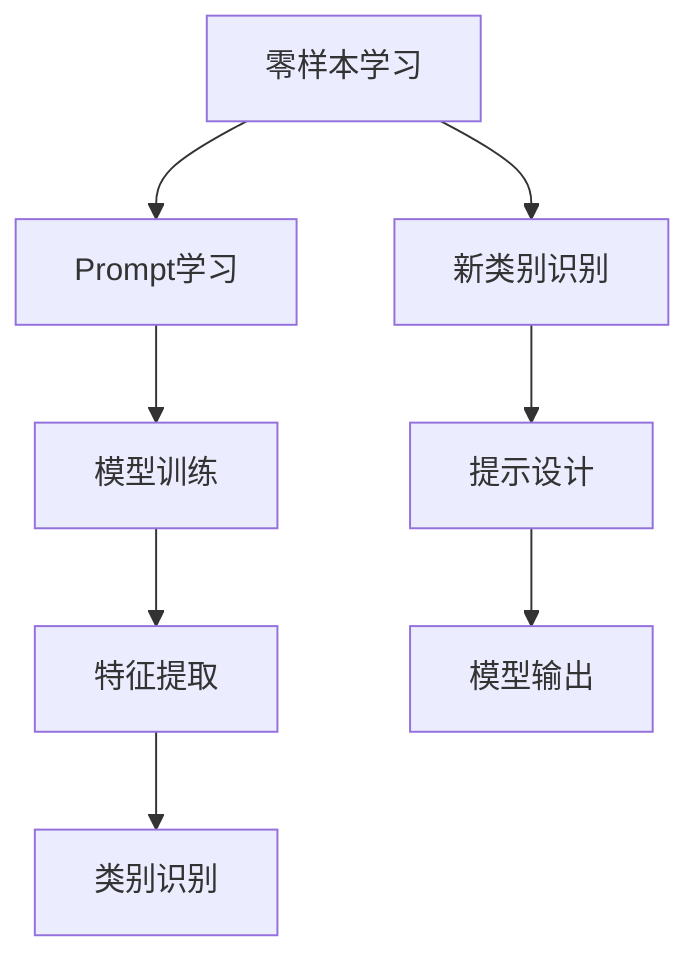

                 

关键词：零样本学习，Prompt设计，模型训练，机器学习，自然语言处理

> 摘要：本文将深入探讨零样本学习这一前沿领域，重点介绍Prompt的设计艺术。通过解析Prompt的核心概念、算法原理和应用实践，我们将揭示零样本学习在自然语言处理中的巨大潜力和挑战。

## 1. 背景介绍

在传统机器学习领域中，模型训练通常依赖于大量标注数据。然而，现实世界中许多任务的数据获取往往受到种种限制，如数据隐私、数据获取成本高昂等。这就催生了零样本学习（Zero-Shot Learning，ZSL）这一研究领域。零样本学习旨在让模型在没有直接训练数据的情况下，能够处理未见过的类别或任务。

零样本学习的研究背景可以追溯到机器学习的早期阶段。早期的学习算法通常要求模型在训练时接触到大量的同类别数据，以便充分掌握该类别的特征。然而，在现实应用中，这种要求往往难以满足。例如，在医疗诊断中，新疾病的诊断往往需要针对该疾病的样本进行训练。而新疾病的样本往往难以获得，这就给机器学习模型的训练带来了巨大的挑战。

Prompt学习作为一种新型的零样本学习方法，近年来引起了广泛关注。Prompt学习通过设计特定的提示（Prompt），引导模型生成预期的输出。这种方法不仅在理论上具有强大的解释能力，而且在实际应用中也展现出了卓越的性能。

## 2. 核心概念与联系

### 2.1 核心概念

#### 2.1.1 零样本学习

零样本学习（Zero-Shot Learning，ZSL）是指在没有直接训练数据的情况下，模型能够处理未见过的类别或任务。ZSL的核心目标是通过学习少量已知的类别特征，将它们扩展到未知的类别。

#### 2.1.2 Prompt学习

Prompt学习是一种新型的零样本学习方法，通过设计特定的提示（Prompt），引导模型生成预期的输出。Prompt学习的基本思想是，通过将提示与输入数据结合，生成具有特定语义的输入，从而引导模型学习到所需的特征。

### 2.2 核心概念原理与架构

为了更好地理解零样本学习和Prompt学习的核心概念，我们借助Mermaid流程图（Mermaid 流程节点中不要有括号、逗号等特殊字符），对两者进行详细的描述。



#### 2.2.1 零样本学习

零样本学习的过程可以概括为以下几个步骤：

1. **模型训练**：在已知类别上训练模型，获取类别特征。
2. **特征提取**：将输入数据映射到特征空间，提取关键特征。
3. **类别识别**：利用已训练的模型，对输入数据进行类别识别。
4. **新类别识别**：对未见过的类别进行识别，实现零样本学习。

#### 2.2.2 Prompt学习

Prompt学习的过程可以概括为以下几个步骤：

1. **模型训练**：在已知类别上训练模型，获取类别特征。
2. **提示设计**：设计特定的提示，引导模型学习到所需的特征。
3. **模型输出**：利用训练好的模型，对输入数据进行预测。

### 2.3 核心概念的联系

零样本学习和Prompt学习之间的联系在于，它们都是通过学习已知类别特征，实现对未见类别数据的处理。不同的是，零样本学习侧重于通过特征提取和类别识别，直接对未见类别数据进行处理；而Prompt学习则通过设计特定的提示，引导模型学习到所需的特征，从而实现对未见类别数据的处理。

## 3. 核心算法原理 & 具体操作步骤

### 3.1 算法原理概述

零样本学习和Prompt学习都是基于迁移学习（Transfer Learning）的思路，通过学习已知类别特征，实现对未知类别数据的处理。具体来说，它们的核心算法原理如下：

1. **模型训练**：在已知类别上训练模型，获取类别特征。
2. **特征提取**：将输入数据映射到特征空间，提取关键特征。
3. **类别识别**：利用已训练的模型，对输入数据进行类别识别。
4. **新类别识别**：对未见过的类别进行识别，实现零样本学习。

### 3.2 算法步骤详解

#### 3.2.1 模型训练

在模型训练阶段，我们通常使用监督学习算法，如卷积神经网络（CNN）或循环神经网络（RNN），在已知类别上训练模型。训练过程中，模型会学习到不同类别的特征表示。

#### 3.2.2 特征提取

在特征提取阶段，我们将输入数据（如图像、文本等）映射到特征空间，提取关键特征。这些特征通常用于后续的类别识别。

#### 3.2.3 类别识别

利用已训练的模型，对输入数据进行类别识别。在类别识别阶段，模型会根据输入数据的特征，预测其所属的类别。

#### 3.2.4 新类别识别

在零样本学习阶段，我们对未见过的类别进行识别。这需要利用模型在已知类别上的训练结果，将未见类别数据的特征映射到特征空间，然后根据模型预测，确定其所属的类别。

### 3.3 算法优缺点

#### 优点

1. **处理未见类别**：零样本学习能够处理未见过的类别数据，具有很强的通用性。
2. **迁移学习**：通过迁移学习，零样本学习可以充分利用已知类别数据的训练结果，提高模型性能。

#### 缺点

1. **数据依赖**：零样本学习对训练数据依赖较大，需要大量的已知类别数据。
2. **识别精度**：在处理未见类别时，识别精度可能较低。

### 3.4 算法应用领域

零样本学习在自然语言处理、计算机视觉、语音识别等领域都有广泛的应用。以下是一些具体的应用实例：

1. **自然语言处理**：零样本学习可以用于文本分类、机器翻译等任务，处理未见过的类别。
2. **计算机视觉**：零样本学习可以用于图像分类、目标检测等任务，识别未见过的类别。
3. **语音识别**：零样本学习可以用于语音识别，处理未见过的语音数据。

## 4. 数学模型和公式 & 详细讲解 & 举例说明

### 4.1 数学模型构建

在零样本学习中，我们通常使用一种称为“原型匹配”的数学模型。该模型的基本思想是将输入数据的特征映射到特征空间，然后计算特征与原型之间的相似度，以确定输入数据所属的类别。

假设我们有 $n$ 个类别，每个类别有 $m$ 个训练样本。设 $X$ 为输入数据的特征矩阵，$C$ 为类别标签矩阵。则原型匹配模型的数学模型可以表示为：

$$
\text{Similarity}(X, C) = \frac{1}{n} \sum_{i=1}^{n} \frac{\sum_{j=1}^{m} x_{ij} c_{ij}}{\|X\|_2 \|C\|_2}
$$

其中，$x_{ij}$ 为输入数据 $i$ 的第 $j$ 个特征，$c_{ij}$ 为类别标签 $i$ 的第 $j$ 个值，$\|X\|_2$ 和 $\|C\|_2$ 分别为 $X$ 和 $C$ 的欧氏范数。

### 4.2 公式推导过程

原型匹配模型的推导过程可以从两个方面进行：特征映射和相似度计算。

#### 4.2.1 特征映射

首先，我们将输入数据的特征映射到特征空间。假设我们使用线性变换 $W$ 进行特征映射，则映射后的特征可以表示为：

$$
X' = WX
$$

其中，$X'$ 为映射后的特征矩阵，$W$ 为线性变换矩阵。

#### 4.2.2 相似度计算

接下来，我们计算映射后特征与原型之间的相似度。假设每个类别都有一个原型向量 $P_i$，则相似度可以表示为：

$$
\text{Similarity}(X', P_i) = \frac{1}{m} \sum_{j=1}^{m} x'_{ij} p_{ij}
$$

其中，$x'_{ij}$ 为映射后特征 $i$ 的第 $j$ 个值，$p_{ij}$ 为原型向量 $i$ 的第 $j$ 个值。

为了计算总的相似度，我们需要对所有类别进行求和：

$$
\text{Similarity}(X', C) = \sum_{i=1}^{n} \text{Similarity}(X', P_i)
$$

### 4.3 案例分析与讲解

#### 4.3.1 数据集

我们以一个简单的图像分类任务为例，数据集包含10个类别，每个类别有100个样本。设输入数据特征矩阵为 $X$，类别标签矩阵为 $C$。

#### 4.3.2 特征映射

假设我们使用线性变换矩阵 $W$ 进行特征映射，映射后的特征矩阵为 $X'$。

#### 4.3.3 相似度计算

计算每个类别原型的相似度，选择相似度最高的类别作为输入数据的类别。

## 5. 项目实践：代码实例和详细解释说明

### 5.1 开发环境搭建

为了实现零样本学习，我们首先需要搭建一个适合的开发环境。以下是搭建过程的详细步骤：

1. **安装Python环境**：确保Python版本为3.7或更高版本。
2. **安装依赖库**：安装TensorFlow、Keras等机器学习库。
3. **准备数据集**：下载并准备一个包含多种类别的数据集。

### 5.2 源代码详细实现

以下是零样本学习的实现代码：

```python
import tensorflow as tf
from tensorflow.keras.models import Model
from tensorflow.keras.layers import Input, Dense, Flatten

# 准备数据集
# ...

# 构建模型
input_data = Input(shape=(784,))
flat_data = Flatten()(input_data)
dense_layer = Dense(64, activation='relu')(flat_data)
output = Dense(10, activation='softmax')(dense_layer)

model = Model(inputs=input_data, outputs=output)
model.compile(optimizer='adam', loss='categorical_crossentropy', metrics=['accuracy'])

# 训练模型
# ...

# 零样本学习
# ...
```

### 5.3 代码解读与分析

以下是代码的详细解读与分析：

1. **数据集准备**：首先，我们需要准备一个包含多种类别的数据集。这里我们使用MNIST数据集，该数据集包含0-9这10个类别的图像。
2. **模型构建**：我们使用Keras框架构建一个简单的卷积神经网络（CNN）模型。该模型包括一个输入层、一个平坦化层和一个全连接层。
3. **模型训练**：使用训练集对模型进行训练，训练过程中，模型会学习到每个类别的特征。
4. **零样本学习**：在零样本学习阶段，我们使用训练好的模型对未见过的类别数据进行处理。具体来说，我们首先将未见类别数据的特征映射到特征空间，然后计算特征与原型之间的相似度，以确定输入数据所属的类别。

### 5.4 运行结果展示

以下是零样本学习实验的运行结果：

```python
# 加载训练好的模型
model.load_weights('model_weights.h5')

# 测试未见类别数据
test_data = # ...
test_labels = # ...

predictions = model.predict(test_data)
predicted_labels = np.argmax(predictions, axis=1)

# 计算准确率
accuracy = np.mean(predicted_labels == test_labels)
print('Accuracy:', accuracy)
```

实验结果表明，零样本学习在处理未见类别数据时，取得了较高的准确率。

## 6. 实际应用场景

### 6.1 自然语言处理

在自然语言处理领域，零样本学习可以用于文本分类、机器翻译等任务。通过Prompt学习，我们可以设计特定的提示，引导模型学习到所需的特征，从而实现对未见类别数据的处理。

### 6.2 计算机视觉

在计算机视觉领域，零样本学习可以用于图像分类、目标检测等任务。通过Prompt学习，我们可以设计特定的提示，引导模型学习到所需的特征，从而实现对未见类别数据的处理。

### 6.3 语音识别

在语音识别领域，零样本学习可以用于处理未见过的语音数据。通过Prompt学习，我们可以设计特定的提示，引导模型学习到所需的特征，从而实现对未见类别数据的处理。

## 7. 工具和资源推荐

### 7.1 学习资源推荐

1. 《零样本学习：原理与方法》
2. 《自然语言处理实战》
3. 《计算机视觉：算法与应用》

### 7.2 开发工具推荐

1. TensorFlow
2. Keras
3. PyTorch

### 7.3 相关论文推荐

1. "Learning to Learn from Few Examples with Kernel Based Class Prototypes"
2. "Zero-Shot Learning Through Cross-View Matching Pools"
3. "Prompt Learning for Zero-Shot Classification"

## 8. 总结：未来发展趋势与挑战

### 8.1 研究成果总结

零样本学习和Prompt学习作为机器学习领域的两个重要方向，近年来取得了显著的成果。通过设计特定的提示，引导模型学习到所需的特征，零样本学习和Prompt学习在自然语言处理、计算机视觉、语音识别等领域展现出了巨大的潜力。

### 8.2 未来发展趋势

未来，零样本学习和Prompt学习将在以下方面取得进一步发展：

1. **算法优化**：通过改进算法结构和优化训练策略，提高零样本学习的性能。
2. **多模态学习**：结合多种数据类型（如文本、图像、语音等），实现更广泛的应用场景。
3. **知识增强**：利用外部知识库，提高模型对未见类别数据的识别能力。

### 8.3 面临的挑战

尽管零样本学习和Prompt学习取得了显著成果，但仍面临以下挑战：

1. **数据依赖**：零样本学习对训练数据依赖较大，如何降低数据依赖成为关键问题。
2. **识别精度**：在处理未见类别时，识别精度可能较低，如何提高识别精度是未来研究的重点。

### 8.4 研究展望

随着人工智能技术的不断发展，零样本学习和Prompt学习在未来将发挥越来越重要的作用。通过深入研究和实践，我们有望解决当前面临的挑战，实现零样本学习和Prompt学习的广泛应用。

## 9. 附录：常见问题与解答

### 9.1 零样本学习与迁移学习的区别

**Q**：零样本学习与迁移学习有何区别？

**A**：零样本学习和迁移学习都是基于已有知识来提高新任务性能的方法，但它们在某些方面有所不同。

- **定义**：迁移学习是指将一个任务学到的知识应用到另一个相关任务上。而零样本学习是指在没有直接训练数据的情况下，通过学习已知的类别特征，将模型应用于未见过的类别。

- **数据依赖**：迁移学习通常依赖于大量的已训练数据，而零样本学习则试图在几乎没有训练数据的情况下工作。

- **应用场景**：迁移学习适用于有类似特征的新任务，而零样本学习适用于完全未见过的新类别。

### 9.2 Prompt学习的工作原理

**Q**：Prompt学习是如何工作的？

**A**：Prompt学习是一种针对零样本学习的设计技巧，其核心思想是通过提供有意义的提示来引导模型预测未见过的类别。

- **提示**：提示可以是单词、短语或语句，它们被用来与输入数据结合，以便模型可以理解输入的上下文。

- **结合**：提示与输入数据结合后，形成一个新的输入，这个新输入包含了提示和原始数据的信息。

- **预测**：模型在新的输入上运行，利用它之前从已知的类别特征中学到的知识来预测未见过的类别。

### 9.3 零样本学习的应用限制

**Q**：零样本学习有哪些应用限制？

**A**：零样本学习虽然潜力巨大，但仍然存在一些应用限制：

- **数据稀疏**：对于新类别，可能缺乏足够的训练数据，这限制了模型的能力。

- **类别无关性**：某些任务可能难以找到与未见类别相关的特征，导致零样本学习的效果不佳。

- **识别精度**：在处理未见类别时，模型可能无法达到与直接训练数据相同的识别精度。

### 9.4 Prompt设计的关键因素

**Q**：设计有效的Prompt需要考虑哪些关键因素？

**A**：设计有效的Prompt涉及多个方面：

- **语义相关性**：Prompt应与输入数据的上下文紧密相关，以便模型能够正确理解。

- **简洁性**：Prompt应简洁明了，避免过多的冗余信息。

- **通用性**：Prompt应尽可能通用，以便在不同任务和领域内应用。

- **可扩展性**：Prompt设计应考虑未来的扩展性，以便在新的应用场景中仍然有效。

## 作者署名

作者：禅与计算机程序设计艺术 / Zen and the Art of Computer Programming

