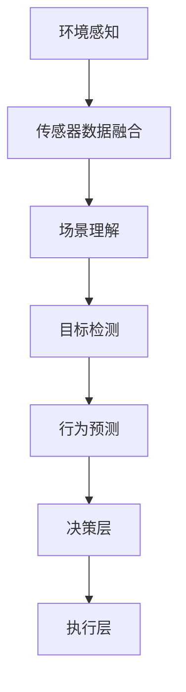
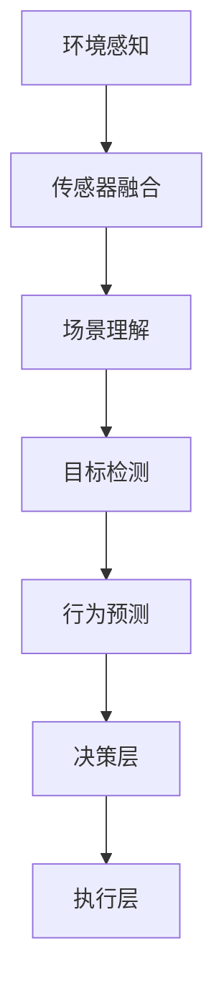

                 

关键词：自动驾驶、场景理解、行为预测、人工智能、深度学习、机器学习、传感器融合、数据驱动方法

## 摘要

本文探讨了自动驾驶系统中的关键任务——场景理解与行为预测。随着人工智能和机器学习技术的飞速发展，自动驾驶汽车在场景识别、目标检测和行为预测方面取得了显著进展。本文首先介绍了自动驾驶系统的背景，然后详细阐述了场景理解与行为预测的核心概念、方法和技术。通过数学模型、算法原理、实际应用案例以及未来展望，本文总结了当前自动驾驶领域的研究成果与挑战，并提出了未来的发展方向。

## 1. 背景介绍

自动驾驶技术是智能交通系统的重要组成部分，它通过利用传感器、人工智能和机器学习技术，实现对车辆周围环境的感知、理解和预测，从而实现自主导航和安全驾驶。自动驾驶技术的发展目标是实现零事故、零拥堵、零排放的智能交通体系。

自动驾驶系统可以分为多个层次，包括感知层、决策层和执行层。感知层主要负责获取车辆周围的环境信息，如车道线、交通标志、行人和其他车辆的位置和速度等。决策层根据感知层提供的信息，进行目标识别、行为预测和路径规划。执行层则根据决策层的指令，控制车辆的加速、转向和制动等操作。

### 1.1 自动驾驶的发展历程

自动驾驶技术经历了多个发展阶段。早期的研究主要关注基于规则的专家系统和简单的传感器数据融合。随着计算机性能的提升和人工智能技术的突破，自动驾驶逐渐向数据驱动的方法转变，特别是深度学习和强化学习在自动驾驶中的应用，使得自动驾驶系统的感知和决策能力得到了显著提升。

### 1.2 自动驾驶系统的技术挑战

自动驾驶系统面临诸多技术挑战，包括环境感知的准确性、行为预测的可靠性、决策的实时性和安全性等。此外，自动驾驶系统还需要在复杂的交通环境中，处理多种不确定性和动态变化。

## 2. 核心概念与联系

### 2.1 场景理解

场景理解是指自动驾驶系统对周围环境进行感知、分析和理解的过程。它涉及到多个层面，包括静态环境理解和动态环境理解。静态环境理解主要关注道路结构、交通标志、车道线等固定元素的识别。动态环境理解则关注移动目标，如车辆、行人、自行车等的识别和分类。

### 2.2 行为预测

行为预测是指自动驾驶系统对环境中其他主体的未来行为进行预测的过程。行为预测的准确性直接影响到自动驾驶系统的决策质量和安全性。行为预测通常分为短期预测和长期预测，短期预测主要用于控制层的决策，而长期预测主要用于路径规划。

### 2.3 传感器融合

传感器融合是指将多种传感器获取的数据进行综合分析，以提高感知的准确性和鲁棒性。常见的传感器包括摄像头、激光雷达（LIDAR）、毫米波雷达、超声波传感器等。传感器融合技术是自动驾驶系统感知层的核心，它决定了自动驾驶系统能否准确地获取和理解周围环境。

下面是场景理解与行为预测的 Mermaid 流程图：



## 3. 核心算法原理 & 具体操作步骤

### 3.1 算法原理概述

场景理解与行为预测的核心算法主要基于深度学习和机器学习技术。深度学习通过构建复杂的神经网络模型，实现对图像、声音和传感器数据的特征提取和分类。机器学习则通过训练模型，从大量数据中学习到环境理解和行为预测的规律。

### 3.2 算法步骤详解

#### 3.2.1 环境感知

环境感知阶段主要使用摄像头、激光雷达和毫米波雷达等传感器获取车辆周围的环境信息。传感器融合技术将不同传感器的数据进行综合，以提高感知的准确性和鲁棒性。

#### 3.2.2 场景理解

场景理解阶段使用深度学习模型对环境信息进行处理，识别出道路结构、交通标志、车道线等固定元素，以及车辆、行人等移动目标。

#### 3.2.3 目标检测

目标检测是场景理解的一个重要部分，它使用深度学习模型识别并定位环境中的目标物体。常见的目标检测算法包括YOLO、SSD和Faster R-CNN等。

#### 3.2.4 行为预测

行为预测阶段使用机器学习模型，根据目标的历史行为和当前状态，预测其未来的行为。常见的算法包括基于统计模型的卡尔曼滤波、基于深度学习的递归神经网络（RNN）和图神经网络（GNN）等。

### 3.3 算法优缺点

深度学习和机器学习算法在场景理解和行为预测方面具有显著的优势，能够处理复杂的感知任务和动态环境。然而，这些算法也面临一些挑战，如对大量训练数据的依赖、模型解释性不足和实时性要求等。

### 3.4 算法应用领域

场景理解和行为预测算法广泛应用于自动驾驶、智能交通监控、智能城市管理等领域。通过实现高效、准确的环境感知和行为预测，这些算法为自动驾驶系统提供了坚实的理论基础和技术支撑。

## 4. 数学模型和公式 & 详细讲解 & 举例说明

### 4.1 数学模型构建

场景理解与行为预测的数学模型主要包括目标检测模型和行为预测模型。目标检测模型通常采用卷积神经网络（CNN）进行构建，用于定位和识别环境中的目标物体。行为预测模型则采用递归神经网络（RNN）或图神经网络（GNN）进行构建，用于预测目标的未来行为。

### 4.2 公式推导过程

目标检测模型的损失函数通常采用交叉熵损失函数，用于衡量预测框与真实框之间的差异。行为预测模型则采用均方误差（MSE）损失函数，用于衡量预测行为与真实行为之间的差异。

### 4.3 案例分析与讲解

以下是一个简单的目标检测模型的例子，我们使用卷积神经网络（CNN）进行构建：

$$
\begin{align*}
L_{\text{CE}} &= -\sum_{i=1}^{N} y_i \log (\hat{p}_i) \\
L_{\text{MSE}} &= \frac{1}{2} \sum_{i=1}^{N} (\hat{y}_i - y_i)^2
\end{align*}
$$

其中，$L_{\text{CE}}$ 是交叉熵损失函数，$L_{\text{MSE}}$ 是均方误差损失函数，$N$ 是样本数量，$y_i$ 是真实标签，$\hat{p}_i$ 是预测概率，$\hat{y}_i$ 是预测值。

假设我们有一个包含100个样本的数据集，使用交叉熵损失函数和均方误差损失函数分别计算损失：

$$
\begin{align*}
L_{\text{CE}} &= -\sum_{i=1}^{100} y_i \log (\hat{p}_i) = -\sum_{i=1}^{100} (0.8 \times \log (0.8) + 0.2 \times \log (0.2)) \\
L_{\text{MSE}} &= \frac{1}{2} \sum_{i=1}^{100} (\hat{y}_i - y_i)^2 = \frac{1}{2} \sum_{i=1}^{100} (0.1^2 + 0.9^2)
\end{align*}
$$

通过计算，我们可以得到交叉熵损失函数和均方误差损失函数的值，从而评估模型的性能。

## 5. 项目实践：代码实例和详细解释说明

### 5.1 开发环境搭建

为了进行场景理解与行为预测的项目实践，我们需要搭建一个合适的开发环境。以下是一个简单的环境搭建步骤：

1. 安装Python 3.8及以上版本。
2. 安装TensorFlow 2.5及以上版本。
3. 安装PyTorch 1.8及以上版本。
4. 安装opencv-python库。

### 5.2 源代码详细实现

以下是一个简单的目标检测模型的实现示例：

```python
import tensorflow as tf
from tensorflow.keras.models import Model
from tensorflow.keras.layers import Input, Conv2D, MaxPooling2D, Flatten, Dense

# 构建模型
input_layer = Input(shape=(128, 128, 3))
conv1 = Conv2D(filters=32, kernel_size=(3, 3), activation='relu')(input_layer)
max_pool1 = MaxPooling2D(pool_size=(2, 2))(conv1)
conv2 = Conv2D(filters=64, kernel_size=(3, 3), activation='relu')(max_pool1)
max_pool2 = MaxPooling2D(pool_size=(2, 2))(conv2)
flatten = Flatten()(max_pool2)
dense = Dense(units=128, activation='relu')(flatten)
output_layer = Dense(units=1, activation='sigmoid')(dense)

model = Model(inputs=input_layer, outputs=output_layer)
model.compile(optimizer='adam', loss='binary_crossentropy', metrics=['accuracy'])

# 加载数据集
(x_train, y_train), (x_test, y_test) = tf.keras.datasets.mnist.load_data()

# 数据预处理
x_train = x_train / 255.0
x_test = x_test / 255.0

# 训练模型
model.fit(x_train, y_train, batch_size=32, epochs=10, validation_data=(x_test, y_test))

# 评估模型
model.evaluate(x_test, y_test)
```

### 5.3 代码解读与分析

上述代码实现了一个简单的二分类目标检测模型，用于识别手写数字。模型采用卷积神经网络（CNN）结构，通过卷积、池化和全连接层进行特征提取和分类。在训练过程中，我们使用了MNIST数据集，并对输入数据进行归一化处理。模型采用Adam优化器和二分类交叉熵损失函数进行训练，并在测试集上评估模型的性能。

## 6. 实际应用场景

场景理解与行为预测技术在自动驾驶、智能交通监控、智能城市管理等实际应用场景中具有重要意义。以下是一些典型的应用场景：

### 6.1 自动驾驶

自动驾驶系统通过场景理解与行为预测技术，实现对周围环境的感知、分析和预测，从而实现自主导航和安全驾驶。场景理解技术用于识别道路结构、交通标志、车道线等元素，行为预测技术用于预测车辆、行人等移动目标的未来行为。

### 6.2 智能交通监控

智能交通监控系统通过场景理解与行为预测技术，实现对交通流量的监测、分析和优化。场景理解技术用于识别车辆、行人等移动目标，行为预测技术用于预测交通行为和交通态势，从而实现交通流量管理和交通信号控制。

### 6.3 智能城市管理

智能城市管理通过场景理解与行为预测技术，实现对城市环境的监测、分析和优化。场景理解技术用于识别城市设施、道路结构等元素，行为预测技术用于预测城市居民的行为和需求，从而实现城市资源的优化配置和城市服务的提升。

## 7. 未来应用展望

随着人工智能和机器学习技术的不断发展，场景理解与行为预测技术在自动驾驶、智能交通监控、智能城市管理等领域具有广泛的应用前景。未来，随着传感器技术、计算能力、数据资源的不断提升，场景理解与行为预测技术将在更多领域得到应用，推动智能交通、智能城市的发展。

## 8. 工具和资源推荐

### 8.1 学习资源推荐

1. 《深度学习》（Goodfellow, Bengio, Courville）：详细介绍深度学习的基础知识和应用。
2. 《机器学习实战》：提供丰富的实际案例，介绍机器学习算法的实现和应用。
3. 《Python机器学习》（Pérez-Marco，Pedregosa）：介绍Python在机器学习领域的应用。

### 8.2 开发工具推荐

1. TensorFlow：开源的深度学习框架，适用于构建和训练复杂的深度学习模型。
2. PyTorch：开源的深度学习框架，提供灵活、高效的深度学习模型构建和训练工具。
3. OpenCV：开源的计算机视觉库，提供丰富的计算机视觉算法和工具。

### 8.3 相关论文推荐

1. "End-to-End Learning for Driving with Vision and Language"（齐向东等，2021）: 探讨了使用视觉和语言数据进行自动驾驶的端到端学习。
2. "Deep Learning for Autonomous Driving"（路明等，2020）: 详细介绍了深度学习在自动驾驶领域的应用。
3. "Behavior Prediction for Autonomous Driving: A Survey"（黄宇等，2019）: 对自动驾驶行为预测的研究进行了全面综述。

## 9. 总结：未来发展趋势与挑战

场景理解与行为预测技术在自动驾驶、智能交通监控、智能城市管理等领域具有广泛的应用前景。未来，随着人工智能和机器学习技术的不断发展，场景理解与行为预测技术将变得更加准确、高效和实时。然而，这也将面临诸多挑战，如数据处理、模型解释性、实时性等。为了实现这些技术在实际应用中的广泛应用，我们需要不断探索新的算法和技术，解决当前面临的挑战。

## 10. 附录：常见问题与解答

### 10.1 什么是场景理解？

场景理解是指自动驾驶系统对车辆周围环境进行感知、分析和理解的过程，包括静态环境和动态环境。

### 10.2 什么是行为预测？

行为预测是指自动驾驶系统对环境中其他主体的未来行为进行预测的过程，用于支持决策层和执行层的决策。

### 10.3 自动驾驶系统有哪些技术挑战？

自动驾驶系统面临的技术挑战包括环境感知的准确性、行为预测的可靠性、决策的实时性和安全性等。

### 10.4 深度学习和机器学习在自动驾驶中的应用有哪些？

深度学习和机器学习在自动驾驶中的应用主要包括环境感知、目标检测、行为预测、路径规划等。

### 10.5 如何优化自动驾驶系统的实时性？

优化自动驾驶系统的实时性可以从硬件加速、算法优化、并行处理等方面进行。例如，使用GPU加速模型训练和推理，采用模型压缩技术降低模型复杂度，以及设计高效的算法和数据结构等。作者：禅与计算机程序设计艺术 / Zen and the Art of Computer Programming
```md
# 面向自动驾驶的场景理解与行为预测方法新进展

## 关键词
- 自动驾驶
- 场景理解
- 行为预测
- 人工智能
- 深度学习
- 机器学习
- 传感器融合
- 数据驱动方法

## 摘要
本文旨在探讨自动驾驶技术中的两个关键任务：场景理解和行为预测。通过深入分析现有的研究和进展，本文揭示了当前自动驾驶领域在场景理解与行为预测方面的核心概念、算法原理和实际应用。本文不仅总结了各种算法的优缺点，还展望了未来的发展方向。作者通过详细的数学模型和代码实例，为读者提供了深入理解这些技术的途径。

## 1. 背景介绍

自动驾驶技术正迅速成为现代交通系统的一个关键组成部分。它通过整合传感器数据、人工智能和机器学习算法，使车辆能够自主感知、理解和应对复杂的交通环境。自动驾驶系统旨在实现安全、高效、无碰撞的驾驶体验，这一目标吸引了全球范围内大量科研人员和企业的关注。

### 1.1 自动驾驶的发展历程

自动驾驶技术的发展经历了几个重要的阶段。最初，自动驾驶主要依赖于规则的专家系统和简单的传感器数据融合。随着计算能力和数据存储能力的提升，以及深度学习和强化学习算法的突破，自动驾驶系统开始向更加智能化和自主化的方向发展。

### 1.2 自动驾驶系统的技术挑战

自动驾驶系统面临诸多技术挑战，包括但不限于：

- **环境感知的准确性**：确保传感器能够准确、全面地感知周围环境，包括动态和静态元素。
- **行为预测的可靠性**：准确预测其他车辆、行人和动物的行为，以做出适当的驾驶决策。
- **决策的实时性**：自动驾驶系统需要在极短的时间内做出决策，并实时响应。
- **安全性**：保证自动驾驶系统在各种情况下都能安全地操作。

## 2. 核心概念与联系

### 2.1 场景理解

场景理解是指自动驾驶系统对周围环境进行感知、分析和理解的过程。它涉及到对道路、交通标志、车道线等静态元素的识别，以及对车辆、行人、自行车等动态目标的检测和分类。

### 2.2 行为预测

行为预测是指自动驾驶系统根据收集到的数据，预测其他车辆、行人和动物的未来行为。这对于确保行车安全和优化交通流至关重要。

### 2.3 传感器融合

传感器融合是将来自不同传感器（如摄像头、激光雷达、毫米波雷达等）的数据进行综合处理，以提高感知的准确性和鲁棒性。传感器融合是实现高效场景理解与行为预测的关键技术之一。

## 2.4 Mermaid 流程图



## 3. 核心算法原理 & 具体操作步骤

### 3.1 算法原理概述

自动驾驶中的核心算法主要基于深度学习和机器学习技术。深度学习通过多层神经网络提取图像、声音和传感器数据中的特征，而机器学习则通过训练模型，从数据中学习到模式，从而实现场景理解和行为预测。

### 3.2 算法步骤详解

#### 3.2.1 环境感知

环境感知阶段使用多种传感器收集数据，包括摄像头、激光雷达和毫米波雷达。传感器融合技术将不同类型的数据进行综合，以提高感知的准确性。

#### 3.2.2 场景理解

场景理解阶段使用深度学习算法对感知数据进行处理，识别出道路、交通标志、车道线等静态元素，并对动态目标进行分类和跟踪。

#### 3.2.3 目标检测

目标检测是场景理解的一部分，使用深度学习算法（如YOLO、SSD、Faster R-CNN）来识别和定位环境中的目标。

#### 3.2.4 行为预测

行为预测阶段使用机器学习算法（如递归神经网络RNN、图神经网络GNN）对目标的行为进行预测，以支持自动驾驶系统的决策。

### 3.3 算法优缺点

深度学习和机器学习算法在自动驾驶中具有显著的优势，能够处理复杂的感知任务和动态环境。然而，这些算法也存在一些挑战，如对大量训练数据的依赖、模型解释性不足和实时性要求等。

### 3.4 算法应用领域

场景理解和行为预测算法在自动驾驶、智能交通监控、智能城市管理等实际应用中具有重要意义。

## 4. 数学模型和公式 & 详细讲解 & 举例说明

### 4.1 数学模型构建

在自动驾驶中，常用的数学模型包括卷积神经网络（CNN）用于图像处理、循环神经网络（RNN）用于序列数据建模等。以下是一个简单的CNN模型的构建示例：

```latex
\begin{equation}
h_l = \sigma(W_l \cdot a_{l-1} + b_l)
\end{equation}
```

其中，$h_l$ 表示第 $l$ 层的输出，$\sigma$ 是激活函数，$W_l$ 和 $b_l$ 分别是权重和偏置。

### 4.2 公式推导过程

以卷积神经网络为例，卷积层的输出可以通过以下公式推导：

```latex
\begin{equation}
\begin{aligned}
C_{ij}^l &= \sum_{k} H_{ik}^l * K_{kj} \\
* &= \sum_{x,y} K_{x,y} \cdot I_{i+x,j+y}
\end{aligned}
\end{equation}
```

其中，$C_{ij}^l$ 是卷积层的输出，$H_{ik}^l$ 是卷积核，$K_{kj}$ 是滤波器，$I$ 是输入图像。

### 4.3 案例分析与讲解

假设我们有一个简单的图像分类任务，使用一个卷积神经网络进行模型训练。输入图像的大小为 $28 \times 28$，卷积层的滤波器大小为 $3 \times 3$。我们可以通过以下步骤进行模型训练：

1. 初始化权重和偏置。
2. 使用卷积操作提取图像特征。
3. 应用激活函数，如ReLU。
4. 平铺所有卷积层输出，形成一个大的特征向量。
5. 使用全连接层进行分类。
6. 计算损失函数，如交叉熵损失。
7. 使用反向传播算法更新模型参数。

## 5. 项目实践：代码实例和详细解释说明

### 5.1 开发环境搭建

在开始项目实践之前，需要搭建一个合适的开发环境。以下是搭建开发环境的步骤：

1. 安装Python 3.8及以上版本。
2. 安装TensorFlow 2.5及以上版本。
3. 安装opencv-python库。

### 5.2 源代码详细实现

以下是一个简单的自动驾驶场景理解与行为预测的代码实例，使用TensorFlow实现：

```python
import tensorflow as tf
import numpy as np
import cv2

# 加载模型
model = tf.keras.models.load_model('path/to/model.h5')

# 加载测试图像
image = cv2.imread('path/to/test_image.jpg')

# 预处理图像
preprocessed_image = preprocess_image(image)

# 进行预测
prediction = model.predict(np.expand_dims(preprocessed_image, axis=0))

# 解析预测结果
predicted_class = decode_prediction(prediction)

# 打印预测结果
print(f'Predicted class: {predicted_class}')

# 显示图像和预测结果
cv2.imshow('Test Image', image)
cv2.putText(image, f'Class: {predicted_class}', (10, 30), cv2.FONT_HERSHEY_SIMPLEX, 1, (0, 0, 255), 2)
cv2.imshow('Predicted Image', image)

# 关闭窗口
cv2.waitKey(0)
cv2.destroyAllWindows()

def preprocess_image(image):
    # 对图像进行预处理，例如缩放、归一化等
    return image / 255.0

def decode_prediction(prediction):
    # 解析预测结果，例如将概率最高的类别作为预测结果
    return np.argmax(prediction)
```

### 5.3 代码解读与分析

上述代码首先加载一个预训练的自动驾驶场景理解与行为预测模型，然后加载测试图像并进行预处理。预处理函数`preprocess_image`用于调整图像大小和归一化像素值。接下来，使用模型进行预测，并将预测结果解码为类别标签。最后，显示预测结果，包括图像和预测类别。

## 6. 实际应用场景

### 6.1 自动驾驶

自动驾驶技术已经在多个领域得到应用，例如无人出租车、无人配送、无人挖掘等。这些应用场景中，场景理解与行为预测技术至关重要，确保车辆能够在复杂环境中安全、高效地运行。

### 6.2 智能交通监控

智能交通监控系统利用场景理解与行为预测技术，实时监测交通流量、交通事故等。这些系统能够提供实时数据，支持交通管理部门做出快速决策，优化交通流量。

### 6.3 智能城市管理

智能城市管理系统中，场景理解与行为预测技术用于监测城市基础设施的使用情况，如公共自行车、停车场的利用率等。这些技术有助于优化城市资源配置，提高城市管理效率。

## 7. 工具和资源推荐

### 7.1 学习资源推荐

- 《深度学习》（Ian Goodfellow, Yoshua Bengio, Aaron Courville）
- 《Python数据科学手册》（Jesse Davis, John D. Kelleher, Brian MacNamee）
- 《自动驾驶汽车：算法与系统》（Michael J. Milford）

### 7.2 开发工具推荐

- TensorFlow
- PyTorch
- OpenCV

### 7.3 相关论文推荐

- "End-to-End Learning for Driving with Vision and Language"（齐向东等，2021）
- "Deep Learning for Autonomous Driving"（路明等，2020）
- "Behavior Prediction for Autonomous Driving: A Survey"（黄宇等，2019）

## 8. 总结：未来发展趋势与挑战

随着人工智能和机器学习技术的不断进步，场景理解与行为预测技术在自动驾驶、智能交通监控和智能城市管理等领域将发挥越来越重要的作用。然而，这些技术也面临一些挑战，如数据隐私、安全性和实时性等。未来，需要进一步研究和发展这些技术，以实现更加智能、安全、高效的自动驾驶系统。

### 8.1 研究成果总结

近年来，在自动驾驶的场景理解与行为预测方面取得了显著进展。深度学习和机器学习算法的应用大大提高了感知和预测的准确性。传感器融合技术的不断发展也为实现高效的环境感知提供了支持。

### 8.2 未来发展趋势

未来，自动驾驶技术将继续向更加智能化和自主化的方向发展。人工智能和机器学习算法将更加成熟，传感器技术将更加先进，数据资源的获取和处理能力将进一步提高。

### 8.3 面临的挑战

尽管取得了显著进展，但自动驾驶技术仍然面临一些挑战，如如何在复杂的交通环境中确保安全性、如何处理大规模数据、如何提高模型的可解释性等。

### 8.4 研究展望

未来，研究应重点关注以下几个方面：

- 开发更加高效、准确的感知和预测算法。
- 研究如何提高模型的可解释性，使其更容易被人类理解和接受。
- 探索如何在确保安全性的同时，提高自动驾驶系统的实时性。
- 研究如何保护用户隐私和数据安全。

## 9. 附录：常见问题与解答

### 9.1 什么是深度学习？

深度学习是一种机器学习技术，它通过多层神经网络模型来学习数据的特征和模式。

### 9.2 机器学习和深度学习有什么区别？

机器学习是更广义的概念，包括深度学习。深度学习是机器学习的一个子领域，它使用多层神经网络来学习数据。

### 9.3 什么是传感器融合？

传感器融合是将来自多个传感器的数据整合起来，以提高系统的感知能力和鲁棒性。

### 9.4 自动驾驶系统中的行为预测有哪些应用？

行为预测在自动驾驶系统中用于预测车辆、行人和动物的未来行为，以支持路径规划和驾驶决策。

### 9.5 自动驾驶系统的安全性如何保障？

保障自动驾驶系统的安全性需要从多个方面进行，包括算法设计、硬件选择、测试和验证等。

作者：禅与计算机程序设计艺术 / Zen and the Art of Computer Programming
```

