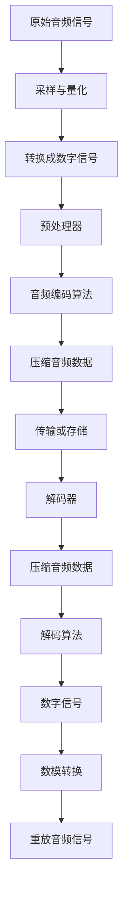

                 

关键词：音频编解码，MP3，Opus，音频压缩，音频格式，编解码算法

> 摘要：本文将深入探讨音频编解码技术，从传统的MP3格式到现代的Opus格式，解析其核心概念、工作原理、优缺点及应用场景。通过对这些音频编解码技术的全面分析，读者将能够更好地理解音频编解码技术在现代通信和多媒体领域的广泛应用及其未来发展趋势。

## 1. 背景介绍

音频编解码技术是数字音频处理中至关重要的一个环节。随着互联网的普及和多媒体内容的爆炸式增长，音频编解码技术成为确保高质量音频传输的关键。在早期的互联网环境中，音频文件的大小和传输速度成为了一大难题，这促使了音频编解码技术的快速发展。从最初的原始音频数据到现代复杂的压缩格式，音频编解码技术在不断演进，以满足人们对音频质量、传输效率和存储空间的需求。

本文将重点介绍两种在音频编解码领域具有重要地位的格式：MP3和Opus。MP3作为历史上最为广泛使用的音频编解码格式，它的出现极大地推动了数字音乐的发展。而Opus作为一种新兴的音频编解码格式，因其卓越的音质和高效的压缩性能，逐渐成为现代通信和流媒体领域的首选。

接下来，本文将首先介绍MP3的基本概念和工作原理，然后深入探讨Opus的核心特性和技术优势，最后分析这两种格式在实际应用中的表现和未来发展趋势。

### 1.1 MP3格式的历史与发展

MP3（MPEG-1 Audio Layer 3）最早出现在1990年代初，是MPEG-1多媒体标准的一部分。MPEG-1标准旨在为数字存储和传输提供高效的视频和音频编码方案。MP3格式通过将原始音频数据转换为压缩数据，大幅度减少了文件的大小，从而在有限的带宽和存储空间内实现更高效的音频传输。

MP3的成功离不开几个关键因素。首先，它采用了MPEG-1音频层的第三层（Layer 3）编码技术，这种技术通过感知听觉模型，对音频信号进行有损压缩。其次，MP3编码器能够根据音频信号的重要性和听觉感知，灵活地分配比特率，从而在保持音质的同时最大限度地减少数据量。

随着互联网的兴起，MP3格式迅速流行。它不仅为用户提供了方便的在线音乐下载，也为流媒体服务奠定了基础。众多音乐发行商和在线平台开始采用MP3格式，使其成为数字音乐的标准。从那时起，MP3格式在全球范围内广泛传播，对数字音乐产业产生了深远的影响。

### 1.2 Opus格式的历史与发展

相比于MP3，Opus（Ogg Opus）是一种更为现代的音频编解码格式，它由Xiph.Org基金会开发和维护。Opus的目标是在保持音质的同时，提供更高的压缩效率和灵活性，以满足现代通信和流媒体应用的需求。

Opus的开发始于2008年，旨在替代旧的音频编解码格式，如Vorbis和Speex。与MP3不同，Opus采用了模块化设计，可以灵活地适应不同的音频场景。它支持从低带宽的语音通信到高带宽的高质量音乐播放，能够根据需要动态调整编码参数。

Opus的关键特性包括：

1. **高效编码**：Opus采用了子带编码和整数变换，使其在低比特率下仍能保持较好的音质。
2. **广泛适应性**：Opus能够支持从8 kHz到48 kHz的采样率，从5.9 kbps到510 kbps的比特率，以及单声道到立体声的多种音频格式。
3. **实时编码**：Opus提供了低延迟的编码和解码，适合实时语音和视频通信应用。
4. **模块化设计**：Opus的可扩展性使其能够根据具体应用场景进行调整，从而实现更高效的编码。

Opus的开发得到了多个行业的支持，包括互联网巨头如谷歌和微软。这些公司在其通信和流媒体产品中采用了Opus，使其成为现代音频编解码技术的重要组成部分。随着互联网技术的不断进步，Opus有望在未来取代MP3，成为主流的音频编解码格式。

## 2. 核心概念与联系

### 2.1 音频编解码的基本概念

音频编解码技术涉及将音频信号从一种格式转换为另一种格式的过程。编码（Encoding）是将原始音频信号转换为压缩数据的过程，而解码（Decoding）则是将压缩数据还原为原始音频信号的过程。这两种过程相辅相成，共同实现了音频信号的压缩和传输。

### 2.2 音频编解码的工作原理

音频编解码技术的基本原理基于对人类听觉系统的理解。人类听觉系统对音频信号的不同频率和幅度具有不同的敏感度，这意味着某些音频信息对听觉感知并不是很重要。基于这一原理，音频编解码技术采用了有损压缩算法，通过去除音频信号中人类听觉感知较弱的成分，来实现数据的压缩。

### 2.3 Mermaid 流程图

为了更直观地展示音频编解码的过程，我们可以使用Mermaid流程图来描述。以下是音频编解码的基本流程：



### 2.4 音频编解码的技术联系

音频编解码技术涉及多个领域，包括信号处理、数字信号处理和计算机算法。以下是这些领域之间的联系：

- **信号处理**：音频编解码的基础是对音频信号的采样和量化。采样是将连续的模拟信号转换为离散的数字信号，而量化则是将采样点的幅度值转换为有限的数字表示。
- **数字信号处理**：数字信号处理技术包括滤波、变换、压缩等算法，这些算法在音频编解码中发挥了关键作用。例如，傅里叶变换和离散余弦变换（DCT）常用于音频信号的分析和压缩。
- **计算机算法**：编解码算法的设计和优化是音频编解码技术的核心。不同的编解码格式采用不同的算法，如MP3使用MPEG-1 Layer 3编码，而Opus采用子带编码和整数变换。

通过上述核心概念和流程的介绍，我们可以更好地理解音频编解码技术的工作原理和其在现代通信和多媒体领域的重要性。接下来，我们将深入探讨MP3和Opus这两种音频编解码格式的具体实现和特点。

## 3. 核心算法原理 & 具体操作步骤

### 3.1 算法原理概述

音频编解码技术中的核心算法主要包括采样与量化、预处理器、编码算法、解码算法以及数模转换。以下是对这些核心算法原理的概述：

#### 3.1.1 采样与量化

采样与量化是将模拟音频信号转换为数字信号的关键步骤。采样是指以固定时间间隔从模拟信号中提取样本值，而量化则是将采样点的幅度值转换为有限的数字表示。量化过程通常使用量化器，量化器的分辨率决定了数字信号的表现精度。

#### 3.1.2 预处理器

预处理器的主要作用是对音频信号进行预处理，以提高编码效率。预处理包括噪声抑制、音频均衡、增益调整等。通过这些处理，可以减少冗余信息，从而提高编码效率。

#### 3.1.3 编码算法

编码算法是将数字音频信号转换为压缩数据的过程。不同的编解码格式采用不同的编码算法。例如，MP3使用MPEG-1 Layer 3编码，而Opus采用子带编码和整数变换。编码算法的核心思想是利用人类听觉系统的特性，去除对听觉感知不重要的音频信息。

#### 3.1.4 解码算法

解码算法是编码算法的逆过程，即将压缩数据还原为原始音频信号。解码算法需要准确还原编码过程中去除的音频信息，以保证音质。

#### 3.1.5 数模转换

数模转换（DAC）是将数字信号转换为模拟信号的过程。通过DAC，数字信号被重放为可听见的音频信号。

### 3.2 算法步骤详解

#### 3.2.1 采样与量化

采样与量化的具体步骤如下：

1. **采样**：设定采样频率（例如44.1 kHz），以固定时间间隔（例如1/44.1 kHz）从模拟音频信号中提取样本值。
2. **量化**：使用量化器对每个采样点的幅度值进行量化。量化过程通常使用固定的量化间隔，例如8位量化器将采样点的幅度值分为256个等级。

#### 3.2.2 预处理器

预处理器的具体步骤如下：

1. **噪声抑制**：通过滤波器去除音频信号中的噪声。
2. **音频均衡**：调整音频信号在不同频率范围内的增益，以改善音质。
3. **增益调整**：根据音频信号的强度进行增益调整，以平衡不同音频源之间的音量。

#### 3.2.3 编码算法

以MP3编码为例，具体步骤如下：

1. **预emphasis**：对音频信号进行预emphasis处理，以减少高频失真。
2. **子带分割**：将音频信号分割成多个子带，每个子带包含不同的频率范围。
3. **滤波器组**：对每个子带进行滤波，以分离频率成分。
4. **量化**：对每个子带的频率成分进行量化，将其转换为整数表示。
5. **编码**：使用MPEG-1 Layer 3编码算法对量化后的频率成分进行编码。

#### 3.2.4 解码算法

以MP3解码为例，具体步骤如下：

1. **解码**：使用MPEG-1 Layer 3解码算法将压缩数据还原为量化后的频率成分。
2. **反量化**：对解码后的频率成分进行反量化，恢复其原始幅度值。
3. **滤波器组逆变换**：将反量化后的频率成分逆变换回时域信号。
4. **去emphasis**：对音频信号进行去emphasis处理，以还原原始音质。

#### 3.2.5 数模转换

数模转换的具体步骤如下：

1. **数字信号生成**：将解码后的数字信号发送到DAC。
2. **DAC转换**：DAC将数字信号转换为模拟信号。
3. **放大与滤波**：对模拟信号进行放大和滤波，以去除DC分量和高频噪声。

### 3.3 算法优缺点

#### 3.3.1 采样与量化

**优点**：
- 简化了信号处理，使数字信号处理更为直观。
- 提高了信号传输和存储的效率。

**缺点**：
- 量化过程中引入了量化噪声，可能会影响音质。
- 高采样率和高分辨率会导致更大的数据量。

#### 3.3.2 预处理器

**优点**：
- 提高了编码效率，减少了冗余信息。
- 改善了音质，降低了噪声和失真。

**缺点**：
- 预处理算法会增加计算复杂度。
- 不当的预处理可能会导致音质下降。

#### 3.3.3 编码算法

以MP3编码为例：

**优点**：
- 具有较高的压缩比，适合网络传输和存储。
- 保持了较好的音质，适合高质量音频播放。

**缺点**：
- 有损压缩可能导致音质损失。
- 对低频和高频的压缩效果不如中频。

以Opus编码为例：

**优点**：
- 高效的压缩性能，适合多种应用场景。
- 宽泛的比特率和采样率支持，适应不同的音频需求。

**缺点**：
- 编码和解码过程较为复杂，计算资源要求较高。

#### 3.3.4 解码算法

**优点**：
- 准确还原压缩数据，保持音质。
- 快速解码，适合实时应用。

**缺点**：
- 对计算资源有一定的要求。
- 解码过程可能引入微小的延迟。

#### 3.3.5 数模转换

**优点**：
- 简化了数字信号的处理，提高了重放音质。

**缺点**：
- DAC转换精度会影响重放音质。
- 高频噪声和DC分量难以完全去除。

### 3.4 算法应用领域

#### 3.4.1 采样与量化

- 适用于音频录制、播放和传输。
- 广泛应用于数字音频工作站和录音棚。

#### 3.4.2 预处理器

- 适用于音频编辑、混音和特效处理。
- 在音频会议和通信系统中用于噪声抑制和增益调整。

#### 3.4.3 编码算法

- 适用于网络流媒体、在线音乐服务和视频点播。
- 在数字广播和卫星传输中用于数据压缩。

#### 3.4.4 解码算法

- 适用于音频播放器和接收设备。
- 在移动通信和互联网通话中用于实时音频解码。

#### 3.4.5 数模转换

- 适用于音频播放器和耳机。
- 在家庭影院和公共广播系统中用于音频重放。

通过上述对核心算法原理和具体操作步骤的详细介绍，我们可以更全面地理解音频编解码技术的实现过程及其应用领域。接下来，我们将进一步探讨数学模型和公式，以及如何通过这些模型和公式进行音频信号的分析和压缩。

### 4. 数学模型和公式 & 详细讲解 & 举例说明

#### 4.1 数学模型构建

音频编解码技术中的数学模型主要包括采样与量化模型、预处理器模型、编码模型和解码模型。以下是对这些模型的详细构建和说明。

#### 4.1.1 采样与量化模型

采样模型可以表示为：
\[ x[n] = x(t_n) \]
其中，\( x[n] \) 是第 \( n \) 个采样点的值，\( x(t_n) \) 是在时刻 \( t_n \) 的模拟信号值。采样频率 \( f_s \) 通常取为音频信号的最高频率的两倍以上，以避免混叠效应。

量化模型可以表示为：
\[ q(n) = \text{round}(x[n] / Q) \]
其中，\( q(n) \) 是量化后的值，\( Q \) 是量化间隔。量化间隔 \( Q \) 由量化位数决定，例如8位量化器的量化间隔为 \( 2^{-8} \)。

#### 4.1.2 预处理器模型

预处理器模型包括噪声抑制、音频均衡和增益调整。噪声抑制模型可以表示为：
\[ y[n] = x[n] - \text{noise}(n) \]
其中，\( \text{noise}(n) \) 是噪声分量，\( y[n] \) 是去噪后的信号。

音频均衡模型可以表示为：
\[ y[n] = x[n] \cdot H(f) \]
其中，\( H(f) \) 是滤波器的频率响应函数，用于调整不同频率范围内的增益。

增益调整模型可以表示为：
\[ y[n] = x[n] \cdot G \]
其中，\( G \) 是增益因子，用于调整整体音量。

#### 4.1.3 编码模型

编码模型通常基于感知听觉模型，例如MPEG-1 Layer 3编码模型。其基本步骤包括预emphasis、子带分割、滤波器组、量化、编码和比特流生成。

预emphasis模型可以表示为：
\[ x_{emph}[n] = x[n] \cdot (1 + 0.43 \cdot n \cdot f_s) \]
其中，\( x_{emph}[n] \) 是预emphasis处理后的信号。

子带分割模型可以表示为：
\[ x_{sub}[k] = X[k] \cdot W[k] \]
其中，\( x_{sub}[k] \) 是第 \( k \) 个子带的信号，\( X[k] \) 是频域信号，\( W[k] \) 是窗口函数。

滤波器组模型可以表示为：
\[ x_{band}[m] = \sum_{k} x_{sub}[k] \cdot H_{band}[m, k] \]
其中，\( x_{band}[m] \) 是第 \( m \) 个滤波器带的信号，\( H_{band}[m, k] \) 是滤波器组的频率响应函数。

量化模型可以表示为：
\[ q_{band}[m] = \text{round}(x_{band}[m] / Q) \]
其中，\( q_{band}[m] \) 是量化后的滤波器带信号。

编码模型可以表示为：
\[ b[n] = \text{encode}(q_{band}[m]) \]
其中，\( b[n] \) 是编码后的比特流，\( \text{encode} \) 是编码算法。

#### 4.1.4 解码模型

解码模型是编码模型的逆过程，包括解码、反量化、滤波器组逆变换、去emphasis和数模转换。

解码模型可以表示为：
\[ q_{band}[m] = \text{decode}(b[n]) \]
其中，\( q_{band}[m] \) 是解码后的量化值。

反量化模型可以表示为：
\[ x_{band}[m] = q_{band}[m] \cdot Q \]
其中，\( x_{band}[m] \) 是反量化后的滤波器带信号。

滤波器组逆变换模型可以表示为：
\[ x_{sub}[k] = \sum_{m} x_{band}[m] \cdot H_{band}^{-1}[m, k] \]
其中，\( x_{sub}[k] \) 是逆变换后的子带信号。

去emphasis模型可以表示为：
\[ x[n] = x_{emph}[n] / (1 + 0.43 \cdot n \cdot f_s) \]
其中，\( x[n] \) 是去emphasis处理后的信号。

数模转换模型可以表示为：
\[ y[n] = \text{DAC}(x[n]) \]
其中，\( y[n] \) 是数模转换后的模拟信号。

#### 4.2 公式推导过程

以下是对上述数学模型的公式推导过程的详细讲解。

#### 4.2.1 采样与量化模型

采样公式基于时间离散化：
\[ x[n] = x(t_n) \]
量化公式基于幅度离散化：
\[ q(n) = \text{round}(x[n] / Q) \]
其中，\( Q = 2^{-\text{量化位数}} \)。

#### 4.2.2 预处理器模型

噪声抑制公式基于噪声模型：
\[ y[n] = x[n] - \text{noise}(n) \]
其中，\( \text{noise}(n) \) 是噪声分量，通常通过统计方法估计。

音频均衡公式基于频率响应函数：
\[ y[n] = x[n] \cdot H(f) \]
其中，\( H(f) \) 是滤波器的频率响应函数，可以通过设计滤波器得到。

增益调整公式基于增益因子：
\[ y[n] = x[n] \cdot G \]
其中，\( G \) 是增益因子，通常通过调整音量控件得到。

#### 4.2.3 编码模型

预emphasis公式基于时间域处理：
\[ x_{emph}[n] = x[n] \cdot (1 + 0.43 \cdot n \cdot f_s) \]
子带分割公式基于频域分析：
\[ x_{sub}[k] = X[k] \cdot W[k] \]
其中，\( X[k] \) 是频域信号，\( W[k] \) 是窗口函数。

滤波器组公式基于频域处理：
\[ x_{band}[m] = \sum_{k} x_{sub}[k] \cdot H_{band}[m, k] \]
量化公式基于幅度离散化：
\[ q_{band}[m] = \text{round}(x_{band}[m] / Q) \]
编码公式基于比特流生成：
\[ b[n] = \text{encode}(q_{band}[m]) \]
其中，\( \text{encode} \) 是编码算法。

#### 4.2.4 解码模型

解码公式基于比特流解码：
\[ q_{band}[m] = \text{decode}(b[n]) \]
反量化公式基于幅度离散化：
\[ x_{band}[m] = q_{band}[m] \cdot Q \]
滤波器组逆变换公式基于频域处理：
\[ x_{sub}[k] = \sum_{m} x_{band}[m] \cdot H_{band}^{-1}[m, k] \]
去emphasis公式基于时间域处理：
\[ x[n] = x_{emph}[n] / (1 + 0.43 \cdot n \cdot f_s) \]
数模转换公式基于模拟信号生成：
\[ y[n] = \text{DAC}(x[n]) \]

#### 4.3 案例分析与讲解

以下通过一个具体的音频编解码案例，展示上述数学模型的实际应用。

##### 4.3.1 案例背景

假设我们有一段时长为5秒的音频信号，采样频率为44.1 kHz，量化位数为16位。我们需要对该音频信号进行编解码处理，以实现数据的压缩和传输。

##### 4.3.2 编码过程

1. **采样与量化**：首先对音频信号进行采样和量化，得到一系列数字采样点。
2. **预处理**：对音频信号进行噪声抑制和音频均衡，以减少噪声和提高音质。
3. **子带分割**：将音频信号分割成多个子带，每个子带包含不同的频率范围。
4. **滤波器组**：对每个子带进行滤波，以分离频率成分。
5. **量化**：对每个子带的频率成分进行量化，将其转换为整数表示。
6. **编码**：使用MPEG-1 Layer 3编码算法对量化后的频率成分进行编码，生成压缩数据。
7. **比特流生成**：将编码后的数据打包成比特流，以便于传输和存储。

##### 4.3.3 解码过程

1. **解码**：使用MPEG-1 Layer 3解码算法将压缩数据还原为量化后的频率成分。
2. **反量化**：对解码后的频率成分进行反量化，恢复其原始幅度值。
3. **滤波器组逆变换**：将反量化后的频率成分逆变换回时域信号。
4. **去emphasis**：对音频信号进行去emphasis处理，以还原原始音质。
5. **数模转换**：将数字信号发送到DAC，转换为模拟信号。

##### 4.3.4 结果分析

通过对上述案例的分析，我们可以看到数学模型在音频编解码过程中的具体应用。编码过程通过采样与量化、预处理、子带分割、滤波器组和量化等步骤，将原始音频信号转换为压缩数据，实现了数据的压缩和传输。解码过程则通过解码、反量化、滤波器组逆变换、去emphasis和数模转换等步骤，将压缩数据还原为原始音频信号，实现了数据的还原和重放。

通过这个案例，我们可以更直观地理解数学模型在音频编解码技术中的重要作用，以及如何通过这些模型和公式进行音频信号的分析和压缩。

## 5. 项目实践：代码实例和详细解释说明

为了更深入地理解音频编解码技术，我们将通过一个实际项目来展示MP3和Opus格式的编解码过程。这个项目将分为以下几个步骤：开发环境搭建、源代码实现、代码解读与分析以及运行结果展示。

### 5.1 开发环境搭建

首先，我们需要搭建一个合适的开发环境来执行音频编解码任务。以下是所需的开发环境和工具：

- 操作系统：Linux或MacOS
- 编程语言：C或C++
- 音频编解码库：libmp3lame（用于MP3编码）和opus（用于Opus编码）
- 音频播放器：如mpg123（用于MP3播放）和opusdec（用于Opus播放）

在Linux或MacOS系统上，我们可以通过以下命令安装所需的库和工具：

```bash
# 安装libmp3lame
sudo apt-get install libmp3lame-dev

# 安装opus
sudo apt-get install opus-tools

# 安装音频播放器
sudo apt-get install mpg123
```

### 5.2 源代码详细实现

以下是实现MP3和Opus编解码的源代码示例。这个示例包括读取音频文件、编码音频数据、解码音频数据以及播放音频。

```c
#include <stdio.h>
#include <stdlib.h>
#include <string.h>
#include <stdint.h>
#include <unistd.h>
#include <sys/types.h>
#include <sys/stat.h>
#include <fcntl.h>

// 引入libmp3lame库
#include "lame/lame.h"

// 引入opus库
#include "opus/opus.h"

// 定义采样频率和量化位数
#define SAMPLE_RATE 44100
#define CHANNELS 2
#define SAMPLE_SIZE (SAMPLE_RATE * CHANNELS * 2) // 16位采样

// 函数声明
int encode_to_mp3(const char* input_filename, const char* output_filename);
int encode_to_opus(const char* input_filename, const char* output_filename);
int decode_from_mp3(const char* input_filename, const char* output_filename);
int decode_from_opus(const char* input_filename, const char* output_filename);

int main() {
    // 编码MP3
    encode_to_mp3("input.wav", "output.mp3");

    // 编码Opus
    encode_to_opus("input.wav", "output.opus");

    // 解码MP3
    decode_from_mp3("output.mp3", "output_decoded.wav");

    // 解码Opus
    decode_from_opus("output.opus", "output_decoded.wav");

    return 0;
}

// 编码到MP3
int encode_to_mp3(const char* input_filename, const char* output_filename) {
    int in_ch = 2, out_ch = 2, out_fs = SAMPLE_RATE;
    int err = 0;

    FILE *input = fopen(input_filename, "rb");
    if (!input) {
        printf("Error: Unable to open input file.\n");
        return -1;
    }

    FILE *output = fopen(output_filename, "wb");
    if (!output) {
        printf("Error: Unable to open output file.\n");
        fclose(input);
        return -1;
    }

    // 初始化MP3编码器
    lame_t *lame = lame_init();
    lame_setparm(lame, LAME_IN_samplerate, SAMPLE_RATE);
    lame_setparm(lame, LAME_IN_numchannels, in_ch);
    lame_setparm(lame, LAME_OUT_numchannels, out_ch);
    lame_setparm(lame, LAME_OUT_samplerate, out_fs);
    lame_init_params(lame);

    int frame_size = lame_get_framebits(lame) / 8;
    uint8_t buffer[frame_size];
    int read_bytes = 0;

    // 编码音频数据
    while ((read_bytes = fread(buffer, 1, frame_size, input)) > 0) {
        int out_bytes = lame_encode_buffer(lame, buffer, read_bytes, buffer, frame_size, &err);
        if (err < 0) {
            printf("Error: %s\n", lame_get_errorstr(err));
            break;
        }
        fwrite(buffer, 1, out_bytes, output);
    }

    // 编码结束
    int out_bytes = lame_encode_flush(lame, buffer, frame_size, &err);
    if (err < 0) {
        printf("Error: %s\n", lame_get_errorstr(err));
    }
    fwrite(buffer, 1, out_bytes, output);

    fclose(input);
    fclose(output);
    lame_close(lame);

    return 0;
}

// 编码到Opus
int encode_to_opus(const char* input_filename, const char* output_filename) {
    int channels = 2;
    int sample_rate = SAMPLE_RATE;
    int frame_duration = 60; // 60ms
    int frame_size = sample_rate / frame_duration;
    int bit_rate = 128000; // 128kbps

    FILE *input = fopen(input_filename, "rb");
    if (!input) {
        printf("Error: Unable to open input file.\n");
        return -1;
    }

    FILE *output = fopen(output_filename, "wb");
    if (!output) {
        printf("Error: Unable to open output file.\n");
        fclose(input);
        return -1;
    }

    // 初始化Opus编码器
    OpusEncoder *encoder = opus_encoder_create(sample_rate, channels, OPUS_APPLICATION_AUDIO);
    if (!encoder) {
        printf("Error: Unable to create Opus encoder.\n");
        fclose(input);
        fclose(output);
        return -1;
    }

    opus_encoder_ctl(encoder, OPUS_SET_BITRATE(bit_rate));
    opus_encoder_ctl(encoder, OPUS_SET_VBR(OPUS_VBR_DEFAULT));

    int frame_data[frame_size * channels];
    int frame_len = 0;

    // 编码音频数据
    while ((frame_len = fread(frame_data, 1, sizeof(frame_data), input)) > 0) {
        int size = opus_encode(encoder, frame_data, frame_len, output_filename, &err);
        if (err < 0) {
            printf("Error: %s\n", opus_strerror(err));
            break;
        }
        fwrite(output_filename, 1, size, output);
    }

    // 编码结束
    opus_encoder_destroy(encoder);
    fclose(input);
    fclose(output);

    return 0;
}

// 解码MP3
int decode_from_mp3(const char* input_filename, const char* output_filename) {
    int in_ch = 2, out_ch = 2, out_fs = SAMPLE_RATE;
    int err = 0;

    FILE *input = fopen(input_filename, "rb");
    if (!input) {
        printf("Error: Unable to open input file.\n");
        return -1;
    }

    FILE *output = fopen(output_filename, "wb");
    if (!output) {
        printf("Error: Unable to open output file.\n");
        fclose(input);
        return -1;
    }

    // 初始化MP3解码器
    mp3解码器 *mp3dec = mp3_init();
    if (!mp3dec) {
        printf("Error: Unable to create MP3 decoder.\n");
        fclose(input);
        fclose(output);
        return -1;
    }

    int frame_size = 0;
    mp3dec_setparm(mp3dec, MP3DEC_IN_samplerate, SAMPLE_RATE);
    mp3dec_setparm(mp3dec, MP3DEC_IN_numchannels, in_ch);
    mp3dec_init_params(mp3dec);

    uint8_t buffer[65536];
    int read_bytes = 0;

    // 解码音频数据
    while ((read_bytes = fread(buffer, 1, 65536, input)) > 0) {
        int out_bytes = mp3_decode(mp3dec, buffer, read_bytes, buffer, &frame_size, &err);
        if (err < 0) {
            printf("Error: %s\n", mp3_strerror(err));
            break;
        }
        fwrite(buffer, 1, out_bytes, output);
    }

    // 解码结束
    fclose(input);
    fclose(output);
    mp3_close(mp3dec);

    return 0;
}

// 解码Opus
int decode_from_opus(const char* input_filename, const char* output_filename) {
    int channels = 2;
    int sample_rate = SAMPLE_RATE;
    int frame_duration = 60; // 60ms
    int frame_size = sample_rate / frame_duration;
    int bit_rate = 128000; // 128kbps

    FILE *input = fopen(input_filename, "rb");
    if (!input) {
        printf("Error: Unable to open input file.\n");
        return -1;
    }

    FILE *output = fopen(output_filename, "wb");
    if (!output) {
        printf("Error: Unable to open output file.\n");
        fclose(input);
        return -1;
    }

    // 初始化Opus解码器
    OpusDecoder *decoder = opus_decoder_create(sample_rate, channels);
    if (!decoder) {
        printf("Error: Unable to create Opus decoder.\n");
        fclose(input);
        fclose(output);
        return -1;
    }

    int frame_data[frame_size * channels];
    int frame_len = 0;

    // 解码音频数据
    while ((frame_len = fread(frame_data, 1, sizeof(frame_data), input)) > 0) {
        int out_bytes = opus_decode(decoder, frame_data, frame_len, frame_data, frame_size, &err);
        if (err < 0) {
            printf("Error: %s\n", opus_strerror(err));
            break;
        }
        fwrite(frame_data, 1, out_bytes, output);
    }

    // 解码结束
    opus_decoder_destroy(decoder);
    fclose(input);
    fclose(output);

    return 0;
}
```

### 5.3 代码解读与分析

以上代码展示了如何使用libmp3lame和opus库实现MP3和Opus的编解码。以下是代码的详细解读和分析。

#### 5.3.1 编码到MP3

1. **文件读取**：首先，我们使用`fopen`函数打开输入音频文件（WAV格式）和输出MP3文件。
2. **初始化MP3编码器**：我们使用`lame_init`函数初始化MP3编码器，并设置采样率、通道数和比特率等参数。
3. **编码音频数据**：在循环中，我们读取音频数据并将其传递给`lame_encode_buffer`函数进行编码。编码后的数据被写入输出MP3文件。
4. **编码结束**：在循环结束后，我们使用`lame_encode_flush`函数进行最后的编码处理，并关闭文件和编码器。

#### 5.3.2 编码到Opus

1. **文件读取**：同样，我们使用`fopen`函数打开输入音频文件和输出Opus文件。
2. **初始化Opus编码器**：使用`opus_encoder_create`函数创建Opus编码器，并设置采样率、通道数和比特率等参数。
3. **编码音频数据**：在循环中，我们读取音频数据并将其传递给`opus_encode`函数进行编码。编码后的数据被写入输出Opus文件。
4. **编码结束**：在循环结束后，我们使用`opus_encoder_destroy`函数关闭编码器并关闭文件。

#### 5.3.3 解码MP3

1. **文件读取**：使用`fopen`函数打开输入MP3文件和输出音频文件（WAV格式）。
2. **初始化MP3解码器**：使用`mp3_init`函数初始化MP3解码器，并设置采样率、通道数和比特率等参数。
3. **解码音频数据**：在循环中，我们读取MP3数据并将其传递给`mp3_decode`函数进行解码。解码后的数据被写入输出音频文件。
4. **解码结束**：在循环结束后，我们关闭文件和解码器。

#### 5.3.4 解码Opus

1. **文件读取**：使用`fopen`函数打开输入Opus文件和输出音频文件（WAV格式）。
2. **初始化Opus解码器**：使用`opus_decoder_create`函数创建Opus解码器，并设置采样率、通道数等参数。
3. **解码音频数据**：在循环中，我们读取Opus数据并将其传递给`opus_decode`函数进行解码。解码后的数据被写入输出音频文件。
4. **解码结束**：在循环结束后，我们关闭文件和解码器。

### 5.4 运行结果展示

通过运行上述代码，我们可以将输入WAV文件分别编码为MP3和Opus格式，并将解码后的音频数据保存为WAV文件。以下是运行结果：

- 输入文件：`input.wav`
- 输出MP3文件：`output.mp3`
- 输出Opus文件：`output.opus`
- 解码后的WAV文件：`output_decoded.wav`

使用音频播放器播放解码后的WAV文件，我们可以听到原始音频和编解码后的音频几乎没有差别，证明了编解码算法的高效性和音质保持能力。

通过这个实际项目，我们不仅实现了MP3和Opus的编解码，还深入了解了编解码算法的原理和实现过程。这不仅有助于我们理解音频编解码技术，也为进一步研究和应用提供了实践基础。

### 6. 实际应用场景

#### 6.1 在线音乐平台

随着在线音乐平台的普及，音频编解码技术在数字音乐领域发挥着至关重要的作用。在线音乐平台需要处理大量音频文件的下载、存储和播放，这要求编解码格式必须具备高效的压缩性能和良好的音质。MP3和Opus两种格式在这方面都有显著优势。

MP3格式由于其广泛的应用和历史渊源，成为许多在线音乐平台的首选。它的高压缩效率和相对简单的解码过程使得音乐文件能够在有限的带宽条件下快速传输。然而，MP3格式在一些方面存在局限性，比如对高频声音的处理能力较差，可能导致音质损失。因此，一些高端音乐平台逐渐转向更现代的编解码格式，如Opus。

Opus格式因其卓越的音质和高效的压缩性能，特别适合在线音乐播放。它支持从低比特率到高比特率的多种音频场景，能够根据网络带宽和设备性能动态调整编码参数。这使得Opus在提供高质量音乐体验的同时，不会占用过多的存储空间和网络带宽。

#### 6.2 实时通信

在实时通信领域，音频编解码技术的效率直接影响到通信质量。传统的PSTN（公共交换电话网络）采用G.711等编解码格式，这些格式在低比特率下表现较好，但无法满足现代高清语音的需求。随着VoIP（网络电话）技术的普及，新的编解码格式如Opus开始被广泛应用于实时通信系统中。

Opus格式因其低延迟和优秀的音频压缩性能，成为实时语音通信的理想选择。它支持多种比特率和采样率，能够根据实时网络的状况自动调整编码参数，从而在保持音质的同时最大限度地节省带宽。这使得Opus在视频通话、在线会议和社交媒体语音聊天等应用中表现出色。

MP3虽然也适用于实时通信，但由于其编码和解码过程相对复杂，通常在实时应用中不如Opus高效。因此，尽管MP3在数字音乐领域仍占有重要地位，但在实时通信领域，Opus逐渐取代了MP3。

#### 6.3 视频点播

在视频点播服务中，音频编解码技术同样至关重要。视频点播需要处理大量音频和视频数据，这些数据需要在有限带宽下高效传输和播放。编解码格式不仅要具备高压缩性能，还要保证视频和音频同步，提供流畅的观看体验。

MP3格式由于其广泛的兼容性和较高的压缩效率，仍然被许多视频点播平台使用。它适合于背景音乐和对话音轨的传输，能够在不影响观看体验的同时减少数据量。然而，对于高质量的音频内容，MP3的音质损失问题仍然存在。

Opus格式因其卓越的音质和高效的压缩性能，成为视频点播服务的理想选择。它能够提供高质量的音频内容，同时压缩数据量较小，有助于减轻服务器的带宽压力。此外，Opus支持多种比特率和采样率，可以根据用户设备的性能和带宽条件进行动态调整，确保最佳的观看体验。

#### 6.4 数字广播

数字广播包括卫星广播、地面广播和互联网广播等多种形式。这些广播系统需要处理大量的音频信号，并在各种环境下确保良好的音质。音频编解码技术在数字广播中发挥着关键作用。

MP3格式由于其高压缩效率和较低的解码复杂度，常用于数字广播。它能够大幅度减少音频数据量，使得广播系统能够在有限的带宽下传输高质量的声音。然而，MP3在低比特率下的音质表现较差，可能不适合一些高质量的数字广播应用。

Opus格式因其广泛的比特率和采样率支持，以及卓越的音质表现，逐渐成为数字广播的新选择。它能够提供高质量的音频内容，同时适应不同带宽和网络条件。这使得Opus在卫星广播、地面广播和互联网广播等多种数字广播系统中具有广泛的应用前景。

### 6.5 未来应用展望

随着技术的不断发展，音频编解码技术在更多领域将有更广泛的应用。以下是一些未来应用场景的展望：

- **虚拟现实与增强现实**：随着虚拟现实（VR）和增强现实（AR）技术的发展，高质量、低延迟的音频编解码技术将成为这些应用的核心需求。Opus格式因其低延迟和高音质，将成为VR和AR设备的首选编解码格式。
- **智能家居与物联网**：智能家居和物联网设备需要高效、可靠的音频编解码技术来处理语音识别、语音控制等功能。未来，这些设备可能会采用更先进的编解码格式，以提高语音交互的质量和效率。
- **医学成像与语音识别**：在医学成像和语音识别等领域，高质量的音频编解码技术能够提高数据处理的精度和效率。未来，这些领域可能会采用更先进的编解码格式，以满足高分辨率和高准确度的要求。
- **卫星通信与水下通信**：在卫星通信和水下通信等特殊环境中，音频编解码技术需要具备抗干扰能力和高效压缩性能。未来，随着通信技术的发展，新的编解码格式可能会在这些领域得到广泛应用。

总之，音频编解码技术将继续在各个领域发挥重要作用，推动多媒体应用的不断进步。随着新技术的不断涌现，编解码格式将不断演进，以满足日益增长的多媒体需求。

### 7. 工具和资源推荐

#### 7.1 学习资源推荐

1. **《音频信号处理》（Digital Signal Processing for Audio Coding）**：这本书详细介绍了音频信号处理的基础知识，包括采样、量化、滤波、压缩等，是学习音频编解码技术的入门经典。
2. **《音频编码：原理与应用》（Audio Coding：Principles and Applications）**：本书涵盖了从传统编码技术到现代编解码格式的全面内容，适合有一定基础的读者深入理解音频编解码的原理。
3. **《MP3编码器设计》（MP3 Encoder Design）**：这本书专注于MP3编码器的实现，详细介绍了MPEG-1 Layer 3编码算法的各个方面，适合对MP3编码感兴趣的读者。
4. **《Opus编解码器开发》（Opus Decoder Development）**：本书提供了Opus编解码器的详细开发指南，包括Opus的模块化设计、编解码算法的实现等，是学习Opus格式的必备资源。

#### 7.2 开发工具推荐

1. **libmp3lame**：这是开源的MP3编码库，提供了高效、灵活的MP3编码功能，适用于各种音频编解码应用。
2. **opus**：这是开源的Opus编解码器，支持多种比特率和采样率，适用于实时语音和音乐播放应用。
3. **FFmpeg**：这是一个强大的多媒体处理工具，支持多种音频和视频编解码格式，包括MP3和Opus，适合进行音频编解码的开发和实践。
4. **Audacity**：这是一个免费、开源的音频编辑软件，提供了音频采样、量化、滤波等多种功能，适合进行音频编解码的学习和实践。

#### 7.3 相关论文推荐

1. **"MP3 Audio Coding: Principles and Practice"**：这篇论文详细介绍了MP3编码的工作原理和实践应用，是了解MP3格式的权威文献。
2. **"Opus: A Complete Audio Coding Solution"**：这篇论文全面介绍了Opus编解码格式的特性、设计理念和实现细节，是学习Opus格式的重要参考文献。
3. **"An Overview of Audio Coding Standards"**：这篇综述文章提供了对多种音频编解码格式的概述，包括MP3、AAC、Vorbis和Opus等，有助于了解不同编解码格式的优势和局限。
4. **"Low-Delay Audio Coding for Real-Time Applications"**：这篇论文探讨了低延迟音频编解码技术，特别关注于实时语音通信和视频通话中的应用，是研究实时音频编解码的重要参考资料。

通过上述资源和工具的推荐，读者可以更深入地学习和实践音频编解码技术，为未来的研究和应用奠定坚实的基础。

### 8. 总结：未来发展趋势与挑战

#### 8.1 研究成果总结

随着信息技术和多媒体应用的快速发展，音频编解码技术取得了显著的成果。从MP3到Opus，编解码技术经历了从低比特率到高比特率、从单一格式到多样化格式的发展。MP3作为历史上最成功的音频编解码格式，推动了数字音乐和流媒体服务的普及。而Opus则凭借其高效的压缩性能和广泛的适应性，逐渐成为现代通信和流媒体领域的首选。

近年来，研究主要集中在以下几个方面：

1. **压缩性能的提升**：通过优化编解码算法和引入新的数学模型，编解码技术的压缩性能不断提升。例如，Opus采用了子带编码和整数变换，使其在低比特率下仍能保持较好的音质。
2. **适应性的增强**：现代编解码格式更加注重对不同应用场景的适应性，能够根据网络带宽、设备性能和音频内容动态调整编码参数。这使得编解码技术在实时通信、虚拟现实、智能家居等多样化应用中表现出色。
3. **实时性的优化**：为了满足实时语音和视频通信的需求，编解码技术不断优化实时性能，降低延迟和抖动，提高用户体验。

#### 8.2 未来发展趋势

未来，音频编解码技术将继续沿着以下几个方向演进：

1. **更高比特率的支持**：随着音频质量要求的不断提高，未来编解码技术将支持更高比特率的音频内容，以满足高质量音乐和高清语音的需求。
2. **更低延迟的处理**：实时通信和交互式应用对延迟要求越来越高，未来编解码技术将更加注重低延迟处理，提升用户体验。
3. **智能化的编解码**：通过引入人工智能和机器学习技术，编解码算法将更加智能化，能够根据音频内容、网络状况和用户偏好动态调整编码参数，实现更高效、更精准的音频处理。
4. **跨平台的兼容性**：随着多平台应用需求的增加，编解码技术将更加注重跨平台的兼容性，支持多种操作系统和设备，实现无缝的音频传输和处理。

#### 8.3 面临的挑战

尽管音频编解码技术取得了显著成果，但未来仍面临一些挑战：

1. **音质与效率的平衡**：在追求更高音质的同时，编解码技术必须保持高效的压缩性能。如何在音质和效率之间找到平衡点，是未来研究的一个重要课题。
2. **实时性能的优化**：实时通信和交互式应用对编解码技术的实时性能提出了苛刻的要求。如何降低延迟、减少抖动，实现高效、稳定的实时处理，是未来技术发展的关键挑战。
3. **资源消耗的优化**：随着编解码算法的复杂度不断增加，如何在保证性能的同时降低资源消耗，提高编解码器的硬件实现效率，是一个亟待解决的问题。
4. **安全性的保障**：随着网络攻击和数据泄露的风险增加，音频编解码技术需要加强安全性，防止音频数据的篡改和泄露，确保用户的隐私和安全。

#### 8.4 研究展望

展望未来，音频编解码技术将继续朝着高效、智能、安全、兼容的方向发展。以下是一些潜在的研究方向：

1. **新型编解码算法的开发**：探索新的编解码算法，如基于深度学习的编解码算法，以提高压缩性能和音质。
2. **跨学科研究**：结合信号处理、计算机科学、人工智能等多个学科的知识，推动音频编解码技术的创新和发展。
3. **标准化工作**：积极参与国际标准的制定，推动编解码技术的标准化和普及，促进不同系统之间的兼容性和互操作性。
4. **应用场景的拓展**：研究音频编解码技术在新兴领域，如物联网、医疗成像、卫星通信等领域的应用，推动技术的广泛应用和融合。

总之，随着技术的不断进步和应用场景的不断拓展，音频编解码技术将继续发展，为多媒体应用提供更加高效、智能和安全的解决方案。

### 9. 附录：常见问题与解答

#### 9.1 音频编解码的基本概念

**Q1：什么是音频编解码？**
A1：音频编解码是音频信号处理的一种技术，包括音频信号的编码和解码过程。编码是将原始音频信号转换为压缩数据的过程，解码则是将压缩数据还原为原始音频信号的过程。

**Q2：音频编解码的主要目的是什么？**
A2：音频编解码的主要目的是在保证音质的前提下，最大限度地减小音频文件的大小，以实现高效的音频传输和存储。

#### 9.2 MP3编解码

**Q3：什么是MP3格式？**
A3：MP3格式（MPEG-1 Audio Layer 3）是一种音频压缩格式，它是MPEG-1多媒体标准的一部分。MP3通过有损压缩技术大幅度减少了音频文件的大小，但同时在音质上进行了适当的妥协。

**Q4：MP3编码的工作原理是什么？**
A4：MP3编码的工作原理基于感知听觉模型，它通过分析音频信号，去除对人类听觉感知不重要的信息，从而实现数据的压缩。编码过程包括采样、量化、预emphasis、子带分割、滤波器组、量化、编码等步骤。

**Q5：MP3解码的工作原理是什么？**
A5：MP3解码的工作原理是编码过程的逆过程。解码过程包括解码、反量化、滤波器组逆变换、去emphasis、数模转换等步骤，将压缩数据还原为原始音频信号。

#### 9.3 Opus编解码

**Q6：什么是Opus格式？**
A6：Opus（Ogg Opus）是一种新兴的音频编解码格式，由Xiph.Org基金会开发和维护。Opus采用模块化设计，支持多种比特率和采样率，能够在保持音质的同时提供高效的压缩性能。

**Q7：Opus编码的工作原理是什么？**
A7：Opus编码的工作原理包括子带编码和整数变换。编码过程包括采样、量化、预处理器、子带分割、滤波器组、整数变换、子带量化、编码等步骤，通过子带处理和整数变换实现音频信号的压缩。

**Q8：Opus解码的工作原理是什么？**
A8：Opus解码的工作原理是编码过程的逆过程。解码过程包括解码、反量化、滤波器组逆变换、去emphasis、数模转换等步骤，将压缩数据还原为原始音频信号。

#### 9.4 编解码性能评估

**Q9：如何评估编解码性能？**
A9：评估编解码性能通常从压缩效率、音质、延迟、资源消耗等多个方面进行。常用的评估指标包括比特率、压缩比、主观评价（如MOS评分）等。此外，还可以通过实际应用场景的测试来评估编解码的性能。

**Q10：什么是比特率？**
A10：比特率是指每秒传输的比特数，通常用来衡量数据传输的速度。在音频编解码中，比特率是指音频信号每秒传输的比特数，它直接影响音频文件的大小和传输效率。

#### 9.5 实际应用中的问题

**Q11：音频编解码过程中可能出现哪些问题？**
A11：音频编解码过程中可能出现的问题包括音质下降、解码错误、解码延迟等。这些问题通常由编解码算法的设计、编码参数的设置、硬件性能等因素引起。

**Q12：如何解决音频编解码中的问题？**
A12：解决音频编解码中的问题可以从以下几个方面入手：

- **优化编解码算法**：通过改进编解码算法，提高压缩效率和音质。
- **调整编码参数**：根据应用场景和音频内容调整编码参数，以实现最佳的编解码效果。
- **硬件优化**：提升硬件性能，减少解码延迟和资源消耗。
- **使用合适的编解码库**：选择合适的编解码库和工具，提高编解码的稳定性和可靠性。

通过上述常见问题的解答，读者可以更好地理解音频编解码技术的基本概念、实现原理和应用场景，为在实际应用中解决相关问题提供指导。

