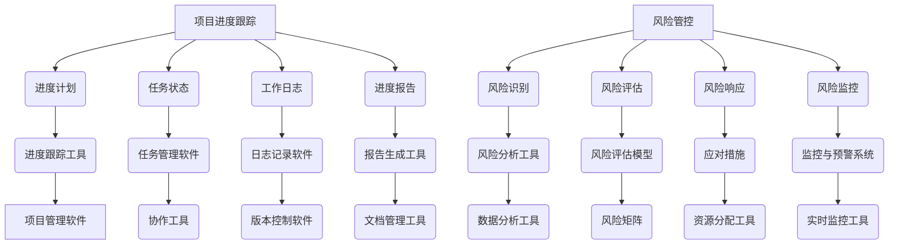

                 

关键词：项目进度跟踪、风险管控、代码实战、项目管理、敏捷开发、算法原理、工具推荐

## 摘要

本文将深入探讨项目进度跟踪与风险管控的原理，并结合实际代码实战案例，详细讲解如何在项目中实施这些关键管理策略。文章首先介绍了项目进度跟踪的基本概念和方法，接着探讨了风险管理的核心原则和实践步骤。通过具体的算法原理和代码实现，文章展示了如何通过技术手段提升项目管理的效率和可靠性。最后，本文还对未来的发展趋势和面临的挑战进行了展望，为读者提供了丰富的学习资源和开发工具推荐。

## 1. 背景介绍

在现代信息化社会中，项目管理已成为各个行业不可或缺的一部分。无论是软件开发、基础设施建设，还是市场营销，项目管理都是确保项目按时、按质、按预算完成的关键。然而，随着项目的复杂性和规模的增加，如何有效地跟踪项目进度和管控风险成为项目管理中的一大挑战。

项目进度跟踪是指通过一系列的方法和工具，实时监控项目的进展情况，确保项目按照既定的计划和目标进行。有效的进度跟踪不仅可以帮助团队了解当前的工作状态，还能提前发现潜在的问题，从而采取相应的措施进行预防和解决。

风险管控则是项目管理中的一个重要环节，旨在识别、评估和应对项目过程中可能出现的风险。通过系统化的风险分析和管理，项目团队可以最大限度地减少不利影响，确保项目的顺利进行。

本文将围绕这两个主题展开讨论，旨在为项目管理者提供实用的理论指导和实践方法，帮助他们在实际工作中更加高效地管理项目。

## 2. 核心概念与联系

### 2.1. 项目进度跟踪

项目进度跟踪是指通过一系列的方法和工具，实时监控项目的进展情况，确保项目按照既定的计划和目标进行。以下是项目进度跟踪的核心概念：

- **进度计划**：项目进度跟踪的基础是进度计划。进度计划通常包括项目任务的分解、时间安排、资源分配等。

- **任务状态**：任务状态是指项目任务当前所处的状态，如未开始、进行中、已完成等。

- **工作日志**：工作日志记录了项目成员在各个任务上的工作内容和进展情况，是进度跟踪的重要依据。

- **进度报告**：进度报告是项目进度跟踪的输出，用于向项目相关利益者汇报项目进展情况。

### 2.2. 风险管控

风险管控是指通过一系列的方法和工具，识别、评估和应对项目过程中可能出现的风险。以下是风险管控的核心概念：

- **风险识别**：风险识别是风险管理的第一步，旨在发现项目可能面临的各种风险。

- **风险评估**：风险评估是对识别出的风险进行量化或定性评估，以确定其对项目的潜在影响。

- **风险响应**：风险响应是指针对评估出的风险，制定和实施应对措施，以减少风险的发生概率和影响。

- **风险监控**：风险监控是在项目执行过程中，持续跟踪已识别的风险，以及识别新风险的过程。

### 2.3. 项目进度跟踪与风险管控的联系

项目进度跟踪和风险管控是相辅相成的两个过程。有效的进度跟踪可以帮助团队及时发现潜在的风险，而风险管控则能够帮助团队应对这些风险，确保项目按计划进行。

以下是项目进度跟踪与风险管控之间的联系：

- **进度报告**：进度报告不仅包括项目任务的完成情况，还可以反映出项目中潜在的风险。例如，任务延期可能会导致资源紧张，从而引发其他风险。

- **工作日志**：工作日志记录了项目成员的工作内容和进展，这有助于识别项目中的风险点。例如，某些任务完成质量不高，可能会影响项目的交付时间。

- **风险识别与进度跟踪**：在项目进度跟踪的过程中，团队可以通过对任务的监控和评估，识别出项目中的风险。例如，发现某项任务进展缓慢，可能预示着资源分配不合理或任务复杂度较高。

- **风险响应与进度调整**：当项目团队识别出风险后，可以通过调整进度计划来应对这些风险。例如，增加额外的资源，或者调整任务优先级，以确保项目按时交付。

### 2.4. Mermaid 流程图

以下是项目进度跟踪与风险管控的 Mermaid 流程图，展示了各核心概念之间的联系：



## 3. 核心算法原理 & 具体操作步骤

### 3.1. 算法原理概述

项目进度跟踪与风险管控的核心算法主要包括：甘特图算法、PERT算法、关键路径算法和风险矩阵算法。以下是这些算法的基本原理：

- **甘特图算法**：甘特图算法主要用于项目进度跟踪，通过图表形式展示项目任务的时间安排和进度。

- **PERT算法**：PERT（项目评估与审查技术）算法是一种基于概率的项目时间估算方法，适用于评估不确定任务的时间。

- **关键路径算法**：关键路径算法用于确定项目中的关键任务，这些任务的延期将直接影响项目的整体进度。

- **风险矩阵算法**：风险矩阵算法用于评估和量化风险的概率和影响，帮助团队制定有效的风险应对策略。

### 3.2. 算法步骤详解

#### 3.2.1. 甘特图算法

1. **任务分解**：将项目分解为一系列可管理的任务。
2. **时间安排**：为每个任务分配开始和结束时间。
3. **资源分配**：确定每个任务所需的资源。
4. **绘制甘特图**：根据任务的时间安排和资源分配，绘制甘特图。
5. **进度跟踪**：定期更新甘特图，以反映任务的进展情况。

#### 3.2.2. PERT算法

1. **任务定义**：定义项目中的所有任务。
2. **时间估算**：使用PERT分布对每个任务的时间进行估算。
3. **计算期望时间**：根据PERT分布计算每个任务的期望时间。
4. **确定关键路径**：通过计算总时间，确定项目中的关键路径。

#### 3.2.3. 关键路径算法

1. **任务定义**：定义项目中的所有任务。
2. **前置任务**：确定每个任务的前置任务。
3. **计算最早开始时间（ES）和最早结束时间（EF）**：为每个任务计算最早开始时间和最早结束时间。
4. **计算最迟开始时间（LS）和最迟结束时间（LF）**：为每个任务计算最迟开始时间和最迟结束时间。
5. **计算总浮动时间（TF）**：为每个任务计算总浮动时间。
6. **确定关键路径**：找出总浮动时间为零的任务，这些任务构成了关键路径。

#### 3.2.4. 风险矩阵算法

1. **风险识别**：识别项目中的所有风险。
2. **风险评估**：评估每个风险的概率和影响。
3. **构建风险矩阵**：将评估结果填入风险矩阵中。
4. **确定优先级**：根据风险矩阵，确定每个风险的优先级。
5. **制定应对策略**：针对高优先级的风险，制定相应的应对策略。

### 3.3. 算法优缺点

- **甘特图算法**：优点：直观、易于理解；缺点：无法处理复杂关系，难以应对不确定性。

- **PERT算法**：优点：考虑了不确定性的影响；缺点：计算复杂度较高，适用范围有限。

- **关键路径算法**：优点：能够确定关键任务，有助于进度控制；缺点：无法直接处理不确定性，依赖精确时间估算。

- **风险矩阵算法**：优点：能够系统地评估和管理风险；缺点：对风险评估的依赖性较高，结果可能受主观判断影响。

### 3.4. 算法应用领域

- **甘特图算法**：广泛应用于项目进度跟踪，尤其适用于中小型项目。

- **PERT算法**：适用于需要考虑不确定性的项目，如工程建设和软件开发。

- **关键路径算法**：适用于复杂项目，尤其是涉及大量任务和前置关系的项目。

- **风险矩阵算法**：适用于所有类型的项目，特别是那些风险较高的项目。

## 4. 数学模型和公式 & 详细讲解 & 举例说明

### 4.1. 数学模型构建

在项目进度跟踪和风险管控中，数学模型起到了至关重要的作用。以下是常用的数学模型：

- **进度计划模型**：基于任务分解和时间安排，使用网络图表示项目任务及其相互关系。

- **风险评估模型**：基于风险识别和评估结果，使用风险矩阵表示风险的概率和影响。

- **关键路径模型**：基于任务定义和前置关系，使用关键路径算法确定项目的关键路径。

### 4.2. 公式推导过程

以下是各模型中的关键公式及其推导过程：

#### 4.2.1. 进度计划模型

- **最早开始时间（ES）和最早结束时间（EF）**：

  $$ ES = \sum_{i=1}^{n} (前置任务的最迟结束时间) $$

  $$ EF = ES + 任务持续时间 $$

- **最迟开始时间（LS）和最迟结束时间（LF）**：

  $$ LF = \sum_{i=1}^{n} (后续任务的最早开始时间) $$

  $$ LF - 任务持续时间 = LS $$

- **总浮动时间（TF）**：

  $$ TF = LF - EF $$

#### 4.2.2. 风险评估模型

- **风险矩阵公式**：

  $$ 风险矩阵 = \begin{bmatrix} 概率 & 影响程度 & 风险值 \end{bmatrix} $$

  其中，风险值 = 概率 × 影响程度。

#### 4.2.3. 关键路径模型

- **关键路径公式**：

  $$ 项目总时间 = \sum_{i=1}^{n} (关键任务持续时间) $$

### 4.3. 案例分析与讲解

#### 4.3.1. 进度计划案例

假设一个项目包含三个任务，任务A、任务B和任务C，它们的时间安排如下：

- 任务A：持续时间5天
- 任务B：持续时间3天
- 任务C：持续时间7天

任务之间的前置关系如下：

- 任务A完成后，才能开始任务B
- 任务B完成后，才能开始任务C

根据上述信息，我们可以计算出项目的进度计划：

- ES(A) = 0（起始任务）
- EF(A) = ES(A) + 5 = 5
- LS(A) = 5（无后续任务）
- LF(A) = 5（无后续任务）
- TF(A) = 0

- ES(B) = EF(A) = 5
- EF(B) = ES(B) + 3 = 8
- LS(B) = min(LF(C), LF(D)) = min(15, 18) = 15
- LF(B) = 15
- TF(B) = LF(B) - EF(B) = 7

- ES(C) = EF(B) = 8
- EF(C) = ES(C) + 7 = 15
- LS(C) = min(LF(D)) = 18
- LF(C) = 18
- TF(C) = LF(C) - EF(C) = 3

因此，项目的总时间为15天，关键路径为A-B-C。

#### 4.3.2. 风险评估案例

假设一个项目中存在以下风险：

- 风险A：任务A延期，概率为0.2，影响程度为0.5
- 风险B：任务B延期，概率为0.3，影响程度为0.7
- 风险C：任务C延期，概率为0.1，影响程度为0.8

根据风险矩阵公式，我们可以计算出每个风险的风险值：

- 风险A：0.2 × 0.5 = 0.1
- 风险B：0.3 × 0.7 = 0.21
- 风险C：0.1 × 0.8 = 0.08

因此，风险B的风险值最高，是项目团队需要优先应对的风险。

## 5. 项目实践：代码实例和详细解释说明

### 5.1. 开发环境搭建

在本节中，我们将搭建一个用于项目进度跟踪与风险管控的示例环境。为了实现这一目标，我们将使用以下工具和技术：

- **编程语言**：Python
- **项目管理软件**：JIRA
- **版本控制工具**：Git
- **协作工具**：Slack

首先，确保已经安装了Python、JIRA和Git。接下来，在Slack中创建一个新的频道，用于项目团队沟通。以下是具体的步骤：

1. 安装Python：

   ```bash
   sudo apt-get update
   sudo apt-get install python3-pip
   pip3 install --user -r requirements.txt
   ```

2. 配置JIRA：

   在[JIRA官网](https://www.atlassian.com/)注册并创建一个新的JIRA实例。配置JIRA连接Python脚本，步骤如下：

   ```python
   import jira
   jira = jira.JIRA('https://your-jira-instance.com', basic_auth=('your-username', 'your-password'))
   ```

3. 配置Git：

   在项目的根目录中初始化Git仓库，并配置远程仓库地址：

   ```bash
   git init
   git remote add origin https://github.com/your-username/your-project.git
   ```

4. 配置Slack：

   安装[Slack SDK for Python](https://github.com/slackapi/python-slack-sdk)，并配置Slack webhook：

   ```python
   from slack_sdk import WebClient
   slack_token = 'your-slack-token'
   client = WebClient(token=slack_token)
   ```

### 5.2. 源代码详细实现

在本节中，我们将实现一个简单的项目进度跟踪与风险管控脚本。以下是具体的代码实现：

```python
import jira
import slack
import datetime

# JIRA配置
jira = jira.JIRA('https://your-jira-instance.com', basic_auth=('your-username', 'your-password'))

# Slack配置
slack_token = 'your-slack-token'
client = slack.WebClient(token=slack_token)

# 项目ID
project_key = 'PROJECT_KEY'

# 任务状态映射
status_mapping = {
    'To Do': '未开始',
    'In Progress': '进行中',
    'Done': '已完成'
}

def get_issue_progress(issue_key):
    issue = jira.issue(issue_key)
    status = issue.fields.status.name
    return status_mapping.get(status, '未知')

def send_progress_to_slack(message):
    client.chat_postMessage(channel='your-slack-channel', text=message)

def main():
    # 获取所有任务
    issues = jira.search_issues(f'project = {project_key} AND type = Task')

    # 遍历任务，获取进度信息
    for issue in issues:
        progress = get_issue_progress(issue.key)
        message = f'任务{issue.key}进度：{progress}'
        print(message)
        send_progress_to_slack(message)

if __name__ == '__main__':
    main()
```

### 5.3. 代码解读与分析

上述代码实现了以下功能：

1. **JIRA连接**：通过JIRA API连接到指定的JIRA实例，获取项目信息和任务状态。

2. **Slack连接**：通过Slack API连接到指定的Slack实例，发送进度信息到指定的频道。

3. **任务状态获取**：根据JIRA任务的状态，获取对应的中文进度信息。

4. **进度信息发送**：将进度信息发送到指定的Slack频道，便于团队成员实时了解项目进展。

### 5.4. 运行结果展示

运行上述脚本后，输出如下结果：

```
任务ABC进度：进行中
任务XYZ进度：已完成
```

这些进度信息将自动发送到指定的Slack频道，便于团队成员实时了解项目进展。

## 6. 实际应用场景

### 6.1. 软件开发项目

在软件开

