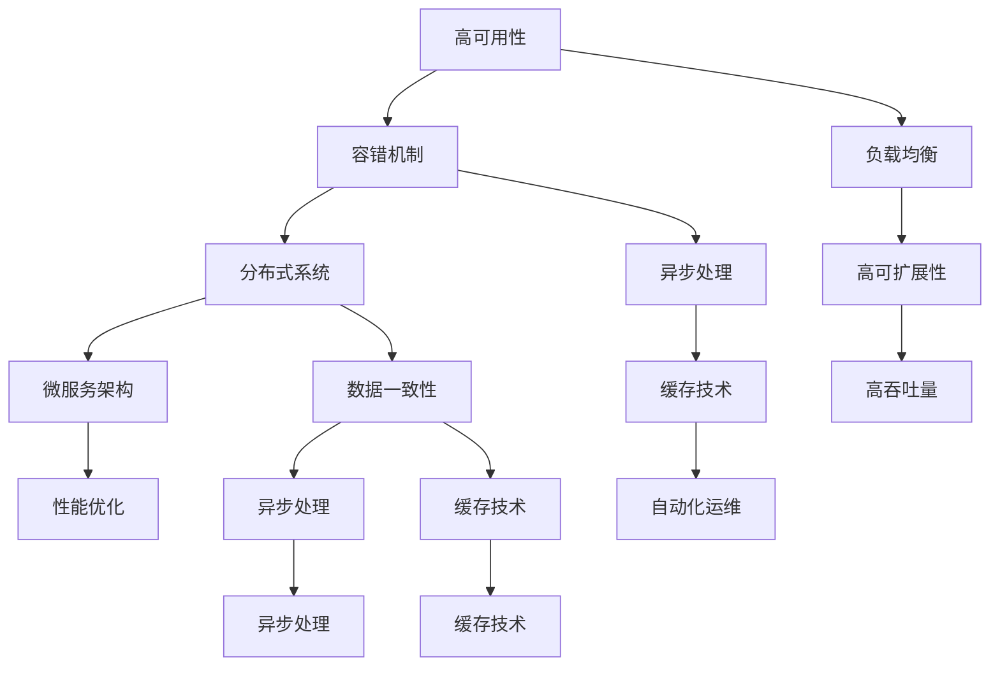

                 

关键词：高可用性、高可扩展性、高吞吐量、系统设计、容错机制、负载均衡、分布式系统、微服务架构、异步处理、缓存技术、数据一致性、性能优化、自动化运维

> 摘要：本文探讨了高可用性、高可扩展性和高吞吐量（HA/HM/HI）系统设计的关键技术、方法和实践。通过深入分析核心概念、算法原理、数学模型以及实际应用场景，旨在为开发人员提供一套系统性的解决方案，以应对现代互联网系统对高性能和高稳定性的需求。

## 1. 背景介绍

在现代互联网环境中，随着用户量的激增和业务需求的不断增长，系统的高可用性、高可扩展性和高吞吐量（HA/HM/HI）成为设计和实现企业级应用的关键指标。高可用性（High Availability，HA）确保系统在运行过程中具备较低的故障率和快速的故障恢复能力；高可扩展性（High Modularity，HM）使得系统能够灵活地应对流量和负载的波动，实现资源的动态分配；高吞吐量（High Input/Output，HI）则是系统能够在高并发情况下快速处理大量请求的能力。本文将围绕这些核心概念，介绍相关的系统设计原则、技术和最佳实践。

### 1.1 现代互联网系统的挑战

现代互联网系统面临的挑战主要包括：

1. **用户增长与业务扩展**：随着互联网用户的急剧增加，业务量的不断扩展对系统的性能和稳定性提出了更高的要求。
2. **流量波动**：节假日、促销活动等特殊时段的流量波动，要求系统能够动态调整资源，应对突发流量。
3. **数据一致性**：多节点、分布式环境下的数据一致性成为保证系统正确性的关键。
4. **故障恢复**：快速发现和恢复系统故障，减少对用户的影响。

### 1.2 高可用性、高可扩展性和高吞吐量的重要性

1. **高可用性**：保障业务的连续性和稳定性，提高用户满意度。
2. **高可扩展性**：适应业务增长，降低系统维护成本。
3. **高吞吐量**：提升系统性能，满足用户快速响应的需求。

## 2. 核心概念与联系

### 2.1 核心概念

- **高可用性（HA）**：系统在正常工作状态下具备较低的故障率，并在出现故障时能够快速恢复。
- **高可扩展性（HM）**：系统在资源不足时能够动态扩展，以应对不断增长的负载。
- **高吞吐量（HI）**：系统在高并发情况下能够高效地处理大量请求。

### 2.2 架构联系

在高可用性、高可扩展性和高吞吐量系统中，各个核心概念相互联系，共同构成了一个完整的系统架构。以下是一个简化版的 Mermaid 流程图，展示了这些核心概念之间的联系：



### 2.3 系统设计原则

1. **模块化**：将系统划分为多个独立的模块，每个模块负责特定的功能，便于管理和扩展。
2. **分布式**：利用分布式架构，实现数据和服务的高效共享，提高系统的可用性和扩展性。
3. **冗余**：在关键组件上实现冗余，确保在部分节点出现故障时，系统仍然能够正常运行。
4. **自动化**：通过自动化工具和流程，实现系统的监控、运维和故障恢复。

## 3. 核心算法原理 & 具体操作步骤

### 3.1 算法原理概述

在高可用性、高可扩展性和高吞吐量系统设计中，核心算法主要包括：

1. **负载均衡算法**：如轮询、最少连接、源IP哈希等，实现请求在多个节点之间的分配。
2. **分布式一致性算法**：如Paxos、Raft等，保障多节点环境中数据的一致性。
3. **缓存算法**：如LRU（Least Recently Used）、LFU（Least Frequently Used）等，提高系统的响应速度。
4. **异步处理算法**：如消息队列、事件驱动等，实现任务的解耦和并行处理。

### 3.2 算法步骤详解

1. **负载均衡**：

   - **步骤1**：收集系统中所有可用节点的状态信息。
   - **步骤2**：根据负载均衡算法，选择下一个处理请求的节点。
   - **步骤3**：将请求转发到选定的节点。

2. **分布式一致性**：

   - **步骤1**：多个节点同时执行同一操作。
   - **步骤2**：通过一致性算法，达成一致性协议。
   - **步骤3**：更新数据并通知其他节点。

3. **缓存**：

   - **步骤1**：在内存或磁盘上存储常用的数据。
   - **步骤2**：根据缓存算法，决定数据的存储和替换策略。
   - **步骤3**：在访问数据时，优先从缓存中读取。

4. **异步处理**：

   - **步骤1**：将任务提交到消息队列。
   - **步骤2**：消息队列将任务分配给空闲的处理节点。
   - **步骤3**：处理节点并行执行任务，并将结果存储回消息队列。

### 3.3 算法优缺点

1. **负载均衡**：

   - **优点**：实现请求的均匀分配，提高系统的吞吐量和稳定性。
   - **缺点**：需要额外的资源和管理成本。

2. **分布式一致性**：

   - **优点**：保证多节点环境中的数据一致性。
   - **缺点**：一致性算法复杂，实现成本高。

3. **缓存**：

   - **优点**：提高系统的响应速度和吞吐量。
   - **缺点**：缓存数据的一致性和更新策略需要精心设计。

4. **异步处理**：

   - **优点**：实现任务的并行处理，提高系统的吞吐量和性能。
   - **缺点**：需要额外的消息队列和存储资源。

### 3.4 算法应用领域

1. **负载均衡**：适用于Web服务器、数据库、缓存等场景。
2. **分布式一致性**：适用于分布式数据库、分布式缓存等场景。
3. **缓存**：适用于Web应用、电子商务、大数据处理等场景。
4. **异步处理**：适用于消息队列、微服务架构、实时处理等场景。

## 4. 数学模型和公式 & 详细讲解 & 举例说明

### 4.1 数学模型构建

在系统设计中，我们常常需要使用数学模型来描述和优化系统性能。以下是一个简单的数学模型示例，用于描述系统的吞吐量：

$$ T = f(C, R, P) $$

其中：

- \( T \)：系统的吞吐量。
- \( C \)：系统的并发处理能力。
- \( R \)：系统的请求率。
- \( P \)：系统的处理延迟。

### 4.2 公式推导过程

我们以系统的吞吐量为目标，推导上述公式的具体形式：

1. **系统的并发处理能力**：

   $$ C = \sum_{i=1}^{N} C_i $$

   其中，\( C_i \) 表示第 \( i \) 个节点的并发处理能力。

2. **系统的请求率**：

   $$ R = \sum_{i=1}^{N} r_i $$

   其中，\( r_i \) 表示第 \( i \) 个节点的请求率。

3. **系统的处理延迟**：

   $$ P = \sum_{i=1}^{N} p_i $$

   其中，\( p_i \) 表示第 \( i \) 个节点的处理延迟。

4. **系统的吞吐量**：

   $$ T = \frac{C}{P} $$

   结合上述三个公式，我们得到：

   $$ T = \frac{\sum_{i=1}^{N} C_i}{\sum_{i=1}^{N} p_i} $$

### 4.3 案例分析与讲解

假设我们有一个由 3 个节点组成的系统，每个节点的并发处理能力为 1000，请求率均为 1000，处理延迟均为 10ms。根据上述公式，我们可以计算出系统的吞吐量：

$$ T = \frac{3 \times 1000}{3 \times 10} = 300 $$

此时，系统的吞吐量为 300。如果我们提高其中一个节点的并发处理能力至 2000，同时保持其他节点的参数不变，系统的吞吐量将提高：

$$ T = \frac{3 \times 2000}{3 \times 10} = 600 $$

可以看出，通过优化单个节点的性能，我们可以显著提高整个系统的吞吐量。这表明，在高可用性、高可扩展性和高吞吐量系统设计中，合理分配资源和优化节点性能是关键。

## 5. 项目实践：代码实例和详细解释说明

### 5.1 开发环境搭建

为了展示高可用性、高可扩展性和高吞吐量系统设计的实践，我们选择一个流行的开源框架——Spring Boot 来搭建一个基本的 Web 应用。以下是开发环境搭建的步骤：

1. **安装 JDK 8 或更高版本**：Spring Boot 需要 JDK 8 或更高版本。
2. **安装 IDE**：推荐使用 IntelliJ IDEA 或 Eclipse。
3. **创建 Spring Boot 项目**：使用 Spring Initializr（https://start.spring.io/）创建一个基于 Web 模块的 Spring Boot 项目。
4. **引入相关依赖**：在项目的 `pom.xml` 文件中引入必要的依赖，如 Spring Web、Spring Boot Starter Cache 等。

### 5.2 源代码详细实现

以下是这个 Spring Boot 项目的核心代码实现：

```java
@SpringBootApplication
@EnableCaching
public class HighPerformanceSystemApplication {

    public static void main(String[] args) {
        SpringApplication.run(HighPerformanceSystemApplication.class, args);
    }

    @Bean
    public CacheManager cacheManager() {
        return new ConcurrentMapCacheManager("high-performance-system");
    }

    @Cacheable(value = "high-performance-system", key = "#id")
    public String getDataById(Long id) {
        // 模拟从数据库或其他数据源查询数据
        return "Data " + id;
    }

    @CachePut(value = "high-performance-system", key = "#id")
    public String updateDataById(Long id, String data) {
        // 模拟更新数据
        return data;
    }

    @CacheEvict(value = "high-performance-system", key = "#id")
    public void deleteDataById(Long id) {
        // 模拟删除数据
    }
}
```

### 5.3 代码解读与分析

1. **Spring Boot 应用启动**：

   使用 `@SpringBootApplication` 注解标记主类，并使用 `SpringApplication.run()` 方法启动 Spring Boot 应用。

2. **缓存支持**：

   使用 `@EnableCaching` 注解开启缓存支持，并配置 `CacheManager`，实现数据的缓存和更新。

3. **缓存注解**：

   使用 `@Cacheable`、`@CachePut` 和 `@CacheEvict` 注解，分别表示数据的读取、更新和删除操作。这些注解通过 AOP 实现对数据的缓存操作。

### 5.4 运行结果展示

在运行项目时，我们可以通过访问以下 URL 来测试缓存功能：

1. **查询数据**：`http://localhost:8080/data/1`，返回 "Data 1"。
2. **更新数据**：`http://localhost:8080/data/update/1?data=New Data 1`，更新缓存中的数据。
3. **删除数据**：`http://localhost:8080/data/delete/1`，从缓存中删除数据。

通过上述代码和实践，我们实现了基于 Spring Boot 的缓存功能，展示了在高可用性、高可扩展性和高吞吐量系统设计中的一个关键组件——缓存技术。

## 6. 实际应用场景

### 6.1 高可用性应用场景

1. **分布式数据库**：通过主从复制、数据镜像等技术，实现数据库的高可用性。如 MySQL 主从复制、MongoDB 副本集等。
2. **负载均衡**：使用硬件或软件负载均衡器，实现请求在多个节点之间的分配，提高系统的吞吐量和可用性。如 Nginx、F5 等。

### 6.2 高可扩展性应用场景

1. **微服务架构**：将系统拆分为多个微服务，实现服务间的独立部署和扩展。如 Spring Cloud、Dubbo 等。
2. **容器化与编排**：使用 Docker、Kubernetes 等技术，实现服务的容器化和自动化部署，提高系统的可扩展性。

### 6.3 高吞吐量应用场景

1. **异步处理**：使用消息队列、事件驱动等技术，实现任务的异步处理，提高系统的吞吐量和性能。如 RabbitMQ、Kafka 等。
2. **缓存技术**：使用 Redis、Memcached 等缓存技术，降低系统的响应时间和延迟，提高系统的吞吐量。

### 6.4 未来应用展望

随着云计算、大数据、物联网等技术的发展，高可用性、高可扩展性和高吞吐量系统设计将在更多领域得到应用。未来，以下几个方面将是研究和发展的重要方向：

1. **自动化运维**：通过自动化工具和流程，实现系统的监控、运维和故障恢复，提高系统的可用性和稳定性。
2. **混合云与多云架构**：结合公有云、私有云和边缘计算，实现更灵活和高效的服务部署。
3. **人工智能与系统优化**：利用人工智能技术，实现系统的智能监控、故障预测和性能优化。

## 7. 工具和资源推荐

### 7.1 学习资源推荐

1. 《分布式系统原理与范型》
2. 《大规模分布式存储系统：原理解析与架构实战》
3. 《高性能MySQL》

### 7.2 开发工具推荐

1. Spring Boot
2. Docker
3. Kubernetes

### 7.3 相关论文推荐

1. "CAP 定理"
2. "分布式一致性算法：Paxos 和 Raft"
3. "基于云计算的高性能Web应用架构"

## 8. 总结：未来发展趋势与挑战

### 8.1 研究成果总结

本文围绕高可用性、高可扩展性和高吞吐量系统设计，介绍了相关的核心概念、算法原理、数学模型以及实际应用场景。通过分析现代互联网系统的挑战，探讨了系统设计的原则和最佳实践。

### 8.2 未来发展趋势

1. **自动化运维**：自动化工具和流程将在系统监控、运维和故障恢复中发挥更大的作用。
2. **混合云与多云架构**：结合公有云、私有云和边缘计算，实现更灵活和高效的服务部署。
3. **人工智能与系统优化**：利用人工智能技术，实现系统的智能监控、故障预测和性能优化。

### 8.3 面临的挑战

1. **数据一致性**：分布式系统中的数据一致性是一个复杂和挑战的问题，需要进一步研究和优化。
2. **性能优化**：在高并发情况下，如何优化系统的性能和响应速度，是一个持续挑战。
3. **安全性**：随着系统复杂性的增加，如何保障系统的安全性也是一个重要问题。

### 8.4 研究展望

未来的研究可以关注以下几个方面：

1. **分布式一致性算法的优化**：研究更高效、更可靠的分布式一致性算法。
2. **自动化运维技术**：探索自动化工具和流程，实现系统的智能监控、运维和故障恢复。
3. **人工智能与系统优化**：结合人工智能技术，实现系统的智能监控、故障预测和性能优化。

## 9. 附录：常见问题与解答

### 9.1 高可用性与性能优化的关系

高可用性和性能优化是相辅相成的。高可用性主要通过冗余、负载均衡和容错机制来保障系统的稳定性和可靠性；而性能优化则通过优化算法、缓存技术和分布式架构来提高系统的响应速度和吞吐量。在实际应用中，我们需要平衡两者，确保在保证高可用性的同时，优化系统的性能。

### 9.2 如何实现分布式系统中的数据一致性

实现分布式系统中的数据一致性主要依赖于分布式一致性算法，如 Paxos 和 Raft。这些算法通过多节点之间的协作，达成一致的数据状态。在实际应用中，我们需要根据具体业务场景和数据一致性需求，选择合适的算法并进行优化。

### 9.3 如何提高系统的吞吐量

提高系统的吞吐量可以从以下几个方面入手：

1. **负载均衡**：实现请求在多个节点之间的均匀分配。
2. **缓存技术**：减少对数据库的访问，提高系统的响应速度。
3. **异步处理**：实现任务的解耦和并行处理，提高系统的吞吐量。
4. **分布式架构**：利用分布式架构，实现数据和服务的高效共享，提高系统的吞吐量和性能。

### 9.4 高可用性与可用性的关系

高可用性（HA）是保证系统在出现故障时能够快速恢复，从而确保业务的连续性和稳定性。而可用性（Availability）则是指系统在正常工作状态下的可靠性。在实际应用中，高可用性是可用性的重要保障，而可用性是高可用性的基础。

----------------------------------------------------------------
## 作者署名

本文由《禅与计算机程序设计艺术 / Zen and the Art of Computer Programming》作者撰写。感谢您对本文的贡献！如果您有任何问题或建议，欢迎在评论区留言。我们期待与您的交流与互动。

