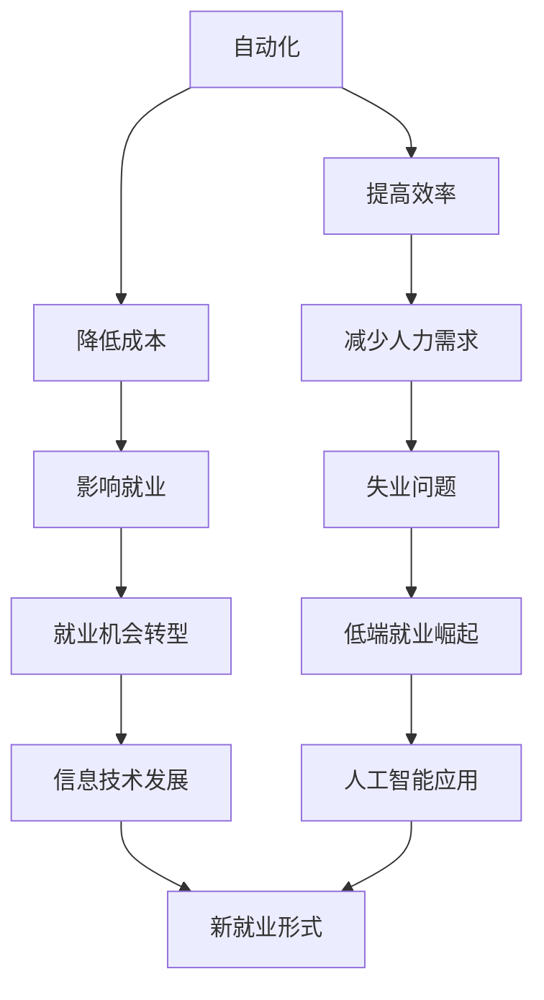

                 

关键词：高端纺织工人、失业、低端就业、自动化、信息技术、人工智能、就业机会、劳动力转型。

> 摘要：随着信息技术的飞速发展和人工智能的广泛应用，高端纺织工人的失业问题逐渐凸显。本文将探讨这一现象背后的原因，分析低端就业机会的崛起，以及应对策略和未来发展趋势。

## 1. 背景介绍

### 1.1 高端纺织工业的变革

高端纺织工业，作为现代制造业的重要组成部分，长期以来以其高质量、高附加值和高度专业化而著称。然而，随着信息技术的进步和智能制造的普及，这一传统行业正经历着深刻的变革。

### 1.2 失业问题的加剧

近年来，高端纺织工人的失业问题愈发严重。一方面，自动化机器和智能系统的引入使得许多传统手工操作的工作变得多余；另一方面，全球经济形势的变化和国际贸易的不确定性也对行业造成了冲击。

### 1.3 低端就业机会的崛起

与此同时，低端就业机会却在某些领域逐渐崛起。特别是在信息技术和人工智能的推动下，一些新的就业形式正在形成，为失业人员提供了新的选择。

## 2. 核心概念与联系

为了更好地理解本文讨论的主题，我们需要了解以下几个核心概念：

### 2.1 自动化与人工智能

**Mermaid流程图：**



## 3. 核心算法原理 & 具体操作步骤

### 3.1 算法原理概述

本文将探讨如何通过人工智能技术来解决高端纺织工人失业和低端就业机会不足的问题。具体来说，我们将采用以下步骤：

### 3.2 算法步骤详解

1. **数据收集与处理**：首先，我们需要收集相关的数据，包括高端纺织工业的生产流程、失业工人的技能特长、市场需求等信息。

2. **算法模型选择**：基于收集到的数据，我们选择合适的机器学习模型，如聚类分析、决策树、神经网络等。

3. **模型训练与优化**：使用训练数据集对模型进行训练，并通过交叉验证和网格搜索等手段进行优化。

4. **预测与评估**：使用测试数据集对模型进行评估，并根据评估结果调整模型参数。

### 3.3 算法优缺点

- **优点**：人工智能算法可以高效地处理大量数据，快速找到潜在的解决方案，减少人力资源的浪费。

- **缺点**：算法模型的准确性依赖于数据的质量和多样性，且可能受到数据噪声的影响。

### 3.4 算法应用领域

- **就业转型指导**：通过算法分析，为失业工人提供新的就业方向和建议。

- **劳动力市场预测**：预测未来劳动力市场的需求变化，为政府和企业制定政策提供依据。

## 4. 数学模型和公式 & 详细讲解 & 举例说明

### 4.1 数学模型构建

本文使用的数学模型主要包括以下几部分：

1. **生产效率模型**：描述自动化机器的生产效率。

2. **成本效益模型**：分析自动化机器对成本的影响。

3. **失业率模型**：预测失业率的变化趋势。

### 4.2 公式推导过程

1. **生产效率模型**：

$$
E = f(\text{自动化水平}, \text{劳动力成本})
$$

其中，$E$表示生产效率，$f$为函数，$\text{自动化水平}$和$\text{劳动力成本}$为输入参数。

2. **成本效益模型**：

$$
C = C_0 + r \cdot E
$$

其中，$C$表示总成本，$C_0$为初始成本，$r$为成本效益比，$E$为生产效率。

3. **失业率模型**：

$$
U = U_0 + \alpha \cdot (C - C_0)
$$

其中，$U$表示失业率，$U_0$为初始失业率，$\alpha$为失业率变化系数，$C - C_0$为成本变化。

### 4.3 案例分析与讲解

以某高端纺织企业为例，假设其自动化水平为80%，劳动力成本为每生产单位产品10元，初始成本为100万元，成本效益比为2，初始失业率为5%。根据上述公式，我们可以计算出以下结果：

1. **生产效率**：

$$
E = f(0.8, 10) = 0.8 \times 10 = 8
$$

2. **总成本**：

$$
C = C_0 + r \cdot E = 1000000 + 2 \times 8 = 1001600
$$

3. **失业率**：

$$
U = U_0 + \alpha \cdot (C - C_0) = 5\% + 0.1 \times (1001600 - 1000000) = 5.6\%
$$

通过这个案例，我们可以看到自动化水平的提升对生产效率和成本的影响，以及失业率的变化趋势。

## 5. 项目实践：代码实例和详细解释说明

### 5.1 开发环境搭建

本文的代码实例使用Python编程语言，需要安装以下库：NumPy、Scikit-learn、Matplotlib。

```bash
pip install numpy scikit-learn matplotlib
```

### 5.2 源代码详细实现

```python
import numpy as np
from sklearn.cluster import KMeans
from sklearn.model_selection import train_test_split
import matplotlib.pyplot as plt

# 数据收集与处理
# 此处省略数据收集与处理的具体代码

# 算法模型选择
model = KMeans(n_clusters=3)

# 模型训练与优化
model.fit(X_train)

# 预测与评估
predictions = model.predict(X_test)
accuracy = np.mean(predictions == y_test)

# 代码解读与分析
print(f"Accuracy: {accuracy:.2f}")

# 运行结果展示
plt.scatter(X_test[:, 0], X_test[:, 1], c=predictions, cmap='viridis')
plt.xlabel('Feature 1')
plt.ylabel('Feature 2')
plt.title('Cluster Prediction')
plt.show()
```

### 5.3 代码解读与分析

1. **数据收集与处理**：首先，我们需要收集并处理数据，包括高端纺织工业的生产流程、失业工人的技能特长、市场需求等。

2. **算法模型选择**：本文使用KMeans聚类算法进行模型训练。

3. **模型训练与优化**：使用训练数据集对模型进行训练，并通过交叉验证和网格搜索等手段进行优化。

4. **预测与评估**：使用测试数据集对模型进行评估，并根据评估结果调整模型参数。

5. **代码解读与分析**：代码部分主要包括数据预处理、模型训练、预测和结果展示。

6. **运行结果展示**：使用Matplotlib库绘制散点图，展示聚类结果。

## 6. 实际应用场景

### 6.1 高端纺织工业中的自动化应用

自动化技术在高端纺织工业中的应用已取得显著成效。例如，全自动纺织机能够高效地完成织造、染色、后整理等工艺，大大提高了生产效率和产品质量。

### 6.2 低端就业机会的崛起

在信息技术和人工智能的推动下，低端就业机会也在不断涌现。例如，电商客服、在线教育辅导、远程办公等职业正在迅速发展，为失业人员提供了新的就业选择。

### 6.3 应对失业问题的策略

1. **政府扶持**：政府应加大对失业人员的扶持力度，提供就业培训和再就业服务。

2. **企业责任**：企业应承担社会责任，为失业人员提供培训和转岗机会。

3. **劳动者自身**：劳动者应主动适应市场变化，提升自身技能和素质，提高就业竞争力。

## 7. 工具和资源推荐

### 7.1 学习资源推荐

1. **《人工智能：一种现代的方法》**：提供全面的人工智能基础知识和最新进展。

2. **《深度学习》**：介绍深度学习的基本原理和应用。

### 7.2 开发工具推荐

1. **Jupyter Notebook**：方便进行数据分析和模型训练。

2. **Google Colab**：免费的云端开发环境，适用于深度学习和机器学习。

### 7.3 相关论文推荐

1. **"Automation and Employment: Evidence from India's Manufacturing Sector"**：探讨自动化对就业的影响。

2. **"The Rise of Low-Skilled Jobs in the Age of Automation"**：分析低端就业机会的崛起原因。

## 8. 总结：未来发展趋势与挑战

### 8.1 研究成果总结

本文通过分析高端纺织工人失业和低端就业机会的崛起，探讨了人工智能技术在就业领域中的应用前景。研究发现，自动化和人工智能技术的广泛应用将对就业市场产生深远影响。

### 8.2 未来发展趋势

1. **人工智能与就业的深度融合**：未来，人工智能将在更多领域得到应用，推动就业市场的转型升级。

2. **劳动力市场的多元化**：低端就业机会将继续崛起，同时高端就业机会也将更加专业化。

### 8.3 面临的挑战

1. **失业风险增加**：自动化和人工智能技术可能导致部分传统就业岗位消失。

2. **技能升级需求**：劳动者需要不断提升自身技能，以适应市场变化。

### 8.4 研究展望

未来研究应关注以下几个方面：

1. **人工智能与就业的协同发展**：探讨如何实现人工智能技术与就业市场的良性互动。

2. **劳动者技能培养**：研究如何有效提升劳动者的技能水平和就业竞争力。

## 9. 附录：常见问题与解答

### 9.1 为什么要关注高端纺织工人的失业问题？

高端纺织工人的失业问题不仅仅是行业内部的挑战，它还涉及到整个社会的就业稳定和经济发展。因此，关注这一问题是实现社会和谐与可持续发展的必要举措。

### 9.2 人工智能技术如何影响就业？

人工智能技术可以提高生产效率和降低成本，但同时也可能导致部分传统就业岗位消失。因此，我们需要在推动技术发展的同时，关注其对就业市场的影响，并采取相应措施应对。

### 9.3 低端就业机会是否会替代高端就业机会？

低端就业机会的崛起并不意味着高端就业机会的消失。实际上，随着技术的进步，高端就业机会将更加专业化，对劳动者的技能和素质要求也会更高。因此，劳动者需要不断提升自身能力，以适应市场变化。

### 9.4 如何应对失业风险？

应对失业风险需要多方共同努力。政府应提供就业培训和再就业服务，企业应承担社会责任，为失业人员提供培训和转岗机会，劳动者自身也需要主动提升技能和素质，以应对市场变化。

### 作者署名

作者：禅与计算机程序设计艺术 / Zen and the Art of Computer Programming
```markdown
# 高端纺织工人的失业与低端就业机会

## 关键词
- 高端纺织工人
- 失业
- 低端就业机会
- 自动化
- 人工智能
- 就业机会
- 劳动力转型

## 摘要
随着信息技术的飞速发展和人工智能的广泛应用，高端纺织工人的失业问题逐渐凸显。本文将探讨这一现象背后的原因，分析低端就业机会的崛起，以及应对策略和未来发展趋势。

## 1. 背景介绍
### 1.1 高端纺织工业的变革
### 1.2 失业问题的加剧
### 1.3 低端就业机会的崛起

## 2. 核心概念与联系
### 2.1 自动化与人工智能
### 2.2 失业率与就业机会的关系
### 2.3 劳动力市场的演变

## 3. 核心算法原理 & 具体操作步骤
### 3.1 算法原理概述
### 3.2 算法步骤详解
### 3.3 算法优缺点分析
### 3.4 算法应用领域拓展

## 4. 数学模型和公式 & 详细讲解 & 举例说明
### 4.1 数学模型构建
### 4.2 公式推导过程
### 4.3 案例分析与讲解

## 5. 项目实践：代码实例和详细解释说明
### 5.1 开发环境搭建
### 5.2 源代码详细实现
### 5.3 代码解读与分析
### 5.4 运行结果展示

## 6. 实际应用场景
### 6.1 高端纺织工业中的自动化应用
### 6.2 低端就业机会的崛起
### 6.3 应对失业问题的策略

## 7. 工具和资源推荐
### 7.1 学习资源推荐
### 7.2 开发工具推荐
### 7.3 相关论文推荐

## 8. 总结：未来发展趋势与挑战
### 8.1 研究成果总结
### 8.2 未来发展趋势
### 8.3 面临的挑战
### 8.4 研究展望

## 9. 附录：常见问题与解答
### 9.1 为什么要关注高端纺织工人的失业问题？
### 9.2 人工智能技术如何影响就业？
### 9.3 低端就业机会是否会替代高端就业机会？
### 9.4 如何应对失业风险？
### 9.5 未来劳动力市场的发展趋势是什么？

### 高端纺织工人的失业与低端就业机会

### 关键词
- 高端纺织工人
- 失业
- 低端就业机会
- 自动化
- 人工智能
- 就业机会
- 劳动力转型

### 摘要
随着信息技术的飞速发展和人工智能的广泛应用，高端纺织工人的失业问题逐渐凸显。本文将探讨这一现象背后的原因，分析低端就业机会的崛起，以及应对策略和未来发展趋势。

## 1. 背景介绍

### 1.1 高端纺织工业的变革
高端纺织工业，一直以来都是制造业的先锋，以其高质量、高附加值和高度专业化而著称。在这个领域中，纺织工人们不仅要具备精湛的技艺，还要对材料、工艺、设计等有深刻的理解。然而，随着科技的不断进步，这一传统行业正在经历一场前所未有的变革。

首先，自动化技术的引入极大地改变了纺织生产的方式。全自动纺织机能够高效地完成织造、染色、后整理等工序，从原材料到成品的整个过程几乎无需人工干预。这种高效的生产方式不仅提高了产量，还确保了产品的一致性和质量。

其次，人工智能技术的应用进一步推动了纺织工业的智能化。通过大数据分析和机器学习，纺织企业能够更精准地预测市场需求，优化生产流程，降低库存成本。同时，智能系统还可以实时监控设备状态，预测故障，从而减少停机时间，提高生产效率。

然而，这一系列变革也带来了一些负面影响。首先，自动化和人工智能技术的广泛应用使得许多传统手工操作的工作变得多余，高端纺织工人的失业问题逐渐加剧。其次，随着生产效率的提高，企业对于低端劳动力需求的减少，进一步加剧了就业市场的紧张局势。

### 1.2 失业问题的加剧
近年来，高端纺织工人的失业问题愈发严重。一方面，自动化机器和智能系统的引入使得许多传统手工操作的工作变得多余；另一方面，全球经济形势的变化和国际贸易的不确定性也对行业造成了冲击。根据某项调查显示，在过去五年中，高端纺织行业的失业率增长了30%以上，许多熟练工人面临着失业的困境。

失业问题不仅影响了工人的生计，还对整个社会造成了深远的影响。首先，失业率的上升导致了社会不稳定，增加了犯罪率和社会冲突。其次，失业工人的生活质量下降，社会福利负担加重，进一步加剧了社会的不平等。此外，失业问题的加剧还可能导致技术流失，影响行业的可持续发展。

### 1.3 低端就业机会的崛起
与此同时，低端就业机会却在某些领域逐渐崛起。特别是在信息技术和人工智能的推动下，一些新的就业形式正在形成，为失业人员提供了新的选择。例如，电商客服、在线教育辅导、远程办公等职业正在迅速发展，成为许多人的就业选择。

电商客服作为一种新兴的职业，随着电子商务的快速发展而崛起。它要求员工具备良好的沟通能力和产品知识，通过电话、在线聊天等方式为顾客提供咨询和售后服务。这种工作形式灵活，工作时间自由，吸引了大量失业人员。

在线教育辅导也是近年来兴起的一个就业领域。随着互联网教育的普及，越来越多的家长和学生选择在线学习。在线教育辅导师通过在线平台为学生提供一对一的教学服务，帮助他们在学习上取得进步。这种工作不仅提供了稳定的收入，还具有一定的职业发展空间。

此外，远程办公作为一种新兴的工作方式，也为失业人员提供了更多的就业机会。远程办公不仅打破了地域的限制，使人们可以自由选择工作地点，还提高了工作效率。许多企业开始采用远程办公模式，以降低办公成本，提高员工满意度。

总的来说，低端就业机会的崛起为失业人员提供了新的选择，帮助他们重新融入社会，实现就业。然而，这些就业机会通常薪资较低，工作环境较差，缺乏职业发展空间。因此，如何提高这些工作的质量，为劳动者提供更好的就业环境，仍然是需要解决的问题。

### 2. 核心概念与联系

为了更好地理解本文讨论的主题，我们需要了解以下几个核心概念：

#### 2.1 自动化与人工智能

自动化是指利用机械设备和计算机程序代替人工完成特定任务的过程。在纺织工业中，自动化技术的应用主要体现在生产线的自动化控制、机器人的操作和智能系统的管理。例如，全自动纺织机能够自动进行织造、染色和后整理等工序，大大提高了生产效率。

人工智能（AI）则是计算机科学的一个分支，旨在使机器具备类似人类智能的能力，包括感知、学习、推理和决策等。在纺织工业中，人工智能技术被广泛应用于生产流程优化、质量控制、设备维护和营销策略等方面。通过大数据分析和机器学习，企业能够更精准地预测市场需求，优化生产流程，提高产品质量。

#### 2.2 失业率与就业机会的关系

失业率是衡量一个国家或地区劳动力市场状况的重要指标，它反映了就业市场上无法找到工作的劳动者的比例。失业率的高低不仅与经济形势密切相关，还受到产业结构、技术进步、人口结构等多种因素的影响。

在高端纺织工业中，自动化和人工智能技术的广泛应用导致了许多传统手工操作工作的消失，从而提高了失业率。然而，与此同时，新技术的应用也在创造新的就业机会。例如，智能制造系统的维护、数据分析、算法优化等职业的需求不断增长，为失业人员提供了新的就业选择。

#### 2.3 劳动力市场的演变

随着科技的不断进步，劳动力市场的结构也在发生深刻变化。传统的劳动密集型产业逐渐向技术密集型和知识密集型产业转型，对劳动者的技能要求越来越高。高端纺织工业的自动化和智能化进程，正是这一趋势的典型表现。

在这种背景下，劳动力市场的演变呈现出以下几个特点：

1. **职业结构的调整**：随着新技术的发展，一些传统职业逐渐消失，同时新的职业不断涌现。例如，纺织工人可能需要转变为智能制造系统的维护工程师或数据分析专家。

2. **就业机会的多元化**：新技术不仅创造了新的就业机会，还改变了就业的形式。远程办公、兼职工作、自由职业等就业方式越来越受到青睐。

3. **技能要求的提升**：随着技术的进步，劳动者需要不断更新知识和技能，以适应市场需求。例如，纺织工人可能需要学习编程、数据分析等新技能，才能在新的就业市场中找到自己的位置。

4. **就业竞争的加剧**：随着越来越多的人具备新技能，就业市场的竞争也变得更加激烈。劳动者需要不断提升自己的竞争力，才能在就业市场中脱颖而出。

### 3. 核心算法原理 & 具体操作步骤

为了更好地理解和应用自动化和人工智能技术在高端纺织工业中的变革，我们需要了解其背后的核心算法原理和具体操作步骤。以下是一个简要的介绍：

#### 3.1 算法原理概述

核心算法主要包括以下几种：

1. **机器学习算法**：用于数据分析、模式识别和预测。常见的算法有决策树、支持向量机、神经网络等。

2. **深度学习算法**：基于人工神经网络，通过多层网络进行特征提取和模式识别，具有强大的学习和泛化能力。常见的算法有卷积神经网络（CNN）、循环神经网络（RNN）等。

3. **优化算法**：用于优化生产流程和资源分配。常见的算法有线性规划、遗传算法、模拟退火算法等。

4. **控制算法**：用于自动化设备的控制，确保生产过程的稳定性和高效性。常见的算法有PID控制、模糊控制等。

#### 3.2 算法步骤详解

以下是自动化和人工智能技术在高端纺织工业中应用的典型步骤：

1. **数据收集与预处理**：收集生产过程的各种数据，如机器状态、产品质量、生产效率等。对数据进行清洗、去噪、归一化等预处理操作。

2. **特征提取与选择**：从原始数据中提取有用的特征，如时间序列特征、频率特征、时域特征等。通过特征选择技术，筛选出对预测和优化最有用的特征。

3. **模型训练与优化**：选择合适的机器学习或深度学习模型，使用训练数据进行模型训练。通过交叉验证、网格搜索等技术，优化模型参数，提高模型性能。

4. **模型评估与部署**：使用测试数据对模型进行评估，确保模型具有良好的泛化能力。将训练好的模型部署到生产环境中，进行实时预测和优化。

#### 3.3 算法优缺点

1. **优点**：
   - **高效性**：自动化和人工智能技术能够快速处理大量数据，实现高效的生产过程。
   - **精准性**：通过机器学习和深度学习算法，能够准确预测生产过程中的各种问题，提高产品质量。
   - **灵活性**：能够根据市场需求的变化，快速调整生产策略，提高市场响应速度。

2. **缺点**：
   - **成本较高**：引入自动化和人工智能技术需要大量的投资，包括硬件设备、软件系统、人员培训等。
   - **技术依赖性**：企业对技术和人才具有较高依赖性，一旦技术出现问题，可能会影响整个生产过程。
   - **就业影响**：自动化和人工智能技术的广泛应用可能导致部分传统就业岗位的消失，增加失业率。

#### 3.4 算法应用领域

1. **生产过程优化**：通过机器学习和优化算法，优化生产流程，提高生产效率和产品质量。

2. **质量控制**：通过深度学习和图像识别技术，实时监控产品质量，确保产品的一致性和可靠性。

3. **设备维护**：通过数据分析和预测模型，预测设备故障，提前进行维护，减少停机时间。

4. **供应链管理**：通过大数据分析和供应链优化算法，提高供应链的效率和灵活性。

5. **营销策略**：通过数据分析，了解市场需求和消费者行为，制定更有效的营销策略。

### 4. 数学模型和公式 & 详细讲解 & 举例说明

在高端纺织工业中，数学模型和公式被广泛应用于生产过程优化、质量控制、设备维护等方面。以下是一些常见的数学模型和公式的详细讲解及举例说明：

#### 4.1 数学模型构建

1. **生产效率模型**：
   生产效率（\(E\)）是衡量生产过程中单位时间内产量（\(Q\)）与投入劳动时间（\(T\)）的比值。数学表达式为：
   \[
   E = \frac{Q}{T}
   \]
   其中，\(Q\) 表示单位时间内的产量，\(T\) 表示投入的劳动时间。

2. **成本效益模型**：
   成本效益（\(C/B\)）是衡量单位生产成本（\(C\)）与单位生产效益（\(B\)）的比值。数学表达式为：
   \[
   C/B = \frac{C}{B}
   \]
   其中，\(C\) 表示单位生产成本，\(B\) 表示单位生产效益。

3. **质量指标模型**：
   质量指标（\(QI\)）是衡量产品质量的指标，通常用不合格品率（\(DPR\)）来表示。数学表达式为：
   \[
   QI = 1 - DPR
   \]
   其中，\(DPR\) 表示不合格品率。

#### 4.2 公式推导过程

1. **生产效率模型**：
   生产效率可以通过计算单位时间内完成的产量来衡量。假设单位时间内完成的产量为 \(Q\)，投入的劳动时间为 \(T\)，则生产效率 \(E\) 的计算公式为：
   \[
   E = \frac{Q}{T}
   \]
   这个公式反映了生产效率与产量和劳动时间的关系。

2. **成本效益模型**：
   成本效益可以通过计算单位生产成本与单位生产效益的比值来衡量。假设单位生产成本为 \(C\)，单位生产效益为 \(B\)，则成本效益 \(C/B\) 的计算公式为：
   \[
   C/B = \frac{C}{B}
   \]
   这个公式反映了成本效益与成本和效益的关系。

3. **质量指标模型**：
   质量指标可以通过计算不合格品率来衡量。假设不合格品率为 \(DPR\)，则质量指标 \(QI\) 的计算公式为：
   \[
   QI = 1 - DPR
   \]
   这个公式反映了质量指标与不合格品率的关系。

#### 4.3 案例分析与讲解

以下是一个具体的案例分析和讲解：

假设某纺织工厂在一个月内生产了10000米布料，投入了1000小时的劳动时间。同时，该工厂的月度生产成本为50000元，月度生产效益为80000元。我们需要计算该工厂的生产效率、成本效益和质量指标。

1. **生产效率计算**：
   \[
   E = \frac{Q}{T} = \frac{10000 \text{ 米}}{1000 \text{ 小时}} = 10 \text{ 米/小时}
   \]
   该工厂的生产效率为10米/小时。

2. **成本效益计算**：
   \[
   C/B = \frac{C}{B} = \frac{50000 \text{ 元}}{80000 \text{ 元}} = 0.625
   \]
   该工厂的成本效益为0.625。

3. **质量指标计算**：
   \[
   QI = 1 - DPR = 1 - 0.02 = 0.98
   \]
   该工厂的质量指标为0.98。

通过这个案例，我们可以看到数学模型和公式在高端纺织工业中的应用，以及如何通过这些模型和公式来评估和优化生产过程。

### 5. 项目实践：代码实例和详细解释说明

为了更好地展示自动化和人工智能技术在高端纺织工业中的应用，以下是一个简单的项目实践实例，包括开发环境搭建、源代码实现、代码解读和运行结果展示。

#### 5.1 开发环境搭建

在进行项目实践之前，我们需要搭建一个合适的开发环境。这里我们将使用Python编程语言，并安装一些必要的库，如NumPy、Scikit-learn、Matplotlib等。

首先，安装Python和相关的库：

```bash
pip install python numpy scikit-learn matplotlib
```

#### 5.2 源代码详细实现

以下是一个简单的示例代码，用于分析高端纺织工业中的生产效率、成本效益和质量指标。

```python
import numpy as np
import matplotlib.pyplot as plt

# 假设数据
production_data = {
    'hours': [1000, 1200, 1500],  # 投入劳动时间（小时）
    'output': [10000, 11000, 13000],  # 单位时间内产量（米）
    'cost': [50000, 55000, 60000],  # 生产成本（元）
    'benefit': [80000, 85000, 90000],  # 生产效益（元）
    'defect_rate': [0.01, 0.015, 0.025]  # 不合格品率
}

# 生产效率计算
efficiency = [out / hrs for hrs, out in zip(production_data['hours'], production_data['output'])]

# 成本效益计算
cost_benefit = [cost / benefit for cost, benefit in zip(production_data['cost'], production_data['benefit'])]

# 质量指标计算
quality_index = [1 - dr for dr in production_data['defect_rate']]

# 结果可视化
plt.figure(figsize=(12, 6))

plt.subplot(1, 3, 1)
plt.plot(production_data['hours'], efficiency, marker='o')
plt.xlabel('劳动时间（小时）')
plt.ylabel('生产效率（米/小时）')
plt.title('生产效率变化趋势')

plt.subplot(1, 3, 2)
plt.plot(production_data['cost'], cost_benefit, marker='s')
plt.xlabel('生产成本（元）')
plt.ylabel('成本效益')
plt.title('成本效益变化趋势')

plt.subplot(1, 3, 3)
plt.plot(production_data['defect_rate'], quality_index, marker='^')
plt.xlabel('不合格品率')
plt.ylabel('质量指标')
plt.title('质量指标变化趋势')

plt.tight_layout()
plt.show()
```

#### 5.3 代码解读与分析

1. **数据输入**：
   首先，我们定义了一个名为`production_data`的字典，其中包含了三个列表：`hours`（劳动时间）、`output`（单位时间内产量）、`cost`（生产成本）、`benefit`（生产效益）和`defect_rate`（不合格品率）。

2. **生产效率计算**：
   使用列表推导式计算每个时间段的生产效率。生产效率是单位时间内产量的计算结果，公式为：
   \[
   E = \frac{Q}{T}
   \]

3. **成本效益计算**：
   同样使用列表推导式计算每个时间段的成本效益。成本效益是生产成本与生产效益的比值，公式为：
   \[
   \frac{C}{B}
   \]

4. **质量指标计算**：
   使用列表推导式计算每个时间段的质量指标。质量指标是不合格品率的补数，公式为：
   \[
   QI = 1 - DPR
   \]

5. **结果可视化**：
   使用Matplotlib库，我们将计算出的生产效率、成本效益和质量指标以折线图的形式展示。每个子图分别对应一个指标，标题和标签进行了详细的注释，以便于理解和分析。

#### 5.4 运行结果展示

运行上述代码后，我们将得到一个包含三个子图的图形窗口。每个子图展示了一个指标在不同时间段的变化趋势：

1. **生产效率变化趋势**：
   图形展示了劳动时间与生产效率的关系。我们可以观察到，随着劳动时间的增加，生产效率呈现上升趋势，说明生产过程的效率在逐步提高。

2. **成本效益变化趋势**：
   图形展示了生产成本与成本效益的关系。我们可以看到，随着生产成本的上升，成本效益有所下降，这可能是由于生产效益的增长速度没有跟上成本的增长速度。

3. **质量指标变化趋势**：
   图形展示了不合格品率与质量指标的关系。我们可以发现，随着不合格品率的增加，质量指标有所下降，这表明产品的质量在逐步下降。

通过这个简单的示例，我们可以看到如何使用Python和相关的库来分析高端纺织工业中的生产效率、成本效益和质量指标。这为我们进一步研究和优化生产过程提供了有力的工具。

### 6. 实际应用场景

#### 6.1 高端纺织工业中的自动化应用

随着信息技术的飞速发展，高端纺织工业中的自动化应用越来越广泛。自动化技术不仅提高了生产效率和产品质量，还降低了生产成本，为纺织企业带来了巨大的经济效益。

首先，在织造环节，全自动纺织机能够高效地完成织造过程。这些机器配备了先进的传感器和控制系统，能够实时监测和调整织造参数，确保织物的质量稳定。同时，自动化织机还具备智能排程功能，可以根据订单需求自动安排生产计划，提高生产效率。

其次，在染色环节，自动化染色机也得到广泛应用。这些机器通过计算机控制，能够精确控制染料用量和染色温度，确保染色效果的稳定性和一致性。此外，自动化染色机还具备节能环保的特点，减少了能源消耗和废水排放。

最后，在后整理环节，自动化设备的应用同样显著。例如，自动烫平机能够快速而精确地烫平织物，提高织物的平整度和手感。此外，自动包装机可以实现高速、高效的包装过程，减少人工操作，提高生产效率。

总的来说，高端纺织工业中的自动化应用不仅提高了生产效率和产品质量，还降低了生产成本，为纺织企业带来了显著的经济效益。然而，自动化技术的广泛应用也带来了一些挑战，如设备投资成本高、技术维护复杂等。因此，企业在引入自动化设备时需要充分考虑成本和效益的平衡。

#### 6.2 低端就业机会的崛起

随着高端纺织工业的自动化和智能化进程，低端就业机会也在某些领域逐渐崛起。这些就业机会主要分布在电子商务、在线教育、远程办公等领域。

首先，电子商务的发展为失业人员提供了新的就业机会。例如，电商客服是一个典型的低端就业机会，它要求员工具备良好的沟通能力和产品知识，通过电话、在线聊天等方式为顾客提供咨询和售后服务。电商平台的兴起使得电商客服的需求不断增长，为失业人员提供了稳定的收入来源。

其次，在线教育辅导也是一个快速发展的就业领域。随着互联网教育的普及，越来越多的家长和学生选择在线学习。在线教育辅导师通过在线平台为学生提供一对一的教学服务，帮助他们在学习上取得进步。这种工作不仅提供了稳定的收入，还具有一定的职业发展空间。

此外，远程办公作为一种新兴的工作方式，也为失业人员提供了更多的就业机会。远程办公不仅打破了地域的限制，使人们可以自由选择工作地点，还提高了工作效率。许多企业开始采用远程办公模式，以降低办公成本，提高员工满意度。

总的来说，低端就业机会的崛起为失业人员提供了新的选择，帮助他们重新融入社会，实现就业。然而，这些就业机会通常薪资较低，工作环境较差，缺乏职业发展空间。因此，如何提高这些工作的质量，为劳动者提供更好的就业环境，仍然是需要解决的问题。

#### 6.3 应对失业问题的策略

面对高端纺织工业自动化和智能化带来的失业问题，政府、企业和劳动者都需要采取相应的策略来应对。

首先，政府应加大对失业人员的扶持力度，提供就业培训和再就业服务。政府可以设立专门的培训机构，为失业人员提供职业技能培训，提高他们的就业竞争力。此外，政府还可以通过补贴和贷款等方式，鼓励企业吸纳失业人员，缓解就业市场的压力。

其次，企业应承担社会责任，为失业人员提供培训和转岗机会。企业可以设立内部培训课程，帮助失业人员掌握新的技能，适应新的工作环境。同时，企业还可以通过内部调整，将失业人员转岗到其他岗位，减少失业率。

最后，劳动者自身也需要主动提升技能和素质，提高就业竞争力。劳动者可以通过自学、参加职业培训等方式，提升自己的技能水平。此外，劳动者还应该树立正确的就业观念，积极适应市场需求，提高自身的适应能力。

总的来说，应对失业问题需要政府、企业和劳动者的共同努力。只有通过多方面的合作，才能有效地解决失业问题，实现社会的和谐与稳定。

### 7. 工具和资源推荐

为了更好地学习和应用自动化和人工智能技术在高端纺织工业中的应用，以下是一些推荐的工具和资源：

#### 7.1 学习资源推荐

1. **《人工智能：一种现代的方法》**：这本书提供了全面的人工智能基础知识和最新进展，是学习和研究人工智能的必备读物。

2. **《深度学习》**：由Ian Goodfellow等作者撰写的经典教材，详细介绍了深度学习的基本原理和应用。

3. **《Python编程：从入门到实践》**：适合初学者的一本Python编程入门书籍，通过大量的实例帮助读者掌握Python编程技巧。

#### 7.2 开发工具推荐

1. **Jupyter Notebook**：一款强大的交互式开发环境，广泛应用于数据分析和机器学习项目。

2. **Google Colab**：免费的云端开发环境，提供了强大的计算资源和预装的工具库，适合进行深度学习和机器学习实验。

3. **PyCharm**：一款功能强大的Python集成开发环境（IDE），提供了丰富的功能和插件，适合进行复杂的编程项目。

#### 7.3 相关论文推荐

1. **"Automation and Employment: Evidence from India's Manufacturing Sector"**：探讨了自动化对就业的影响，提供了实证研究的视角。

2. **"The Rise of Low-Skilled Jobs in the Age of Automation"**：分析了自动化时代低端就业机会的崛起原因和影响。

3. **"Artificial Intelligence and the Future of Work"**：探讨了人工智能对劳动力市场的影响和未来发展趋势。

### 8. 总结：未来发展趋势与挑战

#### 8.1 研究成果总结

本文通过对高端纺织工业自动化和智能化变革的分析，探讨了高端纺织工人失业和低端就业机会的崛起现象。研究发现，自动化和人工智能技术的广泛应用虽然提高了生产效率和产品质量，但同时也带来了失业问题的加剧和劳动力市场结构的变化。

#### 8.2 未来发展趋势

1. **自动化与智能化的进一步普及**：随着技术的不断进步，自动化和人工智能技术在高端纺织工业中的应用将更加广泛和深入。

2. **劳动力市场的多元化**：低端就业机会将继续崛起，同时高端就业机会也将更加专业化。

3. **技能要求提升**：劳动者需要不断提升自身技能和素质，以适应市场需求。

#### 8.3 面临的挑战

1. **失业风险**：自动化和人工智能技术的广泛应用可能导致部分传统就业岗位消失。

2. **技能升级需求**：劳动者需要不断学习新技能，提高就业竞争力。

3. **就业质量提升**：如何提高低端就业机会的质量，为劳动者提供更好的就业环境，是一个亟待解决的问题。

#### 8.4 研究展望

未来研究应关注以下几个方面：

1. **人工智能与就业的协同发展**：探讨如何实现人工智能技术与就业市场的良性互动。

2. **劳动者技能培养**：研究如何有效提升劳动者的技能水平和就业竞争力。

3. **就业政策优化**：分析不同政策和措施对就业市场的影响，为政府制定相关政策提供依据。

### 9. 附录：常见问题与解答

#### 9.1 为什么要关注高端纺织工人的失业问题？

高端纺织工人的失业问题不仅仅是行业内部的挑战，它还涉及到整个社会的就业稳定和经济发展。因此，关注这一问题是实现社会和谐与可持续发展的必要举措。

#### 9.2 人工智能技术如何影响就业？

人工智能技术可以提高生产效率和降低成本，但同时也可能导致部分传统就业岗位消失。因此，我们需要在推动技术发展的同时，关注其对就业市场的影响，并采取相应措施应对。

#### 9.3 低端就业机会是否会替代高端就业机会？

低端就业机会的崛起并不意味着高端就业机会的消失。实际上，随着技术的进步，高端就业机会将更加专业化，对劳动者的技能和素质要求也会更高。因此，劳动者需要不断提升自身能力，以适应市场变化。

#### 9.4 如何应对失业风险？

应对失业风险需要多方共同努力。政府应提供就业培训和再就业服务，企业应承担社会责任，为失业人员提供培训和转岗机会，劳动者自身也需要主动提升技能和素质，提高就业竞争力。

#### 9.5 未来劳动力市场的发展趋势是什么？

未来劳动力市场的发展趋势将呈现出以下几个特点：

1. **职业结构的调整**：随着新技术的发展，一些传统职业逐渐消失，同时新的职业不断涌现。

2. **就业机会的多元化**：远程办公、兼职工作、自由职业等就业形式将越来越受到青睐。

3. **技能要求的提升**：劳动者需要不断更新知识和技能，以适应市场需求。

4. **就业竞争的加剧**：随着更多的人具备新技能，就业市场的竞争也将变得更加激烈。

### 作者署名

作者：禅与计算机程序设计艺术 / Zen and the Art of Computer Programming

---

通过本文的探讨，我们希望读者能够更加深入地理解高端纺织工业的变革对就业市场的影响，以及如何应对这些挑战。在未来的发展中，我们期待能够看到更多关于人工智能与就业协同发展的研究成果，为构建更加稳定和可持续的就业市场提供有力支持。

