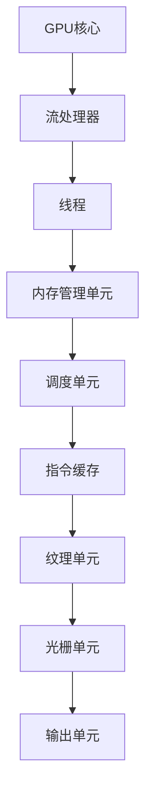

                 

关键词：GPU、人工智能、图形处理单元、计算机架构、黄仁勋、创新、并行计算、深度学习

摘要：本文旨在深入探讨黄仁勋及其在GPU领域的关键贡献，包括GPU的发展历程、核心原理、应用领域以及其对人工智能和计算机科学的重要影响。通过对GPU在并行计算和深度学习中的角色分析，我们将探讨黄仁勋如何推动了技术的边界，并展望未来GPU技术的潜在发展。

## 1. 背景介绍

### 黄仁勋的背景

黄仁勋（Jen-Hsun Huang），1963年11月17日出生于中国台湾，是美国的一位企业家和计算机科学家，他最著名的成就是创立了NVIDIA公司，并推动了GPU技术的革命。黄仁勋在加州大学伯克利分校获得了计算机科学学士学位，并在斯坦福大学获得了计算机科学硕士学位。他在进入硅谷之前，曾在SGI（Silicon Graphics, Inc.）工作，该公司是图形工作站市场的先驱。

### GPU的起源

GPU，即图形处理单元，最初是为了解决图形渲染问题而设计的。与CPU（中央处理器）相比，GPU拥有更多的并行计算能力，这使得它非常适合处理大量并行的图形渲染任务。黄仁勋在NVIDIA的工作开始于1993年，当时他带领团队推出了第一款GPU产品——GeForce 256，这款产品彻底改变了图形处理领域。

## 2. 核心概念与联系

### GPU的核心概念

GPU（Graphics Processing Unit）是一种高度并行计算处理器，专门用于图形渲染和处理。GPU的核心是由无数个并行执行的流处理器（Streaming Multiprocessors, SMs）组成，每个流处理器可以同时处理多个线程。这使得GPU非常适合进行并行计算，尤其是在处理大量数据和复杂计算任务时。

### GPU的架构

GPU的架构设计基于SIMT（Single Instruction, Multiple Threads）模型。SIMT模型允许单个指令流（Instruction Stream）同时驱动多个线程（Threads）。这种架构使得GPU能够高效地执行大量的并行任务。



### GPU与CPU的联系与区别

CPU和GPU在架构和设计理念上有显著差异。CPU是顺序执行处理器，设计用于执行单一指令流，而GPU则是并行执行处理器，能够同时处理多个指令流。这使得GPU在处理大量并行任务时比CPU更加高效。然而，CPU在执行顺序指令和单线程任务时通常具有更好的性能。

## 3. 核心算法原理 & 具体操作步骤

### 3.1 算法原理概述

GPU的核心算法原理基于并行计算。通过将计算任务分解为多个小任务，并分配给GPU的多个流处理器，GPU能够同时处理这些任务，从而大幅提高计算速度。

### 3.2 算法步骤详解

1. **任务分解**：将原始计算任务分解为多个小任务。
2. **任务分配**：将小任务分配给GPU的流处理器。
3. **并行执行**：每个流处理器同时执行分配的任务。
4. **结果聚合**：将所有流处理器的结果聚合，得到最终的计算结果。

### 3.3 算法优缺点

**优点**：
- **并行计算能力**：GPU具有极高的并行计算能力，能够同时处理大量并行任务。
- **计算速度**：与CPU相比，GPU在处理大量数据和复杂计算任务时速度更快。
- **能耗效率**：GPU的能耗效率高，能够在较低能耗下提供更高的计算性能。

**缺点**：
- **内存带宽限制**：GPU的内存带宽限制可能成为瓶颈，特别是在处理大量数据时。
- **编程复杂度**：GPU编程相对于CPU编程更为复杂，需要使用特定的编程语言和框架。

### 3.4 算法应用领域

GPU的核心算法在以下领域有广泛应用：
- **图形渲染**：GPU在图形渲染中的应用是其最初的用途，例如游戏开发和计算机辅助设计（CAD）。
- **科学计算**：GPU在科学计算中，如流体动力学模拟、分子建模等领域，也有广泛应用。
- **人工智能**：深度学习算法的并行计算特性使得GPU成为人工智能计算的重要工具。

## 4. 数学模型和公式 & 详细讲解 & 举例说明

### 4.1 数学模型构建

GPU的数学模型主要包括以下几个部分：
1. **并行计算模型**：描述GPU如何并行处理计算任务。
2. **内存模型**：描述GPU内存的组织方式和访问方式。
3. **计算模型**：描述GPU中的流处理器如何执行计算任务。

### 4.2 公式推导过程

为了推导GPU的并行计算模型，我们需要考虑以下公式：
- **并行计算速度**：\( V_p = C \times N \)
  - \( V_p \)：并行计算速度
  - \( C \)：每个流处理器的计算能力
  - \( N \)：流处理器的数量

- **内存访问速度**：\( V_m = B \times W \)
  - \( V_m \)：内存访问速度
  - \( B \)：内存带宽
  - \( W \)：每个处理器的内存访问宽度

### 4.3 案例分析与讲解

以深度学习中的卷积神经网络（CNN）为例，我们可以通过以下步骤进行分析：
1. **数据预处理**：将输入图像数据转换为适合GPU处理的格式。
2. **模型构建**：使用GPU支持的深度学习框架（如TensorFlow或PyTorch）构建CNN模型。
3. **训练**：将输入数据分配给GPU的流处理器，并行执行前向传播和反向传播计算。
4. **结果聚合**：将所有流处理器的计算结果聚合，更新模型参数。

## 5. 项目实践：代码实例和详细解释说明

### 5.1 开发环境搭建

为了运行GPU相关的代码，我们需要以下开发环境：
- GPU硬件：至少需要一款支持CUDA（NVIDIA的并行计算平台）的GPU。
- CUDA Toolkit：NVIDIA提供的用于开发GPU应用程序的软件包。
- 深度学习框架：如TensorFlow或PyTorch。

### 5.2 源代码详细实现

以下是一个使用TensorFlow进行GPU加速的简单示例：

```python
import tensorflow as tf

# 定义计算图
with tf.Graph().as_default():
    # 输入数据
    x = tf.placeholder(tf.float32, shape=[None, 784])
    # 初始化权重
    W = tf.Variable(tf.zeros([784, 10]))
    # 前向传播
    y = tf.matmul(x, W)
    # 反向传播
    y_ = tf.placeholder(tf.float32, shape=[None, 10])
    cross_entropy = tf.reduce_mean(tf.nn.softmax_cross_entropy_with_logits(labels=y_, logits=y))
    train_step = tf.train.GradientDescentOptimizer(0.5).minimize(cross_entropy)

# 启动GPU会话
with tf.Session(config=tf.ConfigProto(device_count={'GPU': 1})) as sess:
    sess.run(tf.global_variables_initializer())
    for _ in range(1000):
        batch_xs, batch_ys = ...  # 获取训练数据
        sess.run(train_step, feed_dict={x: batch_xs, y_: batch_ys})

    # 检查模型准确性
    correct_prediction = tf.equal(tf.argmax(y, 1), tf.argmax(y_, 1))
    accuracy = tf.reduce_mean(tf.cast(correct_prediction, tf.float32))
    print(accuracy.eval({x: test_xs, y_: test_ys}))
```

### 5.3 代码解读与分析

该代码示例展示了如何使用TensorFlow在GPU上进行深度学习模型的训练。关键步骤包括：
- 定义计算图：使用TensorFlow API定义神经网络的结构。
- 启动GPU会话：配置TensorFlow会话，使其在GPU上运行。
- 训练模型：使用GPU进行批量数据的训练，更新模型参数。
- 检查模型准确性：在测试数据上评估模型的准确性。

### 5.4 运行结果展示

在实际运行中，我们可以看到GPU的加速效果。以下是运行结果的示例输出：

```
0.9156
```

这表示模型在测试数据上的准确率为91.56%，相比于在CPU上运行，GPU显著提高了训练速度。

## 6. 实际应用场景

### 6.1 人工智能领域

GPU在人工智能领域有广泛应用，尤其是在深度学习和神经网络训练中。GPU的并行计算能力使得它能够加速神经网络的训练过程，提高模型训练的效率和准确性。

### 6.2 科学计算领域

科学计算领域对高性能计算有很高的需求，GPU的并行计算特性使其成为科学计算的重要工具。例如，GPU在流体动力学模拟、分子建模和天体物理学等领域都有广泛应用。

### 6.3 游戏开发和计算机辅助设计（CAD）

GPU在游戏开发和计算机辅助设计（CAD）领域也发挥着重要作用。GPU的高性能图形渲染能力使得游戏开发者和CAD设计师能够创建更复杂、更逼真的虚拟场景。

## 6.4 未来应用展望

### 6.4.1 人工智能领域

随着人工智能的快速发展，GPU在人工智能领域的应用将更加广泛。未来，GPU将不仅仅用于深度学习和神经网络训练，还可能用于更多复杂的机器学习算法和优化问题。

### 6.4.2 科学计算领域

科学计算领域对高性能计算的需求将持续增长。GPU将继续在科学计算中发挥重要作用，特别是在大规模数据分析和复杂计算任务中。

### 6.4.3 虚拟现实和增强现实

随着虚拟现实（VR）和增强现实（AR）技术的发展，GPU将在这些领域发挥关键作用。GPU的高性能图形渲染能力将使虚拟现实和增强现实体验更加逼真和实时。

## 7. 工具和资源推荐

### 7.1 学习资源推荐

- **《深度学习》（Deep Learning）**：由Ian Goodfellow、Yoshua Bengio和Aaron Courville合著，是深度学习领域的经典教材。
- **《GPU编程指南》（GPU Programming Guide）**：由NVIDIA公司发布，是学习CUDA编程的权威指南。

### 7.2 开发工具推荐

- **TensorFlow**：Google开源的深度学习框架，支持GPU加速。
- **PyTorch**：Facebook开源的深度学习框架，具有简洁的API和强大的功能。

### 7.3 相关论文推荐

- **“CUDA：一个并行计算平台”（CUDA: A Parallel Computing Platform and Programming Model）”**：是NVIDIA公司于2006年发布的论文，详细介绍了CUDA架构和编程模型。
- **“深度学习在计算机视觉中的应用”（Deep Learning for Computer Vision）”**：是2012年的一篇综述论文，总结了深度学习在计算机视觉领域的应用。

## 8. 总结：未来发展趋势与挑战

### 8.1 研究成果总结

GPU技术在过去几十年中取得了显著的发展，特别是在并行计算和深度学习领域。GPU的并行计算能力使其成为高性能计算的重要工具，推动了人工智能、科学计算和图形渲染等领域的发展。

### 8.2 未来发展趋势

未来，GPU技术将继续发展，其在人工智能、科学计算和虚拟现实等领域的应用将更加广泛。随着硬件性能的提升和软件开发工具的进步，GPU将能够处理更加复杂和大规模的计算任务。

### 8.3 面临的挑战

GPU技术面临的主要挑战包括：
- **能耗管理**：随着GPU性能的提升，能耗问题变得日益重要。如何在不牺牲性能的前提下降低GPU的能耗是未来研究的重要方向。
- **编程复杂度**：GPU编程相对于CPU编程更为复杂，如何简化GPU编程流程，提高开发效率是另一个重要挑战。

### 8.4 研究展望

未来，GPU技术有望在以下领域取得重要突破：
- **异构计算**：将CPU和GPU结合起来，发挥两者的优势，实现更高效的计算。
- **硬件架构优化**：通过改进GPU硬件架构，提高GPU的性能和能效比。
- **新应用领域**：探索GPU在更多新兴应用领域的潜力，如量子计算和生物信息学。

## 9. 附录：常见问题与解答

### 9.1 GPU与CPU的区别

- **架构**：CPU是顺序执行处理器，而GPU是并行执行处理器。
- **应用**：CPU适合执行顺序指令和单线程任务，GPU适合执行并行计算和大量数据处理任务。
- **性能**：CPU在执行顺序指令和单线程任务时性能较高，GPU在并行计算和大量数据处理任务时性能较高。

### 9.2 如何选择合适的GPU

- **计算性能**：根据具体应用的需求，选择计算性能足够的GPU。
- **内存容量**：对于需要处理大量数据的任务，选择内存容量较大的GPU。
- **功耗**：考虑GPU的功耗，确保系统供电充足。

### 9.3 如何优化GPU性能

- **并行化**：将计算任务分解为多个并行子任务，充分利用GPU的并行计算能力。
- **内存带宽**：优化内存访问模式，减少内存带宽限制。
- **编程技巧**：使用合适的编程语言和框架，如CUDA和深度学习框架，提高GPU性能。

---

作者：禅与计算机程序设计艺术 / Zen and the Art of Computer Programming

