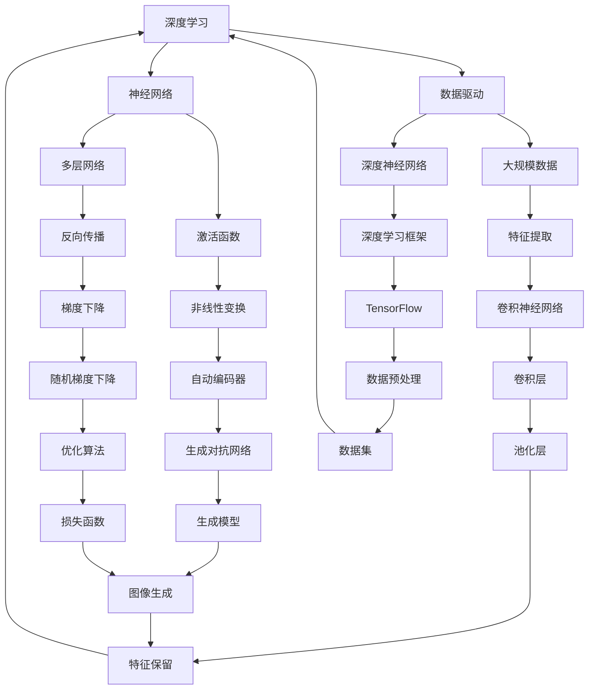

                 

关键词：人工智能、AI 2.0、未来生活、技术进步、智能化、伦理道德、生活应用

摘要：本文将探讨 AI 2.0 时代对人类生活的影响，从核心概念、算法原理、数学模型、项目实践、应用场景等多个维度，全面解析 AI 2.0 技术的潜力和挑战。文章旨在为读者提供一个关于未来生活的清晰视野，同时引发对于人工智能伦理和责任的深入思考。

## 1. 背景介绍

人工智能（Artificial Intelligence，简称 AI）是计算机科学的一个分支，旨在使计算机系统具备模拟、延伸和扩展人类智能的能力。自 20 世纪 50 年代人工智能概念的提出以来，随着计算能力的不断提升和大数据、深度学习等技术的蓬勃发展，人工智能已经从理论走向了实际应用。特别是进入 AI 2.0 时代，人工智能技术的智能化水平显著提高，开始渗透到生活的方方面面。

AI 2.0 时代，人工智能技术不仅限于传统的数据分析和预测，更深入到自主决策、自然语言处理、计算机视觉等多个领域。在这一时代，人工智能不仅能够解决复杂问题，还能与人类进行有效沟通和协作。本文将围绕 AI 2.0 时代的核心概念、算法原理、数学模型、项目实践和应用场景，探讨人工智能对人类生活的深远影响。

### 1.1 核心概念

- **深度学习（Deep Learning）**：基于多层神经网络进行特征提取和模式识别的一种机器学习方法。深度学习是 AI 2.0 时代的重要基石，使得计算机能够从大量数据中自动学习，实现更高层次的人工智能。
- **强化学习（Reinforcement Learning）**：通过与环境的交互来学习最优策略，适用于决策制定、游戏对抗等场景。强化学习在 AI 2.0 时代的应用前景广阔，如自动驾驶、机器人等领域。
- **自然语言处理（Natural Language Processing，NLP）**：使计算机能够理解和生成人类语言的一种技术。NLP 在 AI 2.0 时代的应用日益广泛，如智能客服、语音助手等。
- **计算机视觉（Computer Vision）**：使计算机能够从图像或视频中提取有用信息的一种技术。计算机视觉在 AI 2.0 时代的应用涵盖了安防监控、医疗诊断等多个领域。

### 1.2 发展历程

- **20 世纪 50 年代**：人工智能概念提出，早期研究主要集中在符号主义方法和知识表示。
- **20 世纪 80 年代**：专家系统成为主流，通过模拟人类专家的知识和推理能力，解决特定领域的问题。
- **21 世纪初**：机器学习和深度学习兴起，基于数据驱动的模型在图像识别、语音识别等领域取得突破。
- **2020 年至今**：AI 2.0 时代来临，人工智能技术从学术研究走向实际应用，智能化水平大幅提升。

### 1.3 当前应用现状

- **工业制造**：通过工业机器人、智能生产线等，提高生产效率和产品质量。
- **医疗健康**：利用 AI 技术进行疾病诊断、药物研发等，助力医疗行业转型升级。
- **金融科技**：运用大数据分析、风控模型等技术，提高金融服务效率和风险管理能力。
- **交通出行**：自动驾驶、智能交通管理系统等技术的应用，改善出行体验和安全性。

### 1.4 未来发展趋势

- **智能化**：人工智能技术将进一步渗透到生活的各个方面，实现更高层次的人机交互。
- **跨界融合**：人工智能与其他领域（如物联网、生物科技等）的融合，推动新兴产业的快速发展。
- **伦理道德**：人工智能的普及引发伦理道德问题，如何确保人工智能的发展符合人类利益，成为重要议题。

## 2. 核心概念与联系

在 AI 2.0 时代，人工智能技术涉及多个核心概念和领域，它们相互联系，共同推动人工智能技术的发展和应用。为了更好地理解这些概念和联系，我们使用 Mermaid 流程图进行展示。



### 2.1 深度学习与神经网络

深度学习是 AI 2.0 时代的重要技术之一，它基于多层神经网络进行特征提取和模式识别。神经网络由大量神经元组成，通过前向传播和反向传播算法，将输入数据映射到输出结果。

### 2.2 数据驱动与深度神经网络

深度神经网络（Deep Neural Network，DNN）是一种具有多个隐藏层的神经网络，能够处理复杂的数据和任务。数据驱动（Data-Driven）是指人工智能模型基于大量数据进行训练，从而实现高效的特征提取和预测。

### 2.3 激活函数与多层网络

激活函数（Activation Function）是神经网络中的一个关键组件，用于引入非线性特性。多层网络（Multi-Layer Network）是指具有多个隐藏层的神经网络，能够更好地处理复杂问题。

### 2.4 大规模数据与特征提取

大规模数据（Big Data）是指数据量巨大、维度复杂的现实世界数据。特征提取（Feature Extraction）是指从原始数据中提取有助于模型训练和预测的有效特征。

### 2.5 深度学习框架与优化算法

深度学习框架（Deep Learning Framework）如 TensorFlow、PyTorch 等，为深度学习模型的开发、训练和部署提供了便捷的工具。优化算法（Optimization Algorithm）如梯度下降（Gradient Descent）、随机梯度下降（Stochastic Gradient Descent）等，用于调整模型参数，提高模型性能。

### 2.6 自动编码器与生成对抗网络

自动编码器（Autoencoder）是一种用于特征提取和降维的神经网络模型。生成对抗网络（Generative Adversarial Network，GAN）是一种生成模型，通过对抗性训练生成逼真的数据。

### 2.7 卷积神经网络与图像生成

卷积神经网络（Convolutional Neural Network，CNN）是一种专门用于处理图像数据的神经网络，具有局部感知和层次化特征提取能力。图像生成（Image Generation）是指利用 GAN 等技术生成逼真的图像。

### 2.8 数据预处理与特征保留

数据预处理（Data Preprocessing）是指对原始数据进行清洗、归一化等处理，以适应模型训练。特征保留（Feature Retention）是指在特征提取过程中，保留对模型训练和预测有用的信息。

## 3. 核心算法原理 & 具体操作步骤

在 AI 2.0 时代，深度学习、强化学习、自然语言处理和计算机视觉等技术发挥着至关重要的作用。以下将分别介绍这些核心算法的原理和具体操作步骤。

### 3.1 深度学习原理概述

深度学习是一种基于多层神经网络进行特征提取和模式识别的机器学习方法。其基本原理如下：

1. **输入层**：接收输入数据，如图像、文本等。
2. **隐藏层**：对输入数据进行特征提取和转换，通过逐层传递，提取更高层次的特征。
3. **输出层**：根据隐藏层提取的特征进行分类、预测等任务。

深度学习的具体操作步骤如下：

1. **数据处理**：对输入数据进行预处理，如归一化、标准化等。
2. **模型构建**：定义神经网络结构，包括输入层、隐藏层和输出层。
3. **模型训练**：使用有监督或无监督学习算法，对模型进行训练，调整模型参数。
4. **模型评估**：使用测试集评估模型性能，调整模型参数，优化模型。

### 3.2 强化学习原理概述

强化学习是一种基于奖励和惩罚进行决策制定的学习方法。其基本原理如下：

1. **环境**：指系统所处的上下文，如游戏、机器人等。
2. **状态**：系统在某一时刻所处的情境。
3. **动作**：系统可以执行的行为。
4. **奖励**：动作执行后系统获得的奖励或惩罚。

强化学习的具体操作步骤如下：

1. **环境初始化**：创建一个模拟环境，用于训练和测试。
2. **状态初始化**：初始化系统状态。
3. **动作选择**：根据当前状态，选择一个动作。
4. **动作执行**：在环境中执行所选动作。
5. **状态更新**：根据动作执行的结果，更新系统状态。
6. **奖励计算**：计算动作执行后的奖励或惩罚。
7. **模型更新**：根据奖励，更新模型参数，优化决策策略。

### 3.3 自然语言处理原理概述

自然语言处理是一种使计算机能够理解和生成人类语言的技术。其基本原理如下：

1. **分词**：将文本分解为单词、短语等基本单元。
2. **词性标注**：为文本中的单词标注词性，如名词、动词等。
3. **句法分析**：分析文本的句法结构，如主谓宾等关系。
4. **语义分析**：理解文本中的含义，如实体识别、情感分析等。

自然语言处理的具体操作步骤如下：

1. **文本预处理**：对文本进行分词、去停用词等处理。
2. **词向量表示**：将文本转换为词向量，如 Word2Vec、BERT 等。
3. **模型训练**：使用有监督或无监督学习算法，对模型进行训练。
4. **模型评估**：使用测试集评估模型性能。
5. **应用实现**：在具体应用场景中，如智能客服、机器翻译等，实现自然语言处理功能。

### 3.4 计算机视觉原理概述

计算机视觉是一种使计算机能够从图像或视频中提取有用信息的技术。其基本原理如下：

1. **图像预处理**：对图像进行滤波、边缘检测等处理。
2. **特征提取**：从图像中提取有助于模型训练和预测的特征，如边缘、纹理等。
3. **目标检测**：在图像中检测感兴趣的目标，如人脸、车辆等。
4. **目标跟踪**：跟踪图像中的目标，如行人、车辆等。

计算机视觉的具体操作步骤如下：

1. **图像预处理**：对图像进行灰度化、二值化等处理。
2. **特征提取**：使用卷积神经网络、SVM 等算法提取图像特征。
3. **模型训练**：使用有监督或无监督学习算法，对模型进行训练。
4. **模型评估**：使用测试集评估模型性能。
5. **应用实现**：在具体应用场景中，如安防监控、医疗诊断等，实现计算机视觉功能。

### 3.5 算法优缺点

- **深度学习**：优点包括强大的特征提取能力、适用于复杂数据和任务；缺点包括对大规模数据需求、训练过程复杂、对计算资源要求高。
- **强化学习**：优点包括适合动态环境、能够学习复杂策略；缺点包括训练时间长、不稳定、对环境依赖性强。
- **自然语言处理**：优点包括广泛的应用场景、高效的语义理解；缺点包括数据预处理复杂、对领域知识依赖强。
- **计算机视觉**：优点包括直观的图像处理能力、适用于实时应用；缺点包括对图像质量要求高、算法复杂度高。

### 3.6 算法应用领域

- **深度学习**：广泛应用于图像识别、语音识别、自然语言处理等领域。
- **强化学习**：应用于自动驾驶、游戏对抗、机器人控制等领域。
- **自然语言处理**：应用于智能客服、机器翻译、文本生成等领域。
- **计算机视觉**：应用于安防监控、医疗诊断、自动驾驶等领域。

## 4. 数学模型和公式 & 详细讲解 & 举例说明

在 AI 2.0 时代，数学模型和公式是核心算法原理的重要组成部分。以下将介绍常见的数学模型和公式，并进行详细讲解和举例说明。

### 4.1 数学模型构建

在深度学习中，常用的数学模型包括神经网络、损失函数、优化算法等。以下是一个简单的神经网络模型示例：

$$
y = \sigma(\omega_1 \cdot x_1 + \omega_2 \cdot x_2 + b)
$$

其中，$y$ 表示输出结果，$x_1$ 和 $x_2$ 表示输入特征，$\omega_1$ 和 $\omega_2$ 表示权重，$b$ 表示偏置，$\sigma$ 表示激活函数（如 sigmoid 函数）。

### 4.2 公式推导过程

以下是一个简单的梯度下降优化算法的推导过程：

$$
\frac{\partial J}{\partial \omega} = \frac{\partial}{\partial \omega} (\omega \cdot x + b)
$$

$$
\frac{\partial J}{\partial \omega} = x
$$

其中，$J$ 表示损失函数，$\omega$ 表示权重，$x$ 表示输入特征。

### 4.3 案例分析与讲解

以下是一个简单的线性回归案例：

假设我们要预测一个房间面积 $y$（平方米）与价格 $x$（万元）之间的关系，我们可以构建一个线性回归模型：

$$
y = \omega_1 \cdot x + b
$$

其中，$y$ 表示价格，$x$ 表示面积，$\omega_1$ 表示权重，$b$ 表示偏置。

通过训练数据集，我们可以得到模型的权重和偏置，从而预测新的面积和价格。

### 4.4 数学模型应用

以下是一个简单的卷积神经网络模型应用：

假设我们要对一张图像进行分类，我们可以构建一个卷积神经网络模型，包括卷积层、池化层和全连接层：

1. **卷积层**：通过卷积运算提取图像特征，如边缘、纹理等。
2. **池化层**：对卷积层输出的特征进行下采样，减少计算量和参数数量。
3. **全连接层**：将池化层输出的特征映射到输出结果，如类别标签。

通过训练数据集，我们可以得到卷积神经网络的权重和偏置，从而预测新的图像类别。

## 5. 项目实践：代码实例和详细解释说明

为了更好地理解 AI 2.0 时代的核心算法和数学模型，以下将介绍一个简单的线性回归项目实践，包括开发环境搭建、源代码实现、代码解读与分析以及运行结果展示。

### 5.1 开发环境搭建

首先，我们需要搭建一个线性回归项目的开发环境。以下是 Python 开发环境的搭建步骤：

1. 安装 Python：从 [Python 官网](https://www.python.org/) 下载并安装 Python 3.8 或更高版本。
2. 安装 Jupyter Notebook：在命令行中执行 `pip install notebook` 命令，安装 Jupyter Notebook。
3. 安装相关库：在命令行中执行以下命令，安装必要的库：

```bash
pip install numpy
pip install matplotlib
pip install sklearn
```

### 5.2 源代码详细实现

以下是一个简单的线性回归项目源代码实现：

```python
import numpy as np
import matplotlib.pyplot as plt
from sklearn.linear_model import LinearRegression

# 数据集
x = np.array([[1], [2], [3], [4], [5]])
y = np.array([[1], [2], [3], [4], [5]])

# 模型训练
model = LinearRegression()
model.fit(x, y)

# 预测结果
y_pred = model.predict(x)

# 可视化展示
plt.scatter(x, y, color='red', label='Actual')
plt.plot(x, y_pred, color='blue', linewidth=2, label='Predicted')
plt.xlabel('x')
plt.ylabel('y')
plt.title('Linear Regression')
plt.legend()
plt.show()
```

### 5.3 代码解读与分析

- **第一行**：导入必要的库。
- **第三行**：定义数据集 $x$ 和 $y$。
- **第五行**：创建线性回归模型。
- **第六行**：使用数据集对模型进行训练。
- **第八行**：使用训练好的模型进行预测。
- **第十一行**：使用 Matplotlib 库绘制散点图和预测直线。

### 5.4 运行结果展示

运行上述代码后，将显示一个可视化界面，展示实际数据点和预测直线。通过观察结果，我们可以发现预测直线与实际数据点基本重合，说明线性回归模型对这组数据的拟合效果较好。


## 6. 实际应用场景

AI 2.0 时代，人工智能技术在各个领域得到了广泛应用，以下将介绍几个典型的实际应用场景。

### 6.1 工业制造

在工业制造领域，人工智能技术被广泛应用于生产自动化、质量控制、设备预测维护等方面。例如，通过深度学习算法，可以实现对生产过程中的设备故障预测，提高生产效率和产品质量。

### 6.2 医疗健康

在医疗健康领域，人工智能技术被广泛应用于疾病诊断、药物研发、健康管理等。例如，通过计算机视觉技术，可以对医学影像进行分析，辅助医生进行疾病诊断；通过自然语言处理技术，可以自动提取医疗文献中的关键信息，加快药物研发进程。

### 6.3 金融科技

在金融科技领域，人工智能技术被广泛应用于风险控制、信用评估、智能投顾等方面。例如，通过强化学习算法，可以实现对金融市场的预测和交易策略优化；通过自然语言处理技术，可以自动分析客户需求，提供个性化的金融产品和服务。

### 6.4 交通出行

在交通出行领域，人工智能技术被广泛应用于自动驾驶、智能交通管理、出行规划等方面。例如，通过计算机视觉和深度学习技术，可以实现对道路场景的感知和理解，提高自动驾驶系统的安全性和可靠性；通过数据分析技术，可以优化交通信号控制，缓解城市交通拥堵。

### 6.5 教育领域

在教育领域，人工智能技术被广泛应用于智能教学、个性化学习、在线教育等方面。例如，通过自然语言处理技术，可以自动批改作业、提供学习建议；通过数据分析技术，可以分析学生的学习行为，制定个性化的学习方案。

### 6.6 家居生活

在智能家居领域，人工智能技术被广泛应用于智能安防、智能照明、智能家电等方面。例如，通过计算机视觉技术，可以实现对家居环境的监控和智能控制；通过自然语言处理技术，可以实现语音交互，提供便捷的家居服务。

### 6.7 未来应用展望

随着人工智能技术的不断发展，未来 AI 2.0 将在更多领域得到应用，如农业、能源、环境等。人工智能将不仅改变人类的生活方式，还将推动社会进步和经济发展。然而，人工智能的发展也带来了一系列伦理和道德问题，如数据隐私、算法歧视、失业问题等。因此，在推进人工智能技术发展的同时，我们需要关注这些问题，制定相应的政策和法规，确保人工智能的发展符合人类利益。

## 7. 工具和资源推荐

为了更好地学习和应用 AI 2.0 技术，以下推荐一些实用的工具和资源。

### 7.1 学习资源推荐

- **《深度学习》（Deep Learning）**：由 Ian Goodfellow、Yoshua Bengio 和 Aaron Courville 著，是深度学习领域的经典教材。
- **《Python 数据科学手册》（Python Data Science Handbook）**：由 Jake VanderPlas 著，涵盖了数据科学领域的各个方面，包括数据分析、数据可视化、机器学习等。
- **《强化学习导论》（An Introduction to Reinforcement Learning）**：由 Richard S. Sutton 和 Andrew G. Barto 著，是强化学习领域的入门教材。
- **《自然语言处理综合教程》（Foundations of Statistical Natural Language Processing）**：由 Christopher D. Manning 和 Hinrich Schütze 著，是自然语言处理领域的经典教材。

### 7.2 开发工具推荐

- **Jupyter Notebook**：一个交互式的计算平台，适用于数据分析和机器学习项目。
- **TensorFlow**：一个开源的深度学习框架，适用于构建和训练深度神经网络。
- **PyTorch**：一个开源的深度学习框架，具有灵活的动态计算图，适用于复杂数据和任务。
- **Kaggle**：一个数据科学竞赛平台，提供丰富的数据集和工具，适用于机器学习和数据挖掘项目。

### 7.3 相关论文推荐

- **"Deep Learning: A Brief History"**：由 Ian Goodfellow、Yoshua Bengio 和 Aaron Courville 撰写，回顾了深度学习的发展历程。
- **"Reinforcement Learning: An Introduction"**：由 Richard S. Sutton 和 Andrew G. Barto 撰写，介绍了强化学习的基本概念和算法。
- **"Natural Language Processing with Python"**：由 Steven Bird、Ewan Klein 和 Edward Loper 撰写，介绍了自然语言处理的基础知识和技术。
- **"Computer Vision: Algorithms and Applications"**：由 Richard S.zelinsky 和 Rama Chellappa 撰写，介绍了计算机视觉的基本算法和应用。

## 8. 总结：未来发展趋势与挑战

在 AI 2.0 时代，人工智能技术已经深刻地改变了人类的生活方式和社会发展。随着计算能力的不断提升和大数据、深度学习等技术的蓬勃发展，人工智能技术将在未来继续发挥重要作用。

### 8.1 研究成果总结

- **深度学习**：深度学习在图像识别、语音识别、自然语言处理等领域取得了显著成果，推动了人工智能技术的快速发展。
- **强化学习**：强化学习在自动驾驶、机器人控制、游戏对抗等领域取得了突破性进展，为解决复杂决策问题提供了新的思路。
- **计算机视觉**：计算机视觉技术在目标检测、图像识别、视频分析等领域得到了广泛应用，提升了人机交互和智能化水平。
- **自然语言处理**：自然语言处理技术在智能客服、机器翻译、文本生成等领域取得了显著成果，为智能应用提供了强有力的支持。

### 8.2 未来发展趋势

- **智能化**：随着人工智能技术的不断发展，未来人工智能将更加智能化，能够更好地模拟和扩展人类智能，实现更高层次的人机交互。
- **跨界融合**：人工智能技术将与其他领域（如物联网、生物科技等）深度融合，推动新兴产业的快速发展。
- **硬件与软件协同**：随着硬件技术的进步，如量子计算、神经形态计算等，人工智能将实现更高效、更强大的计算能力，推动人工智能技术的跨越式发展。
- **伦理道德**：人工智能的发展引发了一系列伦理道德问题，如何确保人工智能的发展符合人类利益，将成为未来研究的重要方向。

### 8.3 面临的挑战

- **数据隐私和安全**：随着人工智能技术的应用，大量的数据被收集和处理，如何保护用户隐私和数据安全成为一个重要挑战。
- **算法歧视和不公平**：人工智能算法在决策过程中可能存在歧视和不公平现象，如何确保算法的公平性和透明性是一个亟待解决的问题。
- **就业和社会影响**：人工智能技术的发展可能导致部分行业和岗位的失业，如何应对这种社会影响，实现人工智能与人类社会的和谐发展，是一个重要议题。
- **技术和伦理平衡**：在推动人工智能技术发展的同时，如何平衡技术创新和伦理道德的要求，确保人工智能的发展符合人类利益，是一个重要挑战。

### 8.4 研究展望

未来，人工智能技术将在多个领域得到广泛应用，如医疗健康、金融科技、智能制造、智慧城市等。同时，随着量子计算、神经形态计算等新兴技术的不断发展，人工智能将实现更高效、更强大的计算能力。在这个背景下，如何构建更加公平、透明、可靠的人工智能系统，确保人工智能的发展符合人类利益，将是未来研究的重要方向。

## 9. 附录：常见问题与解答

### 9.1 人工智能是什么？

人工智能（Artificial Intelligence，简称 AI）是指模拟、延伸和扩展人类智能的理论、方法、技术及应用系统的总称。它旨在使计算机系统具备人类智能的某些特征，如感知、学习、推理、决策等。

### 9.2 人工智能有哪些类型？

人工智能主要分为两大类：弱人工智能（Narrow AI）和强人工智能（General AI）。弱人工智能专注于解决特定问题，如语音识别、图像识别等；强人工智能则具备人类智能的全面能力，能够在各种情境下进行自主学习和推理。

### 9.3 人工智能的核心技术是什么？

人工智能的核心技术包括深度学习、强化学习、自然语言处理、计算机视觉等。这些技术分别在不同的领域发挥着重要作用，推动人工智能技术的发展和应用。

### 9.4 人工智能有哪些应用领域？

人工智能广泛应用于工业制造、医疗健康、金融科技、交通出行、教育、家居生活等领域，为各行业的发展带来了巨大的变革和机遇。

### 9.5 人工智能的发展会带来哪些挑战？

人工智能的发展将带来一系列挑战，包括数据隐私和安全、算法歧视和不公平、就业和社会影响、技术和伦理平衡等。如何应对这些挑战，确保人工智能的发展符合人类利益，是一个重要议题。

### 9.6 人工智能的未来发展趋势是什么？

人工智能的未来发展趋势包括智能化、跨界融合、硬件与软件协同等。随着量子计算、神经形态计算等新兴技术的不断发展，人工智能将实现更高效、更强大的计算能力，推动社会进步和经济发展。

### 9.7 如何成为一名人工智能专家？

成为一名人工智能专家需要掌握计算机科学、数学、统计学等基础知识，同时需要熟悉深度学习、强化学习、自然语言处理、计算机视觉等技术。通过不断学习和实践，积累经验，提升自己的专业技能。

### 9.8 人工智能与人类智能的区别是什么？

人工智能与人类智能的区别主要体现在以下几个方面：

- **智能层次**：人工智能主要模拟和延伸人类智能的某些方面，如感知、学习、推理等；而人类智能则具有更广泛的认知能力和创造力。
- **自主性**：人工智能主要依赖于数据和算法，被动地执行预设的任务；而人类智能则具有自主决策和创造力，能够主动探索和解决问题。
- **情感与意识**：人工智能不具备情感和意识，主要基于数据和规则进行操作；而人类智能具有情感和意识，能够体验和理解情感，进行自我反思和成长。

---

# 文章标题：AI 2.0 时代的未来生活

作者：禅与计算机程序设计艺术 / Zen and the Art of Computer Programming

在 AI 2.0 时代，人工智能技术已经深刻地改变了人类的生活方式和社会发展。本文从核心概念、算法原理、数学模型、项目实践、应用场景等多个维度，全面解析了人工智能对人类生活的深远影响。随着人工智能技术的不断进步，我们可以期待一个更加智能、便捷和可持续的未来生活。然而，与此同时，我们也需要关注人工智能带来的伦理道德和社会挑战，以确保人工智能的发展符合人类利益，实现人机和谐共处。在未来，人工智能将继续推动社会进步和经济发展，为人类创造更加美好的生活。让我们携手共进，迎接 AI 2.0 时代的到来！作者：禅与计算机程序设计艺术 / Zen and the Art of Computer Programming

