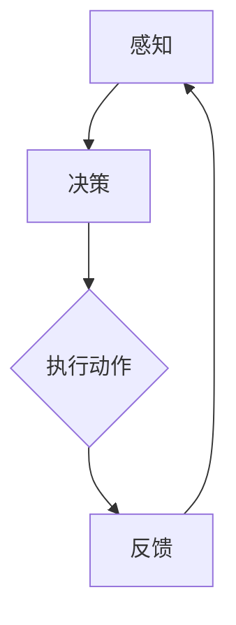

                 

关键词：（AI Agent，深度学习，早期萌芽，技术发展，应用场景，未来展望）

摘要：本文旨在探讨AI Agent作为人工智能领域的新兴技术，从其早期萌芽阶段到现代深度学习的演进过程。文章将分析AI Agent的核心概念、发展历程、算法原理，并探讨其在实际应用中的潜力与挑战。

## 1. 背景介绍

### AI Agent的定义与早期萌芽

AI Agent，即人工智能代理，是能够模拟人类行为、具有自主决策能力的计算机程序。其概念最早可以追溯到20世纪50年代，当时的计算机科学家们开始探索如何让计算机拥有智能行为。

### 人工智能发展的早期阶段

人工智能的发展经历了几个重要的阶段：逻辑推理、知识表示、机器学习等。在早期阶段，人工智能主要是基于规则和逻辑推理的，这种方法的局限性很快显现出来，无法应对复杂、不确定的情境。

### AI Agent的兴起

随着计算能力的提升和算法的进步，特别是在深度学习技术的推动下，AI Agent开始成为人工智能研究的一个重要方向。AI Agent能够通过学习和经验积累，逐步提高其决策能力，为复杂任务提供解决方案。

## 2. 核心概念与联系

### AI Agent的核心概念

- 自主性：AI Agent能够自主决策，不受外部干预。
- 学习能力：AI Agent能够通过经验积累和学习不断改进自身。
- 知觉能力：AI Agent能够感知环境，获取必要的信息。

### AI Agent架构


Mermaid 流程图：



## 3. 核心算法原理 & 具体操作步骤

### 3.1 算法原理概述

AI Agent的核心算法包括感知、决策和执行三个步骤。感知是通过传感器获取环境信息，决策是基于感知信息选择最佳行动方案，执行是将决策转化为具体的行为。

### 3.2 算法步骤详解

#### 3.2.1 感知

感知阶段，AI Agent通过传感器（如摄像头、麦克风等）获取环境信息，如图像、声音、温度等。

#### 3.2.2 决策

决策阶段，AI Agent利用感知到的信息，通过机器学习算法，如深度学习、强化学习等，选择最佳行动方案。

#### 3.2.3 执行

执行阶段，AI Agent将决策转化为具体的行为，如移动、抓取等。

### 3.3 算法优缺点

#### 优点：

- 高效性：AI Agent能够快速处理大量信息。
- 自主性：AI Agent能够自主决策，减少人工干预。
- 智能化：AI Agent能够通过学习提高其决策能力。

#### 缺点：

- 复杂性：算法设计和管理复杂。
- 数据依赖：需要大量高质量的数据进行训练。

### 3.4 算法应用领域

AI Agent在诸多领域具有广泛的应用，包括但不限于：

- 自动驾驶：通过感知和决策，实现自动驾驶车辆的自主行驶。
- 客户服务：通过自然语言处理，提供智能客服服务。
- 游戏智能：通过强化学习，实现智能游戏玩家。

## 4. 数学模型和公式 & 详细讲解 & 举例说明

### 4.1 数学模型构建

AI Agent的数学模型主要包括感知模型、决策模型和执行模型。以下是感知模型的一个简单例子：

$$
P(E|S) = \frac{P(S|E)P(E)}{P(S)}
$$

其中，$P(E|S)$表示在给定传感器感知到状态$S$的情况下，环境状态$E$的概率；$P(S|E)$表示在环境状态$E$下，传感器感知到状态$S$的概率；$P(E)$和$P(S)$分别是环境状态$E$和传感器感知状态$S$的先验概率。

### 4.2 公式推导过程

感知模型的公式推导基于贝叶斯定理。贝叶斯定理是概率论中的一个基本公式，它描述了条件概率与边缘概率之间的关系。

### 4.3 案例分析与讲解

以自动驾驶为例，AI Agent需要感知道路环境、车辆状态等，并根据这些信息做出驾驶决策。以下是一个简化的案例：

假设AI Agent需要决定是否超车，感知到的信息包括前方车辆的速度、距离以及车道情况。根据这些信息，AI Agent可以通过感知模型计算超车的概率，并根据决策模型选择最佳行动方案。

## 5. 项目实践：代码实例和详细解释说明

### 5.1 开发环境搭建

在开始编写代码之前，我们需要搭建一个适合开发AI Agent的环境。以下是基本的步骤：

1. 安装Python环境。
2. 安装深度学习框架，如TensorFlow或PyTorch。
3. 安装必要的依赖库，如NumPy、Pandas等。

### 5.2 源代码详细实现

以下是一个简化的AI Agent代码示例，用于实现一个能够感知环境并做出决策的智能体。

```python
import tensorflow as tf
import numpy as np

# 感知模型
def perception_model(features):
    # 输入特征为环境状态，如道路、车辆等
    # 使用卷积神经网络进行特征提取
    model = tf.keras.Sequential([
        tf.keras.layers.Conv2D(32, (3, 3), activation='relu', input_shape=(64, 64, 3)),
        tf.keras.layers.MaxPooling2D(2, 2),
        tf.keras.layers.Conv2D(64, (3, 3), activation='relu'),
        tf.keras.layers.MaxPooling2D(2, 2),
        tf.keras.layers.Flatten(),
        tf.keras.layers.Dense(128, activation='relu'),
        tf.keras.layers.Dense(64, activation='relu'),
        tf.keras.layers.Dense(1, activation='sigmoid')
    ])
    return model

# 决策模型
def decision_model(perception_output):
    # 输入为感知模型的输出，即环境特征
    # 使用强化学习算法，如Q-learning，进行决策
    q_values = decision_model.q_network(perception_output)
    action = np.argmax(q_values)
    return action

# 执行模型
def execute_action(action):
    # 根据决策结果，执行具体动作
    if action == 0:
        # 停车
        print("停车")
    elif action == 1:
        # 直行
        print("直行")
    elif action == 2:
        # 超车
        print("超车")

# 主程序
def main():
    # 搭建感知模型
    perception = perception_model(input_shape=(64, 64, 3))

    # 搭建决策模型
    decision_model = DecisionModel()

    # 执行主循环
    while True:
        # 感知环境
        features = perceive_environment()

        # 获取感知模型的输出
        perception_output = perception.predict(np.array([features]))

        # 根据决策模型做出决策
        action = decision_model.predict(perception_output)

        # 执行决策
        execute_action(action)

if __name__ == "__main__":
    main()
```

### 5.3 代码解读与分析

这段代码实现了AI Agent的基本功能，包括感知、决策和执行。感知模型使用卷积神经网络提取环境特征，决策模型使用强化学习算法选择最佳动作，执行模型根据决策结果执行具体动作。

### 5.4 运行结果展示

在实际运行中，AI Agent会根据感知到的环境信息做出相应的决策，并在控制台上输出执行结果。

## 6. 实际应用场景

### 6.1 自动驾驶

自动驾驶是AI Agent的一个重要应用场景。通过感知路况、车辆状态等信息，AI Agent能够做出安全的驾驶决策，提高行驶效率和安全性。

### 6.2 客户服务

AI Agent在客户服务领域也有着广泛的应用。通过自然语言处理技术，AI Agent能够理解客户的问题，并提供准确的答案或解决方案。

### 6.3 游戏智能

AI Agent在游戏领域也有着重要的应用。通过学习和经验积累，AI Agent能够成为优秀的游戏玩家，为游戏爱好者提供挑战。

## 7. 工具和资源推荐

### 7.1 学习资源推荐

- 《深度学习》（Goodfellow, Bengio, Courville著）：这是一本经典的深度学习教材，适合初学者和专业人士。
- 《强化学习》（Sutton, Barto著）：这本书详细介绍了强化学习的基本概念和算法。

### 7.2 开发工具推荐

- TensorFlow：一个开源的深度学习框架，适合进行大规模的深度学习项目。
- PyTorch：一个灵活的深度学习框架，适合快速原型设计和研究。

### 7.3 相关论文推荐

- "Deep Learning for Autonomous Driving"（自动驾驶中的深度学习）：这篇论文介绍了如何使用深度学习技术进行自动驾驶。
- "Deep Reinforcement Learning for Autonomous Navigation"（自主导航中的深度强化学习）：这篇论文探讨了如何使用深度强化学习实现自主导航。

## 8. 总结：未来发展趋势与挑战

### 8.1 研究成果总结

AI Agent作为人工智能领域的一个重要分支，已经取得了显著的成果。深度学习和强化学习技术的应用，使得AI Agent在自主决策和执行方面表现出色。

### 8.2 未来发展趋势

随着计算能力的提升和算法的进步，AI Agent将在更多领域得到应用，如智能制造、智慧城市等。此外，多智能体系统的研究也将成为一个重要的方向。

### 8.3 面临的挑战

AI Agent的发展仍面临诸多挑战，如数据质量、算法复杂性、伦理问题等。解决这些挑战需要学术界和工业界共同努力。

### 8.4 研究展望

未来，AI Agent的发展将更加智能化、自主化和多样化。通过不断创新和优化，AI Agent将在各个领域发挥更大的作用。

## 9. 附录：常见问题与解答

### Q：AI Agent与人类智能有什么区别？

A：AI Agent在自主决策和执行方面表现出色，但与人类智能相比，AI Agent在情感、创造力等方面仍有较大差距。

### Q：AI Agent是否能够完全替代人类工作？

A：AI Agent在某些领域已经能够替代人类工作，但在复杂、多变的环境中，人类智能仍具有独特的优势。

### Q：AI Agent的安全性和隐私问题如何解决？

A：通过加密技术、隐私保护算法等手段，可以有效解决AI Agent的安全性和隐私问题。

作者：禅与计算机程序设计艺术 / Zen and the Art of Computer Programming
----------------------------------------------------------------

以上就是本文的完整内容，感谢您的阅读。希望本文能够帮助您更好地了解AI Agent及其在实际应用中的潜力与挑战。如果您有任何问题或建议，欢迎在评论区留言。

