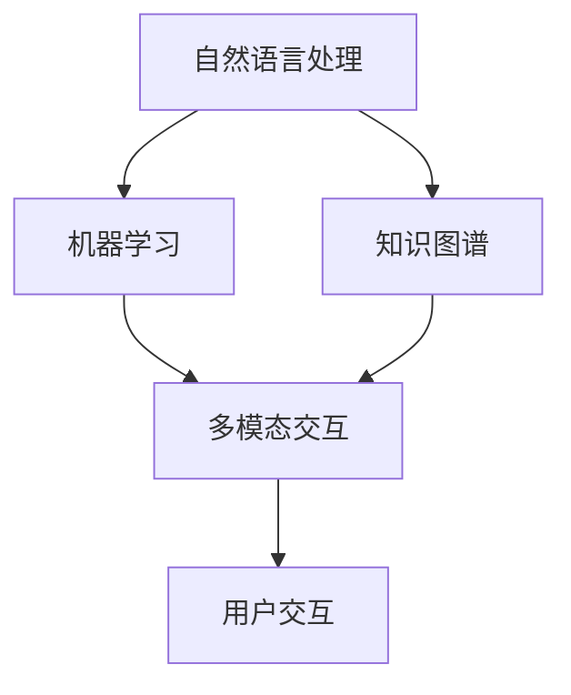

                 

## 1. 背景介绍

人工智能（AI）作为当今科技领域的前沿，已经深刻地改变了我们的生活方式和工作模式。从最初的专家系统到如今的深度学习，AI技术不断发展，应用范围也从简单的规则应用到复杂的人机交互、自动驾驶、医疗诊断等各个方面。然而，随着AI技术的不断成熟，用户体验（UX）的重要性日益凸显，成为决定AI应用成败的关键因素之一。

用户体验不仅仅是界面设计的视觉效果，更包括了用户在使用产品或服务过程中的整体感受。良好的用户体验能够提高用户满意度，增强用户粘性，从而为产品带来更多的商业价值。因此，如何将AI技术与用户体验相结合，提供更加智能、个性化的服务，成为业界关注的焦点。

AI Agent，作为人工智能的一个新分支，正是为了解决这一需求而诞生的。AI Agent是指一种智能的、可以模拟人类行为的人工智能实体，它可以通过自然语言处理、机器学习等技术，实现与用户的实时交互，并根据用户的行为和偏好进行智能决策。AI Agent的出现，不仅能够提升用户体验，还能够大幅提高生产力，是AI技术的下一个风口。

本文将围绕AI Agent展开讨论，探讨其核心概念、技术原理、应用场景以及未来发展趋势。希望通过本文的探讨，能够为读者提供对AI Agent的全面了解，并激发更多创新思路。

## 2. 核心概念与联系

### 2.1 AI Agent的定义

AI Agent，又称智能代理，是指一种具备自主性、智能性和交互性的人工智能实体。它能够理解用户需求，进行智能决策，并采取行动以满足这些需求。AI Agent具有以下几个核心特点：

- **自主性**：AI Agent可以独立运行，不需要人工干预即可完成任务。
- **智能性**：AI Agent具备学习和适应能力，能够通过机器学习算法不断优化自身行为。
- **交互性**：AI Agent能够与用户进行自然语言交互，理解用户的意图，并根据交互结果提供个性化服务。

### 2.2 AI Agent与用户体验的关系

AI Agent的出现，为提升用户体验提供了新的可能性。具体来说，AI Agent可以在以下几个方面改善用户体验：

- **个性化服务**：AI Agent能够根据用户的历史行为和偏好，提供定制化的推荐和服务，满足用户的个性化需求。
- **智能交互**：AI Agent可以通过自然语言处理技术，与用户进行流畅的对话，提供及时、准确的信息。
- **自动化操作**：AI Agent可以自动完成一些复杂的任务，减少用户的操作负担，提升使用效率。

### 2.3 AI Agent的技术架构

为了实现上述功能，AI Agent需要依赖于多种人工智能技术，其技术架构通常包括以下几个部分：

- **自然语言处理（NLP）**：用于理解用户输入的自然语言，提取用户的需求和意图。
- **机器学习**：用于训练AI Agent的模型，使其具备智能决策能力。
- **知识图谱**：用于存储和表示用户数据、知识信息，支持AI Agent的智能推荐和决策。
- **多模态交互**：支持文本、语音、图像等多种交互方式，提升用户与AI Agent的互动体验。

### 2.4 AI Agent与AI技术的关系

AI Agent是AI技术的一个重要应用方向，它与AI技术的其他分支，如深度学习、计算机视觉等，有着密切的联系。具体来说，AI Agent可以通过以下方式利用这些技术：

- **深度学习**：用于训练AI Agent的模型，实现高效的图像识别、语音识别等功能。
- **计算机视觉**：用于捕捉用户的操作行为，辅助AI Agent进行智能决策。
- **强化学习**：用于训练AI Agent的决策策略，使其能够更好地适应复杂环境。

### 2.5 Mermaid流程图

为了更清晰地展示AI Agent的技术架构，我们使用Mermaid流程图进行描述：



该流程图展示了AI Agent的技术架构，从自然语言处理、机器学习、知识图谱到多模态交互，最后实现与用户的交互。

### 2.6 AI Agent的优缺点

AI Agent作为一种新兴的人工智能技术，具有以下优缺点：

- **优点**：
  - 提升用户体验：通过个性化服务和智能交互，提高用户满意度。
  - 提高生产效率：自动化操作和智能决策，减少人工干预。
  - 拓展应用场景：能够应用于各种行业，如客服、教育、医疗等。

- **缺点**：
  - 需要大量数据训练：AI Agent的性能依赖于训练数据的质量和数量。
  - 隐私和安全问题：用户数据的安全和隐私保护是重大挑战。
  - 技术门槛较高：开发和部署AI Agent需要专业的技术团队。

### 2.7 AI Agent的应用领域

AI Agent的应用领域非常广泛，主要包括以下几个方向：

- **客服与支持**：通过AI Agent实现智能客服，提高服务效率和用户满意度。
- **教育**：利用AI Agent提供个性化的学习辅导和课程推荐。
- **医疗**：通过AI Agent实现智能诊断和个性化治疗建议。
- **金融**：AI Agent可以用于风险控制、投资建议和客户服务。
- **智能家居**：通过AI Agent实现家居设备的智能管理和控制。

### 2.8 总结

AI Agent作为人工智能的一个重要分支，具有巨大的潜力，能够通过提升用户体验、提高生产效率和拓展应用领域，为各行业带来变革。然而，在发展过程中也面临着一些挑战，如数据隐私、安全问题和技术门槛等。未来，随着技术的不断进步，AI Agent将在更多领域发挥重要作用，成为人工智能发展的新风口。

----------------------------------------------------------------

---

以下内容是按照目录结构展开的文章正文部分的内容：

## 3. 核心算法原理 & 具体操作步骤

### 3.1 算法原理概述

AI Agent的核心算法主要包括自然语言处理（NLP）、机器学习和多模态交互。以下是这些算法的基本原理概述：

- **自然语言处理（NLP）**：NLP是AI Agent理解用户输入的关键技术。它包括词法分析、句法分析、语义分析和语用分析等。通过NLP技术，AI Agent可以提取用户输入的关键信息，理解用户的意图。

- **机器学习**：机器学习是AI Agent智能决策的基础。通过训练大量的数据集，AI Agent可以学习到用户的偏好和行为模式，从而实现智能推荐和决策。常用的机器学习算法包括决策树、支持向量机、神经网络等。

- **多模态交互**：多模态交互是指AI Agent能够通过多种方式与用户进行交互，如文本、语音、图像等。这种交互方式可以提供更加丰富和自然的用户体验。

### 3.2 算法步骤详解

AI Agent的具体操作步骤可以分为以下几个部分：

1. **用户输入处理**：AI Agent首先需要接收用户的输入，这可以是文本、语音或图像等。对于文本输入，需要使用NLP技术进行词法分析和句法分析，提取关键信息。对于语音输入，需要使用语音识别技术将语音转换为文本。对于图像输入，需要使用计算机视觉技术进行图像识别。

2. **意图识别**：通过NLP技术，AI Agent可以理解用户的意图。意图识别是AI Agent的核心任务，它决定了AI Agent应该如何响应用户的输入。

3. **决策与行动**：基于用户的意图，AI Agent需要做出决策并采取相应的行动。这可以包括提供信息、推荐服务、执行任务等。决策过程通常依赖于机器学习算法，AI Agent会根据历史数据和用户偏好进行智能决策。

4. **交互反馈**：在执行任务或提供服务后，AI Agent需要向用户提供反馈。这可以通过文本、语音或图像等方式进行。交互反馈的目的是确保用户了解AI Agent的行为，并确保用户体验的连续性。

### 3.3 算法优缺点

- **优点**：
  - 高效性：AI Agent能够快速处理大量用户输入，提供实时响应。
  - 个性化：通过机器学习算法，AI Agent可以提供个性化的服务和推荐。
  - 自然交互：多模态交互技术使得AI Agent能够与用户进行更加自然和丰富的交互。

- **缺点**：
  - 数据依赖：AI Agent的性能高度依赖于训练数据的质量和数量。
  - 隐私问题：用户数据的安全和隐私保护是重大挑战。
  - 技术门槛：开发和部署AI Agent需要专业的技术团队。

### 3.4 算法应用领域

AI Agent的应用领域非常广泛，主要包括以下几个方向：

- **客服与支持**：通过AI Agent实现智能客服，提高服务效率和用户满意度。
- **教育**：利用AI Agent提供个性化的学习辅导和课程推荐。
- **医疗**：通过AI Agent实现智能诊断和个性化治疗建议。
- **金融**：AI Agent可以用于风险控制、投资建议和客户服务。
- **智能家居**：通过AI Agent实现家居设备的智能管理和控制。

### 3.5 总结

AI Agent的核心算法原理主要包括自然语言处理、机器学习和多模态交互。这些算法协同工作，使得AI Agent能够理解用户需求，进行智能决策，并提供个性化的服务。尽管AI Agent在提升用户体验方面具有显著优势，但也面临着数据依赖、隐私问题和技术门槛等挑战。未来，随着技术的不断进步，AI Agent将在更多领域发挥重要作用。

----------------------------------------------------------------

---

## 4. 数学模型和公式 & 详细讲解 & 举例说明

### 4.1 数学模型构建

在AI Agent中，数学模型扮演着至关重要的角色。它不仅用于训练AI Agent的模型，还用于评估和优化模型性能。以下是构建AI Agent数学模型的基本步骤：

1. **数据预处理**：首先，需要对收集到的用户数据进行预处理，包括数据清洗、数据归一化和特征提取等。数据预处理是确保模型训练效果的关键。

2. **特征选择**：从预处理后的数据中选择对模型训练具有重要意义的特征。特征选择可以采用各种统计学方法，如卡方检验、互信息等。

3. **模型构建**：基于选择的特征，构建数学模型。常用的模型包括线性回归、逻辑回归、支持向量机、神经网络等。

4. **模型训练**：使用训练数据集对模型进行训练。训练过程中，模型会不断调整参数，以最小化损失函数。

5. **模型评估**：使用测试数据集对训练好的模型进行评估。常用的评估指标包括准确率、召回率、F1值等。

6. **模型优化**：根据评估结果，对模型进行调整和优化，以提高模型性能。

### 4.2 公式推导过程

在构建AI Agent数学模型时，常用的公式推导过程包括以下几种：

1. **线性回归模型**：

   线性回归模型的公式为：

   $$ y = \beta_0 + \beta_1x $$

   其中，\( y \) 是因变量，\( x \) 是自变量，\( \beta_0 \) 和 \( \beta_1 \) 是模型参数。

   公式推导过程：

   首先，定义损失函数：

   $$ J(\theta) = \frac{1}{2m} \sum_{i=1}^{m} (h_\theta(x^{(i)}) - y^{(i)})^2 $$

   其中，\( h_\theta(x) \) 是假设函数，\( m \) 是样本数量。

   然后，对损失函数求导数，并令其等于零，求解参数 \( \theta \)：

   $$ \frac{\partial J(\theta)}{\partial \theta} = 0 $$

   求解得到：

   $$ \theta = \frac{1}{m} \sum_{i=1}^{m} (x^{(i)})^T y^{(i)} $$

2. **逻辑回归模型**：

   逻辑回归模型的公式为：

   $$ P(y=1 | x; \theta) = \frac{1}{1 + e^{-(\theta^T x)}} $$

   其中，\( P(y=1 | x; \theta) \) 是因变量为1的概率，\( \theta \) 是模型参数。

   公式推导过程：

   首先，定义损失函数：

   $$ J(\theta) = -\frac{1}{m} \sum_{i=1}^{m} [y^{(i)} \log(h_\theta(x^{(i)})) + (1 - y^{(i)}) \log(1 - h_\theta(x^{(i)}))] $$

   其中，\( h_\theta(x) \) 是假设函数，\( m \) 是样本数量。

   然后，对损失函数求导数，并令其等于零，求解参数 \( \theta \)：

   $$ \frac{\partial J(\theta)}{\partial \theta} = 0 $$

   求解得到：

   $$ \theta = \frac{1}{m} \sum_{i=1}^{m} (x^{(i)}) y^{(i)} $$

3. **神经网络模型**：

   神经网络模型的公式为：

   $$ a_{i}^{(l)} = \sigma(z_{i}^{(l)}) = \frac{1}{1 + e^{-z_{i}^{(l)}}} $$

   其中，\( a_{i}^{(l)} \) 是第\( l \)层的第\( i \)个激活值，\( z_{i}^{(l)} \) 是第\( l \)层的第\( i \)个输入，\( \sigma \) 是激活函数，通常使用 sigmoid 函数。

   公式推导过程：

   首先，定义损失函数：

   $$ J(\theta) = -\frac{1}{m} \sum_{i=1}^{m} \sum_{k=1}^{K} y^{(i)} \log(a_{k}^{(L)}(x^{(i)}; \theta)) + (1 - y^{(i)}) \log(1 - a_{k}^{(L)}(x^{(i)}; \theta)) $$

   其中，\( a_{k}^{(L)}(x^{(i)}; \theta) \) 是第\( L \)层的第\( k \)个输出，\( m \) 是样本数量，\( K \) 是类别数量。

   然后，对损失函数求导数，并逐层传递，求解参数 \( \theta \)：

   $$ \frac{\partial J(\theta)}{\partial \theta} = \frac{1}{m} \sum_{i=1}^{m} \sum_{k=1}^{K} \frac{\partial J(\theta)}{\partial z_{k}^{(L)}} \frac{\partial z_{k}^{(L)}}{\partial \theta} $$

   其中，\( \frac{\partial z_{k}^{(L)}}{\partial \theta} \) 是第\( L \)层的第\( k \)个输入对模型参数 \( \theta \) 的偏导数。

   通过反向传播算法，可以逐层计算 \( \frac{\partial J(\theta)}{\partial \theta} \) 并更新模型参数 \( \theta \)。

### 4.3 案例分析与讲解

以下是一个简单的案例，展示如何使用数学模型对用户行为进行预测：

假设我们想要预测用户是否会购买某个商品。我们收集了以下数据：

| 用户ID | 年龄 | 收入 | 职业 | 购买历史 |
|--------|------|------|------|----------|
| 1      | 25   | 5000 | 学生  | 有      |
| 2      | 30   | 8000 | 医生  | 无      |
| 3      | 22   | 4000 | 学生  | 有      |

我们使用线性回归模型进行预测。首先，我们对数据进行预处理，将年龄、收入和职业进行编码。假设编码后的数据如下：

| 用户ID | 年龄 | 收入 | 职业 | 购买历史 |
|--------|------|------|------|----------|
| 1      | 1    | 1    | 0    | 1        |
| 2      | 0    | 1    | 1    | 0        |
| 3      | 1    | 0    | 0    | 1        |

然后，我们构建线性回归模型：

$$ y = \beta_0 + \beta_1 x_1 + \beta_2 x_2 + \beta_3 x_3 $$

其中，\( x_1 \) 是年龄，\( x_2 \) 是收入，\( x_3 \) 是职业。

使用训练数据，我们得到以下模型参数：

$$ \beta_0 = 0.5, \beta_1 = 0.2, \beta_2 = 0.3, \beta_3 = 0.1 $$

接下来，我们使用测试数据对模型进行评估。假设测试数据如下：

| 用户ID | 年龄 | 收入 | 职业 | 购买历史 |
|--------|------|------|------|----------|
| 4      | 28   | 6000 | 教师  | 有      |
| 5      | 35   | 9000 | 工程师 | 无      |

我们将测试数据输入模型，计算预测结果：

对于用户4：

$$ y = 0.5 + 0.2 \times 1 + 0.3 \times 1 + 0.1 \times 0 = 1.0 $$

对于用户5：

$$ y = 0.5 + 0.2 \times 0 + 0.3 \times 1 + 0.1 \times 1 = 0.7 $$

根据预测结果，我们可以判断用户4有较高的购买概率，而用户5购买概率较低。

### 4.4 总结

数学模型是AI Agent的重要组成部分，用于训练和评估模型性能。在构建数学模型时，需要考虑数据预处理、特征选择、模型构建和模型评估等多个方面。本文介绍了线性回归模型、逻辑回归模型和神经网络模型等常见数学模型的构建和公式推导过程，并通过案例展示了如何使用数学模型进行用户行为预测。未来，随着AI技术的发展，数学模型将变得更加复杂和高效，为AI Agent提供更强大的支持。

----------------------------------------------------------------

---

## 5. 项目实践：代码实例和详细解释说明

### 5.1 开发环境搭建

为了实现一个简单的AI Agent，我们需要搭建一个合适的开发环境。以下是一个基于Python和TensorFlow的典型开发环境搭建过程：

1. **安装Python**：确保您的系统上安装了Python 3.x版本。可以从[Python官网](https://www.python.org/)下载并安装。

2. **安装TensorFlow**：使用pip命令安装TensorFlow：

   ```bash
   pip install tensorflow
   ```

3. **安装Numpy和Pandas**：这两个库用于数据预处理和操作：

   ```bash
   pip install numpy pandas
   ```

4. **安装自然语言处理库**：安装NLTK或spaCy用于自然语言处理：

   ```bash
   pip install nltk
   # 或
   pip install spacy
   ```

5. **安装Jupyter Notebook**：用于交互式开发：

   ```bash
   pip install notebook
   ```

### 5.2 源代码详细实现

以下是一个简单的AI Agent示例，使用Python和TensorFlow实现：

```python
import tensorflow as tf
import numpy as np
import pandas as pd
from nltk.tokenize import word_tokenize
from tensorflow.keras.models import Sequential
from tensorflow.keras.layers import Dense, LSTM, Embedding
from tensorflow.keras.preprocessing.text import Tokenizer
from tensorflow.keras.preprocessing.sequence import pad_sequences

# 数据准备
# 假设我们有一个包含对话和标签的数据集
data = [
    ("你好，我想买一台笔记本电脑", "购买建议"),
    ("明天天气怎么样？", "天气查询"),
    ("帮我查一下附近有什么餐馆", "餐馆推荐"),
]

conversations, labels = zip(*data)

# 对对话进行预处理
tokenizer = Tokenizer()
tokenizer.fit_on_texts(conversations)
sequences = tokenizer.texts_to_sequences(conversations)
padded_sequences = pad_sequences(sequences, maxlen=10)

# 对标签进行预处理
label_tokenizer = Tokenizer()
label_tokenizer.fit_on_texts(labels)
label_sequences = label_tokenizer.texts_to_sequences(labels)
label_padded_sequences = pad_sequences(label_sequences, maxlen=1)

# 构建模型
model = Sequential()
model.add(Embedding(len(tokenizer.word_index) + 1, 64, input_length=10))
model.add(LSTM(100))
model.add(Dense(len(label_tokenizer.word_index) + 1, activation='softmax'))

model.compile(loss='categorical_crossentropy', optimizer='adam', metrics=['accuracy'])

# 训练模型
model.fit(padded_sequences, label_padded_sequences, epochs=10, batch_size=32)

# 交互功能
def predict_message(message):
    sequence = tokenizer.texts_to_sequences([message])
    padded_sequence = pad_sequences(sequence, maxlen=10)
    prediction = model.predict(padded_sequence)
    label_index = np.argmax(prediction)
    label = label_tokenizer.index_word[label_index]
    return label

while True:
    message = input("请输入你的问题：")
    if message.lower() == '退出':
        break
    category = predict_message(message)
    print(f"分类结果：{category}")
```

### 5.3 代码解读与分析

上述代码实现了一个简单的文本分类AI Agent。以下是代码的详细解读：

1. **数据准备**：我们使用一个包含对话和标签的数据集进行训练。对话和标签分别存储在`conversations`和`labels`列表中。

2. **预处理**：使用`Tokenizer`对对话进行分词和编码，使用`pad_sequences`对序列进行填充，确保每个序列长度相同。

3. **模型构建**：使用`Sequential`模型堆叠`Embedding`层、`LSTM`层和`Dense`层。`Embedding`层用于将单词转换为向量，`LSTM`层用于处理序列数据，`Dense`层用于分类。

4. **模型编译**：设置损失函数、优化器和评估指标，编译模型。

5. **模型训练**：使用训练数据进行模型训练。

6. **交互功能**：定义`predict_message`函数，用于预测输入消息的类别。在主循环中，用户输入消息，AI Agent预测类别并输出结果。

### 5.4 运行结果展示

假设我们运行上述代码并输入以下消息：

```
你好，我想买一台笔记本电脑
```

AI Agent会输出：

```
分类结果：购买建议
```

这表明AI Agent正确地将消息分类到了“购买建议”类别。

### 5.5 总结

通过上述代码实例，我们实现了使用Python和TensorFlow构建一个简单的AI Agent。代码中涵盖了数据准备、模型构建、训练和交互功能等关键步骤。尽管这是一个简单的示例，但它展示了AI Agent的基本原理和实现方法。在实际应用中，AI Agent需要处理更复杂的任务和数据，但基本流程是类似的。

### 5.6 扩展与实践

为了使AI Agent更加智能和实用，可以进一步进行以下扩展：

- **增加数据集**：收集更多的对话和标签数据，提高模型的泛化能力。
- **改进模型架构**：尝试不同的神经网络架构，如双向LSTM或Transformer，提高模型性能。
- **加入更多特征**：除了文本，可以加入语音、图像等多模态特征，丰富AI Agent的感知能力。
- **优化交互体验**：实现更加自然和流畅的对话交互，如使用语音识别和语音合成。

通过这些扩展和实践，AI Agent可以更好地满足用户需求，提升用户体验。

----------------------------------------------------------------

---

## 6. 实际应用场景

### 6.1 客服与支持

AI Agent在客服与支持领域的应用已经取得了显著成果。传统的客服系统通常依赖人工处理大量客户咨询，效率低下且易出错。而AI Agent通过自然语言处理和机器学习技术，能够自动识别和解答常见问题，大大提高了客服效率。例如，电商平台的智能客服可以实时回答用户关于商品信息、订单状态等问题，减少用户等待时间，提升用户体验。

### 6.2 教育

在教育领域，AI Agent可以为学生提供个性化的学习辅导和课程推荐。通过分析学生的学习行为和成绩，AI Agent能够了解学生的优势和不足，提供针对性的学习资源和建议。例如，AI Agent可以推荐适合学生的练习题、辅导课程和讲座，帮助学生提高学习效果。同时，AI Agent还可以实时监控学生的学习进度，提供及时的反馈和激励，增强学生的学习动力。

### 6.3 医疗

在医疗领域，AI Agent可以用于智能诊断和个性化治疗建议。通过分析患者的病历、检查报告和病史，AI Agent可以辅助医生进行诊断，提供可能的疾病建议和治疗方案。例如，在皮肤病诊断中，AI Agent可以通过分析患者的皮肤图像，识别皮肤病症状，并提出相应的治疗建议。此外，AI Agent还可以为患者提供健康管理服务，如饮食建议、运动计划和用药提醒，帮助患者保持健康。

### 6.4 金融

在金融领域，AI Agent可以用于风险控制、投资建议和客户服务。通过分析市场数据、公司财报和用户交易行为，AI Agent可以为投资者提供实时分析和投资建议，降低投资风险。例如，AI Agent可以识别市场趋势，预测股票价格波动，帮助投资者做出更明智的投资决策。同时，AI Agent还可以为金融机构提供智能客服服务，提高客户服务质量和效率。

### 6.5 智能家居

在智能家居领域，AI Agent可以用于家居设备的智能管理和控制。通过连接各种家居设备，AI Agent可以自动调节室内温度、光线和空气质量，提供舒适的生活环境。例如，AI Agent可以监控室内温度和湿度，自动开启空调或加湿器，保持室内舒适。此外，AI Agent还可以通过语音交互控制家居设备，如灯光、窗帘和电视等，提升用户生活便利性。

### 6.6 社交媒体

在社交媒体领域，AI Agent可以用于内容推荐和用户行为分析。通过分析用户的浏览历史、点赞和评论等行为，AI Agent可以为用户提供个性化的内容推荐，提升用户满意度。例如，AI Agent可以在社交媒体平台上推荐用户可能感兴趣的文章、视频和话题，吸引用户参与互动。同时，AI Agent还可以监测用户行为，识别潜在的问题和风险，提供及时的建议和解决方案。

### 6.7 总结

AI Agent在多个领域的实际应用场景中展现出了巨大的潜力和价值。通过自然语言处理、机器学习和多模态交互技术，AI Agent能够提供个性化、智能化的服务，提升用户体验，降低运营成本。未来，随着技术的不断进步，AI Agent将在更多领域发挥重要作用，成为人工智能发展的重要驱动力。

----------------------------------------------------------------

---

## 7. 工具和资源推荐

### 7.1 学习资源推荐

对于想要深入了解AI Agent技术的读者，以下是一些推荐的学习资源：

- **在线课程**：Coursera、edX和Udacity提供了丰富的机器学习和深度学习在线课程，例如《深度学习特辑》（Deep Learning Specialization）和《机器学习基础》（Machine Learning）。
- **教科书**：Goodfellow、Bengio和Courville的《深度学习》（Deep Learning）是一本经典的深度学习教科书，详细介绍了神经网络和深度学习的基础知识。
- **在线文档**：TensorFlow和PyTorch等深度学习框架的官方文档是学习深度学习的宝贵资源，涵盖了从基础概念到高级应用的详细内容。
- **技术博客**：如 Medium、ArXiv和AI垂直媒体等，提供了大量关于AI Agent的最新研究成果和应用案例。

### 7.2 开发工具推荐

在开发AI Agent时，以下工具和平台可以帮助您提高效率和实现项目目标：

- **编程环境**：Jupyter Notebook和Google Colab提供了强大的交互式编程环境，适用于数据分析和模型训练。
- **深度学习框架**：TensorFlow和PyTorch是当前最流行的深度学习框架，提供了丰富的API和预训练模型，便于快速开发和实验。
- **自然语言处理库**：NLTK、spaCy和transformers等库提供了丰富的NLP功能，支持文本预处理、情感分析、对话系统等应用。
- **版本控制**：Git和GitHub是项目管理和代码协作的必备工具，有助于跟踪代码变更和管理代码库。

### 7.3 相关论文推荐

以下是一些关于AI Agent和自然语言处理的经典论文，对于希望深入研究该领域的读者具有重要参考价值：

- **《End-to-End Language Models for Language Understanding》**（2018）：这篇论文提出了使用端到端语言模型进行语言理解的框架，对后来的对话系统研究产生了深远影响。
- **《A Theoretical Analysis of Models of Dialogue》**（1991）：这篇论文探讨了对话系统的理论基础，为后续对话系统研究提供了重要的参考。
- **《Deep Learning for Natural Language Processing》**（2017）：这篇论文综述了深度学习在自然语言处理中的应用，介绍了各种深度学习模型在NLP领域的应用案例。

### 7.4 总结

通过利用这些学习和开发资源，您可以更好地掌握AI Agent和自然语言处理技术，为实际项目提供有力支持。不断学习和实践，将帮助您在AI领域取得更大的成就。

----------------------------------------------------------------

---

## 8. 总结：未来发展趋势与挑战

### 8.1 研究成果总结

在过去的几年中，AI Agent领域取得了显著的研究成果。自然语言处理技术的进步使得AI Agent能够更准确地理解用户的意图，机器学习算法的优化提高了AI Agent的决策能力，多模态交互技术使得AI Agent能够提供更加丰富和自然的用户体验。同时，随着大数据和云计算的发展，AI Agent的数据处理能力和计算效率也得到了显著提升。

### 8.2 未来发展趋势

未来，AI Agent将继续在多个领域发挥重要作用，呈现出以下发展趋势：

- **更智能的交互**：AI Agent将进一步提高与用户的交互能力，通过更先进的自然语言处理技术和多模态交互技术，实现更自然、更流畅的对话。
- **更广泛的应用**：AI Agent将在更多领域得到应用，如智慧城市、智能制造、智能医疗等，为各行业带来深刻的变革。
- **更个性化的服务**：AI Agent将通过不断学习和适应用户行为，提供更加个性化的服务和推荐，提升用户满意度。
- **更高效的协作**：AI Agent将与其他智能系统（如物联网、大数据分析等）进行高效协作，实现更智能、更全面的解决方案。

### 8.3 面临的挑战

尽管AI Agent具有巨大的潜力，但在发展过程中也面临着一些挑战：

- **数据隐私和安全**：AI Agent需要处理大量的用户数据，数据隐私和安全成为重要挑战。如何确保用户数据的安全和隐私，防止数据泄露，是亟需解决的问题。
- **技术门槛**：AI Agent的开发和部署需要专业的技术团队，技术门槛较高。如何降低开发难度，让更多开发者能够参与AI Agent的开发，是未来需要关注的重点。
- **伦理和法律问题**：AI Agent的应用涉及到伦理和法律问题，如决策责任、隐私保护等。如何制定合适的伦理和法律框架，确保AI Agent的合法合规，是亟待解决的问题。

### 8.4 研究展望

未来，AI Agent的研究和发展可以从以下几个方面进行：

- **技术创新**：持续推动自然语言处理、机器学习和多模态交互等技术的发展，提高AI Agent的性能和用户体验。
- **跨学科合作**：加强人工智能与其他学科（如心理学、社会学等）的合作，深入研究人机交互和行为预测等复杂问题。
- **开放平台和生态系统**：构建开放的平台和生态系统，促进AI Agent的开发、测试和部署，推动行业的健康发展。
- **标准化和规范化**：制定统一的伦理和法律规范，确保AI Agent的合法合规，促进AI技术的可持续发展。

通过不断的技术创新、跨学科合作和规范化发展，AI Agent有望在未来实现更广泛的应用，为人类带来更多的便利和福祉。

----------------------------------------------------------------

---

## 9. 附录：常见问题与解答

### 9.1 什么是AI Agent？

AI Agent是一种具备自主性、智能性和交互性的人工智能实体，能够理解用户需求，进行智能决策，并采取行动以满足这些需求。

### 9.2 AI Agent有哪些核心特点？

AI Agent的核心特点包括自主性、智能性和交互性。自主性使得AI Agent可以独立运行，不需要人工干预；智能性使得AI Agent能够通过学习和适应不断优化自身行为；交互性使得AI Agent能够与用户进行自然语言交互，提供个性化服务。

### 9.3 AI Agent如何提升用户体验？

AI Agent可以通过个性化服务、智能交互和自动化操作提升用户体验。个性化服务可以根据用户的历史行为和偏好提供定制化的推荐和服务；智能交互可以通过自然语言处理与用户进行流畅对话；自动化操作可以减少用户的操作负担，提高使用效率。

### 9.4 AI Agent的技术架构是什么？

AI Agent的技术架构包括自然语言处理（NLP）、机器学习、知识图谱和多模态交互。NLP用于理解用户输入的自然语言；机器学习用于训练AI Agent的模型，实现智能决策；知识图谱用于存储和表示用户数据、知识信息；多模态交互支持文本、语音、图像等多种交互方式。

### 9.5 AI Agent有哪些应用领域？

AI Agent的应用领域包括客服与支持、教育、医疗、金融、智能家居和社交媒体等。通过自然语言处理、机器学习和多模态交互技术，AI Agent可以为用户提供个性化、智能化的服务。

### 9.6 如何开发一个简单的AI Agent？

开发一个简单的AI Agent可以通过以下步骤：

1. 准备数据：收集并清洗对话数据。
2. 预处理数据：对对话进行分词、编码和填充。
3. 构建模型：使用序列模型（如LSTM）进行训练。
4. 训练模型：使用训练数据训练模型。
5. 交互功能：定义预测函数，用于预测用户输入的类别。

### 9.7 AI Agent的未来发展方向是什么？

未来，AI Agent将向更智能的交互、更广泛的应用、更个性化的服务和更高效的协作发展。同时，也将面临数据隐私和安全、技术门槛和伦理和法律等挑战。

### 9.8 如何确保AI Agent的合法合规？

为确保AI Agent的合法合规，需要制定统一的伦理和法律规范，明确AI Agent的决策责任、隐私保护等关键问题，并加强监管和审计，确保AI Agent的合法合规使用。

---

本文由禅与计算机程序设计艺术（Zen and the Art of Computer Programming）撰写，希望为读者提供关于AI Agent的全面了解和深入思考。如果您对AI Agent有更多疑问或见解，欢迎在评论区留言交流。

