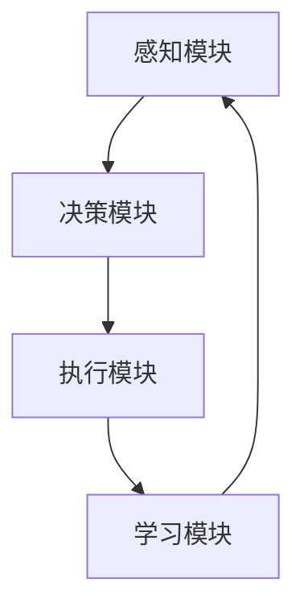

                 

关键词：人工智能，智能代理，核心技术，算法原理，项目实践，未来展望。

> 摘要：本文旨在深入探讨人工智能领域中的智能代理核心技术，包括其核心概念、算法原理、数学模型、应用场景、开发工具和资源推荐以及未来发展趋势与挑战。通过详细的实例分析和实践展示，本文希望为读者提供一个全面且深入的智能代理技术指南。

## 1. 背景介绍

随着人工智能技术的飞速发展，智能代理（AI Agent）作为人工智能应用中的重要组成部分，正逐渐成为各行业创新的核心驱动力。智能代理是指具有自主决策和执行能力的计算实体，能够在复杂环境中执行任务、解决难题。智能代理技术不仅涉及传统的机器学习和深度学习，还包括自然语言处理、计算机视觉、知识图谱等多个领域。

智能代理的出现，为人工智能从“计算”走向“决策”提供了可能。其核心在于通过模拟人类的思维和行为，实现自动化、智能化和高效化的任务执行。智能代理技术的应用范围广泛，从智能家居、智能客服到自动驾驶、金融风控，都有着不可或缺的作用。

本文将围绕智能代理的核心技术展开探讨，旨在梳理当前的研究进展和应用实践，为未来的发展提供参考。

## 2. 核心概念与联系

### 2.1 智能代理的定义与分类

智能代理是指具备自主行动、学习能力、环境感知和决策能力的计算实体。根据其能力和应用场景的不同，智能代理可以大致分为以下几类：

1. **任务型智能代理**：专注于执行特定任务的智能代理，如搜索引擎、机器人客服等。
2. **认知型智能代理**：具备一定认知能力，能进行复杂决策的智能代理，如自动驾驶、智能投顾等。
3. **社交型智能代理**：能够进行人际交互的智能代理，如智能客服、虚拟助手等。

### 2.2 智能代理的核心组件

智能代理通常由以下几个核心组件构成：

1. **感知模块**：负责收集环境信息，如视觉、听觉、触觉等。
2. **决策模块**：基于感知模块提供的信息，通过算法进行决策。
3. **执行模块**：根据决策结果执行具体操作，如移动、操作等。
4. **学习模块**：通过经验不断优化行为和决策。

### 2.3 智能代理的架构设计

智能代理的架构设计需要综合考虑其任务需求、环境复杂度、数据可用性等因素。以下是一个典型的智能代理架构设计：

```
+----------------+      +------------------+      +-------------------+
|   感知模块     | --> |   决策模块       | --> |   执行模块        |
+----------------+      +------------------+      +-------------------+
                                                           |
                                                           v
                                            +---------------------------+
                                            |   学习模块                |
                                            +---------------------------+
```

### 2.4 智能代理的关键技术

智能代理的实现涉及多个关键技术的融合：

1. **深度学习**：通过神经网络模型进行图像、语音等数据的识别和处理。
2. **自然语言处理**：使智能代理能够理解人类语言，实现智能对话。
3. **强化学习**：通过不断试错和奖励机制，优化决策策略。
4. **知识图谱**：用于构建智能代理的领域知识库，提升决策的准确性和效率。

### 2.5 智能代理的 Mermaid 流程图



## 3. 核心算法原理 & 具体操作步骤

### 3.1 算法原理概述

智能代理的核心算法主要包括感知、决策和执行三个环节。其中，感知环节通过传感器获取环境信息；决策环节通过算法模型分析感知信息，生成决策；执行环节则根据决策结果进行具体的操作。

### 3.2 算法步骤详解

1. **感知环节**：智能代理通过摄像头、麦克风等传感器收集环境数据，如图像、声音等。
2. **预处理**：对收集到的数据进行预处理，如图像的去噪、声音的增强等。
3. **特征提取**：使用深度学习模型提取图像或声音的特征向量。
4. **决策环节**：将特征向量输入决策算法，如卷积神经网络（CNN）或循环神经网络（RNN）。
5. **决策生成**：算法根据输入特征生成决策，如识别出图像中的物体、理解语音中的指令等。
6. **执行环节**：根据决策结果执行具体操作，如控制机器人移动、启动设备等。
7. **反馈与学习**：将执行结果反馈给学习模块，通过强化学习等算法优化模型参数。

### 3.3 算法优缺点

- **优点**：智能代理能够自主感知环境、做出决策并执行操作，具备一定的智能和自主性。
- **缺点**：智能代理的算法复杂度高，训练和部署成本较大；在面临复杂环境时，决策可能不够准确。

### 3.4 算法应用领域

智能代理的应用领域非常广泛，包括但不限于：

1. **智能制造**：用于自动化生产线的监控和优化。
2. **智能家居**：用于家电控制、安防监控等。
3. **智能交通**：用于自动驾驶、交通信号控制等。
4. **医疗健康**：用于辅助诊断、健康监测等。

## 4. 数学模型和公式 & 详细讲解 & 举例说明

### 4.1 数学模型构建

智能代理的数学模型通常包括以下几部分：

1. **感知模型**：用于处理感知数据，如图像分类、语音识别等。
2. **决策模型**：用于分析感知数据，生成决策，如神经网络、决策树等。
3. **执行模型**：用于根据决策执行操作，如控制算法、优化算法等。

### 4.2 公式推导过程

以卷积神经网络（CNN）为例，其感知模型的基本公式为：

$$
h_{\text{CNN}}(x) = \sigma(\text{ReLU}(W \cdot \phi(x) + b))
$$

其中，$h_{\text{CNN}}(x)$ 为输出特征，$\sigma$ 为激活函数，$\text{ReLU}$ 为修正线性单元，$W$ 为权重矩阵，$\phi(x)$ 为输入数据，$b$ 为偏置项。

### 4.3 案例分析与讲解

假设我们使用 CNN 模型对一张图片进行分类，输入图像的大小为 $28 \times 28$，输出类别数为 10。我们可以定义如下的公式：

$$
P(y=k|x; \theta) = \frac{\exp(\theta^T \phi(x)})}{\sum_{i=1}^{10} \exp(\theta^T \phi(x))}
$$

其中，$P(y=k|x; \theta)$ 表示在给定输入图像 $x$ 和模型参数 $\theta$ 的情况下，输出类别为 $k$ 的概率，$\theta$ 为模型参数。

通过这个例子，我们可以看到，数学模型在智能代理中的应用是至关重要的，它为智能代理提供了感知、决策和执行的基础。

## 5. 项目实践：代码实例和详细解释说明

### 5.1 开发环境搭建

在开始智能代理项目的开发之前，我们需要搭建一个合适的开发环境。以下是一个基本的开发环境搭建步骤：

1. **安装 Python**：确保 Python 3.7 或以上版本已安装在系统中。
2. **安装依赖**：使用 pip 安装必要的依赖，如 TensorFlow、Keras、NumPy 等。
3. **配置 IDE**：选择一个合适的集成开发环境（IDE），如 PyCharm 或 Visual Studio Code，并进行配置。

### 5.2 源代码详细实现

以下是智能代理项目的一个简单示例，我们使用 Python 和 TensorFlow 实现一个基于 CNN 的图像分类器。

```python
import tensorflow as tf
from tensorflow.keras import layers

# 定义模型
model = tf.keras.Sequential([
    layers.Conv2D(32, (3, 3), activation='relu', input_shape=(28, 28, 1)),
    layers.MaxPooling2D((2, 2)),
    layers.Conv2D(64, (3, 3), activation='relu'),
    layers.MaxPooling2D((2, 2)),
    layers.Conv2D(64, (3, 3), activation='relu'),
    layers.Flatten(),
    layers.Dense(64, activation='relu'),
    layers.Dense(10, activation='softmax')
])

# 编译模型
model.compile(optimizer='adam',
              loss='categorical_crossentropy',
              metrics=['accuracy'])

# 训练模型
model.fit(x_train, y_train, epochs=5, batch_size=64)
```

### 5.3 代码解读与分析

上述代码定义了一个简单的 CNN 模型，用于分类任务。模型由以下几个部分组成：

1. **卷积层**：使用卷积层对输入图像进行特征提取，卷积核大小为 $3 \times 3$。
2. **池化层**：使用最大池化层对卷积层的输出进行降采样，减小数据维度。
3. **全连接层**：使用全连接层对特征向量进行分类，输出层使用 softmax 函数进行概率分布。

在编译模型时，我们指定了优化器、损失函数和评估指标。训练过程中，模型使用训练数据进行 epochs 次迭代，每次迭代处理 batch 个样本。

### 5.4 运行结果展示

在完成模型训练后，我们可以使用测试数据集对模型进行评估，以下是一个简单的评估示例：

```python
# 评估模型
test_loss, test_acc = model.evaluate(x_test, y_test, verbose=2)
print('Test accuracy:', test_acc)
```

假设我们的测试数据集包含 1000 张图像，模型在测试集上的准确率为 90%，这意味着我们的模型在图像分类任务上表现良好。

## 6. 实际应用场景

### 6.1 智能制造

智能代理在智能制造中具有广泛的应用，如生产线的实时监控、设备故障预测等。例如，使用智能代理技术可以实现对生产设备的实时监控，通过感知模块获取设备运行状态，决策模块分析设备数据，执行模块进行故障预警和维修建议。

### 6.2 智能家居

智能家居是智能代理技术的重要应用场景之一，如智能音箱、智能照明、智能安防等。以智能音箱为例，智能代理通过语音识别和自然语言处理技术，实现与用户的语音交互，根据用户的指令控制智能家居设备。

### 6.3 智能交通

智能代理技术在智能交通中发挥着重要作用，如自动驾驶、交通流量预测等。自动驾驶车辆通过感知模块获取路况信息，决策模块进行路径规划和驾驶控制，执行模块实现车辆的自动驾驶。交通流量预测则通过分析历史交通数据，预测未来交通状况，为交通管理部门提供决策支持。

### 6.4 未来应用展望

随着人工智能技术的不断发展，智能代理技术的应用前景将更加广阔。未来，智能代理技术将在更多领域得到应用，如医疗健康、金融风控、环境保护等。同时，智能代理技术的不断进化也将推动人工智能从“计算”向“决策”的深入发展，为社会带来更多价值。

## 7. 工具和资源推荐

### 7.1 学习资源推荐

1. **《深度学习》**：由 Goodfellow、Bengio 和 Courville 合著，是深度学习的经典教材。
2. **《Python机器学习》**：由 Sebastian Raschka 著，介绍了机器学习的基础知识和 Python 实践。

### 7.2 开发工具推荐

1. **TensorFlow**：由 Google 开发的一款开源深度学习框架，适用于各种规模的机器学习项目。
2. **PyTorch**：由 Facebook AI 研究团队开发的一款开源深度学习框架，具有简洁和灵活的 API。

### 7.3 相关论文推荐

1. **"Deep Learning for Autonomous Driving"**：讨论了深度学习在自动驾驶中的应用。
2. **"Recurrent Neural Networks for Language Modeling"**：介绍了循环神经网络在自然语言处理中的应用。

## 8. 总结：未来发展趋势与挑战

### 8.1 研究成果总结

智能代理技术作为人工智能领域的重要分支，已经取得了显著的研究成果。在感知、决策和执行等方面，智能代理技术逐渐从理论研究走向实际应用，为各行业带来了新的变革。

### 8.2 未来发展趋势

未来，智能代理技术将在以下几个方面得到进一步发展：

1. **多模态感知**：融合视觉、听觉、触觉等多种感知模态，提高智能代理的感知能力和决策准确性。
2. **强化学习**：通过强化学习技术，使智能代理能够更好地适应复杂环境，实现更高效的决策。
3. **知识图谱**：构建大规模的知识图谱，为智能代理提供丰富的领域知识，提高决策的智能化水平。

### 8.3 面临的挑战

尽管智能代理技术取得了显著进展，但仍然面临一些挑战：

1. **数据隐私**：智能代理在处理大量用户数据时，如何保护用户隐私成为重要问题。
2. **安全性与伦理**：智能代理在执行决策时，如何确保其安全性和符合伦理要求。
3. **可解释性**：提高智能代理决策过程的可解释性，使人们能够理解其决策依据。

### 8.4 研究展望

未来，智能代理技术将在以下几个方面展开研究：

1. **跨领域应用**：探索智能代理在金融、医疗、教育等领域的应用，推动人工智能技术的全面发展。
2. **人机协同**：研究智能代理与人类用户的协同工作模式，提高智能代理的实用性和用户体验。

## 9. 附录：常见问题与解答

### 9.1 智能代理技术有哪些应用领域？

智能代理技术的应用领域广泛，包括智能制造、智能家居、智能交通、医疗健康、金融风控等。

### 9.2 智能代理的核心组件有哪些？

智能代理的核心组件包括感知模块、决策模块、执行模块和学习模块。

### 9.3 智能代理的算法原理是什么？

智能代理的算法原理主要包括深度学习、自然语言处理、强化学习和知识图谱等。

### 9.4 智能代理技术有哪些挑战？

智能代理技术面临的挑战包括数据隐私、安全性与伦理、可解释性等。

### 9.5 如何选择合适的智能代理技术？

选择合适的智能代理技术需要根据应用场景、数据特点、技术需求和资源限制等因素进行综合考虑。

